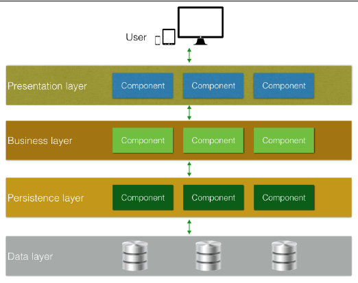
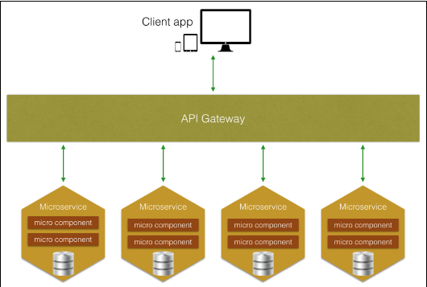
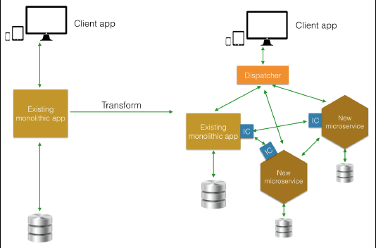
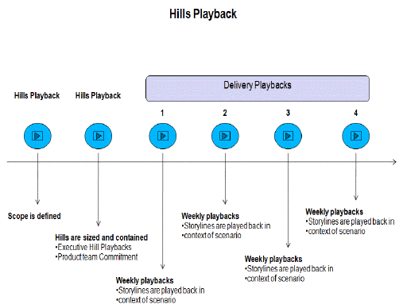
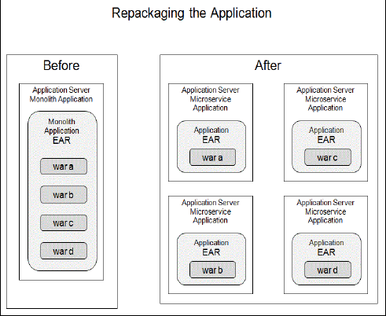
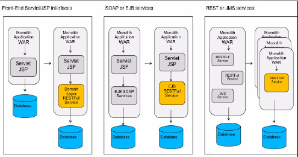
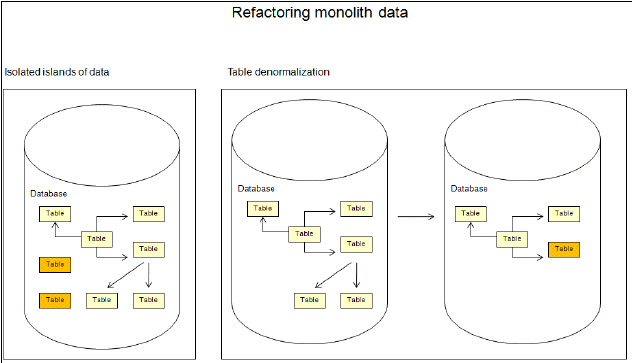

# 演化策略
微服务的演化架构以及如何识别整体应用程序适合演化为微服务架构

**标签:** Java,云计算

[原文链接](https://developer.ibm.com/zh/articles/j-cn-java-and-microservice-5/)

IBM Developer

发布: 2017-03-16

* * *

本文将探讨微服务的演化架构，介绍在建立微服务策略时要考虑的流行模式。还将通过案例分析简要介绍如何实施这些策略。

## 微服务：演化架构的性质

架构通常是按照据预定义的原则来创建的，这些原则有助于反映企业的业务策略目标。业务模式可能很少改变，但在当今环境中，企业希望建立高度可扩展的业务来应对更多的交易并为更多的客户服务。他们需要有灵活的运营流程来快速进军新市场，并提高现有市场中的创新能力。一些不变的共同目标催生了一组架构原则，促使企业以进化方式搭建、设计、实现和运行 IT 系统。演化架构的最重要原则之一是，能够支持技术和业务领域的多个维度上的持续和增量变化。

软件的传统架构元素可能很难改变。这意味着在制定决策并设计和实现组件后，很难更改系统的架构。随着分层架构和实施这些架构的模式不断出现，设计系统的方式已发生了一些变化。图 1 显示了一种推动系统演化的典型分层架构的示例。

##### 图 1 一个分层架构示例

借助分层架构，很容易在每层实现更改，而不会影响系统的其他部分。例如，如果想更改持久性层中的一个组件，此更改在理论上对业务和数据库层的影响很小，对演示层没有影响。这代表着一定程度的演化，系统有 4 个不断演化的机会；4 个不同层中的每一个层都可以演化。但是，这种演化仅能在一个维度上实现：架构的技术方面。

向架构中增加业务领域视角后，该视角没有演化维度。根据更改需求，在业务领域中实现更改可能很难；业务领域中的更改通常需要触及系统的不同模块或层。例如，通常很难对系统提供的服务的客户执行更改，包括相关信息和流。出现困难是因为，客户的某些部分位于业务层，而其他部分分散在数据层、演示层和其他层。

微服务架构在性质上是一种演化架构。它的典型特征之一是，每个服务形成自己的有界上下文，在操作上与系统中的其他所有服务都不同。从很大程度上讲，该架构的技术方面完全封装在系统中的每个服务内。您可以轻松地从系统中取出一个服务，放入另一个服务来取代它，而不会影响其他服务。这是由于该架构风格中包含的高度解耦原则。因此，微服务架构更加灵活。这种灵活性带来了演化系统中每个服务的能力。

图 2 展示一种典型微服务架构的架构概略图示例。请注意，API 网关是微服务架构的一种强制要求。但是，通过将 API 请求路由到合适的微服务，可以让 API 网关处理不同的请求，这非常不错。如果使用 API 网关，请小心设计和实现它，以避免服务之间的耦合。每个微服务都可以有多个微组件，这些组件可能分散在不同的层中。图 1 展示了微服务类型。

##### 图 2 微服务架构中的更多可演化维度

## 演化实践和模式

拥有一种演化架构，对构建更灵活的业务模型很重要。本节介绍可用作演化架构的推动力的实践和模式。

### 持续集成、持续交付

持续集成 (CI) 是一种软件开发实践，其中软件开发人员频繁地（通常是每天）集成他们的工作，导致每天多次进行集成。这种首选实践背后的思路是，尽早隔离潜在的集成问题，以解决可能发生的问题。CI 通过一种自动化流程提供支持，该流程包含构建和测试活动，以便快速验证每次构建和检测集成错误。因为可以更早隔离和发现潜在问题，所以 CI 有助于在开发期间显著减少集成问题，最终有助于快速交付产品。

CI 通常与持续交付 (CD) 结合使用，后者指的是不断将每个通过测试的良好构建版本发布到生产中。通过采用 CI 和 CD，开发人员可以减少花费在修复错误上的时间，增加花费在开发新功能或增强现有功能上的精力。CI 和 CD 的采用带来了更高业务价值的影响。

CI 和 CD 受到在开发周期的每个步骤（包括创建基础架构的步骤）中利用自动化的驱动。由于云技术及 CI 和 CD 工具的出现和日趋成熟，自动化也已演化。CI 和 CD 都在架构的演化过程中发挥着关键作用。

### Strangler 应用程序

Martin Fowler 在 2004 年发表的原创文章《 _Strangler 应用程序_ 》中引入了术语 _Strangler 应用程序_ 。在此模式下，一个新系统会捕获并拦截对成熟应用程序的调用，将它们路由到其他处理函数，并逐步替换这些应用程序。从第一步开始重写整个现有系统具有一定的风险；与切换(cut-over) 重写方法相比，Strangler 应用程序方法减少了更多风险。在从整体式架构朝微服务架构转变的过程中，能够以增量方式重构整体式应用程序。您逐步构建一个由微服务组成的新应用程序；然后将此应用程序与该整体式应用程序一起运行。随着时间的推移，整体式应用程序处理的功能会逐步减少，直到完全消失或成为新微服务的一部分。图 3 描述了使用 Strangler 应用程序模式的转变过程。

##### 图 3 逐步替代一个应用程序

使用 Strangler 应用程序模式，得到的架构仍然拥有之前的整体式应用程序和新服务。该架构还有另外两个主要组件：

- 调度程序：此组件可用作一个请求路由器，它处理传入请求的方法是：将与新功能对应的请求路由到新服务，将以前的请求路由到现有的整体式应用程序。
- IC：这些组件位于新服务、整体式应用程序或同时位于二者中。它们负责将整体式应用程序与新创建的服务集成。您可以不完全替换整体式应用程序的各部分；可以将它们包装为一个记录系统，让它以一组应用编程接口 (API) 的形式存在。

演化架构的一个原则是随时准备处理未知情况，也就是说，对未来的发展保持前瞻性而不是预测性。在自然演化的影响下，您现在构建的功能在未来会变过时并被替代。因此，这种在成熟应用程序逐步消失的过程中设计新的应用程序油然而生。

### 演化数据库重构和部署

通常，数据库（更确切地讲，数据库中的数据）是 IT 系统内最重要的资产。在您的系统演化时，还必须更改该资产，以便与应用程序代码更改保持一致。这里的数据库更改既包括数据库结构更改，也包括数据从旧结构向新结构的迁移。您甚至可能需要考虑在不同类型的数据库之间迁移。例如，将数据库的部分或全部内容从关系数据库管理系统 (RDBMS) 转变为 NoSQL 风格。这种情况下的数据重构和迁移更具挑战性。不幸的是，传统的数据库更新工具和流程不够创新和成熟，无法赶上应用程序开发方法的快速发展节奏。这种情况可能会阻碍应用程序的快速发布。

我们需要一种受自动化支持的新型数据库变更管理和部署方法，以便在像微服务架构这样的演化架构中执行持续更改和增量更改。本节将讨论一些技术，将它们作为让数据库更改的演化与应用程序代码更改更加一致的建议做法。在《重构数据库：演化数据库设计》一书中，Scott Ambler 和 Promod Sadalage 介绍了在制定数据库重构策略时可用作指南的 13 条经验教训。这些经验教训为数据重构的 3 个步骤提供了基础：将大更改分解为小更改，对更改执行版本控制，并自动化数据库部署。

#### 将大更改分解为小更改

如果您要执行一项较大的数据库更改，可将它拆分为更小的更改；让它们成为一些小型的、可单独测试的更改。每项更改通常是数据库结构更改、数据迁移和关联的访问代码的组合。通过这种方式，可以快速隔离更改可能在这些小片段中产生的任何可能故障，随后采取相应措施来对它们进行更正。这种分解的目的也是将数据库更改映射到使用这些更改的应用程序功能。这有助于以增量方式持续地将更改部署到同一个敏捷流程中。

#### 对更改执行版本控制

要执行版本控制，可以先根据需要组织数据库更改脚本。确保更改脚本存储在与应用程序源代码相同的存储库中。另外，确保您拥有与代码相同的目录结构和命名约定。这样，您就可以让数据库更改与需要这些更改的特定版本中的特定应用程序更改保持一致。在结构上保持一致后，在数据库更改脚本上应用版本控制。此过程有助于简化数据库更改的部署，为数据库团队与其他团队的协调和协作提供共同基础。

#### 自动化数据库部署

自动化是管理和部署演化数据库更改的关键。确保应用程序代码更改与数据库更改一致。为此，在合适的粒度水平上进行分解，重组数据库更改脚本，并应用版本控制。完成这一步后，您就拥有了一种受自动化支持的、更支持演化的数据库部署方法。然后，可以通过使用敏捷 CI 和 CD 实践，采用与应用程序代码部署类似的方式实现数据库部署自动化。

## 演化架构实战

本节将介绍如何应用演化方法，构建一种支持不断更改的更灵活架构。本节通过虚构公司 A 的一个示例应用程序的案例分析来演示此方法。技术架构通常受业务策略需求推动。 [第 1 部分”微服务”](https://www.ibm.com/developerworks/cn/java/j-cn-java-and-microservice-1st/index.html) 介绍了为帮助您开始为整体式应用程序构建演化策略而需要满足的业务需求。

以下基本步骤可作为转型指南：

1.从产品数据开始实施演化策略：客户在其网站上查找产品数据时遇到麻烦。目的是让数据可用并采用一种更交互式的方式呈现它们。通过将数据迁移到 Elasticsearch 数据库，客户能执行更强大的搜索。这可作为在云上构建新微服务的起点，所以考虑将数据迁移到 NoSQL 模型，建立新索引，并部署到云环境。

2.继续处理帐户服务，获取客户的更多信息，以便个性化提供给他们的内容。这种个性化可改善客户体验。可通过将现有客户数据与社交数据相结合来满足这一需求，实现一种基于 JSON 的潜在的新数据模型。

3.将部分客户数据迁移到云。考虑一种混合云集成模式，以解决之前的数据源与新创建的数据源之间的数据同步问题。

4.优化用户界面 (UI) 层，以便更好地服务用户。首先从支持移动平台开始，然后使用微服务方法，根据新数据模型以增量方式更新 UI。

5.订购是转换和迁移的最后一步。要转换为微服务，首先可以围绕当前的订购组件创建一组 API，以便提高灵活性和解耦程度。这使您能为未来的步骤做好准备。

### 逐步转变为目录服务

关于公司 A 提供的产品的信息是该公司业务的核心数据集。让客户能够以最轻松和交互的方式访问该数据，这是架构取得成功的关键因素。产品相关组件是启动演化策略的不错候选组件。得到的工件可能是一个新微服务，它在云环境中运行，以实现恢复和扩展能力。在此示例中，Catalog 服务是新服务的名称。因为产品逻辑完全被移动到新微服务，所以数据也必须逐步迁移到同一个云平台。这消除了新服务需要调用数据库来填充数据时可能产生的任何延迟。

实现新目录的技术有许多。但是，在考虑演化方法的同时，还要考虑保持整体式应用程序（基于 Java）中使用的相同技术栈，以避免同时执行大规模更改。可以根据业务需求，根据制定架构决策时市场上已有的特定技术的可用性和成熟度，在以后的步骤中更改技术栈。为了将服务代码快速部署到运行时实例中，云平台（比如 IBM Cloud）提供了各种不同的选择。新创建的 Catalog 服务的数据也可以先保存在关系数据库管理模型中，以避免任何大的更改。

下一步是将数据迁移到更加现代的、轻量的 NoSQL 和 JSON 模型，以改善搜索体验。

### 替代客户和订单组件

业务持续性对公司 A 很重要，因此必须小心完成转型过程，在转型过程中不得中断服务。为了减轻系统宕机的风险，可以使用 Strangler 应用程序技术。

与客户相关的业务组件和数据被分解和转换为更善于演化的新模型，但与此同时，旧组件将继续并行运行。流往旧客户和组件的流量被逐渐转移到新创建的服务。

### 以进化方式将用户界面转换为 UI 微服务

公司 A 的一个业务需求是扩展系统，以涵盖使用移动设备的客户。此背景下的客户包括现有客户和潜在的新客户。为了满足该需求，执行了以下主要步骤，将它们作为将用户界面转换为微服务架构的参考步骤：

- 更改 CustomerServiceDojo 模块以支持移动用户，并朝响应式设计方法更进一步。
- 通过采用了响应式设计的客户端库（例如 Bootstrap 和 Angular）来改善用户体验，让 UI 更加模块化且更容易更改。
- 首先将 UI 层迁移到云环境，以便更快地开发、部署和适应更改。

接下来，将介绍如何识别整体式应用程序中适合采用微服务架构和实践的候选者，还将介绍如何设计和重构新组件。

## 识别候选功能

适合演化为微服务架构的候选整体式应用程序，是包含会导致任何以下情形的组件的整体式应用程序：

- 由于难以维护、修改和快速产生成效，导致推出新服务的上市周期很长，所以您无法足够快地部署应用程序来满足需求。或许业务部门需要一个新功能来利用新的市场机会，或者您希望链接到一个新社交媒体服务。在任何一种情况下，您都无法及时构建、测试和部署应用程序。
- 您无法应用单一部署。即使是细微的更改或增强，构建、测试和部署它们通常也要涉及其他模块或组件，因为同一个 .ear 或 .war 文件包内不存在模块和组件分离。
- 只有一种技术选择，而且您不能利用其他企业采用的新技术、库或技巧。这种情况可以通过多种方式来说明。或许您当前的技术栈不支持您需要的功能。例如，您想自动从代码生成文档，或者您想链接到新服务，但您的系统或平台中目前使用的技术没有提供这些功能。
- 您的大型系统拥有以下特征：

– 内存中包含大量数据

– 操作的 CPU 使用率很高

– 无法扩展应用程序的一部分；通常必须扩展整个应用程序

– 无法轻松地更新和维护

– 代码依赖关系难以管理

- 由于代码的复杂性和大规模，很难培训新的开发人员。

## 转变为微服务的考虑因素

在转变为微服务之前，请考虑以下重要方面：

- 开发平台的灵活性

微服务支持灵活地为工作选择正确工具；它的思路是每个微服务都可以通过一种不同的技术（语言和数据存储）提供支持。根据特定服务的需求，为系统的不同部分提供不同的数据存储技术可能会更好一些。类似地，微服务可以使用不同的语言；这使您能为特定问题选择首选语言，而不是遵循标准。

- 根据功能和职责进行设计

微服务实现了组件和职责的分离：每个微服务负责一个确定的主题。这样，您就可以在系统的特定部分中应用新功能或改进，避免错误，以及避免损害正常工作的系统部分。这种方法也可用于隔离旧功能；可通过添加微服务来向整体式系统添加新功能。

- 轻松地重写完整的服务

通常，微服务是容易重写、维护和更改的小型服务，它们提供了强大的封装模型，以及安全的重构和重写方式。

- 灵活地执行更改

对于微服务，您可以根据您对系统和领域的了解加深，推迟决策及灵活地增强架构。您可以将困难的决策（比如有关数据存储技术的决策）推迟到绝对需要它们时。例如，一个服务提供的唯一功能是对一个数据存储器执行领域感知的瘦包装，但要正确实现的最重要功能是其他服务交互的接口。

- 创造业务价值

业务负责人看到了微服务的好处，因为他们希望其团队能够快速响应新的客户和市场需求。如果采用整体式应用程序开发方法，IT 响应很缓慢。微服务更符合业务需求，因为它们支持比整体式服务更频繁和更快地交付。微服务使业务负责人能够快速获取反馈并相应地调整其投资。

其他益处如下：

– 团队关注范围更小，使业务负责人能够更轻松、更有效地管理资源，例如将资源从低影响力业务区域移到更高影响力区域。

– 通过扩展单个微服务来消除瓶颈，实现更流畅的用户体验。

– 识别和消除重复服务，从而减少开发成本。

- 灵活扩展的能力

采用微服务，可扩展系统的不同部分；每个微服务负责特定的功能，这样就可以实现更灵活的扩展。

- 安全分区

安全架构师坚持采用分层方法来构建系统，以避免让重要代码在 Web 服务器上运行的风险。微服务可提供分区功能，这类似于传统的分层方法。业务逻辑和关键数据存储可与负责呈现 HTML 的服务分开。可为各个微服务之间的通信设置防火墙、加密和执行其他保护方法。

- 团队技能

对于微服务，团队可以按技能或位置进行分组，避免让不同团队处理同一个代码库的相关风险或困难。

## 将整体式应用程序分解为微服务

本节介绍将整体式应用程序分解为微服务的技术。

### 设计微服务

微服务架构的一个重要优势是，可自由决定对每个服务使用的技术栈和微服务大小。存在这种自由是因为，微服务架构首先对用户体验有清楚的了解。

**使用设计思维来限定和识别微服务**

_设计思维_ 是一种构想整体用户体验的流程。不再专注于一项功能，微服务专注于用户体验（也就是说，用户拥有该体验时的想法、行为和感觉）。设计思维有助于将工作范围限定到适用的、可发布的功能单元。这种设计有助于更轻松地从功能上分解和识别微服务。设计思维包含以下概念：

- Hills
- Hills Playback
- 方案
- 用户案例
- Epic
- 赞助用户
- 识别微服务机会

#### Hills

Hill 是对您的发布时间表的业务目标的表述。Hill 定义了您希望谁使用哪些资源来如何实现目标。团队通常为每个项目确定 3 个 Hill 和一个技术基础。Hill 传达 _领导者的意图_ ，允许团队自行决定如何解释和实施一种提供流畅用户体验的解决方案。Hill 的定义必须以用户为目标，它必须是可度量的。在使用 Hill 时，避免使用模糊或无法量化的目标。示例 1 给出了一个示例 Hill。

示例 1 示例 Hill

#### Hills Playback

Hills Playback 提供团队想要实现的目标的摘要。Hills Playback 设定特定发布时间段的工作范围。Playback Zero 是团队完成组建，并向业务赞助者提供其想要实现的成果的时刻。Playback 由来自跨职能团队的参与者和尝试执行 Hill 的赞助用户每周执行一次。图 4 展示了一个 Hills Playback 时间表。

##### 图 4 Hills Playback 时间表

#### 方案

方案是一个实现某种体验的工作流，它设定 Hills Playback 中使用的案例和上下文。大型方案可进一步分解为场景和产品用户案例。方案获取”现状”方案并制定”目标”方案。

#### 用户案例

用户案例是一个独立的、可编码的需求，可在一两天内开发完成。用户案例是用用户体验来表达的，例如”作为开发人员，我想找到示例并快速将它们部署到 IBM Cloud，以便我可以试用它们。”

#### Epics

Epics 将案例分组为一种可在整个方案中多次重用的形式，以避免案例出现重复。

#### 赞助用户

赞助用户是全程参与项目，代表项目的目标用户的用户。他们应该领导或参与 Playback。赞助用户可以是使用包含微服务的应用程序的客户。他们也可以是内部开发人员，使用您开发的微服务入门工具来支持您的 DevOps 发布流程。

#### 识别微服务机会

对于每种设计，识别一个服务在其他设计中的潜在重用机会。”Hill”中给出的 Hill 定义针对的是使用 IBM Cloud 的 iOS 解决方案。

根据这个 Hill 示例，您有以下需求：

- 能够部署到 IBM Cloud 和其他网站
- 能够作为单独服务部署到 IBM Cloud
- 能够部署到 IBM Cloud 微服务团队

Deploy to IBM Cloud 微服务团队负责实现该服务。该团队还负责对使用该微服务的案例执行功能和系统集成测试。该服务包含日志数据，用于收集使用情况信息。这有助于更好地量化微服务对业务的影响。它显示了部署的最流行应用程序，以及在用户部署一个示例后的用户跟踪信息。

### 选择实现技术栈

因为微服务系统由各个作为不同进程运行的服务组成，所以我们希望任何能支持通信或消息协议的合格技术都可使用。举例而言，通信协议可能是 HTTP 和 REST；消息协议可能是 MQ 遥测传输 (MQTT) 或高级消息队列协议 (AMQP)。在选择实现技术栈时，必须考虑多个方面：

- 同步还是异步

经典技术栈（比如 Java Platform Enterprise Edition (Java EE)）会同时拦截网络请求。因此，它们必须在单独的线程中运行，才能处理多个并发请求。

异步技术栈（比如 Java Message Server (Java EE JMS)）使用事件循环来处理请求，该循环通常是单线程的，但在需要下游输入和输出 (I/O) 操作来处理请求时，也可以处理更多请求。

- I/O 受限还是处理器 (CPU) 受限

Node.js 等解决方案非常适合主要处理 I/O 操作的微服务。Node.js 规定在等待 I/O 请求完成的过程中不持有所有线程。但是，因为请求是在事件循环中执行的，所以复杂的计算会给调度程序处理其他请求的能力带来负面影响。如果微服务正在执行长期运行的操作，那么最好执行以下操作之一：

– 将长期运行的操作卸载到一组使用最适合 CPU 密集型工作的技术栈（例如 Java、Go 或 C）编写的工作者线程上。

– 在具有多线程能力的技术栈中实现整个服务。

- 内存和 CPU 需求

微服务是用复数形式来表达的，因为您会运行多个微服务，而不是一个。每个微服务可通过运行它的多个实例得到进一步扩展。有许多进程要处理，而且内存和 CPU 需求是评估整个系统的操作成本时的重要考虑因素。从这个角度讲，传统的 Java EE 技术栈不太适合微服务，因为它们针对运行单个应用程序容器进行了优化的，而不是针对多个容器。

但是，Java EE 技术栈（比如 IBM WebSphere Liberty）可缓解这一问题。同样地，Node.js 和 Go 等技术栈是合适的技术，因为它们更轻便，而且每个实例需要的内存和 CPU 资源更少。

在大部分系统中，开发人员使用 Node.js 微服务提供网页，这是由于 Node.js 与在浏览器中运行的客户端 JavaScript 的亲和性 (affinity)。开发人员使用 CPU 友好的平台（Java 或 Go）运行后端服务，并重用现有系统库和工具包。但是，始终可以在新微服务中尝试新技术栈，而不会因为高成本的返工拖累系统的剩余部分。

### 确定微服务的大小

在设计微服务系统时，最难处理、最不明确的任务之一就是确定各个微服务的数量和大小。对于最佳大小，并没有严格的规定，但有些做法已在实际系统中得到检验。

可单独或结合使用以下技术：

- 文件数量

可以按微服务包含的文件数量来确定系统中的微服务大小。这是一种不够严谨的描述，但有时您可能想分解占用过大物理空间的微服务。大型服务很难处理，很难部署，而且启动和停止所花的时间更长。但是请注意，不要让它们变得太小。当微服务太小时（太小的服务通常被视为一种反模式），部署和运行这样一个服务的资源成本会超过它的效用。尽管人们通常将微服务与 UNIX 设计精神（即做一件事就要将它做好）进行比较，但最好从较大的服务开始着手。始终可以在以后将一个服务拆分为两个。

- 太多的职责

同时负责不同对象的服务可能需要拆分，因为它通常很难测试、维护和部署。即使所有职责都是相同类型的（例如 REST 端点），但一个服务可能有太多职责要履行。

- 服务类型

一种不错的规则是，微服务仅做一件事，例如以下任务之一：

– 处理身份验证

– 提供多个 REST 端点

– 提供多个网页

通常，您并不想将这些不同的职责混在一起。这可能看起来与职责过多的技术无异，其实不然。它处理的是职责的质量，而不是数量。一种反模式可能是，一个服务既提供网页，也提供 REST 端点，或者用作工作者线程。

- 有界上下文分离

在现有系统被分割为微服务时，这种技术很重要。该名称来自 Martin Fowler 提出的一种设计模式。

[http://martinfowler.com/bliki/BoundedContext.html](http://martinfowler.com/bliki/BoundedContext.html)

它表示系统中的各部分相对独立，所以它们与一个服务器的链接较少，可转换为微服务。如果一个微服务需要与另外 10 个微服务通信才能完成它的任务，这可能表明在整体式应用程序中的错误位置进行了分割。

- 团队组织

许多微服务系统都是围绕负责编写代码的团队来组织的。因此，微服务沿团队界线进行分割，以最大化团队的独立性。

微服务成为一种流行的架构和组织模式的重要原因之一是，它们允许团队在云中计划、开发和部署系统功能，而无需频繁协调。因此，我们期望微服务的数量和大小由组织和技术原理来确定。

精心设计的微服务系统会结合使用这些技术。这些技术需要在使用该系统的过程和经验中积累的良好判断力。在获得该经验之前，首先创建可能较大的微服务（更像迷你服务），直到观察到更多适合继续分割的”断层线”。

**备注：** 在逆向代理背后的精心设计的系统中，这种重组可以无中断地运行。如果一个微服务提供了两个 URL 路径，那么两个新的微服务可以分别提供一个路径。微服务系统设计是一个持续过程，不是必须一次就完成。

## 重构

重构是一种现代化应用程序并获得新结构和新平台所提供的资源的实践。整体式应用程序向微服务的迁移遵循相同的路线。重构将微服务添加到应用程序中，而不更改应用程序的用途。

本节将介绍一些将整体式应用程序重构为微服务的技术；其中的内容主要基于 Kyle Brown 编写的这篇 IBM Developer® 文章： [重构到微服务，第 1 部分：执行整体迁移时的考虑事项](https://www.ibm.com/developerworks/cn/cloud/library/cl-refactor-microservices-bluemix-trs-1/index.html)

### 重构为微服务的一个原因

从一开始就使用新运行时和编程语言很耗费成本，尤其是在许多代码都是用 Java 开发的而且仍能正常工作时。使用微服务的重构是一种更加谨慎的方法，因为可以保持旧系统继续运行，将整体式应用程序分数个部分迁移到一个更可持续的、最新的平台。

### 转变为微服务的策略

将整体式应用程序转变为微服务可能涉及到以下策略：

- 将整个整体式应用程序转换为微服务

从头开始构造基于微服务的新应用程序可能是最佳选择。但是，因为该方法可能涉及到一次执行太多更改，所以此方法具有一定风险，而且常常导致故障。

- 逐步重构

该策略的基本思路是，通过将系统的各部分构建为与整体式应用程序一起运行的微服务，逐步重构整体式应用程序。随着时间的推移，整体式应用程序提供的功能量不断减少，直到它完全迁移到微服务。这被视为一种谨慎的策略。Martin Fowler 将这种应用程序现代化策略称为 [Strangler\_应用程序](http://www.martinfowler.com/bliki/StranglerApplication.html) 。

此方法涉及的其他方面如下：

– 不要在整体式应用程序中添加新功能；这可能会阻止它变得更大。对于所有新功能，请使用独立的微服务。

– 创建围绕业务能力而组织的微服务，每个微服务负责一个主题。

– 整体式应用程序通常由多层组成，比如演示、业务逻辑和数据访问层。您可以为演示层创建一个微服务，为业务访问数据创建另一个微服务。关注点始终放在功能和业务上。

– 使用领域驱动设计 (DDD) 有界上下文，将一个复杂领域细分为多个有界上下文，并在它们之间建立映射关系，服务与上下文边界之间存在着一种自然的关联。

### 如何将 Java EE 重构为微服务

在将 Java Platform 和 Java EE 应用程序转换为微服务时，考虑以下重要方面：

- 重新打包应用程序（参见图 5）

执行以下步骤：

a. 拆分企业存档文件 (EAR)。

不要将所有相关的 Web 存档文件 (WAR) 打包到一个 EAR 中，而是应该将它们拆分为独立的 WAR。如果更改应用程序上下文根来实现分离，这可能涉及到对代码执行一些细微更改，或者可能需要更改静态内容。

b. 应用每个服务一个容器的模式。

接下来应用每个服务一个容器的模式，将每个 WAR 部署在自己的应用服务器中，最好部署在自己的容器中（比如 Docker 容器或 IBM Cloud 即时运行时）。然后您可以独立地扩展容器。

c. 独立地构建、部署和管理每个 WAR。

拆分它们后，您可以通过自动化的 DevOps 管道（比如 IBM DevOps Pipeline Service）独立管理每个 WAR。这一步有助于获得持续交付的优势。

##### 图 5 重新打包整体式应用程序

**备注：** 有关重新打包整体式应用程序的更多信息，请访问下面的网站：

[https://www.ibm.com/devops/method/content/code/practice\_refactor\_microservices/](https://www.ibm.com/devops/method/content/code/practice_refactor_microservices/)

- 重构整体式代码（参见图 6）：

重新打包后，在将部署策略细化到独立 WAR 级别时，就可以开始寻找重构机会：

– 前端

对于通常作为数据库表的前端的简单程序 servlet/JSP，创建一个可表示为 RESTful 服务的领域层。应用领域驱动设计来识别您的领域对象，这可以帮助您识别缺少的领域服务层。完成构建后，在下一阶段，可以重构现有的 servlet/JSP 应用程序，以便使用新服务或使用 JavaScript、HTML5 和 CSS 构建新接口，或者将它构建为原生移动应用程序。

HTTP 会话状态：在这种情况下，将 HTTP 会话状态转移到数据库中是一个好方法。

– SOAP 或 EJB 服务

与一个 RESTful 接口建立映射，并重新实现 EJB 会话 bean 接口或 JAX-WS 接口作为 JAX-RS 接口。为此，您可能需要将对象表示转换为 JSON。

– REST 或 JMS 服务

您可能已有兼容或能够兼容微服务架构的服务。首先将每个 REST 或简单 JMS 服务与 WAR 的剩余部分分离，然后将每个服务部署为独立的 WAR。在此级别上，可以复制支持性 JAR 文件；这只是一种打包风格。

##### 图 6 重构整体式代码概略图

- 重构整体式数据

构建和重新打包前几步中定义的小型服务后，下一步可能是微服务采用过程中最困难的问题。这一步将基于当前数据模型，为每个微服务创建一个新数据模型。

以下是要遵守的规则：

– 数据孤岛（参见图 7）

首先考虑您的代码使用的数据库表。如果使用的表与其他所有表独立，或者包含一些通过关系联接起来的表组成的孤立 _小岛_ 中，您可以将这些表与数据设计中的剩余部分分开。

要确定使用哪个数据库，需要确认您想要使用的查询类型。如果您使用的大多数查询都是基于主键的简单查询，那么键值数据库或文档数据库可能是最佳选择。但是，如果有各不相同的复杂联接（例如查询不可预测），那么使用 SQL 可能是最佳选择。

– 批量数据更新

如果只有少量关系，并决定将数据迁移到 NoSQL 数据库中，则需要考虑您是否仅需要对现有数据库执行批量更新。通常，在考虑表之间的关系时，这些关系没有考虑时间因素；它们可能并不总是需要保持最新。

在许多情况下，每隔几小时运行一次数据转储和加载方法可能就足以应对许多情况。

– 对表进行去标准化

如果您与其他表有更多的关系，可以重构（或者用数据库管理员的话说， _去标准化_ ）您的表。

通常，使用高度标准化的模式的目的是减少重复（这可以节省空间），因为磁盘空间很昂贵。但是，磁盘空间现在变便宜了。现在您必须优化查询时间；去标准化是实现该优化的一种简单方法。

##### 图 7 重构整体式数据概略图

## 识别并创建新架构的示例

本节基于第 1 部分中小节”虚构公司 A 的业务问题”中描述的业务案例和整体式应用程序，定义了一种新架构。本节遵循小节中的理论，并提供了选择每种新服务的原因和好处。

### 架构：现有架构

当前应用程序是一种典型的 Java 整体式应用程序，它在一个 EAR 包中定义，并在一个应用服务器内运行。该 EAR 包包含针对应用程序的每个部分的特定组件，通常采用分层模式。当前的应用程序使用 JSF 和 Dojo 实现前端，使用 EJB 实现业务组件，使用 JPA 实现持久性组件和访问（DB2® 和 SQL），如图 9 所示。

##### 图 9 整体式应用程序架构概略图

### 架构：目标架构

新架构基于平台即服务 (PaaS) 云环境。该架构使用服务来提高对开发周期的控制 (DevOps)。它还使用了其他可用资源来改进新应用程序的新功能，比如数据库、运行时、安全性、应用服务器等。它还为每个服务提供了更加独立的扩展性。

采用逐步迁移，将 Catalog 和 Account 组件迁移到微服务，将 Order 组件保留在整体式应用程序中（参见图 10）。

##### 图 10 微服务架构概略图

下面给出每个组件的详细信息：

- PaaS 平台

PaaS 提供了一个基于云的环境，其中包含为构建和交付基于 Web 的（云）应用程序的完整生命周期提供支持所需的一切资源，而没有购买和管理基础硬件、软件，以及执行配置和托管的成本和复杂性。

PaaS 提供了以下好处：

– 可以更快地开发应用程序并上市。

– 可以在几分钟内将新 Web 应用程序部署到云。

– 通过中间件即服务降低了复杂性。

- 安全网关

安全 Web 网关是一种安全解决方案，可阻止不安全的流量进入企业的内部网络。企业使用它保护其员工和用户，阻止其访问恶意 Web 流量、网站、病毒和恶意软件并被其感染。安全网关还可以确保企业的监管政策得以实施和遵守。在新架构中，此组件用于与来自整体式应用程序的数据库 SQL 集成。在新架构中，此服务还负责确保与整体式应用程序的完整性和安全性功能集成。

- 5 种不同的应用程序

这些应用程序如下：

1. 使用 jQuery、Bootstrap 和 AngularJS 的 UI 应用程序

    创建了一个新的前端应用程序，该应用程序使用的技术和框架使它能在不同的设备中运行（手机、平板电脑和桌面）。使用来自微服务的 REST API 检索必要的业务信息（帐户、目录和订单）。

2. Catalog 组件对应的微服务应用程序

    负责 Catalog 组件的组件已迁移到微服务，成为一个隔离的应用程序，以实现更好的扩展。另外，使用灵活的技术向微服务添加了一个新搜索服务，以改进每个元素内的搜索。该目录使用提取、转换和加载 (ETL) 操作进行更新，这些操作使用集成的网关服务从 SQL 整体式应用程序获取数据。

3. Order 组件对应的微服务

    Order 组件保留在整体式应用程序中，但创建了一个微服务来从整体式应用程序中获取订单信息，该微服务使用了一个集成的网关服务。

4. Account 组件对应的微服务

    负责 Account 组件的组件已迁移到微服务，成为一个隔离的应用程序，以便实现更好的扩展。另外，向 Analytics 服务添加了一个新 NoSQL 数据库，并集成了社交网络。这些新功能提高了为提供新产品来收集信息的潜力。

5. 企业数据中心

    整体式应用程序采取的是部分迁移。在此阶段，Order 功能保留在整体式应用程序中。向整体式应用程序添加一个新 API，以便提供访问订单信息的能力。

## 结束语

本文探讨了微服务的演化架构，以及介绍了如何识别整体应用程序适合演化为微服务架构。下一部分我们将介绍在将整体式应用程序演化为微服务架构是要考虑的重要的数据库主题。好了，学习愉快，下次再见！