# 漫谈误差函数
基于梯度优化的机器学习算法的核心理论

**标签:** 机器学习

[原文链接](https://developer.ibm.com/zh/articles/cc-lo-talking-about-the-loss-function/)

尹 鹏

发布: 2019-05-09

* * *

说起机器学习就不能不提到误差函数，基于梯度下降算法的机器学习问题本质上都可以抽象成误差函数的优化过程。误差函数的设计上决定了机器学习任务的成败，本文我们就来聊聊误差函数。

## 概念/原理

误差函数一种量化模型拟合程度的工具，机器学习（基于梯度下降算法）的基本思想是设计一个由参数 _θ_ 决定的模型，使得输入 _x_ 经过模型计算后能够得到预测值，模型的训练过程是用训练数据 xi输入模型计算得到预测值并计算预测值和真实值 yi的差距 L，通过调整模型的参数 _θ_ 来减小差距 L 直到这个差距不再减小为止，这时模型达到最优状态。 误差函数就是被设计出来的一个关于 _θ_ 的用来衡量预测值和真实值之间的差距的函数，这样通过求的最小值，就可以获得一个确定的 _θ_ ， 从而够得到最佳预测结果的模型。所以机器学习实际上是一个通过优化误差函数（求最小值）来确定 _θ_ 的过程。在小批量梯度下降（Mini-batch gradient descent）算法中，通常求平均值作为批量的误差来作为反向传递 (back propagation) 的输入，即 batch\_size=m 时，

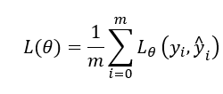

### 特性

### 基于梯度下降的优化问题

数学意义上的优化问题一般有两类解法，一个是解析方法（analytical optimization），适用于存在解析解（closed-form solution），另一种是迭代优化（iterative optimization）方法用于不存在解析解的情况，梯度下降（Gradient Descent）属于迭代优化的一种典型方法。现实中的机器学习模型中由于使用非线性激活函数（nolinear activation）所以无法直接计算导数为零时误差函数的解，因此只能使用基于梯度下降的优化方法，如图 1 所示对于一个可导的凸函数，从任意一点出发，沿着倒数下降的方向前进直到倒数为零的点，就是函数的最小值。

**图 1\. 梯度下降优化算法**

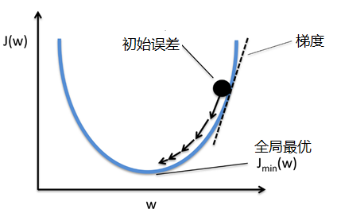

### 可导性

虽然从数学原理上梯度下降要求误差函数连续可导，但在实践中误差函数允许存在不可导的点，这是因为随机梯度下降算法（Stochastic Gradient Descent，SGD）使用小批量数据的误差均值进行求导，这样使得落在不可导的点上的概率很低。因此可以对 Hinge loss 这样的不连续的函数使用梯度下降来进行优化。事实上即使在某组数据真的发生小概率事件导致求导失效，由于小批量梯度下降算法使用了大量的分组，绝大多数可求导的分组仍然可以保证在整个数据集上有效运行。

### 非凸性

对于所有的凸函数，使用梯度下降都可以找到最小值，但是在实际的机器学习任务中，由于模型参数的数量很大（如 VGG16 有 1个参数），这时的误差函数是凸函数的概率非常低，函数表面会呈现出非常复杂的形态。图 2 展示了某个二元模型的误差函数的形态，可见其中有很多区域导数为零，但显然他们并不都是最小值，甚至不是局部最小值。数学上将导数为零的点成为关键点，误差函数表面主要有以下几类关键点：

**图 2\. 误差函数表面上的关键点**

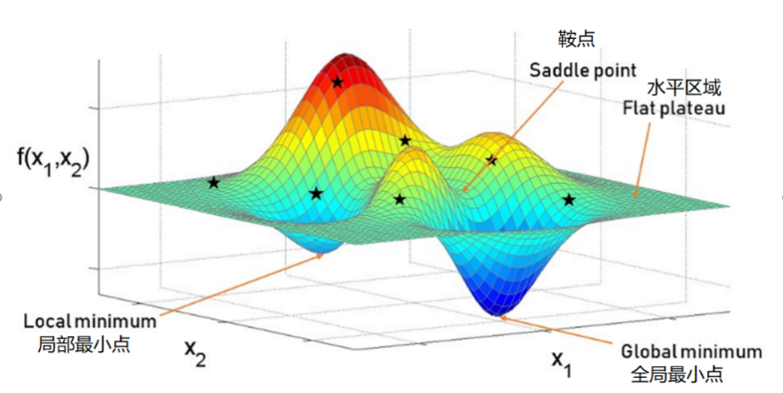

- 水平区域（flat plateau），是指在一个其中所有的点的导数都为 0 的区域，在三维空间中的水平区域就是水平面, 如何避免陷入水平区域一直是一个讨论较多的话题，目前常见的方法有：

    - 适当的参数初始化
    - 使用替代误差函数（surrogate function）
    - 调整优化器（如增加动量 momentum）
- 鞍点（saddle point），是指一阶导数为零二阶导数符号相反的点，如图 2 中所示。由于在高维度误差函数的所有导数为 0 的点中，只有在所有维度具有相同的凹凸性（即二阶导数都大于 0 或小于 0）的时候误差函数才会处于极值（局部最小值或者全局最小值），任何一个维度的凹凸性不同于其他的维度都会使误差函数处于鞍点，考虑到实际的误差函数通常会有万或十万（甚至百万）级的维度数量，因此鞍点是非常普遍的。大量的试验表明，使用随机梯度下降 SGD 选择具有动量或可变学习率（adaptive learning rate）的优化器（如 Adagrad, Rmsprop）就可以有效的脱离鞍点，如图 3 所示。
- 局部最小值（local minimum）， 通过大量实践发现在高维度的优化问题中，局部最小值和全局最小值通常没有太大的区别，甚至在有些情况下比全局最小值有更好的归纳能力（泛化能力）。

总结来说，使用随机梯度下降算法 SGD，结合合适的优化器（例如 momentum） 以及合适的参数初始化可以有效找到非凸函数的最优解（接近最优解）。

**图 3.（引用参考资源 1）**

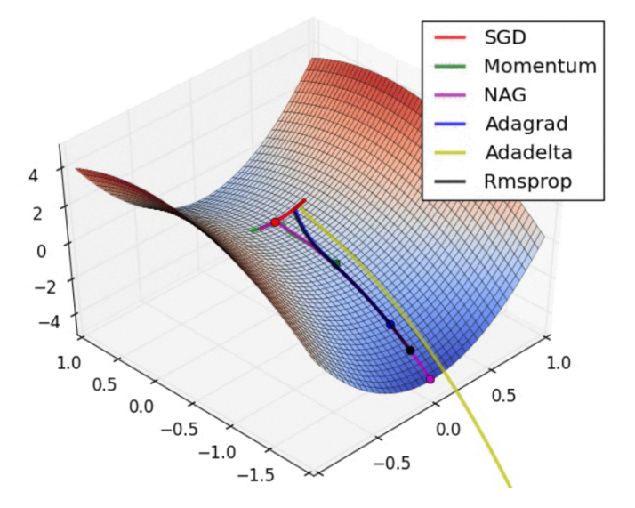

### 泛化（Generalization）

机器学习的最终目的是提高对未知的输入进行预测的准确率，也叫泛化能力。误差函数虽然可以引导梯度下降算法进行模型的优化，但是一个常见的问题是模型虽然达到了很高的训练准确率，但是泛化能力并没有提高甚至反而降低，这就是过拟合（overfitting）。图 4 中，左中右三个小图分别表示了欠拟合，正常和过拟合的情况。右侧的过拟合模型具有三个模型中最复杂的函数形态，可以看到随着训练准确率的提升，这个复杂函数对陌生数据的预测准确率反而下降了。这种问题源自于模型为了提高训练准确率学习了训练数据中的噪声从而导致模型和真实规律产生偏差。

正则化（regularization）是解决过拟合问题的常见方法之一，它把原误差函数和参数的模（norm）相加形成新的目标函数，再使用梯度下降对这个目标函数求最小值。这样做的目的在于通过降低参数维度来增加模型的泛化能力，由于参数的模变成了目标函数的一部分，因此梯度下降也会尽力降低参数的模，而参数的模和参数的维度正相关，因此梯度下降会降低参数的维度，从而避免生成过度复杂的函数，最终增强泛化能力。

**图 4.（引用参考资源 2）**

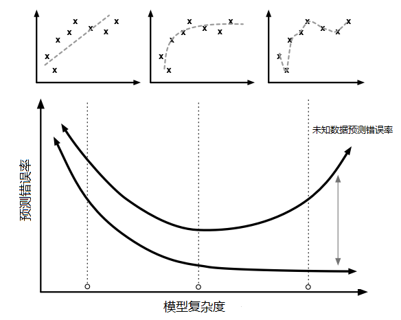

## 误差函数的分类

根据不同类型机器学习任务可以将误差函数主要可以以下三类：

1. 适用于回归问题（Regression）的误差函数，这种误差函数的目标是量化推测值和真实值的逻辑距离，理论上我们可以使用任何距离计算公式作为误差函数。实践中为常用的是以下两种距离：

    MSE（Mean Squared Error，L2）

    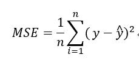

    MAE（Mean Absolute Error， L1）

    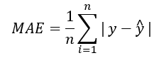

2. 适用于分类问题（classification）的误差函数，分类问题的目标是推测出正确的类型，一般使用概率描述推测属于某种类型的可能性，因此误差函数就需要能够计算两个概率分布之间的”距离”，最常用的此类方法是 Cross entropy loss。

    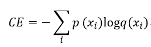

3. 多任务问题 此类问题是指使用一个模型同时学习多个指标，比如使用深度学习解决计算机视觉中的目标定位（object localization）问题，模型需要同时学习对象类型和对象位置两个指标，因此误差函数需要具备同时衡量类型误差和位置误差的能力，常见的做法是先分别设计类型误差函数 _Lclass_ 和位置误差函数 _Lposition_ ，在按一定比例（由超参数 α 和 β 确定）合并这两个误差从而形成一个新的复合误差函数 _L_ 来综合的反应总误差。

    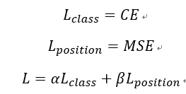

## 如何设计误差函数

误差函数不仅仅是误差的衡量工具，更重要的是梯度下降算法会为了不断缩小误差而沿着误差函数的导数方向调整模型参数，因此可以说误差函数它决定了模型学习的方向。使用不同的误差函数我们可以在完全相同的模型架构（model architecture）的基础上学习出不同的模型参数，来达到不同的目的。比如，在多层卷积神经网络架构上使用 cross entropy loss 可以判断图像对象的类型（是猫还是狗），而同样的网络架构配合复合误差函数则可以用来进行目标定位。从某种程度上说模型设计决定了能力，误差函数设计决定了方向。 那么如何设计（选择）误差函数呢？可以从以下几个方面考虑。

### 任务目标

决定误差函数设计的最重要的因素就是任务目标，有时任务目标和误差函数的关系很直接，比如预测价格。 有时他们的关系就不那么明显，需要一些的专业知识才能和误差函数建立联系。另外对目标的理解程度也很关键，有时一些细节会对误差函数的设计起到关键的作用，比如 MSE 和 MAE 是相似的误差函数，如何选择取决于任务目标，如果需要避免较大误差则应选择 MSE。无论如何，任务都应该是设计误差函数最先考虑的东西。

### 替代误差函数（Surrogate loss function）

有些情况下根据问题目标得到的误差函数很难使用梯度下降，例如图 5-1 中的误差函数在所有可导处导数都是 0（flat plateau），意味着梯度下降无法工作。这时可以使用一个如图 5-2 所示的近似函数进行模拟，通过求替代误差函数的最小值来实现优化原来的误差函数的目的。当然这只是一个理想化的例子，并且建立在了解误差函数的形态的基础上，但是实际中这种信息通常不容易得到，因此替代误差函数在实际中如何应用是一个比较复杂的问题。

**图 5.（引用参考资源 3）**

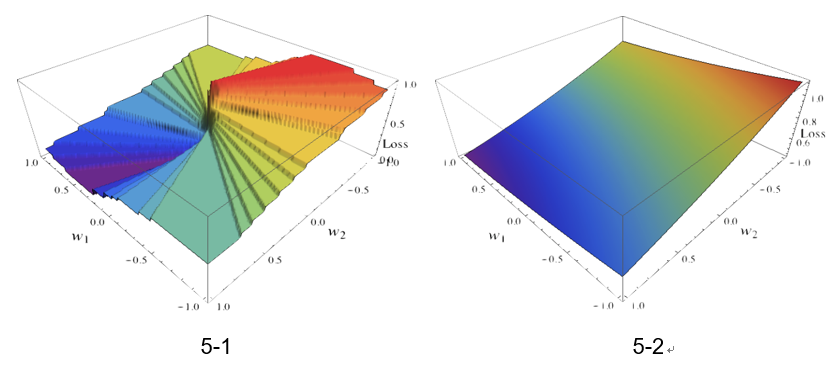

### 基于神经网络的误差函数

由于神经网络能够模拟任意复杂的函数，在某些无法应用确定的误差函数的场景下可以使用神经网络来模拟误差函数。实践中最常见的例子是应用于生成类任务的对抗式生成网络（Generative Adversarial Network，GAN），这类模型由生成器（Generator network）和判别器（Discriminator network）两部分构成，使用生成器生成仿真输出再由判别器来检测真伪，最大特点是需要一个动态的误差函数（判别器）来引导生成器来生成更高质量的输出，例如使用 GAN 生成手写数字（图 6）。

**图 6.（引用参考资源 4）**

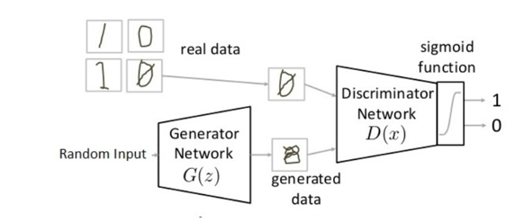

需要注意的是，作为 GAN 误差函数的判别器（Discriminator network）自身仍然需要有一个确定的误差函数来进行训练，由于 GAN 判别器的作用是判断真伪（二元分类问题），所以一般使用 binary cross entropy 误差函数来计算误差。

### 结束语

误差函数作为机器学习的核心概念，既在理论上支撑了梯度下降的优化方法，又在实践中引导模型的学习方向，对误差函数的深入理解和学习是利用机器学习解决现实问题的重要基础。本文对基本概念和实例的介绍仅仅是个开始，希望能够激发读者对相关理论的独立思考和相关技术的深入探索。

### 参考资源

1. [https://hub.packtpub.com/implementing-gradient-descent-algorithm-to-solve-optimization-problems/](https://hub.packtpub.com/implementing-gradient-descent-algorithm-to-solve-optimization-problems/)
2. [http://scott.fortmann-roe.com/docs/MeasuringError.html](http://scott.fortmann-roe.com/docs/MeasuringError.html)
3. [http://fa.bianp.net/blog/2014/surrogate-loss-functions-in-machine-learning/](http://fa.bianp.net/blog/2014/surrogate-loss-functions-in-machine-learning/)
4. [https://www.analyticsvidhya.com/blog/2017/06/introductory-generative-adversarial-networks-gans/](https://www.analyticsvidhya.com/blog/2017/06/introductory-generative-adversarial-networks-gans/)
5. [Large-Margin Softmax Loss for Convolutional Neural Networks](https://arxiv.org/abs/1612.02295)