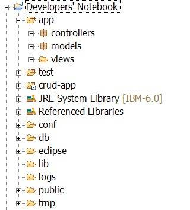

# 玩转 Java Web 应用开发：Play 框架
使用 Play 框架快速开发 Web 应用

**标签:** Java,Web 开发

[原文链接](https://developer.ibm.com/zh/articles/j-lo-play/)

成富

发布: 2010-11-16

* * *

## 概述

Play 框架是一个完整的 Web 应用开发框架，覆盖了 Web 应用开发的各个方面。Play 框架在设计的时候借鉴了流行的 Ruby on Rails 和 Grails 等框架，又有自己独有的优势。使用 Play 框架可以方便和高效的开发出 Java Web 应用。通过 Play 框架提供的命令行工具，可以快速的创建出一个 Web 应用的基本骨架。它的 Java 代码动态编译机制，使得修改代码之后，不需要重启服务器就可以直接看到修改之后的结果，调试起来非常方便。它使用 JPA 规范来完成领域对象的持久化，可以很方便的使用不同的关系数据库作为后台存储。使用 Play 框架可以很容易的构建使用 REST 架构风格的应用。它使用 Groovy 作为视图层模板使用的表达式语言。模板之间的继承机制也可以避免代码的重复。总的来说，Play 框架非常适合快速 Web 应用开发。

Play 框架采用经典的 MVC 架构，把 Web 应用分成模型层、控制层和视图层三个层次。每个层次对应的文件被存放在不同的目录下面，方便组织和管理。使用 Play 框架的 Web 应用具有相同的目录结构，如 [图 1\. 使用 Play 框架的 Web 应用的目录结构](#图-1-使用-play-框架的-web-应用的目录结构) 所示。

##### 图 1\. 使用 Play 框架的 Web 应用的目录结构



如 [图 1\. 使用 Play 框架的 Web 应用的目录结构](#图-1-使用-play-框架的-web-应用的目录结构) 所示，应用自身的文件被放在 `app` 目录下面，三个子目录分别存放的是 MVC 模式的三个层次的内容。其中 `models` 和 `controllers` 目录下面是 Java 源文件，而 `views` 目录下面则是视图层使用的模板文件。 `conf` 目录下面存放的是应用的配置文件、HTTP 路由文件和国际化所需的消息文件。 `public` 目录则是存放 Web 应用的静态文件，包括 JavaScript、CSS 和图像文件等。 `lib` 目录存放所需的额外的 Java 库。 `test` 目录存放的是测试结果。

### 开发环境

本文中使用的 Play 框架的版本是 1.0.3.1，使用的集成开发环境是 Eclipse 3.6， 使用 Dojo 作为 JavaScript 框架。在 Play 框架官方网站（见 参考资料 ）下载 Play 框架的压缩包之后，解压到某个目录，并把该目录下面的 `bin` 目录添加到环境变量中。接着启动一个命令窗口，运行 `play new developers_notebook` 就可以创建出一个新的名为 `developers_notebook` 的 Web 项目。在项目目录的父目录下面，运行 `play eclipsify developers_notebook` 就可以创建出来 Eclipse 工程。通过 Eclipse 导入此工程就可以在 Eclipse 里面进行开发了。Play 框架的 `support` 目录下的 `eclipse` 目录下有个名为 `org.playframework.playclipse` 的 Eclipse 插件，将此插件复制到 Eclipse 的 `plugins` 目录就可以安装。运行 `play run` 就可以运行此 Web 应用，访问 `http://localhost:9000` 就可以看到。每次在 Eclipse 里面修改了代码之后，不需要重新启动应用，只需要刷新页面就能看到更新之后的结果。这是 Play 框架的一个非常方便的特性。

本文中的示例应用称为”开发人员记事本”。开发人员可以用它来记录开发过程中的一些注意事项。下面首先介绍 Play 框架中的模型层。

## 模型层

模型层包含的是 Web 应用中的领域对象。Play 框架推荐的实践是模型层的对象不应该是仅包含 getter/setter 方法的简单 Java Beans，而应该有自己的业务逻辑。Play 框架中应用的模型层类可以是任何的 Java 类。与一般的 Java Beans 不同的是，模型层类使用声明为 `public` 的域作为对象的属性。Play 框架会自动生成相应的 getter/setter 方法。这样可以使得代码更加简洁。开发人员也可以提供自己的 getter/setter 方法实现。

### 领域对象持久化

领域对象的实例一般需要持久化下来。最常见的持久化方式就是使用关系数据库。Play 框架使用 JPA 规范来进行领域对象的持久化。具体的后台实现使用的是 Hibernate。开发人员只需要使用 JPA 规范定义的标注，就可以声明领域的持久化行为。比较好的做法是将领域对象类继承自 Play 框架提供的 `play.db.jpa.Model` 类。 `play.db.jpa.Model` 类提供了一个域 `id` 作为对象的标识符，也是对应的数据库表中的主键。 `play.db.jpa.JPASupport` 类是 `play.db.jpa.Model` 的父类，提供了一些实用方法用来完成从领域对象到数据库之间的映射。 [领域对象持久化](#领域对象持久化) 中列出了一些重要的方法，包括常用的增删改查操作。

##### 表 1\. play.db.jpa.JPASupport API 说明

方法说明`create(type, name, params)`用来创建领域对象类的一个实例。参数 `type` 表示的是领域对象类，类型是 `java.lang.Class` ； `name` 表示的是领域对象类的名称； `params` 表示的是一个包含了实例中属性值的类型为 `java.util.Map<java.lang.String,java.lang.String[]>` 的哈希表。`edit(obj, name, params)`用来编辑领域对象类的一个实例。参数 `obj` 表示的是领域对象实例；参数 `name` 和 `params` 的含义与 `create()` 方法的相同。`delete()`用来删除单个领域对象类的实例。`delete(query, params)`用来删除多个领域对象类的实例。参数 `query` 表示的是检索待删除实例的查询，而 `params` 表示的是查询所使用的参数。`deleteAll()`用来删除领域对象类的所有实例。`find(query, params)`用来查找领域对象类的实例。参数 `query` 表示的是查找时所用的查询，而 `params` 表示的是查询所使用的参数。`findAll()`用来查找领域对象的所有实例。`findById(id)`用来根据标识符查找领域对象的实例。`count(query, params)`用来计算某个查询结果中包含的领域对象的实例数。参数 `query` 和 `params` 的含义与 `find()` 方法相同。`save()`用来保存该领域对象实例到数据库中。`all()`用来查找系统中的全部领域对象的实例。

[领域对象持久化](#领域对象持久化) 中列出的方法中， `find()` 和 `all()` 方法的返回值是 `play.db.jpa.JPASupport.JPAQuery` 类的实例，表示一个领域对象实例的查询结果。对于此查询结果，可以进行进一步的操作。具体的操作，如 [领域对象持久化](#领域对象持久化) 所示。

##### 表 2\. play.db.jpa.JPASupport.JPAQuery API 说明

方法说明`bind(name, param)`用来绑定一个参数的实际值到查询上。在查询语句中可以使用形式参数作为占位符，参数的实际值可以通过此方法来指定。`fetch()`用来获取此查询的所有记录。`fetch(max)`用来获取此查询的前面 `max` 条记录。`fetch(page, length)`用来对查询结果进行分页。参数 `page` 表示当前的页数，从 1 开始；`length` 表示每页的记录数。`first()`用来返回查询结果中的第一条记录`from(position)`用来设置查询结果中处理的起始位置。参数 `position` 表示起始位置的序号。该方法的返回结果是一个新的 `play.db.jpa.JPASupport.JPAQuery` 对象。

使用 [领域对象持久化](#领域对象持久化) 中给出的方法，就可以在领域对象类中添加一些非常实用的方法，而不需要把这些方法添加到额外的服务层中。在示例应用中， `Note` 这个领域对象类表示的是用户添加的记录。 [代码清单 1](#code1) 中给出了 `Note` 类中的一些实用方法。

##### 清单 1\. 领域对象类中的实用方法

```
// 创建新的领域对象 Note 的实例，edit() 方法的使用与 create() 类似
Map<String, String[]> params = new HashMap<String, String[]>();
params.put("note.title", new String[] {"My note"});
params.put("note.content", new String[] {"My note's content"});
Note.create(Note.class, "note", params).save();

// 使用 find() 来进行查找
List<Note> notes = Note.find("byTitle", "My note").fetch();

// 使用 findById() 来查找单个实例
Note note1 = Note.findById(1);

// 使用 delete() 来删除对象实例
Note.delete("byTitle", "My note");

// 返回查询结果中的第 2 到第 11 条记录。
Note.find("byTitle", "My note").from(1).fetch(10);

```

Show moreShow more icon

在介绍完 Play 框架的模型层之后，下面介绍控制层。

## 控制层

Play 框架中的控制层是模型层和视图层之间的桥梁。控制层负责接收 HTTP 请求并返回相应的响应。一般来说，控制层的典型实现是接收到 HTTP 请求之后，从请求中获取一些参数，再调用服务层对应的处理方法。服务层的方法会对领域对象进行操作，完成具体的业务逻辑。最后，某种格式的响应被返回给请求者，如 HTML 页面、JSON 数据和 XML 数据等。Play 框架的控制层实现使得完成这样的典型场景变得非常简单。

Play 框架中的每个控制器都是一个普通的 Java 类，继承自 `play.mvc.Controller` 类，在包 `controllers` 中。控制器类中的每个公开的静态方法都表示一个动作。每个动作负责完整的请求 / 响应的流程，也就是说，所有前面提到的所有请求/响应的过程都需要在每个动作中来完成。

### 参数绑定

在控制层实现中很繁琐但是必不可少的操作就是解析 HTTP 请求中的参数。不同的 Web 开发框架会提供自己的参数解析方式。Play 框架也提供了相应的支持。Play 框架可以解析 HTTP 请求中查询字符串和 URI 路径中包含的以及请求体中以格式编码的参数。所有这些参数都放在 `params` 对象中，其中包含 `get()`、 `getAll()` 和 `put()` 等方法用来获取和设置参数的值。除了这种传统的使用方式之外，Play 框架还支持直接把参数的值绑定到动作方法的参数上面。比如一个动作方法的声明是 `show(String username)` ，那么请求中的参数 `username` 的值会在 `show()` 方法被调用时作为实际参数传递进去。Play 框架会负责完成相应的类型转换。值得一提的是对于日期类型（`java.util.Date`）的参数，Play 框架支持多种类型的日期格式的转换。比如动作方法的声明是 `display(Date postedAt)` ，而请求的格式可能是 `/display?postedAt=2010-09-22` ，Play 框架会自动完成相应的类型转换。

除了常见的基本数据类型之外，Play 框架还支持直接绑定领域对象的实例。比如动作方法的声明是 `create(Note note)`，可以在参数中直接指定对象实例的属性的值。请求的格式可能是 `/create?title=Note123&content=Good` 。Play 框架会负责创建一个 `Note` 类的实例，并根据参数的值设置该实例的属性 `title` 和 `content` 的值。这种绑定方式不仅支持简单对象，还支持嵌套对象和列表。比如 `/create?tags[0]=ajax&tags[1]=web` 可以设置列表类型属性 `tags` 的值。

Play 框架的这种绑定方式还支持文件对象，使得上传文件变得非常简单。只需要在表单中添加文件上传的控件（ `<input type="file">` ）并使用 `multipart/form-data` 编码来提交请求，在动作方法的参数中就可以获取到上传文件对应的 `java.io.File` 对象。比如动作方法的声明可能是 `upload(File picture)` 。上传的文件被保存在临时目录中，在请求完成之后会被自动删除。可以在动作方法中完成对上传文件的操作。

### 返回响应结果

在控制层的动作方法完成了与业务逻辑相关的处理之后，需要把响应返回给客户端。响应的结果可能是正确完成，也可能是出现错误。Play 框架提供了方便的实现用来返回不同类型的响应。使用 `play.mvc.Controller` 类提供的不同方法就可以生成这些响应内容。

- 请求正确完成，HTTP 状态代码为 200。使用 `ok()` 方法生成不带内容的响应。使用 `render()` 方法来生成使用模板的响应。使用 `renderText()` 方法生成 `text/plain` 类型的纯文本响应。使用 `renderXml()` 方法生成 `text/xml` 类型的 XML 格式的响应。使用 `renderJSON()` 方法生成 `application/json` 类型的 JSON 格式的响应。使用 `renderBinary()` 方法生成二进制内容的响应。
- 跳转到新的页面，HTTP 状态代码为 3XX。使用 `redirect()` 方法来跳转到新的 URL。使用 `notModified()` 方法来返回状态代码 304。
- HTTP 状态代码 4XX。使用 `unauthorized()` 方法返回状态代码 401。使用 `forbidden()` 方法返回状态代码 403。使用 `notFound()` 方法返回状态代码 404。
- 服务器内部错误，HTTP 状态代码 5XX。使用 `error()` 方法返回状态代码 500。

从上面列出的方法可以看出，Play 框架使用一些有意义的方法名称替换掉了难以记忆的 HTTP 状态代码，使用起来更加方便。同时，对于常见的响应格式，包括 HTML、XML、JSON 和二进制内容，都提供了相应的方法，使得开发人员不会遗漏掉响应中 `Content-Type` 的声明。

### 方法拦截

控制层的方法通常需要执行一些横切的逻辑，比如用户认证、加载通用信息和记录日志等。在 Spring 框架中，这些横切的逻辑是通过面向方面编程（AOP）的支持来实现的。Play 框架提供了更加简单易用的方法拦截支持，通过简单的标注就可以定义一些执行拦截操作的方法。这些方法必须非公开的静态方法。Play 框架支持的方法拦截标注有 `@Before` 、 `@After` 、 `@Finally` 和 `@With` 等四种。

用 `@Before` 标注的方法在动作方法执行之前被调用。 `@After` 标注的方法在动作方法执行之后被调用。 `@Finally` 标注的方法在动作方法的响应结果已经成功生成之后被调用。这三个标注都支持额外的两个属性： `priority` 表示标注的方法的优先级，0 为最高； `unless` 是一个字符串数组，表示不适用此拦截方法的动作方法的名称。如 `@Before(unless="index")` 表示此拦截方法不会应用在动作方法 `index()` 上。

如果控制器类中存在继承体系结构的话，父类中声明的拦截方法对于所有子类的动作方法都是适用的。在有些情况下，开发人员可能希望把拦截方法定义在不同的类体系结构中。由于 Java 不支持多继承，无法通过继承的方式来应用来自不同类体系结构上的拦截方法。针对这种情况，Play 框架提供了 `@With` 标注。在控制器类 `ControllerA` 中定义的拦截方法可以通过 `@With` 标注来应用到另外一个控制器类 `ControllerB` 上，而且不通过继承方式来实现。只需要在 `ControllerB` 中声明 `@With(ControllerA.class)` 即可。

在介绍完 Play 框架的控制层之后，下面介绍视图层。

## 视图层

Web 开发框架的使用者都习惯于使用某种模板技术来生成 HTML 页面，这些技术包括常见的 JSP、ASP 和 PHP 等。Play 框架也提供了自己的模板技术，可以用来动态的创建 HTML、XML、JSON 以及其它文本类型的内容。Play 框架的模板技术使用的是 Groovy 语言。Groovy 语言的灵活性和简洁性使得 Play 框架的模板简单而且易用。在模板中可以混用静态内容和生成动态内容的各种元素。在模板中可以使用的动态元素如 [视图层](#视图层) 所示。

##### 表 3\. 模板中可用的动态元素

动态元素说明`${...}`用来对一个表达式进行求值。如 `${note.title}` 的值是领域对象 `note` 的属性 `title` 的值。`@{...}` 和 `@@{...}`用来生成调用控制器中动作方法的 URL，可以用在页面的链接中。 `@{...}` 和 `@@{...}` 生成的分别是相对 URL 和绝对 URL。如 `<a href="@{Application.index()}"> 首页 </>` 生成一个指向首页的链接。`&{...}`用来显示经过国际化之后的消息内容。`*{...}*`用来添加注释。如 `*{ 这是注释 }*` 。`%{...}%`用来添加复杂的 Groovy 脚本，可以声明变量和添加语句。`#{...}`用来调用 Play 框架的或是开发人员自定义的标签。

Play 框架中的标签的作用相当于 JSP 中的标签。Play 框架本身提供一些常用的标签，开发人员也可以根据需要开发自己的标签。Play 框架内置提供的标签说明如 [视图层](#视图层) 所示。

##### 表 4\. Play 框架提供的标签

标签说明`a`用来生成指向控制器中动作方法的 HTML 链接元素。如 `#{a @Application.index()} 首页 #{/a}` 。`if` 、 `ifnot` 、 `elseif` 和 `else`用来进行条件判断。`set` 和 `get`用来设置和获取可以在模板中使用的变量。如 `#{set email:'alex@example.org'}` 设置了变量 `email` 的值，可以通过 `#{get 'email'}` 来获取。`script`用来生成一个 `<script>` 元素引用 `/public/javascripts` 目录下的 JavaScript 文件。如 `#{script 'dojo.js'}` 引用 `/public/javascripts/dojo.js` 文件。`stylesheet`作用与 `script` 类似，不同的是使用 `<link>` 元素来引用 `/public/stylesheets` 目录下的 CSS 文件。`list`用来遍历一个对象集合。如 `#{list items:notes, as:'note'}` 用来遍历对象集合 `notes` 。循环体中的每个对象用变量 `note` 来引用。在循环体的代码中可以引用一些预定义的变量。这些变量有固定的名称，但是会以循环体中的对象变量名作为前缀。在上面的例子中是 `note_` 。如 `note_index` 表示当前对象在集合中的序号； `note_isFirst` 表示是否是集合中的第一个对象； `note_isLast` 表示是否是集合中的最后一个对象； `note_parity` 表示当前对象在集合中序号的奇偶值，可能是 `even` 和 `odd` 。`i18n`用来使得支持国际化的消息文件可以用 JavaScript 来访问。在 JavaScript 代码中可以 `i18n()` 方法来访问。如 `i18n('app_title')` 。`errors`用来遍历验证错误的集合。使用方式与 `list` 类似，循环体中使用的对象变量名称是 `error` 。`form`用来生成 HTML `<form>` 元素。`verbatim`禁用模板中的 HTML 转义功能。`include`在当前模板中引入另一个模板。如 `#{include 'test.html'}` 。`extends` 和 `doLayout``extends` 使得当前的模板继承自另外一个模板。 `doLayout` 用来在父模板中调用子模板。

在模板中可以使用来自不同地方的变量。首先是在模板生成的时候，由控制器中的动作方法通过 `renderArgs` 对象来添加的。如 `renderArgs.put("username", "Alex")` 就把一个变量 `username` 添加到了模板中。其次是一些隐含的变量，如 `request` 表示当前的 HTTP 请求， `session` 表示当前的会话， `params` 表示请求中的参数和 `out` 表示用来输出响应的 `java.io.Writer` 对象。最后就是可以通过 `#{set}` 来设置变量。

### 模板的继承

Play 框架中可以使用 `#{extends}` 和 `#{doLayout}` 来实现模板之间的继承。模板的继承机制对于实现灵活的页面布局很有帮助。一个模板可以定义清楚页面的基本布局结构，其它模板可以继承此模板并添加具体的内容。这样就可以避免在不同模板中重复相同的页面元素。

在父模板中可以包含任意的内容。在需要由子模板填充的位置，使用 `#{doLayout /}` 进行声明即可。在子模板中通过 `#{extends}` 来声明所继承的模板。如 `#{extends 'main.html'}` 就声明继承自模板 `main.html` 。当子模板被生成之后，将包含父模板中的内容。而子模板中只需要定义扩展的内容即可。

### 自定义标签

Play 框架自身提供的标签只能解决一些常见的需求，很多时候开发人员需要根据需要开发出自己的标签。一个标签的定义非常简单，就是一个模板文件。模板文件被存放在 `app/views/tags` 目录下，文件的名称就是标签的名称。在标签对应的模板里面，开发人员可以添加任意的内容。标签也是支持传入参数的。在标签对应的模板文件中可以用在参数名称前面加上 `_` 的方式来引用参数的值。比如一个标签在使用时的方式是 `#{myTag name:'Alex' /}` ，那么在该标签的模板文件中，就可以用 `${_name}` 来引用参数 `name` 的值。有些标签是支持在使用的时候添加标签体的，如 `#{anotherTag} 测试文字 #{/anotherTag}` 。对于这种情况，在标签的模板文件中可以用 `#{doBody}` 来引用标签体中的内容。

在介绍完 Play 框架的视图层之后，下面介绍 HTTP 路由。

## HTTP 路由

在前面介绍过，Play 框架中的控制器用来接受 HTTP 请求并返回相应的响应。这个过程的重要一环就是 HTTP 请求的 URI 与控制器之间的映射关系。Play 框架提供了灵活的 HTTP 路由功能来完成这个映射。路由信息被保存在 `config/routes` 文件中，采用简单的方式进行声明。每条路由记录包含 3 个元素，分别是 HTTP 方法的名称、匹配的 URI 模式以及对应的控制器动作方法。路由记录表示的含义是当使用给定的 HTTP 方法来请求对应模式的 URI 的时候，控制器动作方法就会被调用。

Play 框架支持的 HTTP 方法有 `GET` 、 `POST` 、 `PUT` 、 `DELETE` 和 `HEAD` 。使用通配符 `*` 可以匹配任何方法。在 URI 模式的声明中可以使用正则表达式来表示复杂的映射规则。URI 模式中还可以使用 `{...}` 来声明动态的部分。每个动态部分都是有名称的，可以在控制器动作方法中通过 `params` 对象来获取。比如， `/notes/home` 这样的 URI 模式会匹配 `/notes/home` ，但是 `/notes/{id}` 可以匹配 `/notes/123` 和 `/notes/abc` ，而且 URI 模式中 `/notes/` 后面的部分可以作为参数 `id` 的值被获取到。URI 模式 `/notes/{<[0-9]+>id}` 使用了正则表达式，只会匹配 `/notes/` 后面紧跟的全是数字的情况。在声明控制器的动作方法的时候，需要使用带名称空间的全名，如 `myapp.Notes.show` 。有些动作方法是带参数的，可以在声明的时候预先绑定一些参数值，这样可以方便的添加一些 URI 别名。比如动作方法 `Notes.show()` 有一个参数 `id` 用来指明要显示的内容的 ID。如果参数 `id` 的值为 0，则会显示所有内容的一个列表。这样的话，就可以定义一个类似 `GET /notes/all Notes.show(id:0)` 的路由声明。这样暴露出来的 URI 更加简洁和易于记忆。

在路由文件中的路由声明是按照从上到下的优先级来进行匹配的。比较具体的 URI 模式应该放在比较通用的模式之前。对于静态文件，可以通过一个特殊的动作方法 `staticDir` 进行声明。比如 `GET /files staticDir:files` 就声明了 `files` 目录中包含的是静态文件。

在介绍完 HTTP 路由之后，下面介绍 Play 框架独特的无状态的体系结构。

## 无状态的体系结构

HTTP 协议本身就被设计成无状态的，采用请求 / 响应的模式。不同的请求之间并不存在相互关系。但是这种架构模式在开发某些 Web 应用的时候不是很方便。有些应用要求用户进行认证登录之后才能进行某些操作。同样的 URL，认证和未认证用户看到的内容是不同的。而且用户认证成功之后，他应该在一段时间内保持这种认证状态。否则的话，用户每次都需要输入用户名和密码才能访问受限的内容。对于这种情况，很多 Web 开发框架提供了会话的支持，允许应用保存一些与会话相关的数据。Java Servlet 规范中的 `javax.servlet.http. HttpSession` 就是一种会话的接口。应用的服务器会负责维护每个会话相关的数据。这些数据可以通过一个会话 ID 来进行标识。这个标识会利用浏览器的 cookie 机制保存在浏览器端，也可以作为请求 URL 的参数来传递。服务器端通过此标识来识别每个会话。在处理相应的请求的时候，就可以根据会话 ID 来获取保存在服务器端上的会话数据。会话机制的问题是会影响应用的可伸缩性。如果一个应用使用多台服务器的话，就需要额外的机制来保证同一用户在不同机器上面的会话是同步的。而无状态的实现则不存在这个问题，对于某一个请求，由不同机器来处理的结果都是相同的。

Play 框架的设计架构就是无状态的。它没有提供服务器端的机制用来维护跨多个请求的数据。如果确实需要保存这样的数据的话，可以考虑下面几种方案：

- 保存在 Session 或 Flash 作用域中。Play 框架中仍然有会话的机制，但是并没有提供在服务器端保存会话数据的能力。会话数据是保存在浏览器的 cookie 中的，由浏览器在每次请求的时候自动发送。通过这种方式来达到维护会话数据的目的。由于会话数据是保存在 cookie 中，其大小是有限制的，一般不能超过 4K 字节，而且只能保存字符串类型的数据。Flash 作用域和会话一样，也是通过 cookie 来保存的。所不同的是，Flash 作用域中的数据只在下次请求中是有效的。
- 保存在持久化的数据存储中，如数据库中。如果需要在多个请求中使用同一个领域对象的话，可以把这个对象的 ID 保存在 Session 或 Flash 作用域中，而在控制器动作方法中使用此 ID 来从数据库中查询相应的对象。
- 保存在暂时性数据存储中，如缓存中。Play 框架内置了缓存的支持，通过调用类 `play.cache.Cache` 就可以对缓存进行操作。与使用持久化存储类似，缓存中的键的值可以保存在 Session 或 Flash 作用域中。

对于熟悉了 Java Servlet 规范的开发人员来说，需要一些时间来适应 Play 框架的这种无状态的体系结构。不过这种结构对于应用的可伸缩性来说，确实是非常有好处的。

介绍完无状态的体系结构之后，下面介绍一些其它话题。

## 其它话题

### 测试

Play 框架对应用的测试也提供了良好的支持。Play 框架一共支持三种类型的测试，分别是单元测试、功能测试和界面测试。单元测试主要用来测试应用的模型层代码。单元测试用例的 Java 类继承自 `play.test.UnitTest` ，可以使用 JUnit 4 提供的标注和断言。功能测试主要用来测试应用的控制层代码。功能测试用例的 Java 类继承自 `play.test.FunctionalTest` 。在测试用例中，可以通过 `GET()` 、 `POST()` 、 `PUT()` 、 `DELETE()` 和 `makeRequest()` 等方法来发出 HTTP 请求，也可以直接调用控制器中的动作方法。除此之外，还可以使用一些与 HTTP 响应相关的断言。如 `assertStatus()` 、 `assertContentType()` 和 `assertHeaderEquals()` 分别用来验证 HTTP 状态代码、内容类型和 HTTP 头。界面测试使用 Selenium 工具来进行。开发人员可以使用 Selenium 的语法来编写测试用例，也可以使用 Play 框架提供的 `#{selenium}` 标签。

在进行测试的时候，需要准备一些测试数据。测试数据可以用 YAML 的格式保存在文本文件中，并通过 `play.test.Fixtures.laod()` 方法来加载这些数据到数据库中。当测试结束之后，可以通过 `deleteAll()` 方法来删除这些数据。

在测试的时候，需要用 `play test` 命令以测试模式启动应用，再用浏览器访问 `http://localhost:9000/@tests` 进行测试。

### 任务调度

在 Web 应用开发中，有时候会需要定期执行一些调度任务，比如数据库备份和数据同步等。这些任务不是通过 HTTP 请求来触发的，而是定时执行的。Play 框架提供了内置的任务调度支持的能力。创建新任务的时候，只需要继承自 `play.jobs.Job` 类，并覆写 `doJob()` 方法即可。如果要创建的任务有返回结果的话，覆写 `doJobWithResult()` 方法即可。任务创建完成之后，可以选择不同的调度方式。一种方式是在应用启动的时候执行一次。只需要在任务的 Java 类上添加标注 `@OnApplicationStart` 即可。对于定期执行的任务，Play 框架提供了两个标注：一个是 `@Every` ，用来按照固定的时间间隔调度任务，如 `@Every("1h")` 声明任务每个小时执行一次；另外一个是 `@On` ，用来声明描述调度策略的 CRON 表达式。

### 安全

Play 框架提供了对 Web 应用安全性方面的支持，可以防范一些常见的攻击方式。前面提到过，Play 框架中的会话数据是保存在浏览器的 cookie 中的。这些数据是经过签名的，可以防止被恶意攻击者所篡改。应用中的重要数据也不应该保存在会话中。Play 框架中的模板在输出 HTML 内容的时候，会自动对内容进行转义，可以防范跨站点脚本攻击。对于 SQL 注入攻击，开发人员应该尽量使用提供的 `find()` 方法来查询领域对象。对于自己创建的查询语句，应该在语句中使用占位符并进行参数绑定，而不是通过字符串相加的方式来创建。为了防范跨站点请求伪造，Play 框架中的控制器的动作方法都可以使用 `checkAuthenticity()` 方法来声明调用此方法时的请求中必须包含合法的令牌。这个令牌用来确保当前请求是由应用自身发出的，而不是被伪造的。通过 `session.getAuthenticityToken()` 方法可以生成一个只对当前会话有效的令牌，需要在请求的时候附带此令牌。如果是通过页面上的表单来提交请求的话，Play 框架也提供了一个标签 `#{authenticityToken /}` 用来生成一个包含了令牌的隐藏域，可以直接在模板中使用。

## 结束语

Play 框架作为一个优秀的 Java Web 应用开发框架，可以帮助开发人员快速高效的构建 Web 应用。它为开发人员提供了一个良好的基础架构，并屏蔽了很多底层的实现细节。开发人员可以用一个简单的视角来看待 Web 应用开发，而不需要关心过多的细节。Web 开发人员可以熟悉 Play 框架，并在开发中选用这个框架。