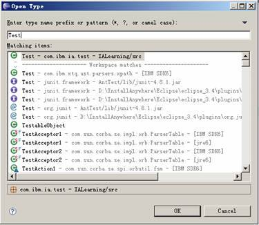
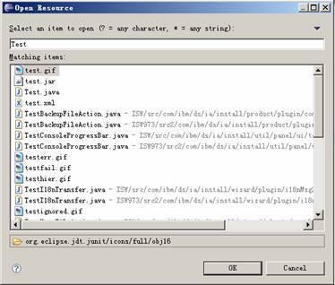
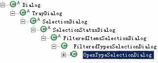
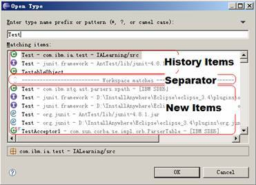
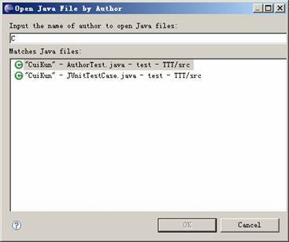

# 理解 Eclipse 打开类型 (Open Type) 插件功能，实现自定义打开类型插件
手把手教你使用 Eclipse 插件

**标签:** Java

[原文链接](https://developer.ibm.com/zh/articles/os-cn-eclipse-opentype/)

崔坤

发布: 2011-04-19

* * *

## 前言

Eclipse 中的打开类型 (Open Type) 插件是用户在使用 Eclipse 进行 Java 开发时最常用的功能。它提供了易用的查找框，简洁明朗的搜索结果，让用户可以非常方便的通过搜索类名来打开一个 Java 文件，图 1 为 Eclipse3.4 打开类型插件弹出的对话框。

##### 图 1\. 打开类型对话框



打开资源 (Open Resource) 插件与打开类型插件类似，通过打开资源 (Open Resource) 插件，用户可以通过查找资源的文件名打开图片、Jar 包或者 Java 文件，如图 2 所示。

##### 图 2\. 打开资源对话框



## 打开类型插件架构设计

下面介绍打开类型插件的整体框架。

打开类型插件由两大部分组成，一部分主要实现打开类型的按钮和菜单操作，另一部分实现打开类型对话框。

打开类型的按钮和菜单主要通过实现 actionSets 扩展点来实现。下面为打开类型实现 actionSets 扩展点代码：

##### 清单 1\. 打开类型插件实现 actionSets 扩展点

```
<action
       id="openType"
       toolbarPath="org.eclipse.search.searchActionSet/Search"
       class="org.eclipse.jdt.internal.ui.actions.OpenTypeAction"
       definitionId="org.eclipse.jdt.ui.navigate.open.type"
       icon="$nl$/icons/full/etool16/opentype.gif"
       helpContextId="org.eclipse.jdt.ui.open_type_action"
       label="%OpenTypeAction.label"
       menubarPath="navigate/open.ext2"
       tooltip="%OpenTypeAction.tooltip">
</action>

```

Show moreShow more icon

扩展点指定了工具栏，菜单的位置和实现类 OpenTypeAction。实现扩展点后，Eclipse 的导航 (Navigate) 菜单中就新增了打开类型 (Open Type) 项。类 OpenTypeAction 的主要作用是弹出打开类型对话框，清单 2 中给出了该类的实现代码。

##### 清单 2\. 弹出打开类型对话框

```
public void runWithEvent(Event e) {
     ...
OpenTypeSelectionDialog dialog=
      new OpenTypeSelectionDialog(parent, true,
      PlatformUI.getWorkbench().getProgressService(), null,
     IJavaSearchConstants.TYPE);
dialog.setTitle(JavaUIMessages.OpenTypeAction_dialogTitle);
dialog.setMessage(JavaUIMessages.OpenTypeAction_dialogMessage);
int result= dialog.open();
if (result != IDialogConstants.OK_ID)
     return;
...
}

```

Show moreShow more icon

打开类型对话框由 OpenTypeSelectionDialog 及其父类实现。下图为 OpenTypeSelectionDialog 的继承树，其中 FilteredTypesSelectionDialog 和 FilteredItemsSelectionDialog 实现了大部分功能。

##### 图 3\. OpenTypeSelectionDialog 继承树



FilteredTypesSelectionDialog 类和 FilteredItemsSelectionDialog 类利用大量内部类实现打开类型对话框的主要功能，这些功能可以概括为 7 个部分。

1. Dialog: 使用 createDialogArea() 方法实现对话框的用户界面，对话框分为输入框，查找结果和详细信息三部分。输入框为 Text 控件，使用 TableViewer 来显示查找结果，详细信息则通过 ContentViewer 来实现。
2. Search Engine: 在 fillContentProvider() 方法中调用 SearchEngine 执行搜索操作，SearchEngine 使用 IndexManager 获取当前工作区内的 java 文件和 class 文件，将符合搜索关键字的文件通过 Request 将搜索结果记录到 ContentProvider 中。
3. ContentProvider: 管理查找结果的内容，并通过 SelectionHistory 记录查找历史。ContentProvider 可以将新搜索到的符合查询条件的类加入到结果中，并返回给 TableViewer 显示。
4. LabelProvider: 定义查找结果的每一项显示的文本和图片。
5. ItemFilter: 根据输入关键字过滤查找结果，ItemFilter 定义了三个主要的方法，分别为 matchesName()，isSubFilter() 和 equalsFilter() 方法。matchesName() 方法通过正则表达式判断当前项是否符合查询条件；isSubFilter() 方法用来判断本次查询的关键字是否被上次查询的关键字包含；equalsFilter() 方法判断当前 filter 是否与上次查找的 filter 相同。
6. SelectionHistory: 记录查找历史，SelectionHistory 通过 accessed() 方法记录查找项，getHistoryItems() 方法得到查找历史。
7. FilterJob: 当用户输入关键字时，控件的监听器会调用 FilterJob 的 doRun() 方法，在 doRun() 方法中，首先调用 SearchEngine，搜索当前工作区的文件，然后调用 ContentProvider 类中的 refresh() 方法更新显示结果。

在用户通过关键字查找类名时，如果用户每输入一个字符，插件都从 IndexManager 中搜索一遍工作区，这样将会造成很大的延迟，插件的用户友好性也会大打折扣。而打开类型插件的搜索速度非常快，很少出现延迟的现象，那么它是如何实现快速搜索的呢？

打开类型的执行原理是，在用户输入第一个字符时，SearchEngine 会从 IndexManager 中搜索当前工作区下的所有 java 文件和 class 文件，在搜索时，如果文件名不以用户输入的字符为起始，该文件就会被过滤掉，这样符合用户输入的第一个字符的结果就会显示在对话框中。当用户输入第二个字符时，插件会从上一次搜索的结果中查找符合关键字的类，利用 ItemFilter 进行过滤，而不需要再重新调用 SearchEngine 搜索工作区全部文件，这样第二次的查询结果很快就可以呈现出来。

## 实现自定义打开类型插件

通过上面介绍，我们已经了解了 Eclipse 打开类型插件的整体框架及核心功能设计。虽然打开类型插件的功能很强大，但是由于它大量采用私有内部类，很难通过继承已有类的方式实现自定义的打开类型插件。下面我们重新编写一个自定义的打开类型的插件，自定义插件实现了通过查找 Java 文件的作者姓名来打开一个 Java 类的功能，自定义插件的运行环境是 Eclipse3.4，附件 OpenJavaByAuthor.zip 是该插件的源代码。

首先我们来实现 actionSets 扩展点，在导航 (Navigate) 菜单中添加菜单项，并且在工具栏中添加按钮，下面是实现扩展点的代码。

##### 清单 3\. 实现 actionSets 扩展点

```
<extension
         point="org.eclipse.ui.actionSets">
      <actionSet
            id="sample.open"
            label="Open Java Type by Author"
            visible="true">
         <action
               class="sample.actions.OpenJavaTypeByAuthorAction"
               definitionId="sample.openJavaByAuthor"
               icon="icons/change.gif"
               id="OpenJavaTypeByAuthorAction"
               label="Open Java Type by Author"
               menubarPath="navigate/open.ext2"
               toolbarPath="org.eclipse.search.searchActionSet/Search">
         </action>
      </actionSet>
</extension>

```

Show moreShow more icon

其中 action 中的 class 属性定义了插件入口类 sample.actions.OpenJavaTypeByAuthorAction。当用户选择菜单项或点击工具栏按钮时，动作代理就会创建 OpenJavaTypeByAuthorAction 类的实例，并告诉它开始执行。

OpenJavaTypeByAuthorAction 类继承自 Action 类，并实现了 IWorkbenchWindowActionDelegate, IActionDelegate 两个接口。真正的执行动作代码在 run() 方法中实现，清单 4 给出了该方法的代码。

##### 清单 4\. OpenJavaTypeByAuthorAction 执行动作

```
public void run(IAction action) {
IWorkbenchWindow window = PlatformUI.getWorkbench()
       .getActiveWorkbenchWindow();
Shell parent = window.getShell();
SelectionDialog dialog = new OpenJavaTypeByAuthorDialog(parent);
dialog.setTitle("Open Java File by Author");
dialog.setMessage("");
int result = dialog.open();
if (result != IDialogConstants.OK_ID)
     return;
Object[] files = dialog.getResult();
if (files != null && files.length > 0) {
     IFile file = null;
     for (int i = 0; i < files.length; i++) {
       file = (IFile) files[i];
       try {
         IDE.openEditor(window.getActivePage(), file, true);
       } catch (CoreException x) {
         OpenJavaTypeByAuthorLog.log(x);
       }
     }
}
}

```

Show moreShow more icon

run() 方法调用了 OpenJavaTypeByAuthorDialog 类打开对话框，在对话框结束后通过 IDE.openEditor() 方法打开选择的 Java 文件。

OpenJavaTypeByAuthorDialog 类实现了对话框的 GUI，它继承了 SelectionStatusDialog 抽象类。SelectionStatusDialog 是一个集成了 OK 和 Cancel 按钮的抽象 Dialog 类。

在对话框中，Text 和 TableViewers 是两个最主要的控件，Text 用来获取用户的输入，即 Java 文件的作者姓名的关键字，而 TableViewer 用来显示查找结果。清单 5 给出了实现 Text 和 TableViewers 控件的代码。

##### 清单 5\. Text 和 TableViewers 实现

```
//add Text
Text text = new Text(content, SWT.SINGLE | SWT.BORDER);
text.addModifyListener(new ModifyListener() {
public void modifyText(ModifyEvent e) {
     applyFilter();
}
});

//add TableViewer
TableViewer tableViewer = new TableViewer(content, (multi ? SWT.MULTI : SWT.SINGLE)
     | SWT.BORDER | SWT.V_SCROLL | SWT.VIRTUAL);
tableViewer.setContentProvider(contentProvider);
tableViewer.setLabelProvider(itemsListLabelProvider);
tableViewer.setInput(new Object[0]);
tableViewer.setItemCount(contentProvider.getElements(null).length);
tableViewer.addSelectionChangedListener(new ISelectionChangedListener() {
public void selectionChanged(SelectionChangedEvent event) {
        StructuredSelection selection = (StructuredSelection) event
.getSelection();
     handleSelected(selection);
}
});
tableViewer.addDoubleClickListener(new IDoubleClickListener() {
public void doubleClick(DoubleClickEvent event) {
     handleDoubleClick();
}
});

```

Show moreShow more icon

Text 控件添加了一个监听器，当用户输入查找字符的时候就会调用 applyFilter() 方法进行查找。TableViewer 控件主要设置了 ContentProvider 和 LabelProvider，并添加了监听器 SelectionChangedListener 和 DoubleClickListener，用来捕获用户的选择和双击动作。

那么接下来，我们需要了解 applyFilter() 如何在被调用时执行查找操作并显示查找结果的。

##### 清单 6\. 响应用户输入

```
protected void applyFilter() {
JavaTypeItemsFilter newFilter = new JavaTypeItemsFilter(javaTypeUtil,
       text.getText());
if (filter != null && filter.equalsFilter(newFilter)) {
     return;
}
filterJob.cancel();
this.filter = newFilter;
if (this.filter != null) {
     filterJob.schedule();
}
}

```

Show moreShow more icon

从上面代码中可以看到 applyFilter() 方法在设置 filter 后会调用 FilterJob.schedule() 方法，那么 FilterJob 是如何被调用，如何实现查找操作的呢？

FilterJob 是 Job 的子类，Job 类是 Eclipse 对 Java Thread 的封装，用于多任务的处理。当我们调用 Job 的 schedule() 方法时，该 Job 就会被 JobManager 放入等待队列中，JobManager 会通知线程池有新的 Job 需要处理，线程池就会分配空闲线程执行该 Job。如果没有空闲线程，线程池就会创建新的线程执行 Job。当 Job 执行完毕后，就会将执行线程返回给线程池作为空闲线程等待执行新的 Job。Job 类的基本用法为：

##### 清单 7\. Job 基本用法

```
Job job = new Job(""){
@Override
protected IStatus run(IProgressMonitor arg0) {

     return Status.OK_STATUS;
}
};
job.schedule();

```

Show moreShow more icon

我们的 FilterJob 实现的功能可以分为三步：

第一步，如果当前 Filter 不是前一次查找的 Sub Filter，则调用 SearchEngine 从工作区中查找 Java 类：

##### 清单 8\. 调用 SearchEngine 查找 Java 类

```
lastCompletedFilter = null;
lastCompletedResult = null;
JavaTypeItemsFilter pluginItemFilter = (JavaTypeItemsFilter) itemsFilter;
JavaTypeSearchRequestor requestor = new JavaTypeSearchRequestor(
     pluginItemFilter, provider, javaTypeUtil);
progressMonitor.setTaskName("Search");
JavaTypeSearchEngine engine = new JavaTypeSearchEngine(requestor);
try {
engine.search();
} catch (OpenJavaTypeByAuthorException e) {
OpenJavaTypeByAuthorLog.log(e);
}
contentProvider.rememberResult(itemsFilter);

```

Show moreShow more icon

第二步，如果当前 Filter 是前一次查找的 Sub Filter，则通过 ItemFilter 过滤前一次的查找结果。

##### 清单 9\. 过滤前一次的查找结果

```
for (int pos = 0; pos < lastCompletedResult.size(); pos++) {
Object item = lastCompletedResult.get(pos);
if (monitor.isCanceled())
     break;
if (itemsFilter.matchItem(item)) {
     contentProvider.add(item);
}
if ((pos % 500) == 0) {
     monitor.worked(1);
}
}
contentProvider.rememberResult(itemsFilter);

```

Show moreShow more icon

第三步，调用 ContentProvider 的 refresh() 方法，刷新 TableViewer，显示新的查找结果。后面会具体介绍 refresh() 方法。

上面部分提到在 FilterJob 中会调用 SearchEngine 执行查找操作，SearchEngine 的实现思路是通过使用 Eclipse 中 Resources 的 API 得到当前的工作区，通过 getProjects() 方法得到当前工作区下的所有工程。下面是实现代码：

##### 清单 10\. 得到工作区下的所有工程

```
public void search() throws OpenJavaTypeByAuthorException {
IWorkspace workspace = ResourcesPlugin.getWorkspace();
IProject[] projects = workspace.getRoot().getProjects();
for (IProject project : projects) {
     try {
       project.refreshLocal(0, null);
     } catch (CoreException e1) {
       throw new OpenJavaTypeByAuthorException(e1);
     }
     if (!project.isOpen()) {
       continue;
     }
     searchForJavaFile(project);
}
}

```

Show moreShow more icon

接着调用 searchForJavaFile() 方法递归访问工程下的所有资源，并筛选出 Java 文件。

##### 清单 11\. 筛选 Java 文件

```
private void searchForJavaFile(IContainer parent)
     throws OpenJavaTypeByAuthorException {
IResource[] members;
try {
     members = parent.members();
} catch (CoreException e) {
     throw new OpenJavaTypeByAuthorException(e);
}
for (IResource resource : members) {
     if (resource instanceof IContainer) {
       IContainer container = (IContainer) resource;
       searchForJavaFile(container);
     } else if (resource instanceof IFile) {
       IFile file = (IFile) resource;
       if ("java".equals(file.getFileExtension())) {
         String authorName = getJavaTypeAuthorName(file);
         if (filter.matches(authorName)) {
           requestor.add(new JavaTypeNameMatch(file, authorName));
         }
       }
     }
}
}

```

Show moreShow more icon

得到 Java 文件后会调用 getJavaTypeAuthorName() 方法获取 Java 文件的作者姓名，调用 ItemFilter 对 Java 文件作者姓名进行过滤，得到能够匹配关键字的 Java 文件，并将 Java 文件封装成 JavaTypeNameMatch 类，添加到 request 中。读者可以重新编写 SearchEngine 的搜索逻辑，实现不同的查找方式。

在 FilterJob 和 SearchEngine 中都会使用到通过关键字过滤查找结果的 ItemFilter，下面我们来实现 ItemFilter。ItemFilter 主要实现了 matches() 方法，使用 SearchPattern 类执行匹配操作。

##### 清单 12\. 调用 SearchPattern 进行匹配

```
public boolean matches(String text) {
if (text == null || "".equals(text)) {
     return false;
}
return searchPattern.matches(text);
}

```

Show moreShow more icon

ItemFilter 还需要提供两个方法：equalsFilter() 方法用于判断两个 Filter 是否相等和 isSubFilter() 方法两个 Filter 是否是从属关系。

##### 清单 13\. 判断 Filter 是否相等或从属关系

```
public boolean equalsFilter(JavaTypeItemsFilter newFilter) {
if (newFilter != null) {
     return newFilter.getSearchPattern().equals(this.searchPattern);
}
return false;
}

public boolean isSubFilter(JavaTypeItemsFilter itemsFilter) {
if (itemsFilter != null) {
     return this.searchPattern.isSubPattern(itemsFilter
         .getSearchPattern());
}
return false;
}

```

Show moreShow more icon

通过上面的几个类我们实现了用户输入响应、从工作区查找 Java 文件、利用 Filter 过滤关键字等功能。但是如何将搜索到的符合查找条件的 Java 文件显示在 TableViewer 中呢？下面我们将编写 ContentProvider 来完成这个功能。

ContentProvider 实现了接口 IStructuredContentProvider，通过 getElements() 方法返回显示结果集。当用户输入查找字符时，FilterJob 首先会调用 ContentProvider 的 addHistoryItems() 方法检验查找历史中是否有符合关键字的 Item，下面是 addHistoryItems() 方法的代码：

##### 清单 14\. 检验查找历史中符合关键字的 Item

```
public void addHistoryItems(JavaTypeItemsFilter itemsFilter) {
if (this.javaTypeSelectionHistory != null) {
     Object[] items = this.javaTypeSelectionHistory.getHistoryItems();
     for (int i = 0; i < items.length; i++) {
       Object item = items[i];
       if (itemsFilter != null) {
         if (itemsFilter.matchItem(item)) {
           if (itemsFilter.isConsistentItem(item)) {
             this.items.add(item);
           } else {
             this.javaTypeSelectionHistory.remove(item);
           }
         }
       }
     }
}
}

```

Show moreShow more icon

其中属性 items 是一个 ArrayList，用来存储查找到的 Item。

随后，FilterJob 通过过滤前一次的查找结果或通过 SearchEngine 搜索工作区两种方式查找符合关键字匹配的 Item，并将它们通过 ContentProvider 的 add() 方法添加到属性 items 中：

##### 清单 15\. 将匹配的 Item 添加到属性 items 中

```
public void add(Object item) {
boolean contained = false;
Iterator iterator = items.iterator();
while (iterator.hasNext()) {
     if (iterator.next().equals(item)) {
       contained = true;
       break;
     }
}
if (!contained) {
     this.items.add(item);
}
}

```

Show moreShow more icon

这样属性 items 中就存在两种 item，一种是新查找到的 Java 文件，一种是历史查找结果中的 Java 文件。在打开类型插件中，TableViewer 会将查找结果分为两部分显示，一部分是查找历史中符合查找条件的 Java 类，一部分是新查找出来的 Java 类，这两部分由分割线分开，如下图所示：

##### 图 4\. 查找结果中的两种类型



我们也仿照打开类型插件的设计，将显示结果分为两部分，那么就需要将 items 进行排序和分类。这部分功能可以在 FilterJob 调用 ContentProvider 的 refresh() 方法时来实现：

##### 清单 16\. 实现 ContentProvider 的刷新

```
public void refresh() {
setResultItems();
Display.getDefault().asyncExec(new Runnable() {
     @Override
     public void run() {
       TableViewer viewer = dialog.getTableViewer();
       if (viewer != null && !viewer.getTable().isDisposed()) {
         viewer.setItemCount(resultItems.size());
         viewer.refresh();
         if (resultItems.size() > 0) {
           viewer.getTable().setSelection(0);
           viewer.getTable().notifyListeners(SWT.Selection, new Event());
         }
       }
     }
});
}

```

Show moreShow more icon

refresh() 方法首先调用 setResultItems() 方法对属性 items 进行排序、分类，然后调用 TableViewer 的 refresh() 方法刷新，显示最新查找结果。这里需要强调一下，由于 TableViewer 的 setItemCount() 和 refresh() 方法都为界面操作的任务，因此调用它们代码必须放在 Display.asynchExec() 方法中才能执行，否则会抛出 SWTException。下面我们在 setResultItems() 方法中实现对属性 items 进行排序、分类。

##### 清单 17\. 对属性 items 排序分类

```
private void setResultItems() {
if (sortedItems.size() != items.size()) {
     synchronized (sortedItems) {
       sortedItems.clear();
       sortedItems.addAll(items);
       Collections.sort(sortedItems, getHistoryComparator());
     }
}
resultItems.clear();
boolean hasHistory = false;
if (sortedItems.size() > 0) {
     hasHistory = isHistoryElement(sortedItems.get(0));
}
for (Object o : sortedItems) {
     if (hasHistory && !isHistoryElement(o)) {
       resultItems.add(new JavaTypeItemsListSeparator(
          "Workspace Matches"));
       hasHistory = false;
     }
     resultItems.add(o);
}
}

```

Show moreShow more icon

该方法先将 items 中的对象保存到变量 sortedItems 中，并对 sortedItems 中的 item 按照作者姓名排序，同时将所有的历史查找结果放在 sortedItems 的前半部分。然后将 Separator 加入到历史查找结果和新查找结果之间。最后 resultItems 会在 getElements() 方法被调用是返回给 TableViewer。

##### 清单 18\. 返回 Elements

```
public Object[] getElements(Object inputElement) {
return resultItems.toArray();
}

```

Show moreShow more icon

这样，我们就完成了通过作者姓名打开 Java 文件插件的基本功能，打开运行时工作台，就可以看到我们创建的插件已经在工具栏中了，点击按钮，可以在对话框中输入要查找的作者姓名的关键字，查找结果就会显示在对话框中，如下图所示：

##### 图 5\. 根据作者姓名查找 Java 类结果



有些开发人员可能会习惯于利用快捷键使用打开类型功能 (Ctrl+Shift+T) ，那么怎样为我们开发的插件添加快捷键呢？添加快捷键需要实现两个扩展点 org.eclipse.ui.commands 和 org.eclipse.ui.bindings。下面是实现代码：

##### 清单 19\. 实现快捷键扩展点

```
<extension
         point="org.eclipse.ui.commands">
      <command
            categoryId="org.eclipse.ui.category.navigate"
            description="Open Java by Author"
            id="sample.openJavaByAuthor"
            name="Open Java by Author">
      </command>
</extension>
<extension
         point="org.eclipse.ui.bindings">
      <key
            commandId="sample.openJavaByAuthor"
            sequence="M1+M2+V"
     schemeId="org.eclipse.ui.defaultAcceleratorConfiguration">
      </key>
</extension>

```

Show moreShow more icon

其中 org.eclipse.ui.commands 定义了快捷键的名称、id、分类等信息，org.eclipse.ui.bindings 将 command 和 action 绑定起来，commandId 与 org.eclipse.ui.commands 中的 id 和 action 的 id 相对应，Sequence 定义了快捷键是 CTRL +SHIFT +V (M1=CTRL，M2=SHIFT) 。

## 结束语

本文介绍了打开类型插件的架构设计，将打开类型插件对话框分为 7 个部分，详细说明了各个部分的功能及实现原理。然后本文参照打开类型插件的设计，实现了通过查找作者姓名打开 Java 文件的插件，详细地介绍了实现的步骤。通过本文的介绍，相信读者会对打开类型插件有了更深的了解，并通过本文所述的例子，能够开发自定义的打开类型插件。

## 下载示例代码

[OpenJavaByAuthor.zip](http://www.ibm.com/developerworks/cn/opensource/os-cn-eclipse-opentype/OpenJavaByAuthor.zip)