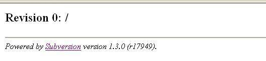

# 用 Apache 和 Subversion 搭建安全的版本控制环境
Subversion 服务器端的基本配置和管理以及如何结合 Apache 实现一些高级管理功能

**标签:** DevOps,软件开发

[原文链接](https://developer.ibm.com/zh/articles/j-lo-apache-subversion/)

吴玥颢, 胡睿

发布: 2006-09-11

* * *

## Subversion 简介

在开源软件的开发过程当中，由于开发方式自由和开发人员分散这些特性，版本控制问题一直是关系到项目成败的重要问题。没有版本控制系统的支持，开源软件的开发过程就是混乱和不可控制的。

长期以来，CVS 作为一种普遍采用的开源版本控制工具，在很多的开源软件项目当中充当了重要的角色。在 Eclipse 当中，更是把 CVS 作为一个默认的插件，与 Ant，JUnit 等工具并列在一起，成为 Eclipse 软件开发的基本工具。近年来，随着开源社区的发展，一种功能更加强大的开源版本控制工具逐渐进入了人们的视野，那就是 Subversion，凭借着更为优秀的特性，Subversion 正在逐步取代 CVS，成为新一代的开源版本控制工具。

相比 CVS，Subversion 中的目录、文件以及改名等元数据都是被版本化的，例如文件的改名、拷贝等等操作；而且，在 Subversion 中，提交操作是不可分割的，修订版本号是基于每次提交操作而非文件；另外，Subversion 可以独立运行，有着轻量级的分支（Branching）与标签（Tagging）操作，版本库可以采用数据库（Berkeley DB）或者是使用特定格式的文件进行存储，对二进制文件进行处理更为有效；最后，Subversion 工具以及相关插件都有着很好的国际化支持，可以支持包括简体中文在内的多种语言版本，方便全球各地的开发人员。这些优秀的新特性，使得 Subversion 成为开源社区目前的最佳选择。

对于普通用户，即应用程序开发者而言，尤其是对 Eclipse 的用户而言，Subversion 的使用十分的简单。通过官方提供的 Eclipse 插件 Subclipse，用户可以在 Eclipse 里面很方便的使用 Subversion 客户端的各项基本功能。具体的客户端设置和使用方法，请参考 Subversion 官方网站 和 Subclipse 官方网站 。简单说来，在 Eclipse 中使用 Subversion 插件的基本功能，如更新、提交、同步、分支等等，基本上同使用 Eclipse 自带的 CVS 插件一模一样，这样，用户就可以从 CVS 方便的转移到 Subversion。

目前，Subversion 已经升级到 1.3.2 版本，相关下载、特性说明和详细使用手册可以在 [Subversion 主页](https://subversion.apache.org/) 上找到。

## 简单的版本库管理

有了简单易用的客户端，大部分的用户都可以轻松使用 Subversion 了，不过，作为服务器端的管理人员，还必须进一步了解服务器端的基本配置管理，才可以充分利用 Subversion 的各项优秀特性。

### 版本库创建

Subversion 的版本库（repository），就是位于服务器端，统一管理和储存数据的地方。本文中，我们以 Linux 为例，介绍在服务器端配置和管理 Subversion 版本库的基本方法。

要创建一个版本库，首先要确定采用哪种数据存储方式。在 Subversion 中，版本库的数据存储有两种方式，一种是在 Berkeley DB 数据库中存放数据；另一种是使用普通文件，采用自定义的格式来储存，称为 FSFS。

两种存放方式各有优缺点，读者可以参考 [http://svnbook.org/](http://svnbook.org/) 上面的文档来了解两者详细的比较和区别，这里，我们仅引用上述文档当中的简单对照表，给出一个简明的比较。

##### 表 1\. 两种版本库数据存储对照表

特性Berkeley DBFSFS对操作中断的敏感很敏感；系统崩溃或者权限问题会导致数据库”塞住”，需要定期进行恢复。不敏感可只读加载不能可以存储平台无关不能可以可从网络文件系统访问不能可以版本库大小稍大稍小扩展性：修订版本树数量无限制某些本地文件系统在处理单一目录包含上千个条目时会出现问题。扩展性：文件较多的目录较慢较慢检出最新代码的速度较快可以大量提交的速度较慢，但时间被分配在整个提交操作中较快，但最后较长的延时可能会导致客户端操作超时组访问权处理对于用户的 umask 设置十分敏感，最好只由一个用户访问。对 umask 设置不敏感功能成熟时间2001 年2004 年

确定了具体的数据存储类型，只要在命令行当中执行 `svnadmin` 命令就可以创建一个 Subversion 版本库，命令如下

```
# 创建文件夹
$ mkdir /etc/svn/
$ mkdir /etc/svn/repos
# 运行创建版本库的命令，指定数据存储为 FSFS，如果要指定为 Berkeley DB，则将 fsfs 替换为 bdb
$ svnadmin create --fs-type fsfs /etc/svn/repos

```

Show moreShow more icon

如果一切正常，命令执行后不会有任何反馈信息而迅速返回，这样，一个新的版本库就被创建出来了。我们来查看一下生成的版本库结构：

```
$ ls -l /etc/svn/repos
总用量 56
drwxrwxr-x  2 robert robert 4096  8月 27 17:27 conf
drwxrwxr-x  2 robert robert 4096  8月 27 17:27 dav
drwxrwsr-x  5 robert robert 4096  8月 27 17:27 db
-r--r--r--  1 robert robert    2  8月 27 17:27 format
drwxrwxr-x  2 robert robert 4096  8月 27 17:27 hooks
drwxrwxr-x  2 robert robert 4096  8月 27 17:27 locks
-rw-rw-r--  1 robert robert  229  8月 27 17:27 README.txt

```

Show moreShow more icon

其中，conf 目录下存放了版本库的配置文件，包括用户访问控制和权限控制等内容，文件本身的注释说明十分详细，读者可以根据注释自行配置；dav 目录是提供给 Apache 相关模块的目录，目前为空；db 目录下存放着 Subversion 所要管理的所有受版本控制的数据，不同的存储方式（Berkeley DB 或者 FSFS）下有着不同的目录结构，不过我们一般不用直接修改和查看这个目录下的内容，Subversion 的命令可以安全的操作这个目录；另外，hooks 目录存放着钩子脚本及其模版（一种版本库事件触发程序），locks 目录存放着 Subversion 版本库锁定数据，format 文件记录了版本库的布局版本号。

### 项目添加

有了新建的版本库，就可以往里面添加项目了。不过，管理员必须考虑的问题是，应该将每一个项目分别放在不同的版本库里面，还是应该将它们放在统一的版本库里面。统一的版本库可以让管理员更加容易的升级和备份，不过，由于访问权限控制是针对整个版本库的，所以，统一的版本库也为不同项目配置不同的访问权限带来了麻烦。所以，管理员应该根据实际情况权衡考虑。

我们以统一的版本库为例，添加两个项目 project\_luni 和 project\_test。要做到这个，最好的办法就是用 `svn import` 命令导入已有的目录树。

首先，我们在一个临时目录下，根据 Subversion 版本控制的一般布局结构，创建出两个项目的主要目录树，如下：

```
/etc/svn/tmp
|
――project_luni
|    |
|    ――branches
|    |
|    ――tags
|    |
|    ――trunk
|
――project_test
    |
    ――branches
    |
    ――tags
    |
    ――trunk

```

Show moreShow more icon

然后，用 `svn import` 命令来进行项目的导入：

```
$ svn import /etc/svn/tmp/ file:///etc/svn/repos/ --message "init"
新增           /etc/svn/tmp/project_test
新增           /etc/svn/tmp/project_test/trunk
新增           /etc/svn/tmp/project_test/branches
新增           /etc/svn/tmp/project_test/tags
新增           /etc/svn/tmp/project_luni
新增           /etc/svn/tmp/project_luni/trunk
新增           /etc/svn/tmp/project_luni/branches
新增           /etc/svn/tmp/project_luni/tags
提交后的修订版为 1。

```

Show moreShow more icon

### 版本库查看

作为版本库管理员，我们经常需要查看 Subversion 版本库的状况，这就需要一些”只读”的查看工具。

在上述项目导入完成以后，我们可以用 `svn list` 确认导入的项目是否正确：

```
$ svn list --verbose file:///etc/svn/repos/
1 robert                 8月 27 18:24 project_luni/
1 robert                 8月 27 18:24 project_test/

```

Show moreShow more icon

另外，如果要查看最新修订版本的信息，可以使用 `svnlook info` 命令：

```
$ svnlook info /etc/svn/repos/
robert
2006-08-27 18:24:27 +0800 (日, 27  8月 2006)
0

```

Show moreShow more icon

命令输出了这个版本库的最新修订版本信息，包括作者、时间、日志字数和日志内容等。除开最新修订版以外，我们还可以在命令后面接上 `"--revision 版本号”` 来指定某一个修订版的显示。

另外，我们还可以用如下命令来显示版本库的具体树形结构，后面的 `"--show-ids”` 选项指定显示每一个显示元素的修改版本 ID。

```
$ svnlook tree /etc/svn/repos/ --show-ids
/ <0.0.r1/1007>
project_test/ <1.0.r1/333>
trunk/ <2.0.r1/0>
branches/ <3.0.r1/74>
tags/ <4.0.r1/152>
project_luni/ <5.0.r1/793>
trunk/ <6.0.r1/454>
branches/ <7.0.r1/530>
tags/ <8.0.r1/609>

```

Show moreShow more icon

### 其他

这里有一个需要新手，尤其是习惯了 Subversion 客户端命令 `"svn”` 的用户注意的问题，那就是， `"svnadmin”` 和 `"svnlook”` 都被认为是服务器端的管理工具，只被用于版本库所在的机器，用来检查和维护版本库，不能通过网络来执行任务。所以，试图将 URL 甚至本地 file 路径传递给这两个程序，都是错误的。

Subversion 还有很多管理工具可供管理员应用，需要了解这项工具的使用方法，读者们可以用 `svn help`, `svnadmin help`, `svnlook help` 等等命令查看帮助信息，另外， Subversion 参考手册 提供了更为全面和详细的使用介绍。

## 基本的服务器配置

Subversion 设计了一个抽象的网络层，版本库建立完毕之后，可以通过各种服务器向外公布。svnserve 是 Subversion 自带的一个小型的服务器，它使用独立的协议与客户端。我们可以通过

```
svnserve –i

```

Show moreShow more icon

作为 inetd 启动或者

```
svnserve –d

```

Show moreShow more icon

作为守护进程启动一个服务。服务器启动后，客户端即可以通过绝对路径访问。如上例可以访问 `svn://服务器IP/etc/svn/repos` 。同时可以指定一些选项，常用的如 `-r` ，用来指定版本库的根路径，例如假设版本库位于 /etc/svn/repos：

```
svnserve –d -r /etc/svn

```

Show moreShow more icon

则客户端可以通过如下 URL 访问服务器： `svn://服务器IP/repos` ， 这样可以有效的避免暴露本地路径。另外如 `--listen-port` ， `--listen-host` 可以指定绑定的地址和端口， `-R` 可以强制设定为 Read-Only 模式。如果在 Windows 操作系统下，可以将版本库设定在 C 分区，如 `c:\svnroot\repos` 可以通过 `svn://服务器IP/svnroot/repos访问` ，如果在其他分区，就必须要通过 `-r` 选项来指定 root 位置。

svnserve 可以通过配置 svnserve.conf 来进行一些简单的访问权限控制。你可以在版本库的 conf 子文件夹下发现这个文件。文件的初始内容大致如下：

```
[general]
# anon-access = read
# auth-access = write
password-db = passwd
# authz-db = authz
# realm = My First Repository

```

Show moreShow more icon

其中 `anon-access` 表示匿名用户的权限， `auth-access` 表示认证用户的权限设置， `password-db` 指向保存用户帐号密码的文件的位置，可以使用相对路径。svnserve 只能对全局提供简单的访问控制，如果想要更加灵活的方式，可以使用 Apache Http Server 作为向外公布版本库的方式。

## 与 Apache Http Server 的结合

通过 Http 协议访问版本库是 Subversion 的亮点之一。使用 Http 协议意味着只需要打开浏览器，输入 URL 即可轻松的浏览整个版本库。灵活通常带来复杂性，Http 方式相对于 svnserve 方式来说需要更多的配置。

由于 Subversion 需要版本化的控制，因此标准的 Http 协议不能满足需求。要让 Apache 与 Subversion 协同工作，需要使用 WebDAV（Web 分布式创作和版本控制）。WebDAV 是 HTTP 1.1 的扩展，关于 WebDAV 的规范和工作原理，可以参考 IETF RFC 2518 。

为了使 Subversion 与 dav 模块通信，需要安装 mod\_dav\_svn 插件，可以在 Subversion 的安装目录中找到。将其拷贝到 Apache 安装目录的 modules 文件夹下。接下来就是配置 Apache 的 httpd.conf 文件，让 Apache 在启动的时候加载上述模块。

需要添加的内容如下：

```
LoadModule dav_module modules/mod_dav.so
LoadModule dav_svn_module modules/mod_dav_svn.so
<Location /repos>
DAV svn
SVNPath /etc/svn/repos
</Location>

```

Show moreShow more icon

首先需要启用 dav\_module，然后加载 dav\_svn\_module。Location 标签指出访问的 URL 以及在服务器上的实际位置。配置完毕后重新启动 Apache，打开浏览器，输入 `http://服务器IP/repos` 将会看到如下画面：

##### 图 1\. 一个初始版本库



这表示 Apache 的 dav\_svn 模块已经可以正常工作了。用户可以使用任何一种 Subversion 的客户端通过 Http 协议访问你的版本库。

如果想要指定多个版本库，可以用多个 Location 标签，也可以使用 SVNParentPath 代替 SVNPath，例如在 `/etc/svn` 下有多个版本库 repos1，repos2 等等，用如下方式指定：

```
<Location /repos>
DAV svn
SVNParentPath /etc/svn
</Location>

```

Show moreShow more icon

“SVNParentPath /etc/svn” 表示 /etc/svn 下的每个子目录都是一个版本库。可以通过 `http://服务器IP/repos/repos1` ， `http://服务器IP/repos/repos2` 来访问。

现在你的版本库任何人都可以访问，并且有完全的写操作权限。也就是说任何人都可以匿名读取，修改，提交，以及删除版本库中的内容。显然大部分场合这是不符合需求的。那么如何进行权限设置呢，Apache 提供了基本的权限设置：

首先需要创建一个用户文件。Apache 提供了一个工具 htpasswd，用于生成用户文件，可以在 Apache 的安装目录下找到。具体使用方法如下：

```
htpasswd etc/svn/passwordfile username

```

Show moreShow more icon

如果 passwordfile 不存在，可以加上 `-c` 选项让 htpasswd 新建一个。创建好的文件内容是用户名加上密码的 MD5 密文。

接下来修改 httpd.conf，在 Location 标签中加入如下内容：

```
AuthType Basic
AuthName "svn repos"
AuthUserFile /etc/svn/passwordfile
Require valid-user

```

Show moreShow more icon

重新启动 Apache， 打开浏览器访问版本库。Apache 会提示你输入用户名和密码来认证登陆了，现在只有 passwordfile 文件中设定的用户才可以访问版本库。也可以配置只有特定用户可以访问，替换上述 “Require valid-user” 为 “Require user tony robert” 将只有 tony 和 robert 可以访问该版本库。

有的时候也许不需要这样严格的访问控制，例如大多数开源项目允许匿名的读取操作，而只有认证用户才允许写操作。为了实现更为细致的权限认证，可以使用 Limit 和 LimitExcept 标签。例如：

```
<LimitExcept GET PROPFIND OPTIONS REPORT>
    require valid-user
</LimitExcept>

```

Show moreShow more icon

如上配置将使匿名用户有读取权限，而限制只有 passwordfile 中配置的用户可以使用写操作。如果这还不能满足你的要求，可以使用 Apache 的 mod\_authz\_svn 模块对每个目录进行认证操作。

### 用 mod\_authz\_svn 进行目录访问控制

首先需要让 Apache 将 mod\_authz\_svn 模块加载进来。在 Subversion 的安装目录中找到 mod\_auth\_svn 模块，将其拷贝到 Apache 安装目录的 modules 子目录下。修改 httpd.conf 文件，找到

```
LoadModule dav_svn_module modules/mod_dav_svn.so

```

Show moreShow more icon

在其后面加上

```
LoadModule authz_svn_module modules/mod_authz_svn.so

```

Show moreShow more icon

现在可以在 Location 标签中使用 authz 的功能了。一个基本的 authz 配置如下：

```
<Location /repos>
DAV svn
SVNPath /etc/svn/repos
AuthType Basic
AuthName "svn repos"
AuthUserFile /etc/svn/passwd
AuthzSVNAccessFile /etc/svn/accesspolicy
Satisfy Any
Require valid-user
</Location>

```

Show moreShow more icon

AuthzSVNAccessFile 指向的是 authz 的策略文件，详细的权限控制可以在这个策略文件中指定，如：

```
#两个分组：committers，developers
[groups]
committers = paulex richard
developers = jimmy michel spark sean \
           steven tony robert
#在根目录下指定所有的用户有读权限
[/]
* = r
#追加 committers 组用户有读写权限
@committers = rw
#在 branches/dev 目录下指定 developers 组的用户有读写权限
[/branches/dev]
@developers = rw
#在 /tags 组下给予用户 tony 读写权限
[/tags]
tony = rw
#禁止所有用户访问 /private 目录
[/private]
* =
#给 committers 组用户读权限
@committers= r

```

Show moreShow more icon

使用 SVNParentPath 代替 SVNPath 来指定多个版本库的父目录时，其中所有的版本库都将按照这个策略文件配置。例如上例中 tony 将对所有版本库里的 /tags 目录具有读写权限。如果要对具体每个版本库配置，用如下的语法：

```
[groups]
project1_committers = paulex richard
project2_committers = jimmy michel spark sean \
           steven tony robert
[repos1:/]
* = r
@ project1_committer = rw
[repos2:/]
* = r
@ project2_committer = rw

```

Show moreShow more icon

这样项目1的 committer 组只能对 repos1 版本库下的文件具有写权限而不能修改版本库 repos2，同样项目2的 commiter 也不能修改 repos1 版本库的文件。

### 用 MySQL 代替文件形式存放密码

到目前为止我们的用户名密码文件还是以文本文件形式存放在文件系统中的，出于安全性的需要或者单点登陆等可扩展性的考虑，文本文件的管理方式都不能满足需求了。通过 Apache 的 module\_auth\_mysql 模块，我们可以用 MySQL 来保存用户信息。该模块的主页在 [http://modauthmysql.sourceforge.net/](http://modauthmysql.sourceforge.net/) ，安装方法同上述 Apache 的模块一样，拷贝至 modules 目录并在 httpd.conf 文件中添加如下语句：

```
LoadModule mysql_auth_module modules/mod_auth_mysql.so

```

Show moreShow more icon

相应的 Location 区域改写为：

```
<Location /repos>
AuthName "MySQL auth"
AuthType Basic
AuthMySQLHost localhost
AuthMySQLCryptedPasswords Off
AuthMySQLUser root
AuthMySQLDB svn
AuthMySQLUserTable users
require valid-user
</Location>

```

Show moreShow more icon

然后在 mysql 中添加名为 svn 的数据库，并建立 users 数据表：

```
create database svn;
use svn;
CREATE TABLE users (
user_name CHAR(30) NOT NULL,
user_passwd CHAR(20) NOT NULL,
user_group CHAR(10),
PRIMARY KEY (user_name)
);

```

Show moreShow more icon

在 users 表中插入用户信息

```
insert into users values('username','password','group');

```

Show moreShow more icon

重新启动 Apache，在访问版本库的时候 Apache 就会用 mysql 数据表中的用户信息来验证了。

### 用 SSL 实现安全的网络传输

通过 Apache 的网络链接，版本库中的代码和数据可以在互联网上传输，为了避免数据的明文传输，实现安全的版本控制，需要对数据的传输进行加密。Apache 提供了基于 SSL 的数据传输加密模块 mod\_ssl，有了它，用户就可以用 https 协议访问版本库，从而实现数据的加密传输了。SSL 协议及其实现方式，是一个非常复杂的话题，本文只是介绍 Apache 提供的最基本的SSL配置方法，更加详细的介绍内容，请参考 [http://httpd.apache.org/docs-2.0/ssl/](http://httpd.apache.org/docs-2.0/ssl/) 上的文档。

开始配置前，我们需要一个实现 Apache 中 SSL 模块的动态程序库，通常名为 mod\_ssl.so，及其配置文件，通常名为 ssl.conf。这个实现是跟 Apache 的版本相关的，不匹配的版本是不能用的；而且，并不是每一个 Apache 的版本都自带了相关实现文件，很多情况下，我们需要自己去搜寻相关文件。另外，我们还需要 OpenSSL 软件及其配置文件，来生成加密密钥和数字证书。

有了相关的工具和文件，我们就可以开始生成 SSL 的证书和密钥了。首先，我们需要找到 openssl 程序及其配置文件 openssl.cnf，运行如下命令来生成 128 位的 RSA 私有密钥文件

```
my-server.key：
openssl genrsa -des3 -out my-server.key 1024
Loading 'screen' into random state - done
Generating RSA private key, 1024 bit long modulus
.....++++++
........++++++
e is 65537 (0x10001)
Enter pass phrase for server.key:********
Verifying - Enter pass phrase for server.key:********

```

Show moreShow more icon

命令运行期间需要用户输入并确认自己的密码。

现在，我们需要 SSL 的认证证书，证书是由 CA（certificate authority） 发放并且认证的。为此，我们可以用如下命令生成一个 CSR(Certificate Signing Request) 文件发给 CA，从而得到 CA 的认证：

```
openssl req -new -key my-server.key -out my-s erver.csr -config openssl.cnf

```

Show moreShow more icon

当然，一般情况下，如果 Subversion 的用户不是太多，安全情况不是很复杂，我们也可以生成一个自签名的认证证书，从而省去了向 CA 申请认证的麻烦。如下命令：

```
openssl req -new -key my-server.key -x509 -out my-server.crt -config openssl.cnf

```

Show moreShow more icon

以上两个命令都需要用户输入那个 key 文件的密码，以及一些网络设置信息，如域名，邮箱等等，这里输入的服务器域名应该与 Apache 配置文件当中的一致。现在，我们可以在 Apache 的 conf 目录下新建一个 ssl 目录，将 my-server.key 和 my-server.crt 文件都移动到 ssl 目录里面。然后修改 ssl.conf 文件，将 SSLCertificateKeyFile 和 SSLCertificateFile 项指向这两个文件。

如果 Apache 的 module 目录里面没有 mod\_ssl.so 文件，可以将事先准备好的文件拷贝过去。然后，我们可以设置 Apache 的配置文件 httpd.conf，将 ssl 模块加入其中：

```
LoadModule ssl_module modules/mod_ssl.so

```

Show moreShow more icon

然后，在配置文件的最后，加上如下 SSL 相关配置项：

```
SSLMutex default
SSLRandomSeed startup builtin
SSLSessionCache none

ErrorLog logs/SSL.log
LogLevel info
<VirtualHost svntest.ut.cn.ibm.com:443>
SSLEngine On
SSLCertificateFile conf/ssl/my-server.crt
SSLCertificateKeyFile conf/ssl/my-server.key
</VirtualHost>

```

Show moreShow more icon

这样，基本的设置工作就完成了。重新启动 Apache 服务器，现在可以用 https 协议代替 http 协议来访问版本库了。如果要限定版本库只能用 https 访问，我们可以在 Apache 配置文件当中 Subversion 部分加上 “SSLRequireSSL”。如下：

```
<Location /repos>
DAV svn
SVNPath /etc/svn/repos
.............#other items
SSLRequireSSL
</Location>

```

Show moreShow more icon

## 结束语

Subversion 以其优良的版本控制功能，灵活的网络访问模型，以及与 Apache 服务器联合配置所带来的更强大的管理控制功能，逐渐在开源软件开发的实践当中得到广泛的应用。本文重点介绍了 Subversion 服务器端的配置以及与 Apache 服务器联合配置的基本步骤和简单应用，实现了简单的实例应用。读者如果想要进一步了解相关信息，请参考文章后面列出的相关资料。

## 相关主题

- [Subversion 官方网站](https://subversion.apache.org/)
- [Subclipse GitHub 链接](https://github.com/subclipse)
- [IETF RFC 2518](https://www.ietf.org/rfc/rfc2518.txt)
- [Subversion 简介](https://www.ibm.com/developerworks/cn/java/j-subversion/)
- [用 Subversion 构建版本控制环境](https://www.ibm.com/developerworks/cn/opensource/os-subversion/)