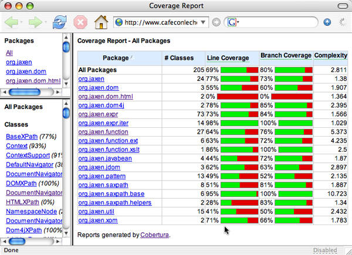
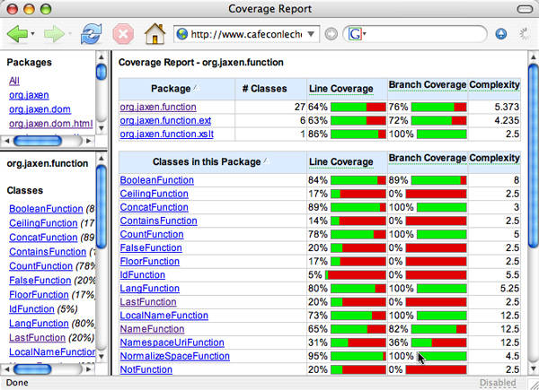
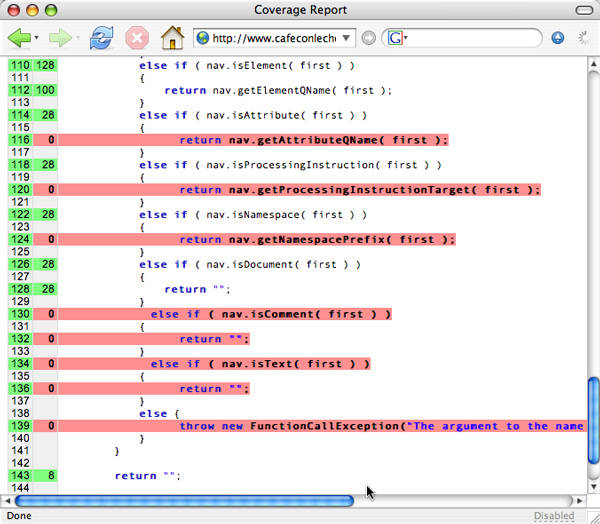

# 用 Cobertura 测量测试覆盖率
找出隐藏 bug 的未测试到的代码

**标签:** DevOps,Java

[原文链接](https://developer.ibm.com/zh/articles/j-cobertura/)

Elliotte Rusty Harold

发布: 2005-05-26

* * *

尽管测试先行编程（test-first programming）和单元测试已不能算是新概念，但测试驱动的开发仍然是过去 10 年中最重要的编程创新。最好的一些编程人员在过去半个世纪中一直在使用这些技术，不过，只是在最近几年，这些技术才被广泛地视为在时间及成本预算内开发健壮的无缺陷软件的关键所在。但是，测试驱动的开发不能超过测试所能达到的程度。测试改进了代码质量，但这也只是针对实际测试到的那部分代码而言的。您需要有一个工具告诉您程序的哪些部分没有测试到，这样就可以针对这些部分编写测试代码并找出更多 bug。

Mark Doliner 的 Cobertura （ _cobertura_ 在西班牙语是覆盖的意思）是完成这项任务的一个免费 GPL 工具。Cobertura 通过用额外的语句记录在执行测试包时，哪些行被测试到、哪些行没有被测试到，通过这种方式来度量字节码，以便对测试进行监视。然后它生成一个 HTML 或者 XML 格式的报告，指出代码中的哪些包、哪些类、哪些方法和哪些行没有测试到。可以针对这些特定的区域编写更多的测试代码，以发现所有隐藏的 bug。

## 阅读 Cobertura 输出

我们首先查看生成的 Cobertura 输出。图 1 显示了对 Jaxen 测试包运行 Cobertura 生成的报告（请参阅 参考资料 ）。从该报告中，可以看到从很好（在 `org.jaxen.expr.iter` 包中几乎是 100%）到极差（在 `org.jaxen.dom.html` 中完全没有覆盖）的覆盖率结果。

##### 图 1\. Jaxen 的包级别覆盖率统计数据



Cobertura 通过被测试的行数和被测试的分支数来计算覆盖率。第一次测试时，两种测试方法之间的差别并不是很重要。Cobertura 还为类计算平均 McCabe 复杂度（请参阅 参考资料 ）。

可以深入挖掘 HTML 报告，了解特定包或者类的覆盖率。图 2 显示了 `org.jaxen.function` 包的覆盖率统计。在这个包中，覆盖率的范围从 `SumFunction` 类的 100% 到 `IdFunction` 类的仅为 5%。

##### 图 2\. org.jaxen.function 包中的代码覆盖率



进一步深入到单独的类中，具体查看哪一行代码没有测试到。图 3 显示了 `NameFunction` 类中的部分覆盖率。最左边一栏显示行号。后一栏显示了执行测试时这一行被执行的次数。可以看出，第 112 行被执行了 100 次，第 114 行被执行了 28 次。用红色突出显示的那些行则根本没有测试到。这个报告表明，虽然从总体上说该方法被测试到了，但实际上还有许多分支没有测试到。

##### 图 3\. NameFunction 类中的代码覆盖率



Cobertura 是 jcoverage 的分支（参阅参考资源）。GPL 版本的 jcoverage 已经有一年没有更新过了，并且有一些长期存在的 bug，Cobertura 修复了这些 bug。原来的那些 jcoverage 开发人员不再继续开发开放源码，他们转向开发 jcoverage 的商业版和 jcoverage+，jcoverage+ 是一个从同一代码基础中发展出来的封闭源代码产品。开放源码的奇妙之处在于：一个产品不会因为原开发人员决定让他们的工作获得相应的报酬而消亡。

### 确认遗漏的测试

利用 Cobertura 报告，可以找出代码中未测试的部分并针对它们编写测试。例如，图 3 显示 Jaxen 需要进行一些测试，运用 `name()` 函数对文字节点、注释节点、处理指令节点、属性节点和名称空间节点进行测试。

如果有许多未覆盖的代码，像 Cobertura 在这里报告的那样，那么添加所有缺少的测试将会非常耗时，但也是值得的。不一定要一次完成它。您可以从被测试的最少的代码开始，比如那些所有没有覆盖的包。在测试所有的包之后，就可以对每一个显示为没有覆盖的类编写一些测试代码。对所有类进行专门测试后，还要为所有未覆盖的方法编写测试代码。在测试所有方法之后，就可以开始分析对未测试的语句进行测试的必要性。

### （几乎）不留下任何未测试的代码

是否有一些可以测试但不应测试的内容？这取决于您问的是谁。在 JUnit FAQ 中，J. B. Rainsberger 写到”一般的看法是：如果 _自身_ 不会出问题，那么它会因为太简单而不会出问题。第一个例子是 `getX()` 方法。假定 `getX()` 方法只提供某一实例变量的值。在这种情况下，除非编译器或者解释器出了问题，否则 `getX()` 是不会出问题的。因此，不用测试 `getX()` ，测试它不会带来任何好处。对于 `setX()` 方法来说也是如此，不过，如果 `setX()` 方法确实要进行任何参数验证，或者说确实有副作用，那么还是有必要对其进行测试。”

理论上，对未覆盖的代码编写测试代码不一定就会发现 bug。但在实践中，我从来没有碰到没有发现 bug 的情况。未测试的代码充满了 bug。所做的测试越少，在代码中隐藏的、未发现的 bug 就会越多。

我不同意。我已经记不清在”简单得不会出问题”的代码中发现的 bug 的数量了。确实，一些 getter 和 setter 很简单，不可能出问题。但是我从来就没有办法区分哪些方法是真的简单得不会出错，哪些方法只是看上去如此。编写覆盖像 setter 和 getter 这样简单方法的测试代码并不难。为此所花的少量时间会因为在这些方法中发现未曾预料到的 bug 而得到补偿。

一般来说，开始测量后，达到 90% 的测试覆盖率是很容易的。将覆盖率提高到 95% 或者更高就需要动一下脑筋。例如，可能需要装载不同版本的支持库，以测试没有在所有版本的库中出现的 bug。或者需要重新构建代码，以便测试通常执行不到的部分代码。可以对类进行扩展，让它们的受保护方法变为公共方法，这样就可以对这些方法进行测试。这些技巧看起来像是多此一举，但是它们曾帮助我在一半的时间内发现更多的未发现的 bug。

并不总是可以得到完美的、100% 的代码覆盖率。有时您会发现，不管对代码如何改造，仍然有一些行、方法、甚至是整个类是测试不到的。下面是您可能会遇到的挑战的一些例子：

- 只在特定平台上执行的代码。例如，在一个设计良好的 GUI 应用程序中，添加一个 Exit 菜单项的代码可以在 Windows PC 上运行，但它不能在 Mac 机上运行。
- 捕获不会发生的异常的 `catch` 语句，比如在从 `ByteArrayInputStream` 进行读取操作时抛出的 `IOException` 。
- 非公共类中的一些方法，它们永远也不会被实际调用，只是为了满足某个接口契约而必须实现。
- 处理虚拟机 bug 的代码块，比如说，不能识别 UTF-8 编码。

考虑到上面这些以及类似的情况，我认为一些极限程序员自动删除所有未测试代码的做法是不切实际的，并且可能具有一定的讽刺性。不能总是获得绝对完美的测试覆盖率并不意味着就不会有更好的覆盖率。

然而，比执行不到的语句和方法更常见的是残留代码，它不再有任何作用，并且从代码基中去掉这些代码也不会产生任何影响。有时可以通过使用反射来访问私有成员这样的怪招来测试未测试的代码。还可以为未测试的、包保护（package-protected）的代码来编写测试代码，将测试类放到将要测试的类所在那个包中。但最好不要这样做。所有不能通过发布的（公共的和受保护的）接口访问的代码都应删除。执行不到的代码不应当成为代码基的一部分。代码基越小，它就越容易被理解和维护。

不要漏掉测量单元测试包和类本身。我不止一次注意到，某些个测试方法或者类没有被测试包真正运行。通常这表明名称规范中存在问题（比如将一个方法命名为 `tesSomeReallyComplexCondition`，而不是将其命名为 `testSomeReallyComplexCondition）`，或者忘记将一个类添加到主 `suite()` 方法中。在其他情况下，未预期的条件导致跳过了测试方法中的代码。不管是什么情况，都是虽然已经编写了测试代码，但没有真正运行它。JUnit 不会告诉您它没有像您所想的那样运行所有测试，但是 Cobertura 会告诉您。找出了未运行的测试后，改正它一般很容易。

## 运行 Cobertura

在了解了测量代码覆盖率的好处后，让我们再来讨论一下如何用 Cobertura 测量代码覆盖率的具体细节。Cobertura 被设计成为在 Ant 中运行。现在还没有这方面的 IDE 插件可用，不过一两年内也许就会有了。

首先需要在 build.xml 文件中添加一个任务定义。以下这个顶级 `taskdef` 元素将 cobertura.jar 文件限定在当前工作目录中：

```
<taskdef classpath="cobertura.jar" resource="tasks.properties" />

```

Show moreShow more icon

然后，需要一个 `cobertura-instrument` 任务，该任务将在已经编译好的类文件中添加日志代码。 `todir` 属性指定将测量类放到什么地方。 `fileset` 子元素指定测量哪些 .class 文件：

```
<target name="instrument">
<cobertura-instrument todir="target/instrumented-classes">
    <fileset dir="target/classes">
      <include name="**/*.class"/>
    </fileset>
</cobertura-instrument>
</target>

```

Show moreShow more icon

用通常运行测试包的同一种类型的 Ant 任务运行测试。惟一的区别在于：被测量的类必须在原始类出现在类路径中之前出现在类路径中，而且需要将 Cobertura JAR 文件添加到类路径中：

```
<target name="cover-test" depends="instrument">
<mkdir dir="${testreportdir}" />
<junit dir="./" failureproperty="test.failure" printSummary="yes"
         fork="true" haltonerror="true">
    <!-- Normally you can create this task by copying your existing JUnit
         target, changing its name, and adding these next two lines.
         You may need to change the locations to point to wherever
         you've put the cobertura.jar file and the instrumented classes. -->
    <classpath location="cobertura.jar"/>
    <classpath location="target/instrumented-classes"/>
    <classpath>
      <fileset dir="${libdir}">
        <include name="*.jar" />
      </fileset>
      <pathelement path="${testclassesdir}" />
      <pathelement path="${classesdir}" />
    </classpath>
    <batchtest todir="${testreportdir}">
      <fileset dir="src/java/test">
        <include name="**/*Test.java" />
        <include name="org/jaxen/javabean/*Test.java" />
      </fileset>
    </batchtest>
</junit>
</target>>

```

Show moreShow more icon

Jaxen 项目使用 JUnit 作为其测试框架，但是 Cobertura 是不受框架影响的。它在 TestNG、Artima SuiteRunner、HTTPUni 或者在您自己在地下室开发的系统中一样工作得很好。

最后， `cobertura-report` 任务生成本文开始部分看到的那个 HTML 文件：

```
<target name="coverage-report" depends="cover-test">
<cobertura-report srcdir="src/java/main" destdir="cobertura"/>
</target>

```

Show moreShow more icon

`srcdir` 属性指定原始的 .java 源代码在什么地方。 `destdir` 属性指定 Cobertura 放置输出 HTML 的那个目录的名称。

在自己的 Ant 编译文件中加入了类似的任务后，就可以通过键入以下命令来生成一个覆盖报告：

```
% ant instrument
% ant cover-test
% ant coverage-report

```

Show moreShow more icon

当然，如果您愿意的话，还可以改变目标任务的名称，或者将这三项任务合并为一个目标任务。

## 结束语

Cobertura 是敏捷程序员工具箱中新增的一个重要工具。通过生成代码覆盖率的具体数值，Cobertura 将单元测试从一种艺术转变为一门科学。它可以寻找测试覆盖中的空隙，直接找到 bug。测量代码覆盖率使您可以获得寻找并修复 bug 所需的信息，从而开发出对每个人来说都更健壮的软件。