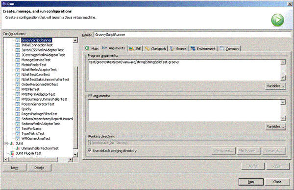

# 用 Groovy 更迅速地对 Java 代码进行单元测试
使用 Groovy 和 JUnit 对 Java 代码进行单元测试的一个简单策略

**标签:** Java

[原文链接](https://developer.ibm.com/zh/articles/j-pg11094/)

Andrew Glover

发布: 2004-11-09

* * *

开始之前，我首先要招认：我是一个单元测试狂。实际上，我总是无法编写足够的单元测试。如果我相当长一段时间都在进行开发，而 _没有_ 编写相应的单元测试，我就会觉得紧张。单元测试给我信心，让我相信我的代码能够工作，而且我只要看一下，可以修改它，就不会害怕它会崩溃。

而且，作为一个单元测试狂，我喜欢编写多余的测试用例。但是，我的兴奋不是来自 _编写_ 测试用例，而是 _看着_ 它们生效。所以，如果我能用更快的方式编写测试，我就能更迅速地看到它们的结果。这让我感觉更好。更快一些！

后来，我找到了 Groovy，它满足了我的单元测试狂，而且至今为止，对我仍然有效。这种新语言给单元测试带来的灵活性，非常令人兴奋，值得认真研究。本文是介绍 Groovy 实践方面的新系列的第一部分，在文中，我将向您介绍使用 Groovy 进行单元测试的快乐。我从概述开始，概述 Groovy 对 Java 平台上的开发所做的独特贡献，然后转而讨论使用 Groovy 和 JUnit 进行单元测试的细节，其中重点放在 Groovy 对 JUnit 的 `TestCase` 类的扩展上。最后，我用一个实用的示例进行总结，用第一手材料向您展示如何把 _groovy_ 的这些特性与 Eclipse 和 Maven 集成在一起。

## 不要再坚持 Java 纯粹主义了！

在我开始介绍用 Groovy 进行单元测试的实际经验之前，我认为先谈谈一个更具一般性的问题 —— 它在您的开发工具箱中的位置，这非常重要。事实是，Groovy 不仅是运行在 Java 运行时环境（JRE）中的脚本语言，它还被提议作为用于 Java 平台的标准语言。正如您们之中的人已经从 _alt.lang.jre_ 系列（请参阅 参考资料 ）中学习到的，在为 Java 平台进行脚本编程的时候，有无数的选择，其中大多数是面向快速应用程序开发的高度灵活的环境。

虽然有这么丰富的选择，但还是有许多开发人选择坚持自己喜欢的、最熟悉的范式：Java 语言。虽然大多数情况下，Java 编程都是很好的选择，但是它有一个非常重要的缺点，蒙住了只看见 Java 的好处的这些人的眼睛。正如一个智者曾经指出的： _如果您仅有的一个工具是一把锤子，那么您看每个问题时都会觉得它像是钉子_ 。我认为这句谚语道出了适用于软件开发的许多事实。

虽然我希望用这个系列说服您 Java 不是也不应当是开发应用程序的惟一选择，但该脚本确实既有适用的地方也有不适用的地方。专家和新手的区别在于：知道什么时候 _运用_ 该脚本，什么时候 _避免_ 使用它。

##### 关于本系列

把工具整合到开发实践中的关键是了解什么时候使用它，以及什么时候把它留在工具箱中。脚本语言能够成为工具包中极为强大的附件，但是只有正确地应用在适当的场合时才是这样。为了实现 _实战 Groovy_ 系列文章这个目标，我专门研究了 Groovy 的一些实战，教给您什么时候怎样才能成功地应用它们。

例如，对于高性能、事务密集型、企业级应用程序，Groovy 脚本通常不太适合；在这些情况下，您最好的选择 _可能_ 是普通的 J2EE 系统。但另一方面，一些脚本 —— 特别是用 Groovy 编写的脚本 —— 会非常有用，因为它能迅速地为小型的、非常特殊的、不是性能密集型的应用程序（例如配置系统/生成系统）快速制作原型。对于报表应用程序来说，Groovy 脚本也是近乎完美的选择，而最重要的是，对单元测试更是如此。

## 为什么用 Groovy 进行单元测试？

是什么让 Groovy 比起其他脚本平台显得更具有吸引力呢？是它与Java 平台无缝的集成。还是因为它是基于 Java 的语言（不像其他语言，是对 JRE 的替代，因此可能基于旧版的处理器），对于 Java 开发人员来说，Groovy 意味着一条短得让人难以置信的学习曲线。而且一旦将这条学习曲线拉直，Groovy 就能提供一个无与伦比的快速开发平台。

从这个角度来说，Groovy 成功的秘密，在于它的语法 _就是_ Java 语法，但是规则更少。例如，Groovy 不要求使用分号，变量类型和访问修饰符也是可选的。而且，Groovy 利用了标准的 Java 库，这些都是您已经很熟悉的，包括 `Collections` 和 `File/IO` 。而且，您还可以利用任何 Groovy 提供的 Java 库，包括 JUnit。

事实上，令人放松的类 Java 语法、对标准 Java 库的重用以及快捷的生成-运行周期，这些都使 Groovy 成为快速开发单元测试的理想替代品。但是会说的不如会做的，还是让我们在代码中看看它的实际效果！

## JUnit 和 Groovy

用 Groovy 对 Java 代码进行单元测试简单得不能再简单了，有很多入门选择。最直接的选择是沿袭行业标准 —— JUnit。Unit 的简单性和其功能的强大都是无与伦比的，作为非常有帮助的 Java 开发工具，它的普遍性也是无与伦比的，而且没有什么能够阻挡 JUnit 和 Groovy 结合，所以为什么多此一举呢？实际上，只要您看过 JUnit 和 Groovy 在一起工作，我敢打赌您就永远再也不会回头！在这里，要记住的关键的事，您在 Java 语言中能用 JUnit 做到的事，在 Groovy 中用 JUnit 也全都能做到；但是需要的代码要少得多。

### 入门

在您下载了 JUnit 和 Groovy（请参阅参考资源）之后，您将有两个选择。第一个选择是编写普通的 JUnit 测试用例，就像以前一直做的那样，扩展 JUnit 令人称赞的 `TestCase` 。第二个选择是应用 Groovy 简洁的 `GroovyTestCase` 扩展，它会扩展 JUnit 的 `TestCase` 。第一个选项是您最快的成功途径，它拥有最多 _与 Java 类似的_ 相似性。而另一方面，第二个选择则把您推进了 Groovey 的世界，这个选择有最大的敏捷性。

开始的时候，我们来想像一个 Java 对象，该对象对指定的 `string` 应用了一个过滤器，并根据匹配结果返回 `boolean` 值。该过滤器可以是简单的 `string` 操作，例如 `indexOf()` ，也可以更强大一些，是正则表达式。可能要通过 `setFilter()` 方法在运行时设置将使用的过滤器， `apply()` 方法接受要过滤的 `string` 。清单 1 用普通的 Java 代码显示了这个示例的 `Filter` 接口：

##### 清单 1\. 一个简单的 Java Filter 接口

```
public interface Filter {
void setFilter(String fltr);
boolean applyFilter(String value);
}

```

Show moreShow more icon

我们的想法是用这个特性从大的列表中过滤掉想要的或者不想要的包名。所以，我建立了两个实现： `RegexPackageFilter` 和 `SimplePackageFilter` 。

把 Groovy 和 JUnit 的强大功能与简单性结合在一起，就形成了如清单 2 所示的简洁的测试套件：

##### 清单 2\. 用 JUunit 制作的 Groovy RegexFilterTest

```
import junit.framework.TestCase
import com.vanward.sedona.frmwrk.filter.impl.RegexPackageFilter
class RegexFilterTest extends TestCase {
void testSimpleRegex() {
    fltr = new RegexPackageFilter()
    fltr.setFilter("java.*")
    val = fltr.applyFilter("java.lang.String")
    assertEquals("value should be true", true, val)
}
}

```

Show moreShow more icon

不管您是否熟悉 Groovy，清单 2 中的代码对您来说应当很面熟，因为它只不过是没有分号、访问修饰符或变量类型的 Java 代码而已！上面的 JUnit 测试中有一个测试用例 `testSimpleRegex()` ，它试图断言 `RegexPackageFilter` 用正则表达式 `"java.*"` 正确地找到了与 “`java.lang.String` ”匹配的对象。

## Groovy 扩展了 JUnit

扩展 JUnit 的 `TestCase` 类，加入附加特性，实际上是每个 JUnit 扩展通常采用的技术。例如，DbUnit 框架（请参阅 参考资料 ）提供了一个方便的 `DatabaseTestCase` 类，能够比以往任何时候都更容易地管理数据库的状态，还有重要的 `MockStrutsTestCase` （来自 StrutsTestCase 框架；请参阅 参考资料 ），它生成虚拟的 `servlet` 容器，用来执行 struts 代码。这两个强大的框架都极好地扩展了 JUnit，提供了 JUnit 核心代码中所没有的其他特性；而现在 Groovy 来了，它也是这么做的！

与 StrutsTestCase 和 DbUnit 一样，Groovy 对 JUnit 的 `TestCase` 的扩展给您的工具箱带来了一些重要的新特性。这个特殊的扩展允许您通过 `groovy` 命令运行测试套件，而且提供了一套新的 `assert` 方法。可以用这些方法很方便地断言脚本的运行是否正确，以及断言各种数组类型的长度和内容等。

## 享受 GroovyTestCase 的快乐

了解 `GroovyTestCase` 的能力最好的办法，莫过于实际看到它的效果。在清单 3 中，我已经编写了一个新的 `SimpleFilterTest` ，但是这次我要扩展 `GroovyTestCase` 来实现它：

##### 清单 3\. 一个真正的 GroovyTestCase

```
import groovy.util.GroovyTestCase
import com.vanward.sedona.frmwrk.filter.impl.SimplePackageFilter
class SimpleFilterTest extends GroovyTestCase {

void testSimpleJavaPackage() {
    fltr = new SimplePackageFilter()
    fltr.setFilter("java.")
    val = fltr.applyFilter("java.lang.String")
    assertEquals("value should be true", true, val)
}
}

```

Show moreShow more icon

请注意，可以通过命令行来运行该测试套件，没有运行基于 Java 的 JUnit 测试套件所需要的 `main()` 方法。实际上，如果我用 Java 代码编写上面的 `SimpleFilterTest` ，那么代码看起来会像清单 4 所示的那样：

##### 清单 4\. 用 Java 代码编写的同样的测试用例

```
import junit.framework.TestCase;
import com.vanward.sedona.frmwrk.filter.Filter;
import com.vanward.sedona.frmwrk.filter.impl.SimplePackageFilter;
public class SimplePackageFilterTest extends TestCase {
public void testSimpleRegex() {
    Filter fltr = new SimplePackageFilter();
    fltr.setFilter("java.");
    boolean val = fltr.applyFilter("java.lang.String");
    assertEquals("value should be true", true, val);
}

public static void main(String[] args) {
     junit.textui.TestRunner.run(SimplePackageFilterTest.class);
}
}

```

Show moreShow more icon

### 用断言进行测试

除了可以让您通过命令行运行测试之外， `GroovyTestCase` 还向您提供了一些特别方便的 `assert` 方法。例如， `assertArrayEquals` ，它可以检查两个数据中对应的每一个值和各自的长度，从而断言这两个数据是否相等。从清单 5 的示例开始，就可以看到 Groovy 断言的实际效果，清单 5 是一个简洁的基于 Java 的方法，它把 `string` 分解成数组。（请注意，我可能使用了 Java 1.4 中新添加的 `string` 特性编写以下的示例类。我采用 Jakarta Commons `StringUtils` 类来确保与 Java 1.3 的后向兼容性。）

##### 清单 5\. 定义一个 Java StringSplitter 类

```
import org.apache.commons.lang.StringUtils;
public class StringSplitter {
public static String[] split(final String input, final String separator){
return StringUtils.split(input, separator);
}
}

```

Show moreShow more icon

清单 6 展示了用 Groovy 测试套件及其对应的 `assertArrayEquals` 方法对这个类进行测试是多么简单：

##### 清单 6\. 使用 GroovyTestCase 的 assertArrayEquals 方法

```
import groovy.util.GroovyTestCase
import com.vanward.resource.string.StringSplitter
class StringSplitTest extends GroovyTestCase {

void testFullSplit() {
    splitAr = StringSplitter.split("groovy.util.GroovyTestCase", ".")
    expect = ["groovy", "util", "GroovyTestCase"].toArray()
    assertArrayEquals(expect, splitAr)
}
}

```

Show moreShow more icon

## 其他方法

Groovy 可以让您单独或成批运行测试。使用 `GroovyTestCase` 扩展，运行单个测试毫不费力。只要运行 `groovy` 命令，后面跟着要运行的测试套件即可，如清单 7 所示：

##### 清单 7\. 通过 groovy 命令运行 GroovyTestCase 测试用例

```
$./groovy test/com/vanward/sedona/frmwrk/filter/impl/SimpleFilterTest.groovy
.
Time: 0.047
OK (1 test)

```

Show moreShow more icon

Groovy 还提供了一个标准的 JUnit 测试套件，叫作 `GroovyTestSuite` 。只要运行该测试套件，把脚本的路径传给它，它就会运行脚本，就像 `groovy` 命令一样。这项技术的好处是，它可以让您在 IDE 中运行脚本。例如，在 Eclipse 中，我只是为示例项目建立了一个新的运行配置（一定要选中 “Include external jars when searching for a main class”），然后找到主类 `groovy.util.GroovyTestSuite` ，如图 1 所示：

##### 图 1\. 用 Eclipse 运行 GroovyTestSuite


在图 2 中，您可以看到当点击 Arguments 标签，写入脚本的路径时，会发生了什么：

##### 图 2\. 在 Eclipse 中指定脚本的路径



运行一个自己喜欢的 JUnit Groovy 脚本，实在是很简单，只要在 Eclipse 中找到对应的运行配置就可以了。

## 用 Ant 和 Maven 进行测试

这个像 JUnit 一样的框架的美妙之处还在于，它可以把整套测试作为 build 的一部分运行，不需要人工进行干预。随着越来越多的人把测试用例加入代码基（code base），整体的测试套件日益增长，形成一个极好的回归平台（regression platform）。更妙的是，Ant 和 Maven 这样的 build 框架已经加入了报告特性，可以归纳 Junit 批处理任务运行的结果。

把一组 Groovy 测试用例整合到某一个构建中的最简单的方法是把它们编译成普通的 Java 字节码，然后把它们包含在 Ant 和 Maven 提供的标准的 Junit 批命令中。幸运的是，Groovy 提供了一个 Ant 标签，能够把未编译的 Groovy 脚本集成到字节码中，这样，把脚本转换成有用的字节码的处理工作就变得再简单不过。例如，如果正在使用 Maven 进行构建工作，那么只需在maven.xml 文件中添加两个新的目标、在 project.xml 中添加两个新的相关性、在 build.properties 文件中添加一个简单的标志就可以了。

我要从更新 maven.xml 文件开始，用新的目标来编译示例脚本，如清单 8 所示：

##### 清单 8\. 定义 Groovyc 目标的新 maven.xml 文件

```
<goal name="run-groovyc" prereqs="java:compile,test:compile">

<path id="groovy.classpath">
     <pathelement path="${maven.build.dest}"/>
     <pathelement path="target/classes"/>
     <pathelement path="target/test-classes"/>
     <path refid="maven.dependency.classpath"/>
</path>
<taskdef name="groovyc" classname="org.codehaus.groovy.ant.Groovyc">
    <classpath refid="groovy.classpath"/>
</taskdef>
<groovyc destdir="${basedir}/target/test-classes" srcdir="${basedir}/test/groovy"
          listfiles="true">
    <classpath refid="groovy.classpath"/>
</groovyc>
</goal>

```

Show moreShow more icon

上面代码中发生了以下几件事。第一，我定义一个名为 `run-groovyc` 的新目标。该目标有两个前提条件， `java:compile` 编译示例源代码， `test:compile` 编译普通的 Java-JUnit 类。我还用 `<path>` 标签创建了一个 classpath。在该例中，classpath 把 build 目录（保存编译后的源文件）和与它相关的所有依存关系（即 JAR 文件）整合在一起。接着，我还用 `<taskdef>` Ant 标签定义了 `groovyc` 任务。

而且，请您注意我在 classpath 中是如何告诉 Maven 到哪里去找 `org.codehaus.groovy.ant.Groovyc` 这个类。在示例的最后一行，我定义了 `<groovyc>` 标签，它会编译在 `test/groovy` 目录中发现的全部 Groovy 脚本，并把生成的 _.class_ 文件放在 `target/test-classes` 目录中。

### 一些重要细节

为了编译 Groovy 脚本，并运行生成的字节码，我必须要通过 project.xml 文件定义两个新的依存关系（ _groovy_ 和 _asm_ ），如清单 9 所示：

##### 清单 9\. project.xml 文件中的新的依存关系

```
<dependency>
    <groupId>groovy</groupId>
    <id>groovy</id>
    <version>1.0-beta-6</version>
</dependency>
<dependency>
    <groupId>asm</groupId>
    <id>asm</id>
    <version>1.4.1</version>
</dependency>

```

Show moreShow more icon

一旦将脚本编译成普遍的 Java 字节码，那么任何标准的 JUnit 运行器就都能运行它们。因为 Ant 和 Maven 都拥有 JUnit 运行器标签，所以下一步就是让 JUnit 挑选新编译的 Groovy 脚本。而且，因为 Maven 的 JUnit 运行器使用模式匹配来查找要运行的测试套件，所以需要在 build.properties 文件中添加一个特殊标记，如清单 10 所示，该标记告诉 Maven 去搜索类而不是搜索 .java 文件。

##### 清单 10\. Maven 项目的 build.properties 文件

```
maven.test.search.classdir = true

```

Show moreShow more icon

最后，我在 maven.xml 文件中定义了一个测试目标（ `goal` ），如清单 11 所示。这样做可以确保 在单元测试运行之前，使用新的 `run-groovyc` 目标编译 Groovy 脚本。

##### 清单 11\. maven.xml 的新目标

```
<goal name="test">
    <attainGoal name="run-groovyc"/>
    <attainGoal name="test:test"/>
</goal>

```

Show moreShow more icon

### 最后一个，但并非最不重要

有了新定义的两个目标（一个用来编译脚本，另外一个用来运行 Java 和 Groovy 组合而成的单元测试），剩下的事就只有运行它们，检查是不是每件事都顺利运行！

在清单 12 中，您可以看到，当我运行 Maven，给 `test` 传递目标之后，会发生了什么，它首先包含 `run-groovyc` 目标（而该目标恰好还包含 `java:compile` 和 `test:compile` 这两个目标），然后包含 Maven 中自带的标准的 `test:test` 目标。请注意观察目标 `test:test` 是如何处理新生成的 Groovy 脚本（在该例中，是新 _编译的_ Groovy 脚本） _以及_ 普通的 Java JUnit 测试。

##### 清单 12\. 运行新的测试目标

```
$ ./maven test
test:
java:compile:
    [echo] Compiling to /home/aglover/dev/target/classes
    [javac] Compiling 15 source files to /home/aglover/dev/target/classes
test:compile:
    [javac] Compiling 4 source files to /home/aglover/dev/target/test-classes
run-groovyc:
    [groovyc] Compiling 2 source files to /home/aglover/dev/target/test-classes
    [groovyc] /home/aglover/dev/test/groovy/test/RegexFilterTest.groovy
    [groovyc] /home/aglover/dev/test/groovy/test/SimpleFilterTest.groovy
test:test:
    [junit] Running test.RegexFilterTest
    [junit] Tests run: 1, Failures: 0, Errors: 0, Time elapsed: 0.656 sec
    [junit] Running test.SimpleFilterTest
    [junit] Tests run: 1, Failures: 0, Errors: 0, Time elapsed: 0.609 sec
    [junit] Running test.SimplePackageFilterTest
    [junit] Tests run: 1, Failures: 0, Errors: 0, Time elapsed: 0.578 sec
BUILD SUCCESSFUL
Total time: 42 seconds
Finished at: Tue Sep 21 17:37:08 EDT 2004

```

Show moreShow more icon

## 结束语

在 _实战 Groovy_ 系列的第一期中，您学习了 Groovy 这个令人兴奋的脚本语言最实用的应用当中的一个。对于越来越多开发人员而言，单元测试是开发过程的重要组成部分；而使用 Groovy 和 JUnit 对 Java 代码进行测试就变成了轻而易举的事情。

Groovy 简单的语法、内部的灵活性，使其成为迅速编写有效的 JUnit 测试、将测试整合到自动编译中的一个优秀平台。对于像我一样为代码质量发狂的人来说，这种组合极大地减少了我的 _神经紧张_ ，还让我可以得到我想做得最好的东西：编写”防弹”软件。快点行动吧。

因为这是一个新的系列，所以我非常希望您能一起来推动它前进。如果您对 Groovy 有什么想了解的事情，请 [发邮件给我](mailto:aglover@vanwardtechnologies.com) ，让我知道您的要求！我希望您会继续支持本系列的下一期，在下期中，我将介绍 [用 Groovy 进行 Ant 脚本编程](/ah/articles/j-pg12144/)。

本文翻译自： [Practically Groovy, Unit test your Java code faster with Groovy](https://www.ibm.com/developerworks/java/library/j-pg11094/)（2004-11-09）