# 用 IBM Cloud Pak for Data 构建现代化数据中台
IBM Cloud Pak for Data 实战

**标签:** 分析

[原文链接](https://developer.ibm.com/zh/articles/ba-lo-build-data-center-with-cloud-pak-for-data/)

吴 敏达

发布: 2019-10-15

* * *

## 数据中台的架构和概念

现代企业都认识到要想获得最大的价值，必须积极地构建客户关系并参与客户互动，提升销售额和市场价值。同时越来越多的企业通过采用人工智能来提升客户体验，人工智能系统能够以类似人类思维的方式理解非结构化信息，它们不只是能够以更快的速度利用大量数据，还可以从交互中学习。

从数据的角度来看，数据的类型可分为四种，他们构成了客户的 360 度全景数据视图，如图 1 所示：

##### 图 1\. 了解您的客户

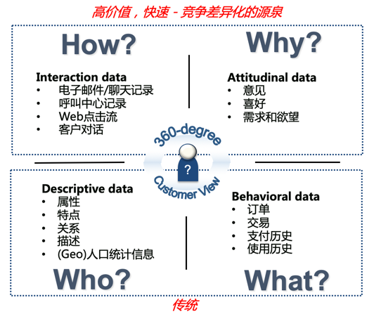

- **Descriptive data ：** 描述性数据，属于传统数据，往往是以主数据的形式存在，包含了客户和产品的属性、特点、关系、描述和统计信息等。
- **Behavioral data ：** 行为数据，属于传统数据，是交易系统的业务数据，包含了订单、交易、支付和使用历史数据。
- **Interaction data ：** 交互数据，属于新数据源，包含电子邮件、聊天记录、呼叫中心记录、Web 点击流、客户对话，可以进行渠道互动方式的分析。
- **Attitudinal data ：** 态度数据，属于新数据源，包含客户的意见、喜好、需求和欲望，可以分析反馈和互动内容。

数字化转型营造满足客户个性化需求和期望的体验，其重点是从客户至上或者以客户为中心的角度出发，交互数据和态度数据这类新数据的运用并且和传统数据结合，成为企业高价值、快速和竞争差异化的源泉。

从数据系统的角度来看，记录系统，参与系统和洞察系统共同为现代企业提供了一个完整的生态系统。支持响应移动等终端应用程序，具有记录系统的可靠性和洞察系统的智能。

- 记录系统 （Systems of Record）：大多数现有 IT 系统被称为记录系统 SoR。 记录系统是支持业务日常运行的操作系统。这些是制造，财务，销售和管理系统。 它们是专注于业务有效运作的交易系统。
- 参与系统 （Systems of Engagement）：参与系统 SoE 是为客户提供个性化和高度响应性支持的系统，为客户创建了独特而完整的体验。
- 洞察系统 （Systems of Insight）：洞察系统 SoI 的作用是整合来自记录系统和参与系统的数据，以支持分析。 洞察系统既支持分析的创建，也支持分析的执行，以产生可供记录系统和参与系统使用的洞察力。需要支持各种数据类型、来源和使用方式，同时必须适应日益增长的数据和分析要求。

这三组数据系统紧密联系并交换数据，如图 2 所示。洞察系统通常从记录系统和参与系统接收数据，然后分发数据和分析洞察力。 在记录系统和参与系统之间是动作请求和推送消息，并更新相关的状态。

##### 图 2\. 记录系统、参与系统和洞察系统

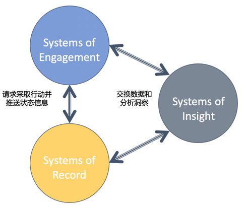

记录系统、参与系统和洞察系统各自具有不同的架构和治理要求，具体到可用性、数据要求、性能、变化率和稳定性都不一样。数据中台的需求应运而生：不同数据系统就像一个互相咬合的齿轮组合，不同的业务的变化速度是不同的，稳态和敏态不同速度的业务需要不同的实现。

参与系统是用户互动型敏态业务：

- 需求变化快，对应的齿轮转速快
- 快速：微服务、容器、敏捷、DevOps
- 转速快：市场、营销、客户交互等

记录系统是传统 IT 型稳态业务：

- 需求变化慢，对应的齿轮转速慢
- 慢速：单体应用，套装软件 , ERP
- 转速慢：财务、合规、内控、法务等

具有洞察系统能力的数据中台的需求应运而生，数据中台是为了应对以下挑战：

- 数据治理流程不够敏捷，阻碍了业务快速适应市场需求，需要提供差异化服务。
- IT 需要更加积极地参与业务，以便从差异化系统中获得最大业务价值。
- 将独特的定制软件与更商品化的打包应用程序彻底解耦。

##### 图 3\. 分层应用策略

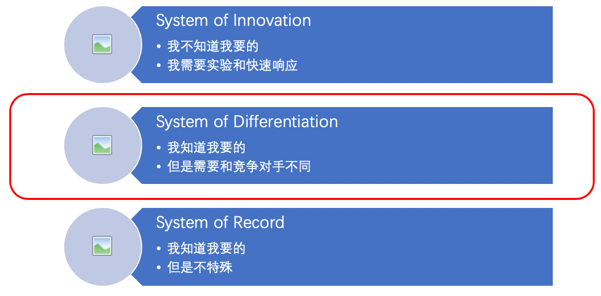

如图 3 所示，数据中台从本质上来讲属于 Systems of Differentiation 差异化系统。数据中台提供了比前台更强的稳定性，以及⽐后台更高的灵活性，在稳定与灵活之间寻找到了⼀种美妙的平衡。

- 后台：Systems of Record 记录系统 – 已建立的打包应用程序或传统的本地系统，支持核心事务处理和管理组织的关键主数据。 变化率很低，因为这些流程已经很好地建立并且对大多数组织来说都是常见的，并且通常受到监管要求的约束。 记录系统具有最长的生命周期。

- 中台：Systems of Differentiation 差异化系统 – 支持独特公司流程或行业特定功能的应用程序。 它们具有中等生命周期，但需要经常重新配置以适应不断变化的业务实践或客户要求。

- 前台：Systems of Innovation 创新系统 – 建立在临时基础上的新应用程序，以满足新的业务需求或机会。 这些通常是使用部门或外部资源和消费级技术的短生命周期项目。

## 为什么要采用 IBM Cloud Pak for Data 构建数据中台

IBM Cloud Pak for Data 是单一整合的数据中台，统一和简化数据的收集、组织和分析。企业可以通过集成的云原生架构将数据转化为洞察力。

IBM Cloud Pak for Data 是可扩展的，可通过 IBM、开源或第三方微服务附加组件的集成目录轻松定制客户数据和 AI 环境。

IBM Cloud Pak for Data 实现了数据中台三个关键要素：数据驱动数字化转型，AI 解锁数据价值，混合云数据民主化。 这也是数据中台从数据和 AI 实现真正商业价值的总体战略。

IBM Cloud Pak for Data 数据中台完整而简单，是业界领先的企业洞察平台：

- 服务生态系统：只需鼠标操作即可访问和部署来自 IBM 和第三方的近 50 种（还在不断增加中）分析服务和模板的生态系统。
- 数据虚拟化：无需移动数据即可快速轻松地查询多个数据源。
- 平台接口：通过集成数据管理，数据治理和分析的单一平台加快实现价值的速度，从而提高效率并改善资源使用。
- 云原生架构 OpenShift：利用领先的混合云，企业容器平台，实现创新，快速的部署策略。
- 任何云：避免锁定，利用所有云基础架构。

IBM Cloud Pak for Data 内置数据中台的所有数据能力，如图 4 所示：

- 数据收集：使数据简单易用
- 数据组织：创建受信任的分析基础
- 数据分析：随处可见 AI 洞察力
- 数据赋能：以信任和透明度实现 AI

##### 图 4\. IBM Cloud Pak for Data 数据中台

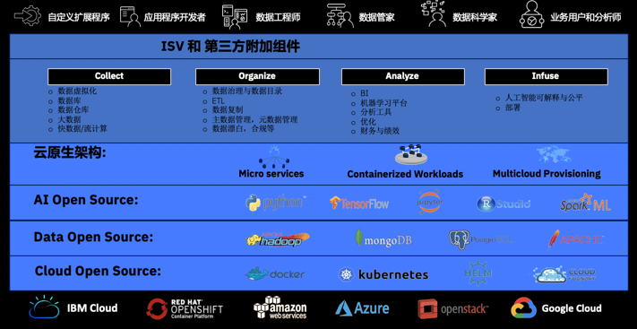

IBM Cloud Pak for Data 作为数据中台简化信息架构并使数据发挥作用：

- 在多个数据来源中查找、连接、管理和利用数据，而无需移动或复制。
- 自动执行许多平凡且可重复的任务，如清理、匹配和元数据创建，从而将数据准备时间缩短 80％。
- 利用 OpenShift，在任何云环境实现部署灵活性。
- 通过用户协作和统一用户体验，允许所有数据用户协作并连接到多个分析应用程序和模型。
- 通过多种数据集成服务的生态系统，将您团队的工作流程和运营管理集中在一起。
- 使数据团队能够将更多时间花在大数据和分析的业务价值创新上。

数据中台主要功能是提供数据服务，IBM Cloud Pak for Data 采用微服务架构设计和部署，单一平台中整合了数据中台的所有数据服务。这些微服务都可以通过 API 的方式来进行消费，如图 5 所示，通过 API 实现进一步扩展，借助丰富的合作伙伴生态系统提供广泛的功能，还能够根据企业的特定需求进行定制。

##### 图 5\. IBM Cloud Pak for Data API

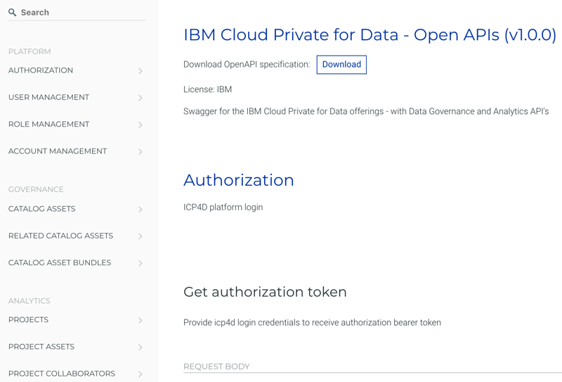

IBM Cloud Pak for Data 是一种云原生解决方案，基于企业级 Kubernetes 平台构建的数据中台价值体现在：

- 运营成本减少 50%，利用容器管理器将容器组成集群，扩展基于容器的应用，从而降低基础架构成本。
- DevOps 效率提高 20%，使用容器和容器集群管理器的 DevOps 效率可提高 20%，能够复用容器，执行更出色的架构实践。

- 基于 OpenShift，支持任何云环境，包括混合云、私有云、公有云。

## 企业数据资产目录

数据中台构建是否成功很大程度取决于企业数据资产目录的能力。数据资产目录可以使用户能够以适当的格式找到他们需要的数据。这可以是格式化的数据，供业务用户在其可视化工具中使用，或者是针对数据科学家需求的更复杂的数据。目录还包含管理用户对数据访问的策略，规则和分类的定义。目录接口负责执行这些规则，并确保用户只能访问他们有权访问的数据。用户还可以通过目录界面请求数据资产，查询数据血缘，可以了解数据的来源和被如何使用。确保以及时、易于访问的方式为用户提供数据，易于搜索并进行适当的分类对于数据中台的成功至关重要。

##### 图 6\. IBM Cloud Pak for Data 数据目录

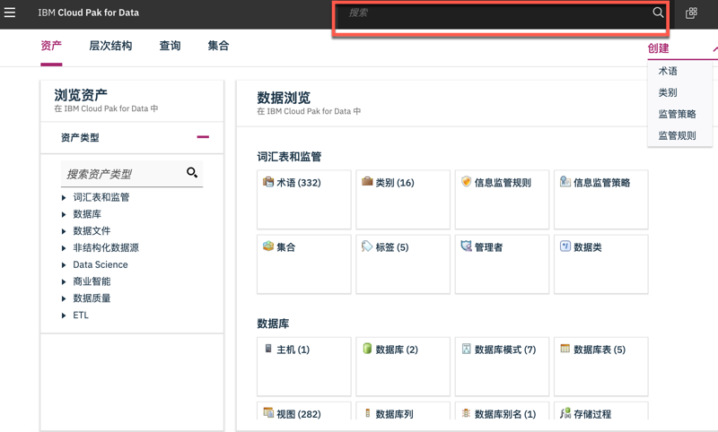

如图 6 所示，IBM Cloud Pak for Data 是围绕企业数据目录构建的数据中台。用户体验是具有基于角色，使用不同功能但通过企业数据资产目录在统一平台进行协作。 例如：数据管理员可以管理数据目录、数据集分类和管理的业务词汇表。数据工程师可以访问诸如选择数据源、清洗转换以及运行 ETL 作业等功能。业务分析师可以访问他们熟悉的仪表板。数据科学家利用 Jupyter Notebook 开发模型，对模型从开发、测试、部署、运维整个生命周期进行管理。数据资产的检索可以全文搜索或从数据资产目录中浏览查找，通过文本匹配、资产评级、评论、上下文匹配、数据质量等很容易获得需要的数据资产。

##### 图 7\. 数据血缘

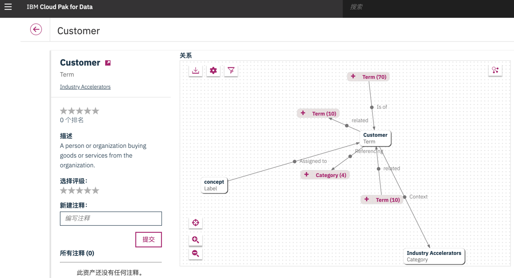

如图 7 所示，IBM Cloud Pak for Data 以不同方式可视化和跟踪数据资产之间的关系。它可以实现数据中台进行数据审核、数据影响性评估和根本原因分析。IBM Cloud Pak for Data 可以发现、搜索数据和分析资产、查看元数据和数据族谱并在数据血缘图中深入挖掘各种关系，理解上下文关系，对资产进行评价、打分以及标签。

## 数据虚拟化

数据中台对应的数据源是广泛的，数据搬迁的成本是巨大的，而且多份存储容易导致数据不一致。这就要求数据中台可以实现数据虚拟化：

- 查询多个数据库和大数据平台；
- 集中访问控制和治理；
- 使全局分布、众多数据源可以简化为单一数据源；
- 通过可扩展且功能强大的平台简化数据分析。

如图 8 所示，IBM Cloud Pak for Data 的数据虚拟化是一种独特的新技术，它将所有这些数据源连接到一个自平衡的数据源或数据库集合（称为星座）。查询和分析不需要进行数据复制或集中存储。分析应用程序提交在数据源所在的服务器上处理，查询结果在星座中合并并返回给应用。

数据虚拟化的工作原理为：应用程序连接到 IBM Cloud Pak for Data，就像它们连接到单个数据库一样。连接后，应用程序可以向系统提交查询，就像查询单个数据源数据库一样。工作负载将由具有与查询相关的数据的所有参与数据源进行协作分发和计算。

协作计算通过使用每个数据源的处理能力并访问每个数据源物理存储的数据，可以避免移动和复制数据的延迟。此外，所有存储库数据都可以实时访问，不需要 ETL 以及重复数据存储，从而加快了处理时间。数据虚拟化与集中数据存储相比，流程更快，更可靠地为决策应用程序或分析人员提供实时洞察。它还与集中数据存储保持高度互补，成为数据中台的重要服务能力。

##### 图 8\. 数据虚拟化

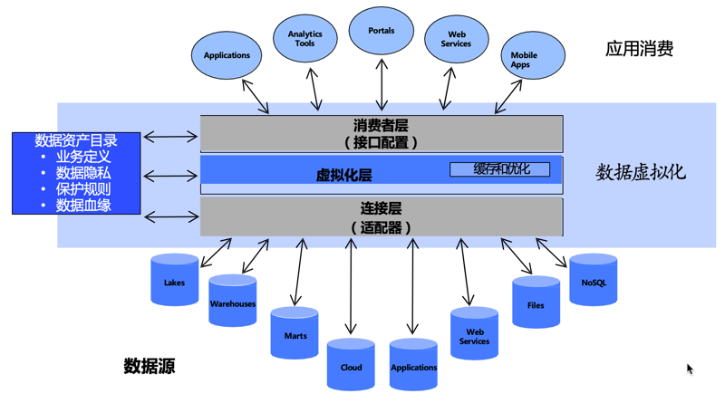

## AI 赋能

未来的洞察驱动型企业成败关键在于 AI。从构建可靠的数据基础，到为整个企业中的关键决策者提供可信的洞察，数据中台必须构建全面的数据管理战略，以支持企业人工智能之旅。IBM Cloud Pak for Data 提供现代化数据架构，内置 AI 阶梯，如图 9 所示：

- Watson Knowledge Catalog：可利用强大的搜索功能查找相关数据资产。专家可进行协作以快速将数据清理形成可使用的高质量信息，从而用于分析。利用内置图表可视化数据并跟踪数据资产的历史记录。允许访问数据，同时通过创建自动掩饰敏感数据值的策略，确保合规性。
- IBM Watson Studio：帮助企业客户加速机器学习和深度学习与日常业务的融合，提供一系列的数据分析和数据科学工具，实现团队的协作和轻松地处理数据，大规模构建和训练企业级数据分析模型。
- Watson Machine Learning：可构建并部署成熟的分析模型以用于应用程序。使开发人员和数据研究员轻松协作，以将预测功能集成到应用程序中，从而制定更明智的决策、解决棘手问题和改进用户成果。还通过运行自动化试验和比较试验结果来监视和改进机器学习和深度学习模型。
- Watson OpenScale：在企业应用程序之间大规模采用可信的 AI，它可以让企业深入了解 AI 的构建方式和使用情况，以及投资回报情况。其开放式源代码平台支持企业利用透明、可说明的结果，大规模运营和自动化 AI，而无有害偏差。

##### 图 9\. 基于 IBM Cloud Pak for Data 实施 AI

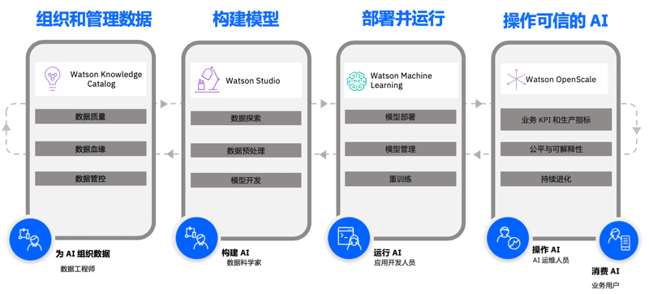

在 IBM Cloud Pak for Data 上集成了一系列新的 Watson 微服务，这是用于 AI 的开放式云原生信息架构，如图 10 所示：

- Watson Assistant：功能远超聊天机器人的 AI 助手，将交互会话构建到企业应用、设备中。Watson Assistant 知道何时在知识库中搜索答案，何时要求说明以及何时将用户转接给实际人员。
- Watson Discovery：是一款支持 AI 的搜索和内容分析引擎，可帮助企业复杂的业务内容中寻找答案，发现隐藏的见解。借助智能文档理解，Watson Discovery 可以根据对文档的直观认识，了解答案在内容中的相应位置。
- Watson API Kit：语音和文本 API 接口，可将书面文本转换为各种语言的自然语音；将音频和声音快速转换为书面文本；通过抽取实体、关键字、观点等内容寻找非结构化数据的含义。

##### 图 10\. IBM Cloud Pak for Data 实现 Watson 赋能

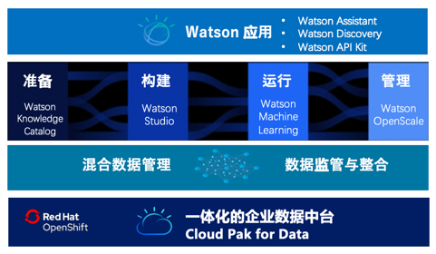

## 基于 IBM Cloud Pak for Data 的数据中台架构

IBM Cloud Pak for Data 通过多节点集群上运行的预配置数据中台微服务组成。 数据中台的微服务可以连接到数据源，用户可以通过浏览器或者 API 来管理，分析，转换和分析数据。如图 11 所示，IBM Cloud Pak for Data 连接了企业后台数据源，利用现有数据资产投资，对外提供数据服务构建前台创新应用。

##### 图 11\. IBM Cloud Pak for Data 架构

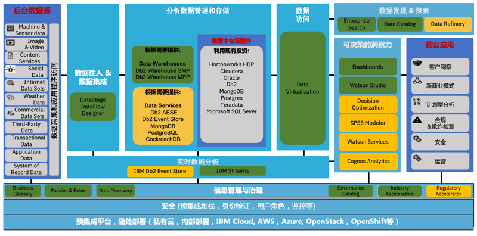

IBM Cloud Pak for Data 部署在多节点 Kubernetes 集群上。在具有至少 6 个节点的集群中，有 3 个主节点和 3 个或更多的工作节点。工作节点可以按需扩展，每个节点部署相关的数据服务，如图 12 所示。

##### 图 12\. IBM Cloud Pak for Data 部署方式

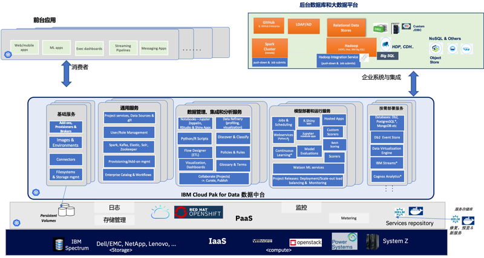

## 参考资源

- 参考 [IBM Developer 中国](http://www.ibm.com/developerworks/cn/) 首页，查看 IBM 软件和开放技术的最新信息。
- 申请 [IBM Cloud Pak for Data 试用](https://www.ibm.com/cloud/garage/cloud-private-experiences/)
- 参阅 [IBM Cloud Pak for Data 产品文档](https://www.ibm.com/support/knowledgecenter/SSQNUZ) 获取产品手册
- 查看 [IBM Cloud Private for Data](https://www.ibm.com/cn-zh/analytics/cloud-pak-for-data) 官网
- 参阅 [动手实践 IBM Cloud Pak for Data，第 1 部分](https://www.ibm.com/developerworks/cn/analytics/library/ba-lo-hands-on-icp-for-data1/index.html) 功能架构和数据的收集组织
- 参阅 [动手实践 IBM Cloud Pak for Data，第 2 部分](https://www.ibm.com/developerworks/cn/analytics/library/ba-lo-hands-on-icp-for-data2/index.html) 数据分析和平台管理
- 查看 [我的博客](https://www.ibm.com/developerworks/mydeveloperworks/blogs/wuminda/?lang=en) 并评论