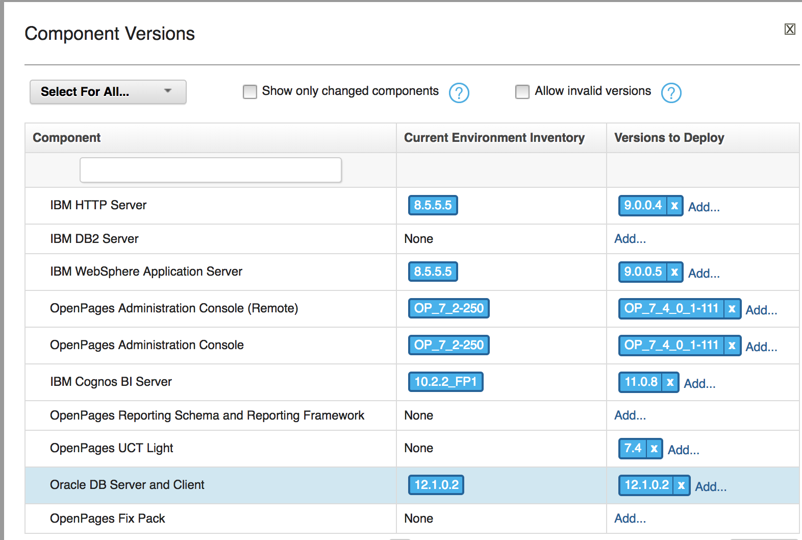
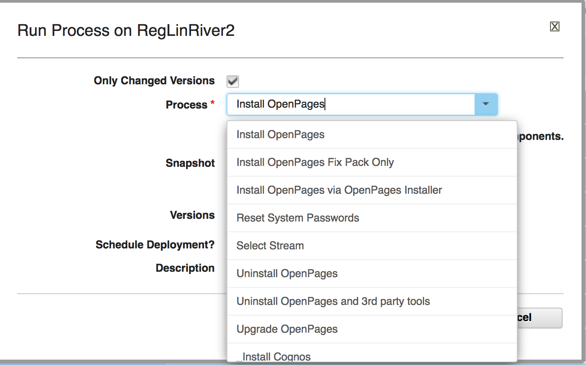
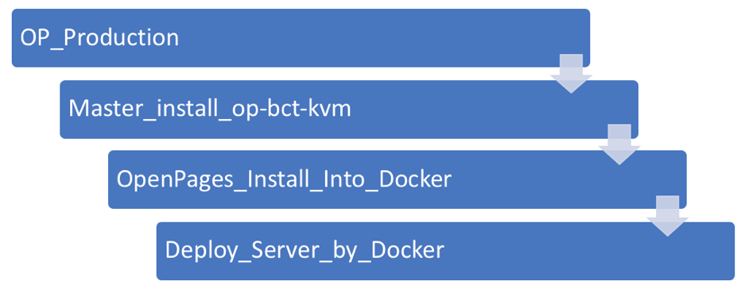
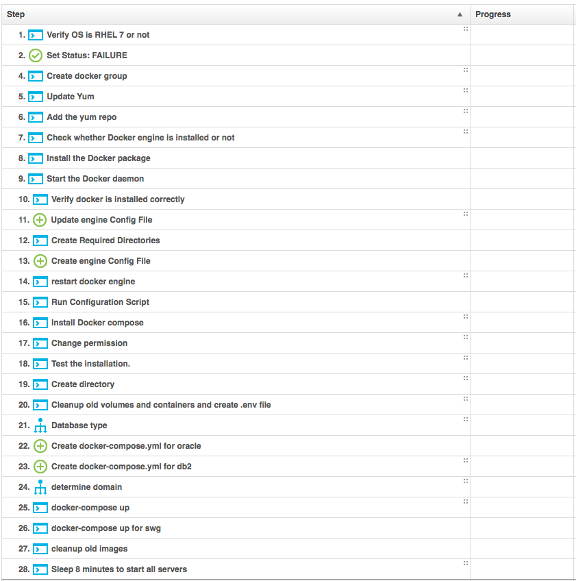

# 用 IBM UrbanCode Deploy 和 Docker 实现持续集成及交付
使用 IBM UCD 和 Docker 来部署应用软件，提高开发测试效率

**标签:** DevOps

[原文链接](https://developer.ibm.com/zh/articles/d-im-co-in-and-de-wi-ur-de-docker/)

姜河, 朱琳, 李敏敏

发布: 2018-05-21

* * *

## 背景介绍

在实际工作中，很多时间都会花费在产品的安装和部署过程 DevOps 是一组过程、方法与系统的统称，用于促进开发、技术运营和质量保障（QA）部门之间的沟通、协作与整合，提高整个产品发布的效率。IBM UrbanCode Deploy 是 一种目前被广泛使用的应用自动化部署工具。Docker 是一种容器管理器，它将应用程序和依赖项捆绑在一起，通过容器化的技术，让开发者可以打包他们的应用以及依赖包到一个可移植的容器中，然后发布到任何流行的 Linux 机器。从而充分保持开发测试环境的一致性。本文介绍如何使用 IBM UCD 和 Docker 来部署应用软件，提高整个产品开发测试的效率。

## UrbanCode Deploy 简介

UrbanCode Deploy 的前身是 uDeploy® ，其开发目的是解决现代应用程序部署的挑战。用户通过对多层次的、多平台应用程序的结构进行建模，创建并协调部署它所需的流程。根据每个环境特定的配置，提供了在应用程序的自动化安装和部署的模块和流程。用户使用拖放式集成步骤设计对应的流程（比如安装、卸载和回滚）时，并且 UrbanCode Deploy 提供了易于使用的图形界。用户可以通过图形化的界面该更容易地运行部署和监控。

在 OpenPages 的开发过程中，由于对于产品版本迭代的速度越来越快。为了满足开发及测试的需求，每天都需要在不同平台（Linux/Windows）上进行产品的安装和测试。产品的部署所需要中间件，例如 WebSphere，并且也测试不同数据库 (Oracle/DB2) 以及数据库版本的安装和卸载等。因此，产品的安装的过程十分耗时，而且由于安装部署过程的复杂，以及测试人员的熟练程度不同，容易出错。因此，将产品的整个安装升级以及卸载的过程作为 UrbanCode Deploy 中的流程或应用，通过模块化的调用。测试和开发人员可以在通过网页界面选取对应的产品版本和第三方软件，从而实现快速和批量化的部署。这样大大提高了团队成员安装部署产品的速度，从而提升整个团队的效率，加快整个项目的进度。这也是我们团队在 DevOps 中第一阶段所完成的任务。

##### 图 1\. UrbanCode Deploy 版本选择



##### 图 2\. 目前提供的功能



## Docker 技术简介

Docker 是目前非常流行的一个开源引擎，可以为任何应用创建一个轻量级的、可移植的、自给自足的容器。Docker 通常用于如下场景 **：** web 应用的自动化打包和发布；自动化测试和持续集成、发布；在服务型环境中部署和调整数据库或其他的后台应用；从头编译或者扩展现有的 OpenShift 或 Cloud Foundry 平台来搭建自己的 PaaS 环境。

本文中，主要介绍使用 Docker 的持续集成发布功能。在上文中介绍了使用 UrbanCode 来进行自动化部署的情况。在实际使用过程中，因为第三方软件和 OpenPages 安装的复杂度。使用 UCD 部署一台环境平均大概需要 4 个小时左右。因此 Docker 的出现，为我们提供了一种更加便捷的方式来进行产品的日常测试。与 UrbanCode 相比，Docker 的优势在于：

- 节省时间，Docker 的部署平均情况下大概在 20 分钟左右就可以完成。
- 可以为测试人员和开发人员提供完全相同（克隆）的环境。在日常的测试工作中，由于平台或者第三方软件的微小差别，可能会导致在测试环境中出现的 bug 而在开发环境中无法重现。而定位这种 bug 是需要很大的沟通和时间成本。而 Docker 可以提供”完全一致”的环境来帮助开发和测试人员定位 bug。
- 将产品的服务”打包”成对应的 Docker image,类似于虚拟机的镜像文件。这样，将已经打包好的 Docker images 在需要部署的机器中启动，就可以使用 images 中产品的功能。真正的达到，一次部署，多次使用。

## 使用 IBM UCD+Docker 实例开发与测试

下面，就以 OpenPages 为例来介绍，如何使用 IBM Urban Code Deploy +Docker 来进行产品的部署。

##### 图 3\. 基本流程


##### 图 4\. Jenkins Project 调用关系



**Docker 部署的过程如下：**

1. 判断所在 Linux 版本，是否为 Linux RHEL 7 或 CentOS7。Docker engine 目前只支持 Linux7 及以上版本运行。
2. 创建用户组 docker， 并且将 root 用户加入到 docker 组中。
3. 使用命令 #yum list installed docker-engine 安装 docker engine。
4. 更新配置文件 /etc/system/system/docker.service.d/override.conf, 将 registry 指向指定的地址。
5. 使用以下命令，重启 docker 引擎。如清单 1 所示：

##### 清单 1\. 重启 docker 引擎

```
#systemctl stop docker
#systemctl daemon-reload
#systemctl start docker

```

Show moreShow more icon

1. 安装 docker compose 并且更改所在文件夹权限。如清单 2 所示：

##### 清单 2\. 检查 docker compose 安装

```
#docker-compose --version|grep "docker-compose version"
//如果安装成果则会返回如下信息：
docker-compose version 1.8.0, build f3628c7

```

Show moreShow more icon

1. 创建文件夹，用来保存 docker-compose.yml 文件。
2. 如果已经有 container 存在，使用命令 #docker-compose down -v 停止所有的 container 的运行。
3. 创建 .env 文件。作为 docker-compose.yml 文件的参数。
4. 创建 docker-compose.yml 文件。文件内容包含了 docker images 的信息，启动的 container 对应的端口号信息以及其他所需要的信息。
5. 执行以下命令，如清单 3 所示：

##### 清单 3\. 重启 containers

```
//停止所有的 container
# docker rm -vf $(docker ps -qa)
// 删除所有的 docker images
# docker rmi $(docker images -q)
//从服务器端获取对应的 images
# dokcer-compose pull
// 按照配置依赖关系启动 container
# docker-compose up -d.

```

Show moreShow more icon

##### 图 5\. UCD 具体流程



## Trouble Shooting

- 如果所在机器的磁盘空间不足，如清单 4 所示：

##### 清单 4\. 批量删除 container

```
$ docker rm -fv $(docker ps -qa)

```

Show moreShow more icon

如果还需要空间，可以使用以下命令，如清单 5 所示：

##### 清单 5\. 删除 images

```
$ docker rmi $(docker images -q)

```

Show moreShow more icon

- Docker 在使用上面命令删除 images 和 container 的数据有时候会失败，可以用如

下命令来解决，如清单 6 所示：

##### 清单 6\. 重启 docker enginer

```
$ sudo systemctl stop docker
$ sudo rm -rf /var/lib/docker
$ sudo systemctl start docker

```

Show moreShow more icon

这样，docker enginer 可以在初始状况下重启。

## 结束语

使用 UrbanCode Deploy 和 Docker 实现持续集成和交付。可以大幅节省产品安装部署的时间，给予测试和开发人员产品的及时反馈，从而提高整个产品的开发效率。

## 相关资源

- [利用 IBM UrbanCode Deploy 实现企业应用部署自动化](https:/www.ibm.com/developerworks/cn/rational/1401_yangmq_urbancode/index.html)
- [Docker 简介](https://yeasy.gitbooks.io/docker_practice/content/introduction/what.html)
- [Docker 官网](https://www.docker.com/)