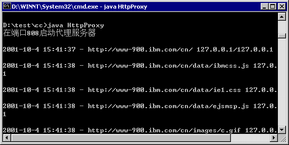
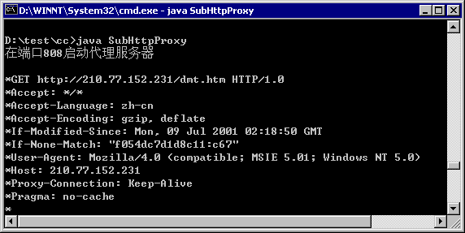

# 用 Java 开发代理服务器
把代理服务器看成是一种扩展浏览器功能

**标签:** Java,Web 开发

[原文链接](https://developer.ibm.com/zh/articles/l-javaproxy/)

俞良松

发布: 2001-10-09

* * *

## 基础知识

不管以哪种方式应用代理服务器，其监控 HTTP 传输的过程总是如下：

- 步骤一：内部的浏览器发送请求给代理服务器。请求的第一行包含了目标 URL。
- 步骤二：代理服务器读取该 URL，并把请求转发给合适的目标服务器。
- 步骤三：代理服务器接收来自 Internet 目标机器的应答，把应答转发给合适的内部浏览器。

例如，假设有一个企业的雇员试图访问 www.cn.ibm.com 网站。如果没有代理服务器，雇员的浏览器打开的 Socket 通向运行这个网站的 Web 服务器，从 Web 服务器返回的数据也直接传递给雇员的浏览器。如果浏览器被配置成使用代理服务器，则请求首先到达代理服务器；随后，代理服务器从请求的第一行提取目标 URL，打开一个通向 www.cn.ibm.com 的 Socket。当 www.cn.ibm.com 返回应答时，代理服务器把应答转发给雇员的浏览器。

当然，代理服务器并非只适用于企业环境。作为一个开发者，拥有一个自己的代理服务器是一件很不错的事情。例如，我们可以用代理服务器来分析浏览器和 Web 服务器的交互过程。测试和解决 Web 应用中存在的问题时，这种功能是很有用的。我们甚至还可以同时使用多个代理服务器（大多数代理服务器允许多个服务器链接在一起使用）。例如，我们可以有一个企业的代理服务器，再加上一个用 Java 编写的代理服务器，用来调试应用程序。但应该注意的是，代理服务器链上的每一个服务器都会对性能产生一定的影响。

## 设计规划

正如其名字所示，代理服务器只不过是一种特殊的服务器。和大多数服务器一样，如果要处理多个请求，代理服务器应该使用线程。下面是一个代理服务器的基本规划：

1. 等待来自客户（Web 浏览器）的请求。
2. 启动一个新的线程，以处理客户连接请求。
3. 读取浏览器请求的第一行（该行内容包含了请求的目标 URL）。
4. 分析请求的第一行内容，得到目标服务器的名字和端口。
5. 打开一个通向目标服务器（或下一个代理服务器，如合适的话）的 Socket。
6. 把请求的第一行发送到输出 Socket。
7. 把请求的剩余部分发送到输出 Socket。
8. 把目标 Web 服务器返回的数据发送给发出请求的浏览器。

当然，如果考虑细节的话，情况会更复杂一些。实际上，这里主要有两个问题要考虑：第一，从 Socket 按行读取数据最适合进一步处理，但这会产生性能瓶颈；第二，两个 Socket 之间的连接必需高效。有几种方法可以实现这两个目标，但每一种方法都有各自的代价。例如，如果要在数据进入的时候进行过滤，这些数据最好按行读取；然而，大多数时候，当数据到达代理服务器时，立即把它转发出去更适合高效这一要求。另外，数据的发送和接收也可以使用多个独立的线程，但大量地创建和拆除线程也会带来性能问题。因此，对于每一个请求，我们将用一个线程处理数据的接收和发送，同时在数据到达代理服务器时，尽可能快速地把它转发出去。

## 实例

在用 Java 编写这个代理服务器的过程中，注意可重用性是很重要的。因为这样的话，当我们想要在另一个工程中以不同的方式处理浏览器请求时，可以方便地重用该代理服务器。当然，我们必须注意灵活性和效率之间的平衡。

图一显示了本文代理服务器实例（HttpProxy.java）的输出界面，当浏览器访问 [http://www-900.ibm.com/cn/时，代理服务器向默认日志设备（即标准输出设备屏幕）输出浏览器请求的](http://www-900.ibm.com/cn/时，代理服务器向默认日志设备（即标准输出设备屏幕）输出浏览器请求的) URL。图二显示了 SubHttpProxy 的输出。SubHttpProxy 是 HttpProxy 的一个简单扩展。

##### 图一



##### 图二



为了构造代理服务器，我从 Thread 基类派生出了 HttpProxy 类（文章正文中出现的代码是该类的一些片断，完整的代码请从本文最后下载）。HttpProxy 类包含了一些用来定制代理服务器行为的属性，参见 Listing 1 和表一。

```
【Listing 1】
/*************************************
* 一个基础的代理服务器类
*************************************
*/
import java.net.*;
import java.io.*;
public class HttpProxy extends Thread {
    static public int CONNECT_RETRIES=5;
    static public int CONNECT_PAUSE=5;
    static public int TIME-OUT=50;
    static public int BUFSIZ=1024;
    static public boolean logging = false;
    static public OutputStream log=null;
    // 传入数据用的 Socket
    protected Socket socket;
    // 上级代理服务器，可选
    static private String parent=null;
    static private int parentPort=-1;
    static public void setParentProxy(String name, int pport) {
        parent=name;
        parentPort=pport;
    }
    // 在给定 Socket 上创建一个代理线程。
    public HttpProxy(Socket s) { socket=s; start(); }
    public void writeLog(int c, boolean browser) throws IOException {
        log.write(c);
    }
    public void writeLog(byte[] bytes,int offset,
             int len, boolean browser) throws IOException {
        for (int i=0;i<len;i++) writeLog((int)bytes[offset+i],browser);
    }
    // 默认情况下，日志信息输出到
    // 标准输出设备，
    // 派生类可以覆盖它
    public String processHostName(String url, String host, int port, Socket sock) {
        java.text.DateFormat cal=java.text.DateFormat.getDateTimeInstance();
        System.out.println(cal.format(new java.util.Date()) + " - " +
              url + " " + sock.getInetAddress()+"<BR>");
        return host;
    }

```

Show moreShow more icon

##### 表 1.

变量/方法说明CONNECT\_RETRIES在放弃之前尝试连接远程主机的次数。CONNECT\_PAUSE在两次连接尝试之间的暂停时间。TIME-OUT等待 Socket 输入的等待时间。BUFSIZSocket 输入的缓冲大小。logging是否要求代理服务器在日志中记录所有已传输的数据（true 表示”是”）。log一个 OutputStream 对象，默认日志例程将向该 OutputStream 对象输出日志信息。setParentProxy用来把一个代理服务器链接到另一个代理服务器（需要指定另一个服务器的名称和端口）。

当代理服务器连接到 Web 服务器之后，我用一个简单的循环在两个 Socket 之间传递数据。这里可能出现一个问题，即如果没有可操作的数据，调用 read 方法可能导致程序阻塞，从而挂起程序。为防止出现这个问题，我用 setSoTimeout 方法设置了 Socket 的超时时间（参见 Listing 2）。这样，如果某个 Socket 不可用，另一个仍旧有机会进行处理，我不必创建一个新的线程。

```
【Listing 2】
    // 执行操作的线程
    public void run() {
    String line;
    String host;
    int port=80;
        Socket outbound=null;
    try {
        socket.setSoTimeout(TIMEOUT);
        InputStream is=socket.getInputStream();
        OutputStream os=null;
        try {
        // 获取请求行的内容
        line="";
        host="";
        int state=0;
        boolean space;
        while (true) {
            int c=is.read();
            if (c==-1) break;
            if (logging) writeLog(c,true);
            space=Character.isWhitespace((char)c);
            switch (state) {
            case 0:
            if (space) continue;
                state=1;
            case 1:
            if (space) {
                state=2;
                continue;
            }
            line=line+(char)c;
            break;
            case 2:
            if (space) continue; // 跳过多个空白字符
                  state=3;
            case 3:
            if (space) {
                state=4;
               // 只分析主机名称部分
                String host0=host;
                int n;
                n=host.indexOf("//");
                if (n!=-1) host=host.substring(n+2);
                n=host.indexOf('/');
                if (n!=-1) host=host.substring(0,n);
                // 分析可能存在的端口号
                n=host.indexOf(":");
                if (n!=-1) {
                port=Integer.parseInt(host.substring(n+1));
                host=host.substring(0,n);
                }
                host=processHostName(host0,host,port,socket);
                if (parent!=null) {
                host=parent;
                port=parentPort;
                }
                int retry=CONNECT_RETRIES;
                while (retry--!=0) {
                try {
                    outbound=new Socket(host,port);
                    break;
                } catch (Exception e) { }
                // 等待
                Thread.sleep(CONNECT_PAUSE);
                }
                if (outbound==null) break;
                outbound.setSoTimeout(TIMEOUT);
                os=outbound.getOutputStream();
                os.write(line.getBytes());
                os.write(' ');
                os.write(host0.getBytes());
                os.write(' ');
                pipe(is,outbound.getInputStream(),os,socket.getOutputStream());
                break;
            }
            host=host+(char)c;
            break;
            }
        }
        }
        catch (IOException e) { }
    } catch (Exception e) { }
    finally {
            try { socket.close();} catch (Exception e1) {}
            try { outbound.close();} catch (Exception e2) {}
       }
    }

```

Show moreShow more icon

和所有线程对象一样，HttpProxy 类的主要工作在 run 方法内完成（见 Listing 2）。run 方法实现了一个简单的状态机，从 Web 浏览器每次一个读取字符，持续这个过程直至有足够的信息找出目标 Web 服务器。然后，run 打开一个通向该 Web 服务器的 Socket（如果有多个代理服务器被链接在一起，则 run 方法打开一个通向链里面下一个代理服务器的 Socket）。打开 Socket 之后，run 先把部分的请求写入 Socket，然后调用 pipe 方法。pipe 方法直接在两个 Socket 之间以最快的速度执行读写操作。

如果数据规模很大，另外创建一个线程可能具有更高的效率；然而，当数据规模较小时，创建新线程所需要的开销会抵消它带来的好处。

Listing 3 显示了一个很简单的 main 方法，可以用来测试 HttpProxy 类。大部分的工作由一个静态的 startProxy 方法完成（见 Listing 4）。这个方法用到了一种特殊的技术，允许一个静态成员创建 HttpProxy 类（或 HttpProxy 类的子类）的实例。它的基本思想是：把一个 Class 对象传递给 startProxy 类；然后，startProxy 方法利用映像 API（Reflection API）和 getDeclaredConstructor 方法确定该 Class 对象的哪一个构造函数接受一个 Socket 参数；最后，startProxy 方法调用 newInstance 方法创建该 Class 对象。

```
【Listing 3】
// 测试用的简单 main 方法
static public void main(String args[]) {
    System.out.println("在端口 808 启动代理服务器\n");
    HttpProxy.log=System.out;
    HttpProxy.logging=false;
    HttpProxy.startProxy(808,HttpProxy.class);
}
}

```

Show moreShow more icon

```
【Listing 4】
static public void startProxy(int port,Class clobj) {
ServerSocket ssock;
Socket sock;
try {
      ssock=new ServerSocket(port);
      while (true) {
          Class [] sarg = new Class[1];
          Object [] arg= new Object[1];
          sarg[0]=Socket.class;
          try {
              java.lang.reflect.Constructor cons = clobj.getDeclaredConstructor(sarg);
              arg[0]=ssock.accept();
              cons.newInstance(arg); // 创建 HttpProxy 或其派生类的实例
          } catch (Exception e) {
              Socket esock = (Socket)arg[0];
              try { esock.close(); } catch (Exception ec) {}
          }
      }
} catch (IOException e) {
}
}

```

Show moreShow more icon

利用这种技术，我们可以在不创建 startProxy 方法定制版本的情况下，扩展 HttpProxy 类。要得到给定类的 Class 对象，只需在正常的名字后面加上.class（如果有某个对象的一个实例，则代之以调用 getClass 方法）。由于我们把 Class 对象传递给了 startProxy 方法，所以创建 HttpProxy 的派生类时，就不必再特意去修改 startProxy。（下载代码中包含了一个派生得到的简单代理服务器）。

## 结束语

利用派生类定制或调整代理服务器的行为有两种途径：修改主机的名字，或者捕获所有通过代理服务器的数据。processHostName 方法允许代理服务器分析和修改主机名字。如果启用了日志记录，代理服务器为每一个通过服务器的字符调用 writeLog 方法。如何处理这些信息完全由我们自己决定――可以把它写入日志文件，可以把它输出到控制台，或进行任何其他满足我们要求的处理。writeLog 输出中的一个 Boolean 标记指示出数据是来自浏览器还是 Web 主机。

和许多工具一样，代理服务器本身并不存在好或者坏的问题，关键在于如何使用它们。代理服务器可能被用于侵犯隐私，但也可以阻隔偷窥者和保护网络。即使代理服务器和浏览器不在同一台机器上，我也乐意把代理服务器看成是一种扩展浏览器功能的途径。例如，在把数据发送给浏览器之前，可以用代理服务器压缩数据；未来的代理服务器甚至还可能把页面从一种语言翻译成另一种语言……可能性永无止境。

请从这里下载本文代码： [JavaProxyServer\_code.zip](JavaProxyServer_code.zip)