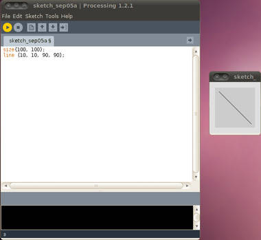
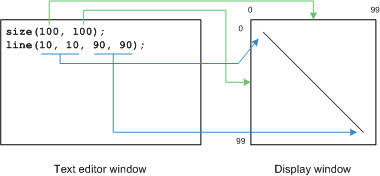
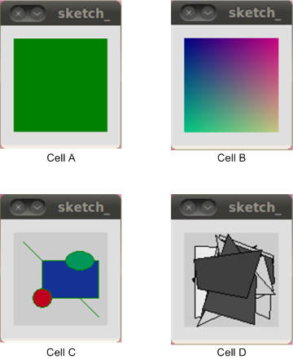
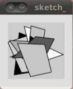
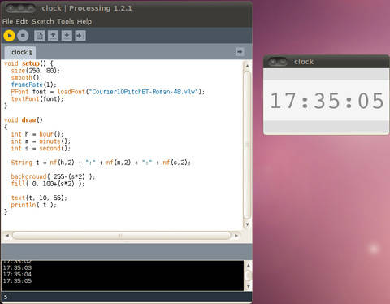
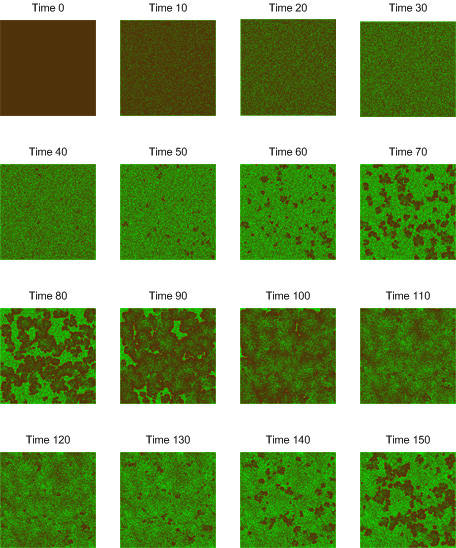

# 用 Processing 进行数据可视化：语言和环境简介
探讨可视化应用程序的构建

**标签:** 视觉识别

[原文链接](https://developer.ibm.com/zh/articles/os-datavis/)

M. Jones

发布: 2010-12-27

* * *

虽然很多开源项目的初衷都是为现有的应用程序构建替代方案，但是仍有大量的项目彰显了创新性。Processing 就是其中的一个。Processing 在 2001 年诞生于麻省理工学院（MIT）的媒体实验室，主创者为 Ben Fry 和 Casey Reas，当然还有来自 Carnegie Mellon、洛杉矶的加利福尼亚大学以及迈阿密大学等的贡献。

Processing 的最初目标是开发图形的 sketchbook 和环境，用来形象地教授计算机科学的基础知识。之后，它逐渐演变成了可用于创建图形可视化专业项目的一种环境。如今，围绕它已经形成了一个专门的社区，致力于构建各种库以供用这种语言和环境进行动画、可视化、网络编程以及很多其他的应用。在本文中，您会发现 Processing 是一个很棒的进行数据可视化的环境，具有一个简单的接口、一个功能强大的语言以及一套丰富的用于数据以及应用程序导出的机制。

Processing 运行于 GNU/Linux® 以及 Mac OS X 和 Windows® 上，并且支持将图像导出成各种格式。对于动态应用程序，甚至可以将 Processing 应用程序作为 Java™ applet 导出以用在 Web 环境内。

本文将先介绍 Processing IDE，然后再讨论 Processing 语言的第一个层面。之后将会介绍一些关键的图形原语，最后则探讨几个利用这些原语的应用程序。

##### Processing 的起源

Processing 最早是一个用于教授计算机编程的简化编程语言。这些理念起源于 MIT Media Lab (John Maeda) 的 Design By Numbers 项目，目的是通过可视应用程序的开发来教授编程。虽然它供编程初学者使用，但该项目也针对艺术家及可视化设计者而设。有关 Processing 及衍生产品的更多信息，请参见参考资源。

## Processing 环境

第一步是安装 Processing 环境。去到 [Processing.org](http://processing.org) ，单击 **Download Processing** 并选择您的操作系统。请注意，本文中的例子使用的是 Processing V1.2.1。下载了压缩文件后，用 `tar xvfz processing-1.2.1.tgz` 对其进行展开。

此外，还需要确保 Java 技术已经可用。在 Ubuntu 上，只需键入 `sudo apt-get install openjdk-6-jdk` 。

安装完成后，转到之前解压缩时创建的 processing-1.2.1 目录并尝试键入 `./processing` 。

这应该会弹出 Processing Development Environment（PDE 或 Processing IDE），如图 1 所示。占此窗口较大的部分是文本编辑器。如果输入图中所示的两行代码，然后单击 **Run** （左上角的三角形），出现一个窗口，显示您所输入的简单程序（或 Processing 术语所指的 _sketch_ ）的结果。单击 **Stop** （左上角的方框）退出程序，窗口消失。

##### 图 1\. PDE 和 Results 窗口



现在，让我们先来深入研究 Processing 语言，探讨它的主要特性，并且开发一些有趣的应用程序。

## Processing 语言

Processing 是用 Java 编程语言写的，并且 Java 语言也是在语言树中最接近 Processing 的。所以，如果您熟悉 `C` 或 Java 语言，Processing 将很容易学。并且在程序如何构造方面，也作了一些简化。Processing 并不包括 Java 语言的一些较为高级的特性，但这些特性中的很多特性均已集成到了 Processing， 所以您无需了解它们。

之所以选择 Java 语言是因为 Processing 应用程序被翻译成 Java 代码执行。选择 Java 范型简化了这种翻译并让开发和执行可视化程序变得十分简单和直观。若要对比 Processing 语言和 Java 语言，请参阅 参考资料 。

## 图形环境

正如您在 [图 1\. PDE 和 Results 窗口](#图-1-pde-和-results-窗口) 所见，在 Processing 内进行开发涉及到的是 PDE 和显示窗口。2-D 图形的坐标系如图 2 所示。 `size` 关键字以像素为单位定义了显示窗口的大小并且通常都是 Processing 应用程序内的首要步骤。

##### 图 2\. 2-D 显示窗口的坐标



如图 2 所示， `size` 关键字指定显示窗口的 X 和 Y 坐标。 `line` 关键字则会在两个像素点之间绘制一条线（以 `x1` 、 `y1 to x2` 、 `y2` 的格式）。请注意，超出屏幕边界（ `size` 定义的边界外）画线并非不允许，只是被忽略了而已。

本文无意对此做深入探讨，但 `size` 接受可选的第三个参数 `mode` 。 `mode` 用来定义要使用的呈现引擎并支持 PDF（直接呈现为 Adobe® PDF 文档）、 `OPENGL` （利用一个可用的 Open-GL 图形适配器）、 `P3D` （为了迅速的 3-D 呈现）等。默认的是 `JAVA2D` ，它最适合于高质量的 2-D 成像。

现在，我们来看一些基本的图形原语，然后再深入探讨几个示例应用程序。

## 图形原语

Processing 包含了大量各种各样的几何形状以及这些形状的控件。本节会简介一些基本的图形原语。

### 背景和颜色

`background` 功能被用来设置显示窗口的颜色。此函数可以使用各种不同的参数（来定义一个灰度值或 Red-Green-Blue [RGB] 颜色）。清单 1 内的代码片段会生成如 [图 3\. 清单 1 至 4 的图形输出](#图-3-清单-1-至-4-的图形输出) 所示的输出，其中的 cell a）。

##### 清单 1\. 使用 Background 函数

```
size(100, 100);
background( 0, 128, 0 );

```

Show moreShow more icon

### 绘制像素点

可以使用 `set` 函数绘制单个像素点。此函数接受显示窗口内的 x,y 坐标以及作为颜色的第三个参数。Processing 也有一个类型，称为 `color` ，通过它，可以定义用于某个操作的颜色。在本例中，我们创建了一个颜色实例并用它来设置显示窗口内的某个像素点（参见清单 2 和 [图 3\. 清单 1 至 4 的图形输出](#图-3-清单-1-至-4-的图形输出) 中的 cell b）。

##### 清单 2\. 设置像素点和颜色

```
size(100, 100);
for (int x = 0 ; x < 100 ; x++) {
for (int y = 0 ; y < 100 ; y++) {
    color c = color( x*2, y*2, 128 );
    set(x, y, c);
}
}

```

Show moreShow more icon

可以使用 `get` 操作来读取显示中的一个给定像素点的颜色。虽然 `set` 很简单，但它不是操做显示的最快方式。要想快速访问，可以使用 `pixels` 数组（与 `loadPixels` 和 `updatePixels` 函数一致）。

### 绘制形状

在 Processing 内使用单个函数绘制形状十分简单。要设置在绘制形状时使用何种颜色，可以利用 `stroke` 函数。此函数可接受一个单独的灰度参数或三个 RGB 参数。此外，还可以用 `fill` 命令定义这个形状的填充色。

[清单 3\. 线和形状](#清单-3-线和形状) 显示了如何绘制线、矩形、圆（使用椭圆）及椭圆。 `line` 函数接受四个参数，代表的是要在其间绘制线条的点。 `rect` 函数可绘制一个矩形，并且前两个点定义位置，而后面两个点则分别定义宽度和高度。 `ellipse` 函数也接受四个参数，分别定义位置和宽/高度。当宽和高相等时，就是一个圆形。还可以使用 `ellipseMode` 函数定制椭圆，它指定 x,y 位置是否代表了椭圆的角（ `CORNER` ）或中心（ `CENTER` ）。参见 [图 3\. 清单 1 至 4 的图形输出](#图-3-清单-1-至-4-的图形输出) 中的 cell C。

##### 清单 3\. 线和形状

```
size(100, 100);
stroke(0, 128, 0);
line(10, 10, 90, 90);

fill(20, 50, 150);
rect(30, 30, 60, 40);

fill(190, 0, 30);
ellipse(30, 70, 20, 20);

fill(0, 150, 90);
ellipse(70, 30, 30, 20);

```

Show moreShow more icon

### 绘制四边形

在 Processing 内使用 `quad` 可以很容易地绘制有四个边的多边形。四边形接受八个参数，代表的是这个四边形的四个顶点。清单 4 内的示例创建了 10 个随机的四边形（其中这些点必须是顺时针或逆时针顺序。此代码还会为每个四边形创建一个随机的灰度。

##### 清单 4\. 绘制四边形

```
size(100, 100);

for (int i = 0 ; i < 10 ; i++) {

int x1 = (int)random(50);
int y1 = (int)random(50);
int x2 = (int)random(50) + 50;
int y2 = (int)random(50);
int x3 = (int)random(50) + 50;
int y3 = (int)random(50) + 50;
int x4 = (int)random(50);
int y4 = (int)random(50) + 50;

fill( color((int)random(255) ) );

quad( x1, y1, x2, y2, x3, y3, x4, y4 );

}

```

Show moreShow more icon

##### 图 3\. 清单 1 至 4 的图形输出



其他形状多得不胜枚举，因此对于行宽及图像平滑度的控制也是不计其数的。图 4 显示了来自 [图 4\. 使用平滑函数](#图-4-使用平滑函数) 的 `quad` 函数的例子，其中就调用了 `smooth` 函数。此函数提供了去掉边缘锯齿的功能，虽然牺牲了速度，却改进了图像的质量。

##### 图 4\. 使用平滑函数



## Processing 应用程序的结构

至此，通过几个简单的脚本，您已经对 Processing 语言有了大致的了解，但这些脚本是一些非结构化的代码，只提供了应用程序的一些简单元素。Processing 应用程序是有一定结构的，这一点在开发能够持续运行且随时更改显示窗口的图形应用程序（比如动画）时非常重要。在这种情况下，就凸显了 `setup` 和 `draw` 这两个函数的重要性。

`setup` 函数用于初始化，由 Processing 运行时执行一次。通常， `setup` 函数包含 `size` 函数（用于定义窗口的边界）以及在操作期间要使用的变量的初始化。Processing 运行时会不断执行 `draw` 函数。每次 `draw` 函数结束后，就会在显示窗口绘制一个新的画面，并且 `draw` 函数也会被再次调用。默认的绘制速度是每秒 60 个画面，但是您也可以通过调用 `frameRate` 函数来更改这个速度。

此外，还可以使用 `noLoop` 和 `draw` 来控制在何时绘制画面。 `noLoop` 函数会导致绘制停止，而使用 `loop` 函数则可以重新开始绘制。通过调用 `redraw` 可以控制 `draw` 在何时调用。

现在，了解了如何开发一个 Processing 应用程序后，让我们来看一个展示文本使用的简单例子。

### 使用文本

Processing 不仅支持显示窗口内的文本，还支持控制台形式的用于调试的文本。要在显示窗口内使用文本，需要一种字体。所以，第一步是创建一种字体（使用 PDE 的 **Tools** 选项）。选择了要创建的字体后，字体文件（VLW）就会显示在项目的 ./data 子目录内。之后，就可以使用 `loadFont` 函数加载这个文件，然后再使用 `textFont` 将它定义为默认。这两个步骤在 [图 5\. 在 Processing 应用程序内使用文本](#图-5-在-processing-应用程序内使用文本) 的 `setup` 函数内有所显示。还请注意我们已经将画面速度减慢为每秒 1 个画面 （因为这也是更新自然发生的频率）。

`draw` 函数展示了您在之前没有见过的其他一些函数。首先是时间函数，它返回的是时钟的小时、分和秒。请注意有一些传统的函数可以返回年、月和日。存储了时间数据后，就可以使用 `nf` 函数创建一个字符串，它可以将数字转变为字符串。为了将向时钟添加一些花样，可以使用 `background` 和 `fill` 函数处理背景和时钟的颜色。背景的颜色范围是从 255（白）到 137（淡灰）。 `fill` 函数可用于给文本上色，范围是从 100 （淡灰）到 218（接近于黑色）。颜色设好后， `text` 函数就会向将时间字符串发送到显示窗口已定义的坐标位置。也可以使用 `println` 函数将字符串发到控制台（参见图 5 左下角）。

##### 图 5\. 在 Processing 应用程序内使用文本



## 构建简单的应用程序

现在，让我们来看几个用 Processing 构建的模拟仿真。第一个是一个实现森林火灾模型的 2-D 元胞自动机实现。这个模型来自 Chopard 和 Dro 的 “物理系统的元胞自动机建模”，它提供了一个简单系统，展示了树的生长以及由雷击导致的大火的蔓延。这个模拟包含了一组简单规则，定义如下：

- 在一个空场地（灰色），一棵树以 _pGrowth_ 的机率成长。
- 如果其相邻树中有至少有一棵树正在燃烧，那么这颗树也会成为一棵燃烧树（红色）。
- 一棵燃烧树（红色）成为一个空场地（灰色）。
- 如果周围没有任何燃烧树，那么这个树成为燃烧树的可能性为 _pBurn_ 。比如由雷击导致的燃烧，就是其中的一种可能。

这些规则的代码可以在 `update` 函数（参见 [清单 5\. 元胞自动机森林火灾模型](#清单-5-元胞自动机森林火灾模型) ）内找到，它迭代 2-D 空间以决定根据已定义的规则，状态如何转换。请注意这个 2-D 空间实际上是 3-D 的，因为保存了此空间的两个副本 — 一个针对的是当前迭代，一个针对的是上一个迭代。这么做是为了避免更改对空间的破坏。此空间然后会成为一个显示空间（被显示的东西） 和一个计算空间（规则的应用）。这些空间按每次生成对调。

从很大程度上讲，这个应用程序使用了极少的 Processing 图形关键字。为空间定义的颜色只有几个： `stroke` 用来更改颜色， `point` 用于绘制像素点。使用 Processing 模型， `draw` 函数调用 `update` 以应用规则；返回后， `draw` 将这个更新了的空间发到显示窗口。

##### 清单 5\. 元胞自动机森林火灾模型

```
int[][][] pix = new int[2][400][400];
int toDraw = 0;

int tree = 0;
int burningTree = 1;
int emptySite = 2;

int x_limit = 400;
int y_limit = 400;

color brown = color(80, 50, 10); // brown
color red   = color(255, 0, 0); // red;
color green = color(0, 255, 0); // green

float pGrowth = 0.01;
float pBurn = 0.00006;

boolean prob( float p )
{
if (random(0, 1) < p) return true;
else return false;
}

void setup()
{
size(x_limit, y_limit);
frameRate(60);

/* Initialize to all empty sites */
for (int x = 0 ; x < x_limit ; x++) {
    for (int y = 0 ; y < y_limit ; y++) {
      pix[toDraw][x][y] = emptySite;
    }
}

}

void draw()
{
update();

for (int x = 0 ; x < x_limit ; x++) {
    for (int y = 0 ; y < y_limit ; y++) {

      if        (pix[toDraw][x][y] == tree) {
        stroke( green );
      } else if (pix[toDraw][x][y] == burningTree) {
        stroke( red );
      } else stroke( brown );

      point( x, y );

    }
}

toDraw = (toDraw == 0) ? 1 : 0;
}

void update()
{
int x, y, dx, dy, cell, chg, burningTreeCount;
int toCompute = (toDraw == 0) ? 1 : 0;

for (x = 1 ; x < x_limit-1 ; x++) {
    for (y = 1 ; y < y_limit-1 ; y++) {

      cell = pix[toDraw][x][y];

      // Survey area for burning trees
      burningTreeCount = 0;
      for (dx = -1 ; dx < 2 ; dx++) {
        for (dy = -1 ; dy < 2 ; dy++) {
          if ((dx == 0) && (dy == 0)) continue;
          else if (pix[toDraw][x+dx][y+dy] == burningTree) burningTreeCount++;
        }
      }

      // Determine next state
      if      (cell == burningTree) chg = emptySite;
      else if ((cell == emptySite) && (prob(pGrowth))) chg = tree;
      else if ((cell == tree) && (prob(pBurn))) chg = burningTree;
      else if ((cell == tree) && (burningTreeCount > 0)) chg = burningTree;
      else chg = cell;
      pix[toCompute][x][y] = chg;
    }
}
}

```

Show moreShow more icon

图 6 显示了这个元胞自动机森林火灾模型的迭代，跳跃恰当，很好地显示了所设规则的效果。Time 0 包含的只有树木在其中生长的空间。在 time 40，就可以开始看到大火在燃烧并最终占据整个空间。在大约 time 100，树木生长更为明显，但在 time 120 时， 起火更多，过程循环。

##### 图 6\. 元胞自动机森林火灾模型的输出



## 易染/感染/免疫模型

易染/感染/免疫模型模拟的是疾病在医院内的蔓延。与森林火灾模型类似，SIR 也是通过一套简单规则实现的，只不过添加了一些复杂性和有趣的行为。 在这个模型内，有一个由病人占据的病床组成的网格。在 time 0，所有病人都是某一种新疾病的易染人群，这意味着这些病人从未患过这种疾病，因此才有可能被感染。如果在某个病人的东/南/西/北的四个邻居中有一个患了这种疾病，那么该病人受感染的可能性为 _tau_ 。一个受感染的病人的患病时间为 _K_ 天，在此期间病人有感染其他病人的可能性。在 _K_ 天后，该病人康复并有了对这种疾病的免疫力。

正如之前的例子所示， `setup` 函数先初始化这个医院以及所有易染病人，只有最中心的这个病人是已经患病的。在该实现内， `0` 是易染病人， `1-K` 是感染病人， `-1` 是免疫病人。 `draw` 函数将这种几何分布发到显示窗口， `update` 实施这些 SIR 规则。与之前一样，可以用一个 3D 数组保存当前的这些几何分布。清单 6 给出了此代码。

##### 清单 6\. Processing 内的 SIR 模型

```
int[][][] beds = new int[2][200][200];
int toDraw = 0;

int x_limit = 200;
int y_limit = 200;

color brown = color(80, 50, 10); // brown
color red = color(255, 0, 0); // red;
color green = color(0, 255, 0); // green

int susceptible = 0;
int recovered = -1;

float tau = 0.2;
int k = 4;

boolean prob( float p )
{
if (random(0, 1) < p) return true;
else return false;
}

void setup()
{
size(x_limit, y_limit);
frameRate(50);

for (int x = 0 ; x < x_limit ; x++) {
    for (int y = 0 ; y < y_limit ; y++) {
      beds[toDraw][x][y] = susceptible;
    }
}
beds[toDraw][100][100] = 1;
}

void draw()
{
update();

for (int x = 0 ; x < x_limit ; x++) {
    for (int y = 0 ; y < y_limit ; y++) {

      if (beds[toDraw][x][y] == recovered) stroke( brown );
      else if (beds[toDraw][x][y] == susceptible) stroke( green );
      else if (beds[toDraw][x][y] < k) stroke( red );

      point( x, y );

    }
}

toDraw = (toDraw == 0) ? 1 : 0;
}

boolean sick( int patient )
{
if ((patient > 0) && (patient < k)) return true;
return false;
}

void update()
{
int x, y, cell;
int toCompute = (toDraw == 0) ? 1 : 0;

for (x = 1 ; x < x_limit-1 ; x++) {
    for (y = 1 ; y < y_limit-1 ; y++) {

      cell = beds[toDraw][x][y];

      if (cell == k) cell = recovered;
      else if (sick(cell)) cell++;
      else if (cell == susceptible) {
        if (sick(beds[toDraw][x][y-1]) || sick(beds[toDraw][x][y+1]) ||
            sick(beds[toDraw][x-1][y]) || sick(beds[toDraw][x+1][y])) {
          if (prob(tau)) cell = 1;
        }
      }

      beds[toCompute][x][y] = cell;

    }
}
}

```

Show moreShow more icon

Processing 内 SIR 模型的输出如图 7 所示。请注意这里这些绿色的像素点代表的是易染病人，红色的代表的是感染病人，灰色代表的是免疫病人。由于病症会持续 4 天，且相邻病人患病的可能性为 20 %，因此这个病症会随机地在整个医院传播，感染很多病人，但也有数群未被感染的病人。

##### 图 7\. Processing 内 SIR 模型的输出


## 结束语

如果顺利的话，本文应该已经能够激起您对 Processing 的兴趣并帮助您开启使用这个优秀开源语言的旅程。 [下一篇文章](https://www.ibm.com/developerworks/cn/opensource/os-datavis2/index.html) 将会开始探讨 Processing 更为高级的一些特性并提供其他的一些应用程序。特别地，它将着眼于面向对象编程、图像处理、粒子群以及如何将您的应用程序导出为 Java applet。