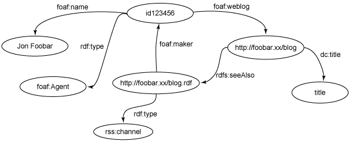

# 用 SPARQL 搜索 RDF 数据
用 SPARQL 和 Jena 工具包开启语义 Web

**标签:** Java,Web 开发

[原文链接](https://developer.ibm.com/zh/articles/j-sparql/)

Phil McCarthy

发布: 2005-06-13

* * *

_资源描述框架（Resource Description Framework）_ ，或 RDF，能够将数据打散并分布开来。RDF 模型可以容易地合并在一起，而且序列化的 RDF 也可以简单地通过 HTTP 交换。应用程序可以通过 Web 松散地耦合到多个 RDF 数据源上。例如，在 PlanetRDF.com 上，我们把多个作者的 weblog 集中起来，作者们在 RSS 1.0 feed 中用 RDF 提供内容。作者 feed 的 URL 本身就放在 RDF 图中，叫作 _bloggers.rdf_ 。

但是怎样才能在 RDF 图中发现并操纵需要的数据呢？SPARQL 协议和 RDF 查询语言（SPARQL）目前是 W3C 的工作草案，还在讨论当中。SPARQL 构建在以前的 RDF 查询语言（例如 rdfDB、RDQL 和 SeRQL）之上，拥有一些有价值的新特性。在本文中，我们将用三种驱动 PlanetRDF 的 RDF 图 —— 描述作者的 FOAF 图、他们的 RSS 1.0 feed 以及 bloggers 图 —— 来演示 SPARQL 能对数据做的一些有意思的事情。SPARQL 拥有针对各种平台和语言的实现；本文将重点介绍面向 Java 平台的 Jena 语义 Web 工具包。

本文假设您有 RDF 的工作知识，熟悉 RDF 的词汇（例如 Dublin Core、FOAF 和 RSS 1.0）。此外，本文还假设您有一些使用 Jena 语义 Web 工具包的经验。要想跟上所有这些技术的发展速度，请参阅后面 参考资料 部分中的链接。

## 一个简单 SPARQL 查询的剖析

我们首先从查看 PlanetRDF 的 bloggers.rdf 模型开始。该模型非常简单，通过 FOAF 和 Dublin Core 词汇为每个 blog 投稿者提供名称、blog 标题和 URL。图 1 显示了一个投稿者的基本图结构。完整的模型只是为我们汇集的每一篇 blog 日志重复这个结构而已。

##### 图 1\. bloggers.rdf 中的一个投稿者的基本图结构



现在，我们来看一个针对博客模型的非常简单的 SPARQL 查询。比方说以下这个查询”根据名为 Jon Foobar 的人查找 blog 的 URL”，如清单 1 所示：

##### 清单 1\. 查找某一投稿者的 blog 的 URL 的 SPARQL 查询

```
PREFIX foaf: <http://xmlns.com/foaf/0.1/>
SELECT ?url
FROM     <bloggers.rdf>
WHERE  {
    ?contributor foaf:name "Jon Foobar" .
    ?contributor foaf:weblog ?url .
}

```

Show moreShow more icon

查询的第一行只是为 FOAF 定义 `PREFIX` ，这样就不必每次都用完整名称引用它。 `SELECT` 子句指定查询应当返回的内容，在这个例子中，返回的是名为 `url` 的变量。SPARQL 变量用 `?` 或 `$` 作为前缀，这两个前缀是可以互换的，但在本文中，我坚持使用 `?` 作为前缀。 `FROM` 是一个可选的子句，它提供了将要使用的数据集的 URI。在这里，它只是指向一个本地文件，但是它也可以指向 Web 其他地方的某一个图的 URL。最后， `WHERE` 子句由一组三元模式组成，用基于 Turtle 的语法表示。这些三元模式共同构成了所谓的 _图形模式_ 。

这个查询试图把图形模式的三元模式和模型进行匹配。将每个图形模式变量的绑定与模型节点进行匹配就成为一种 _查询解决方案_ ，而 `SELECT` 子句中指定的变量值则成为查询结果的一部分。

在这个示例中， `WHERE` 子句的图形模式中的第一个三元组与 `foaf:name` 属性为”Jon Foobar”的节点匹配，并把它绑定到名为 `contributor` 的变量。在 bloggers.rdf 模型中， `contributor` 会和 [图 1\. bloggers.rdf 中的一个投稿者的基本图结构](#图-1-bloggers-rdf-中的一个投稿者的基本图结构) 顶部的空节点 `foaf:Agent` 匹配。图形模式的第二个三元组与 `contributor` 的 `foaf:weblog` 属性对应的对象匹配。这被绑定到 `url` 变量，形成查询结果。

## 在 Jena 中使用 SPARQL

支持在 Jena 中使用 SPARQL 目前可以通过叫作 _ARQ_ 的模块得以实现。除了实现 SPARQL 之外，ARQ 的查询引擎还可以解析使用 RDQL 或者它自己内部的查询语言表示的查询。ARQ 的开发很活跃，但它还不是标准 Jena 发行版本中的一部分。但是，可以从 Jena 的 CVS 仓库或者自包含的下载文件中获得它。

让 ARQ 运行起来很简单。只需要得到最新的 ARQ 发行包（要获得有关链接，请参阅后面 参考资料 部分），然后对其进行解压，把环境变量 `ARQROOT` 设置成指向 ARQ 目录即可。可能还需要恢复 ARQ bin 目录的读取和执行权限。如果把 bin 目录添加到执行路径中非常方便，那是因为它包含从命令行调用 ARQ 的包装器脚本。为了确定所有设置都已到位，请从命令行调用 `sparql` ，确定看到了它的用法信息。清单 2 演示了所有步骤，清单 2 假设正在 UNIX 类的平台上工作，或者是在 Windows 下用 Cygwin 工作。（ARQ 还附带了在 Windows 下使用的 `.bat` 脚本，但是它们用法和下面示例中的用法稍有差别。）

##### 清单 2\. 设置使用 Jena ARQ 的环境

```
$ export ARQROOT=~/ARQ-0.9.5
$ chmod +rx $ARQROOT/bin/*
$ export PATH=$PATH:$ARQROOT/bin
$ sparql
    Usage: [--data URL] [exprString | --query file]

```

Show moreShow more icon

### 从命令行执行 SPARQL 查询

现在就可以运行 SPARQL 查询了（参见清单 3）。我们将使用来自 [清单 1\. 查找某一投稿者的 blog 的 URL 的 SPARQL 查询](#清单-1-查找某一投稿者的-blog-的-url-的-sparql-查询) 的数据集和查询。因为查询使用 `FROM` 关键字指定要使用的图，所以只需把查询文件的位置提供给 `sparql` 命令行即可。但是，查询需要在包含图的目录中运行，因为该图是在查询的 `FROM` 子句中用相对 URL 指定的。

##### 清单 3\. 用 sparql 命令执行简单查询

```
$ sparql --query jon-url.rq
----------------------------
| url                      |
============================
| <http://foobar.xx/blog>  |
----------------------------

```

Show moreShow more icon

有时，从查询中忽略 `FROM` 子句很有意义。这样就可以允许在执行查询的时候才把图传递给它。当从应用程序代码中使用 SPARQL 时，避免把数据集绑定到查询是一个好习惯 —— 例如，它允许把同一查询重用在不同的图上。可以在命令行用 `sparql --data URL` 选项在运行时指定图，其中 `URL` 是图的位置。这个 URL 既可以是本地文件的位置，也可以是远程图的 Web 地址。

### 用 Jena API 执行 SPARQL 查询

命令行 `sparql` 工具对于运行独立查询有用，同时 Java 应用程序也可以直接调用 Jena 的 SPARQL 功能。通过 `com.hp.hpl.jena.query` 包中的类，使用 Jena 来创建和执行 SPARQL 查询。使用 `QueryFactory` 是最简单的方法。 `QueryFactory` 有各种 `create()` 方法，用来从文件或者 `String` 读取文本查询。这些 `create()` 方法返回 `Query` 对象，这个对象封装了解析后的查询。

下一步是创建 `QueryExecution` 的实例，这个类表示查询的一个执行。要获得 `QueryExecution` ，请调用 `QueryExecutionFactory.create(query, model)` ，并传入要执行的 `Query` 以及查询要处理的 `Model` 。因为查询的数据是编程方式提供的，所以查询不需要 `FROM` 子句。

`QueryExecution` 上有几种不同的执行方法，每个方法执行一种不同类型的查询（请参阅标题为” [其他类型的 SPARQL 查询](#其他类型的-sparql-查询) ”的侧栏，以获得更多信息）。对于简单的 `SELECT` 查询，可以调用 `execSelect()` ，该方法将返回 `ResultSet` 。 `ResultSet` 支持在查询返回的每个 `QuerySolution` 上进行迭代，这提供了对每个绑定变量值的访问。另外，还可以使用 `ResultSetFormatter` ，以不同的格式输出查询结果。

清单 4 显示了一个把这些步骤放在一起的简单方法。它执行一个针对 bloggers.rdf 的查询，并把结果输出到控制台。

##### 清间 4.用 Jena API 执行一个简单查询

```
// Open the bloggers RDF graph from the filesystem
InputStream in = new FileInputStream(new File("bloggers.rdf"));
// Create an empty in-memory model and populate it from the graph
Model model = ModelFactory.createMemModelMaker().createModel();
model.read(in,null); // null base URI, since model URIs are absolute
in.close();
// Create a new query
String queryString =
    "PREFIX foaf: <http://xmlns.com/foaf/0.1/> " +
    "SELECT ?url " +
    "WHERE {" +
    "      ?contributor foaf:name \"Jon Foobar\" . " +
    "      ?contributor foaf:weblog ?url . " +
    "      }";
Query query = QueryFactory.create(queryString);
// Execute the query and obtain results
QueryExecution qe = QueryExecutionFactory.create(query, model);
ResultSet results = qe.execSelect();
// Output query results
ResultSetFormatter.out(System.out, results, query);
// Important - free up resources used running the query
qe.close();

```

Show moreShow more icon

## 编写更复杂的查询

迄今为止，您已经看到了两种运行简单 SPARQL 查询的方法：用命令行 `sparql` 工具，用 Java 代码调用 Jena API。在这一节中，我将介绍更多 SPARQL 的特性，以及它们支持的更复杂的查询。

RDF 经常被用来表示 _半结构化的_ 数据。这意味着在一个模型中，两个相同类型的节点可能有两个不同的属性集。例如，在 FOAF 模型中，对人的描述可能只包含电子邮件地址；而作为另一个选择，它也可以包含真实名称、IRC 昵称、描绘个人照片的 URL，等等。

注意，为了进一步提炼查询的结果，SPARQL 拥有 `DISTINCT`、`LIMIT`、`OFFSET` 和 `ORDER BY` 关键字，它们操作或多或少与它们在 SQL 中的对应物有些类似。`DISTINCT` 可能只用在 `SELECT` 查询上，格式为 `SELECT DISTINCT`。它会从结果集中清除重复的查询结果，让留下的每个结果都是惟一的。其他关键字都放在查询的 `WHERE` 子句之后。`LIMIT n` 把查询返回的结果数量限制在 _n_ 个， 而 `OFFSET n` 则忽略前面 _n_ 个结果。`ORDER BY ?var` 会根据 `?var` 的自然顺序对结果进行排序，例如，如果 `var` 是字符串值，则按字母顺序排序。可以用 `ASC[?var]` 和 `DESC[?var]` 指定排序的方向。当然，可以把 `DISTINCT`、`LIMIT`、`OFFSET` 和 `ORDER BY` 组合在查询中。例如，可以用 `ORDER BY DESC[?date] LIMIT 10` 找到 RSS feed 中最新的十个条目。

清单 5 显示了一个非常小的 FOAF 图，用 Turtle 语法表示。它包含对 4 个虚构人物的描述，但是每个描述都有不同的属性集。

##### 清单 5\. 一个描述 4 个虚构人物的小 FOAF 图

```
@prefix foaf: <http://xmlns.com/foaf/0.1/> .
_:a foaf:name         "Jon Foobar" ;
    foaf:mbox         <mailto:jon@foobar.xx> ;
    foaf:depiction    <http://foobar.xx/2005/04/jon.jpg> .
_:b foaf:name         "A. N. O'Ther" ;
    foaf:mbox         <mailto:a.n.other@example.net> ;
    foaf:depiction    <http://example.net/photos/an-2005.jpg> .
_:c foaf:name         "Liz Somebody" ;
    foaf:mbox_sha1sum "3f01fa9929df769aff173f57dec2fe0c2290aeea"
_:d foaf:name         "M Benn" ;
    foaf:depiction    <http://mbe.nn/pics/me.jpeg> .

```

Show moreShow more icon

### 可选匹配

假设您想编写一个查询，返回清单 5 的图中所描述的每个人的名字，以及每个人的照片的链接（如果有照片的话）。在 `foaf:depiction` 中包含的图形模式的 `SELECT` 查询可能只会发现三个结果。Liz Somebody 不会形成结果，因为虽然它有 `foaf:name` 属性，但它没有 `foaf:depiction` 属性，而如果要与查询匹配的话，那么这两个属性都需要。

帮助就在眼前，就是 SPARQL 的 `OPTIONAL` 关键字。 _可选块_ 定义了附加图形模式，即使模式不匹配，不会造成结果被拒绝，但在匹配的时候，图形模式会被绑定到图形上。清单 6 演示了一个查询，在清单 5 的 FOAF 数据中查找每个人的 `foaf:name` ，而且可以选择性地查找伴随的 `foaf:depiction` 。

##### 清单 6\. 用可选块查询 FOAF 数据

```
PREFIX foaf: <http://xmlns.com/foaf/0.1/>
SELECT ?name ?depiction
WHERE {
        ?person foaf:name ?name .
        OPTIONAL {
            ?person foaf:depiction ?depiction .
        } .
      }

```

Show moreShow more icon

清单 7 显示了运行清单 6 的查询的结果。所有查询结果都包含人名，可选的图形模式则只在 `foaf:depiction` 属性存在的时候才绑定；如果没有，就从结果中忽略。从这种意义上说，查询与 SQL 中的左外连接相似。

##### 清单 7\. 清单 6 的查询结果

```
------------------------------------------------------------
| name           | depiction                               |
============================================================
| "A. N. O'Ther" | <http://example.net/photos/an-2005.jpg> |
| "Jon Foobar"   | <http://foobar.xx/2005/04/jon.jpg>      |
| "Liz Somebody" |                                         |
| "M Benn"       | <http://mbe.nn/pics/me.jpeg>            |
------------------------------------------------------------

```

Show moreShow more icon

可选块可以包含任何图形模式，不仅仅是像清单 6 所示的那种单一的三元模式。可选块中的所有查询模式都匹配，才能让可选模式成为查询结果的一部分。如果查询有多个可选块，那么它们会分别发挥作用 —— 可能在结果中被忽略，也可能存在于结果中。可选块也可以嵌套，在这种情况下，只有外部可选块的模式与图形匹配时，才考虑内部可选块。

### 替换匹配

FOAF 图形用人们的电子邮件地址来惟一地标识他们。出于隐私的考虑，有些人喜欢用电子邮件地址的哈希码。纯文本的电子邮件地址用 `foaf:mbox` 属性表示，而电子邮件地址的哈希码则用 `foaf:mbox_sha1sum` 属性表示；这两个属性在人们的 FOAF 描述中通常是互斥的。在这种情况下，可以用 SPARQL 的 _替代匹配_ 特性来编写查询，该查询返回任何可用的属性。

替换匹配的定义方式是写出多个替换图形模式，中间用 `UNION` 关键字连接。清单 8 显示的查询在 [清单 5\. 一个描述 4 个虚构人物的小 FOAF 图](#清单-5-一个描述-4-个虚构人物的小-foaf-图) 中的 FOAF 中查找每个人的名字，以及他们的 `foaf:mbox` 或 `foaf:mbox_sha1sum` 。M Benn 不是查询结果，因为它既没有 `foaf:mbox` 属性也没有 `foaf:mbox_sha1sum` 属性。与 `OPTIONAL` 图形模式相比， _至少_ 要有一个替换模式和某个查询结果匹配；如果 `UNION` 匹配中的分支都匹配，那么会生成两个结果。

##### 清单 8\. 有替代匹配的查询和查询结果

```
PREFIX foaf: <http://xmlns.com/foaf/0.1/>
PREFIX rdf: <http://www.w3.org/1999/02/22-rdf-syntax-ns#>
SELECT ?name ?mbox
WHERE {
?person foaf:name ?name .
{
      { ?person foaf:mbox ?mbox } UNION { ?person foaf:mbox_sha1sum ?mbox }
}
}
---------------------------------------------------------------------
| name                 | mbox                                       |
=====================================================================
| "Jon Foobar"         | <mailto:jon@foobar.xx>                     |
| "A. N. O'Ther"       | <mailto:a.n.other@example.net>             |
| "Liz Somebody"       | "3f01fa9929df769aff173f57dec2fe0c2290aeea" |
---------------------------------------------------------------------

```

Show moreShow more icon

### 值约束条件

SPARQL 中的 `FILTER` 关键字对绑定变量的值进行约束，从而限制查询的结果。这些值约束条件是对布尔值进行计算的逻辑表达式，并且可以与逻辑操作符 `&&` 和 `||` 组合使用。例如，可以用过滤器把返回名称列表的查询修改成只返回和指定正则表达式匹配的名称。或者，如清单 9 所示，过滤器在项目的出版日期上设置限制，从而找到 RSS feed 中在两个特定日期之间发布的项目。清单 9 还显示了如何使用 SPARQL 的 XPath 样式的类型转换特性（在这里，是将 `date` 变量转换成 XML Schema 的 `dateTime` 值），以及如何用 `^^xsd:dateTime` 在文字日期字符串上指定相同的数据类型。这可以确保在查询中使用日期比较，而不是标准的字符串比较。

##### 清单 9\. 用过滤器检索在 2005 年 4 月发布的 RSS feed 项目

```
PREFIX rss:   <http://purl.org/rss/1.0/>
PREFIX xsd:   <http://www.w3.org/2001/XMLSchema#>
PREFIX  dc:   <http://purl.org/dc/elements/1.1/>
SELECT ?item_title ?pub_date
WHERE {
      ?item rss:title ?item_title .
      ?item dc:date ?pub_date .
      FILTER xsd:dateTime(?pub_date) >= "2005-04-01T00:00:00Z"^^xsd:dateTime &&
             xsd:dateTime(?pub_date) < "2005-05-01T00:00:00Z"^^xsd:dateTime
      }

```

Show moreShow more icon

## 处理多个图形

迄今为止，我所演示的所有查询只包含一个 RDF 图的数据集。在 SPARQL 的术语中，这些查询针对的是 _后台图（background graph）_ 。后台图是指：在使用 Jena 的 API 时，通过某个查询的 `FROM` 子句、 `sparql` 命令的 `--data` 开关或者通过向 `QueryExecutionFactory.create()` 传递一个模型来指定的图。

##### 其他类型的 SPARQL 查询

除了本文使用的 `SELECT` 查询之外，SPARQL 还支持另外三种查询。如果查询的图形模式在数据集中有匹配物，那么 `ASK` 将返回 “yes”，如果没有匹配物，则返回 “no”。`DESCRIBE` 返回一个图形，其中包含和图形模式匹配的节点的相关信息。例如，`DESCRIBE ?person WHERE { ?person foaf:name "Jon Foobar" }` 会返回一个图，其中包括来自 Jon Foobar 的模型的三元模式。最后，`CONSTRUCT` 用来为每个查询结果输出一个图形模式。这样就可以直接从查询结果创建新的 RDF 图。可以把 RDF 图上的 `CONSTRUCT` 查询想像成与 XML 数据的 XSL 转换类似的东西。

除了后台图，SPARQL 还能查询任意数量的 _命名图_ 。这些附加的图是根据它们的 URI 来识别的，而这些 URI 在一个查询内是互不相同的。在研究使用命名图的方法之前，我要解释一下如何向查询提供这些 URI。与后台图一样，命名图可以在查询内部用 `FROM NAMED <URI>` 指定，在这里，是通过 `URI` 来指定图。另外，也可以用 `--named URL` 把命名图提供给 `sparql` 命令，URL 用于指定图的位置。最后，可以用 Jena 的 `DataSetFactory` 类指定要用编程方式查询的命名图。

在 SPARQL 查询内部用 `GRAPH` 关键字调用命名图，后面是图的 URI 或变量名。这个关键字后面是要与图匹配的图形模式。

### 在特定图中查找匹配

当 `GRAPH` 关键字和图的 URI（或者已经绑定到图的 URI 的变量）一起使用时，图形模式就被应用到这个 URI 标识的任何图。如果在指定的图中发现匹配物，那么该匹配物就成为查询结果的一部分。在清单 10 中，有两个 FOAF 图被传递给查询。查询结果是在两个图中都可以发现的那些人的名字。注意，表示每个 FOAF 图的那些人的节点是空节点，它们的作用范围有限，只在包含它们的图中有效。这意味着表示同一个人的节点不能在查询的两个命名图中同时存在，所以必须用不同的变量 （ `x` 和 `y` ）来表示它们。

##### 清单 10\. 查找在两个命名 FOAF 图中都描述的那些人的查询

```
PREFIX foaf: <http://xmlns.com/foaf/0.1/>
PREFIX rdf: <http://www.w3.org/1999/02/22-rdf-syntax-ns#>
SELECT ?name
FROM NAMED <jon-foaf.rdf>
FROM NAMED <liz-foaf.rdf>
WHERE {
GRAPH <jon-foaf.rdf> {
    ?x rdf:type foaf:Person .
    ?x foaf:name ?name .
} .
GRAPH <liz-foaf.rdf> {
    ?y rdf:type foaf:Person .
    ?y foaf:name ?name .
} .
}

```

Show moreShow more icon

### 查找包含某个模式的图

使用 `GRAPH` 的另一种方法是在它后面跟一个未绑定变量。在这种情况下，图形模式被应用到查询可以使用的每个命名图中。如果模式和其中一个命名图匹配，那么这个图的 URI 就被绑定到 `GRAPH` 的变量上。清单 11 的 `GRAPH` 子句和提供给查询的命名图中的每个人员节点匹配。匹配的人名被绑定到 `name` 变量，而 `graph_uri` 变量绑定到与模式匹配的图的 URI 上。查询的结果也显示出来。有一个名称 A. N. O’Ther 被匹配了两次，因为在 jon-foaf.rdf 和 liz-foaf.rdf 中都描述了这个人。

##### 清单 11\. 确定哪个图描述了不同的人

```
PREFIX foaf: <http://xmlns.com/foaf/0.1/>
PREFIX rdf: <http://www.w3.org/1999/02/22-rdf-syntax-ns#>
SELECT ?name ?graph_uri
FROM NAMED <jon-foaf.rdf>
FROM NAMED <liz-foaf.rdf>
WHERE {
    GRAPH ?graph_uri {
      ?x rdf:type foaf:Person .
      ?x foaf:name ?name .
    }
}
--------------------------------------------------------
| name                 | graph_uri                     |
========================================================
| "Liz Somebody"       | <file://.../jon-foaf.rdf>     |
| "A. N. O'Ther"       | <file://.../jon-foaf.rdf>     |
| "Jon Foobar"         | <file://.../liz-foaf.rdf>     |
| "A. N. O'Ther"       | <file://.../liz-foaf.rdf>     |
--------------------------------------------------------

```

Show moreShow more icon

注意，SPARQL 允许以 XML 格式返回查询结果，采用的格式叫作 _SPARQL 变量绑定结果 XML 格式_。这个用 schema 定义的格式是 RDF 查询和 XML 工具及库之间的桥梁。这项功能还有许多潜在用途。可以把 SPARQL 查询的结果通过 XSLT 转换成 Web 面或 RSS feed，通过 XPath 访问结果，或者把结果文件返回给 SOAP 或 AJAX 客户。要以 XML 格式返回查询结果，请使用 `ResultSetFormatter.outputAsXML()` 方法，或者在命令行指定 `--results rs/xml`。

### 组合后台数据和命名图

查询也可以把后台数据和命名图结合在一起使用。清单 12 用来自 PlanetRDF.com 的活动的聚合 RSS feed 作为后台数据，结合一个包含我自己的配置档案的命名图对它进行查询。我的想法是创建一个个性化的 feed，找到我认识的一些博客最新发表的十个贴子。查询的第一部分找到了 FOAF 文件中代表我的那些节点，然后找到了图中描述的、我认识的那些人的名字。第二部分在这些人创建的 RSS feed 中查找项目。最后，按照项目的创建时间对结果集进行排序，而且限制只返回十个结果。

##### 清单 12\. 得到一个个性化的活跃的 PlanetRDF feed

```
PREFIX foaf: <http://xmlns.com/foaf/0.1/>
PREFIX rss:  <http://purl.org/rss/1.0/>
PREFIX dc:   <http://purl.org/dc/elements/1.1/>
SELECT ?title ?known_name ?link
FROM <http://planetrdf.com/index.rdf>
FROM NAMED <phil-foaf.rdf>
WHERE {
        GRAPH <phil-foaf.rdf> {
          ?me foaf:name "Phil McCarthy" .
          ?me foaf:knows ?known_person .
          ?known_person foaf:name ?known_name .
        } .

        ?item dc:creator ?known_name .
        ?item rss:title ?title .
        ?item rss:link ?link .
        ?item dc:date ?date.
      }
ORDER BY DESC[?date] LIMIT 10

```

Show moreShow more icon

虽然这个查询只是返回标题、名称和 URL 的列表，但是更复杂的查询可以从匹配项目提取出所有数据。采用 SPARQL 的 XML 结果格式与 XSL 样式表结合，还可以创建博客日志的个性化的 HTML 视图，甚至生成另一个 RSS feed。

## 结束语

本文中的示例应当有助于您理解 SPARQL 的基本特性和语法，以及它带给 RDF 应用程序的好处。还了解了SPARQL 如何在可选和可替换匹配的帮助下，让您了解真实的 RDF 图的半结构化特性。使用命名图的示例还显示了如何使用 SPARQL 组合多个图来启用查询选项。您还看到在 Java 代码中用 Jena API 运行 SPARQL 是多么简单。

对于 SPARQL，还有更多这里可能没有介绍的内容，所以请利用下面的 参考资料 查找关于 SPARQL 特性的更多内容。请参阅 SPARQL 的规范，详细学习 SPARQL 的内置函数、操作符、查询格式和语法，或者参阅更多 SPARQL 查询示例。

当然，学习 SPARQL 的最好方法是编写一些自己的查询。从 Web 上得到一些 RDF 数据，下载 Jena ARQ 模块，开始体验吧！