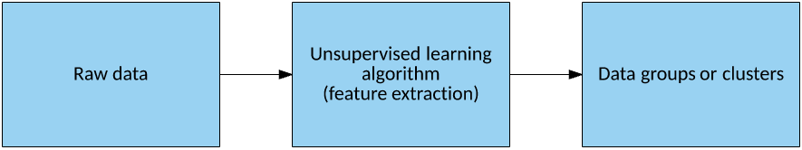
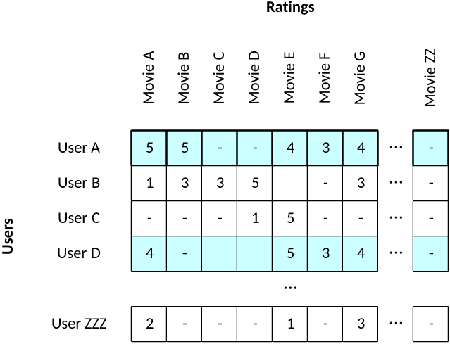
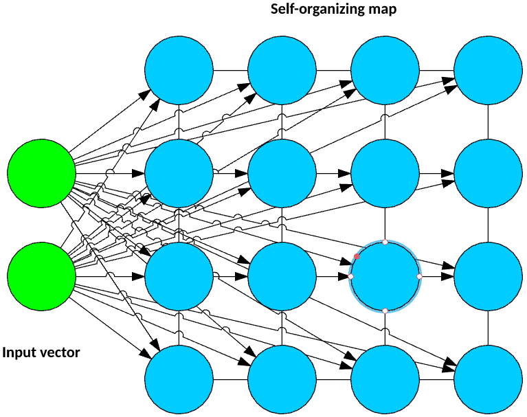
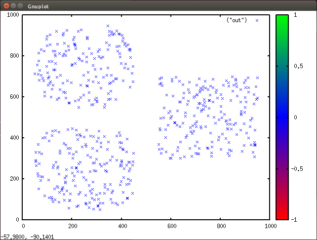
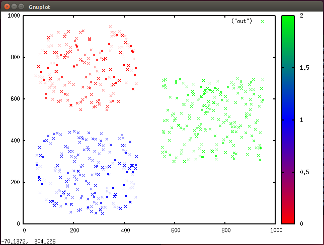
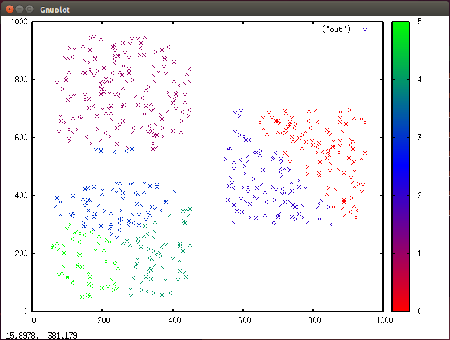

# 用于数据分类的无监督学习
发现无监督学习背后的理论和思想

**标签:** 人工智能

[原文链接](https://developer.ibm.com/zh/articles/cc-unsupervised-learning-data-classification/)

M. Tim Jones

发布: 2018-02-14

* * *

在无监督学习中，一个算法会对数据集中的数据进行分离，该数据集中的数据没有基于其隐含特征进行标记。此功能可能对发现数据的隐含结构和异常检测等任务很有用。本教程将解释无监督学习背后的概念和它的应用，然后在数据探索情景中演示这些概念。

无监督学习算法基于数据中的基础隐含特征对未标记的数据集中的数据进行分组（参见“无监督学习算法”）。由于没有标签，所以无法评估结果（这是与监督学习算法的一个关键区别）。通过无监督学习对数据分组，您会了解原始数据中平常可能看不见的信息。在高维或大型数据集中，此问题更加显著。

##### 无监督学习算法



除了对数据进行分组之外，该算法还可以使用这些分组挖掘隐含的特征。

## 特征向量

考虑一个按用户评分排列电影的数据集。用户为观看的每部电影分配 1-5 的评分（1 表示最差，5 表示最好）。每个用户由一个特征向量表示，该矢量包含用户提供的电影评分。通过将用户集中到分组中，您可以找到对电影有相似偏好（或相似厌恶）的人（参见图 2）。通过分析一个集群，可以在特征向量中找到可能适合推荐的差异（一部电影在集群中很常见，但该集群中的一些成员可能未看过这部电影）。

##### 一个用于电影评分的简单特征向量集



考虑用户 A 和 D。根据他们的评分，他们具有类似的电影品味，可能属于同一个用户集群。从图中可以看到，用户 A 喜欢“Movie B”，但用户 D 还未对该电影进行评分。因此，根据用户 D 的类似品味（以及他或她的差异），“Movie B”似乎适合推荐给该用户。

请注意，在这里，特征向量可能很大。例如，Amazon Prime 中有超过 20000 个标题。此问题的一个解决方案是，通过降维来减少考虑的特征数。使用现有的示例，您可以通过不表示各个评分本身，而是表示给定类型或标题（计算机高手、美国西部片或日本恐怖片）的评分总和或平均值，从而手动缩小特征向量的大小。一些技术可以使用主成份分析等计算方法来降维。

这是一个人为设计的示例，将介绍如何基于用户的集群成员关系和特征向量差异，使用集群向用户推荐内容。现在，让我们深入分析一些用于无监督学习的方法。

## 集群方法

对数据划分集群的一种流行算法是自适应共振理论 (ART) 系列算法 – 一组可用于识别模式和执行预测的神经网络模型。ART1 算法通过一个权矢量，将一个输入矢量映射到一个识别字段中的神经元。ART 的一个关键优势是，它提供了一个警戒参数来确定某个特征向量必须离一个集群多近才能属于该集群。否则，它可以自动为该特征向量创建一个新集群。警戒参数表明有许多与输入矢量更接近的集群（高度警戒），还是少量包含更多特征向量示例的一般集群（低度警戒）。

另一种神经网络方法称为自组织映射 (SOM)，它将多维特征向量转换为一种称为映射的低维表示。此方法通过矢量量化来实现一种数据压缩形式。该映射由神经网络构成，通常是一种常规的晶格形状（表示矩形网格的 NxM 个神经元）。映射中的每个神经元都有一个与输入矢量维数相匹配的权矢量（如图中的示例所示）。

##### 一种典型的自组织映射



输入矢量连接到映射中的每个神经元。在训练期间，每个观察值都会应用于输入矢量，而且会为映射的每个权矢量计算该观察值的欧几里德距离。权矢量离输入矢量最近（距离最小）的神经元被声明为获胜者，然后会向输入矢量更新权值。对数据集中的每个观察值都执行此过程。训练完成时，可以对网络应用一个新观察值，获胜的神经元表示该观察值的集群。

对数据划分集群的最简单最有效的算法之一是 _k_ 均值算法。SOM 类似于 _k_ 均值（对于少量神经元而言），但 SOM 有一个优势，因为映射实质上是拓扑结构形式的，并且很容易可视化，即使对于高维数据也是如此。让我们分析一下 _k_ 均值算法和它针对一个简单数据集的实现。

## k 均值集群

_k_ 均值集群背后的概念很容易可视化和理解。 _k_ 均值算法基于相似性将一组表示为特征向量的观察值组织到集群中。这种相似性是基于一个距离指标 – _k_ 个质心（质心是基于集群成员均值的集群中心）。欧几里德距离被用作相似性指标；最接近的质心（也表示为一个特征向量）是一个应该包含特征向量的集群。

现在让我们看看 _k_ 均值的训练算法。有 3 个基本步骤（初始化、更新和分配），第一步有很大的差异。对于初始化，我将演示随机分区方法，该方法将来自数据集的每个观察值随机分配给 _k_ 个集群中的一个。另一种方法称为 Forgy 方法，该方法从数据集中随机获取 _k_ 个观察值，并将每个观察值分配给一个集群。

##### 一种典型的 k 均值集群算法


更新步骤会根据集群中的观察值部分来计算质心，质心是集群中包含的所有特征向量的均值。

更新质心后，接下来将会执行分配步骤。在这一步，将会查看每个观察值，并测试它是否属于正确的集群。为此，我将计算观察值的特征向量离 _k_ 个质心中每个质心的欧几里德距离。最近的集群代表将会包含该观察值。如果该集群与观察值的当前集群不同，则移动该观察值。如果我退出分配步骤时所有观察值都没有改变集群，则会收敛该算法，我的任务完成了。否则，返回到更新步骤，更新质心并再次开始。

让我们看看 _k_ 均值的一种简单实现，我将使用它为一个简单数据集划分集群。

## k 均值实现

可以在 [GitHub](https://github.com/mtimjones/kmeans) 上找到针对 Linux 操作系统的 `C` 语言实现。我将采用自上而下的方式分析此实现，从 main 开始，然后通过各自的函数来深入分析初始化和更新步骤。

构建样本实现时，您会获得两个可执行程序。第一个名为 `gendata` ，可使用此实用程序生成一个包含约 600 个观察值的随机数据集。每个观察值都表示一个有两个属性（二维空间中的 _x_ 和 _y_ 位置）的特征向量。此数据集是人为设计的示例，所以很容易看出在 _k_ = 3 划分集群，如下图所示（使用 Gnuplot 绘制）。

##### 在 Gnuplot 中生成的集群的散点图



提供的第二个可执行程序名为 `kmeans` 。可以使用此可执行程序对测试数据划分集群。

观察值和质心在 `C` 中表示为结构数组，其中质心表示为两个属性，观察值由特征向量（两个属性）和它所属的类表示：

```
typedef struct observation
{
int    x;
int    y;
int class;
} observation;

typedef struct centroid
{
double x;
double y;
} centroid;

#define K                3
#define MAX_SAMPLES    600

centroid Centroids[ K ];
observation Observations[ MAX_SAMPLES ];

```

Show moreShow more icon

`main` 函数可用作 _k_ 均值算法的主循环。通过调用 `Read_Dataset` 来读取数据集后，我将观察值分配给一个随机数组，然后执行更新和分配步骤，直到不再发生集群成员更改。然后，我写出该数据集，以便绘制它的散点图：

```
int main( int argc, char *argv[] )
{
int Samples;

if ( argc != 2 )
{
      printf( "Usage is %s <observations_file>\n\n", argv[0] );
      return 0;
}

srand( time( NULL ) );

// Read the input dataset from the file.
Samples = Read_Dataset( argv[1] );

// Initialization step, initialize observations to clusters.
Initialization( Samples );

// Update step, continue to perform until convergence.
do
{
      Update( Samples );
}
while ( Assignment( Samples ) );

// Write the dataset back out.
Write_Dataset( Samples );

return 0;
}

```

Show moreShow more icon

在 `Initialization` 函数中，我将观察值随机分配给 3 个集群之一：

```
void Initialization( int Samples )
{
// Assign each observation to a random cluster.
for ( int Target = 0 ; Target < Samples ; Target++ )
{
      Observations[ Target ].class = getRand( K );
}

return;
}

```

Show moreShow more icon

`Assignment` 函数也非常简单。我迭代每个观察值，以查找它所属的集群。如果给定观察值的集群发生更改，我会跟踪记录此情况，以确认某个给定分配步骤中移动了多少个观察值：

```
int Assignment( int Samples )
{
int Moved = 0;

for ( int Index = 0 ; Index < Samples ; Index++ )
{
      int NearestClass = FindNearestCluster( Index );

      if ( NearestClass != Observations[ Index ].class )
      {
         // Change the membership of this observation
         // to the new cluster.
         Observations[ Index ].class = NearestClass;
         Moved++;
      }

}

return Moved;
}

```

Show moreShow more icon

要更新质心（集群的中心）， `Update` 函数首先会清除集群质心以及与它有关联的观察值数量 (`MembershipCount`)。接下来，会检查每个观察值，对特征向量求和，以获得它所属的质心。 然后除以与该集群有关联的观察值数量来计算平均值：

```
void Update( int Samples )
{
int MembershipCount[ K ];

// Initialize the clusters
for ( int Cluster = 0 ; Cluster < K ; Cluster++ )
{
      Centroids[ Cluster ].x = 0.0;
      Centroids[ Cluster ].y = 0.0;
      MembershipCount[ Cluster ] = 0;
}

// Update the cluster centroids
for ( int Index = 0 ; Index < Samples ; Index++ )
{
      Centroids[ Observations[ Index ].class ].x +=
        (double)Observations[ Index ].x;
      Centroids[ Observations[ Index ].class ].y +=
        (double)Observations[ Index ].y;
      MembershipCount[ Observations[ Index ].class ]++;
}

// Update centroids to average based upon the number of members.
for ( int Cluster = 0 ; Cluster < K ; Cluster++ )
{
      if ( MembershipCount[ Cluster ] > 1 )
      {
         Centroids[ Cluster ].x /=
            (double)MembershipCount[ Cluster ];
         Centroids[ Cluster ].y /=
            (double)MembershipCount[ Cluster ];
      }
}

return;
}

```

Show moreShow more icon

最后两个函数实现了两个点的欧几里德距离 (`distance`)， `FindNearestCluster` 实现了一个简单测试，以便计算一个给定观察值离集群 0 的距离，然后检查集群 1 和 2，查看该距离是否缩短（从而确定离观察值最近的质心）：

```
double distance( int x1, int y1, int x2, int y2 )
{
return sqrt( SQR( ( x2 - x1 ) ) + SQR( ( y2 - y1 ) ) );
}

int FindNearestCluster( int Index )
{
int    NearestCluster;
double Closest;

// Initialize with the first cluster
NearestCluster = 0;
Closest = distance( (double)Observations[ Index ].x,
                       (double)Observations[ Index ].y,
                        Centroids[ NearestCluster ].x,
                        Centroids[ NearestCluster ].y );

// Now test against the other K-1
for ( int Cluster = 1 ; Cluster < K ; Cluster++ )
{
      double Distance;
      Distance = distance( (double)Observations[ Index ].x,
                           (double)Observations[ Index ].y,
                            Centroids[ Cluster ].x,
                            Centroids[ Cluster ].y );

      if ( Distance < Closest )
      {
         Closest = Distance;
         NearestCluster = Cluster;
      }
}

return NearestCluster;
}

```

Show moreShow more icon

`Write_Dataset` 的输出结果包含来自特征向量和它所属的集群的属性。按照下图中每个集群结果的颜色分配来绘制此数据（使用 Gnuplot）。

##### Gnuplot 中的集群数据与颜色分配（3 个集群）



在这里可以注意到，创建该数据集时考虑了 3 个集群。如果我将程序中的 _k_ 更新为 6，它会识别 6 个不同的集群，但 3 个是自然分解的产物。

##### Gnuplot 中的数据集群与颜色分配（6 个集群）



其他集群算法（比如 ART）可以基于数据来自动识别合适的集群数量。这是 _k_ 均值的缺点之一。

## 使用程序

您可以使用样本程序生成一个测试数据集，然后使用 _k_ 均值对该数据集划分集群。以下命令演示了如何构建样本程序，生成测试数据，对它划分集群，然后使用 Gnuplot 绘制结果的散点图：

```
$ make
$ ./gendata > test.data
$ ./kmeans test.dat > clustered.data
$ gnuplot

gnuplot> set terminal x11
gnuplot> set palette model RGB defined (0 "red", 1 "blue", 2 "green")
gnuplot> set xrange[0:1000]
gnuplot> set yrange[0:1000]
gnuplot> plot ("clustered.data") with points pt 2 palette

```

Show moreShow more icon

## 结束语

在数据集缺少标签时，无监督学习是一种为数据划分集群的有用技术。划分集群后，您可以进一步研究数据集来确认数据的隐含特征。本教程讨论了 ART 和 SOM，然后演示了如何使用 _k_ 均值算法来划分集群。 您会发现各种各样的应用中都在使用类似这样的集群算法，最近，安全领域中还将该算法用于异常检测。

本文翻译自： [Unsupervised learning for data classification](https://developer.ibm.com/articles/cc-unsupervised-learning-data-classification/)（2017-12-04）