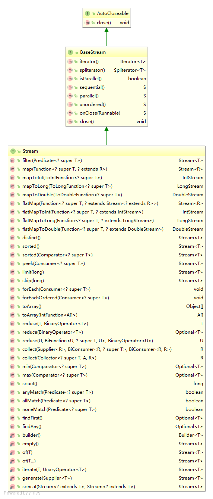

# 由浅入深体验 Stream 流
Stream 流的分类、接口、相关 API 操作以及并行流的使用

**标签:** Java

[原文链接](https://developer.ibm.com/zh/articles/j-experience-stream/)

甘 朝阳

发布: 2019-07-01

* * *

Stream 流是 Java 8 新提供给开发者的一组操作集合的 API，将要处理的元素集合看作一种流，流在管道中传输，并且可以在管道的节点上进行处理，比如筛选、排序、聚合等。元素流在管道中经过中间操作（intermediate operation）的处理，最后由终端操作 (terminal operation) 得到前面处理的结果。Stream 流可以极大的提高开发效率，也可以使用它写出更加简洁明了的代码。我自从接触过 Stream 流之后，可以说对它爱不释手。本文将由浅及深带您体验 Stream 流的使用。那么就让我们从流的简单使用来开启体验之旅。

## 流的简单使用

本节将通过实际的例子带您一起了解 Stream 流：创建流以及简单的使用，并且将其与 Java 8 之前的实现方式做一下对比。

我们将创建一个学生类 `student`，它包含姓名 `name` 和分数 `score` 两个属性。并且初始化一个学生的集合，然后分别通过 Stream 流和 Java 7 的集合操作实现筛选未及格（分数<60 分）的学生名单，您可以在 GitHub 上查看 [本节源代码](https://github.com/ganchaoyang/java-tutorial/blob/master/stream/src/main/java/cn/itweknow/javatutorial/stream/SimpleUse.java) 。

### 创建流

有以下两种创建流的方式，第一种方式我们使用的会相对较多。

- 调用集合的 `stream()` 方法或者 `parallelStream()` 方法创建流。
- Stream 类的静态 `of()` 方法创建流。

**清单 1\. 创建 Stream 流**

```
List< String> createStream = new ArrayList< String>();
// 顺序流
Stream< String> stream = createStream.stream();
// 并行流
Stream< String> parallelStream = createStream.parallelStream();
// of()方法创建
Stream< String> stringStream = Stream.of(
       createStream.toArray(new String[createStream.size()]));

```

Show moreShow more icon

### 使用流

清单 2 展示了如何使用 Stream 流筛选未及格学生名单：

**清单 2\. 使用 Stream 流筛选未及格学生名单**

```
public static void streamImpl(List< Student> students) {
List< Student> filterStudent = students.stream()
       .filter(one -> one.getScore() <  60).collect(Collectors.toList());
System.out.println(filterStudent);
}

```

Show moreShow more icon

而使用 Java 7 实现筛选未及格学生名单所需代码相对冗长，如清单 3 所示：

**清单 3\. Java 7 实现筛选未及格学生名单**

```
public static void java7Impl(List<Student> students) {
List<Student> filterStudent = new ArrayList<>();
for (Student student : students) {
     if (student.getScore() < 60) {
        filterStudent.add(student);
     }
}
System.out.println(filterStudent);
}

```

Show moreShow more icon

对比两段代码，我们很容易看出来 Stream 流可以让我操作集合的代码更加简洁，而且可以很清晰地体现出来我们是在做一个筛选的动作，在某些情况下可以让我们的代码更加易读。

## 流的基础知识

接下来您将了解 Stream 流的基础知识，这部分的内容将有助于您理解流的相关操作。

### 流的分类

`Stream` 流分为顺序流和并行流，所谓顺序流就是按照顺序对集合中的元素进行处理，而并行流则是使用多线程同时对集合中多个元素进行处理，所以在使用并行流的时候就要注意线程安全的问题了。后文会单独讲解 [并行流的使用](#并行流的使用) 。

### 终端操作和中间操作

终端操作会消费 Stream 流，并且会产生一个结果，比如 `iterator()` 和 `spliterator()`。如果一个 Stream 流被消费过了，那它就不能被重用的。

中间操作会产生另一个流。需要注意的是中间操作不是立即发生的。而是当在中间操作创建的新流上执行完终端操作后，中间操作指定的操作才会发生。流的中间操作还分无状态操作和有状态操作两种。

- 在无状态操作中，在处理流中的元素时，会对当前的元素进行单独处理。比如，过滤操作，因为每个元素都是被单独进行处理的，所有它和流中的其它元素无关。
- 在有状态操作中，某个元素的处理可能依赖于其他元素。比如查找最小值，最大值，和排序，因为他们都依赖于其他的元素。

### 流接口

下面是一张 Stream 的 UML (统一建模语言) 类图，后文会讲解其中的一些关键方法。（IDEA 自带一个生成 UML 类图工具，使用方式参照 [这篇文章](https://blog.csdn.net/hy_coming/article/details/80741717) 。）

**图 1\. Stream UML 类图**



#### BaseStream 接口

从上面的 UML 图可以看出来 `BaseStream` 接口是 Stream 流最基础的接口，它提供了所有流都可以使用的基本功能。 `BaseStream` 是一个泛型接口,它有两个类型参数 `T` 和 `S` ， 其中 `T` 指定了流中的元素的类型， `S` 指定了具体流的类型，由 `<S extends BaseStream<T,S>>` 可以知道 `S` 必须为 `BaseStream` 或 `BaseStream` 子类，换句话说,就是 `S` 必须是扩展自 `BaseStream` 的。 `BaseStream` 继承了 `AutoCloseable` 接口，简化了关闭资源的操作，但是像平时我们操作的集合或数组，基本上都不会出现关闭流的情况。下面是 `BaseStream` 接口下定义的方法的相关解释：

- `Iterator<T> iterator()` ：获取流的迭代器。
- `Spliterator spliterator()` ：获取流的 `spliterator` 。
- `boolean isParallel()` ：判断一个流是否是并行流，如果是则返回 `true` ，否则返回 `false` 。
- `S sequential()` ：基于调用流返回一个顺序流，如果调用流本身就是顺序流，则返回其本身。
- `S parallel()` ：基于调用流，返回一个并行流，如果调用流本身就是并行流，则返回其本身。
- `S unordered()` ：基于调用流，返回一个无序流。
- `S onClose(Runnable closeHandler)` ：返回一个新流， `closeHandler` 指定了该流的关闭处理程序，当关闭该流时，将调用这个处理程序。
- `void close()` ：从 `AutoCloseable` 继承来的，调用注册关闭处理程序，关闭调用流(很少会被使用到)。

清单 4 列举了由 BaseStream 接口派生出来的流接口，包括了 `IntStream`，`LongStream`， `Stream` 以及 `DoubleStream`。其中 Stream 接口最为通用，本文的主要讲解对象也是它。

**清单 4\. 由 `BaseStream` 接口派生出的流接口**

```
public interface IntStream extends BaseStream<、Intege、r, IntStream> {}
public interface LongStream extends BaseStream<Long, LongStream> {}
public interface DoubleStream extends BaseStream<Double, DoubleStream> {}
public interface Stream<T> extends BaseStream<T, Stream<T>> {}

```

Show moreShow more icon

#### Stream 接口

- `Stream filter(Predicate predicate)` ：产生一个新流，其中包含调用流中满足 `predicate` 指定的谓词元素，即筛选符合条件的元素后重新生成一个新的流。(中间操作)
- `Stream map(Function mapper)` ，产生一个新流，对调用流中的元素应用 `mapper` ，新 `Stream` 流中包含这些元素。(中间操作)
- `IntStream mapToInt(ToIntFunction mapper)` ：对调用流中元素应用 `mapper` ，产生包含这些元素的一个新 `IntStream` 流。(中间操作)
- `Stream sorted(Comparator comparator)` ：产生一个自然顺序排序或者指定排序条件的新流。(中间操作)
- `void forEach(Consumer action)` ：遍历了流中的元素。(终端操作)
- `Optional min(Comparator comparator)` 和 `Optional max(Comparator comparator)` ：获得流中最大最小值，比较器可以由自己定义。(终端操作)
- `boolean anyMatch(Predicate<? super T> predicate)` ：判断 `Stream` 流中是否有任何符合要求的元素，如果有则返回 `ture`,没有返回 `false` 。（终端操作）
- `Stream<T> distinct()` ，去重操作，将 `Stream` 流中的元素去重后，返回一个新的流。（中间操作）

## 流的 API 操作

### 缩减操作

什么是缩减操作呢？最终将流缩减为一个值的终端操作，我们称之为缩减操作。在上一节中提到的 `min()，max()` 方法返回的是流中的最小或者最大值，这两个方法属于特例缩减操作。而通用的缩减操作就是指的我们的 `reduce()` 方法了，在 Stream 类中 `reduce` 方法有三种签名方法，如下所示：

**清单 5\. `reduce()` 方法的三种实现**

```
public interface Stream<T> extends BaseStream<T, Stream<T>> {
...
Optional<T> reduce(BinaryOperator<T> accumulator);
T reduce(T identity, BinaryOperator<T> accumulator);
<U> U reduce(U identity,
                 BiFunction<U, ? super T, U> accumulator,
                 BinaryOperator<U> combiner);
...
}

```

Show moreShow more icon

由上面的代码可以看出，在 Stream API 中 `reduce()` 方法一共存在着三种签名，而这三种签名则分别会适用在不同的场景，我们下面就一起来看一下如何使用。

#### 第一种签名

在下面的代码中我们将对一个 Integer 类型的集合做求和操作。

**清单 6\. 第一种签名的 `reduce()` 的使用**

```
public static void reduceFirstSign() {
List<Integer> list = Arrays.asList(1,2,3,4,5,6);
ptional<Integer> count = list.stream().reduce((a, b) -> (a + b));
System.out.println(count.get()); // 21
}

```

Show moreShow more icon

#### 第二种签名

与第一种签名不同的是多接收了一个参数 `identity` ，在首次执行 `accumulator` 表达式的时候它的第一个参数并不是 Stream 流的第一个元素，而是 `identity` 。比如下面的例子最终输出的结果是 Stream 流中所有元素乘积的 2 倍。

**清单 7\. 第二种签名的 `reduce()` 的使用**

```
public static void reduceSecondSign() {
List<Integer> list = Arrays.asList(1,2,3,4,5,6);
Integer count = list.stream().reduce(2, (a, b) -> (a * b));
System.out.println(count);  // 1440
}

```

Show moreShow more icon

#### 第三种签名

前面两种前面的一个缺点在于返回的数据都只能和 Stream 流中元素类型一致，但这在某些情况下是无法满足我们的需求的，比如 Stream 流中元素都是 `Integer` 类型，但是求和之后数值超过了 `Integer` 能够表示的范围，需要使用 `Long` 类型接受，这就用到了我们第三种签名的 `reduce()` 方法。

**清单 8\. 第三种签名的 `reduce()` 的使用**

```
public static void reduceThirdSign() {
List<Integer> list = Arrays.asList(Integer.MAX_VALUE, Integer.MAX_VALUE);
long count = list.stream().reduce(0L, (a, b) -> (a + b), (a,b) -> 0L);
System.out.println(count);
}

```

Show moreShow more icon

总的来说缩减操作有两个特点，一是他只返回一个值，二是它是一个终端操作。在这里顺便给大家留一个缩减操作的题目，统计一个班上所有及格同学的分数总和（学生类可参考 [流的简单使用](#流的简单使用) 章节，答案可以参考 [参考答案](#参考答案) 章节）。

### 映射

可能在我们的日常开发过程中经常会遇到将一个集合转换成另外一个对象的集合，那么这种操作放到 Stream 流中就是映射操作。映射操作主要就是将一个 Stream 流转换成另外一个对象的 Stream 流或者将一个 Stream 流中符合条件的元素放到一个新的 Stream 流里面。

在 Stream API 库中也提供了丰富的 API 来支持我们的映射操作，清单 9 中的方法都是我们所讲的映射操作。

**清单 9\. 映射操作相关方法定义**

```
public interface Stream<T> extends BaseStream<T, Stream<T>> {
...
<R> Stream<R> map(Function<? super T, ? extends R> mapper);
IntStream mapToInt(ToIntFunction<? super T> mapper);
LongStream mapToLong(ToLongFunction<? super T> mapper);
DoubleStream mapToDouble(ToDoubleFunction<? super T> mapper);
<R> Stream<R> flatMap(Function<? super T, ? extends Stream<? extends R>>> mapper);
IntStream flatMapToInt(Function<? super T, ? extends IntStream> mapper);
LongStream flatMapToLong(Function<? super T, ? extends LongStream> mapper);
DoubleStream flatMapToDouble(Function<? super T, ? extends DoubleStream> mapper);
...
}

```

Show moreShow more icon

其中最通用的应该就属 `mapv` 和 `flatMap` 两个方法了，下面将以不同的例子分别来讲解着两个方法。

#### `map()`

`map()` 方法可以将一个流转换成另外一种对象的流，其中的 `T` 是原始流中元素的类型，而 `R` 则是转换之后的流中元素的类型。通过下面的代码我们将一个学生对象的 Stream 流转换成一个 `Double` 类型（学生的分数）的 Stream 流并求和后输出。

**清单 10\. `map()` 方法的使用示例**

```
public static void useMap() {
List<Student> students = initData();
double scoreCount = students.stream()
            .map(Student::getScore)
            .reduce(0.0, (a,b) -> (a + b));
System.out.println(scoreCount);
}

```

Show moreShow more icon

当然上面这种情况用 `mapToDouble()` 会更加方便，使用 `map()` 是为了展示一下 `map` 的使用方式，那么使用 `mapToDouble()` 方法的代码如下：

**清单 11\. `mapToDouble()` 方法的使用示例**

```
double scoreCount = students.stream()
                .mapToDouble(Student::getScore)
                .sum();

```

Show moreShow more icon

#### flatMap()

`flatMap()` 操作能把原始流中的元素进行一对多的转换，并且将新生成的元素全都合并到它返回的流里面。假如现每个班的学生都学了不同的课程，现在需要统计班里所有学生所学的课程列表，该如何实现呢?

**清单 12\. `flatMap ()` 方法的使用示例**

```
public static void useFlatMap() {
List<Student> students = initData();
List<String> course = students.stream().flatMap(one -> one.getCourse().stream()).distinct()
                .collect(Collectors.toList());
System.out.println(course);
}

```

Show moreShow more icon

如上代码中 `flatMap()` 中返回的是一个一个的 `String` 类型的 Stream 流，它们会被合并到最终返回的 Stream 流（String 类型）中。而后面的 `distinct()` 则是一个去重的操作， `collect()` 是收集操作。

### 收集操作

很多时候我们需要从流中收集起一些元素，并以集合的方式返回，我们把这种反向操作称为收集操作。对于收集操作，Stream API 也提供了相应的方法。

**清单 13\. 收集操作相关 API**

```
public interface Stream<T> extends BaseStream<T, Stream<T>> {
...
<R, A> R collect(Collector<? super T, A, R> collector);
...
}

```

Show moreShow more icon

其中 `R` 指定结果的类型， `T` 指定了调用流的元素类型。内部积累的类型由 `A` 指定。 `collector` 是一个收集器，指定收集过程如何执行， `collect()` 方法是一个终端方法。一般情况我们只需要借助 `Collectors` 中的方法就可以完成收集操作。

`Collectors` 类是一个最终类，里面提供了大量的静态的收集器方法，借助他，我们基本可以实现各种复杂的功能了。

**清单 14\. Collectors**

```
public final class Collectors {
...
public static <T> Collector<T, ?, List<T>> toList() {
...
}
public static <T, K, U> Collector<T, ?, Map<K,U>> toMap(
Function<? super T, ? extends K> keyMapper,
Function<? super T, ? extends U> valueMapper) {
...
}
...
}

```

Show moreShow more icon

`Collectors` 给我们提供了非常丰富的收集器，这里只列出来了 `toList` 和 `toMap` 两种，其他的可以参考 `Collectors` 类的源码。 `toList()` 相信您在清单 14 中已经见到了，那么下面将展示如何将一个使用收集操作将一个 `List` 集合转为 `Map` 。

**清单 15\. 使收集操作将 List 转 Map**

```
public static void list2Map() {
List<Student> students = initData();
Map<String, Double> collect = students.stream()
         .collect(Collectors.toMap(one -> one.getName(),
one -> one.getScore()));
System.out.println(collect);
}

```

Show moreShow more icon

可以看到通过 Stream API 可以很方便地将一个 `List` 转成了 `Map` ，但是这里有一个地方需要注意。那就是在通过 Stream API 将 `List` 转成 `Map` 的时候我们需要确保 `key` 不会重复，否则转换的过程将会直接抛出异常。

## 并行流的使用

我们处于一个多核处理器的时代，在日常的开发过程中也经常会接触到多线程。Stream API 也提供了相应的并行流来支持我们并行地操作数组和集合框架，从而高速地执行我们对数组或者集合的一些操作。

其实创建一个并行流非常简单，在 [创建流](#创建流) 部分已经提到过如何创建一个并行流，我们只需要调用集合的 `parallelStream()` 方法就可以轻松的得到一个并行流。相信大家也知道多线程编程非常容易出错，所以使用并行流也有一些限制，一般来说，应用到并行流的任何操作都必须符合三个约束条件：无状态、不干预、关联性。因为这三大约束确保在并行流上执行操作的结果和在顺序流上执行的结果是相同的。

在 [缩减操作](#缩减操作) 部分我们一共提到了三种签名的 `reduce()` 方法，其中第三种签名的 `reduce()` 方法最适合与并行流结合使用。

**清单 16\. 第三种签名方式的 `reduce()` 方法与并行流结合使用**

```
public interface Stream<T> extends BaseStream<T, Stream<T>> {
...
<U> U reduce(U identity,
                 BiFunction<U, ? super T, U> accumulator,
                 BinaryOperator<U> combiner);
...
}

```

Show moreShow more icon

其中 `accumulator` 被为累加器， `combiner` 为合成器。 `combiner` 定义的函数将 `accumulator` 提到的两个值合并起来，在之前的例子中我们没有为合并器设置具体的表达式，因为在那个场景下我们不会使用到合并器。下面我们来看一个例子，并且分析其执行的步骤：

**清单 17\. 并行流使用场景**

```
public static void main(String[] args) {
List<Integer> list = Arrays.asList(2,2);
Integer result = list.stream().parallel().reduce(2, (a, b) -> (a + b), (a, b) -> (a + b));
System.out.println(result);
}

```

Show moreShow more icon

上面的代码实际上是先使用累加器把 Stream 流中的两个元素都加 `2` 后，然后再使用合并器将两部分的结果相加。最终得到的结果也就是 `8` 。并行流的使用场景也不光是在这中缩减操作上，比如我会经常使用并行流处理一些复杂的对象集合转换，或者是一些必须循环调用的网络请求等等，当然在使用的过程中最需要注意的还是线程安全问题。

## 参考答案

在 [流的 API 操作](#流的-api-操作) 章节给大家留了一个统计一个班上所有及格同学的分数总和的题目，此处给出我的实现方式，第一种方式是使用 `reduce()` 方法实现，也就是我们留题目的地方所讲解的 API 方法：

**清单 18\. 第一种实现方式**

```
public static void answer() {
    List<Student> students = initData();
    Double result = students.stream()
            .filter(one -> one.getScore() >= 60).map(o -> o.getScore())
            .reduce(0d, (a,b) -> (a + b));
    System.out.println(result);
}

```

Show moreShow more icon

第二种实现方法是通过 `sum()` 方法实现， `sum()` 也是一个终端操作，它可以对一个数字类型的流进行求和操作并返回结果：

**清单 19\. 第二种实现方式**

```
public static void answerSecondImpl() {
        List<Student> students = initData();
        Double result = students.stream()
                .filter(one -> one.getScore() >= 60).mapToDouble(o -> o.getScore()).sum();
        System.out.println(result);
}

```

Show moreShow more icon

以上是我提供的两种解题方式，如果您有更好的解决方法欢迎以评论的方式共享给大家。

## 结束语

在本教程中，我们主要了解了 Java 8 Stream 流的基础知识及使用，涵盖 Stream 流的分类、接口、相关 API 操作以及并行流的使用。您可以在 GitHub 上找到本教程的 [完整实现](https://github.com/ganchaoyang/java-tutorial/tree/master/stream/src/main/java/cn/itweknow/javatutorial/stream) ，如果您想对本教程做补充的话欢迎发邮件（gancy.programmer@gmail.com）给我或者直接在 Github 上提交 Pull Reqeust。