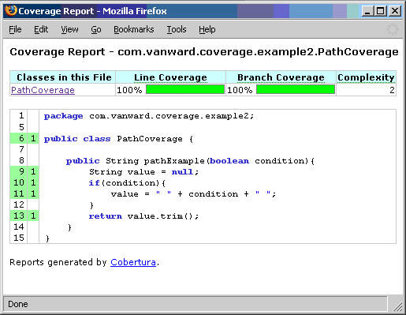
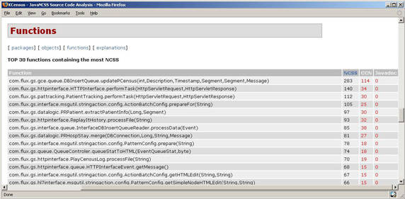

# 监视圈复杂度
当代码复杂度超出想像时该如何做

**标签:** DevOps,Java

[原文链接](https://developer.ibm.com/zh/articles/j-cq03316/)

Andrew Glover

发布: 2006-04-25

* * *

每位开发人员对代码质量的含义都有着自己的看法，并且大多数人对如何查找编写欠佳的代码也有自己的想法。甚至术语 _代码味道（code smell）_ 也已进入大众词汇表，成为描述代码需要改进的一种方式。

##### 圈什么？

关于这篇文章和代码质量主题的任何其他文章的问题，请访问由 Andrew Glover 主持的 [Improve your Java Code Quality](http://www.ibm.com/developerworks/forums/dw_forum.jsp?S_TACT=105AGX52&cat=10&S_CMP=cn-a-j&forum=812) 讨论论坛。

代码味道通常由开发人员直接判定，有趣的是，它是许多代码注释综合在一起的味道。一些人声称公正的代码注释是好事情，而另一些人声称代码注释只是解释过于复杂的代码的一种机制。显然，Javadocs™ 很有用，但是多少内嵌注释才足以维护代码？如果代码已经编写得足够好，它还需要解释自己吗？

这告诉我们，代码味道是一种评估代码的机制，它具有主观性。我相信，那些闻起来味道糟透了的代码可能是其他人曾经编写的最好的代码。以下这些短语听起来是不是很熟悉？

> _是的，它初看起来有点乱，但是您要看到它多么可扩展！！_

或者

> _它让您感到迷惑，但显然您不了解它的模式。_

我们需要的是客观评估代码质量的方法，某种可以决定性地告诉我们正在查看的代码是否存在风险的东西。不管您是否相信，这种东西确实存在！用来客观评估代码质量的机制已经出现了一段时间了，只是大多数开发人员忽略了它们。这些机制被称为代码度量 (code metric)。

## 代码度量的历史

几十年前，少数几个非常聪明的人开始研究代码，希望定义一个能够与缺陷关联的测量系统。这是一个非常有趣的主张：通过研究带 bug 代码中的模式，他们希望创建正式的模型，然后可以评估这些模型，在缺陷 _成为缺陷之前_ 捕获它们。

在这条研究之路上，其他一些非常聪明的人也决定通过研究代码看看他们是否可以测量 _开发人员的生产效率_ 。对每位开发人员的代码行的经典度量似乎只停留在表面上：

> _Joe 生产的代码要比 Bill 多，因此 Joe 生产率更高一些，值得我们花钱聘请这样的人。此外，我注意到 Bill 经常在饮水机边闲晃，我认为我们应该解雇 Bill。_

但是这种生产率度量在实践中是非常令人失望的，主要是因为它容易被滥用。一些代码测量包括内嵌注释，并且这种度量实际上受益于剪切粘贴式开发 (cut-and-paste style development)。

> _Joe 编写了许多缺陷！其他每条缺陷也都是由他间接造成的。我们不该解雇 Bill，他的代码实际上是免检的。_

可以预见，生产率研究被证实是非常不准确的，但在管理团队 (management body) 广泛使用这种生产率度量以期了解每个人的能力的价值之前，情况并非如此。来自开发人员社区的痛苦反应是有理由的，对于一些人而言，那种痛苦感觉从未真正走远。

### 未经雕琢的钻石

尽管存在这些失败，但在那些复杂度与缺陷的相互关系的研究中仍然有一些美玉。大多数开发人员忘记进行代码质量研究已有很长一段时间了，但对于那些仍正在钻研的人而言（特别是如果您也正在为追求代码质量而努力钻研），会在今天的应用中发现这些研究的价值。例如，您曾注意到一些长的方法有时难以理解吗？是否曾无法理解嵌套很深的条件从句中的逻辑？您的避开这类代码的本能是正确的。一些长的方法和带有大量路径的方法 _是_ 难以理解的，有趣的是，这类方法容易导致缺陷。

我将使用一些例子展示我要表达的意思。

## 数字的海洋

研究显示，平均每人在其大脑中大约能够处理 7（±2）位数字。这就是为什么大多数人可以很容易地记住电话号码，但却很难记住大于 7 位数字的信用卡号码、发射次序和其他数字序列的原因。

此原理还可以应用于代码的理解上。您以前大概已经看到过类似清单 1 中所示的代码片段：

##### 清单 1\. 适用记忆数字的原理

```
if (entityImplVO != null) {
List actions = entityImplVO.getEntities();
if (actions == null) {
     actions = new ArrayList();
}
Iterator enItr = actions.iterator();
while (enItr.hasNext()) {
    entityResultValueObject arVO = (entityResultValueObject) actionItr
     .next();
    Float entityResult = arVO.getActionResultID();
    if (assocPersonEventList.contains(actionResult)) {
      assocPersonFlag = true;
    }
    if (arVL.getByName(
      AppConstants.ENTITY_RESULT_DENIAL_OF_SERVICE)
         .getID().equals(entityResult)) {
      if (actionBasisId.equals(actionImplVO.getActionBasisID())) {
        assocFlag = true;
      }
    }
    if (arVL.getByName(
     AppConstants.ENTITY_RESULT_INVOL_SERVICE)
      .getID().equals(entityResult)) {
     if (!reasonId.equals(arVO.getStatusReasonID())) {
       assocFlag = true;
     }
}
}
}else{
entityImplVO = oldEntityImplVO;
}

```

Show moreShow more icon

清单 1 展示了 9 条不同的路径。该代码片段实际上是一个 350 多行的方法的一部分，该方法展示了 41 条不同的路径。设想一下，如果您被分配一项任务，要修改此方法以添加一项新功能。如果您该方法不是您编写的，您认为您能只做必要的更改而不会引入任何缺陷吗？

当然，您应该编写一个测试用例，但您会认为该测试用例能将您的特定更改在条件从句的海洋中隔离起来吗？

## 测量路径复杂度

_圈复杂度_ 是在我前面提到的那些研究期间开创的，它可以精确地测量路径复杂度。通过利用某一方法路由不同的路径，这一基于整数的度量可适当地描述方法复杂度。实际上，过去几年的各种研究已经确定：圈复杂度（或 CC）大于 10 的方法存在很大的出错风险。因为 CC 通过某一方法来表示路径，这是用来确定某一方法到达 100% 的覆盖率将需要多少测试用例的一个好方法。例如，以下代码（您可能记得本系列的第一篇文章中使用过它）包含一个逻辑缺陷：

##### 清单 2\. PathCoverage 有一个缺陷！

```
public class PathCoverage {
public String pathExample(boolean condition){
    String value = null;
    if(condition){
      value = " " + condition + " ";
    }
    return value.trim();
}
}

```

Show moreShow more icon

作为响应，我可以编写一个测试，它将达到 100% 的行覆盖率：

##### 清单 3\. 一个测试产生完全覆盖！

```
import junit.framework.TestCase;
public class PathCoverageTest extends TestCase {
public final void testPathExample() {
    PathCoverage clzzUnderTst = new PathCoverage();
    String value = clzzUnderTst.pathExample(true);
    assertEquals("should be true", "true", value);
}
}

```

Show moreShow more icon

接下来，我将运行一个代码覆盖率工具，比如 Cobertura，并将获得如图 1 中所示的报告：

##### 图 1\. Cobertura 报告



哦，有点失望。代码覆盖率报告指示 100% 的覆盖率，但我们知道这是一个误导。

### 二对二

注意，清单 2 中的 `pathExample()` 方法有一个值为 2 的 CC（一个用于默认路径，一个用于 `if` 路径）。使用 CC 作为更精确的覆盖率测量尺度意味着第二个测试用例是必需的。在这里，它将是不进入 `if` 条件语句而采用的路径，如清单 4 中的 `testPathExampleFalse()` 方法所示：

##### 清单 4\. 沿着较少采用的路径向下

```
import junit.framework.TestCase;
public class PathCoverageTest extends TestCase {

public final void testPathExample() {
    PathCoverage clzzUnderTst = new PathCoverage();
    String value = clzzUnderTst.pathExample(true);
    assertEquals("should be true", "true", value);
}
public final void testPathExampleFalse() {
    PathCoverage clzzUnderTst = new PathCoverage();
    String value = clzzUnderTst.pathExample(false);
    assertEquals("should be false", "false", value);
}
}

```

Show moreShow more icon

正如您可以看到的，运行这个新测试用例会产生一个令人讨厌的 `NullPointerException` 。在这里，有趣的是我们可以使用圈复杂度 _而不是_ 使用代码覆盖率来找出这个缺陷。代码覆盖率指示我们已经在一个测试用例之后完成了此操作，但 CC 却会强迫我们编写额外的测试用例。不算太坏，是吧？

幸运的是，这里的测试中的方法有一个值为 2 的 CC。设想一下该缺陷被隐藏在 CC 为 102 的方法中的情况。祝您好运找到它！

## 图表上的 CC

Java 开发人员可使用一些开放源码工具来报告圈复杂度。其中一个这样的工具是 JavaNCSS，它通过检查 Java 源文件来确定方法和类的长度。此外，此工具还收集代码库中每个方法的圈复杂度。通过利用 Ant 任务或 Maven 插件配置 JavaNCSS，可以生成一个列出以下内容的 XML 报告：

- 每个包中的类、方法、非注释代码行和各种注释样式的总数。
- 每个类中非注释代码行、方法、内部类和 Javadoc 注释的总数。
- 代码库中每个方法的非注释代码行的总数和圈复杂度。

该工具附带了少量样式表，可以使用它们来生成总结数据的 HTML 报告。例如，图 2 阐述了 Maven 生成的报告：

##### 图 2\. Maven 生成的 JavaNCSS 报告



此报告中带有 _Top 30 functions containing the most NCSS_ 标签的部分详细描述了代码库中最长的方法，顺便提一句，该方法 _几乎总是_ 与包含最大圈复杂度的方法相关联。例如，该报告列出了 `DBInsertQueue` 类的 `updatePCensus()` 方法，因为此方法的非注释行总数为 283，圈复杂度（标记为 CCN）为 114。

正如上面所演示的，圈复杂度是代码复杂度的一个好的指示器；此外，它还是用于开发人员测试的一个极好的衡量器。一个好的经验法则是创建数量与将被测试代码的圈复杂度值相等的测试用例。在图 2 中所见的 `updatePCensus()` 方法中，将需要 114 个测试用例来达到完全覆盖。

## 分而治之

在面对指示高圈复杂度值的报告时，第一个行动是检验所有相应测试的存在。如果存在一些测试，测试的数量是多少？除了极少数代码库以外，几乎所有代码库实际上都有 114 个测试用例用于 `updatePCensus()` 方法（实际上，为一个方法编写如此多的测试用例可能会花费很长时间）。但即使是很小的一点进步，它也是减少方法中存在缺陷风险的一个伟大开始。

如果没有任何相关的测试用例，显然需要测试该方法。您首先想到的可能是：到重构的时间了，但这样做将打破第一个重构规则，即将编写一个测试用例。先编写测试用例会降低重构中的风险。减少圈复杂度的最有效方式是隔离代码部分，将它们放入新的方法中。这会降低复杂度，使方法更容易管理（因此更容易测试）。当然，随后应该测试那些更小的方法。

在持续集成环境中， _随时间变化_ 评估方法的复杂度是有可能的。如果是第一次运行报告，那么您可以监视方法的复杂度值或任何相关的成长度（growth）。如果在 CC 中看到一个成长度，那么您可以采取适当的动作。

如果某一方法的 CC 值在不断增长，那么您有两个响应选择：

- 确保相关测试的健康情况仍然表现为减少风险。
- 评估重构方法减少任何长期维护问题的可能性。

还要注意的是，JavaNCSS 不是惟一用于 Java 平台促进复杂度报告的工具。PMD 是另一个分析 Java 源文件的开源项目，它有一系列的规则，其中之一就是报告圈复杂度。CheckStyle 是另一个具有类似的圈复杂度规则的开放源码项目。PMD 和 CheckStyle 都有 Ant 任务和 Maven 插件（请参阅 参考资料 ，从那里获得关于至此为止讨论的所有工具的更多信息。）

## 使用复杂度度量

因为圈复杂度是如此好的一个代码复杂度指示器，所以测试驱动的开发 (test-driven development) 和低 CC 值之间存在着紧密相关的联系。在编写测试时（注意，我没有暗示是 _第一次_ ），开发人员通常倾向于编写不太复杂的代码，因为 _复杂的代码难以测试_ 。如果您发现自己难以编写某一代码，那么这是一种警示，表示正在测试的代码可能很复杂。在这些情况下，TDD 的简短的 “代码、测试、代码、测试” 循环将导致重构，而这将继续驱使非复杂代码的开发。

所以，在使用遗留代码库的情况下，测量圈复杂度特别有价值。此外，它有助于分布式开发团队监视 CC 值，甚至对具有各种技术级别的大型团队也是如此。确定代码库中类方法的 CC 并连续监视这些值将使您的团队 _在复杂问题出现时_ 抢先处理它们。

本文翻译自： [Monitoring cyclomatic complexity](https://www.ibm.com/developerworks/java/library/j-cq03316/) (2006-03-28)