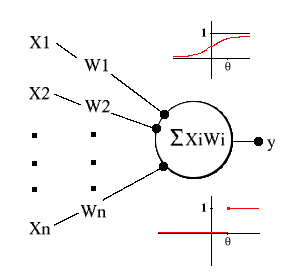
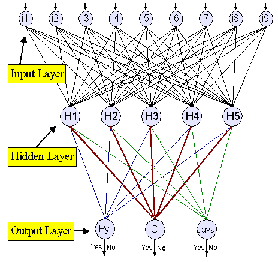

# 神经网络介绍
利用反向传播算法的模式学习

**标签:** IBM Power Systems,Linux,人工智能,机器学习

[原文链接](https://developer.ibm.com/zh/articles/l-neural/)

Andrew Blais, Ph.D, David Mertz, Ph.D.

发布: 2001-06-01

* * *

根据一个简化的统计，人脑由百亿条神经组成 ― 每条神经平均连结到其它几千条神经。通过这种连结方式，神经可以收发不同数量的能量。神经的一个非常重要的功能是它们对能量的接受并不是立即作出响应，而是将它们累加起来，当这个累加的总和达到某个临界阈值时，它们将它们自己的那部分能量发送给其它的神经。大脑通过调节这些连结的数目和强度进行学习。尽管这是个生物行为的简化描述。但同样可以充分有力地被看作是神经网络的模型。

## 阈值逻辑单元（Threshold Logic Unit，TLU）

理解神经网络的第一步是从对抽象生物神经开始，并把重点放在 _阈值逻辑单元（TLU）_ 这一特征上。一个 TLU 是一个对象，它可以输入一组加权系数的量，对它们进行求和，如果这个和达到或者超过了某个阈值，输出一个量。 让我们用符号标注这些功能，首先，有输入值以及它们的权系数：X1, X2, …, Xn和 W1, W2,…, Wn。接着是求和计算出的 Xi\*Wi，产生了激发层 a，换一种方法表示：

a = (X1 _W1)+(X2_ W2)+…+(Xi _Wi)+…+ (Xn_ Wn)

阈值称为 theta。最后，输出结果 y。当 a >=theta 时 y=1，反之 y=0。请注意输出可以是连续的，因为它也可以由一个 squash 函数 s（或 sigma）判定，该函数的自变量是 a，函数值在 0 和 1 之间，y=s(a)。

##### 图 1\. 阈值逻辑单元，带有 sigma 函数（顶部）和 cutoff 函数（底部）



TLU 会分类，假设一个 TLU 有两个输入值，它们的权系数等于 1，theta 值等于 1.5。当这个 TLU 输入 <0,0>、<0,1>、<1,0> 和 <1,1> 时，它的输出分别为 0、0、0、1。TLU 将这些输入分为两组：0 组和 1 组。就像懂得逻辑连接（布尔运算 AND）的人脑可以类似地将逻辑连接的句子分类那样，TLU 也懂得一点逻辑连接之类的东西。

TLU 能够用几何学上的解释来阐明这种现象。它的四种可能输入对应于笛卡尔图的四个点。从等式 X1 _W1\+ X2_ W2= theta，换句话说，也即 TLU 转换其分类行为的点开始，它的点都分布在曲线 X2= -X1\+ 1.5 上。这个方程的曲线将 4 个可能的输入分成了两个对应于 TLU 分类的区域。这是 TLU 原理中更为普通的实例。在 TLU 有任意数目的 N 个输入的情况下，一组可能的输入对应于 N 维空间中的一个点集。如果这些点可以被超平面 ― 换句话说，对应于上面示例中的线的 N 维的几何外形切割，那么就有一组权系数和一个阈值来定义其分类刚好与这个切割相匹配的 TLU。

## TLU 的学习原理

既然 TLU 懂得分类，它们就知道素材。神经网络也可假定为可以学习。它们的学习机制是模仿大脑调节神经连结的原理。TLU 通过改变它的权系数和阈值来学习。实际上，从数学的观点看，权系数阈值的特征有点武断。让我们回想一下当 SUM(Xi _Wi) >= theta 时 TLU 在临界点时输出的是 1 而不是 0，这相当于说临界点是出现在 SUM(Xi_ Wi)\+ (-1 _theta) >= 0 的时候。所以，我们可以把 -1 看成一个常量输入，它的权系数 theta 在学习（或者用技术术语，称为 培训 ）的过程中进行调整。这样，当 SUM(Xi_ Wi)\+ (-1 \* theta) >= 0 时，y=1，反之 y=0。

在培训过程中，神经网络输入：

1. 一系列需要分类的术语示例
2. 它们的正确分类或者目标

这样的输入可以看成一个向量：<x1, X2, …, Xn, theta, t>，这里 t 是一个目标或者正确分类。神经网络用这些来调整权系数，其目的使培训中的目标与其分类相匹配。更确切地说，这是有指导的培训，与之相反的是无指导的培训。前者是基于带目标的示例，而后者却只是建立在统计分析的基础上（请参阅本文随后的 参考资料 ）。权系数的调整有一个学习规则，一个理想化的学习算法如下所示：

##### 清单 1\. 理想化的学习算法

```
fully_trained = FALSE
DO UNTIL (fully_trained):
    fully_trained = TRUE
    FOR EACH training_vector = <X1, X2, ..., Xn, theta, target>::
                               # Weights compared to theta
        a = (X1 * W1)+(X2 * W2)+...+(Xn * Wn) - theta
        y = sigma(a)
        IF y != target:
            fully_trained = FALSE
        FOR EACH Wi:
        MODIFY_WEIGHT(Wi)      # According to the training rule
    IF (fully_trained):
        BREAK

```

Show moreShow more icon

您或许想知道，”哪些培训规则？”有很多，不过有一条似乎合理的规则是基于这样一种思想，即权系数和阈值的调整应该由分式 (t – y) 确定。这个规则通过引入 alpha (0 < alpha < 1) 完成。我们把 alpha 称为 _学习率_ 。Wi中的更改值等于 (alpha _(t – y)_ Xi)。当 alpha 趋向于 0 时，神经网络的权系数的调整变得保守一点；当 alpha 趋向于 1 时，权系数的调整变得激进。一个使用这个规则的神经网络称为 _感知器_ ，并且这个规则被称为 _感知器学习规则_ 。Rosenblatt 于 1962 年（请参阅 参考资料 ）下的结论是，如果 N 维空间的点集被超平面切割，那么感知器的培训算法的应用将会最终导致权系数的分配，从而定义了一个 TLU，它的超平面会进行需要的分割。当然，为了记起 Keynes，最终我们都切断了与外界的联系，专心思考。但是在计算时间之外，我们仍濒临危险，因为我们需要自己的神经网络对可能输入的空间进行不止一次的切割。

文章开始的难题举例说明了这个，假设给您 N 个字符的代码段，您知道是 C、C++、Java 或者 Python。难的是构造一个程序来标识编写这段代码的语言。用 TLU 来实现需要对可能的输入空间进行不止一次的分割。它需要把空间分成四个区域。每种语言一个区域。把神经网络培训成能实现两个切割就可完成这种工作。第一个切割将 C/C++ 和 Java/Python 分开来，另一个将 C/Java 和 C++/Python 分开。一个能够完成这些切割的网络同样可以识别源代码样本中的语言。但是这需要网络有不同结构，在描述这个不同之处之前，先来简单地看一下实践方面的考虑。

**图 2\. 初步的（不完整的）感知器学习模型**

[阈值逻辑单元（Threshold Logic Unit，TLU）](#阈值逻辑单元（threshold-logic-unit，tlu）)

考虑到排除取得 N 个字符代码所需的计算时间，统计从 ASCII 码的 32 到 127 的范围内可视 ASCII 码字符出现的频率，并在这个统计以及关于代码语言的目标信息的基础上培训神经网络。我们的方法是将字符统计限制到 C、C++、Java 和 Python 代码字符库中最常用的 20 个非字母数字字符。由于关注浮点运算的执行，我们打算用一种规格化因素将这 20 字符统计分开来，并以此培训我们的网络。显然，一个结构上的不同是我们的网络有 20 个输入节点，但这是很正常的，因为我们的描述已经暗示了这种可能性。一个更有意思的区别是出现了一对中间节点，N1 和 N2，以及输出节点数量从两个变成了四个（O1 到 O4）。

我们将培训 N1，这样当它一看到 C 或 C++，设置 y1=1，看到 Java 或 Python，它将设置 y1=0。同理培训 N2，当它一看到 C 或 Java，设置 y2=1，看到 C++ 或 Python，设置 y2=0。此外，N1 和 N2 将输出 1 或 0 给 Oi。现在如果 N1 看到 C 或 C++，而且 N2 看到 C 或者 Java，那么难题中的代码是 C。而如果 N1 看到 C 或 C++，N2 看到 C++ 或 Python，那么代码就是 C++。这个模式很显而易见。所以假设 Oi 已被培训并根据下面表格的情况输出 1 或 0。

##### 映射到输出（作为布尔函数）的中间节点

N1N2O1 (C)O2 (C++)O3 (Java)O4 (Python)000001010010100100111000

如果这样可行的话，我们的网络就可以从代码示例中识别出语言了。这个想法很好。但是在实践上却有些难以置信。不过这种解决方案预示了 C/C++ 和 Java/Python 输入被一个超平面切割了，同样 C/Java 和 C++/Python 输入被另一个切割。这是一个网络培训的解决方案，迂回地解决了这个输入空间的设想。

## 关于 delta 规则

另一种培训的规则叫做 delta 规则。感知器培训规则是基于这样一种思路 ― 权系数的调整是由目标和输出的差分方程表达式决定。而 _delta_ 规则是基于梯度降落这样一种思路。这个复杂的数学概念可以举个简单的例子来表示。从给定的几点来看，向南的那条路径比向东那条更陡些。向东就像从悬崖上掉下来，但是向南就是沿着一个略微倾斜的斜坡下来，向西像登一座陡峭的山，而北边则到了平地，只要慢慢的闲逛就可以了。所以您要寻找的是到达平地的所有路径中将陡峭的总和减少到最小的路径。在权系数的调整中，神经网络将会找到一种将误差减少到最小的权系数的分配方式。

将我们的网络限制为没有隐藏节点，但是可能会有不止一个的输出节点，设 p 是一组培训中的一个元素，t(p,n) 是相应的输出节点 n 的目标。但是，设 y(p,n) 由以上提到的 squash 函数 s 决定，这里 a(p,n) 是与 p 相关的 n 的激活函数，或者用 (p,n) = s( a(p,n) ) 表示为与 p 相关的节点 n 的 squash 过的激活函数。为网络设定权系数（每个 Wi），也为每个 p 和 n 建立 t(p,n) 与 y(p,n) 的差分，这就意味着为每个 p 设定了网络全部的误差。因此对于每组权系数来说有一个平均误差。但是 delta 规则取决于求平均值方法的精确度以及误差。我们先不讨论细节问题，只是说一些与某些 p 和 n 相关的误差：?\* square( t(p,n) – y(p,n) )（请参阅 参考资料 ）。现在，对于每个 Wi，平均误差定义如下：

##### 清单 2\. 查找平均误差

```
sum = 0
FOR p = 1 TO M:         # M is number of training vectors
    FOR n = 1 TO N:     # N is number of output nodes
        sum = sum + (1/2 * (t(p,n)-y(p,n))^2)
average = 1/M * sum

```

Show moreShow more icon

delta 规则就是依据这个误差的定义来定义的。因为误差是依据那些培训向量来说明的，delta 规则是一种获取一个特殊的权系数集以及一个特殊的向量的算法。而改变权系数将会使神经网络的误差最小化。我们不需要讨论支持这个算法的微积分学，只要认为任何 Wi 发生的变化都是如下所示就够了：

```
alpha * s'(a(p,n)) * (t(p,n) - y(p,n)) * X(p,i,n).

```

Show moreShow more icon

X(p,i,n) 是输入到节点 n 的 p 中的第 i 个元素，alpha 是已知的学习率。最后 s'( a(p,n) ) 是与 p 相关的第 n 个节点激活的 squashing 函数的变化（派生）率，这就是 delta 规则，并且 Widrow 和 Stearns （请参阅 参考资料 ）向我们展示了当 alpha 非常小的时候，权系数向量接近某个将误差最小化的向量。用于权系数调节的基于 delta 规则的算法就是如此。

##### 梯度降落（直到误差小到适当的程度为止）

```
step 1: for each training vector, p, find a(p)
step 2: for each i, change Wi by:
            alpha * s'(a(p,n)) * (t(p,n)-y(p,n)) * X(p,i,n)

```

Show moreShow more icon

这里有一些与感知器算法相区别的重要不同点。显然，在权系数调整的公式下有着完全不同的分析。delta 规则算法总是在权系数上调整，而且这是建立在相对输出的激活方式上。最后，这不一定适用于存在隐藏节点的网络。

## 反向传播

_反向传播_ 这一算法把支持 delta 规则的分析扩展到了带有隐藏节点的神经网络。为了理解这个问题，设想 Bob 给 Alice 讲了一个故事，然后 Alice 又讲给了 Ted，Ted 检查了这个事实真相，发现这个故事是错误的。现在 Ted 需要找出哪些错误是 Bob 造成的而哪些又归咎于 Alice。当输出节点从隐藏节点获得输入，网络发现出现了误差，权系数的调整需要一个算法来找出整个误差是由多少不同的节点造成的，网络需要问，”是谁让我误入歧途？到怎样的程度？如何弥补？”这时，网络该怎么做呢？

##### 图 3\. “代码识别”反向传播的神经网络



反向传播算法同样来源于梯度降落原理，在权系数调整分析中的唯一不同是涉及到 t(p,n) 与 y(p,n) 的差分。通常来说 Wi的改变在于：

```
alpha * s'(a(p,n)) * d(n) * X(p,i,n)

```

Show moreShow more icon

其中 d(n) 是隐藏节点 n 的函数，让我们来看（1）n 对任何给出的输出节点有多大影响；（2）输出节点本身对网络整体的误差有多少影响。一方面，n 影响一个输出节点越多，n 造成网络整体的误差也越多。另一方面，如果输出节点影响网络整体的误差越少，n 对输出节点的影响也相应减少。这里 d(j) 是对网络的整体误差的基值，W(n,j) 是 n 对 j 造成的影响，d(j) \* W(n,j) 是这两种影响的总和。但是 n 几乎总是影响多个输出节点，也许会影响每一个输出结点，这样，d(n) 可以表示为：

```
SUM(d(j)*W(n,j))

```

Show moreShow more icon

这里 j 是一个从 n 获得输入的输出节点，联系起来，我们就得到了一个培训规则，第 1 部分：在隐藏节点 n 和输出节点 j 之间权系数改变，如下所示：

```
alpha * s'(a(p,n))*(t(p,n) - y(p,n)) * X(p,n,j)

```

Show moreShow more icon

第 2 部分：在输入节点 i 和输出节点 n 之间权系数改变，如下所示：

```
alpha * s'(a(p,n)) * sum(d(j) * W(n,j)) * X(p,i,n)

```

Show moreShow more icon

这里每个从 n 接收输入的输出节点 j 都不同。关于反向传播算法的基本情况大致如此。

将 Wi 初始化为小的随机值。

### 使误差小到适当的程度要遵循的步骤

通常把第 1 步到第 3 步称为 _正向传播_ ，把第 4 步到第 7 步称为 _反向传播_ 。反向传播的名字由此而来。

## 识别成功

在掌握了反向传播算法后，可以来看我们的识别源代码样本语言的难题。为了解决这个问题，我们提供了 Neil Schemenauer 的 Python 模型 _bpnn_ （请参阅 参考资料 ）。用它的模型解决问题真是难以置信的简单，在我们的类 `NN2` 里定制了一个类 `NN` ，不过我们的改变只是调整了表达方式和整个过程的输出，并没有涉及到算法。基本的代码如下所示：

##### 清单 3\. 用 bpnn.py 建立一个神经网络

```
# Create the network (number of input, hidden, and training nodes)
net = NN2(INPUTS, HIDDEN, OUTPUTS)
        # create the training and testing data
trainpat = []
testpat = []
for n in xrange(TRAINSIZE+TESTSIZE):

        #... add vectors to each set
# train it with some patterns
net.train(trainpat, iterations=ITERATIONS, N=LEARNRATE, M=MOMENTUM)
        # test it
net.test(testpat)
        # report trained weights
net.weights()

```

Show moreShow more icon

当然我们需要输入数据，实用程序 code2data.py 提供了这个功能。它的界面很直观：只要将一堆扩展名各不相同的文件放到一个子目录 ./code 中，然后运行这个实用程序，并列举那些扩展名作为命令选项。例如：

```
python code2data.py py c java

```

Show moreShow more icon

您得到的是一堆 STDOUT 上的向量，可以把这些向量输入到另一个进程或者重定向到一个文件，它的输出如下所示：

##### 清单 4\. Code2Data 的输出向量

```
0.15 0.01 0.01 0.04 0.07 0.00 0.00 0.03 0.01 0.00 0.00 0.00 0.05 0.00 > 1 0 0
0.14 0.00 0.00 0.05 0.13 0.00 0.00 0.00 0.02 0.00 0.00 0.00 0.13 0.00 > 1 0 0
[...]

```

Show moreShow more icon

让我们回忆一下输入值都是不同特殊字符出现的规格化数目，目标值（在大于号以后）是 YES/NO，它代表包含这些字符的源代码文件的类型，不过对于什么是什么来说，并没有非常明显的东西。数字可以是输入或期望的 _任意值_ ，这才是最重要的。

下一步是运行实际的 code\_recognizer.py 程序。这需要（在 STDIN 中）像上面一样的向量集。这个程序有一个包，它能够根据实际文件推断出需要多少输入节点（计算在内的和期望的），选择隐藏节点的数目是一个诀窍。对于源代码的识别，6 到 8 个隐藏节点似乎工作得很好。如果打算试验网络从而发现对于这些不同的选项它是如何做的，您可以覆盖命令行中的所有参数，但每一次运行还是会耗费一些时间。值得注意的是， code\_recognizer.py 将它的（大的）测试结果文件发送到 STDOUT，而将一些友好的消息放在 STDERR 里。这样在大部分时间里，为了安全保管，您将会把 STDOUT 定向到一个文件，并监视针对进程和结果概要的 STDERR。

##### 清单 5\. 运行 code\_recognizer.py

```
> code2data.py py c java | code_recognizer.py > test_results.txt
Total bytes of py-source: 457729
Total bytes of c-source: 245197
Total bytes of java-source: 709858
Input set: ) ( _. = ; " , ' * / { } : - 0 + 1 [ ]
HIDDEN = 8
LEARNRATE = 0.5
ITERATIONS = 1000
TRAINSIZE = 500
OUTPUTS = 3
MOMENTUM = 0.1
ERROR_CUTOFF = 0.01
TESTSIZE = 500
INPUTS = 20
error -> 95.519... 23.696... 19.727... 14.012... 11.058... 9.652...
8.858... 8.236... 7.637... 7.065... 6.398... 5.413... 4.508...
3.860... 3.523... 3.258... 3.026... 2.818... 2.631... 2.463...
2.313... 2.180... 2.065... 1.965... 1.877... 1.798... 1.725...
[...]
0.113... 0.110... 0.108... 0.106... 0.104... 0.102... 0.100...
0.098... 0.096... 0.094... 0.093... 0.091... 0.089... 0.088...
0.086... 0.085... 0.084...
Success rate against test data: 92.60%

```

Show moreShow more icon

不断减少误差是个很好的兆头，这至少在一段长时间里所获得的一种进步，且最后的结果必然是深入人心的。就我们的观点而言，网络完成了一项值得尊敬的工作，来识别代码 ― 我们将会乐意倾听，对于您的数字向量它是如何做的。

## 结束语

本文从某种程度上阐述了神经网络的基础，使您能够开始在您自己的编码过程中应用它们。我们鼓励您运用在这里学到的东西，并尝试编写您自己的对于这个难题的解决方案。

本文翻译自： [An introduction to neural networks](https://developer.ibm.com/articles/l-neural/)（2001-06-01）

## 相关主题

- [Neural Net FAQ](ftp://ftp.sas.com/pub/neural/FAQ.html)