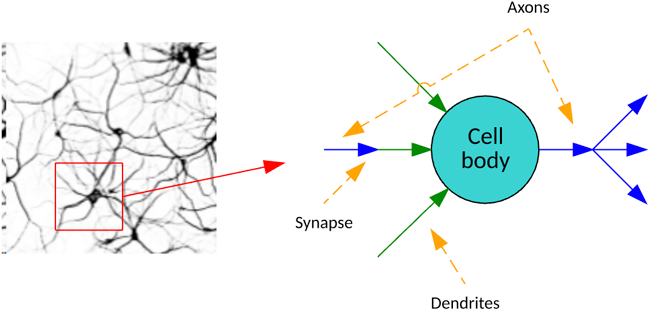
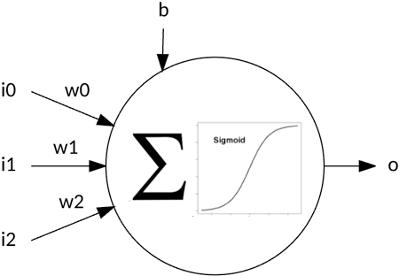
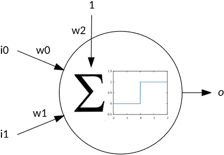
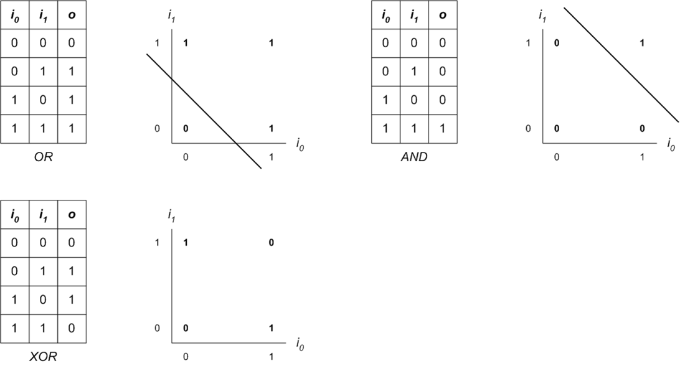
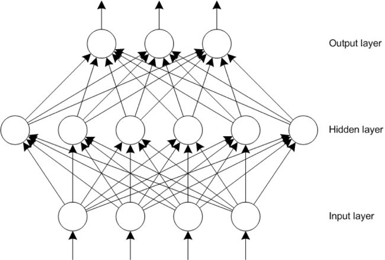

# 神经网络深入剖析
神经网络及其编程介绍

**标签:** 人工智能

[原文链接](https://developer.ibm.com/zh/articles/cc-cognitive-neural-networks-deep-dive/)

M. Tim Jones

发布: 2017-10-11

* * *

神经网络已存在 70 多年，但深度学习的引入提升了图像识别甚至学习非结构化数据（比如文档或多媒体）中的模式的能力。深度学习基于感知器的基础概念和各种学习方法（比如反向传播）。本教程详细介绍了单层感知器和多层网络以及感知器示例，并采用了反向传播算法作学习方法，为您提供更深入的体会。

神经网络是受生物学大脑结构启发的机器学习计算模型。神经网络通过使用示例而不是显式编程进行训练。即使只有有限的示例，神经网络也能推断和成功处理未看见的示例。

最初的神经网络只是简单的单层感知器，但它们现在表示为一组多样化的架构，这些架构包含多个层甚至循环连接来实现反馈。我们首先看看神经网络的生物学灵感来源。

## 生物学灵感

神经网络代表着一种受人类大脑启发的信息处理范例。在大脑中，神经元将轴突和树突紧密连接，并通过突触在它们之间传递化学信号。据估计，人类大脑拥有 1000 亿个神经元，每个神经元最多与 10,000 个其他神经元相连。



人工神经网络通过权重和激活神经元的激活函数（比如 sigmoid）来传输信号（数字）。通过采用某种训练算法，这些网络调整这些权重来解决一个给定问题。下图演示了一个有 3 个输入的感知器：每个输入的权重、输入偏差和输出。输出是根据对输入和权重的乘积求和计算出来的，该计算包含通过激活函数传递的偏差。在进一步介绍反向传播之前，我先以一个无足轻重的感知器作为第一个示例。



如今的神经网络可以是松散连接、完全连接、循环（包括圆形）及各种其他架构。我们快速回顾一下神经网络的发展历史。

## 神经网络的发展历史

在 20 世纪 40 年代早期，McCulloch 和 Pitts 为神经网络创建了一个计算模型，将研究方向不仅延伸到了大脑，还将其应用延伸到了人工智能（AI；参见下图）领域。在 40 年代后期，Donald Hebb 创建了 _赫布学习方法_ ，他从生物学观察到，如果两个神经元同时激活，则它们之间的突触就会得到强化。


1958 年，Frank Rosenblatt 创建了感知器，这是一种可用来将数据分为两组的简单神经模型。但是，由于无法正确地对异或运算进行分类，此模型的发展受阻。Marvin Minsky 和 Seymour Papert 于 1969 年在他们的著作 _感知器_ 中利用了这一限制，尝试重新关注 AI 的符号方法。结果导致连接主义者的研究基金连续 10 年下降。

1975 年，Paul Werbos 创建了能成功训练多层感知器的反向传播算法，引入了多层神经网络的各种新应用。这一创新使得神经网络研究东山再起，并进一步推动了这种解决实际问题的方法的普及。

自引入反向传播以来，神经网络不断发展，成为了机器学习中的关键算法。最近数十年，随着图形处理单元 (GPU) 和分布式处理的引入，通过将神经网络的训练和执行转交给加速计集群，训练大型神经网络成为可能。深度学习架构（卷积神经网络和长短期记忆 [LSTM]）应运而生，这些架构显著扩展了神经网络的应用和它们解决的问题。

## 感知器

感知器是简单神经网络的一个例子，可使用它通过监督式学习来实现分类。监督式学习意味着使用示例训练网络，然后根据实际输出与期望输出的偏差来调整权重。

Frank Rosenblatt 创建了第一个感知器，并在 IBM® 704 计算机上首次进行模拟，随后将该感知器实现为定制硬件（称为 Mark 1 Perceptron），其中包含由 400 个光电池组成的用于视觉应用的阵列。这些光电池随机连接到神经元，权重被实现为电位计（可变电阻器），可在学习过程中通过连接的马达来调整电位计。

下图显示了一个简单的感知器，其中包含两个输入（及相关权重）和一个偏差权重。感知器的运行方式是，对输入与相关权重的乘积求和，然后通过一个激活函数应用该结果。在这个示例中，激活函数是一个阶梯函数，也就是说，如果输出大于或等于 1，那么输出将为 1（否则输出为 0）。



这个简单感知器可用来解决线性可分问题，如下图所示。在此图中，一条线将两个类分开（一个逻辑 `OR` 运算的结果），这条线可实现为一条直线（或决策边界）。该决策边界是输入和偏差的一个权重函数。`OR` 和 `AND` 问题都是线性可分的，但 `XOR` 不是（因为 1 `XOR` 1 等于 0，且不可分）。



对感知器能解决的问题有所了解后，让我们看看如何通过监督式学习”训练”感知器。

## 感知器学习

像其他许多监督式学习算法一样，感知器学习也遵循一种简单流程，但在调整网络的方式上有所不同。让我们来看一个普通示例，然后详细分析感知器学习。

下图演示了这个普通的监督式学习流程。首先初始化我的网络（拓扑结构没有固定的初始权重）。然后我对网络应用了一个训练矢量来进行迭代，基于它的误差（实际输出与期望输出之间的误差）来调整神经网络的权重，以便将来能对此输入进行正确分类。然后实现一个停止条件（未找到更多误差，或者基于一定数量的训练迭代）。完成此过程后，使用未见过的训练示例验证网络（看看如何将它推广到未见过的输入上），然后将网络部署到它的目标应用中。


感知器学习遵循这个普通流程。将我的网络的权重初始化为一组随机值。然后迭代我的训练集，直到不再看到误差。应用训练矢量意味着向网络应用训练矢量并执行网络（前馈该训练矢量来获得输出值）。从期望输出减去此输出（称为误差）。以较小的学习率使用此误差，根据输入的贡献来调整权重。换句话说，通过将误差乘以（与给定权重关联的）输入，再乘以一个小学习率来调整权重。此过程持续到不再出现误差。

## 感知器示例

让我们看看此算法在应用于逻辑 `OR` 运算时的实现。可以从 [GitHub](https://github.com/mtimjones/perceptron) 下载并试验此实现。

在下面的代码清单中，可以看到变量定义。其中定义了输入矢量的大小 (`ISIZE`)、权重矢量的大小（`ISIZE+1` 等于偏差权重）、我的小学习率、最大迭代次数，以及输入和权重矢量的类型。

```
#define ISIZE 2
#define WSIZE ( ISIZE + 1 ) // weights + bias
#define LEARNING_RATE  0.1
#define ITERATIONS     10

typedef int ivector[ ISIZE ];
typedef float wvector[ WSIZE ];
wvector weights;

```

Show moreShow more icon

下一个代码清单提供了我的网络初始化代码。在此函数中，我为随机数生成器提供种子，然后将权重矢量中的每个权重初始化为 0 和 1 之间的一个随机浮点数。

```
void initialize( void )
{
// Seed the random number generator
srand( time( NULL ) );

// Initialize the weights with random values
for ( int i = 0 ; i </ WSIZE ; i++ )
{
      weights[ i ] = ( ( float ) rand( ) / ( float ) RAND_MAX );
}
}

```

Show moreShow more icon

下面的代码示例演示了该网络的执行。向 `feedforward` 函数传递训练矢量，然后使用该矢量计算神经元的输出（根据图 [简单感知器](#感知器) 提供的等式）。最后，应用阶梯激活函数并返回结果。

```
int feedforward( ivector inputs )
{
int i;
float sum = 0.0;

// Calculate inputs * weights
for ( i = 0 ; i < ISIZE ; i++ )
{
      sum += weights[ i ] * ( float ) inputs[ i ];
}

// Add in the bias
sum += weights[ i ];

// Activation function (1 if value >= 1.0).
return ( sum >= 1.0 ) ? 1 : 0;
}

```

Show moreShow more icon

最后的函数是 `train`，如下面的代码清单所示。在此函数中，迭代训练集，将测试模式应用于网络（通 `feedforward`），然后根据结果输出来计算误差。鉴于误差，根据学习率和输入的贡献来逐一调整 3 个权重。如果未继续找到误差（或超出最大迭代次数），此过程就会停止。

```
void train( void )
{
int iterations = 0;
int iteration_error = 0;
int desired_output, output, error;

// Train the boolean OR set
ivector test[4] = { { 0, 0 }, { 0, 1 }, { 1, 0 }, { 1, 1 } };

do
{
      iteration_error = 0.0;

      for ( int i = 0 ; i < ( sizeof( test ) / sizeof( ivector ) ) ; i++ )
      {
         desired_output = test[ i ][ 0 ] || test[ i ][ 1 ];
         output = feedforward( test[ i ] );

         error = desired_output - output;

         weights[ 0 ] += ( LEARNING_RATE *
                           ( ( float ) error * ( float )test[ i ][ 0 ] ) );
         weights[ 1 ] += ( LEARNING_RATE *
                           ( ( float ) error * ( float )test[ i ][ 1 ] ) );
         weights[ 2 ] += ( LEARNING_RATE * ( float ) error );

         iteration_error += ( error * error );
      }

} while ( ( iteration_error > 0.0 ) && ( iterations++ < ITERATIONS ) );

return;
}

```

Show moreShow more icon

最后，在下面的代码中，可以看到这个简单示例的样本输出。在这个示例中，该训练需要 3 次迭代来学习 `OR` 运算（括号中的值是期望输出）。最终的权重也已给出，包括偏差。

```
$ ./perceptron
Iteration 0
0 or 0 = 0 (0)
0 or 1 = 0 (1)
1 or 0 = 0 (1)
1 or 1 = 0 (1)
Iteration error 3

Iteration 1
0 or 0 = 0 (0)
0 or 1 = 0 (1)
1 or 0 = 0 (1)
1 or 1 = 1 (1)
Iteration error 2

Iteration 2
0 or 0 = 0 (0)
0 or 1 = 1 (1)
1 or 0 = 1 (1)
1 or 1 = 1 (1)
Iteration error 0

Final weights 0.374629 0.417000 bias 0.700291

```

Show moreShow more icon

通过大约 65 行 `代码`，就可以实现感知器学习。请访问 [GitHub](https://github.com/mtimjones/perceptron) 网站获取完整源代码。

## 多层网络

添加神经元层增加了可应用于神经网络的问题的复杂性。如今，深度学习中也应用了相同的原理，添加了更多层（深度）并引入了一些新想法来解决越来越复杂和多变的问题（参见下图，查看一个包含输入层、隐藏层和输出层的示例网络）。



隐藏层很重要，因为它们能从输入层中提取特征。但是，隐藏层（和每层中的神经元）数量与所关注问题有函数关系。如果一个网络在隐藏层中包含太多神经元，它可能过拟合并只记住输入模式，这限制了网络的推断能力。如果隐藏层中的神经元太少，可能导致网络无法表示输入空间特征，同样会限制网络的推断能力。一般而言，网络越小（神经元和权重越少）越好。

执行多层网络的过程类似于感知器模型。输入通过权重传播到隐藏层中，隐藏层输出通过权重传播到输出层中。输出可以表示多个特征，或者像下一节中将演示的，表示一个胜者全得式系统（其中最大的输出神经元是胜者）中的一个特征。

## 反向传播

反向传播算法拥有悠久的历史。它于 20 世纪 70 年代引入，但直到 20 世纪 80 年代人们才认识到其潜力。30 多年后，反向传播算法仍然是一种流行的神经网络训练技术。反向传播之所以如此重要，是因为它既快速又高效。反向传播的名称来自于它的流程：在网络中反向传播误差。

反向传播遵循的训练流程与”感知器学习”部分所示的流程类似。将一个输入矢量应用于网络，并从输入层正向传播到隐藏层，然后再传播到输出层。然后使用网络中每个输出神经元的期望输出和实际输出计算出一个误差值。通过网络的权重，将误差值从输出神经元反向传播到隐藏层，再传播到输入层（作为误差贡献的函数）。

此过程对网络的组织使得隐藏层能够识别输入空间中的特征。输出层使用隐藏层特征得出一个解。在示例实现中会看到，反向传播算法需要耗费大量的现代计算，但 GPU 使得在基于 GPU 的系统集群内（能够执行难以置信的任务，比如物体识别）构建大规模网络成为可能。

## 反向传播示例

现在，让我们来看看反向传播的一种简单实现。在此示例中，我使用 Fisher 的鸢尾花数据集来训练一个简单网络。此数据集包含 4 个度量指标，表示 3 种鸢尾花（山鸢尾、维吉尼亚鸢尾和杂色鸢尾）中的花瓣和花萼的长度与宽度。我们的目标是训练网络，使它能够根据 4 个度量特征成功对一种鸢尾花进行分类。可以从 [GitHub](https://github.com/mtimjones/backprop) 下载并亲自试用此代码。

下面的代码清单给出了我的变量定义。我将各层的大小定义为：输入层定义 4 个特征，隐藏层包含 25 个神经元，输出层表示 3 种鸢尾花的一种胜者全得式表示。这 3 层定义每个神经元（`inputs`、`hidden` 和 `outputs`）的值，权重由两个包含偏差的多维层表示。还提供了一个较小的学习率。

```
#define INP_NEURONS    4
#define HID_NEURONS   25
#define OUT_NEURONS    3

#define LEARNING_RATE 0.05

// Neuron cell values
double inputs[ INP_NEURONS+1 ];
double hidden[ HID_NEURONS+1 ];
double outputs[ OUT_NEURONS ];

// Weight values
double weights_hidden_input[ HID_NEURONS ][ INP_NEURONS+1 ];
double weights_output_hidden[ OUT_NEURONS ][ HID_NEURONS+1 ];

```

Show moreShow more icon

在下一个代码示例中，可以看到我的训练数据集的表示，它包含（4 个特征的）各个训练样本及其种类分类（3 个输出节点中的 1 个输出节点）。整个数据集包含 150 个样本，所以我在这里提供了一个删减版本。

```
// Test dataset with desired outputs (in a winner-takes-all fashion).
typedef struct dataset_s
{
double inputs[ INP_NEURONS  ];
double output[ OUT_NEURONS ];
} dataset_t;

dataset_t dataset[ ] = {
// Sepal Length, Sepal Width, Petal Length, Petal Width
                          // Iris-setosa
{ { 5.1, 3.5, 1.4, 0.2 }, { 1.0, 0.0, 0.0 } },
{ { 4.9, 3.0, 1.4, 0.2 }, { 1.0, 0.0, 0.0 } },
...
                          // Iris-versicolor
{ { 7.0, 3.2, 4.7, 1.4 }, { 0.0, 1.0, 0.0 } },
{ { 6.4, 3.2, 4.5, 1.5 }, { 0.0, 1.0, 0.0 } },
...
                         // Iris-virginica
{ { 6.3, 3.3, 6.0, 2.5 }, { 0.0, 0.0, 1.0 } },
{ { 5.8, 2.7, 5.1, 1.9 }, { 0.0, 0.0, 1.0 } },
...

```

Show moreShow more icon

下面的代码清单中提供了执行网络的代码。可以将此清单拆分为 3 个部分。第一部分接受输入神经元，并计算隐藏层神经元的输出。下一节接受隐藏神经元，并计算输出层神经元的输出。这是在网络中前馈输入的完整过程（每层使用一个 sigmoidal 激活函数）。计算输出后，对输出神经元执行迭代，然后以胜者全得的方式选择最大值。然后返回这个输出神经元作为解。

```
// Given the test input, feed forward to the output.
int NN_Feed_Forward( void )
{
int i, j, best;
double max;

// Calculate hidden layer outputs
for ( i = 0 ; i < HID_NEURONS ; i++ )
{
      hidden[ i ] = 0.0;

      for ( j = 0 ; j < INP_NEURONS+1; j++ )
      {
         hidden[ i ] +=
            ( weights_hidden_input[ i ][ j ] * inputs[ j ] );
      }
      hidden[ i ] = sigmoid( hidden[ i ] );
}

// Calculate output layer outputs
for ( i = 0 ; i < OUT_NEURONS ; i++ )
{
      outputs[ i ] = 0.0;
      for ( j = 0 ; j < HID_NEURONS+1 ; j++ )
      {
         outputs[ i ] +=
            ( weights_output_hidden[ i ][ j ] * hidden[ j ] );
      }
      outputs[ i ] = sigmoid( outputs[ i ] );
}

// Perform winner-takes-all for the network.
best = 0;
max = outputs[ 0 ];

for ( i = 1 ; i < OUT_NEURONS ; i++ )
{
      if ( outputs[ i ] > max )
      {
         best = i;
         max = outputs[ i ];
      }
}

return best;
}

```

Show moreShow more icon

使用反向传播实现学习，如下面的代码示例所示。这分 4 部分来实现。首先，计算输出节点的误差。每个节点都是基于其（与期望输出的）误差和 sigmoid 函数的导数来独立计算的。然后基于对输出误差的贡献来计算隐藏层神经元的误差。最后两部分将这些误差应用于输出和隐藏层，采用一个能最小化整体变化并允许在一定数量的迭代中调整的学习率。

此过程实现了梯度下降搜索，因为神经元输出中的误差已最小化（该梯度显示了误差的最大增长率，所以我朝梯度的相反方向移动）。

```
// Given a classification, backpropagate the error through the weights.
void NN_Backpropagate( int test )
{
int out, hid, inp;

double err_out[ OUT_NEURONS ];
double err_hid[ HID_NEURONS ];

// Calculate output node error
for ( out = 0 ; out < OUT_NEURONS ; out++ )
{
      err_out[ out ] =
         ( ( double ) dataset[ test ].output[ out ] - outputs[ out ] ) *
            sigmoid_d( outputs[ out ] );
}

// Calculate the hidden node error
for ( hid = 0 ; hid < HID_NEURONS ; hid++ )
{
      err_hid[ hid ] = 0.0;
      for ( out = 0 ; out < OUT_NEURONS ; out++ )
      {
         err_hid[ hid ] +=
            err_out[ out ] * weights_output_hidden[ out ][ hid ];
      }
      err_hid[ hid ] *= sigmoid_d( hidden[ hid ] );
}

// Adjust the hidden to output layer weights
for ( out = 0 ; out < OUT_NEURONS ; out++ )
{
      for ( hid = 0 ; hid < HID_NEURONS ; hid++ )
      {
         weights_output_hidden[ out ][ hid ] +=
            LEARNING_RATE * err_out[ out ] * hidden[ hid ];
      }
}

// Adjust the input to hidden layer weights
for ( hid = 0 ; hid < HID_NEURONS ; hid++ )
{
      for ( inp = 0 ; inp < INP_NEURONS+1 ; inp++ )
      {
         weights_hidden_input[ hid ][ inp ] +=
            LEARNING_RATE * err_hid[ hid ] * inputs[ inp ];
      }
}
}

```

Show moreShow more icon

在这个实现的最后一部分中，可以看到整个训练流程。我使用一定数量的迭代作为我的停止函数，并将一个随机测试案例应用于网络，然后检查误差并通过网络的权重来反向传播误差。

```
// Train the network from the test vectors.
void NN_Train( int iterations )
{
int test;

for ( int i = 0 ; i < iterations ; i++ )
{
      test = getRand( MAX_TESTS );

      NN_Set_Inputs( test );

      (void)NN_Feed_Forward( );

      NN_Backpropagate( test );
}

return;
}

```

Show moreShow more icon

在下面的样本输出中，可以看到反向传播演示的结果。训练网络时，它接受该数据集的一个随机样本并针对它们来测试网络。下面给出了这 10 个测试样本，它们都已成功分类（输出是输出神经元索引），括号中显示的值是期望输出神经元（第一个的索引为 0，第二个的索引为 1，依此类推）。

```
$ ./backprop
Test 9 classifed as 0 (1 0 0)
Test 133 classifed as 2 (0 0 1)
Test 78 classifed as 1 (0 1 0)
Test 129 classifed as 2 (0 0 1)
Test 1 classifed as 0 (1 0 0)
Test 59 classifed as 1 (0 1 0)
Test 31 classifed as 0 (1 0 0)
Test 87 classifed as 1 (0 1 0)
Test 122 classifed as 2 (0 0 1)
Test 138 classifed as 2 (0 0 1)

```

Show moreShow more icon

## 结束语

神经网络是当今机器学习领域的主导力量。在由于无法满足创建者的不合理期望而衰落后，神经网络如今正给深度学习和此领域的新方法（比如沿时间反向传播和 LSTM）带来巨大发展动力。从 20 世纪 40 和 50 年代的简单模型（感知器）到 20 世纪 70 和 80 年代的突破性发展（反向传播），这些尝试模仿大脑结构的简单模型正在推动 AI 领域的新应用和创新。

本文翻译自： [A neural networks deep dive](https://developer.ibm.com/articles/cc-cognitive-neural-networks-deep-dive/)（2017-07-24）