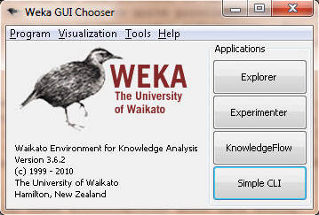
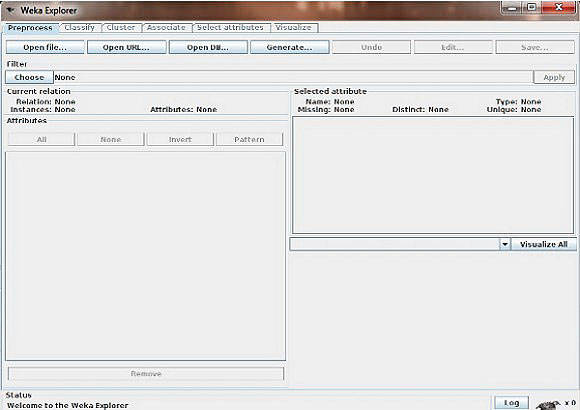
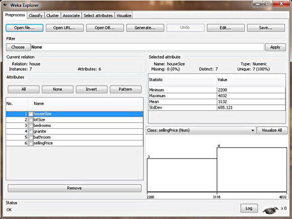
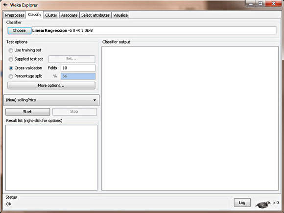
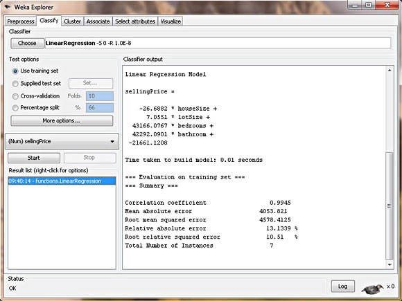

# 简介和回归
用 WEKA 进行数据挖掘，第 1 部分

**标签:** 分析

[原文链接](https://developer.ibm.com/zh/articles/os-weka1/)

Michael Abernethy

发布: 2010-05-17

* * *

## 简介

什么是 _数据挖掘_ ？您会不时地问自己这个问题，因为这个主题越来越得到技术界的关注。您可能听说过像 Google 和 Yahoo! 这样的公司都在生成有关其所有用户的数十亿的数据点，您不禁疑惑，”它们要所有这些信息干什么？”您可能还会惊奇地发现 Walmart 是最为先进的进行数据挖掘并将结果应用于业务的公司之一。现在世界上几乎所有的公司都在使用数据挖掘，并且目前尚未使用数据挖掘的公司在不久的将来就会发现自己处于极大的劣势。

那么，您如何能让您和您的公司跟上数据挖掘的大潮呢？

我们希望能够回答您所有关于数据挖掘的初级问题。我们也希望将一种免费的开源软件 Waikato Environment for Knowledge Analysis (WEKA) 介绍给您，您可以使用该软件来挖掘数据并将您对您用户、客户和业务的认知转变为有用的信息以提高收入。您会发现要想出色地完成挖掘数据的任务并不像您想象地那么困难。

此外，本文还会介绍数据挖掘的第一种技术： _回归_ ，意思是根据现有的数据预测未来数据的值。 它可能是挖掘数据最为简单的一种方式，您甚至以前曾经用您喜爱的某个流行的电子数据表软件进行过这种初级的数据挖掘（虽然 WEKA 可以做更为复杂的计算）。本系列后续的文章将会涉及挖掘数据的其他方法，包括群集、最近的邻居以及分类树。（如果您还不太知道这些术语是何意思，没关系。我们将在这个系列一一介绍。）

## 什么是数据挖掘？

数据挖掘，就其核心而言，是指将大量数据转变为有实际意义的模式和规则。并且，它还可以分为两种类型：直接的和间接的。在 _直接的_ 数据挖掘中，您会尝试预测一个特定的数据点 — 比如，以给定的一个房子的售价来预测邻近地区内的其他房子的售价。

在 _间接的_ 数据挖掘中，您会尝试创建数据组或找到现有数据内的模式 — 比如，创建 “中产阶级妇女”的人群。实际上，每次的美国人口统计都是在进行数据挖掘，政府想要收集每个国民的数据并将它转变为有用信息。

现代的数据挖掘开始于 20 世纪 90 年代，那时候计算的强大以及计算和存储的成本均到达了一种很高的程度，各公司开始可以自己进行计算和存储，而无需再借助外界的计算帮助。

此外，术语数据挖掘是全方位的，可指代诸多查看和转换数据的技术和过程。因为本系列只触及能用数据挖掘实现的功能的一些皮毛。数据挖掘的专家往往是数据统计方面的博士，并在此领域有 10-30 年的研究经验。这会为您留下一种印象，即只有大公司才能负担得起数据挖掘。

我们希望能够清除有关数据挖掘的这些误解并希望弄清楚一点：数据挖掘既不像对一系列数据运行一个电子数据表函数那么简单，也不像有人想的那样难到靠自己根本无法实现。这是 80/20 范型的一个很好的例子 — 甚至更进一步可以是 90/10 范型。您用所谓的数据挖掘专家的 10% 的专业知识就能创建具有 90% 效力的数据挖掘模型。而为了补上模型剩下的 10% 的效力并创建一个完美的模型将需要 90% 额外的时间，甚至长达 20 年。所以除非您立志以数据挖掘为职业方向，否则”足够好”就可以了。从另一个方面看，利用数据挖掘所达到的”足够好”总要比您现在所采用的其他技术要好。

数据挖掘的最终目标就是要创建一个模型，这个模型可改进您解读现有数据和将来数据的方式。由于现在已经有很多数据挖掘技术，因此创建一个好的模型的最主要的步骤是决定要使用哪种技术。而这则极大地依赖于实践和经验以及有效的指导。这之后，需要对模型进行优化以让它更令人满意。在阅读了本系列的文章后 ，您应该能够自己根据自己的数据集正确决定要使用的技术，然后采取必要的步骤对它进行优化。您将能够为您自己的数据创建一个足够好的模型 。

## WEKA

数据挖掘绝非大公司的专有，也不是多昂贵的软件。实际上，有一种软件可以实现那些价格不菲的软件所能实现的全部功能 — 这个软件就是 WEKA（参见 参考资料 ）。WEKA 诞生于 University of Waikato（新西兰）并在 1997 年首次以其现代的格式实现。它使用了 GNU General Public License (GPL)。该软件以 Java™ 语言编写并包含了一个 GUI 来与数据文件交互并生成可视结果（比如表和曲线）。它还有一个通用 API，所以您可以像嵌入其他的库一样将 WEKA 嵌入到您自己的应用程序以完成诸如服务器端自动数据挖掘这样的任务。

我们继续并安装 WEKA。因为它基于 Java，所以如果您在计算机上没有安装 JRE，那么请下载一个包含 JRE 的 WEKA 版本。

##### 图 1\. WEKA 的开始屏



在启动 WEKA 时，会弹出 GUI 选择器，让您选择使用 WEKA 和数据的四种方式。对于本文章系列中的例子，我们只选择了 **Explorer** 选项。对于我们要在这些系列文章中所需实现的功能，这已经足够。

##### 图 2\. WEKA Explorer



在熟悉了如何安装和启动 WEKA 后，让我们来看看我们的第一个数据挖掘技术：回归。

## 回归

回归是最为简单易用的一种技术，但可能也是最不强大（这二者总是相伴而来，很有趣吧）。此模型可以简单到只有一个输入变量和一个输出变量（在 Excel 中称为 Scatter 图形，或 OpenOffice.org 内的 XYDiagram）。当然，也可以远比此复杂，可以包括很多输入变量。实际上，所有回归模型均符合同一个通用模式。多个自变量综合在一起可以生成一个结果 — 一个因变量。然后用回归模型根据给定的这些自变量的值预测一个未知的因变量的结果。

每个人都可能使用过或看到过回归模型，甚至曾在头脑里创建过一个回归模型。人们能立即想到的一个例子就是给房子定价。房子的价格（因变量）是很多自变量 — 房子的面积、占地的大小、厨房是否有花岗石以及卫生间是否刚重装过等的结果。所以，不管是购买过一个房子还是销售过一个房子，您都可能会创建一个回归模型来为房子定价。这个模型建立在邻近地区内的其他有可比性的房子的售价的基础上（模型），然后再把您自己房子的值放入此模型来产生一个预期价格。

让我们继续以这个房屋定价的回归模型为例，创建一些真实的数据。在我的邻近地区有一些房子出售，我试图找到我自己房子的合理价格。我还需要拿此模型的输出申报财产税。

##### 表 1\. 回归模型的房屋值

房子面积（平方英尺）占地的大小卧室花岗岩卫生间有无重装？销售价格35299191600$205,000324710061511$224,900403210150501$197,900239714156410$189,90022009600401$195,000353619994611$325,00029839365501$230,00031989669511????

好的消息是（也可能是坏消息，取决于您自己的看法）上述对回归模型的简单介绍只触及了一些皮毛，这种触及甚至都不会被真正地注意到。关于回归模型有大学的课程可以选择，那会教授给您有关回归模型的更多信息，甚至多过您想要知道的。但我们的简介让您充分熟悉了这个概念，已足够应付本文中 WEKA 试用。如果对回归模型以及其中的数据统计的细节有更深的兴趣，您可以用自己喜爱的搜索引擎搜索如下的术语：least squares、homoscedasticity、normal distribution、White tests、Lilliefors tests、R-squared 和 p-values。

## 为 WEKA 构建数据集

为了将数据加载到 WEKA，我们必须将数据放入一个我们能够理解的格式。WEKA 建议的加载数据的格式是 Attribute-Relation File Format (ARFF)，您可以在其中定义所加载数据的类型，然后再提供数据本身。在这个文件内，我们定义了每列以及每列所含内容。对于回归模型，只能有 `NUMERIC` 或 `DATE` 列。最后，以逗号分割的格式提供每行数据。我们为 WEKA 使用的 ARFF 文件如下所示。请注意在数据行内，并未包含我的房子。因为我们在创建模型，我房子的价格还不知道，所以我们还不能输入我的房子。

##### 清单 1\. WEKA 文件格式

```
@RELATION house

@ATTRIBUTE houseSize NUMERIC
@ATTRIBUTE lotSize NUMERIC
@ATTRIBUTE bedrooms NUMERIC
@ATTRIBUTE granite NUMERIC
@ATTRIBUTE bathroom NUMERIC
@ATTRIBUTE sellingPrice NUMERIC

@DATA
3529,9191,6,0,0,205000
3247,10061,5,1,1,224900
4032,10150,5,0,1,197900
2397,14156,4,1,0,189900
2200,9600,4,0,1,195000
3536,19994,6,1,1,325000
2983,9365,5,0,1,230000

```

Show moreShow more icon

## 将数据载入 WEKA

数据创建完成后，就可以开始创建我们的回归模型了。启动 WEKA，然后选择 **Explorer** 。将会出现 Explorer 屏幕，其中 **Preprocess** 选项卡被选中。选择 **Open File** 按钮并选择在上一节中创建的 ARFF 文件。在选择了文件后，WEKA Explorer 应该类似于图 3 中所示的这个屏幕快照。

##### 图 3\. 房屋数据加载后的 WEKA



在这个视图中，WEKA 允许您查阅正在处理的数据。在 Explorer 窗口的左边，给出了您数据的所有列（Attributes）以及所提供的数据行的数量（Instances）。若选择一列，Explorer 窗口的右侧就会显示数据集内该列数据的信息。比如，通过选择左侧的 **houseSize** 列（它应该默认选中），屏幕右侧就会变成显示有关该列的统计信息。它显示了数据集内此列的最大值为 4,032 平方英尺，最小值为 2,200 平方英尺。平均大小为 3,131 平方英尺，标准偏差为 655 平方英尺（标准偏差是一个描述差异的统计量度）。此外，还有一种可视的手段来查看数据，单击 **Visualize All** 按钮即可。由于在这个数据集内的行数有限，因此可视化的功能显得没有有更多数据点（比如，有数百个）时那么功能强大。

好了，对数据的介绍已经够多了。让我们立即创建一个模型来获得我房子的价格。

## 用 WEKA 创建一个回归模型

为了创建这个模型，单击 **Classify** 选项卡。第一个步骤是选择我们想要创建的这个模型，以便 WEKA 知道该如何处理数据以及如何创建一个适当的模型：

1. 单击 **Choose** 按钮，然后扩展 **functions** 分支。
2. 选择 **LinearRegression** 叶。

这会告诉 WEKA 我们想要构建一个回归模型。除此之外，还有很多其他的选择，这说明可以创建的的模型有很多。非常多！这也从另一个方面说明本文只介绍了这个主题的皮毛。有一点值得注意。在同一个分支还有另外一个选项，称为 **SimpleLinearRegression** 。请不要选择该选项，因为简单回归只能有一个变量，而我们有六个变量。选择了正确的模型后，WEKA Explorer 应该类似于图 4。

##### 图 4\. WEKA 内的线性回归模型



##### 我能用电子数据表达到同样的目的么？

简单而言：不可以。深思熟虑后的答案是：可以。大多数流行的电子数据表程序都不能轻松完成我们用 WEKA 实现的功能，即定义一个具有多个自变量的线性模型。不过，您 _可以_ 十分容易地实现一个 Simple Linear Regression 模型（具有一个自变量）。如果您有足够的勇气，甚至可以进行一个多变量的回归，但是这将非常困难，绝对不如用 WEKA 来得简单。 本文的 参考资源部分有一个 Microsoft® Excel® 的示例视频。

现在，选择了想要的模型后，我们必须告诉 WEKA 它创建这个模型应该使用的数据在哪里。虽然很显然我们想要使用在 ARFF 文件内提供的那些数据，但实际上有不同的选项可供选择，有些甚至远比我们将要使用的选项高级。其他的三个选择是： **Supplied test set** 允许提供一个不同的数据集来构建模型； **Cross-validation** 让 WEKA 基于所提供的数据的子集构建一个模型，然后求出它们的平均值来创建最终的模型； **Percentage split** WEKA 取所提供数据的百分之一来构建一个最终的模型。这些不同的选择对于不同的模型非常有用，我们在本系列后续文章中会看到这一点。对于回归，我们可以简单地选择 **Use training set** 。这会告诉 WEKA 为了构建我们想要的模型，可以使用我们在 ARFF 文件中提供的那些数据。

创建模型的最后一个步骤是选择因变量（即我们想要预测的列）。在本例中指的就是房屋的销售价格，因为那正是我们想要的。在这些测试选项的正下方，有一个组合框，可用它来选择这个因变量。列 **sellingPrice** 应该默认选中。如果没有，请选择它。

我们准备好创建模型后，单击 **Start** 。图 5 显示了输出结果。

##### 图 5\. WEKA 内的房屋价格回归模型



## 解析这个回归模型

WEKA 可不马虎。它会把这个回归模型径直放在输出，如清单 2 所示。

##### 清单 2\. 回归输出

```
sellingPrice = (-26.6882   * houseSize) +
               (7.0551     * lotSize) +
               (43166.0767 * bedrooms) +
               (42292.0901 * bathroom)
             - 21661.1208

```

Show moreShow more icon

清单 3 显示了结果，其中已经插入了我房子的价格。

##### 清单 3\. 使用回归模型的房屋价格

```
sellingPrice = (-26.6882   * 3198) +
               (7.0551     * 9669) +
               (43166.0767 * 5) +
               (42292.0901 * 1)
             - 21661.1208

sellingPrice = 219,328

```

Show moreShow more icon

不过，回过头来看看本文的开头部分，我们知道数据挖掘绝不是仅仅是为了输出一个数值：它关乎的是识别模式和规则。它不是严格用来生成一个绝对的数值，而是要创建一个模型来让您探测模式、预测输出并根据这些数据得出结论。让我们更进一步来解读一下我们的模型除了房屋价格之外告诉我们的模式和结论：

- **花岗石无关紧要** — WEKA 将只使用在统计上对模型的正确性有贡献的那些列（以 R-squared 量度，但这超出了本文的范围）。它将会抛弃并忽视对创建好的模型没有任何帮助的那些列。所以这个回归模型告诉我们厨房里的花岗石并不会影响房子的价值。
- **卫生间是有关系的** — 因我们为卫生间使用了简单的 0 或 1 值，所以我们可以使用来自回归模型的这个系数来决定卫生间的这个值对房屋价值的影响。这个模型告诉我们它使房子的价值增加了 $42,292。
- **较大的房子价格反而低** — WEKA 告诉我们房子越大，销售价格越低？这可以从 `houseSize` 变量前面负的系数看出来。此模型告诉我们房子每多出一平方英尺都会使房价减少 $26？这根本没有意义。这是在美国！当然是房子越大越好，特别是在我所在的得克萨斯州。那么我们怎么才能解释这一点呢？这是无用数据入、无用数据出的一个很好的例子。房子的大小并不是一个自变量，它还与卧室变量相关，因为房子大通常卧室也多。所以我们的模型并不完美。但是我们可以修复这个问题。还记得么：在 **Preprocess** 选项卡，可以从数据集中删除列。对于本例，我们删除 **houseSize** 列并创建另一个模型。那么它会如何影响房子的价格呢？这个新模型又如何更有实际意义？（修改后的我的房子价格是： $217,894）。

##### 对统计学家的一个提示

这个模型打破了一个常规线性回归模型的几个要求，因为每个列并不是完全独立的，并且这里也没有足够的数据行来生成一个有效的模型。由于本文主要的目的是介绍 WEKA 这个数据挖掘工具，因此我们极大地简化了示例数据。

要想把这个简单的示例提升到一个新的级别，让我们来看一下 WEKA Web 站点上作为回归示例提供给我们的一个数据文件。理论上讲，这要比我们七个房子的简单示例要复杂得多。这个示例数据文件的作用是创建一个能基于汽车的几个特性来推测其油耗（每加仑英里数，MPG）的回归模型（请务必记住，数据取自 1970 至 1982 年）。这个模型包括汽车的如下属性：汽缸、排量、马力、重量、加速度、年份、产地及制造商。此外，这个数据集有 398 行数据，这些数据足以满足我们的多种统计需求，而这在我们的房价模型中是不能实现的。理论上讲，这是一个极为复杂的回归模型，WEKA 可能需要大量时间才能创建一个具有如此多数据的模型（但我估计您已预见到了 WEKA 能够很好地处理这些数据）。

要用这个数据集生成一个回归模型，我们需要严格地按照处理房子数据的步骤来处理这些数据，所以这里我不再赘述。继续并创建这个回归模型。它将生成如清单 4 所示的输出。

##### 清单 4\. MPG 数据回归模型

```
class (aka MPG) =

     -2.2744 * cylinders=6,3,5,4 +
     -4.4421 * cylinders=3,5,4 +
      6.74   * cylinders=5,4 +
      0.012  * displacement +
     -0.0359 * horsepower +
     -0.0056 * weight +
      1.6184 * model=75,71,76,74,77,78,79,81,82,80 +
      1.8307 * model=77,78,79,81,82,80 +
      1.8958 * model=79,81,82,80 +
      1.7754 * model=81,82,80 +
      1.167  * model=82,80 +
      1.2522 * model=80 +
      2.1363 * origin=2,3 +
      37.9165

```

Show moreShow more icon

在您自已生成这个模型时，您会看到 WEKA 只用了不到一秒的时间就处理好了这个模型。所以，即使要处理的是具有大量数据的功能强大的回归模型，就计算而言，也不是什么问题。这个模型看上去应该比房子数据复杂得多，但事实并非如此。例如，这个回归模型的首行， `-2.2744 * cylinders=6,3,5,4` 表示，如果汽车有 6 个缸，就会在此列中放上一个 1，如果汽车有 8 个缸，就会放上一个 0。让我们从这个数据集中取一个示例行（第 10 行）并将这些数值放入回归模型，看看我们这个模型的输出是否与数据集中提供给我们的输出相似。

##### 清单 5\. 示例 MPG 数据

```
data = 8,390,190,3850,8.5,70,1,15

class (aka MPG) =

     -2.2744 * 0 +
     -4.4421 * 0 +
      6.74   * 0 +
      0.012  * 390 +
     -0.0359 * 190 +
     -0.0056 * 3850 +
      1.6184 * 0 +
      1.8307 * 0 +
      1.8958 * 0 +
      1.7754 * 0 +
      1.167  * 0 +
      1.2522 * 0 +
      2.1363 * 0 +
     37.9165

Expected Value = 15 mpg
Regression Model Output = 14.2 mpg

```

Show moreShow more icon

因此，当我们用随机选择的测试数据对此模型进行测试时，此模型的表现非常出色，对于一辆实际值为 15 MPG 的车，我们的预测值是 14.2 MPG。

## 结束语

本文通过向您介绍数据挖掘这个主题的背景以及这个领域的目标力求回答”什么是数据挖掘”这个问题。数据挖掘就是通过创建模型和规则来将大量的不可用信息（通常是分散的数据形式）变成有用的信息。您的目标是使用模型和规则来预测将来的行为，从而改进您的业务，或是解释一些您用其他方法不能解释的事情。这些模型可以帮助您确认您已经有了的某些想法，甚至可能会让您发现数据中您以前不曾意识到的新东西。这里有个有趣的数据挖掘的例子（不知道还存在多少类似的事例），在美国，Walmart 会在周末时把啤酒移到尿布货架的未端，这是因为 Walmart 的数据挖掘结果显示男士通常会在周末购买尿布，而他们同时也喜欢在周末喝啤酒。

本文还向您介绍了一种免费的开源软件程序 WEKA。当然，市场上还有很多更为复杂的数据挖掘商业软件产品，但对于刚开始进行数据挖掘的人来说，这种开源的解决方案非常有益。请记住，您永远不可能成为数据挖掘方面的专家，除非您打算用 20 年的时间来研究它。WEKA 可以让您步入数据挖掘的大门，同时也能为您遇到的初级问题提供完美的解决方案。如果您以前对数据挖掘接触不多，那么这个非常好的解决方案将能满足您的全部所需。

最后，本文探讨了第一个数据挖掘模型：回归模型（特别是线性回归多变量模型），另外还展示了如何在 WEKA 中使用它。这个回归模型很容易使用，并且可以用于很多数据集。您会发现这个模型是我在本系列文章中所讨论的所有模型中最有用的一个。然而，数据挖掘不仅局限于简单的回归，在不同的数据集及不同的输出要求的情况下，您会发现其他的模型也许是更好的解决方案。

最后，我再重申一下，本文及本系列的后续文章只是对数据统计和数据挖掘领域做了最简单的介绍。花上整整一学期的时间去学习数据统计和数据挖掘的人也只能被称为”初学者”。 我们的目的就是让初学者充分领略这个可用的开源工具的妙处并提高对数据挖掘所能提供的价值的了解和重视。

## 下载示例代码

[os-weka1-Examples.zip](http://public.dhe.ibm.com/software/dw/opensource/os-weka1-Examples.zip)

本文翻译自： [Introduction and regression](https://developer.ibm.com/articles/os-weka1/)(2010-04-28)