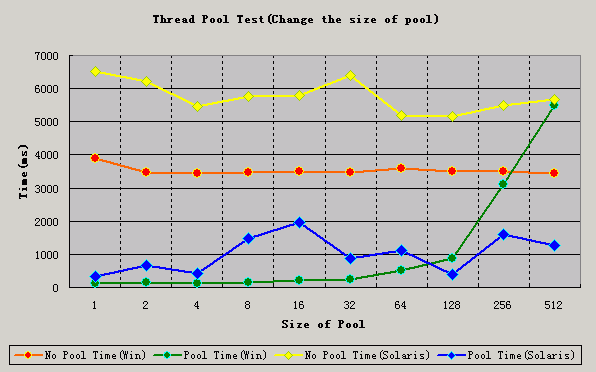
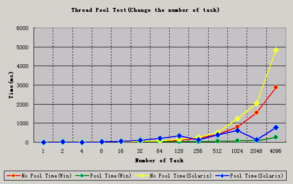

# 线程池的介绍及简单实现
服务器程序如何利用线程池来优化性能并提供一个简单的线程池实现

**标签:** Java

[原文链接](https://developer.ibm.com/zh/articles/l-threadpool/)

幸勇

发布: 2002-08-22

* * *

## 线程池的技术背景

在面向对象编程中，创建和销毁对象是很费时间的，因为创建一个对象要获取内存资源或者其它更多资源。在 Java 中更是如此，虚拟机将试图跟踪每一个对象，以便能够在对象销毁后进行垃圾回收。所以提高服务程序效率的一个手段就是尽可能减少创建和销毁对象的次数，特别是一些很耗资源的对象创建和销毁。如何利用已有对象来服务就是一个需要解决的关键问题，其实这就是一些”池化资源”技术产生的原因。比如大家所熟悉的数据库连接池正是遵循这一思想而产生的，本文将介绍的线程池技术同样符合这一思想。

目前，一些著名的大公司都特别看好这项技术，并早已经在他们的产品中应用该技术。比如 IBM 的 WebSphere，IONA 的 Orbix 2000 在 SUN 的 Jini 中，Microsoft 的 MTS（Microsoft Transaction Server 2.0），COM+等。

现在您是否也想在服务器程序应用该项技术?

## 线程池技术如何提高服务器程序的性能

我所提到服务器程序是指能够接受客户请求并能处理请求的程序，而不只是指那些接受网络客户请求的网络服务器程序。

多线程技术主要解决处理器单元内多个线程执行的问题，它可以显著减少处理器单元的闲置时间，增加处理器单元的吞吐能力。但如果对多线程应用不当，会增加对单个任务的处理时间。可以举一个简单的例子：

假设在一台服务器完成一项任务的时间为 T

```
T1 创建线程的时间
      T2 在线程中执行任务的时间，包括线程间同步所需时间
      T3 线程销毁的时间

```

Show moreShow more icon

显然 T ＝ T1＋T2＋T3。注意这是一个极度简化的假设。

可以看出 T1,T3 是多线程本身的带来的开销，我们渴望减少 T1,T3 所用的时间，从而减少 T 的时间。但一些线程的使用者并没有注意到这一点，所以在程序中频繁的创建或销毁线程，这导致 T1 和 T3 在 T 中占有相当比例。显然这是突出了线程的弱点（T1，T3），而不是优点（并发性）。

线程池技术正是关注如何缩短或调整 T1,T3 时间的技术，从而提高服务器程序性能的。它把 T1，T3 分别安排在服务器程序的启动和结束的时间段或者一些空闲的时间段，这样在服务器程序处理客户请求时，不会有 T1，T3 的开销了。

线程池不仅调整 T1,T3 产生的时间段，而且它还显著减少了创建线程的数目。在看一个例子：

假设一个服务器一天要处理 50000 个请求，并且每个请求需要一个单独的线程完成。我们比较利用线程池技术和不利于线程池技术的服务器处理这些请求时所产生的线程总数。在线程池中，线程数一般是固定的，所以产生线程总数不会超过线程池中线程的数目或者上限（以下简称线程池尺寸），而如果服务器不利用线程池来处理这些请求则线程总数为 50000。一般线程池尺寸是远小于 50000。所以利用线程池的服务器程序不会为了创建 50000 而在处理请求时浪费时间，从而提高效率。

这些都是假设，不能充分说明问题，下面我将讨论线程池的简单实现并对该程序进行对比测试，以说明线程技术优点及应用领域。

## 线程池的简单实现及对比测试

一般一个简单线程池至少包含下列组成部分。

1. 线程池管理器（ThreadPoolManager）:用于创建并管理线程池
2. 工作线程（WorkThread）: 线程池中线程
3. 任务接口（Task）:每个任务必须实现的接口，以供工作线程调度任务的执行。
4. 任务队列:用于存放没有处理的任务。提供一种缓冲机制。

线程池管理器至少有下列功能：创建线程池，销毁线程池，添加新任务 创建线程池的部分代码如下：

```
...
        //create threads
        synchronized(workThreadVector)
        {
            for(int j = 0; j < i; j++)
            {
                threadNum++;
               WorkThread workThread = new WorkThread(taskVector, threadNum);
                workThreadVector.addElement(workThread);
            }
        }
...

```

Show moreShow more icon

注意同步 workThreadVector 并没有降低效率，相反提高了效率,请参考 Brian Goetz 的文章。 销毁线程池的部分代码如下：

```
...
        while(!workThreadVector.isEmpty())
        {
        if(debugLevel > 2)
         System.out.println("stop:"+(i));
         i++;
            try
            {
                WorkThread workThread = (WorkThread)workThreadVector.remove(0);
                workThread.closeThread();
                continue;
            }
            catch(Exception exception)
            {
                if(debugLevel > 2)
                    exception.printStackTrace();
            }
            break;
        }
...

```

Show moreShow more icon

添加新任务的部分代码如下：

```
...
        synchronized(taskVector)
        {
            taskVector.addElement(taskObj);
            taskVector.notifyAll();
        }
...

```

Show moreShow more icon

工作线程是一个可以循环执行任务的线程，在没有任务时将等待。由于代码比较多在此不罗列.

任务接口是为所有任务提供统一的接口，以便工作线程处理。任务接口主要规定了任务的入口，任务执行完后的收尾工作，任务的执行状态等。在文章结尾有相关代码的下载。

以上所描述的线程池结构很简单，一些复杂的线程池结构将不再此讨论。

在下载代码中有测试驱动程序（TestThreadPool），我利用这个测试程序的输出数据统计出下列测试结果。测试有两个参数要设置：

1. 线程池中线程数，即线程池尺寸。
2. 要完成的任务数。

分别将一个参数固定，另一个参数变动以考察两个参数所产生的不同结果。所用测试机器分别为普通 PC 机（Win2000 JDK1.3.1）和 SUN 服务器(Solaris Unix JDK1.3.1)，机器配置在此不便指明。

##### 表 1\. 测试数据及对应结果

线程池尺寸任务数没有应用线程池所用的时间（单位:毫秒，OS:win）应用线程池所用的时间（单位:毫秒，OS:win）没有应用线程池所用的时间（单位:毫秒，OS:Solaris）应用线程池所用的时间（单位:毫秒，OS:Solaris）1500038961306513327250003455151622165945000342512054484338500034751605769147816500035052115785197032500034552516403875645000359550151821103128500035158815154405256500034953104550215895125000342554885667126216120022316220202113164201027101682020222416163020294816324020461081664602072199161281102014833516256201202521321651241140522382161024811711233610162048155280204513516409628742504828787

##### 图 1\. 线程池的尺寸的对服务器程序的性能影响



根据以上统计数据可得出下图：

##### 图 2\. 任务数对服务器程序的冲击



数据分析如下：

图 1 是改变线程池尺寸对服务器性能的影响，在该测试过程中，服务器的要完成的任务数固定为为 5000。从图 1 中可以看出合理配置线程池尺寸对于大量任务处理的效率有非常明显的提高，但是一旦尺寸选择不合理（过大或过小）就会严重降低影响服务器性能。理论上”过小”将出现任务不能及时处理的情况,但在图表中显示出某些小尺寸的线程池表现很好，这是因为测试驱动中有很多线程同步开销，且这个开销相对于完成单个任务的时间是不能忽略的。”过大”则会出现线程间同步开销太大的问题，而且在线程间切换很耗 CPU 时间，在图表显示的很清楚。可见任何一个好技术，如果滥用都会造成灾难性后果。

图 2 是用不同数量的任务来冲击服务器程序，在该测试过程中，服务器线程池尺寸固定为 16。可以看出线程池在处理少量任务时的优势不明显。所以线程池技术有一定的适应范围，关于适用范围将在后面讨论。但对于大量的任务的处理，线程池的优势表现非常卓越，服务器程序处理请求的时间虽然有波动，但是其平均值相对小多了。

值得注意的是测试方案中，统计任务的完成时间没有包含了创建线程池的时间。在实际线程池工作时，即利用线程池处理任务时，创建线程池的时间是不必计算在内的。

由于测试驱动程序有很多同步代码，特别是等待线程执行完毕的同步（代码中为 sleepToWait(long l)方法的调用），这些代码降低了代码执行效率，这是测试驱动一个缺点，但这个测试驱动可以说明线程池相对于简单使用线程的优势。

## 关于高级线程池的探讨

简单线程池存在一些问题，比如如果有大量的客户要求服务器为其服务，但由于线程池的工作线程是有限的，服务器只能为部分客户服务，其它客户提交的任务，只能在任务队列中等待处理。一些系统设计人员可能会不满这种状况，因为他们对服务器程序的响应时间要求比较严格，所以在系统设计时可能会怀疑线程池技术的可行性，但是线程池有相应的解决方案。调整优化线程池尺寸是高级线程池要解决的一个问题。主要有下列解决方案：

### 方案一：动态增加工作线程

在一些高级线程池中一般提供一个可以动态改变的工作线程数目的功能，以适应突发性的请求。一旦请求变少了将逐步减少线程池中工作线程的数目。当然线程增加可以采用一种超前方式，即批量增加一批工作线程，而不是来一个请求才建立创建一个线程。批量创建是更加有效的方式。该方案还有应该限制线程池中工作线程数目的上限和下限。否则这种灵活的方式也就变成一种错误的方式或者灾难，因为频繁的创建线程或者短时间内产生大量的线程将会背离使用线程池原始初衷–减少创建线程的次数。

举例：Jini 中的 TaskManager，就是一个精巧线程池管理器，它是动态增加工作线程的。SQL Server 采用单进程(Single Process)多线程(Multi-Thread)的系统结构，1024 个数量的线程池，动态线程分配，理论上限 32767。

### 方案二：优化工作线程数目

如果不想在线程池应用复杂的策略来保证工作线程数满足应用的要求，你就要根据统计学的原理来统计客户的请求数目，比如高峰时段平均一秒钟内有多少任务要求处理，并根据系统的承受能力及客户的忍受能力来平衡估计一个合理的线程池尺寸。线程池的尺寸确实很难确定，所以有时干脆用经验值。

举例：在 MTS 中线程池的尺寸固定为 100。

### 方案三：一个服务器提供多个线程池

在一些复杂的系统结构会采用这个方案。这样可以根据不同任务或者任务优先级来采用不同线程池处理。

举例：COM+用到了多个线程池。

这三种方案各有优缺点。在不同应用中可能采用不同的方案或者干脆组合这三种方案来解决实际问题。

## 线程池技术适用范围及应注意的问题

下面是我总结的一些线程池应用范围,可能是不全面的。

线程池的应用范围：

1. 需要大量的线程来完成任务，且完成任务的时间比较短。 WEB 服务器完成网页请求这样的任务，使用线程池技术是非常合适的。因为单个任务小，而任务数量巨大，你可以想象一个热门网站的点击次数。 但对于长时间的任务，比如一个 Telnet 连接请求，线程池的优点就不明显了。因为 Telnet 会话时间比线程的创建时间大多了。
2. 对性能要求苛刻的应用，比如要求服务器迅速相应客户请求。
3. 接受突发性的大量请求，但不至于使服务器因此产生大量线程的应用。突发性大量客户请求，在没有线程池情况下，将产生大量线程，虽然理论上大部分操作系统线程数目最大值不是问题，短时间内产生大量线程可能使内存到达极限，并出现”OutOfMemory”的错误。

## 结束语

本文只是简单介绍线程池技术。可以看出线程池技术对于服务器程序的性能改善是显著的。线程池技术在服务器领域有着广泛的应用前景。希望这项技术能够应用到您的多线程服务程序中。

## 下载示例代码

[code-example.zip](http://www.ibm.com/developerWorks/cn/java/l-threadPool/code-example.zip): 代码示例

## 相关主题

- [线程池与工作队列](https://www.ibm.com/developerworks/cn/java/j-jtp0730/index.html)
- [深入 Eclipse 多线程机制](https://www.ibm.com/developerworks/cn/opensource/os-cn-ecl-mthrd/index.html)