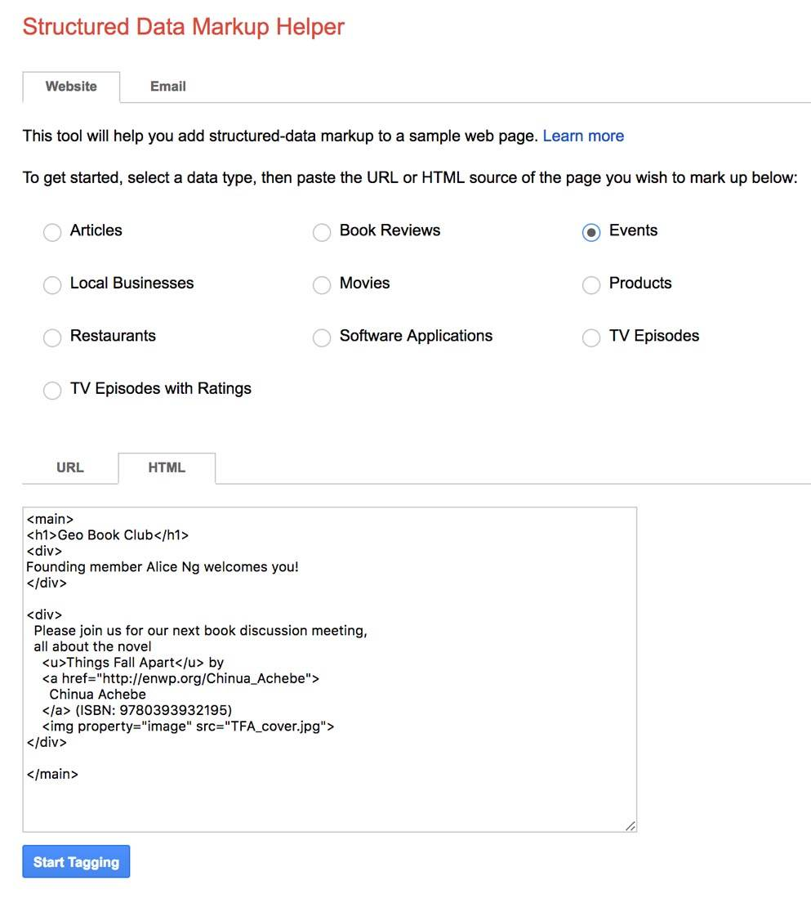
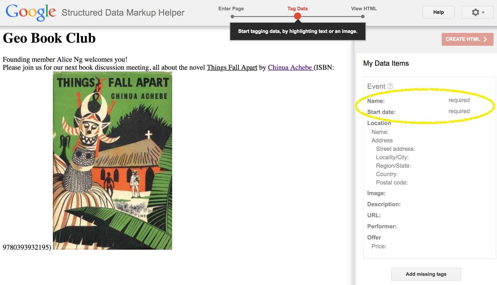
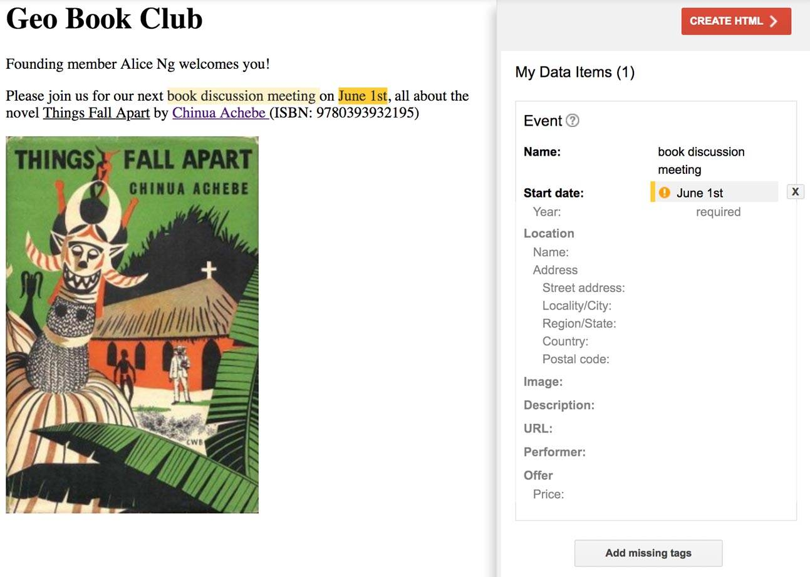
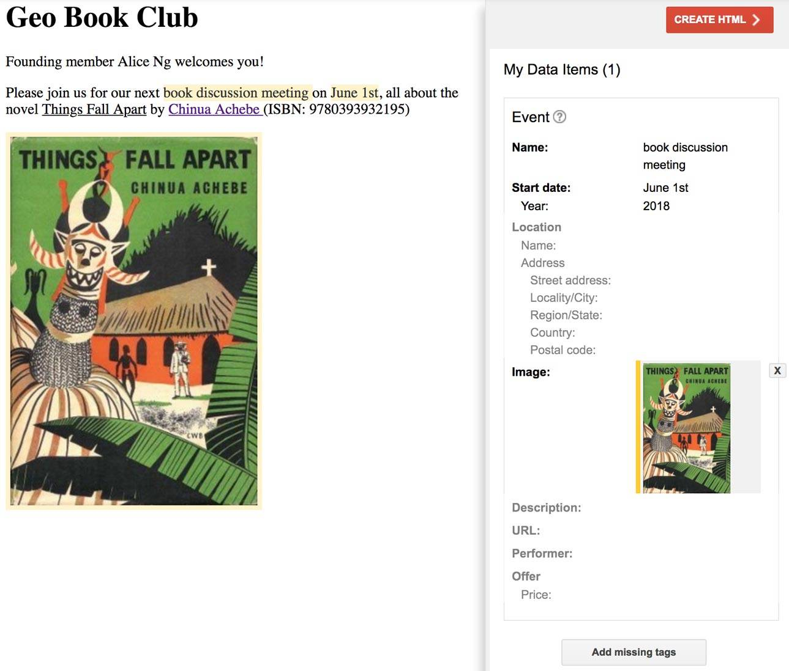
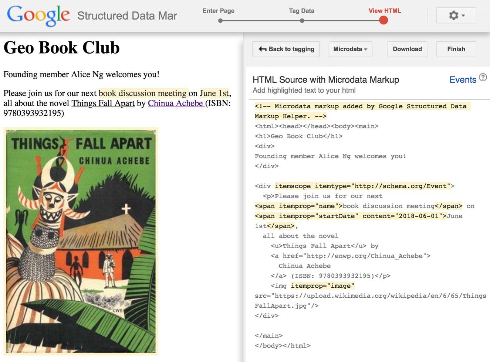
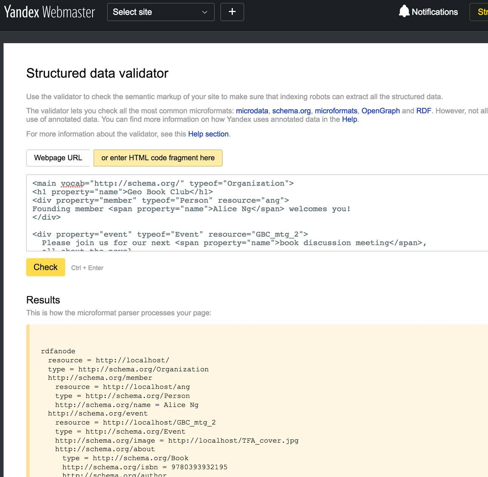
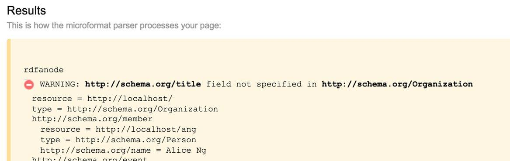
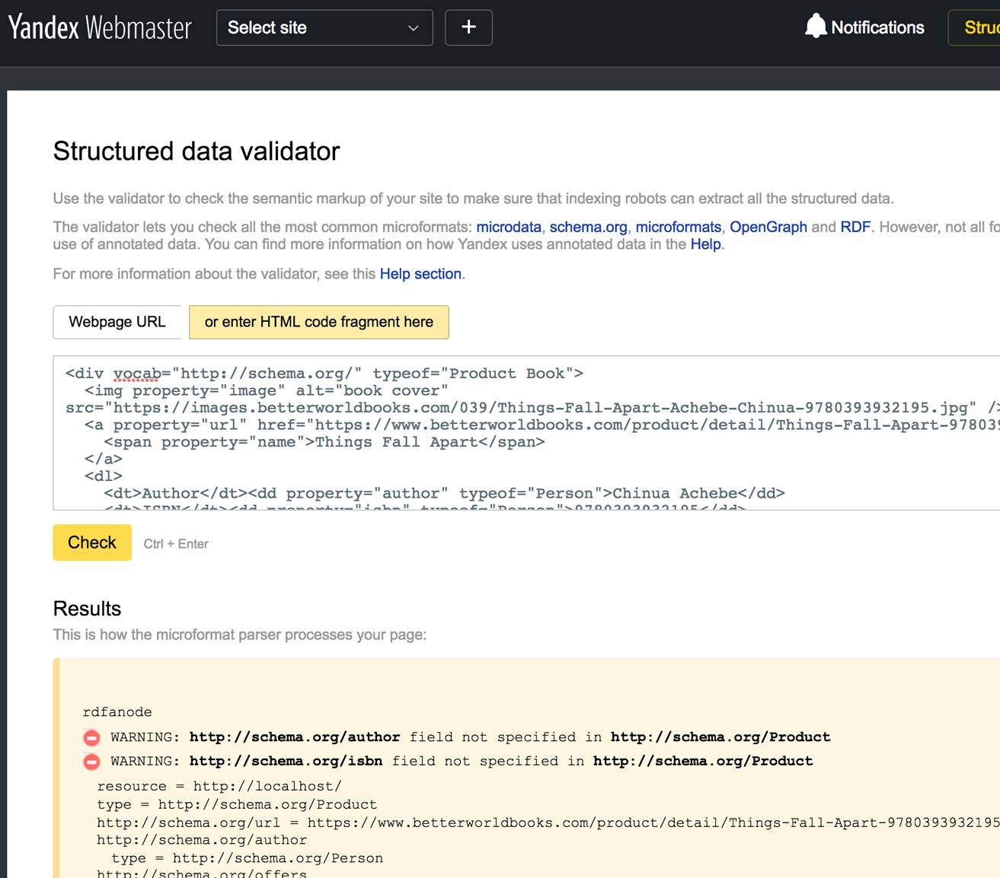

# 结构化数据工具
了解生成、验证和解析 Schema.org 词汇表的工具

**标签:** Web 开发

[原文链接](https://developer.ibm.com/zh/articles/wa-schemaorg4/)

Uche Ogbuji

发布: 2018-04-17

* * *

结构化数据使您能够创建更容易被搜索引擎和机器找到和搜索到的网站。Schema.org 创建了一种页面上的、结构化数据的标记模式，帮助搜索引擎理解网页上的信息，并提供更丰富的搜索结果。

本系列的最后部分将介绍一些工具，您可以使用它们在您的网站上实施 Schema.org。我们将研究 3 种不同工具的示例，这些工具的用途包括：

- 交互式地引导您向纯 HTML 添加结构化数据。
- 验证您的页面中的结构化数据。
- 让开发人员能够解析来自这些页面的结构化数据。

因为 [Schema.org](https://github.com/schemaorg/schemaorg) 是开源的（采用 Apache 许可），由 W3C Schema.org Community Group 维护，所以可使用它，而无需受制于专有工具。您还可以将跟进开发进度的流程自动化。

## 生成结构化数据

许多流行的内容管理系统（包括 WordPress、Drupal 和 Joomla）都含有能够简化 Schema.org 输出的插件。如果您的内容管理系统没有便利的插件，或者您打算直接生成页面，那么 Google 的 [Structured Data Markup Helper](https://www.google.com/webmasters/markup-helper/) 是个很有用的工具。

Structured Data Markup Helper 允许您输入适合 Schema.org 词汇表中多个关键领域的内容。它还允许您获得一个包含您可以细化和使用的结构化数据的更新版本。此外，该帮助器努力生成 HTML 格式的电子邮件。您可以将它指向您已发布的 HTML，或者将 HTML 粘贴到已提供的文本区域中。图 1 展示了粘贴了一个读书俱乐部活动页面的一些 HTML 后的帮助器。

##### 图 1\. Structured Data Markup Helper



粘贴上面的文本后，单击 **Start Tagging** 并得到图 2 所示的工作区。

##### 图 2\. Structured Data Markup Helper 工作区



在这个工作区中，我可以选择左侧 HTML 预览区域中的各部分内容，利用该帮助器提供的子集为它们创建 Schema.org 标记。

我还可以查看我是否拥有想要的 Schema.org 类型所需的最少内容。例如，活动名称 Name 和开始日期 Start date（在右侧以黄色突出显示）是必填字段。回头看看图 1 中的代码，我可以将名称设置为”Book Discussion Meeting”，但我没有提供开始日期。所以我返回到 HTML，添加一个表示会议日期的短语。

##### 非结构化的读书俱乐部页面：添加一个会议日期

```
<main>
          <h1>Geo Book Club</h1>
          <div>
          Founding member Alice Ng welcomes you!
          </div>

          <div>
            <p>Please join us for our next book discussion meeting on June 1st,
            all about the novel
              <u>Things Fall Apart</u> by
              <a href="http://enwp.org/Chinua_Achebe">
                Chinua Achebe
              </a> (ISBN: 9780393932195)</p>
              
          </div>

          </main>

```

Show moreShow more icon

### 自行生成结构化数据

1. 要从现在开始跟随进行操作，请转到 [Structured Data Markup Helper](https://www.google.com/webmasters/markup-helper) ，选择 **Events** 单选按钮和 **HTML** 选项。粘贴上面的 HTML 代码。
2. 在工作区中，通过单击和拖动来突出显示短语 `book discussion meeting` 。在结果菜单上，单击 **Name** 。
3. 通过单击和拖动来突出显示短语 `June 1st` 。在结果菜单上，单击 **Start Date** 和 **Date/Time (Autodetect)** 。您的工作区现在应类似于图 3。

    图 3\. 添加了必填字段的 Structured Data Markup Helper 工作区

    

4. 从右侧边栏可以看到，”Name”的需求现在已得到满足，但”Start date”字段上有一条警告。帮助器能确定月份和日期，但缺少了年份。通过单击底部的 **Add missing tags** 按钮，您可以为机器可读的数据提供年份，而不必直接编辑 HTML。
5. 从”Select tag type”，单击 **Start date** \> **Advanced** \> **Year** 。
6. 然后可以在”Add tag”上输入 `2018` 。单击 **Save** 后，该警告会消失，而且 HTML 应该可以使用。
7. 对于添加的度量，单击图书的封面图片并单击弹出窗口中的 **Image** 。工作区应类似于图 4。

    图 4\. 适合导出的 Structured Data Markup Helper 工作区

    


### 获得结果

要查看您的工作成果，请单击 **CREATE HTML** 。结果应该类似于图 5。

##### 图 5\. HTML 导出页面



右侧是您的起始 HTML，其中突出显示的部分是由该帮助器添加的（默认为 Microdata 格式）。您可以将完整的 HTML 输出下载到开发工具中，或者在编写代码时使用突出显示的部分来生成结构化的数据输出。对于本示例，输出如下所示。

##### Structured Data Markup Helper 输出

```
<!-- Microdata markup added by Google Structured Data Markup Helper.-->
          <html><head></head><body><main>
          <h1>Geo Book Club</h1>
          <div>
          Founding member Alice Ng welcomes you!
          </div>

          <div itemscope itemtype="http://schema.org/Event">
            <p>Please join us for our next
          <span itemprop="name">book discussion meeting</span> on
          <span itemprop="startDate" content="2018-06-01">June 1st</span>,
            all about the novel
              <u>Things Fall Apart</u> by
              <a href="http://enwp.org/Chinua_Achebe">
                Chinua Achebe
              </a> (ISBN: 9780393932195)</p>
              
          </div>

          </main>
          </body></html>

```

Show moreShow more icon

您还可以从以”Microdata”开头的下拉菜单中获得 JSON-LD 输出。生成的 JSON-LD 结果如下所示。

##### Google Structured Data Markup Helper 生成的 JSON-LD 标记

```
<!-- JSON-LD markup generated by Google Structured Data Markup Helper.-->
          <script type="application/ld+json">
          {
            "@context" : "http://schema.org",
            "@type" : "Event",
            "name" : "book discussion meeting",
            "startDate" : "2018-06-01",
            "image" : "https://upload.wikimedia.org/wikipedia/en/6/65/ThingsFallApart.jpg"
          }
          </script>

```

Show moreShow more icon

继续操作，单击 **Back to tagging** ，尝试添加其他字段。

尽管 Structured Data Markup Helper 仅涵盖 Schema.org 的一个小子集，而且目前尚未支持 RDFa 输出，但它是一种不错的入门工具。使用它，您会发现编写自己的结构化数据将开始变得不那么神秘。

## 验证结构化数据

无论您编写了多久的结构化数据，仍然需要能够验证该数据，确保没有出错。

由于影响甚微，Schema.org 的问题可能很难发现。例如，可能要花更长时间才会意识到，在搜索引擎的结果中，您所销售的产品的丰富代码片段没有正确显示，因为搜索引擎结果是第三方网站。

幸运的是，有一些工具可以帮助处理嵌入在 HTML 中的结构化数据。这些工具能让您清楚地了解结构化数据的含义，并帮助确保您没有犯错。让我们看看 Yandex Structured Data Validator。

**另一个数据测试工具**

除了 Yandex 的工具之外，Google 还有一个很有用的工具 [Structured Data Testing Tool](href)。

在 [Validator 页面](https://webmaster.yandex.com/tools/microtest/) 上，我选择”enter HTML code fragment here”。此时会显示一个文本区，我将 [本系列第 2 部分](https://www.ibm.com/developerworks/cn/web/wa-schemaorg2/index.html) 中的完整的读书俱乐部 RDFa 粘贴到其中。参见图 6。

##### 图 6\. Yandex Structured Data Validator



没有列出警告或错误。但是，如果我将第二行上的 `property="name"` 更改为 `property="title"` ，则会在结果部分出现一个警告。图 7 展示了此警告

##### 图 7\. Schema.org 警告



Yandex 验证器整合了为 Schema.org 记录的预期表达，而且识别出 `title` 不是 `Organization` 的有效属性缩写。类似地，如果您在 HTML 中使用了英式英语拼写法 `Organisation` ，验证器会发出一条警告表明 `http://schema.org/Organisation` 在 Schema.org 中未知。这正是人类可能忽略的问题，因为这个单词实际上是根据人们的习惯来正确拼写的。但是，Schema.org 采用了不同的拼写习惯。

如果您遇到一个非常基础的语法问题，比如说将 `vocab` 属性拼错或缺少等号，那么该工具几乎会抛出这样一个错误，比如：

`Microformats not detected =(`

但是，Yandex 验证器确实有一些局限。例如，我尝试验证了本系列第 3 部分的 HTML，其中的一本书也被标记为 product。第一行如下所示。

```
<div vocab="http://schema.org/" typeof="Product Book">

```

Show moreShow more icon

这会让 Yandex 验证器感到困惑，它会严格将资源视为 `Product` ，并发出了如图 8 所示的警告。

##### 图 8\. 包含虚假错误的 Yandex Structured Data Validator



Yandex 工具支持所有 3 种 Schema.org 格式，还有一个可用的 API，可用来自动验证站点的有效性。

我之前应该提到过，Google 的 [SDTT](https://search.google.com/structured-data/testing-tool) 能够验证让 Yandex 验证器感到困惑的 Product/Book 示例。尽管如此，在使用任何搜索引擎验证工具时保持小心谨慎始终很重要。它们的主要目标是确认它们将为丰富代码片段识别的标记。尽管任何给定 Schema.org 验证器中的有效性是表明您的网站元数据是否正确的重要指标，但您可能发现一些存在分歧的领域。

## 通过 Versa 从网上读取 Schema.org

现在您已在网站上发布了 Schema.org 结构化数据，并确认它是有效的，那么您如何实际使用它呢？

有许多工具可用来解析来自网页的结构化数据，但我将重点介绍我自己开发的一个工具。 _Versa_ 是一个处理类似 RDF 的数据的开源（采用 Apache 许可）库，它的一个模块支持 RDFa。它需要 Python 3，如果您已设置 Python 3，只需通过以下命令来安装 Versa。

```
pip install versa

```

Show moreShow more icon

您可以使用 Versa 来解析以 RDFa 格式使用 Schema.org 的网站。下面清单中的示例从包含大量结构化数据的指定页面中提取所有事物的名称。此页面提供了对 Denver Public Library 拥有的与作者 Chinua Achebe 相关的所有图书和其他资料的描述。（我的日常工作是在网络上发布这些包含结构化数据的页面，展示各种库向公众提供的许多很酷的东西。）

##### 用 Versa 解析运用 Schema.org 的网站

```
#Import the needed code
import urllib
from versa.reader import rdfalite
#Set the web page to be parsed
site = 'http://link.denverlibrary.org/resource/FRqlF2zfz4A/'
#List to store the parsed data
triples = []
#Open the web page for reading over the network
fp = urllib.request.urlopen(site)
#Run the parser
rdfalite.totriples(fp.read(), triples, site)
#Empty set where results will be added
names_of_things = set()
#Loop over all data for properties that are Schema.org name
for resource, property, value in triples:
    if property == 'http://schema.org/name':
        names_of_things.add(value)

#Print the set of results
for name in names_of_things:
    print(name)

```

Show moreShow more icon

如果您已熟悉 Python，借助注解，您应该很容易理解代码。即使您不熟悉 Python，您或许也能了解它的大意。 输出（使用 Schema.org 显式命名的资源集）如下所示。

##### Versa 输出

```
How the leopard got his claws
Achebe, Chinua
The short century : independence and liberation movements in Africa, 1945-1994
Arrow of God
Civil peace
Achebe, Chinua -- Interviews
Morning yet on creation day : essays
Vengeful creditor
Achebe, Chinua -- Criticism and interpretation
Home and exile
No longer at ease
Anthills of the Savannah
There was a country : a personal history of Biafra
Things fall apart
Hopes and impediments : selected essays
Another Africa
The education of a British-protected child : essays
Conversations with Chinua Achebe
Arrow of god
Girls at war and other stories
A man of the people

```

Show moreShow more icon

## 结束语

在本系列的第 4 部分中，我介绍了现代网站的结构化、机器可读数据的重要性。具体来讲，我描述了 Schema.org 数据模型，解释了如何在 HTML 中正确表达它。我介绍了如何排列和归档 Schema.org 词汇表，展示了从网站生成结构化数据、验证它并解析它的工具。

现在，您可以利用搜索引擎、智能代理和网络上的其他许多创新的最新特性。 不要犹豫，尽情试验吧，因为与所有技术一样，亲自解决您自己的问题领域才是最佳掌握方法。

本文翻译自： [Structured data tools](https://developer.ibm.com/articles/wa-schemaorg4/)（2018-03-05）