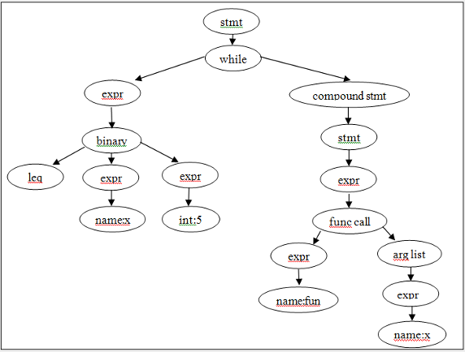

# 结构化编译器前端 Clang 介绍
如何运用 Clang 进行插件开发

**标签:** 软件开发

[原文链接](https://developer.ibm.com/zh/articles/os-cn-clang/)

王莉娜, 武树伟

发布: 2012-07-13

* * *

## 背景与概览

Low Level Virtual Machine (LLVM) 是一个开源的编译器架构，它已经被成功应用到多个应用领域。Clang ( 发音为 /klæŋ/) 是 LLVM 的一个编译器前端，它目前支持 C, C++, Objective-C 以及 Objective-C++ 等编程语言。Clang 对源程序进行词法分析和语义分析，并将分析结果转换为 Abstract Syntax Tree ( 抽象语法树 ) ，最后使用 LLVM 作为后端代码的生成器。

Clang 的开发目标是提供一个可以替代 GCC 的前端编译器。与 GCC 相比，Clang 是一个重新设计的编译器前端，具有一系列优点，例如模块化，代码简单易懂，占用内存小以及容易扩展和重用等。由于 Clang 在设计上的优异性，使得 Clang 非常适合用于设计源代码级别的分析和转化工具。Clang 也已经被应用到一些重要的开发领域，如 Static Analysis 是一个基于 Clang 的静态代码分析工具。

本文将简单介绍 Clang 的背景知识和功能特性，并通过一个小例子介绍如何使用 Clang 的库来编写一个小程序来统计源代码中的函数。

### Clang 的开发背景

由于 GNU 编译器套装 (GCC) 系统庞大，而且 Apple 大量使用的 Objective-C 在 GCC 中优先级较低，同时 GCC 作为一个纯粹的编译系统，与 IDE 配合并不优秀，Apple 决定从零开始写 C family 的前端，也就是基于 LLVM 的 Clang 了。Clang 由 Apple 公司开发，源代码授权使用 BSD 的开源授权。

### Clang 的特性

相比于 GCC，Clang 具有如下优点：

- 编译速度快：在某些平台上，Clang 的编译速度显著的快过 GCC。
- 占用内存小：Clang 生成的 AST 所占用的内存是 GCC 的五分之一左右。
- 模块化设计：Clang 采用基于库的模块化设计，易于 IDE 集成及其他用途的重用。
- 诊断信息可读性强：在编译过程中，Clang 创建并保留了大量详细的元数据 (metadata)，有利于调试和错误报告。
- 设计清晰简单，容易理解，易于扩展增强。与代码基础古老的 GCC 相比，学习曲线平缓。

当前 Clang 还处在不断完善过程中，相比于 GCC, Clang 在以下方面还需要加强：

- 支持更多语言：GCC 除了支持 C/C++/Objective-C, 还支持 Fortran/Pascal/Java/Ada/Go 和其他语言。Clang 目前支持的语言有 C/C++/Objective-C/Objective-C++。
- 加强对 C++ 的支持：Clang 对 C++ 的支持依然落后于 GCC，Clang 还需要加强对 C++ 提供全方位支持。
- 支持更多平台：GCC 流行的时间比较长，已经被广泛使用，对各种平台的支持也很完备。Clang 目前支持的平台有 Linux/Windows/Mac OS。

## Clang 安装

在这一节，我们将介绍如何获取 Clang 源码，编译和安装 Clang。编译 Clang 要求您的系统中安装有 C++ 编译器 ( 如 GCC)。如果您还要编译 Clang 的测试集，那么您还需要事先安装 python。

### 获取源码

由于 Clang 是 LLVM 的一部分，并且 Clang 也用到 LLVM 的库，我们需要先下载 LLVM，然后下载 Clang 作为 LLVM 工具的一部分。下面的例子示意了如何 svn 在 Linux 下获取最新的 LLVM 和 Clang。

1．创建 LLVM 源代码存放目录 (llvm\_source)

```
$mkdir – p llvm_source

```

Show moreShow more icon

2．进入创建的目录

```
$cd llvm_source

```

Show moreShow more icon

3．获取 LLVM

```
$svn co http://llvm.org/svn/llvm-project/llvm/trunk llvm

```

Show moreShow more icon

4．获取 Clang

```
$cd llvm/tools
      $svn co http://llvm.org/svn/llvm-project/cfe/trunk clang

```

Show moreShow more icon

### 编译 Clang

```
$cd ../../ ( 返回 llvm_source)
$mkdir build ( 建立编译的工作目录 )
$cd build
$../llvm/configure – prefix=$HOME/llvm ( 配置 LLVM，将目标安装目录设定为 $HOME/llvm)
$make ( 以 DEBUG 模式来编译 LLVM 和 Clang)

```

Show moreShow more icon

### 开始使用 Clang

您可以像使用普通的编译器一样使用 Clang。首先你需要把 Clang 的安装路径加入 PATH 环境变量中。以下例子假定您使用的是 Linux 的 bash：

```
$ export PATH=$HOME/llvm/bin:$PATH
$ export LD_LIBRARY_PATH=$HOME/llvm/lib/:$LD_LIBRARY_PATH

在本文中，我们使用一个常见的 hello world 程序来演示 Clang。在这里我们把这个文件命名为 test.c。它的内容如下：
#include <stdio.h>
int main(int argc, char **argv)
{
    printf("hello world\n");
    return 0;
}

```

Show moreShow more icon

您可以使用任何编辑器输入并生成这个文件。

有了这个文件以后，您可以试试以下命令行的命令：

```
$ clang  --help ( 查看帮助信息 )
$ clang test.c -fsyntax-only ( 检查语法和词法正确性 )
$ clang test.c -S -emit-llvm -o test.bc ( 生成优化前的 llvm bitcode)
$ clang test.c -S -emit-llvm -o test.bc -O3 ( 生成优化的 llvm bitcode)
$ clang test.c -S -O3 -o test ( 生成可执行代码 )

```

Show moreShow more icon

与 GCC 相比，Clang 的一大优点是更加清晰明确的错误提示。

您不妨尝试着删除”printf(“hello world\\n”);”语句后面的分号。编译这个程序，GCC 给出的错误信息将是：

```
test.c: In function 'main':
test.c:6:2: error: expected ';' before 'return'

```

Show moreShow more icon

而 Clang 给出的错误信息则是：

```
test.c:5:26: error: expected ';' after expression
                printf("hello world.\n")
                                            ^
                                            ;

```

Show moreShow more icon

相比之下，是不是 Clang 的错误信息更加明晰和用户友好呢？关于 Clang 出错处理更详细的信息，可以参见 [http://clang.llvm.org/features.html#expressivediags](http://clang.llvm.org/features.html#expressivediags) 。

## 抽象语法树

前面我们提到过 Clang 是一个编译器前端，这也就是说：Clang 将目标程序进行分析，然后生成结构化的，树状的语法表示 , 即抽象语法树 AST(Abstract Syntax Tree)。

例如，下面简单的语句可以表示为语法树（如图 1）：

```
while(x <= 5)
{
fun(x)；
}

```

Show moreShow more icon

##### 图 1\. 抽象语法树



将程序代码表示为抽象语法树的一个好处是能极大方便编译，分析和优化。比如，对于一个单纯的 C++ 程序来说，重命名一个变量就比较困难，我们不能简单地搜索变量名称替换成一个新的名称，因为这可能会改变太多。例如：不同的类或者名字空间里也有相同名称的变量名。将程序表示为抽象语法树以后，替换变量名称就会变得很简单：我们只需要改变对应的变量声明抽象语法树节点的名称字段，然后把抽象语法树转换回源代码，这是因为每个变量的定义都会对应一个独一无二的抽象语法树节点。

## 基于 Clang 的编程

与许多编译器前端相比，Clang 的最大特点就是良好的结构化设计，每部分都是一个单独的库 (library)。也就是说您可以单独的使用其中的一部分，来编写自己的程序。在这里，我们将通过一个小例子来介绍如何使用 Clang 的库来编写一个小程序来统计源代码中的函数。通过这个例子，您将对于如何遍历抽象语法树有一个基本的概念。

### BoostConASTConsumer

我们的这个小程序将基于 Clang 的一个叫做 BoostConASTConsumer 的例子，这个例子的源代码位于：”tools/clang/lib/Frontend/BoostConAction.cpp”。

BoostConASTConsumer 的代码如下：

```
#include "clang/Frontend/FrontendActions.h"
#include "clang/AST/ASTConsumer.h"
#include "clang/AST/RecursiveASTVisitor.h"
#include <cstdio>
#include <iostream>
using namespace clang;
namespace {
    class BoostConASTConsumer : public ASTConsumer,
    public RecursiveASTVisitor<BoostConASTConsumer>
    {
        public:
        /// HandleTranslationUnit - This method is called when the
        /// ASTsfor entire translation unit have been parsed.
        virtual void HandleTranslationUnit(ASTContext &Ctx);

        bool VisitCXXRecordDecl(CXXRecordDecl *D)
       {
           std::cout << D->getNameAsString() << std::endl;
           return true;
       }
    };
}

ASTConsumer *BoostConAction::CreateASTConsumer
     (CompilerInstance &CI, llvm::StringRef InFile)
{
    return new BoostConASTConsumer();
}

void BoostConASTConsumer::HandleTranslationUnit(ASTContext &Ctx)
{
    fprintf(stderr, "Welcome to BoostCon!\n");
    TraverseDecl(Ctx.getTranslationUnitDecl());
}

```

Show moreShow more icon

BoostConASTConsumer 是一个遍历抽象语法树 (AST) 的例子。当 Clang 读入源文件，Clang 将根据源程序的信息构造一棵抽象语法树。BoostConASTConsumer 就是一个 AST Consumer，提供了访问抽象语法树的接口。

我们可以看到：BoostConASTConsumer 是 ASTConsumer 的子类，同时也是 RecursiveASTVisitor 这个 C++ 模板的声明。其中对 ASTConsumer 的继承主要是重载了 HandleTranslationUnit 这个函数，这是 BoostConASTConsumer 的入口。当整个抽象语法树 (AST) 构造完成以后，HandleTranslationUnit 这个函数将会被 Clang 的驱动程序调用。

在本小节中，我们将着重介绍 RecursiveASTVisitor，这是一个重要的函数模板。通过介绍这个模板，我们将向您简单介绍遍历抽象语法树的一些基本概念。

RecursiveASTVisitor 是一个深度优先遍历 AST 和访问节点的类。对于一个已经构造好的语法树，它将完成以下三方面的工作：

1. 遍历 AST 的每个节点；
2. 在某一个节点，访问这个节点的层次结构 ( 每个节点也是一个树 )；
3. 如果某一个节点是一种类型的动态类别 ( 比如是一个子类等 )，调用一个用户重载的函数来访问这个节点；

上述工作由下面三组方法完成，分别是：

1. TraverseDecl(Decl _x) 完成工作 1，它是遍历 AST 的入口。这个方法是用来访问有关变量和函数的声明。TraverseDecl 只是简单的根据节点的类型来调用相应的 TraverseFoo(Foo_ x)，然后递归访问 x 的子节点。TraverseStmt(Stmt \*x) 和 TraverseType(QualType x) 则是用来访问一条语句和一个类型的（如结构体），它们的工作方式和 TraverseDecl 类似。
2. WalkUpFromFoo(Foo \*x) 完成工作 2。它不会尝试访问 x 的任何子节点，而是先调用 WalkUpFromBar(x)，其中 Bar 是 Foo 的直接父类（除非 Foo 没有父类）, 然后调用 VisitFoo(x)。
3. VisitFoo（Foo \*x）完成工作 3。

上述三组方法是分层次的 (`Traverse* > WalkUpFrom * > Visit*`)。一个方法 ( 如 Traverse _) 可以调用同一层次的方法 ( 例如其他 Traverse_) 或低一层次的方法 ( 如 WalkUpFrom\*)，它不能调用更高层次的方法。这个结构确保同样类型的 AST 节点会被同时访问，也就是说不会出现交替访问不同节点的情况。

下面的伪代码，简单描述了 TraverseDecl 的工作情况。假设我们有一个 AST 节点叫做 x。在入口处，TraverseDecl 将根据 x 的类型来调用相应的访问函数。比如，如果节点类型是一个函数声明，那么将调用 TraverseFunctionDecl。在 TraverseFunctionDecl 中则会递归调用函数的内容，如首先访问函数入口参数，然后访问函数体，在访问函数体的过程中又会调用 TraverseDecl 和 TraverseStmt 访问函数体内的变量声明和每一条语句。

```
switch(x->type())
{
case FunctionDeclType:
          TraverseFunctionDecl(dyn_cast<FunctionDecl>(x));
          break;
    case DeclType:
          TraverseDecl(dyn_cast<Decl>(x));
          break;
    ...
}

```

Show moreShow more icon

### 统计源代码中的函数

明白了 BoostConASTConsumer 以后，我们就可以着手编写一个用来统计源代码中函数的例子了。我们所要做的工作其实很简单，只需要重载 VisitFunctionDecl。这样每当遇见一个函数的定义 (FunctionDecl) 的节点时，VisitFunctionDecl 将会被调用。

为了统计函数个数和信息，我们加入两个类数据成员：

```
int fc; // 用于统计函数个数
std::vector<FunctionDecl*> funcs; // 用于记录已经遍历的函数

然后我们在 VisitFunctionDecl 里统计函数信息：
bool VisitFunctionDecl(FunctionDecl *D)
{
    if (D->isThisDeclarationADefinition()) // 只关心提供了定义的函数
                                                   //（忽略只有声明而没有在源代
                                                   // 码中出现定义的函数）
    {
        fc++;
        funcs.push_back(D->getNameAsString());// 获取函数名并保存到 funcs
    }

    return true;
}

```

Show moreShow more icon

由于 HandleTranslationUnit 是函数的入口，因此我们在 HandleTranslationUnit 对变量 fc 进行初始化：

```
fc = 0;

```

Show moreShow more icon

最后，我们在析构函数里打印统计信息：

```
~BoostConASTConsumer()
{
std::cout << "I have seen " << fc << " functions. \ They are: " <<endl;
    for (unsigned i=0; i<funcs.size(); i++)
    {
        std::cout << funcs[i] << endl;
    }
}

```

Show moreShow more icon

### 编译

```
回到编译的工作目录 (build)，重新编译以及安装 Clang：
make install

```

Show moreShow more icon

### 测试 BoostConASTConsumer

```
回到 test.c 所在的目录，输入：
$clang -cc1 -boostcon test.c

我们将得到以下信息：
I have seen 1 functions. They are:
main

```

Show moreShow more icon

## 结束语

在这篇文章里，我们简单介绍了 Clang 的背景知识和功能特性，并通过一个小例子介绍了如何使用 Clang 的库来编写一个小程序来统计源代码中的函数。

阅读完本文，读者应该能够：

- 理解 Clang 的背景知识和功能特性；
- 了解如何运用 Clang 进行插件开发；