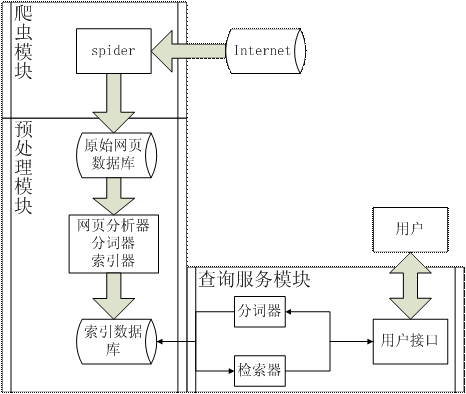
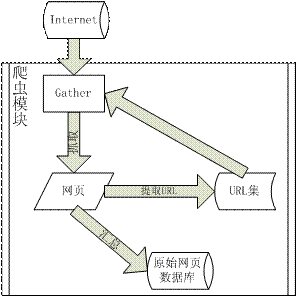

# 网络爬虫
dySE 的整体结构和爬虫模块的设计与实现

**标签:** Java,Web 开发

[原文链接](https://developer.ibm.com/zh/articles/j-lo-dyse1/)

董宇

发布: 2010-07-30

* * *

自己动手写一个搜索引擎，想想这有多 cool：在界面上输入关键词，点击搜索，得到自己想要的结果；那么它还可以做什么呢？也许是自己的网站需要一个站内搜索功能，抑或是对于硬盘中文档的搜索 —— 最重要的是，是不是觉得众多 IT 公司都在向你招手呢？如果你心动了，那么，Let’s Go！

这里首先要说明使用 Java 语言而不是 C/C++ 等其它语言的原因，因为 Java 中提供了对于网络编程众多的基础包和类，比如 URL 类、InetAddress 类、正则表达式，这为我们的搜索引擎实现提供了良好的基础，使我们可以专注于搜索引擎本身的实现，而不需要因为这些基础类的实现而分心。

这个分三部分的系列将逐步说明如何设计和实现一个搜索引擎。在第一部分中，您将首先学习搜索引擎的工作原理，同时了解其体系结构，之后将讲解如何实现搜索引擎的第一部分，网络爬虫模块，即完成网页搜集功能。在系列的第二部分中，将介绍预处理模块，即如何处理收集来的网页，整理、分词以及索引的建立都在这部分之中。在系列的第三部分中，将介绍信息查询服务的实现，主要是查询界面的建立、查询结果的返回以及快照的实现。

## dySE 的整体结构

在开始学习搜索引擎的模块实现之前，您需要了解 dySE 的整体结构以及数据传输的流程。事实上，搜索引擎的三个部分是相互独立的，三个部分分别工作，主要的关系体现在前一部分得到的数据结果为后一部分提供原始数据。三者的关系如下图所示：

##### 图 1\. 搜索引擎三段式工作流程


在介绍搜索引擎的整体结构之前，我们借鉴《计算机网络——自顶向下的方法描述因特网特色》一书的叙事方法，从普通用户使用搜索引擎的角度来介绍搜索引擎的具体工作流程。

自顶向下的方法描述搜索引擎执行过程：

- 用户通过浏览器提交查询的词或者短语 P，搜索引擎根据用户的查询返回匹配的网页信息列表 L；
- 上述过程涉及到两个问题，如何匹配用户的查询以及网页信息列表从何而来，根据什么而排序？用户的查询 P 经过分词器被切割成小词组 <p1,p2… pn> 并被剔除停用词 ( 的、了、啊等字 )，根据系统维护的一个倒排索引可以查询某个词 pi 在哪些网页中出现过，匹配那些 <p1,p2… pn> 都出现的网页集即可作为初始结果，更进一步，返回的初始网页集通过计算与查询词的相关度从而得到网页排名，即 Page Rank，按照网页的排名顺序即可得到最终的网页列表；
- 假设分词器和网页排名的计算公式都是既定的，那么倒排索引以及原始网页集从何而来？原始网页集在之前的数据流程的介绍中，可以得知是由爬虫 spider 爬取网页并且保存在本地的，而倒排索引，即词组到网页的映射表是建立在正排索引的基础上的，后者是分析了网页的内容并对其内容进行分词后，得到的网页到词组的映射表，将正排索引倒置即可得到倒排索引；
- 网页的分析具体做什么呢？由于爬虫收集来的原始网页中包含很多信息，比如 html 表单以及一些垃圾信息比如广告，网页分析去除这些信息，并抽取其中的正文信息作为后续的基础数据。

在有了上述的分析之后，我们可以得到搜索引擎的整体结构如下图：

##### 图 2\. 搜索引擎整体结构



爬虫从 Internet 中爬取众多的网页作为原始网页库存储于本地，然后网页分析器抽取网页中的主题内容交给分词器进行分词，得到的结果用索引器建立正排和倒排索引，这样就得到了索引数据库，用户查询时，在通过分词器切割输入的查询词组并通过检索器在索引数据库中进行查询，得到的结果返回给用户。

无论搜索引擎的规模大小，其主要结构都是由这几部分构成的，并没有大的差别，搜索引擎的好坏主要是决定于各部分的内部实现。

有了上述的对与搜索引擎的整体了解，我们来学习 dySE 中爬虫模块的具体设计和实现。

## Spider 的设计

网页收集的过程如同图的遍历，其中网页就作为图中的节点，而网页中的超链接则作为图中的边，通过某网页的超链接 得到其他网页的地址，从而可以进一步的进行网页收集；图的遍历分为广度优先和深度优先两种方法，网页的收集过程也是如此。综上，Spider 收集网页的过程如下：从初始 URL 集合获得目标网页地址，通过网络连接接收网页数据，将获得的网页数据添加到网页库中并且分析该网页中的其他 URL 链接，放入未访问 URL 集合用于网页收集。下图表示了这个过程：

##### 图 3\. Spider 工作流程



## Spider 的具体实现

### 网页收集器 Gather

网页收集器通过一个 URL 来获取该 URL 对应的网页数据，其实现主要是利用 Java 中的 URLConnection 类来打开 URL 对应页面的网络连接，然后通过 I/O 流读取其中的数据，BufferedReader 提供读取数据的缓冲区提高数据读取的效率以及其下定义的 readLine() 行读取函数。代码如下 ( 省略了异常处理部分 )：

##### 清单 1\. 网页数据抓取

```
URL url = new URL("http://www.xxx.com”);
URLConnection conn = url.openConnection();
BufferedReader reader = new BufferedReader(new InputStreamReader(conn.getInputStream()));
String line = null;
while((line = reader.readLine()) != null)
    document.append(line + "\n");

```

Show moreShow more icon

使用 Java 语言的好处是不需要自己处理底层的连接操作，喜欢或者精通 Java 网络编程的读者也可以不用上述的方法，自己实现 URL 类及相关操作，这也是一种很好的锻炼。

### 网页处理

收集到的单个网页，需要进行两种不同的处理，一种是放入网页库，作为后续处理的原始数据；另一种是被分析之后，抽取其中的 URL 连接，放入 URL 池等待对应网页的收集。

网页的保存需要按照一定的格式，以便以后数据的批量处理。这里介绍一种存储数据格式，该格式从北大天网的存储格式简化而来：

- 网页库由若干记录组成，每个记录包含一条网页数据信息，记录的存放为顺序添加；
- 一条记录由数据头、数据、空行组成，顺序为：头部 \+ 空行 \+ 数据 \+ 空行；
- 头部由若干属性组成，有：版本号，日期，IP 地址，数据长度，按照属性名和属性值的方式排列，中间加冒号，每个属性占用一行；
- 数据即为网页数据。

需要说明的是，添加数据收集日期的原因，由于许多网站的内容都是动态变化的，比如一些大型门户网站的首页内容，这就意味着如果不是当天爬取的网页数据，很可能发生数据过期的问题，所以需要添加日期信息加以识别。

URL 的提取分为两步，第一步是 URL 识别，第二步再进行 URL 的整理，分两步走主要是因为有些网站的链接是采用相对路径，如果不整理会产生错误。URL 的识别主要是通过正则表达式来匹配，过程首先设定一个字符串作为匹配的字符串模式，然后在 Pattern 中编译后即可使用 Matcher 类来进行相应字符串的匹配。实现代码如下：

##### 清单 2\. URL 识别

```
public ArrayList<URL> urlDetector(String htmlDoc){
    final String patternString = "<[a|A]\\s+href=([^>]*\\s*>)";
    Pattern pattern = Pattern.compile(patternString,Pattern.CASE_INSENSITIVE);
    ArrayList<URL> allURLs = new ArrayList<URL>();
    Matcher matcher = pattern.matcher(htmlDoc);
    String tempURL;
    //初次匹配到的url是形如：<a href="http://bbs.life.xxx.com.cn/" target="_blank">
    //为此，需要进行下一步的处理，把真正的url抽取出来，
    //可以对于前两个"之间的部分进行记录得到url
    while(matcher.find()){
        try {
            tempURL = matcher.group();
            tempURL = tempURL.substring(tempURL.indexOf("\"")+1);
            if(!tempURL.contains("\""))
                continue;
            tempURL = tempURL.substring(0, tempURL.indexOf("\""));
        } catch (MalformedURLException e) {
            e.printStackTrace();
        }
    }
    return allURLs;
}

```

Show moreShow more icon

按照 `<[a|A]\\s+href=([^>]*\\s*>)` 这个正则表达式可以匹配出 URL 所在的整个标签，形如 `<a href="http://bbs.life.xxx.com.cn/" target="_blank">` ，所以在循环获得整个标签之后，需要进一步提取出真正的 URL，我们可以通过截取标签中前两个引号中间的内容来获得这段内容。如此之后，我们可以得到一个初步的属于该网页的 URL 集合。

接下来我们进行第二步操作，URL 的整理，即对之前获得的整个页面中 URL 集合进行筛选和整合。整合主要是针对网页地址是相对链接的部分，由于我们可以很容易的获得当前网页的 URL，所以，相对链接只需要在当前网页的 URL 上添加相对链接的字段即可组成完整的 URL，从而完成整合。另一方面，在页面中包含的全面 URL 中，有一些网页比如广告网页是我们不想爬取的，或者不重要的，这里我们主要针对于页面中的广告进行一个简单处理。一般网站的广告连接都有相应的显示表达，比如连接中含有”ad”等表达时，可以将该链接的优先级降低，这样就可以一定程度的避免广告链接的爬取。

经过这两步操作时候，可以把该网页的收集到的 URL 放入 URL 池中，接下来我们处理爬虫的 URL 的派分问题。

### Dispatcher 分配器

分配器管理 URL，负责保存着 URL 池并且在 Gather 取得某一个网页之后派分新的 URL，还要避免网页的重复收集。分配器采用设计模式中的单例模式编码，负责提供给 Gather 新的 URL，因为涉及到之后的多线程改写，所以单例模式显得尤为重要。

重复收集是指物理上存在的一个网页，在没有更新的前提下，被 Gather 重复访问，造成资源的浪费，主要原因是没有清楚的记录已经访问的 URL 而无法辨别。所以，Dispatcher 维护两个列表 ,”已访问表”，和”未访问表”。每个 URL 对应的页面被抓取之后，该 URL 放入已访问表中，而从该页面提取出来的 URL 则放入未访问表中；当 Gather 向 Dispatcher 请求 URL 的时候，先验证该 URL 是否在已访问表中，然后再给 Gather 进行作业。

### Spider 启动多个 Gather 线程

现在 Internet 中的网页数量数以亿计，而单独的一个 Gather 来进行网页收集显然效率不足，所以我们需要利用多线程的方法来提高效率。Gather 的功能是收集网页，我们可以通过 Spider 类来开启多个 Gather 线程，从而达到多线程的目的。代码如下：

```
/**
* 启动线程 gather，然后开始收集网页资料
*/
public void start() {
    Dispatcher disp = Dispatcher.getInstance();
    for(int i = 0; i < gatherNum; i++){
        Thread gather = new Thread(new Gather(disp));
        gather.start();
    }
}

```

Show moreShow more icon

在开启线程之后，网页收集器开始作业的运作，并在一个作业完成之后，向 Dispatcher 申请下一个作业，因为有了多线程的 Gather，为了避免线程不安全，需要对 Dispatcher 进行互斥访问，在其函数之中添加 synchronized 关键词，从而达到线程的安全访问。

## 结束语

Spider 是整个搜索引擎的基础，为后续的操作提供原始网页资料，所以了解 Spider 的编写以及网页库的组成结构为后续预处理模块打下基础。同时 Spider 稍加修改之后也可以单独用于某类具体信息的搜集，比如某个网站的图片爬取等。

## 后续内容

在本系列的 [第 2 部分](https://www.ibm.com/developerworks/cn/java/j-lo-dyse2/index.html) 中，您将了解到爬虫获取的网页库如何被预处理模块逐步提取内容信息，通过分词并建成倒排索引；而在 [第 3 部分](https://www.ibm.com/developerworks/cn/java/j-lo-dyse3/index.html) 中，您将了解到，如何编写网页来提供查询服务，并且如何显示的返回的结果和完成快照的功能。