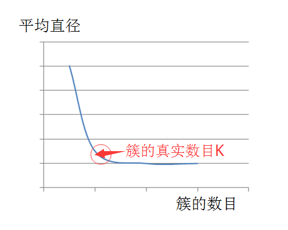
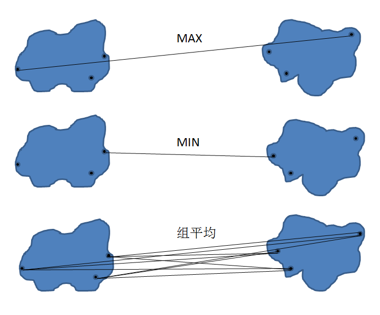
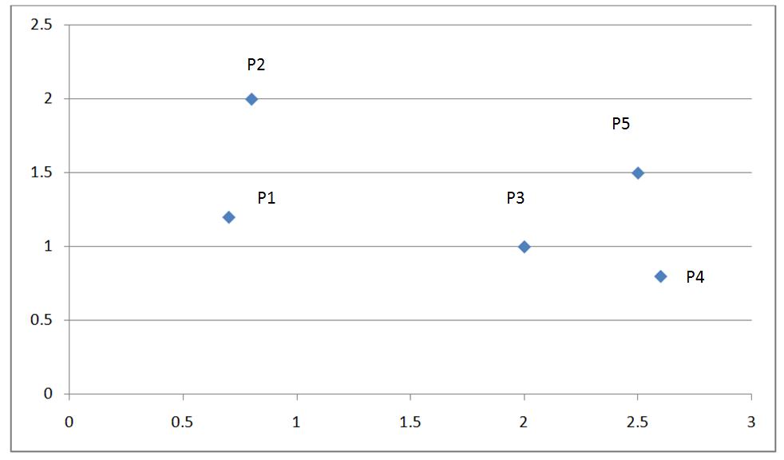
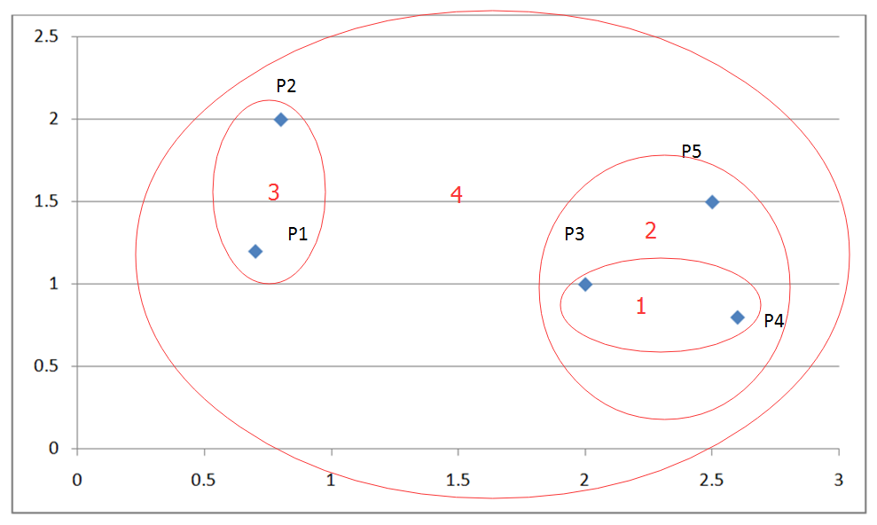
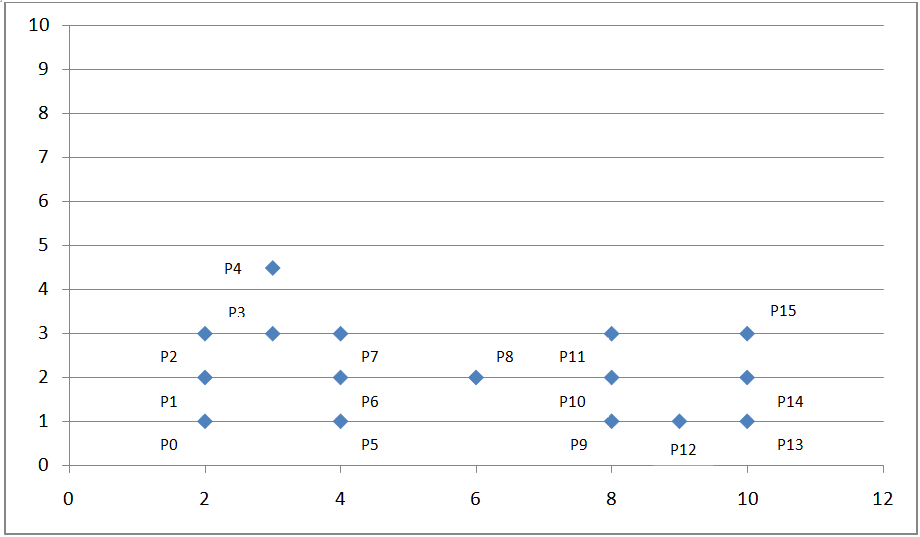
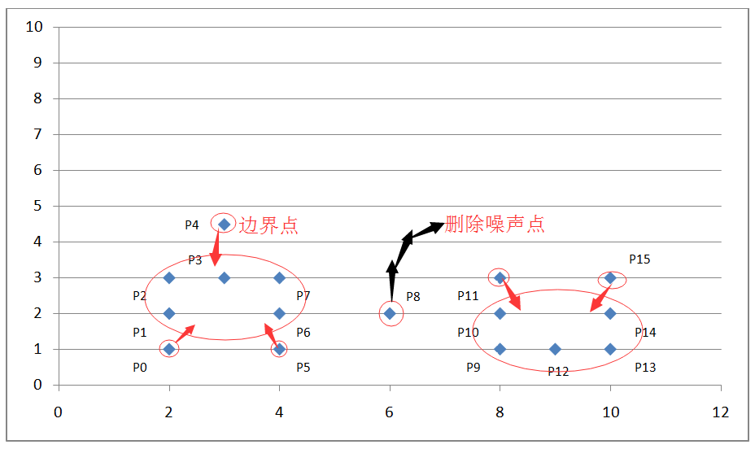

# 聚类分析经典算法讲解及实现
深入了解聚类算法

**标签:** 分析

[原文链接](https://developer.ibm.com/zh/articles/ba-1607-clustering-algorithm/)

杨翔宇, 段伟玮

发布: 2016-07-18

* * *

## 前言

本文将系统的讲解数据挖掘领域的经典聚类算法，并给予代码实现示例。虽然当下已有很多平台都集成了数据挖掘领域的经典算法模块，但笔者认为要深入理解算法的核心，剖析算法的执行过程，那么通过代码的实现及运行结果来进行算法的验证，这样的过程是很有必要的。因此本文，将有助于读者对经典聚类算法的深入学习与理解。

## 聚类和分类的区别

一开始笔者就想谈谈这个话题，毕竟在数据挖掘算法领域，这两者有着很大的差别，对于初学者很容易混淆。抛开晦涩的定义陈述，在此我们先通过两个生活比喻看看什么是监督学习，什么是非监督学习。

回首我们人生最美好的豆蔻年华，那时的我们，少年初长成，结束了小学生涯，步入初中，这个年龄是我们人生中第一个分水岭。初中一年级刚入学时，同学们之间彼此不认识，老师对同学们也都不熟悉。但随着时间的推移，同学们基本上都分成了三五群，回想一下那时的我们，是不是整天玩在一起的同学总是那几个？我们发现，这个过程老师是不参与的，老师不会让同学们分成几组，让哪几个同学经常在一起学习和玩耍。想想这个过程，其实是我们自己辨别和哪些同学合得来一个过程，这期间我们可能会判断同学的性格，学习成绩，共同爱好与话题，是否和同学家离的很近还能一起上学和回家等等很多的维度因素。时间久了，班级里就会出现不同的几个圈子，这个圈子的数量及细节一开始并没有人知晓，并且这个过程无老师进行监督，因此我们视之为无监督学习。在此我们指出，聚类算法是无监督学习的算法。

初中三年级，因为我们背负着中考的重担，大家都为了自己的理想高中做最后的冲刺努力。设想这样一种情况：为了更好的帮助大家不断提高学习成绩，班主任老师将班级分成了五个互帮互助小组（语文、数学、物理、生物、英语），每个小组十位同学，分别是班级里这几个科目考试成绩最好的前十名同学，为了达到更好的互帮互助效果，每位达到条件要求的同学只能加入一门科目小组，也就是说，如果某位同学有两门或两门以上的科目都排在班级前十名，则班主任老师随机指定其加入某一小组。这样所有同学都可以在互帮互助小组的帮助下更大程度的提升自己的薄弱科目，实现共赢。在此我们可以看到小组的种类，数量，都是定义好的，只需要老师指定好各个小组的成员。因此，这样的学习过程是一种监督学习过程，老师给出小组的种类和数量用排名的方式来监督并激励学生学习。在此我们指出，分类算法是监督学习的算法。

总结一下，数据分类是分析已有的数据，寻找其共同的属性，并根据分类模型将这些数据划分成不同的类别，这些数据赋予类标号。这些类别是事先定义好的，并且类别数是已知的。相反，数据聚类则是将本没有类别参考的数据进行分析并划分为不同的组，即从这些数据导出类标号。聚类分析本身则是根据数据来发掘数据对象及其关系信息，并将这些数据分组。每个组内的对象之间是相似的，而各个组间的对象是不相关的。不难理解，组内相似性越高，组间相异性越高，则聚类越好。

## K 均值算法详解及实现

### 算法流程

K 均值算法，应该是聚类算法中最为基础但也最为重要的算法。其算法流程如下：

1. 随机的取 k 个点作为 k 个初始质心；
2. 计算其他点到这个 k 个质心的距离；
3. 如果某个点 p 离第 n 个质心的距离更近，则该点属于 cluster n，并对其打标签，标注 point p.label=n，其中 n<=k；
4. 计算同一 cluster 中，也就是相同 label 的点向量的平均值，作为新的质心；
5. 迭代至所有质心都不变化为止，即算法结束。

当然算法实现的方法有很多，比如在选择初始质心时，可以随机选择 k 个，也可以随机选择 k 个离得最远的点等等，方法不尽相同。

### K 值估计

对于 k 值，必须提前知道，这也是 kmeans 算法的一个缺点。当然对于 k 值，我们可以有很多种方法进行估计。本文中，我们采用平均直径法来进行 k 的估计。

也就是说，首先视所有的点为一个大的整体 cluster，计算所有点之间距离的平均值作为该 cluster 的平均直径。选择初始质心的时候，先选择最远的两个点，接下来从这最两个点开始，与这最两个点距离都很远的点（远的程度为，该点到之前选择的最远的两个点的距离都大于整体 cluster 的平均直径）可视为新发现的质心，否则不视之为质心。设想一下，如果利用平均半径或平均直径这一个指标，若我们猜想的 K 值大于或等于真实的 K 值，也就是簇的真实数目，那么该指标的上升趋势会很缓慢，但是如果我们给出的 K 值小于真实的簇的数目时，这个指标一定会急剧上升。

根据这样的估算思想，我们就能估计出正确的 k 值，并且得到 k 个初始质心，接着，我们便根据上述算法流程继续进行迭代，直到所有质心都不变化，从而成功实现算法。如下图所示：

##### 图 1\. K 值估计



我们知道 k 均值总是收敛的，也就是说，k 均值算法一定会达到一种稳定状态，在此状态下，所有的点都不会从一个簇转移到另一个簇，因此质心不在发生改变。在此，我们引出一个剪枝优化，即：k 均值最明显的收敛过程会发生在算法运行的前期阶段，故在某些情况下为了增加算法的执行效率，我们可以替换上述算法的第五步，采用”迭代至仅有 1%~3%的点在影响质心”或”迭代至仅有 1%~3%的点在改变簇”。

k 均值适用于绝大多数的数据类型，并且简单有效。但其缺点就是需要知道准确的 k 值，并且不能处理异形簇，比如球形簇，不同尺寸及密度的簇，环形簇等等。

本文主要为算法讲解及实现，因此代码实现暂不考虑面向对象思想，采用面向过程的实现方式，如果数据多维，可能会需要做数据预处理，比如归一化，并且修改代码相关方法即可。

### 算法实现

##### 清单 1\. Kmeans 算法代码实现

```
import java.io.BufferedReader;
import java.io.FileReader;
import java.io.IOException;
import java.io.PrintStream;
import java.text.DecimalFormat;
import java.util.ArrayList;
import java.util.Comparator;
import java.util.PriorityQueue;
import java.util.Queue;

public class Kmeans {
private class Node {
int label;// label 用来记录点属于第几个 cluster
double[] attributes;

public Node() {
attributes = new double[100];
}
}

private class NodeComparator {
Node nodeOne;
Node nodeTwo;
double distance;

public void compute() {
double val = 0;
for (int i = 0; i < dimension; ++i) {
val += (this.nodeOne.attributes[i] - this.nodeTwo.attributes[i]) *
                             (this.nodeOne.attributes[i] - this.nodeTwo.attributes[i]);
}
this.distance = val;
}
}

private ArrayList<Node> arraylist;
private ArrayList<Node> centroidList;
private double averageDis;
private int dimension;
private Queue<NodeComparator> FsQueue =
                 new PriorityQueue<NodeComparator>(150, // 用来排序任意两点之间的距离，从大到小排
new Comparator<NodeComparator>() {
public int compare(NodeComparator one, NodeComparator two) {
if (one.distance < two.distance)
return 1;
else if (one.distance > two.distance)
return -1;
else
return 0;
}
});

public void setKmeansInput(String path) {
try {
BufferedReader br = new BufferedReader(new FileReader(path));
String str;
String[] strArray;
arraylist = new ArrayList<Node>();
while ((str = br.readLine()) != null) {
strArray = str.split(",");
dimension = strArray.length;
Node node = new Node();
for (int i = 0; i < dimension; ++i) {
node.attributes[i] = Double.parseDouble(strArray[i]);
}
arraylist.add(node);
}
br.close();
} catch (IOException e) {
e.printStackTrace();
}
}

public void computeTheK() {
int cntTuple = 0;
for (int i = 0; i < arraylist.size() - 1; ++i) {
for (int j = i + 1; j < arraylist.size(); ++j) {
NodeComparator nodecomp = new NodeComparator();
nodecomp.nodeOne = new Node();
nodecomp.nodeTwo = new Node();
for (int k = 0; k < dimension; ++k) {
nodecomp.nodeOne.attributes[k] = arraylist.get(i).attributes[k];
nodecomp.nodeTwo.attributes[k] = arraylist.get(j).attributes[k];
}
nodecomp.compute();
averageDis += nodecomp.distance;
FsQueue.add(nodecomp);
cntTuple++;
}
}
averageDis /= cntTuple;// 计算平均距离
chooseCentroid(FsQueue);
}

public double getDistance(Node one, Node two) {// 计算两点间的欧氏距离
double val = 0;
for (int i = 0; i < dimension; ++i) {
val += (one.attributes[i] - two.attributes[i]) * (one.attributes[i] - two.attributes[i]);
}
return val;
}

public void chooseCentroid(Queue<NodeComparator> queue) {
centroidList = new ArrayList<Node>();
boolean flag = false;
while (!queue.isEmpty()) {
boolean judgeOne = false;
boolean judgeTwo = false;
NodeComparator nc = FsQueue.poll();
if (nc.distance < averageDis)
break;// 如果接下来的元组，两节点间距离小于平均距离，则不继续迭代
if (!flag) {
centroidList.add(nc.nodeOne);// 先加入所有点中距离最远的两个点
centroidList.add(nc.nodeTwo);
flag = true;
} else {// 之后从之前已加入的最远的两个点开始，找离这两个点最远的点，
// 如果距离大于所有点的平均距离，则认为找到了新的质心，否则不认定为质心
for (int i = 0; i < centroidList.size(); ++i) {
Node testnode = centroidList.get(i);
if (centroidList.contains(nc.nodeOne) || getDistance(testnode, nc.nodeOne) < averageDis) {
judgeOne = true;
}
if (centroidList.contains(nc.nodeTwo) || getDistance(testnode, nc.nodeTwo) < averageDis) {
judgeTwo = true;
}
}
if (!judgeOne) {
centroidList.add(nc.nodeOne);
}
if (!judgeTwo) {
centroidList.add(nc.nodeTwo);
}
}
}
}

public void doIteration(ArrayList<Node> centroid) {

int cnt = 1;
int cntEnd = 0;
int numLabel = centroid.size();
while (true) {// 迭代，直到所有的质心都不变化为止
boolean flag = false;
for (int i = 0; i < arraylist.size(); ++i) {
double dis = 0x7fffffff;
cnt = 1;
for (int j = 0; j < centroid.size(); ++j) {
Node node = centroid.get(j);
if (getDistance(arraylist.get(i), node) < dis) {
dis = getDistance(arraylist.get(i), node);
arraylist.get(i).label = cnt;
}
cnt++;
}
}
int j = 0;
numLabel -= 1;
while (j < numLabel) {
int c = 0;
Node node = new Node();
for (int i = 0; i < arraylist.size(); ++i) {
if (arraylist.get(i).label == j + 1) {
for (int k = 0; k < dimension; ++k) {
node.attributes[k] += arraylist.get(i).attributes[k];
}
c++;
}
}
DecimalFormat df = new DecimalFormat("#.###");// 保留小数点后三位
double[] attributelist = new double[100];
for (int i = 0; i < dimension; ++i) {
attributelist[i] = Double.parseDouble(df.format(node.attributes[i] / c));
if (attributelist[i] != centroid.get(j).attributes[i]) {
centroid.get(j).attributes[i] = attributelist[i];
flag = true;
}
}
if (!flag) {
cntEnd++;
if (cntEnd == numLabel) {// 若所有的质心都不变，则跳出循环
break;
}
}
j++;
}
if (cntEnd == numLabel) {// 若所有的质心都不变，则 success
System.out.println("run kmeans successfully.");
break;
}
}
}

public void printKmeansResults(String path) {
try {
PrintStream out = new PrintStream(path);
computeTheK();
doIteration(centroidList);
out.println("There are " + centroidList.size() + " clusters!");
for (int i = 0; i < arraylist.size(); ++i) {
out.print("(");
for (int j = 0; j < dimension - 1; ++j) {
out.print(arraylist.get(i).attributes[j] + ", ");
}
out.print(arraylist.get(i).attributes[dimension - 1] + ") ");
out.println("belongs to cluster " + arraylist.get(i).label);
}
out.close();
System.out.println("Please check results in: " + path);
} catch (IOException e) {
e.printStackTrace();
}
}

public static void main(String[] args) {
Kmeans kmeans = new Kmeans();
kmeans.setKmeansInput("c:/kmeans.txt");
kmeans.printKmeansResults("c:/kmeansResults.txt");

}
}

```

Show moreShow more icon

### 测试数据

给出一组简单的二维测试数据：

##### 清单 2\. Kmeans 算法测试数据

```
1,1
2,1
1,2
2,2
6,1
6,2
7,1
7,2
1,5
1,6
2,5
2,6
6,5
6,6
7,5
7,6

```

Show moreShow more icon

### 运行结果

##### 清单 3\. Kmeans 算法运行结果

```
There are 4 clusters!
(1.0, 1.0) belongs to cluster 1
(2.0, 1.0) belongs to cluster 1
(1.0, 2.0) belongs to cluster 1
(2.0, 2.0) belongs to cluster 1
(6.0, 1.0) belongs to cluster 3
(6.0, 2.0) belongs to cluster 3
(7.0, 1.0) belongs to cluster 3
(7.0, 2.0) belongs to cluster 3
(1.0, 5.0) belongs to cluster 4
(1.0, 6.0) belongs to cluster 4
(2.0, 5.0) belongs to cluster 4
(2.0, 6.0) belongs to cluster 4
(6.0, 5.0) belongs to cluster 2
(6.0, 6.0) belongs to cluster 2
(7.0, 5.0) belongs to cluster 2
(7.0, 6.0) belongs to cluster 2

```

Show moreShow more icon

## 层次聚类算法详解及实现

### 层次聚类简介

层次聚类分为凝聚式层次聚类和分裂式层次聚类。

凝聚式层次聚类，就是在初始阶段将每一个点都视为一个簇，之后每一次合并两个最接近的簇，当然对于接近程度的定义则需要指定簇的邻近准则。

分裂式层次聚类，就是在初始阶段将所有的点视为一个簇，之后每次分裂出一个簇，直到最后剩下单个点的簇为止。

本文中我们将详细介绍凝聚式层次聚类算法。

对于凝聚式层次聚类，指定簇的邻近准则是非常重要的一个环节，在此我们介绍三种最常用的准则，分别是 MAX, MIN, 组平均。如下图所示：

##### 图 2\. 层次聚类计算准则



### 算法流程

凝聚式层次聚类算法也是一个迭代的过程，算法流程如下：

1. 每次选最近的两个簇合并，我们将这两个合并后的簇称之为合并簇。
2. 若采用 MAX 准则，选择其他簇与合并簇中离得最远的两个点之间的距离作为簇之间的邻近度。若采用 MIN 准则，取其他簇与合并簇中离得最近的两个点之间的距离作为簇之间的邻近度。若组平均准则，取其他簇与合并簇所有点之间距离的平均值作为簇之间的邻近度。
3. 重复步骤 1 和步骤 2，合并至只剩下一个簇。

### 算法过程举例

下面我们看一个例子：

下图是一个有五个点的而为坐标系：

##### 图 3\. 层次聚类举例



下表为这五个点的欧式距离矩阵：

##### 表 1\. 欧式距离原始矩阵

P1P2P3P4P5P100.811.321.941.82P20.8101.562.161.77P31.321.5600.630.71P41.942.160.6300.71P51.821.770.710.710

根据算法流程，我们先找出距离最近的两个簇，P3, P4。

合并 P3, P4 为 {P3, P4}，根据 MIN 原则更新矩阵如下：

MIN.distance({P3, P4}, P1) = 1.32;

MIN.distance({P3, P4}, P2) = 1.56;

MIN.distance({P3, P4}, P5) = 0.70;

##### 表 2\. 欧式距离更新矩阵 1

P1P2{P3, P4}P5P100.811.321.82P20.8101.561.77{P3, P4}1.321.5600.71P51.821.770.710

接着继续找出距离最近的两个簇，{P3, P4}, P5。

合并 {P3, P4}, P5 为 {P3, P4, P5}，根据 MIN 原则继续更新矩阵：

MIN.distance(P1, {P3, P4, P5}) = 1.32;

MIN.distance(P2, {P3, P4, P5}) = 1.56;

##### 表 3\. 欧式距离更新矩阵 2

P1P2{P3, P4, P5}P100.811.32P20.8101.56{P3, P4, P5}1.321.560

接着继续找出距离最近的两个簇，P1, P2。

合并 P1, P2 为 {P1, P2}，根据 MIN 原则继续更新矩阵：

MIN.distance({P1,P2}, {P3, P4, P5}) = 1.32

##### 表 4\. 欧式距离更新矩阵 3

{P1, P2}{P3, P4, P5}{P1, P2}01.32{P3, P4, P5}1.320

最终合并剩下的这两个簇即可获得最终结果，如下图：

##### 图 4\. 层次聚类举例结果



MAX，组平均算法流程同理，只是在更新矩阵时将上述计算簇间距离变为簇间两点最大欧式距离，和簇间所有点平均欧式距离即可。

### 算法实现

##### 清单 4\. 层次聚类算法代码实现

```
import java.io.BufferedReader;
import java.io.FileReader;
import java.io.IOException;
import java.io.PrintStream;
import java.text.DecimalFormat;
import java.util.ArrayList;

public class Hierarchical {
private double[][] matrix;
private int dimension;// 数据维度

private class Node {
double[] attributes;

public Node() {
attributes = new double[100];
}
}

private ArrayList<Node> arraylist;

private class Model {
int x = 0;
int y = 0;
double value = 0;
}

private Model minModel = new Model();

private double getDistance(Node one, Node two) {// 计算两点间的欧氏距离
double val = 0;
for (int i = 0; i < dimension; ++i) {
val += (one.attributes[i] - two.attributes[i]) * (one.attributes[i] - two.attributes[i]);
}
return Math.sqrt(val);
}

private void loadMatrix() {// 将输入数据转化为矩阵
for (int i = 0; i < matrix.length; ++i) {
for (int j = i + 1; j < matrix.length; ++j) {
double distance = getDistance(arraylist.get(i), arraylist.get(j));
matrix[i][j] = distance;
}
}
}

private Model findMinValueOfMatrix(double[][] matrix) {// 找出矩阵中距离最近的两个簇
Model model = new Model();
double min = 0x7fffffff;
for (int i = 0; i < matrix.length; ++i) {
for (int j = i + 1; j < matrix.length; ++j) {
if (min > matrix[i][j] && matrix[i][j] != 0) {
min = matrix[i][j];
model.x = i;
model.y = j;
model.value = matrix[i][j];
}
}
}
return model;
}

private void processHierarchical(String path) {
try {
PrintStream out = new PrintStream(path);
while (true) {// 凝聚层次聚类迭代
out.println("Matrix update as below: ");
for (int i = 0; i < matrix.length; ++i) {// 输出每次迭代更新的矩阵
for (int j = 0; j < matrix.length - 1; ++j) {
out.print(new DecimalFormat("#.00").format(matrix[i][j]) + " ");
}
out.println(new DecimalFormat("#.00").format(matrix[i][matrix.length - 1]));
}
out.println();
minModel = findMinValueOfMatrix(matrix);
if (minModel.value == 0) {// 当找不出距离最近的两个簇时，迭代结束
break;
}
out.println("Combine " + (minModel.x + 1) + " " + (minModel.y + 1));
out.println("The distance is: " + minModel.value);

matrix[minModel.x][minModel.y] = 0;// 更新矩阵
for (int i = 0; i < matrix.length; ++i) {// 如果合并了点 p1 与 p2，则只保留 p1,p2 其中之一与其他点的距离，取较小值
if (matrix[i][minModel.x] <= matrix[i][minModel.y]) {
matrix[i][minModel.y] = 0;
} else {
matrix[i][minModel.x] = 0;
}
if (matrix[minModel.x][i] <= matrix[minModel.y][i]) {
matrix[minModel.y][i] = 0;
} else {
matrix[minModel.x][i] = 0;
}
}
}

out.close();
System.out.println("Please check results in: " + path);
} catch (Exception e) {
e.printStackTrace();
}
}

public void setInput(String path) {
try {
BufferedReader br = new BufferedReader(new FileReader(path));
String str;
String[] strArray;
arraylist = new ArrayList<Node>();
while ((str = br.readLine()) != null) {
strArray = str.split(",");
dimension = strArray.length;
Node node = new Node();
for (int i = 0; i < dimension; ++i) {
node.attributes[i] = Double.parseDouble(strArray[i]);
}
arraylist.add(node);
}
matrix = new double[arraylist.size()][arraylist.size()];
loadMatrix();
br.close();
} catch (IOException e) {
e.printStackTrace();
}
}

public void printOutput(String path) {
processHierarchical(path);
}

public static void main(String[] args) {
Hierarchical hi = new Hierarchical();
hi.setInput("c:/hierarchical.txt");
hi.printOutput("c:/hierarchical_results.txt");
}
}

```

Show moreShow more icon

### 测试数据

给出一组简单的二维测试数据

##### 清单 5\. 层次聚类算法测试数据

```
0.7,1.2
0.8,2
2,1
2.6,0.8
2.5,1.5

```

Show moreShow more icon

### 运行结果

##### 清单 6\. 层次聚类算法运行结果

```
Matrix update as below:
.00 .81 1.32 1.94 1.82
.00 .00 1.56 2.16 1.77
.00 .00 .00 .63 .71
.00 .00 .00 .00 .71
.00 .00 .00 .00 .00

Combine 3 4
The distance is: 0.6324555320336759
Matrix update as below:
.00 .81 1.32 .00 1.82
.00 .00 1.56 .00 1.77
.00 .00 .00 .00 .00
.00 .00 .00 .00 .71
.00 .00 .00 .00 .00

Combine 4 5
The distance is: 0.7071067811865475
Matrix update as below:
.00 .81 1.32 .00 .00
.00 .00 1.56 .00 .00
.00 .00 .00 .00 .00
.00 .00 .00 .00 .00
.00 .00 .00 .00 .00

Combine 1 2
The distance is: 0.806225774829855
Matrix update as below:
.00 .00 1.32 .00 .00
.00 .00 .00 .00 .00
.00 .00 .00 .00 .00
.00 .00 .00 .00 .00
.00 .00 .00 .00 .00

Combine 1 3
The distance is: 1.3152946437965907
Matrix update as below:
.00 .00 .00 .00 .00
.00 .00 .00 .00 .00
.00 .00 .00 .00 .00
.00 .00 .00 .00 .00
.00 .00 .00 .00 .00

```

Show moreShow more icon

## DBSCAN 算法详解及实现

考虑一种情况，点的分布不均匀，形状不规则时，Kmeans 算法及层次聚类算法将面临失效的风险。

如下坐标系：

##### 图 5\. DBSCAN 算法举例



我们可以看到上面的点密度不均匀，这时我们考虑采用基于密度的聚类算法：DBSCAN。

### 算法流程

1. 设定扫描半径 Eps, 并规定扫描半径内的密度值。若当前点的半径范围内密度大于等于设定密度值，则设置当前点为核心点；若某点刚好在某核心点的半径边缘上，则设定此点为边界点；若某点既不是核心点又不是边界点，则此点为噪声点。
2. 删除噪声点。
3. 将距离在扫描半径内的所有核心点赋予边进行连通。
4. 每组连通的核心点标记为一个簇。
5. 将所有边界点指定到与之对应的核心点的簇总。

### 算法过程举例

如上图坐标系所示，我们设定扫描半径 Eps 为 1.5，密度阈值 threshold 为 3，则通过上述算法过程，我们可以得到下图：

##### 图 6\. DBSCAN 算法举例结果示例



通过计算各个点之间的欧式距离及其所在扫描半径内的密度值来判断这些点属于核心点，边界点或是噪声点。因为我们设定了扫描半径为 1.5，密度阈值为 3，所以：

- P0 点为边界点，因为在以其为中心的扫描半径内只有两个点 P0 和 P1；
- P1 点为核心点，因为在以其为中心的扫描半径内有四个点 P0,P1,P2,P4 ；
- P8 为噪声点，因为其既非核心点，也非边界点；
- 其他点依次类推。

### 算法实现

##### 清单 7\. DBSCAN 算法代码实现

```
import java.io.BufferedReader;
import java.io.FileReader;
import java.io.IOException;
import java.io.PrintStream;
import java.util.ArrayList;
import java.util.HashMap;
import java.util.Iterator;
import java.util.Map;

public class DBSCAN {
private int dimension;// 数据维度
private double eps = 1.5;
private int threshold = 3;
private double distance[][];
private Map<Integer, Integer> id = new HashMap<Integer, Integer>();
private int countClusters = 0;
private ArrayList<Integer> keyPointList = new ArrayList<Integer>();//
private int[] flags;// 标记边缘点

private class Edge {
int p, q;
double weight;
}

private class Node {
double[] attributes;

public Node() {
attributes = new double[100];
}
}

private ArrayList<Node> nodeList;
private ArrayList<Edge> edgeList;

private double getDistance(Node one, Node two) {// 计算两点间的欧氏距离
double val = 0;
for (int i = 0; i < dimension; ++i) {
val += (one.attributes[i] - two.attributes[i]) * (one.attributes[i] - two.attributes[i]);
}
return Math.sqrt(val);
}

public void loadEdges() {// 给所有在扫描半径内的核心点之间加边，标记边界点并且自动忽略噪声点
edgeList = new ArrayList<Edge>();
flags = new int[nodeList.size()];
int[] countPoint = new int[nodeList.size()];
for (int i = 0; i < countPoint.length; ++i) {
countPoint[i] = 1;// 每一个点一开始都是核心点
}
for (int i = 0; i < nodeList.size(); ++i) {
for (int j = i + 1; j < nodeList.size(); ++j) {
distance[i][j] = getDistance(nodeList.get(i), nodeList.get(j));
if (distance[i][j] <= eps) {// 两点间距离小于扫描半径
countPoint[i]++;
if (countPoint[i] > 0 && countPoint[i] < threshold) {
flags[i] = j;// 记录边界点
}
if (countPoint[i] >= threshold) {// 如果记录当前点的扫描半径内密度值大于或等于给定阈值
flags[i] = 0;
if (!keyPointList.contains(i)) {
keyPointList.add(i);
}
}
countPoint[j]++;
if (countPoint[j] > 0 && countPoint[j] < threshold) {
flags[j] = i;// 记录边界点
}
if (countPoint[j] >= threshold) {// 如果记录当前点的扫描半径内密度值大于或等于给定阈值
flags[j] = 0;
if (!keyPointList.contains(j)) {
keyPointList.add(j);
}
}
}
}
}

for (int i = 0; i < keyPointList.size(); ++i) {
for (int j = i + 1; j < keyPointList.size(); ++j) {
Edge edge = new Edge();
edge.p = keyPointList.get(i);
edge.q = keyPointList.get(j);
edge.weight = distance[edge.p][edge.q];

if (edge.weight <= eps) {
if (!id.containsKey(edge.p)) {// 为后期使用并查集求连通分量做准备
id.put(edge.p, edge.p);
}
if (!id.containsKey(edge.q)) {
id.put(edge.q, edge.q);
}
edgeList.add(edge);
}
}
}

}

public void setInput(String path) {
try {
BufferedReader br = new BufferedReader(new FileReader(path));
String str;
String[] strArray;
nodeList = new ArrayList<Node>();
while ((str = br.readLine()) != null) {
strArray = str.split(",");
dimension = strArray.length;
Node node = new Node();
for (int i = 0; i < dimension; ++i) {
node.attributes[i] = Double.parseDouble(strArray[i]);
}
nodeList.add(node);
}
distance = new double[nodeList.size()][nodeList.size()];
loadEdges();
br.close();
} catch (IOException e) {
e.printStackTrace();
}
}

public void union(int p, int q) {// 并操作
int a = find(p);
int b = find(q);
if (a != b) {
id.put(a, b);
}
}

public int find(int p) {// 查操作
if (p != id.get(p)) {
id.put(p, find(id.get(p)));
}
return id.get(p);
}

public void processDBSCAN(String path) {
try {
PrintStream out = new PrintStream(path);
out.println("核心点为： " + keyPointList);
out.println();
for (int i = 0; i < edgeList.size(); ++i) {
out.println("核心点 (" + edgeList.get(i).p + " " +
                              edgeList.get(i).q + ") 之间的距离为: " + edgeList.get(i).weight);
}
for (int i = 0; i < edgeList.size(); ++i) {
union(edgeList.get(i).p, edgeList.get(i).q);// 利用并查集将点集变为连通分量
}

Iterator<Integer> it = id.keySet().iterator();
while (it.hasNext()) {
int key = it.next();
if (id.get(key) == key) {// 利用并查集得到强连通分量个数
++countClusters;
}
}
out.println();
for (int i = 0; i < flags.length; ++i) {
if (flags[i] != 0) {
out.println("点" + i + "属于点" + flags[i] + "所在的簇");
}
}
out.println();
out.println("由核心点连通分量数量得知共有: " + countClusters + "个簇");
out.close();
System.out.println("Please check results in: " + path);
} catch (Exception e) {
e.printStackTrace();
}
}

public void printOutput(String path) {
processDBSCAN(path);
}

public static void main(String[] args) {
DBSCAN dbscan = new DBSCAN();
dbscan.setInput("c:/dbscan.txt");
dbscan.printOutput("c:/dbscan_results.txt");
}
}

```

Show moreShow more icon

### 测试数据

##### 清单 8\. DBSCAN 算法测试数据

```
2,1
2,2
2,3
3,3
3,4.5
4,1
4,2
4,3
6,2
8,1
8,2
8,3
9,1
10,1
10,2
10,3

```

Show moreShow more icon

### 运行结果

##### 清单 9\. DBSCAN 算法运行结果

```
核心点为： [1, 2, 3, 6, 7, 9, 10, 12, 13, 14]

核心点 (1 2) 之间的距离为: 1.0
核心点 (1 3) 之间的距离为: 1.4142135623730951
核心点 (2 3) 之间的距离为: 1.0
核心点 (3 6) 之间的距离为: 1.4142135623730951
核心点 (3 7) 之间的距离为: 1.0
核心点 (6 7) 之间的距离为: 1.0
核心点 (9 10) 之间的距离为: 1.0
核心点 (9 12) 之间的距离为: 1.0
核心点 (10 12) 之间的距离为: 1.4142135623730951
核心点 (12 13) 之间的距离为: 1.0
核心点 (12 14) 之间的距离为: 1.4142135623730951
核心点 (13 14) 之间的距离为: 1.0

连通点 1 和点 2
连通点 1 和点 3
连通点 3 和点 6
连通点 3 和点 7
连通点 9 和点 10
连通点 9 和点 12
连通点 12 和点 13
连通点 12 和点 14
点 1、点 2、点 3、点 6、点 7 同属于簇 1
点 9、点 10、点 12、点 13、点 14 同属于簇 2

点 0 属于点 1 所在的簇
点 4 属于点 3 所在的簇
点 5 属于点 6 所在的簇
点 11 属于点 10 所在的簇
点 15 属于点 14 所在的簇

由核心点连通分量数量得知共有: 2 个簇

```

Show moreShow more icon

## 其他聚类算法简介

### BIRCH 算法

Birch 是一种能够高效处理大数据聚类的基于树的层次聚类算法。设想这样一种情况，一个拥有大规模数据的数据库，当这些数据被放入主存进行聚类处理时，一般的聚类算法则没有对应的高效处理能力，这时 Birch 算法是最佳的选择。

Birth 不仅能够高效地处理大数据聚类，并且能最小化 IO 花销。它不需要扫描全局数据已经现有的簇。

**算法流程**

聚类特征 CF=(N,LS,SS)，其中 N 代表簇中点的个数，LS 代表簇中代表簇中各点线性和，SS 代表簇中各点的平方和距离。聚类特征被应用于 CF 树中，CF 树是一种高度平衡树，它具有两个参数：平衡因子 B 和簇半径阈值 T。其中平衡因子 B 代表每一个非叶子节点最多能够引入 B 个实体条目。

叶子节点最多只能包含 L 个实体条目，并且它们具有前向后向指针，这样可以彼此链接起来。

树的大小取决于簇半径阈值 T 的大小。

1. 从根节点开始，递归查找与要插入的数据点距离最近的叶子节点中的实体条目，递归过程选择最短路径。
2. 比较上述计算出的数据点与叶子节点中实体条目间的最近距离是否小叶簇半径阈值 T，小于则吸收该数据点。否则执行下一步。
3. 判断当前条目所在的叶节点个数是否小于 L，若小于则直接将该数据点插入当前点。否则分裂叶子节点，分裂过程是将叶子节点中距离最远的两个实体条目变为新的两个叶子节点，其他条目则根据距离最近原则重新分配到这两个新的叶子节点中。删除原来的叶子节点并更新 CF 树。

若不能将所有数据点加入 CF 树中，则考虑增加簇半径阈值 T，并重新更新 CF 树直至所有的数据点被加入 CF 树为止。

### CURE 算法

**算法流程**

1. 在数据集中选择样本数据。
2. 将上述样本数据划分为 P 个同样大小的划分。
3. 将每个划分中的点聚成 m/pq 个簇，共得到 m/q 个簇。过程中需删除噪声点。
4. 对上述 m/q 个簇进行聚类直至剩下 k 个簇。
5. 继续删除离群点。
6. 将剩下的点指派到最近的簇完成聚类过程。

## 结束语

聚类算法是数据挖掘算法中最为重要的部分之一，算法种类繁多，应用场景也各有不同，本文章提到的聚类算法为常见常用的一些较为基本的算法，对于其他的聚类算法，如最小生成树聚类，CLIQUE，DENCLUE，SOM 等等如有兴趣，读者可以自行查找相关资料进行学习。本文旨在提高读者对算法本身的理解，代码实现过程及结果打印能够更好的帮助读者剖析算法，使读者能够更快的入门并掌握基本的聚类算法。