# 自动化运维工具 SaltStack 在云计算环境中的实践
通过开源工具 SaltStack 在云平台中实现各主机的统一配置与管理

**标签:** DevOps,云计算

[原文链接](https://developer.ibm.com/zh/articles/os-devops-saltstack-in-cloud/)

张志强

发布: 2017-05-25

* * *

随着云计算技术的快速普及与发展，越来越多的企业开始学习和搭建自己的云平台代替传统的 IT 交付模式，企业的 IT 环境也随之越来越复杂，常规的运维方法与技术已经无法满足现在云环境中系统的配置与变更。基于云计算的发展，大数据、认知技术及容器技术也在企业中得到了越来越多的应用，大量的服务器管理操作、配置变更被频繁的执行与部署，以应对多变的业务需求。按照常规的方式，运维人员需逐个服务器进行配置调整，手动管理大量的系统信息，难免有各种各样的问题及事故发生。为了避免这样的风险，本文的示例中，笔者将详细介绍如何使用开源软件 SaltStack 自动化运维工具对云环境中的服务器进行命令的远程执行及配置管理，确保操作的安全性及高效性，降低管理员的操作风险。

本文中介绍的架构，主要是在 CentOS6.5 上进行集中部署与测试。该架构主要涉及到三 个开源软件，分别是 Python 软件集，SaltStack 软件集和 ZeroMQ 消息队列软件。

- 在部署 SaltStack 软件之前，一定要先正确安装 python，因为 SaltStack 是由 python 所编写。不同版本的 SaltStack 需要使用不同版本的 Python 进行匹配，避免不必要的兼容性问题发生，本文将采用 python2.6.6。
- SaltStack 软件是一个 C／S 架构的软件，通过管理端下发指令，客户端接受指令的方式进行操作。
- ZeroMQ 是一款消息队列软件，SaltStack 通过消息队列来管理成千上万台主机客户端，传输指令执行相关的操作。而且采用 RSA key 方式进行身份确认，传输采用 AES 方式进行加密，这使得它的安全性得到了保证。

下面我将详细介绍 SaltStack 软件的概念与工作机制。

## SaltStack 的基本概念与工作原理

SaltStack 本身是一种开源的基础架构集中化管理平台，相比其它商业产品，其部署及配置稍显杂。为了更好的部署和配置 SaltStak，本章节将着重介绍它的基本概念、特性与工 作原理。

### SaltStack 简介与特性

SaltStack 是一种基于 C/S 架构的服务器基础架构集中化管理平台，管理端称为 Master，客户端称为 Minion。SaltStack 具备配置管理、远程执行、监控等功能，一般可以理解为是简化版的 Puppet 和加强版的 Func。SaltStack 本身是基于 Python 语言开发实现，结合了轻量级的消息队列软件 ZeroMQ 与 Python 第三方模块（Pyzmq、PyCrypto、Pyjinjia2、python-msgpack 和 PyYAML 等）构建。

通过部署 SaltStack 环境，运维人员可以在成千上万台服务器上做到批量执行命令，根据不同的业务特性进行配置集中化管理、分发文件、采集系统数据及软件包的安装与管理等。

SaltStack 具有以下特性，帮助企业 IT 更好的实现系统批量管理：

1. 部署简单、管理方便；
2. 支持大部分的操作系统，如 Unix／Linux／Windows 环境；
3. 架构上使用C/S管理模式，易于扩展；
4. 配置简单、功能覆盖广；
5. 主控端（Master）与被控端（Minion）基于证书认证，确保安全可靠的通信；
6. 支持 API 及自定义 Python 模块，轻松实现功能扩展；

### SaltStack 的工作原理

SaltStack 采用 C/S 结构来对云环境内的服务器操作管理及配置管理。为了更好的理解它的工作方式及管理模型，本章将通过图形方式对其原理进行阐述。

SaltStack 客户端（Minion）在启动时，会自动生成一套密钥，包含私钥和公钥。之后将公钥发送给服务器端，服务器端验证并接受公钥，以此来建立可靠且加密的通信连接。同时通过消息队列 ZeroMQ 在客户端与服务端之间建立消息发布连接。具体通信原理图，如图 1 所示，命令执行如图 2 所示：

##### 图 1.SaltStack 通信原理图

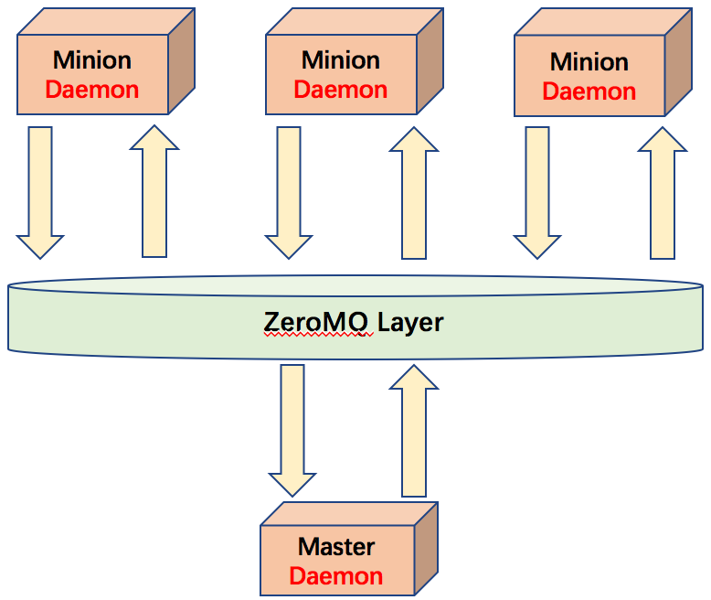

专业术语说明：

- Minion 是 SaltStack 需要管理的客户端安装组件，会主动去连接 Master 端，并从 Master 端得到资源状态信息，同步资源管理信息。
- Master 作为控制中心运行在主机服务器上，负责 Salt 命令运行和资源状态的管理。
- ZeroMQ 是一款开源的消息队列软件，用于在 Minion 端与 Master 端建立系统通信桥梁。
- Daemon 是运行于每一个成员内的守护进程，承担着发布消息及通信端口监听的功能。

##### 图 2.SaltStack 操作执行原理图

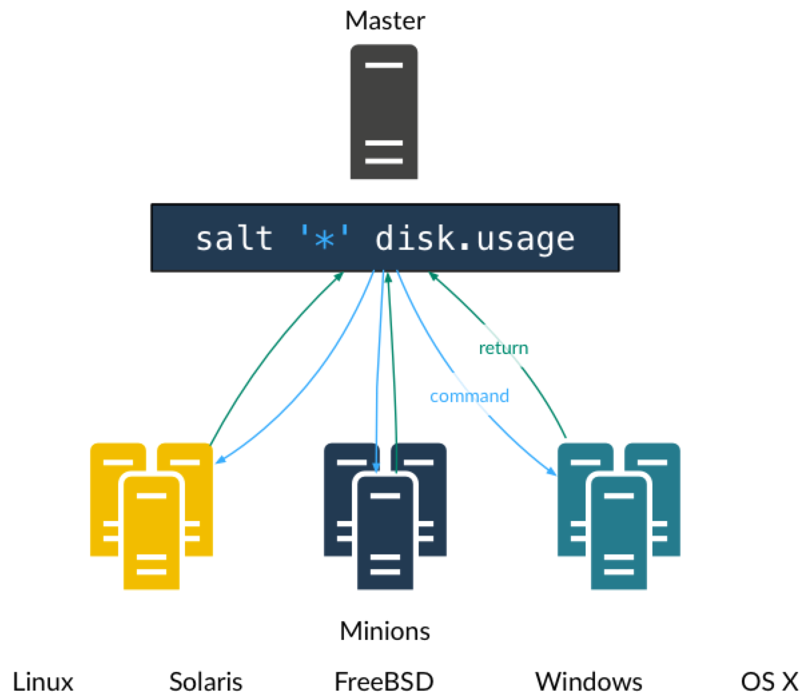

原理图说明：

- Minion 是 SaltStack 需要管理的客户端安装组件，会主动去连接 Master 端，并从 Master 端得到资源状态信息，同步资源管理信息。
- Master 作为控制中心运行在主机服务器上，负责 Salt 命令运行和资源状态的管理。
- Master 上执行某条指令通过队列下发到各个 Minions 去执行，并返回结果。

本章使大家了解了什么是 SaltStack 以及它的通信及执行原理，下一章节将主要介绍本次实例部署的架构设计。

## SaltStack 的架构设计

为了让大家更好的理解 SaltStack 在云平台集中化管理方面的优势，因此，根据项目的实际情况绘制了部署架构图，并在文中对架构图进行了详细说明。如图 3 所示：

##### 图 3.SaltStack 部署架构图

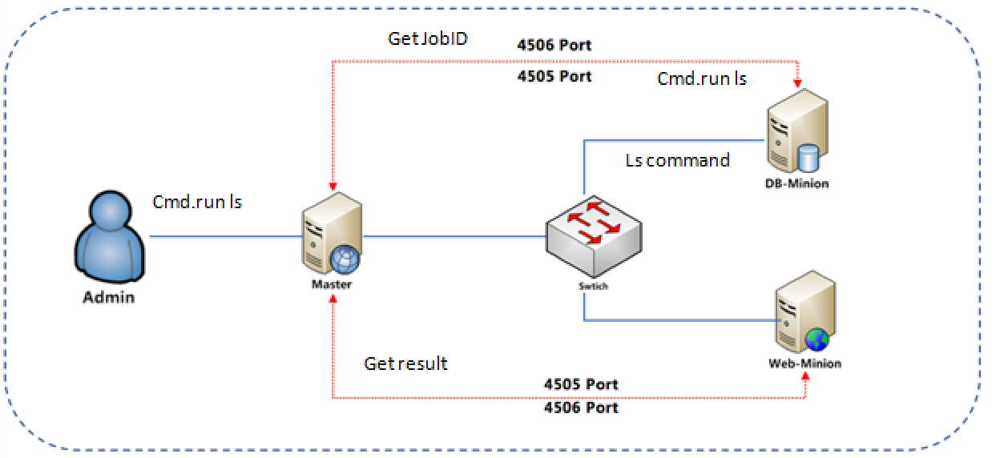

说明：

- SaltStack 的所有被管理客户端节点（如图 3 所示 DB 和 Web），都是通过密钥进行加密通信，使用端口为 4506。客户端与服务器端的内容传输，是通过消息队列完成，使用端口为 4505。Master 可以发送任何指令让 Minion 执行，salt 有很多可执行模块，比如说 CMD 模块，在安装 minion 的时候已经自带了，它们通常位于你的 python 库中，locate salt \| grep /usr/ 可以看到 salt 自带的所有东西。
- 为了更好的理解架构用意，以下将展示主要的命令发布过程：

- SaltStack 的 Master 与 Minion 之间通过 ZeroMq 进行消息传递，使用了 ZeroMq 的发布订阅模式，连接方式包括 TCP 和 IPC。

- Salt 命令，将 cmd.run ls 命令从 salt.client.LocalClient.cmd\_cli 发布到 Master，获取一个 Jodid，根据 jobid 获取命令执行结果。
- Master 接收到命令后，将要执行的命令发送给客户端 minion。
- Minion 从消息总线上接收到要处理的命令，交给 minion.\_handle\_aes 处理。
- Minion.\_handle\_aes 发起一个本地线程调用 cmdmod 执行 ls 命令。线程执行完 ls 后，调用 Minion.\_return\_pub 方法，将执行结果通过消息总线返回给 master。
- Master 接收到客户端返回的结果，调用 master.handle\_aes 方法将结果写的文件中。
- Salt.client.LocalClient.cmd\_cli 通过轮询获取 Job 执行结果，将结果输出到终端。

## SaltStack 的安装与配置

对 SaltStack 有了一个初步的了解之后，您将在本章通过实际案例操作进一步了解 SaltStack。本章节一共分为三个部分，分别介绍安装环境的说明，具体安装及安装后的 SaltStack 配置。

### SaltStack 的环境说明

由于受到硬件资源限制，测试环境将采用三台服务器进行部署，分别扮演不同的角色，详细信息如表 1 所示。

##### 表 1.SaltStack 环境说明

**主机名****IP 地址****角色****操作系统**Master- _._.com`9.*.*.*`Master serverCentOS6.5Minion- _._.com`9.*.*.*`Minion serverCentOS6.5Minion- _._.com`9.*.*.*`Minion serverCentOS6.5

### SaltStack 的安装

目前 SaltStack 支持很多平台的部署，具体到每个平台的安装部署，可以参考官方文件。本实例中将主要介绍基于 CentOS 平台的安装部署。

#### 依赖组件的安装

由于 SaltStack 是开源软件，其很多功能是依赖其它的软件包来完成。所以我们在安装 SaltStack 之前需要先将以下表 2 中的依赖软件包安装到主机上，避免因为缺少依赖关系而产生错误。

##### 表 2\. 依赖软件包

**软件名****功能**Python 2.6 软件包Python主安装文件PyYAML 软件包SaltStack 配置解析定义语法Msgpack-pythonSaltStack 消息交换库Jinjia2SaltStack states 配置模版MarkupSafepython Unicode 转换库Apache-libcloudSaltStack 对云架构编排库ZeroMQSaltStack消息系统PyzmZeroMQ python 库PyCrytoPython密码库M2CrytoOpenssl Python 包装库RequestsHTTP Python 库

为了方便依赖包的安装，本章将采用 YUM 的方式进行安装。

首先下载并安装 epel 源,执行以下指令，将 epel.repo 存储到/etc/yum.repos.d 目录下。

```
wget –o /etc/yum.repos.d/epel.repohttp://mirrors.aliyun.com/repo/epel-6.repo

```

Show moreShow more icon

并通过 Yum list 命令来校验安装源是否生效，如出现图 4 所示，则表明Yum源已经生效。

##### 图 4.SaltStack 安装源

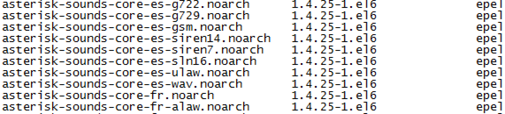

建立好安装源及解决了软件包依赖关系之后，下一步将介绍如何安装 Saltstack master 主机。

#### Master 角色的安装

如上表 2，已经清晰的列出需要依赖哪些安装包确保 master 的成功安装。配置好 yum 源之后，只需要输入以下命令（如图 5 所示），就可以在自动安装 SaltStack 的同时，将依赖包安装好。

##### 图 5.SaltStack master 主机安装

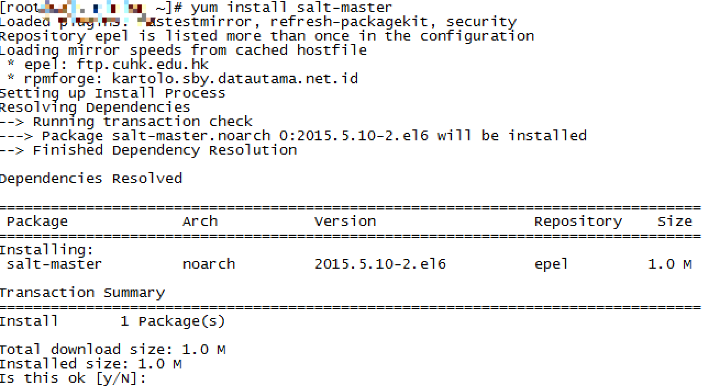

安装完成后，输入 chkconfig salt-master on 将 master 服务加入到开机启动项，这样每次系统启动，都会自动加载 master 服务。输入 service salt-master start 启动 master 服务。之后通过 netstat –antp 查询服务状态，结果如图 6 所示。

##### 图 6.SaltStack master 服务查询

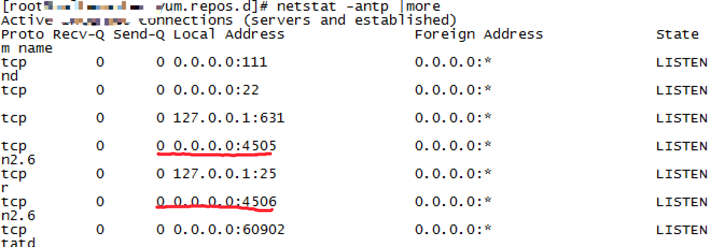

依照本章介绍来看，master 服务已经被正确安装并启动，下一章将介绍如何安装 SaltStack-Minion 到客户端服务器。

#### Minion 角色的安装

SaltStack 是一个 C/S 结构的开源软件，Master 通过客户端软件 Minion 进行指令的执行与策略的配置。如图 7 所示，通过 yum install 命令安装 Minion 客户端。

##### 图 7.SaltStack Minion 主机安装

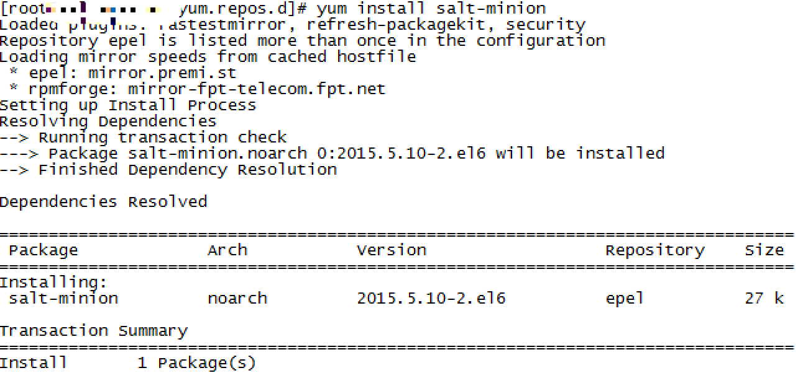

安装完成后，输入 chkconfig salt-minion on，将 minion 服务加入到开机启动项，这样每次系统启动，都会自动加载 minion 服务。输入 service salt-minion start，启动 minion 服务。之后通过 netstat –antp 查询服务状态，结果如图 8 所示。

##### 图 8.SaltStack Minion 服务查询

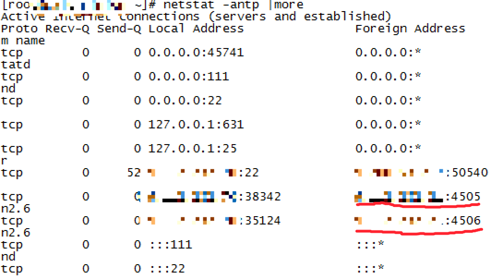

到目前为止，SaltStack 的安装工作已经完成，Master 和 Minion 主机服务都已经正确开启，端口服务正常。下一章将主要介绍如何配置 SaltStack，使其可以正常的提供各种功能。

### SaltStack 的配置

SaltStack 的配置主要集中在 Master 主机端，客户端的配置较少，本章将通过以下两部分详细介绍。

#### Minion 端配置

SaltStack-Minion 是 SaltStack 安装在客户端的代理，负责接收服务器端发布的指令并执行，同时负责客户端的状态监控。客户端要想被 master 管理，需要修改其配置文件，将服务器指向到 Master 的地址。其配置文件位于/etc/salt/目录下，名为 minion，通过 vi 工具修改，如图 9 所示。

##### 图 9.SaltStack Minion 配置

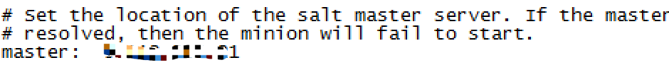

配置完成后，保存并通过 service salt-minon restart 命令重启 minion 服务。本次测试案例，并不需要其它高级功能的演示，所以客户端到此配置结束，更多功能的配置，请参考 [SaltStack 官方手册](https://docs.saltstack.com/en/latest/) 。

#### Master 端配置

SaltStack-Master 是 SaltStack 组件的核心服务，负责发布指令及配置文件的分发与管理，及客户端的管理功能。Master 要想正常提供服务，需要接受客户端的证书认证请求。我们之前已经介绍过，SaltStack 是通过 SSL 证书认证的方式进行通信的。如图 10 所示操作，输入 salt-key –l 来查询客户端证书状态，并如图 11 所示操作，输入 salt-key –A 接受客户端认证。

##### 图 10.SaltStack 证书查询

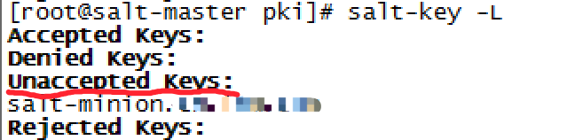

从图中可以看到客户端被发现，但是处于未被接受状态，需要管理员执行图 11 所示指令，进行接受。

##### 图 11.SaltStack 接受证书

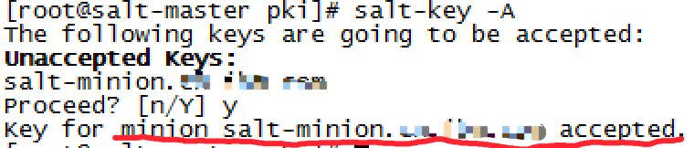

至此我们已经完成 SaltStack 的全部配置，在下一章中，将通过几个测试场景来说明 SaltStack 在云管理平台的重要功能。

## SaltStack 测试

通过本章节中的两个测试案例，可以验证 SaltStack 是否运行正常，是否可以完成预定的功能。我们可以通过 salt ‘\*’ test.ping 来测试客户端是否在线，并被 master 管理，如图 12 所示，如果返回 True，则说明客户端已经被 master 管理，并处于在线状态。

##### 图 12.SaltStack 接受证书

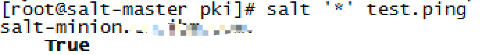

接下来，我们将通过批量执行命令和批量安装软件，来测试 SaltStack 的部分功能。

### 批量执行命令

在日常运维中，同时对多台服务器进行操作，是一个很平常的需求。比如批量执行 ping 操作，验证服务器是否在线，批量执行查询命令，看服务器的负载及利用率。如图 13 所示的指令为批量查询服务器操作系统的版本 **。**

##### 图 13.SaltStack 查询服务器的 IP 信息

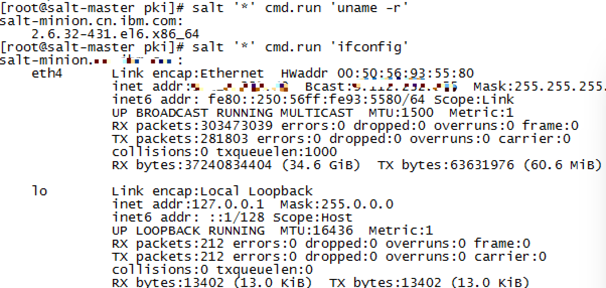

_代表对所有的被管理客户端进行操作，cmd.run 是命令调用模块，ifconfig 是具体的执行命令 \*。_

### 批量安装软件

批量安装软件也是日常运维中的家常便饭，我们可以通过 SaltStack 的软件推送功能，对所管理的服务器进行进行相关软件的批量安装。如图 14 所示的指令为批量安装软件 lrzsz 在客户端服务器中。

##### 图 14.SaltStack 安装 lrzsz

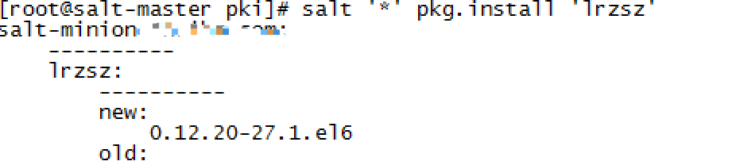

如上图所示，lrzsz 软件被顺利的安装到了客户端服务器。 通过以上两个测试，可以验证 SaltStack 可以正常的为云平台提供集中化的管理与配置功能。

## 结束语

通过在 CentOS 6.5 上实现自动化运维工具 SaltStack 的部署及功能演示，可以满足管理员对云计算平台中服务器及配置的集中化管理，提高了运维团队的运维效率和准确性，降低了管理成本。同时通过本文，我们也对开源工具有了更多的了解和学习。为今后应用更多的开源工具管理云平台提供了夯实的技术基础。