# 自助分析平台中知识驱动的人工智能功能部件
使用语义概念和关系发现并描述数据的特征

**标签:** 人工智能,分析,机器学习

[原文链接](https://developer.ibm.com/zh/articles/understand-new-ai-features-in-cognos-analytics-111/)

Cindy Sun, Larry Luo

发布: 2019-04-09

* * *

## 引言

在当今世界，企业和组织面临着不断增长的挑战，即透过大量的数据，发现隐藏的模式来提升其业务绩效和扩大竞争优势。 人工智能 (AI) 也由此变得越来越重要，这是因为有了人工智能，人类就可以借助计算机和软件更迅速、更智能地执行任务。

IBM Cognos Analytics (11.1) 是一个先进的自助分析平台。此平台引入了许多人工智能融合功能部件，可帮助您快速发现隐藏的洞察，推荐可视化效果，并以自然语言进行对话。在本文中，我将介绍一些主要的人工智能融合功能部件，帮助您了解幕后信息。

## 解释知识发现

Knowledge Discovery Service (KDS) 是人工智能融合功能部件的基石。KDS 的大脑是 Knowledge Discovery Engine (KDE)，由分类器、分类管道和本体组成。它使用语义概念和关系发现并描述数据的特征。语义概念可以是描述业务领域的领域概念，也可以是描述数据的性质、数据分布和数据质量的数字概念。KDE 还会自动将列聚集为逻辑组，并发现这些组之间的层次结构。

这些知识发现被所有人工智能融合功能部件广泛采用。而且知识发现对这些功能部件的结果有很大的影响，包括 Visualization recommender、Interesting fields recommender、Influencer recommender、Related Visualization 和 Auto-join recommender。

以上传文件为例，该引擎将根据其元数据和数据（如列标签、单元格值、统计数据、数据分布、数据质量）来分析数据集。接下来，用多个语义概念对每一列进行分类，以表示列的各种特征。虽然这些概念尚未在 UI 中直接向用户公开，但它们已被用于定义列的属性或图标。

以 CA 样本数据 `California_Zip_Website_Visits.xlsx` 为例。

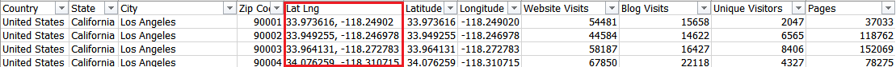

`Country、State、City、Zip Code` 列标签为 Knowledge Discovery Engine (KDE) 提供了词汇提示，因为它们都以地理相关概念来标记。这似乎是显而易见的；然而，`Lat Lng` 标签却没有表现出任何含义。这时候就轮到 KDE 分类器大显身手了。它从分类管道中的多个层次获取输入，并在最终决策过程中整合这些内容。在这种情况下，`Lat Lng` 列中的值给出了一个提示，即它有一个坐标数据模式，而且 KDE 根据其数据分布、数据类型等方面，使用 **坐标** 概念以及与其数字特征相关的其他概念对该列进行分类。

再举一个例子，如果 `Latitude` 列填充了字符串值，那么无论标签给出了什么词汇提示，该列都不会被标记为 _纬度_ 概念。

其他列（如 `Web site Visits`、`Blog Visits` 等等）根据其数据类型和数据分布，已被标记为 **度量**。层次结构自动变为 Country -> State -> City。

从这些例子中可以看出，数据的质量和整洁度对于知识发现的质量至关重要，并影响着所有其他 AI 融合建议。稍后，我将描述一些常见的杂乱数据问题，您在准备数据时应该避免这些问题。

作为知识发现的结果，您从下面的截屏中可以看到，所有标记为 **地理** 相关概念的列都用泪滴状图标来表示，而标记为 **度量** 的列则用 L 形图标来表示。

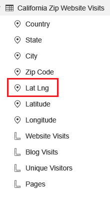

让我们来看看 `Latitude` 列的属性，因为 **纬度** 概念是 **地理** 概念的属性，因此，`Geographic location` 和 `Latitude` 被设置为 Represents 属性的值。

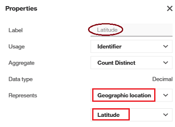

在 `Lat Lng` 列的属性中，因为其 **坐标** 概念是 **地理** 概念的属性，`Geographic location` 和 `Position` 被设置为 Represents 属性的值。

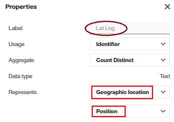

## 发现数据

Knowledge Discovery Service 有两种模式：深层或浅层。为什么我们需要在知识发现方面采取深层和浅层模式？我们来仔细看看深层模式和浅层模式之间的主要区别。

在 **深层模式** 中，首先将进行单变量分析（如最小值、最大值、平均值、标准偏差、中间值、四分位值等等）和双变量（成对）分析，以捕获数据特征，然后 KDE 将使用结果对更准确的概念和关系进行分类。但深层模式需要更多时间，尤其是对于包含许多表的数据源，例如模式、FM 包等。

在 **浅层模式** 中，知识发现仅基于元数据即时发生，因此它比深层模式快得多。在很多情况下都是由用户手势触发的，例如，添加新计算、修改列名、将列拖动到仪表板画布等等。如您所见，这些是需要快速响应的特设交互式分析。在浅层模式下，知识发现将做出最佳尝试，但由于缺乏已发现的数据特征，因此发现的某些知识不会像在深层模式下那样准确。例如，在不知道数据特征的情况下，不会使用 **坐标** 概念来标记 `Lat Lng` 列。

由于 FM 包通常涉及大量表，因此默认情况下，针对 FM 包的知识发现为 **浅层** 模式，这样就可以加快导入速度。可以使用“`Enrich package`”来触发深层模式知识发现。

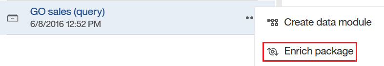

在 IBM Cognos Analytics 11.1 中，OLAP 包（如 PowerCube 或 DMR）仅支持 **浅层** 模式。
什么时候进行 **深层** 模式知识发现？这发生在以下时间段：

- “上载文件”、“刷新文件”或“附加文件”
- “加载”或“刷新”数据集的数据
- “扩充包”
- 在数据服务器的模式上“加载元数据”

在“加载元数据”场景中，如果未选中“Retrieve sample data”或“Retrieve statistics”，就会加快该过程，但由于缺少样本数据和/或统计数据，将无法捕获或仅部分捕获数据特征，这将影响知识发现的结果。

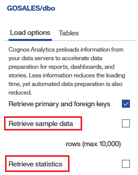

## 知识驱动的推荐系统

通过数据集发现的知识会被所有人工智能融合功能部件广泛采用，并且推动这些功能部件产生相应的结果。我将在较高层面介绍一些人工智能融合功能部件，让您能够大致了解如何在产品中利用知识。

### Visualization recommender

在 `Visualization recommender` 中，KDS 发现的知识在特征提取中起着至关重要的作用，它以标准形式表示每个字段的数据特征和元数据。这些概念已被用于训练可视化分类模型，该模型可基于输入列对可视化内容进行分类。概念和层次结构是指导可视化槽绑定的驱动因素。

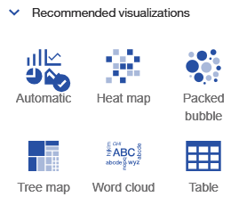

### Interesting fields recommender

`Interesting Fields recommender` 可建议一组比给定分析上下文中的其他字段更值得注意的字段，这可以帮助用户更快地启动分析，并引导用户踏上发现之路。选择关注字段的主要标准之一是为列标记的概念，并且仅考虑一部分概念。

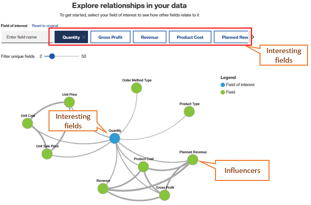

### Influencer recommender

`Influencer recommender` 使用已发现的知识（如概念、关系、群组和统计分析结果），建议一组与给定目标字段可能存在因果关系的字段。这不仅为统计分析创造了一种新颖的减少特征的方法，使 IBM Cognos Analytics 能够以交互速度执行高级分析，而且还使系统能够发现数据之间的因果关联，避免了单纯基于统计分析建议毫无意义的关系。使用 Influencer recommender 的高级分析可视化的一些示例如下：

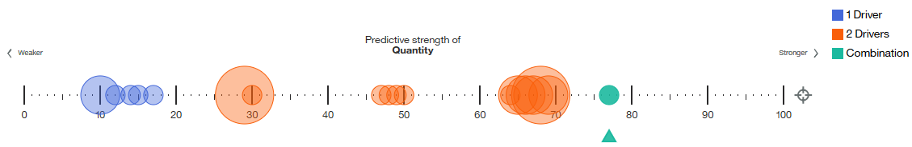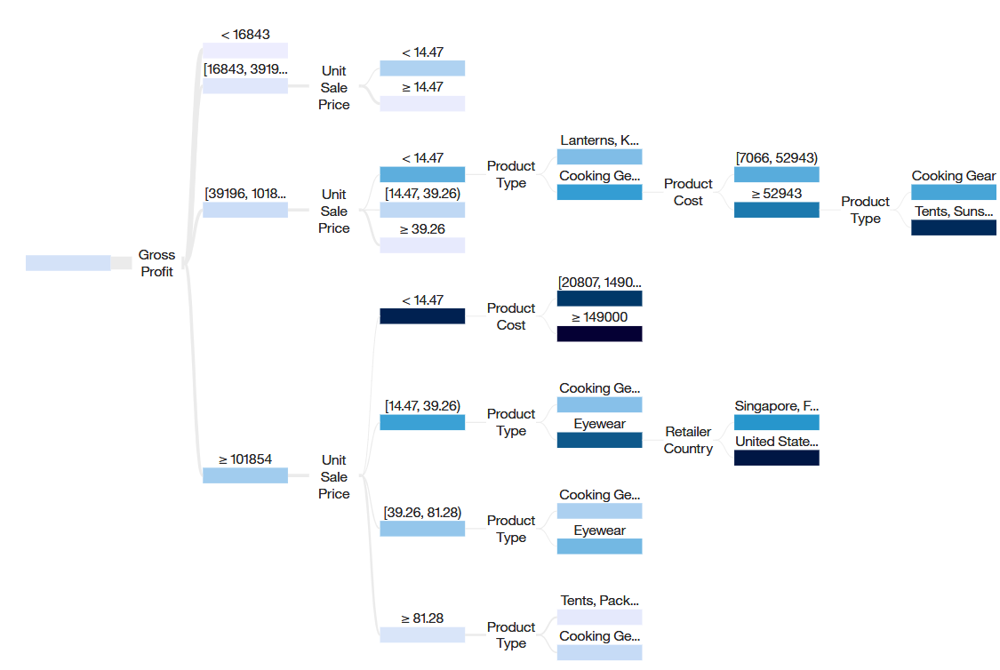

### Related visualizations

通过结合使用 `Visualization recommender`、`Interesting fields recommender` 和 `Influencer recommender` 的强大功能，并在从数据集中所发现知识的推动下，`Related visualizations` 可推荐一组与用户当前选择的上下文相关的迷你图表。它将用户的注意力引向数据中的其他相关领域，这样用户便可以快速发现他们可能错过的更多洞察。

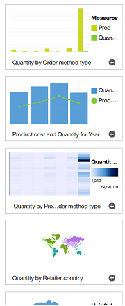

### Auto-join recommender

当用户加载多个工作表 Excel 文件或者加载一个包含多个 CSV 文件的 zip 文件时，Knowledge Discovery Service 会对上载的工作表或文件进行分析，并且发现每一列的语义和数据知识。利用这一知识，`Auto-join recommender` 可以进一步深入洞察数据，并自动检测不同文件之间的连接关系。 这让用户能够立即开始创建一个仪表板或报告，而不必通过繁琐的步骤逐一手动连接各个文件。

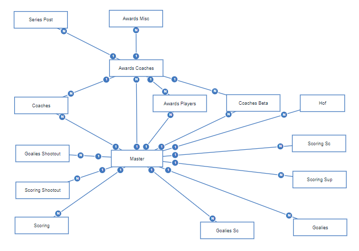

### Intent-based modeling

许多企业数据库或数据仓库都包含海量的表。这就要求业务用户必须深入了解这些表，接受正式的建模培训，以及长时间实战，才能正确建立一个模型来分析数据。通过结合运用 `Auto-join recommender` 与 `Intent-based modeling` 功能部件的强大功能，用户能够以自然语言提供分析意图短语，并迅速提出一种模型来满足用户意图。这有助于避免用户遭遇传统数据建模所经历的漫长而复杂的过程。

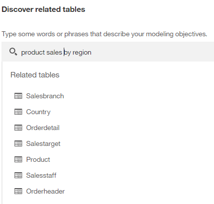

## 避免常见的杂乱数据问题

如以上各节中所述，从数据中发现的知识推动 AI 融合功能部件提出相关建议结果。数据的质量和整洁度至关重要，影响着知识发现的质量以及其他 AI 融合建议的质量。

在准备数据时，应尽量避免下列常见的数据集不够整洁的问题，这些问题将影响知识发现的结果：

- 在一个度量列中混用多种粒度。例如，
    - a. 这张表在“Date”列中混用了“月”和“年”值。

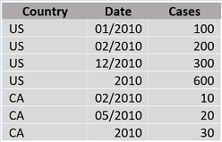

- b. 表中的“Location/Division”列混用了三种级别的地点：国家、州、市。

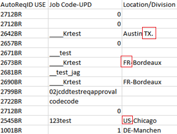

混合粒度的度量要求在构建报告和仪表板时采用特殊方法，否则很容易陷入双重或三重计算问题。而且，数据模式给出的数据提示也不明确，到底是年还是月？是市、州还是国家？

- 列标签太长、描述过多，或者像一个公式。例如，下面的这个列标签包含 53 个单词。

_“Slide the circle to rate the value of an online chat with an instructor feature.(0 = not valuable and 10 = very valuable) hover here for a definition An online chat feature allows you to contact the instructor using real time chat (like instant messaging) to access a course instructor or facilitator.”_

- 列标签为 KDE 给出词汇提示，在对正确的领域概念进行分类时至关重要，特别是在没有任何数据提示的浅层构建模式下。但是，对于像段落这样的标签，分析数据集中的每个标签将花费更长的时间，并且无法推断出任何有意义的词汇提示。

- 全小写或全大写的复合词。例如，“fiscalYearBudget”或者用下划线或短划线分隔单词将会为系统提供词汇提示，但“fiscalyearbudget”只会被视为一个没有语义含义的单词。

- 不遵守数据模式的异常值行例如：时间戳值显示在 `Closing inventory` 列中，而该列应该只有整数数据模式。

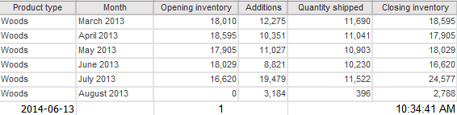

- 令人混淆的数据格式，例如，`Customer ID` 采用千位分隔符格式。

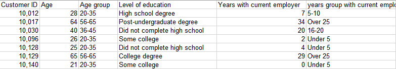

这里不再一一列举所有问题。通过上面的示例，您应该已经清楚地了解不够整洁的数据是什么样的，并且将在数据准备中尽力解决这些问题。

本文翻译自： [Knowledge-driven AI features in a self-service analytics platform](https://developer.ibm.com/articles/understand-new-ai-features-in-cognos-analytics-111/)（2019-04-09）