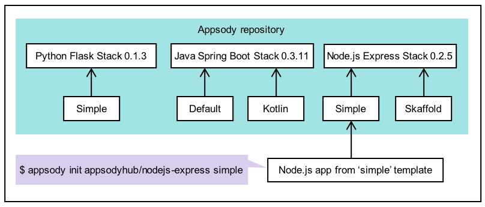
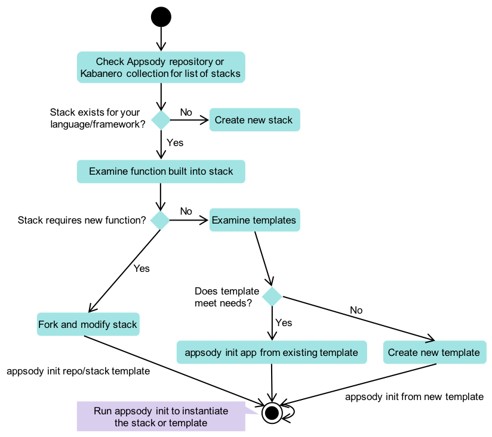

# 自定义 Appsody 堆栈：简介
决定何时创建新堆栈或修改现有堆栈，以及何时使用或修改模板

**标签:** Appsody,IBM Cloud Pak for Applications,容器

[原文链接](https://developer.ibm.com/zh/articles/customizing-appsody/)

[Yan Koyfman](https://developer.ibm.com/zh/profiles/koyfman)

发布: 2019-12-03

* * *

[Appsody](https://appsody.dev) 是一个开源项目，可简化云原生应用程序的开发。Appsody 的主要组件是一个堆栈，此堆栈会构建一个预先配置的、可部署到云环境的 Docker 镜像。这些 Docker 镜像可以包含任意数量的自定义内容，并允许堆栈生成器决定哪些部件是固定的（堆栈镜像），哪些部件可以由堆栈用户修改或扩展（模板）。

本文简要介绍了 Appsody 存储库、堆栈和模板，并帮助您决定何时创建新堆栈、何时修改堆栈以及何时使用或修改模板。

## 存储库、堆栈和模板

Appsody 中对象的层次结构如下：顶层是存储库，下面是堆栈（其中包括一个囊括众多技术的精选镜像），最低层是模板。Appsody 存储库为您提供了一个使用 Appsody 堆栈的中央枢纽。



您可以使用 `appsody` CLI 来添加或移除存储库，并可基于堆栈来初始化新项目。例如，
`appsody repo add kabanero https://github.com/kabanero-io/collections/releases/download/v0.1.2/kabanero-index.yaml` 可告知您的本地安装这是一个新的远程堆栈存储库，其堆栈和模板现在可用于本地开发。

例如，在本地 Appsody 配置中注册了多个存储库（存储在 `~/.appsody` 下面）时，`appsody list` 的输出如下：

```
$  appsody list

REPO            ID                              VERSION         TEMPLATES               DESCRIPTION
appsodyhub      java-microprofile               0.2.13          *default                Eclipse MicroProfile on Open Liberty & OpenJ9 using Maven
appsodyhub      java-spring-boot2               0.3.11          *default, kotlin        Spring Boot using OpenJ9 and Maven
appsodyhub      nodejs                          0.2.5           *simple                 Runtime for Node.js applications
appsodyhub      nodejs-express                  0.2.5           *simple, skaffold       Express web framework for Node.js
appsodyhub      nodejs-loopback                 0.1.4           *scaffold               LoopBack 4 API Framework for Node.js
appsodyhub      python-flask                    0.1.3           *simple                 Flask web Framework for Python
appsodyhub      swift                           0.1.4           *simple                 Runtime for Swift applications
custom_stack    my-stack-name                   1.0.0           *default                My custom stack
experimental    java-spring-boot2-liberty       0.1.8           *default                Spring Boot on Open Liberty & OpenJ9 using Maven
experimental    nodejs-functions                0.1.3           *simple                 Serverless runtime for Node.js functions
experimental    quarkus                         0.1.5           *default                Quarkus runtime for running Java applications
experimental    vertx                           0.1.1           *default                Eclipse Vert.x runtime for running Java applications
local_stack     java-microprofile               0.2.6           *default                Eclipse MicroProfile using OpenJ9 and Maven
local_stack     java-spring-boot2               0.3.2           *default                Spring Boot using OpenJ9 and Maven
local_stack     nodejs                          0.2.3           *simple                 Runtime for Node.js applications
local_stack     nodejs-express                  0.2.3           *simple                 Express web framework for Node.js
local_stack     nodejs-loopback                 0.1.0           *                       LoopBack API framework for Node.js
local_stack     swift                           0.1.2           *simple                 Runtime for Swift applications
my_local        java-microprofile               0.2.6           *default, gdpr, restapi Eclipse MicroProfile on Open Liberty & OpenJ9 using Maven
my_stacks       java-microprofile               0.2.6           *default                Eclipse MicroProfile using OpenJ9 and Maven
my_stacks       java-spring-boot2               0.3.2           *default                Spring Boot using OpenJ9 and Maven
my_stacks       nodejs                          0.2.3           *simple                 Runtime for Node.js applications
my_stacks       nodejs-express                  0.2.3           *simple                 Express web framework for Node.js
my_stacks       nodejs-loopback                 0.1.0           *                       LoopBack API framework for Node.js
my_stacks       swift                           0.1.2           *simple                 Runtime for Swift applications

```

Show moreShow more icon

第一列是存储库，第二列是堆栈名称，后面是堆栈版本以及可用模板列表。Appsody CLI 可通过这几部分的组合来初始化应用程序。例如，在以下实例中：

```lang-bash
$ appsody init  my_local/java-microprofile default

```

Show moreShow more icon

CLI 根据默认的 Java MicroProfile 模板来初始化应用程序。

## 用于决定是使用、修改还是创建堆栈的决策树

Appsody 应用程序包含一个从堆栈创建的 Docker 镜像，并在其中注入模板和用户文件。因为 Dockerfile 是堆栈的一部分，所以访问堆栈的用户无法修改这些 Dockerfile 。但是，在 `appsody init` 过程中，会将模板复制到您的工作目录中。Appsody 用户可以随意对模板中的任何部分进行更改，在 `appsody build` 阶段，这个模板将与堆栈镜像结合使用。

根据您的需求，您将执行以下任一操作：

- 选择现有堆栈，并将其中一个模板作为应用程序的基础。
- 修改或扩展堆栈
- 创建全新的堆栈

问题：如何确定哪个选项最适合您的特定用例？我们创建了一个决策树来帮助您做出决定。



### 创建或修改堆栈

堆栈可能包含的代码始终是应用程序的一部分且不可修改，而模板包含的代码可以由用户修改。例如，假设您做出了如下决定：组织中使用私有存储库的每个人在其微服务中都必须有一组依赖项和库。在此场景中，您想要在私有存储库中构建一组自定义堆栈。

下面提供了您希望创建或修改一个或多个堆栈的其他示例：

- 贵组织需要创建一个基础镜像库，这些镜像预先构建了某些常见功能（运行状况检查、遥测、安全性、日志记录等），这些功能是每个微服务的必备功能。这些功能由 Appsody 存储库中存储的 Dockerfile 来控制。您可以随时更新该 Dockerfile，在构建时，Appsody CLI 将提取最新的可用版本。
- 当用户初始化 Appsody 模板的实例时，不会在初始化过程中将该 Dockerfile 下载到用户的沙箱环境中。`appsody build` 步骤每次都会从存储库中下载该 Dockerfile，然后编译用户的代码并将该 Dockerfile 添加到基础镜像中的相应路径中。

     例如，在来自 Java MicroProfile 堆栈 `Dockerfile` 的本摘录内容中，请注意堆栈 Dockerfile 会将 Java 源代码复制到镜像中并编译这些代码。 **这个 Dockerfile 只能包含在堆栈中，对存储库没有写访问权的开发者无法更改此 Dockerfile。**


    ```
    COPY ./project

    WORKDIR /project/user-app

    RUN mvn install -DskipTests

    RUN cd target && \
          unzip *.zip && \
          mkdir /config && \
          mv wlp/usr/servers/*/* /config/

    ```


    Show moreShow more icon


您可以通过语言相关机制将依赖项添加到容器中，而无需更改堆栈。例如，您可以修改 `pom.xml`，通过 Maven 将依赖项添加到 Java 堆栈中，或者对 `Pipfile` 进行更改以在 Python 堆栈中添加依赖项。

### 使用模板

如果您的堆栈不需要具备新功能，那么可以根据您的需要来使用我们现有的某个模板或创建一个新模板。模板可以提供适用于为特定任务（例如，为 Web 或移动应用程序创建 REST API 后端）启动微服务的搭建代码。

模板：

- 易于创建。只需复制现有堆栈并进行调整即可。
- 允许您针对不同用例构建现有堆栈的多个变体。
- 为用户提供了构建服务的起点，但不会让他们受制于任何特定的需求。

## 结束语

Appsody 允许您基于现有堆栈和模板（针对特定用例进行了优化）进行构建，而不必从头开始，因此它能够加快云原生应用程序的开发。希望本文能帮助您了解 Appsody 的不同部分如何组合在一起，以及何时应创建新堆栈、修改现有堆栈或者只是使用或修改模板。

### 后续步骤

- 想要查看 Appsody 的实际应用？ [查看基于 Appsody 的 Spring Health Score 应用程序](https://github.com/IBM/appsody-sample-quote-app)
- 阅读文档： [修改或创建新堆栈](https://appsody.dev/docs/stacks/modify)

本文翻译自： [Customizing Appsody stacks: An introduction](https://developer.ibm.com/articles/customizing-appsody/)（2019-10-16）