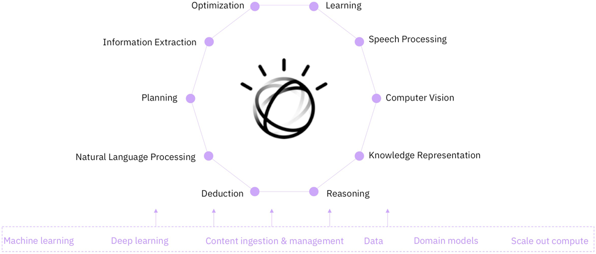
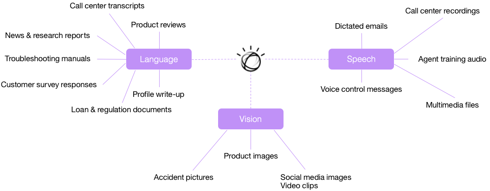
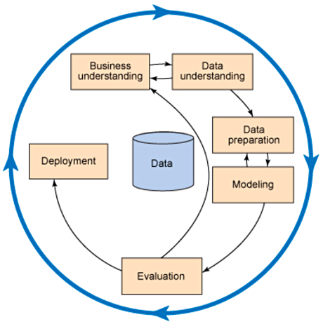
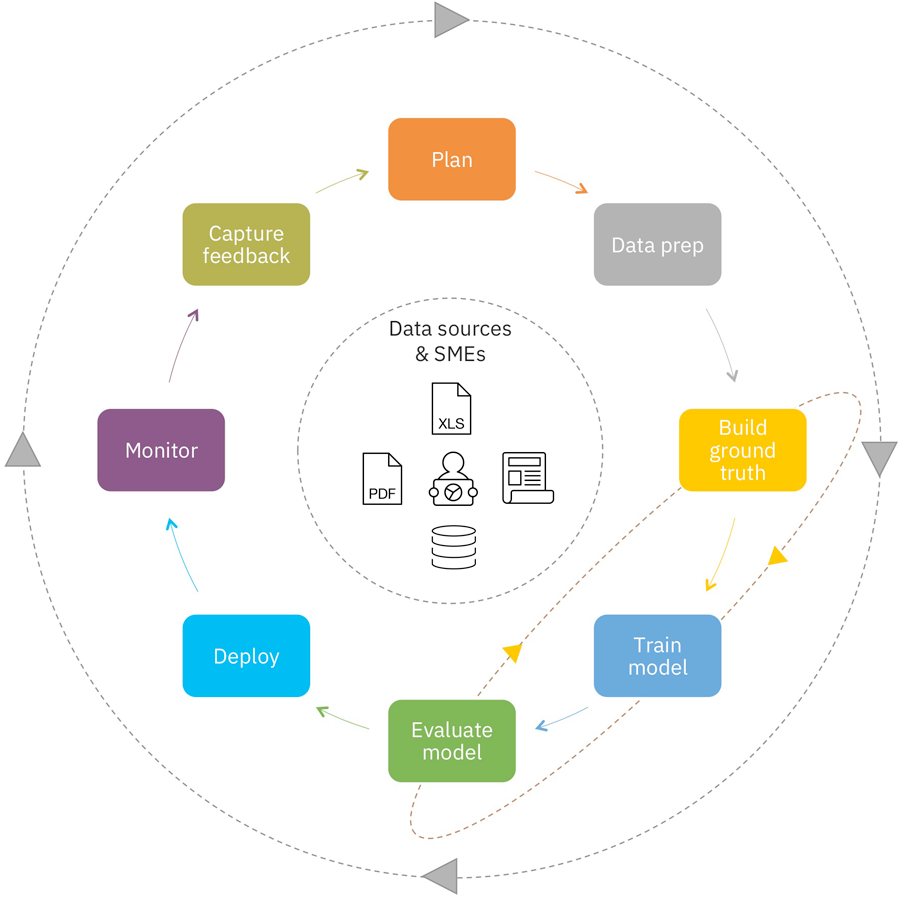
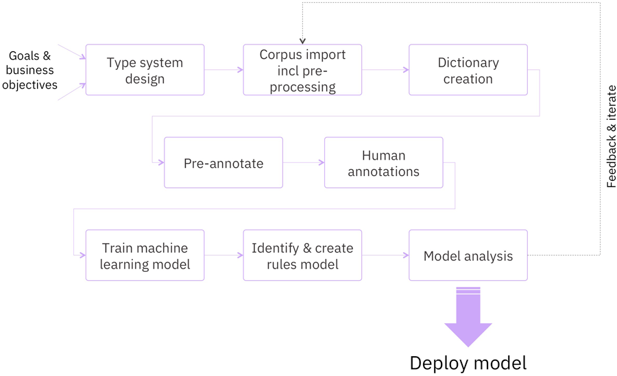
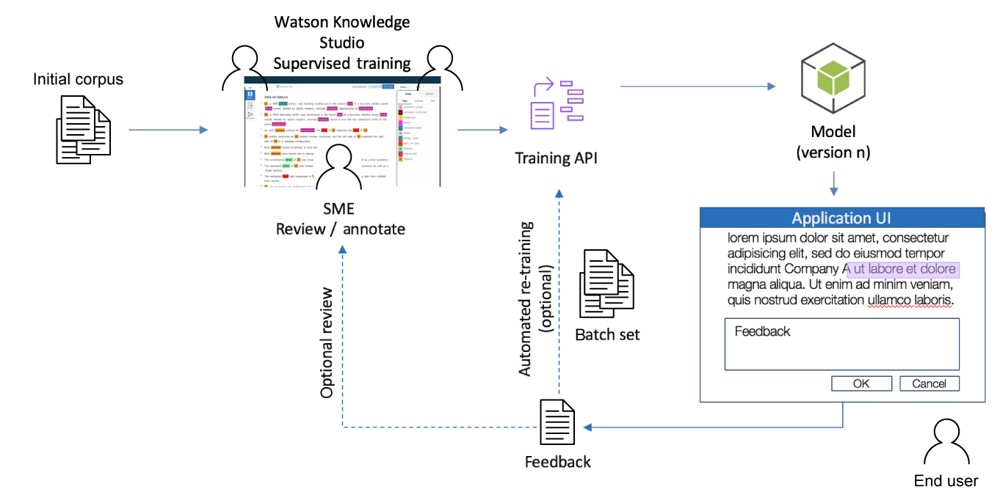
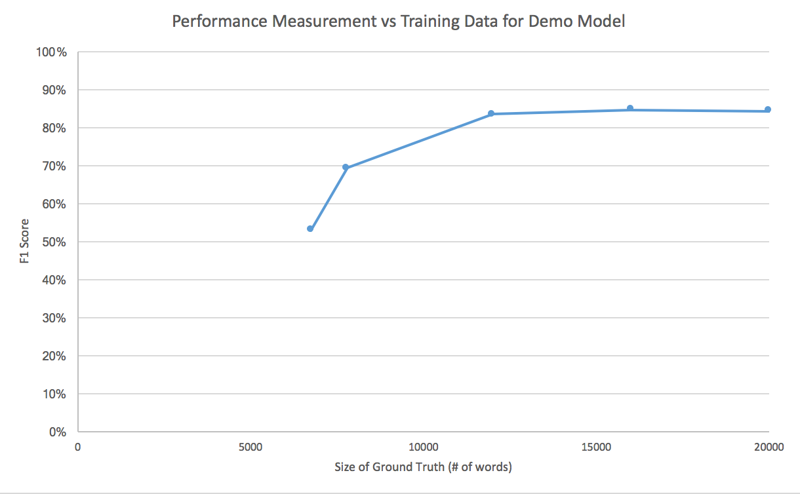
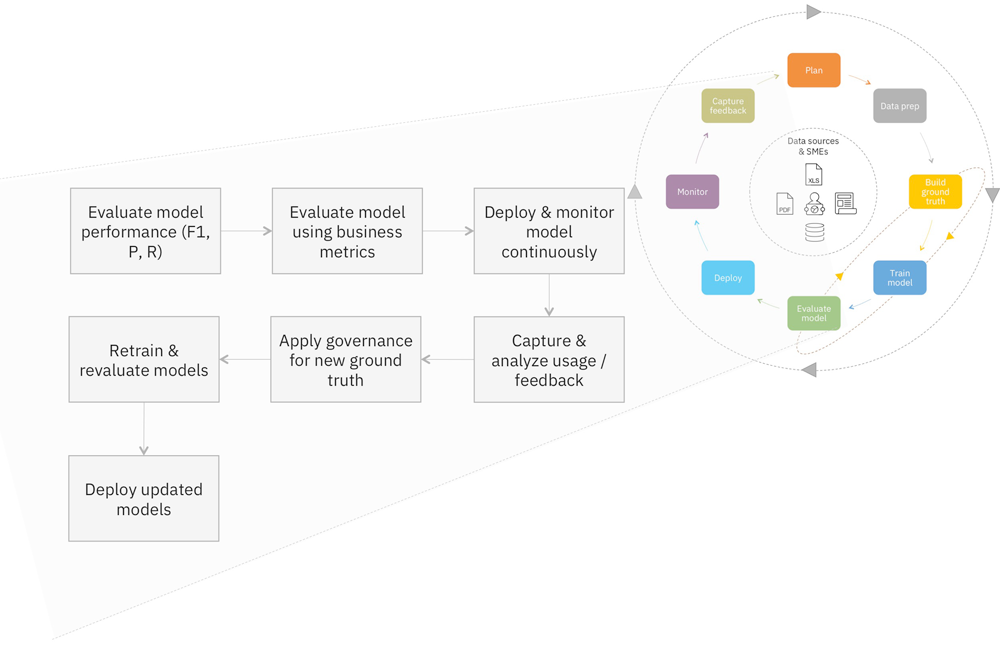

# 让 DevOps 适合认知和人工智能系统
DevOps 概念增强了传统的应用程序开发

**标签:** 人工智能

[原文链接](https://developer.ibm.com/zh/articles/cc-devops-artificial-intelligence-cognitive/)

Joshua Allen, Andrew Freed, Swami Chandrasekaran

发布: 2018-01-03

* * *

认知系统为构建有强大的智能作为支撑的新型应用程序提供了绝佳机会。这些新应用程序需要用一种新方式来思考开发流程。DevOps 概念增强了传统的应用程序开发，它将运营考虑因素融入到了开发时间、执行和流程中。在本教程中，我们将概述一种“认知 DevOps”流程，该流程改进和调整 DevOps 的最佳部分，以获得新的认知应用程序。具体来讲，我们将介绍如何对认知系统的训练流程应用 DevOps，包括训练数据、建模和性能评估。

## 认知任务类型

从根本上讲，认知或人工智能 (AI) 系统具有从数据中理解、推理和学习的能力。从更深层次讲，该系统建立在各种不同类型认知任务的组合的基础上，这些任务组合在一起后，构成了整个认知应用程序的一部分。这些任务包括：

- 实体提取
- 段落检索
- 文本分类
- 语调和情绪检测
- 知识提取
- 语言翻译
- 语音转录
- 计算机视觉

##### 认知任务

认知系统所基于的科学包括但不限于机器学习 (ML)，机器学习包括深度学习和自然语言处理。这些组件能表现出认知系统的一种或多种能力（比如理解、推理、学习和交互）。这些认知系统利用来自内部、第三方、购买的和开源的结构化和非结构化数据，发掘可操作的洞察和知识。

与容易在数据库中组织和筛选的结构化数据不同，从传统上讲，非结构化数据需要人来理解。非结构化数据的示例包括用自然语言编写的文档、录音、图像，甚至是社交媒体文章等。这些类型的（非结构化）数据是我们在企业中每天处理的数据，包括研究报告、贷款文件、备忘录、呼叫中心录音或产品评论。

##### 企业内外的各种类型的非结构化数据

这些认知或 AI 系统的训练采用监督学习技术，其中含有由一位或多位主题专家 (SME) 创建的标签化事实库。事实库代表着各个学习算法要符合或适应的“黄金标准”数据。创建事实库的过程对训练和测试认知系统非常重要。作为事实库创建流程的一部分，特征工程步骤也会并行执行。使用基于深度学习的方法或使用和训练来自 IBM Watson 的平台 API 时，会基于事实库为您自动选择特征。

训练并部署模型和系统后，不一定意味着工作完成了。认知系统必须保持最新，不断从新的数据观察结果和交互中学习。除了添加更多训练数据之外，您可能还要修改 AI 系统所使用的代码和模型。您将以假设的形式创建新的机器学习特征。一些假设将会实现，另一些则不会实现。这是一个需要试错的迭代式流程。

## 机器学习

传统上，计算机是通过显式编码一组计算机需要执行的步骤来控制的：例如，“如果 A > 0，则执行 X”。我们将执行某个特定任务的一组逻辑步骤称为一个算法。大部分软件都是以这种方式创建的。

对这组步骤进行编码类似于教人完成执行某个任务要遵循的过程。例如，可以教一个人发牌，告诉他从一副牌顶部一次发一张牌，从左侧开始沿顺时针方向摆放，直到发完所有牌。尽管可以通过口头命令教会人类这些步骤，但计算机需要使用某种编程语言来编码它们的步骤。尽管随着时间的推移，编程语言变得越来越高级且更容易使用，但它们仍然需要熟悉软件开发的人来实现。

另一种教计算机执行任务的方法是使用机器学习 (ML)。ML 解决问题的方式是使用一组示例（事实库）来训练计算机执行某项任务，而不是使用一组步骤。这类似于人学习认识动物的方式。我们可以向小孩展示多张狗的照片，他很快就会学会识别一只狗。同样地，我们可以通过一组示例训练计算机来识别狗。

像传统编程一样，机器学习在过去属于计算机和数据科学家的领域。尽管 ML 的某些部分最好仍然留给计算机科学家解决，但某些特定机器学习领域在用户界面上的最新改进，使得主题专家也能训练系统。这样的用户界面的一个示例是 Watson Knowledge Studio，它是专为供（熟悉语言结构的）主题专家和肿瘤医师使用而设计的。通过使用 ML，这些人能与软件工程师协作构建认知系统。

开发认知应用程序的最重要方面是训练数据的可用性。训练一个认知系统所需的训练数据量取决于多种因素。其中最重要的两种因素是数据可变性和想要的准确率水平。主题专家是创建训练数据的最适合人选，因为他们最熟悉该主题。

## 训练生命周期

为了理解训练 AI 系统的生命周期，我们将考虑 [Cross-Industry Standard Process for Data Mining](https://en.wikipedia.org/wiki/Cross-industry_standard_process_for_data_mining)) (CRISP-DM)。CRISP-DM 提供了一种标准化的方法，我们可以采用该方法来创建支持和构成认知系统的各种类型的模型。生命周期模型（参见下图）包含 6 个阶段，箭头表明了各个阶段之间最重要和最频繁的依赖关系。阶段的顺序不必那么严格。根据 AI 任务或工作负载的类型，训练细节和步骤可能会有所不同，但基本原理和整体阶段保持不变。

##### CRISP-DM 生命周期模型

该流程的另一个大体视图类似于下图。在此流程中，我们提供了监控和采集周期中的反馈的附加步骤。这些重要步骤有助于我们评估该系统并不断改进它。

##### 显示了更多步骤的 CRISP-DM 生命周期模型

### 训练数据

机器学习可以分为监督学习和无监督学习。区别在于是否为模型提供了它必须学会预测的答案。在监督式 ML 中，训练数据包含答案（称为“带标签的”数据）。这使得算法能预测生成特定答案的输入组合。一些最广泛使用的监督学习算法包括支持向量机、随机森林、线性回归、逻辑回归、朴素贝叶斯和神经网络（多层感知）。

在无监督 ML 中，训练数据是没有标签的，算法仅限于用来确定最相似数据分组。甚至在深度学习中，也需要使用带标签的数据集来训练模型，但特征工程步骤在很大程度上是自动化的。

强化学习也成为一种非常流行的方法，其中的模型或算法是通过一个反馈系统进行学习的。强化学习最常用于自动驾驶汽车、无人机和其他机器人应用程序中。

#### 训练数据示例

让我们考虑一个根据许多因素预测房屋销售价格的系统。当 ML 需要根据一系列输入值来预测输出时，需要有一系列的输入和带标签的输出。

面积（平方英尺）卧室数量卫生间数量英亩销售价格2000320.3250,0001500220.2200,000160021.51.2280,000

一条不错的经验规则是，将输入列的数量乘以 50，并提供与所得数量相同行数的数据作为带标签的训练数据。我们的示例有 4 个输入（面积、卧室数量、卫生间数量、英亩），所以要得到可靠的模型，需要 200 行训练数据。

现在让我们看看一个自然语言处理练习，其中需要从纯文本中提取某些类型的数据。训练数据包括多个文本段、要提取的数据类型和该数据的位置。

**文本****注释**The quick brown fox jumped over the lazy dog.Animal [fox](16,19) Animal [dog](41,44)The cow jumped over the moon.Animal [cow](4,7) Location [moon](24,28)The dish ran away with the spoon.–

在这里，一条不错的经验规则是为每种类型提供 50 个正例和 50 个反例作为事实库。您希望训练数据中存在足够的差异，以便模型能学习您想要提取的所有模式。另外，收集和准备的事实库中训练与测试数据通常按 80:20 的比例来拆分（60:40 和 70:20:10 等其他比例很常见）。将更大比例的数据划分为测试数据，可确保模型性能得到更好的验证。如果训练数据太少，提供给模型学习的数据就更少，从而导致欠拟合（算法显示出较低的方差和较高的偏差）。当训练集的比例高于测试集时，就会导致过拟合（算法显示出较高的方差和较低的偏差）。过拟合和欠拟合都会导致模型在新数据集上获得糟糕的预测质量和性能。因此，选择有代表性的事实库对训练认知系统绝对至关重要。

### 训练方法概览

一种有用的比喻是将 AI 系统想象为一个大学生。大学生从家庭作业中学习某个主题，作业的答案位于书的背面。学生不断解答问题并查找答案，同时改进他们对主题材料的思维模式。在期中考试之前，学生针对一组单独的问题进行练习测验并评比成绩，但这些问题通常与他们的家庭作业类似。最后，学生参加期中考试，解答他们以前从未见过的问题。期中考试成绩是学生应用其知识的能力的最佳指标。在这个比喻中，家庭作业问题是训练集，练习测验是测试集，期中考试是盲集。

有关应获取多少数据的讨论和相关示例，请参阅文章“ [为什么机器学习需要如此多训练数据？](http://freedville.com/blog/2016/12/15/why-does-machine-learning-require-so-much-training-data/) ”有关为什么整理训练数据要花如此长时间的一些思考，请参阅“ [机器学习只是冰山一角 – 潜伏在表面下的 5 大危机](http://freedville.com/blog/2017/03/05/machine-learning-is-just-the-tip-of-the-iceberg-5-dangers-lurking-below-the-surface/) ”。

### 训练一种自然语言处理系统的初始流程

训练基于 NLP 的系统的初始流程包含的步骤已在下图中描绘并在下文列出。更确切地讲，下图描绘了训练实体提取模型时涉及的步骤，这些模型代表着我们之前讨论的认知或 AI 系统的一个方面。

##### 针对实体提取的 NLP 训练过程

1. 类型系统设计。定义和组织需要提取的实体和关系。这些实体和关系基于业务目标，可以使用行业标准或基于组织的本体论作为基础。
2. 语料库导入（包括预处理）。这一步将描述如何收集和导入代表性的自然语言文本样本，需要使用 NLP 来处理这些样本，从而提取信息。这一步还包括预处理用作事实库的文档所涉及的任务，包括格式转换和分块。
3. 词典创建。定义由相似词汇组成的词典。该词典类似于一个同义词词典。例如，如果您在寻找货币的概念，可以定义一个货币词典。在这个货币词典中，可以放入与货币相关的词汇，比如“美元”、“美分”和“USD”。
4. 预注释。对语料库应用预定义的词典和其他任何规则。这会创建一个训练数据基准。
5. 人工注释。人工评审来自语料库的文档。因为文档已依据词典和规则进行了预注释，所以它们已包含注释。评审人员需要更正所有注释错了的数据，并添加系统缺少的任何注释。这使得系统能够拥有准确的训练数据来实现下一步，还为人们提供了一种教会系统何时基于上下文来标记实体的方式。在不同的人工注释员先后注释重叠的文档时，您可能还需要解决训练数据冲突问题。需要有一个人来担任评审人员，查看注释员间一致性 (IAA) 评分，并解决已注释文档中的冲突。
6. 训练机器学习模型。在这一步中，将会实际训练基于机器学习的注释模型，该模型可以提取实体、关系和属性。这一步可能涉及到识别正确的特征集。如果您使用了一个类似 IBM Watson Knowledge Studio 这样的工具，它会自动为您执行特征选择任务。在这一步中，将会选择想要用来训练机器学习模型的文档集。还要指定用作训练数据、测试数据和盲数据的文档比例。只有通过批准或判断后成为事实库的文档，才能用来训练机器学习注释器。
7. 识别和创建规则模型。定义确定性规则来注释语料库中出现的实体。这些规则至少应在大部分时间是准确的。这些规则不需要完全准确的原因有两个：NLP 永远不会达到完全准确；而且您有机会在这些规则不适用时，在以后的步骤中调整训练数据。
8. 模型分析。在这一步中，将会评审训练的模型的性能，确定是否必须对注释器执行任何调整，以改进它在文档中查找有效的实体提及、关系提及和相互引用的能力。评审指标以确定系统的准确率。两个重要的指标是 F-measure 和准确率，下面将会探讨它们。通常应该分析一个混淆矩阵中提供的分析统计数据，包括找回率、精确率和 F1 分数。然后可以根据分析结果，执行一些步骤来提升机器学习注释器性能。

完成分析后，继续运行该周期。使用分析的输出来确定后续步骤，比如修正类型系统并向训练语料库添加更多数据。

### 认知系统的持续集成流程

随着时间的推移对系统进行培训的更广泛的观点包含用户的反馈，因为他们使用通常包括定制用户界面的试验或生产系统。这些步骤如下图所示。

##### 训练持续集成

1. 上传初始语料库。
2. 主题专家建立类型系统。
3. 主题专家注释语料库（监督学习）。
4. 执行训练并创建第 1 版模型。
5. 该模型由应用程序使用，并在应用程序 UI 中显示结果。
6. 最终用户可以查看应用程序 UI 中的结果并提供反馈。
7. 从许多用户与系统的许多交互中收集反馈并存储它们。
8. 在给定的阈值上，将反馈合并回系统中。

    1. 另外，主题专家可以评审反馈，并对其进行更正或注释。
    2. 按批次使用反馈（以及已注释的初始语料库），以便进行重新训练。
    3. 生成下一版模型。
9. 重复第 5-8 步，直到获得想要的准确率水平，或者直到引入了需要针对其再次训练系统的新差异。

### 评估模型

您知道 AI 系统变得越来越完善，而且想明确知道系统性能提升了多少。您需要为 AI 系统选择合适的度量。两种主要的度量技术是准确率和 F-measure（通常为 F1）。

准确率是一种非常简单的度量。简言之，它是正确答案数量除以机会数量的商。如果您向一个系统问了 10 个问题而它正确回答了 9 个，那么它的准确率就是 90%。使用准确率的好处是，它是一种每个人都能理解的简单度量。但是，它缺乏细节，全面理解系统性能可能需要细节。

F-measure 提供了对系统做出正确（或错误）预测的原因的分类。正确和错误的预测分别分为两类：

- 真正（True positive）：系统给出了一种正确的预测结果。
- 真负（True negative）：系统正确地没有给出预测结果。
- 假正（False positive）：系统给出了一种预测结果，但不应给出该预测结果（I 类错误）。
- 假负（False negative）：系统未能给出预测结果，但应该给出该预测结果（II 类错误）。

要计算 F-measure，首先应计算精确率（系统做出的预测的准确率，由假正的发生率来确定）和召回率（系统预测的可预测值的数量，由假负的发生率来确定）。F1 是最常见的 F-measure，是精确率和召回率的调和平均数。精确率和召回率有一种天然的对立关系：放宽模型条件通常会导致牺牲精确率来提高召回率，而收紧模型条件会导致牺牲召回率来提高精确率。

顺便说一下，准确率可以重写为 (TP+TN)/(TP+TN+FP+FN)。F-measure 的一个附加好处是，它不包含真负，这是最容易且最无趣的情况。在您想要划分错误类型时，或者数据包含大量真负时，应该使用 F-measure。假设您希望从源文本中提取一个罕见的属性，该属性仅在 1/10,000 的句子中出现。由于没有编写注释器，您不断预测该属性不在您看到的每个句子中，预测准确率达到 99.99%。通过使用 F-measure，您会看到这种“什么都不做的”注释器拥有 0% 的召回率，因此它是没有价值的。

#### 示例 1

让我们度量一下一个用自然语言标记狗的实例的注释器的准确率和 F1。

#句子提取内容结果1It was a bright sunny day.–真负2The young dog found a bone.dog真正3A young cat lay in the sun.cat假正4The puppy chased the cat.–假负5There was chaos everywhere.–真负6A boy took the bone away.boy假正

在这个示例中，精确率为 33%（第 2、3 和 6 行），召回率为 50%（第 2 和 4 行），F1 为 39.8，准确率为 50%（所有行）。F1 提供的详细分类可以更好地表明需要改进模型的哪些方面。

#### 示例 2

现在让我们度量一下一个分类系统的性能。我们假定的系统将图像划分为狗、猫或鸟。测量分类性能的一种传统方式是使用混淆矩阵。

狗（实际结果）猫（实际结果）鸟 （实际结果）狗（预测结果）740猫（预测结果）360鸟（预测结果）0010

在我们的示例中，有 30 幅图，每种动物 10 幅图。但是，系统将这些图划分为 11 只狗、18 只猫，还有一幅图未知。

通过读取这些行，可以度量系统针对每个类别的精确率：精确率（狗）= 7/(7+4+0)。读取各列可以得到每个类别的召回率：召回率（狗）= 7/(7+3+0)。

混淆矩阵显示了系统所犯的错误种类，以及可能需要的新训练数据。或许人们并不感到奇怪，系统经常将猫和狗相互混淆，但从不会将它们与鸟混淆，因此需要更多猫和狗的照片来进行训练。有关专注于 NLP 的准确率度量的详细示例，请参阅“ [认知系统测试：整体系统准确率测试](http://freedville.com/blog/2016/12/04/cognitive-system-testing-from-a-to-z/) 。”

### 发布、监控和运行

AI 系统在遇到更多训练数据时会进行学习。尽早且频繁地测试模型来验证它从数据中提取了洞察，这一点很重要。在添加相关的训练数据后，应该定期度量系统的性能。这些定期度量有助于确定模型性能何时未改进，这表明需要细化模型或达到某个逻辑停止点。另外建议超越传统的“F1、精确率和召回率”指标，开始更深入地将模型性能映射到其他关键条件，以便更深入地了解为什么模型按某种方式执行。这些条件可能包括：

- 每个实体类别的 F1 分数
- 为每个实体和关系使用的事实库（训练和测试）示例的数量
- 事实库中针对每种文档类型的记录数量，以便理解用于训练和评估模型的训练和测试数据在事实库中的层状分布
- 提取关键实体、关系和属性的时间
- 您可以采样、处理和测试的群体的大小

除了添加更多训练数据之外，您可能还要修改 AI 系统所使用的代码和模型。将新 ML 特征创建为假设。一些假设将会实现，另一些则不会实现。通过跟踪对系统的每次迭代，很快就能看到哪些修正有效，哪些修正无效。

与 AI 系统相关的每个工件都应该使用源代码控件进行跟踪。这包括代码、模型和训练数据本身。软件开发人员非常熟悉版本控制的优点，这使得您能准确知道何时向系统中引入了哪些更改。这些优点可以扩展到模型和训练数据中。新假设开发出来后，模型将会发生更改；发现和更正错误后，训练数据可能也会发生更改。（诚然：您可能发现您的 AI 系统性能下降了，因为提供的原始数据包含太多的错误！）

#### 示例

这是随着不断添加训练数据，对 Watson Knowledge Studio 模型准确率的跟踪记录。当准确率在 12,000 – 20,000 个单词间保持稳定时，我们知道模型已从训练数据中学到了尽可能多的差异，而且增加新训练数据不可能改进模型。

##### 一个 Watson Knowledge Studio 模型的准确率

#### 持续学习

在成熟的建模结果部署和集成中，数据建模工作可能是一个持续过程。例如，如果训练并部署一个模型来提高高价值客户的客户保持率，可能在达到特定的保持率水平后，需要对模型进行调整。然后，可以修改并重用该模型来留住处于价值金字塔中更低位置但仍可从中获得利润的客户。

当遇到新场景和情况时，人们会适应并学习。在认知系统投入使用并遇到新观察结果时，它们必须不断学习和进化。如果不去学习和适应，那么在部署到生产中后，训练的模型和认知系统的性能很快就会开始降低。为了能够持续学习，应该有一组工具、流程、检测和治理机制。在下图中，我们详细描述了整体方法的各个阶段（从部署到采集反馈阶段），以描绘必须使用结果反馈来持续学习的活动，包括提供一个治理流程，谨慎地确定系统必须学习哪些知识来实现业务目标。

##### 持续学习循环

## 结束语

本教程列出了对认知或人工智能系统应用 DevOps 式思维的一些方式。可以将本文用作您开发流程的起点，您需要针对您的特定认知应用程序进行相应调整。要记住的重要结论是，持续测量认知系统并将它的所有组件视为开发流程中的头等工件。DevOps 思维对传统应用程序开发大有裨益，认知系统也需要通过适用于它们的 DevOps 获得同样的提升！

本文翻译自： [Adapt DevOps to cognitive and artificial intelligence systems](https://developer.ibm.com/articles/cc-devops-artificial-intelligence-cognitive/)（2017-12-12）