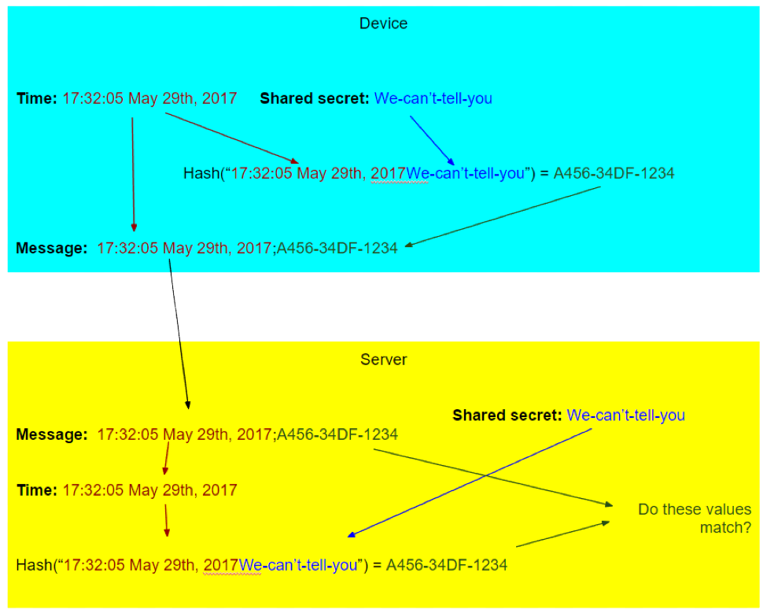
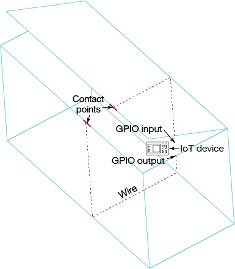
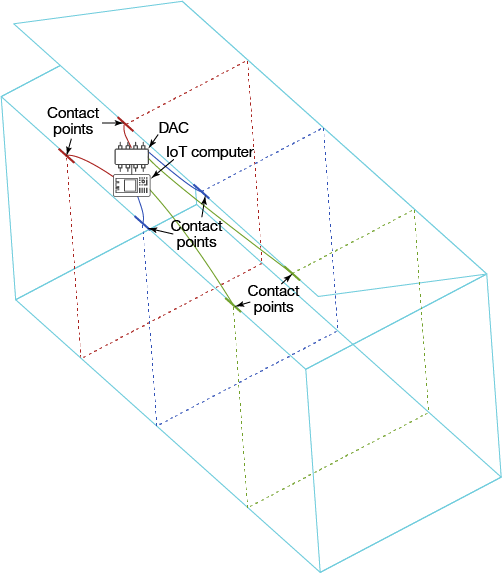

# 识别并预防 IoT 设备面临的威胁
如何在物联网的“都市丛林”中保证设备安全

**标签:** IoT

[原文链接](https://developer.ibm.com/zh/articles/iot-prevent-threats-iot-devices/)

Ori Pomerantz

发布: 2017-08-16

* * *

在野外执行单一业务的 IoT 设备受到攻击的方式，与安全地锁在数据中心内，运行着可供全球各地的人们访问的应用程序的服务器受到攻击的方式完全不同。本文将讨论恶意物理访问带来的威胁，然后讨论 IoT 设备与其他计算机面临的共同威胁。

在识别和预防威胁的过程中，一定要记住安全绝不是静态的。在安全方面，我们必须假设我们面对的攻击者都很聪明，他们会尝试禁用或滥用我们部署的任何安全机制。安全分析的一个重要部分是识别能帮助我们的安全机制，以及如何保护这些机制免受攻击。

## 检测物理访问攻击

IoT 设备面临的最明显威胁是物理威胁。在大多数应用中，攻击者会进来拿走设备，并在以后将其替换为受他们控制的“改进”版本。除非您可以控制设备的位置和能访问它的人，否则此风险不可避免。但是，您可以识别设备何时被关闭或打开，通常需要这样做才能对设备执行逆向工程和“添加特性”。

### 设置和身份验证

新设备激活并首次连接服务器时，您需要验证它确实是您的设备，而不是黑客的计算机。一项安全措施是在装运设备前配置一个共享密钥（为每台设备设置一个不同的共享密钥）。如果生产大量设备，可以考虑其他更容易的安全措施。有关更多信息，请参阅“ [保护 IoT 设备和网关](http://www.ibm.com/developerworks/cn/iot/library/iot-trs-secure-iot-solutions1/index.html)”。

### 检测信号

如果设备每隔 5 秒报告一次“嗨，我仍在正常工作”，则很难将它关闭 5 秒以上而使您毫不知情。当然，如果它每隔 5 秒发送同一条消息，则很容易仿冒此信息。

要创建一条难以仿冒（在您掌控设备之前，因为在您掌控设备之后，设备能做的任何事情您也能做）的检测消息，您可以发送一个包含时间的字符串（所以它每次都是一个新字符串），后跟该时间的 [密码学哈希函数](https://en.wikipedia.org/wiki/Cryptographic_hash_function) 和一个共享密钥。可以在 [使用一个密码学哈希函数创建一条安全、唯一的检测消息。](#使用一个密码学哈希函数创建一条安全、唯一的检测消息。) 中看到此流程的逐步演示。

##### 使用一个密码学哈希函数创建一条安全、唯一的检测消息

如何攻击这种安全机制？检测信号是一种侦查措施或警报机制。侦查措施可能失败的两种方式是：

- _错误否定_ 是指发生了某件应该触发警报的事，但却没有触发警报。
- _错误肯定_ 是一种错误警报。尽管这些警报似乎不那么危险，但最终，太多错误肯定会引发“狼来了”的问题。被例行忽略的警报相当于已被禁用。就安全性而言，我们必须假设另一端的攻击者是一位聪明的对手。

对于检测信号，很难发生错误否定。密码学哈希函数背后的数学原理是十分可靠的。但是，错误肯定的发生却容易得多。攻击者需要做的所有事情就是关闭设备或将它从网络断开。通过使用 USB 电池、备用网络或备用设备，可以让这些攻击变得更难。

#### 电池

或许攻击者能够想到的最简单的攻击方法是将设备断电。这种攻击不是特别可疑，在断电并且人们需要插入别的东西期间，设备一直处于断电状态。

目前的大部分低端设备都使用 USB 供电。USB 电池很便宜，而且能显著减少合理断电次数。根据具体环境，使用 USB 电池可能使您认为断电很可疑，认为断电的设备受到了威胁。

#### 网络连接

大部分 IoT 设备都使用消费级的 WiFi 网络。这些网络快速、廉价且大多数时间都在正常工作。但是 WiFi 网络常常出现大量合理的中断，这会让跟踪 IoT 设备的检测信号变得很困难。对于此问题，可以考虑这两种可能的解决方案：

- 建立一个备用网络（比如蜂窝网络）来保障网络连接。尽管蜂窝网络可能更慢，但它们中断的次数更少。如果您拥有预算，此解决方案可提供可靠的网络连接。
- 在附近的安全位置（一个锁住的房间内）有一台设备能获取检测信号。当一台设备变得不可用时，辅助设备会变成接入点，继续接收检测信号。当连接恢复时，它可以向服务器报告检测信号在正常地持续发送。此解决方案可能便宜得多。

    使用辅助设备来监视检测信号的问题在于，攻击者可以断开网络，拿走两台设备，然后让辅助设备假装检测信号从未中断。此问题的解决方案是“自动切断 (auto-lobotomy)”。如果两台设备都有电池，则很难同时禁用它们。当一台设备发现另一台被禁用时，它可以删除用于自己的检测信号的共享密钥。然后，即使共享密钥被掌握，也无法用于创建虚假消息。但是，删除共享密钥可能不像删除文件那么简单（因为 [文件很容易恢复](https://www.howtogeek.com/187104/warning-anyone-can-recover-deleted-files-from-your-usb-drives-and-external-ssds/)）。如果有片上存储，可以使用给它作为存储共享密钥的最佳位置。如果没有片上存储，例如在 Raspberry Pi 中，在删除密钥后向文件系统写入尽可能多的随机数据可能是个好主意。

### 防篡改的物理设计

IoT 设备通常被放在箱子里，保护它们免受灰尘和潮湿侵害。通过在箱盖两侧安装电触头，可以验证箱子是否被打开过。如果箱盖被打开过，触头会彼此断开，这可以被检测到。不幸的是，这种小伎俩很容易规避。在箱子中钻孔，让接头相互短路，然后再打开箱子，这样就不会检测到接头断开过。 [将 IoT 设备放在箱子里](#将-iot-设备放在箱子里) 中演示了 IoT 设备的这种防篡改的物理设计。

##### 将 IoT 设备放在箱子里

一种更好的解决方案是使用一些 GPIO（通用输入/输出）引脚和一个 ADC（模数转换器）。可以让防篡改设计更难被攻破。使用多条线，在它们之上发送随机数据，并在它们连接到箱子后构建一个 DAC（数模转换器）。例如，可以使用 [电阻梯](https://en.wikipedia.org/wiki/Resistor_ladder) 来实现此目的。然后，将此输出连接到 ADC，验证您从 ADC 获得的值与您发出的值是否匹配。如果连线相互短路，则会改变 DAC “看到”的值，从而改变 ADC 结果。参见 [让防篡改物理设计更难被攻破](#让防篡改物理设计更难被攻破)。

##### 让防篡改物理设计更难被攻破

### 来自传感器的虚假输入

物理访问还对 IoT 设备的另一种攻击提供了方便。攻击者可以向传感器提供错误信息。例如，可在白天使用光线传感器获取天气信息。但是如果有人向传感器发射闪光，或者将不透明的带子放在传感器上，信息就会出错。

一种可能的解决方案是添加对来自传感器的值的合理性检查。如果日光传感器在晚上检测到光，或者在白天没有检测到光，那么您的 IoT 设备可能遭到破坏。如果日光传感器在黎明、中午和傍晚都检测到同样的光照水平，那么您的 IoT 设备可能已被破坏。对传感器数据执行一些合理性检查，会使生成被接受的伪造输入变得更难。

如果设备不是独立使用的，而是用在一个传感器网络中，也可以比较来自不同位置的结果。如果太阳照射在某个地方，但半里外的地方却一片漆黑，那么可以怀疑设备受到了某种破坏。

## 保护 IoT 网络

IoT 设备是一种连接互联网的计算机。尽管 IoT 设备与计算机有所不同，但您应该对 IoT 设备采用保护计算机所用的所有措施。举几个重要的例子，您需要确保仅向互联网开放受到恰当保护的服务器进程，使它们不会被用来攻入设备；加密您传输的任何信息；并强制用户更改管理帐户的默认凭证。

IoT 设备与通用计算机之间存在一个重要的区别。通用计算机拥有非常灵活的使用模式。IoT 设备即使能执行多得多的工作，但通常以高度受限的方式来执行一个或多个功能。要查看如何利用这一区别实施更好的安全保护，请阅读我的另一篇 IBM Developer 文章 [保护嵌入在 IoT 设备中的 Raspberry Pi](https://www.ibm.com/developerworks/library/iot-security-pi-usage-patterns/index.html)。

### 开放端口

开放一些网络端口是有必要的。如果设备拥有基于 Web 的接口，它需要向 HTTP 服务器开放一个端口（最好是 443，而且最好使用 HTTPS）。例如，如果 IoT 设备使用 MQTT 作为客户端（它很可能这么做，因为 [MQTT 常常被视为 IoT 解决方案的最佳网络协议之一](http://www.ibm.com/developerworks/cn/iot/iot-mqtt-why-good-for-iot/index.html)），那么这个端口需要对一个传出连接开放。

但是，通过网络建立的每个连接都是一个潜在的安全威胁。CVE Details 网站提供了一个 [漏洞列表](https://www.cvedetails.com/vulnerability-list/)，其中仅包含已发布的漏洞。还有无数未发布的漏洞，它们可能会影响您在 IoT 设备中使用的程序。尽管我们需要为 IoT 设备提供一些网络访问权限来执行其工作，但除此之外的任何权限都是不必要的风险，应该加以拒绝。此流程就是称为“ [最小特权](https://en.wikipedia.org/wiki/Principle_of_least_privilege)” 的基本安全原则。

在使用通用操作系统时，拦截网络访问的最简单方法是使用防火墙。如果您的 IoT 设备使用了 Linux，那么您可以使用 iptables 应用程序来确保防火墙的正常运行时间和安全性（可在 [这篇文章](https://www.ibm.com/developerworks/cn/opensource/os-iptables/index.html) 中了解详情）。

使用专用操作系统（比如 [NodeMCU](https://developer.ibm.com/recipes/tag/nodemcu/)）的设备开放不需要的网络端口的可能性要小得多。但是，使用 [nmap](https://nmap.org/book/man.html) 验证开放或使用的端口是一个不错的主意。

### 加密

从网络安全角度讲，信息在互联网上传输时可能发生两种攻击，无论是从 IoT 设备传到中央服务器还是从该服务器传回 IoT 设备：

- **盗窃。** IoT 信息可能对其他人有价值。例如，仲夏时的德克萨斯州，有一个房间的空调在上周关闭了，这可能告知盗贼这家人外出度假去了，家里没人，他们可以去盗走家里的物品。
- **仿冒、修改或删除。** 如果家里有可以远程控制的警报系统，盗贼可以在闯入之前发送禁用命令，那么他们会感到更高兴。

可以使用加密和证书来预防这些类型的攻击，您可以在 IBM Developer 文章“ [保护网络上的 IoT 数据](http://www.ibm.com/developerworks/cn/iot/library/iot-trs-secure-iot-solutions2/index.html)” 中了解详情。行业标准解决方案 TLS 存在一个可能的问题是中间人攻击。TLS 包含一个解决方案，也就是标识服务器的证书，但这些证书只有在您实际验证了其中编码的身份时才能保护您。

### 默认凭证

IoT 设备通常是通过网络进行远程管理的。通常，设备从工厂发出时使用了默认凭证（用户名和密码），用户应更改它们。如果用户没有更改默认凭证，攻击者可能会利用它们来控制设备。这种攻击已在 IoT 设备上发生过 – [Mirari、BrikerBot 和 Amnesia 恶意软件程序](https://www.infosecurity-magazine.com/news/datawiping-malware-takes-aim-at/) 曾使用默认凭证攻入 IoT 设备。要避免此问题，用户需要在首次登录时立即更改默认密码，然后再执行任何其他操作。

## 结束语

您可以根据这篇对 IoT 设备面临的安全威胁的总体概述，思考您自己的设备面临的威胁和如何规避它们。没有完美的安全措施，但安全措施可以让您的 IoT 设备比其他目标更难攻击。

本文翻译自： [Identifying and preventing threats to your IoT devices](https://developer.ibm.com/articles/iot-prevent-threats-iot-devices/)（2017-06-08）