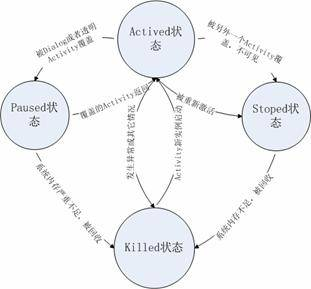
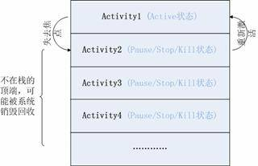
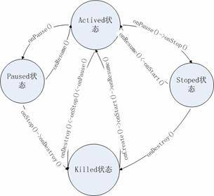
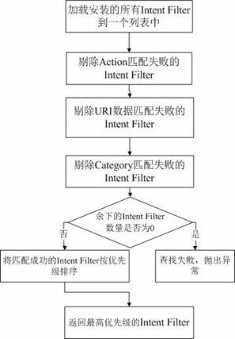

# 详解 Android 的 Activity 组件
了解 Android 的 Activity 组件

**标签:** Android,移动开发

[原文链接](https://developer.ibm.com/zh/articles/os-cn-android-actvt/)

张勇

发布: 2010-01-22

* * *

## Activity 的生命周期

和 J2ME 的 MIDlet 一样，在 android 中，Activity 的生命周期交给系统统一管理。与 MIDlet 不同的是安装在 android 中的所有的 Activity 都是平等的。

### Activity 的状态及状态间的转换

在 android 中，Activity 拥有四种基本状态：

1. **_Active/Runing_** 一个新 Activity 启动入栈后，它在屏幕最前端，处于栈的最顶端，此时它处于可见并可和用户交互的激活状态。
2. **_Paused_** 当 Activity 被另一个透明或者 Dialog 样式的 Activity 覆盖时的状态。此时它依然与窗口管理器保持连接，系统继续维护其内部状态，所以它仍然可见，但它已经失去了焦点故不可与用户交互。
3. **_Stoped_** 当 Activity 被另外一个 Activity 覆盖、失去焦点并不可见时处于 **_Stop ed_** 状态。
4. **_Killed_** Activity 被系统杀死回收或者没有被启动时处于 **_Killed_** 状态。

当一个 Activity 实例被创建、销毁或者启动另外一个 Activity 时，它在这四种状态之间进行转换，这种转换的发生依赖于用户程序的动作。下图说明了 Activity 在不同状态间转换的时机和条件：

##### 图 1\. Activity 的状态转换



如上所示，Android 程序员可以决定一个 Activity 的”生”，但不能决定它的”死”，也就时说程序员可以启动一个 Activity，但是却不能手动的”结束”一个 Activity。当你调用 _Activity.finish()_ 方法时，结果和用户按下 BACK 键一样：告诉 Activity Manager 该 Activity 实例完成了相应的工作，可以被”回收”。随后 Activity Manager 激活处于栈第二层的 Activity 并重新入栈，同时原 Activity 被压入到栈的第二层，从 Active 状态转到 Paused 状态。例如：从 Activity1 中启动了 Activity2，则当前处于栈顶端的是 Activity2，第二层是 Activity1，当我们调用 _Activity2.finish()_ 方法时，Activity Manager 重新激活 Activity1 并入栈，Activity2 从 Active 状态转换 Stoped 状态， _Activity1. onActivityResult(int requestCode, int resultCode, Intent data)_ 方法被执行，Activity2 返回的数据通过 _data_ 参数返回给 Activity1。

### Activity 栈

Android 是通过一种 Activity 栈的方式来管理 Activity 的，一个 Activity 的实例的状态决定它在栈中的位置。处于前台的 Activity 总是在栈的顶端，当前台的 Activity 因为异常或其它原因被销毁时，处于栈第二层的 Activity 将被激活，上浮到栈顶。当新的 Activity 启动入栈时，原 Activity 会被压入到栈的第二层。一个 Activity 在栈中的位置变化反映了它在不同状态间的转换。Activity 的状态与它在栈中的位置关系如下图所示：

##### 图 2\. Activity 的状态与它在栈中的位置关系



如上所示，除了最顶层即处在 Active 状态的 Activity 外，其它的 Activity 都有可能在系统内存不足时被回收，一个 Activity 的实例越是处在栈的底层，它被系统回收的可能性越大。系统负责管理栈中 Activity 的实例，它根据 Activity 所处的状态来改变其在栈中的位置。

### Activity 生命周期

在 _android.app.Activity_ 类中，Android 定义了一系列与生命周期相关的方法，在我们自己的 Activity 中，只是根据需要复写需要的方法，Java 的多态性会保证我们自己的方法被虚拟机调用，这一点与 J2ME 中的 MIDlet 类似。

```
public class OurActivity extends Activity {
    protected void onCreate(Bundle savedInstanceState);
    protected void onStart();
    protected void onResume();
    protected void onPause();
    protected void onStop();
    protected void onDestroy();
}

```

Show moreShow more icon

这些方法的说明如下：

1. **_protected void onCreate(Bundle savedInstanceState)_** 一个 Activity 的实例被启动时调用的第一个方法。一般情况下，我们都覆盖该方法作为应用程序的一个入口点，在这里做一些初始化数据、设置用户界面等工作。大多数情况下，我们都要在这里从 xml 中加载设计好的用户界面。例如：


    ```
    setContentView(R.layout.main);

    ```


    Show moreShow more icon

    当然，也可从 _savedInstanceState_ 中读我们保存到存储设备中的数据，但是需要判断 _savedInstanceState_ 是否为 _null_ ，因为 Activity 第一次启动时并没有数据被存贮在设备中：


    ```
    if(savedInstanceState!=null){
    savedInstanceState.get("Key");
    }

    ```


    Show moreShow more icon

2. **_protected void onStart()_** 该方法在 onCreate() 方法之后被调用，或者在 Activity 从 Stop 状态转换为 Active 状态时被调用。

3. **_protected void onResume()_** 在 Activity 从 Pause 状态转换到 Active 状态时被调用。
4. **_protected void onResume()_** 在 Activity 从 Active 状态转换到 Pause 状态时被调用。
5. **_protected void onStop()_** 在 Activity 从 Active 状态转换到 Stop 状态时被调用。一般我们在这里保存 Activity 的状态信息。
6. **_protected void onDestroy()_** 在 Active 被结束时调用，它是被结束时调用的最后一个方法，在这里一般做些释放资源，清理内存等工作。

##### 图 3\. 这些方法的调用时机



此外，Android 还定义了一些不常用的与生命周期相关的方法可用：

```
protected void onPostCreate(Bundle savedInstanceState);
protected void onRestart();
protected void onPostResume();

```

Show moreShow more icon

Android 提供的文档详细的说明了它们的调用规则。

## 创建一个 Activity

在 Android 中创建一个 Activity 是很简单的事情，编写一个继承自 _android.app.Activity_ 的 Java 类并在 _AndroidManifest.xml_ 声明即可。下面是一个为了研究 Activity 生命周期的一个 Activity 实例（工程源码见下载）：

Activity 文件：

```
public class EX01 extends Activity {
    private static final String LOG_TAG = EX01.class.getSimpleName();
    @Override
    public void onCreate(Bundle savedInstanceState) {
        super.onCreate(savedInstanceState);
        setContentView(R.layout.main);
        Log.e(LOG_TAG, "onCreate");
    }
@Override
    protected void onStart() {
        Log.e(LOG_TAG, "onStart");
        super.onStart();
    }
    @Override
    protected void onResume() {
        Log.e(LOG_TAG, "onResume");
        super.onResume();
    }
    @Override
    protected void onPause() {
        Log.e(LOG_TAG, "onPause");
        super.onPause();
    }
    @Override
    protected void onStop() {
        Log.e(LOG_TAG, "onStop");
        super.onStop();
    }
    @Override
    protected void onDestroy() {
        Log.e(LOG_TAG, "onDestroy ");
        super.onDestroy();
    }
}

```

Show moreShow more icon

AndroidManifest.xml 中通过  节点说明 Activity，将 apk 文件安装后，系统根据这里的说明来查找读取 Activity，本例中的说明如下：

```
<activity android:name=".EX01" android:label="@string/app_name">
     <intent-filter>
         <action android:name="android.intent.action.MAIN" />
         <category android:name="android.intent.category.LAUNCHER" />
     </intent-filter>
</activity>

```

Show moreShow more icon

## 启动另外一个 Activity

_Activity.startActivity()_ 方法可以根据传入的参数启动另外一个 Activity：

```
Intent intent =new Intent(CurrentActivity.this,OtherActivity.class);
startActivity(intent);

```

Show moreShow more icon

当然， _OtherActivity_ 同样需要在 AndroidManifest.xml 中定义。

## Activity 之间通信

### 使用 Intent 通信

在 Android 中，不同的 Activity 实例可能运行在一个进程中，也可能运行在不同的进程中。因此我们需要一种特别的机制帮助我们在 Activity 之间传递消息。Android 中通过 Intent 对象来表示一条消息，一个 Intent 对象不仅包含有这个消息的目的地，还可以包含消息的内容，这好比一封 Email，其中不仅应该包含收件地址，还可以包含具体的内容。对于一个 Intent 对象，消息”目的地”是必须的，而内容则是可选项。

在上面的实例中通过 _Activity. startActivity(intent)_ 启动另外一个 Activity 的时候，我们在 Intent 类的构造器中指定了”收件人地址”。

如果我们想要给”收件人”Activity 说点什么的话，那么可以通过下面这封”e-mail”来将我们消息传递出去：

```
Intent intent =new Intent(CurrentActivity.this,OtherActivity.class);
// 创建一个带"收件人地址”的 email
Bundle bundle =new Bundle();// 创建 email 内容
bundle.putBoolean("boolean_key", true);// 编写内容
bundle.putString("string_key", "string_value");
intent.putExtra("key", bundle);// 封装 email
startActivity(intent);// 启动新的 Activity

```

Show moreShow more icon

那么”收件人”该如何收信呢？在 _OtherActivity_ 类的 _onCreate()_ 或者其它任何地方使用下面的代码就可以打开这封”e-mail”阅读其中的信息：

```
Intent intent =getIntent();// 收取 email
Bundle bundle =intent.getBundleExtra("key");// 打开 email
bundle.getBoolean("boolean_key");// 读取内容
bundle.getString("string_key");

```

Show moreShow more icon

上面我们通过 _bundle_ 对象来传递信息， _bundle_ 维护了一个 _HashMap<string, object>_ 对象，将我们的数据存贮在这个 HashMap 中来进行传递。但是像上面这样的代码稍显复杂，因为 Intent 内部为我们准备好了一个 _bundle_ ，所以我们也可以使用这种更为简便的方法：

```
Intent intent =new Intent(EX06.this,OtherActivity.class);
intent.putExtra("boolean_key", true);
intent.putExtra("string_key", "string_value");
startActivity(intent);

```

Show moreShow more icon

接收：

```
Intent intent=getIntent();
intent.getBooleanExtra("boolean_key",false);
intent.getStringExtra("string_key");

```

Show moreShow more icon

### 使用 SharedPreferences

SharedPreferences 使用 xml 格式为 Android 应用提供一种永久的数据存贮方式。对于一个 Android 应用，它存贮在文件系统的 _/data/ data/your\_app\_package\_name/shared\_prefs/_ 目录下，可以被处在同一个应用中的所有 Activity 访问。Android 提供了相关的 API 来处理这些数据而不需要程序员直接操作这些文件或者考虑数据同步问题。

```
// 写入 SharedPreferences
SharedPreferences preferences = getSharedPreferences("name", MODE_PRIVATE);
Editor editor = preferences.edit();
editor.putBoolean("boolean_key", true);
editor.putString("string_key", "string_value");
editor.commit();

// 读取 SharedPreferences
SharedPreferences preferences = getSharedPreferences("name", MODE_PRIVATE);
preferences.getBoolean("boolean_key", false);
preferences.getString("string_key", "default_value");

```

Show moreShow more icon

### 其它方式

Android 提供了包括 SharedPreferences 在内的很多种数据存贮方式，比如 SQLite，文件等，程序员可以通过这些 API 实现 Activity 之间的数据交换。如果必要，我们还可以使用 IPC 方式。

## Activity 的 Intent Filter

Intent Filter 描述了一个组件愿意接收什么样的 Intent 对象，Android 将其抽象为 android.content.IntentFilter 类。在 Android 的 AndroidManifest.xml 配置文件中可以通过  节点为一个 Activity 指定其 Intent Filter，以便告诉系统该 Activity 可以响应什么类型的 Intent。

当程序员使用 startActivity(intent) 来启动另外一个 Activity 时，如果直接指定 intent 了对象的 Component 属性，那么 Activity Manager 将试图启动其 Component 属性指定的 Activity。否则 Android 将通过 Intent 的其它属性从安装在系统中的所有 Activity 中查找与之最匹配的一个启动，如果没有找到合适的 Activity，应用程序会得到一个系统抛出的异常。这个匹配的过程如下：

##### 图 4\. Activity 种 Intent Filter 的匹配过程



### Action 匹配

Action 是一个用户定义的字符串，用于描述一个 Android 应用程序组件，一个 Intent Filter 可以包含多个 Action。在 AndroidManifest.xml 的 Activity 定义时可以在其  节点指定一个 Action 列表用于标示 Activity 所能接受的”动作”，例如：

```
<intent-filter >
<action android:name="android.intent.action.MAIN" />
<action android:name="com.zy.myaction" />
......
</intent-filter>

```

Show moreShow more icon

如果我们在启动一个 Activity 时使用这样的 Intent 对象：

```
Intent intent =new Intent();
intent.setAction("com.zy.myaction");

```

Show moreShow more icon

那么所有的 Action 列表中包含了” _com.zy.myaction_ ”的 Activity 都将会匹配成功。

Android 预定义了一系列的 Action 分别表示特定的系统动作。这些 Action 通过常量的方式定义在 _android.content. Intent_ 中，以” _ACTION\__ ”开头。我们可以在 Android 提供的文档中找到它们的详细说明。

### URI 数据匹配

一个 Intent 可以通过 URI 携带外部数据给目标组件。在  节点中，通过  节点匹配外部数据。

mimeType 属性指定携带外部数据的数据类型，scheme 指定协议，host、port、path 指定数据的位置、端口、和路径。如下：

```
<data android:mimeType="mimeType" android:scheme="scheme"
android:host="host" android:port="port" android:path="path"/>

```

Show moreShow more icon

如果在 Intent Filter 中指定了这些属性，那么只有所有的属性都匹配成功时 URI 数据匹配才会成功。

### Category 类别匹配

节点中可以为组件定义一个 Category 类别列表，当 Intent 中包含这个列表的所有项目时 Category 类别匹配才会成功。

## 一些关于 Activity 的技巧

### 锁定 Activity 运行时的屏幕方向

Android 内置了方向感应器的支持。在 G1 中，Android 会根据 G1 所处的方向自动在竖屏和横屏间切换。但是有时我们的应用程序仅能在横屏 / 竖屏时运行，比如某些游戏，此时我们需要锁定该 Activity 运行时的屏幕方向，  节点的 _android:screenOrientation_ 属性可以完成该项任务，示例代码如下：

```
<activity android:name=".EX01"
android:label="@string/app_name"
android:screenOrientation="portrait">// 竖屏 , 值为 landscape 时为横屏
............
</activity>

```

Show moreShow more icon

### 全屏的 Activity

要使一个 Activity 全屏运行，可以在其 _onCreate()_ 方法中添加如下代码实现：

```
// 设置全屏模式
getWindow().setFlags(WindowManager.LayoutParams.FLAG_FULLSCREEN,
    WindowManager.LayoutParams.FLAG_FULLSCREEN);
// 去除标题栏
requestWindowFeature(Window.FEATURE_NO_TITLE);

```

Show moreShow more icon

### 在 Activity 的 Title 中加入进度条

为了更友好的用户体验，在处理一些需要花费较长时间的任务时可以使用一个进度条来提示用户”不要着急，我们正在努力的完成你交给的任务”。如下图：

在 Activity 的标题栏中显示进度条不失为一个好办法，下面是实现代码：

```
// 不明确进度条
requestWindowFeature(Window.FEATURE_INDETERMINATE_PROGRESS);
setContentView(R.layout.main);
setProgressBarIndeterminateVisibility(true);

// 明确进度条
requestWindowFeature(Window.FEATURE_PROGRESS);
setContentView(R.layout.main);
setProgress(5000);

```

Show moreShow more icon