# 跨站 XSS
针对跨站攻击的审计逻辑并用 WebGoat 工程实现攻防演练

**标签:** Java,Web 开发

[原文链接](https://developer.ibm.com/zh/articles/j-lo-audit-xss/)

叶林, 张东升, 贺新朋

发布: 2015-11-02

* * *

## 前言

Web 应用是互联网应用的重要形式，是金融、电信、政府部门等社会关键信息系统的门户应用首选。Web 应用的组件技术和支撑手段不断丰富变化。一般来讲分为使用 Java 的、使用 PHP 的和只使用 JavaScript 实现的三大类。其中的 Java Web 发展较早，所依托的 JEE 体系比较成熟，在企业级应用中比较常见。其中的 PHP Web, 因为 PHP 开发社区提供了很多优秀的论坛网站框架，所以在论坛网站开发中比较常用。而 JavaScript 通常用于浏览器的前端编程，近年其 Node.js 平台提倡在服务器端和客户端都使用 JavaScript，一时风行。传统的 Java Web 市场占有率较高，是本文讨论的对象。

Web 应用安全不容小觑。黑客对于 Web 应用的攻击热点，从早年的针对服务器系统平台，转到针对浏览器。因为寻找服务器上漏洞成本高，越来越难；而浏览器或者客户端的攻击技术，比如 SQL 注入、 跨站脚本 (XSS) 等技术门槛低，攻击成本低，相对容易实现，已显泛滥之势。WAP 防火墙虽然能根据内容过滤一些网络流量，但是如果所有进出的网络流量都需要在应用层上进行检测，系统性能和成本付出较大。对服务器配置 HTTPS，加密客户端和服务器之间的 HTTP 内容，虽然能保护信息隐私，但是还不足以单独对抗除了数据窃听之外的种类繁多的 Web 攻击。

提高 Web 信息系统的安全性一个有效手段是对系统源代码进行静态扫描。这样可以在系统代码上线、问题发生之前，检查系统可能存在的安全风险，防微杜渐，及时整改。

源代码审计是一个系统工作。针对 Java Web 的静态扫描工具很多，商用工具 Fortify 或者开源工具 Findbugs。各种工具并不健全，不同工具都具有不重复的功能，可以进行多种工具配合使用以获得更大的检验覆盖程度。同时，这些分析工具们产生的结果有可能包含误判或者漏判。这时还需要人工审计。开发人员要经过安全开发的训练，安全审计人员要经过审计训练，才能熟练掌握 Java Web 源代码安全审计方法。

“JavaWeb 工程源代码安全审计实战”系列基于著名的 Web 应用安全研究组织 OWASP 维护的 Java Web 开源项目 WebGoat，实战演练对整体工程的安全审计。按照漏洞严重从高到低程度，抽取几个审计结果展示。通过该系列可以了解以下几种高危漏洞的审计思路：跨站、SQL 注入、文件路径操纵和系统日志欺骗。

本文是 JavaWeb 工程源代码安全审计实战的第一部分，主要针对跨站攻击，讲解审计逻辑，用 WebGoat 工程实现攻防演练。

## 源代码审计概述

安全审计人员分析重点和思路都是围绕寻找 Source 和 Sink 展开。Source 是污染源，有害数据的入口点。Sink 是程序执行造成危害爆发部分。面对一个 Java Web 源码工程，审计人员：1）首先要在扫描工具的帮助下，初步了解所有的 Source(有文献也叫 Taint) 和 Sink；2）接下来追踪污染路径，确定 Source–Path–Sink ，逻辑再现攻击，避免工具的漏报误报；3）如果条件允许，可以进行漏洞利用开发，Web 渗透测试，真实攻击；4）对于定位出的源码漏洞，要提出整改意见；5）对修改后的源码进行二次审计，避免整改副作用。

### 工程目标

对 WebGoat 工程项目的源代码进行安全审核。WebGoat 是应用安全研究组织 OWASP 精心设计并不断更新的，专门设计用于展示各种 Web 漏洞的 Java Web 工程。涉及语言为 Java 和 JSP，也包含部分 JavaScript。涉及文件包括这些编程语言源码文件，也包括工程部署描述符和服务器运行环境配置文件。

审核源代码中的漏洞，包括能引发常见 Web 应用威胁的漏洞和基于语言缺陷的漏洞，并给出解决方案。审核环境配置文件，并给出安全加固建议。

### 漏洞类型

**Web 应用威胁**

Web 攻击和应用威胁种类繁多。早年间攻击者对服务器系统安置可执行文件，通过本地访问或远程访问这些文件，达到控制服务器目的。现在更倾向攻击客户端，因为技术门槛低，实施成本小。国际组织 OWASP 按危害程度排出前十名 Web 应用安全威胁，成为业内标杆参考。通过代码审计发现程序薄弱点后，整改这些薄弱点，可以对抗部分 Web 应用威胁。

##### 表 1.OWASP Top 10 2013

Web 应用安全 威胁种类威胁实施途径导致结果A1. 注入 （SQL 注入、OS 命令注入、XPATH 注入、LDAP 注入、JSON 注入、URL 注入）页面输入，拼凑字符串，语句执行代码逻辑依赖于外部输入，可导致不可预期的行为A2. 失效的身份认证和会话管理改变 cookie 内容扮演成为其他用户身份A3. 跨站脚本（XSS）利用 URL 夹带/附加 JavaScript 执行脚本，嵌入木马代码访问服务端敏感数据或者威胁客户本地安全A4. 不安全的直接对象引用URL 参数解码猜测 URL 对象内容A5. 安全配置错误修改权限配置文件越权访问修改执行，捣毁服务器或应用程序A6. 敏感数据暴露各种不可预料的问题A7. 功能级别访问控制缺失文件路径操纵捣毁服务器或应用程序A8. 跨站请求伪造（CSRF）诱骗点击恶意 URL扮演成为合法用户身份A9. 使用已知易受攻击组件使用第三方组件，不注意维护不可预料的问题A10. 未验证的重定向和转发登录页面跳转用户密码泄露

**Java 和 JSP 语言代码缺陷**

能工作的代码并不代表好代码。编程语言天然的代码缺陷，易引导开发者犯错，造成程序不健壮，是代码审计的靶点。

**部署描述符和生产环境配置问题**

Java Web 应用工程部署并运行在服务器环境中，所以代码安全审计除了检查编程语言（Java, JSP，JavaScript）文件，还要检查应用和服务器的配置文件，对生产环境进行安全加固。

## 源代码审核结果综述

本次源代码审计工作共检查 WebGoat 工程代码行数 39,422 行，包括 Java（34,349 行）， JavaScript（632 行）和 JSP(4441 行)。

共发现累计上百个代码缺陷。其中接近一半高危缺陷。具体情况如下表所示。

##### 表 2\. 源代码审计结果综述表

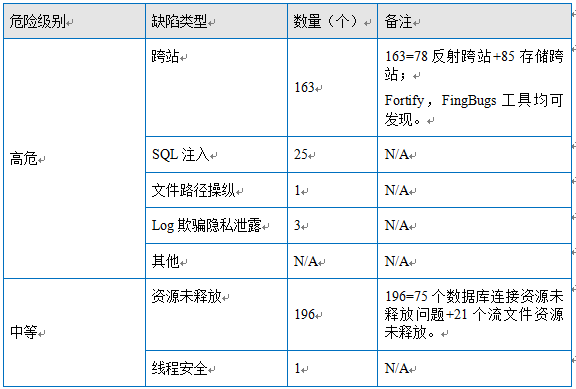

## Web 应用威胁之跨站 (XSS)

### 技术原理

WebGoat 工程源代码有跨站的问题。跨站的本质在于执行脚本，让受害者浏览器执行攻击者设计的 JavaScript/Flash/Html 等。

跨站发生的条件有两个：1）来自不可信数据源的污染数据。在反射性跨站攻击中，污染数据来自页面请求。在存储型跨站中，污染数据来自服务器后台数据库。2）污染数据未经检验就被作为动态内容提交给用户浏览器执行。

### 问题分析之反射跨站 ReflectedXSS.java：187

源代码审计发现 ReflectedXSS.java 第 187 行 addElement () 方法向浏览器发送未经验证的数据，如果这个数据是来自攻击者的 JavaScript 代码，浏览器会执行攻击者命令。

本例中，完成一次完整的污染传播 Source-Path-Sink 三步骤如下：

ParameterParser.java 第 615 行使用 getParameterValues() 从网页 request 获取数据，代码片段如下：

##### 图 1\. 污染数据来自不可信任的数据源 (Source)


ReflectedXSS.java 第 597 行使用 getRawParameter() 传播污染数据，代码段如下：

##### 图 2\. 污染数据在程序体内部沿路径传播（Path）


ReflectedXSS.java 第 75 行使用来自污染源 field1 的数据对 param1 赋值，并用 param1 构造页面元素，代码段如下：

##### 图 3\. 污染源 field1 对 param1 赋值

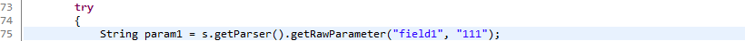

下图来自 Fortify 分析工具，红色箭头指示传播路径，右紫色框代表 Source，左红色框代表 Sink。

##### 图 4\. 污染数据传播路径图

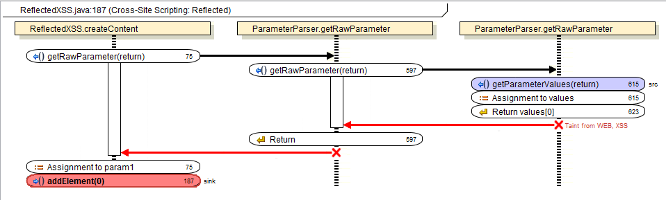

SqlStringInjection.java 第 187 行 addElement () 使用了来自不可信数据源的污染数据构建页面元素，代码片段如下：

##### 图 5\. 污染数据被用来构造页面元素 (Sink)

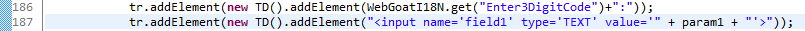

至此污染源，路径，爆发点（Source-Path-Sink）确定。注意到污染数据在传播路径上，没有校验过滤过，满足技术原理中 XSS 攻击条件：1) 来自不可信数据源的污染数据；2) 污染数据未经检验就被作为动态内容提交给用户浏览器执行。代码审计逻辑上可以判断这是一个 XSS 漏洞。

**攻击场景**

在已部署的 WebGoat 工程，启动生产环境（WebGoat 工程使用见附录）。

在左侧导航目录下点选” Reflected XSS Attacks”, 在右侧页面最下方的文本框 Enter your three digit access code：输入。

观察弹框出现。弹框脚本的成功执行证明页面存在跨站漏洞。

##### 图 6\. 反射跨站攻击场景

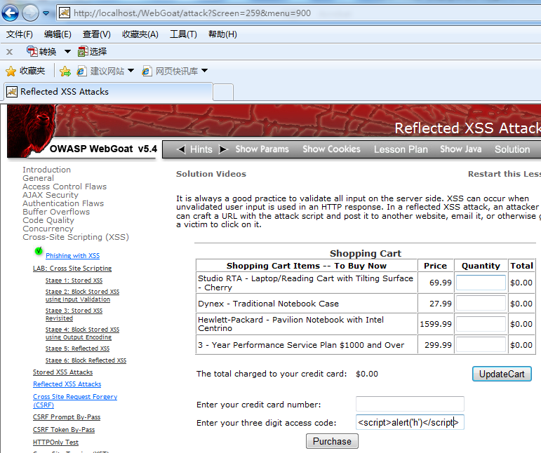

弹框脚本不具强大攻击力，但是其他恶意脚本可以作为系列高级可持续攻击 (APT) 的组成部分。比如先诱骗受害者访问攻击者构造的 html 页面元素 Image，而 Image.src 属性要求浏览器访问某个地址 (URL)，该 URL 是恶意脚本读取受害者当前用户页面的 session、cookie 等敏感信息并动态拼接而成，形如 http：//hacker.com&victomCookie=cookie。这些敏感信息被发送到攻击者可控制的 URL，被攻击者读取。在金融操作中，用户帐号、余额等敏感信息可以这样被泄露。

XSS 攻击永远不止步于弹框、收集页面 cookie 信息。XSS 的本质在于浏览器端执行脚本。有人甚至说 览 XSS is the New Buffer Overflow, JavaScript Malware is the new shell code”。这是类比传统对服务器的攻击手法：在服务器操作系统堆栈中用缓冲区溢出，改写程序返回地址的方法，把执行程序引向执行恶意代码。这种传统的针对服务器的攻击实施门槛高。XSS 攻击在受害者环境引导浏览器执行恶意代码。进而通过攻击用户本地电脑其他服务。跨站攻击实施门槛低，攻击力强大，需要认真审计源码，规避 XSS 漏洞。

以上审计分析的反射跨站，污染数据直接来自受害者浏览器页面请求 web request，攻击要临机操作，执行有难度。下面审计分析存储跨站。存储跨站的攻击者和受害者使用各自现场浏览器，执行攻击相对容易。

### 问题分析之存储跨站 StoredXSS.java：230

源代码静态扫描发现 StoredXSS.java 第 230 行 makeCurrent() 方法向浏览器发送未经验证的数据，如果这个数据是来自攻击者的 JavaScript 代码，浏览器会执行攻击者命令。本例中，完成一次完整的污染传播 Source-Path-Sink 三步骤如下：

StoredXss.java 第 218 行使用 executeQuery() 从数据库读取数据，代码片段如下：

##### 图 7\. 污染数据来自不可信任的数据源 (Source)

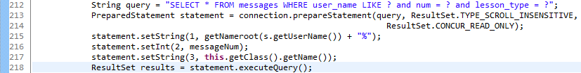

本案例数据库是不可信任的数据源，因为进一步分析数据库发现数据来自未经校验的网页用户输入。

更进一步分析数据库的数据来源：

ParameterParser.java 第 615 行使用 getParameterValues() 从网页 request 获取数据，代码片段如下：

##### 图 8\. 从网页获取数据

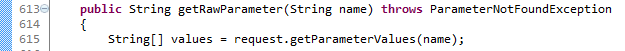

StoredXss.java 第 97 行执行 getRawParameter() 从网页 request 获取数据，付给 message。第 110 行执行 execute()，向数据库写入 message 。代码片段如下：

##### 图 9\. 向数据库写数据

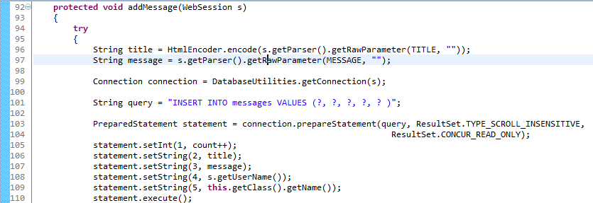

观察数据传播过程，没有对写入数据的校验过滤。

从数据库中读取到的污染数据，在程序体内流转后到达爆发点，即红色框代表的 Sink。下图来自 Fortify 分析工具：

##### 图 10\. 污染数据在程序体内部沿路径传播（Path）

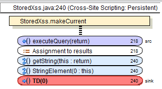

StoredXss.java 第 230 行 makeCurrent() 使用了来自不可信数据源的污染数据 results，构建页面元素，代码片段如下：

##### 图 11\. 污染数据被用来构造页面元素 (Sink)

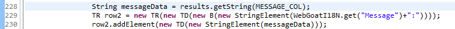

至此污染源，路径，爆发点（Source-Path-Sink）确定。注意到污染数据在传播路径上，没有被校验过滤过，满足 XSS 攻击的两个条件：1) 来自不可信数据源的污染数据。2) 污染数据未经检验就被作为动态内容提交给用户浏览器执行。所以代码审计逻辑上可以判断这是一个 XSS 漏洞。被污染的数据存放在服务器数据库中。进一步推断这是存储型 XSS 漏洞。

**攻击场景**

在已部署的 WebGoat 工程，启动生产环境。（WebGoat 工程使用见附录）

模拟攻击者登录，在左侧导航目录下点选 “Stored XSS Attacks”, 在 Title 文本框输入 “anyTitle”, 在 Message 文本框输入”“点击提交按钮。污染数据存入后台数据库。攻击完成。

##### 图 12\. 存储跨站攻击场景

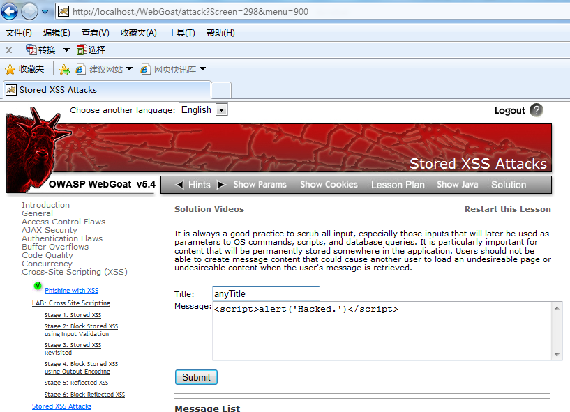

受害者启动一个新浏览器，在左侧导航目录下点选” Stored XSS Attacks”, 在页面上找到并点击” anyTitle”字样超链接，观察弹框出现。证明页面存在执行恶意脚本的能力。

### 解决方案

**快速修复**

解决 WebGoat 工程的反射跨站问题，可以在 ReflectedXSS.java 第 75 行使用 WebGoat 自实现的 HtmlEncoder.encode() 对污染数据编码处理后再输出。代码片段如下：

##### 图 13\. 整改反射跨站的代码

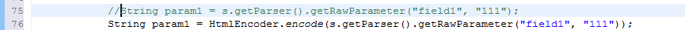

类似的，解决 WebGoat 工程的存储跨站问题，可以在 StoredXSS.java 使用以下代码片段：

##### 图 14\. 整改存储跨站的代码

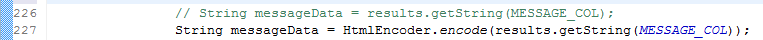

整改代码编译部署后，WebGoat 生产环境的攻击场景不再出现。

以上代码的整改思路是”输出编码”。对输出到客户端的字符串进行编码可以使系统更加安全。

将“<”编码为“<”，“””编码为“””，这样“

除了“输出编码”，XSS 跨站的解决方法还有“输入验证和数据净化”。以下系统讲解 XSS 各种解决方案。

### 举一反三

XSS 跨站问题的根本原因是对输入参数处理不当。解决思路有两条：“输入验证数据净化”和“输出编码”。

基于 HTTP 通信协议的 Web 应用中，服务器先接收请求，再应答请求把字符串输出到客户端。对 XSS 跨站的防范应该部署在服务器输入和输出两个阶段。当服务器接收输入请求时，进行数据验证和净化。当服务器输出应答请求时，对应答字符串进行编码。"输入验证”和"输出编码”可以独立实施，也可互为补充。

**输入验证和数据净化**

输入验证和数据净化一般使用过滤器，基于黑白名单进行数据净化。使用过滤器有三点需要注意。

1. 首先强调过滤要在服务器端进行，客户端的验证容易被绕过。只要攻击者用抓包工具捕获从客户端发送到服务器的报文、修改并重放，就有可能攻击成功。在服务器端代码已经实施过滤的基础上，可以建议在客户端也可以进行过滤，多次过滤的目的是减少服务器的负荷。

2. 其次要注意先标准化，然后再检验字符串。


因为不同版本 unicode 编码集的不同，所以同一个字符没有唯一的二进制表达，存在二义性。比如尖括号<>，在一种 unicode 版本中可能表达为“\\uFE64” “\\uFE65”, 在另外 unicode 版本可能表达为另外形式。

通常用 NFKC 格式对任意编码的字符串进行标准化，消除二义性（当然还有 NFKD 标准化形式，总要选一种）。代码如下：

String s =“\\uFE64”+“script”+“\\uFE65”;

s = Normalizer.normalize(s, Form.NFKC);

pattern.matcher(s)

1. 还要注意过滤内容必须充分。按照安全权限最小化的思想，尽量使用白名单。因为黑名单列举有限，挂一漏百。白名单可以结合业务逻辑进行编排，比如年龄字段只允许输入数字。如果业务逻辑不容易枚举白名单，只能通过黑名单过滤，那么要保证过滤内容的充分，一级防范至少要过滤掉"<”、">”、"'”、""”和"\\”五个特殊字符。代码如下：

Pattern patter = Pattern.compile(“<\|>\|'\|”\|\\”)

更深一步的防范可以考虑以下的内容：

过滤“<”、“>”将用户输入放入引号间，基本实现数据与代码隔离；

过滤双引号，防止用户跨越许可的标记，添加自定义标记；

过滤 TAB 和空格，防止关键字被拆分；

过滤 script 关键字；

过滤&# 防止 HTML 属性绕过检查。

4 过滤设计要综合考量性能因素，选择多次过滤或者单字符过滤。

首先认识到过滤的副作用，英语语义可能破坏，yours' 会被过滤为 yours。其次有时需要多次过滤，例如<scrip

以上在服务器输入端进行整改。下面讲述在服务器输出端的整改方法。

**输出编码 (Html encode)**

以下三方法任选其一

1. 开发者自己实现编码输出，可以参考 WebGoat 工程源码 HtmlEncoder.java，也可以简要实现如下：

private String cleanXSS(String value) {

value = value.replaceAll("<", "& lt;")；

value=value.replaceAll(">", "& gt;");

value = value.replaceAll("'", "& #39;");

// to be augmented..

return value;

```
}

```

Show moreShow more icon

1. 也可以使用 Apache 的 commons-lang.jar 提供系统库函数：

StringEscapeUtils.escapeHtml(str);

HTML 的输出编码是防止注入 XSS 的通用手法，除了 Java，其他语言都有提供对 HTML 的输出编码：

PHP 的 htmlentities() 或是 htmlspecialchars()。

Python 的 cgi.escape()。

ASP 的 Server.HTMLEncode()。

基于.net 开发的 Web 应用，系统库函数 AntiXss.HtmlEncode Java 的 xssprotect(Open Source Library)。

Node.js 的 node-validator。

3.WebGoat 是独立实施的 Web 应用。但是现实 Web 应用可以基于一些框架，比如 Spring Struts Hiberante。如果使用 Spring 框架进行 Java Web 开发，可以在 web.xml 文件中设置 HTML encode，在 JSP 文件页面元素 form 中确定实施。

web.xml 加上：

defaultHtmlEscape

true

forms 加上：

**纵深防御**

除了通用的输入验证和输出编码防御思路。有些特定的页面元素，也有自己的防 XSS 属性设置。

1. 设置 cookie 的 HttpOnly 属性

XSS 通常被用于偷取 cookie 内容。在设置 cookie 时使用 HttpOnly 参数，限制 cookie 作为 DOM 对象存取。

1. 设置的 security 属性

IE6 以后的版本提供和新的 security 属性，可以针对个别的 frame 或 iframe 设定 Restricted Sites，在 Restricted Sites 区块内将不支持 scripts 语法的执行。代码片段如下：

```
<frame security="restricted"src="http://www.somesite.com/somepage.htm"></frame>

```

Show moreShow more icon

## 结束语

本文是 JavaWeb 工程源代码安全审计实战的第 1 部分，主要针对跨站攻击，讲解审计逻辑，用 WebGoat 工程实现攻防演练。JavaWeb 工程源代码安全审计实战的第 2 部分，将审计 SQL 注入攻击，欢迎阅读。