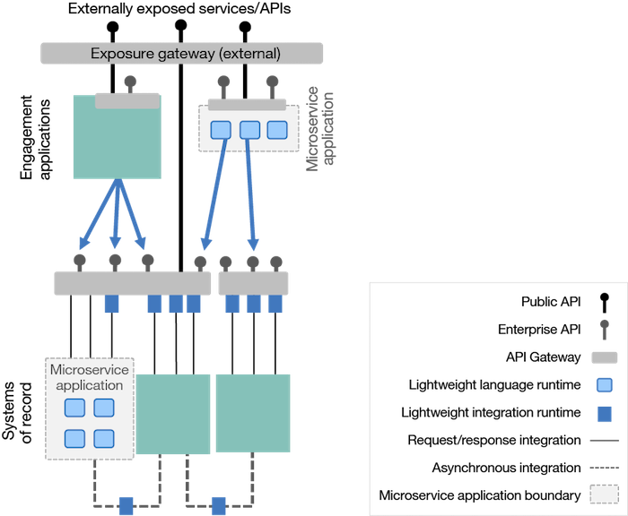
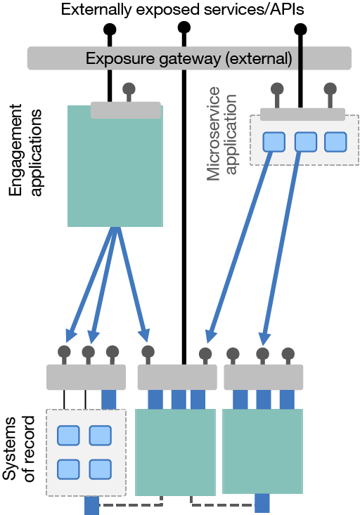
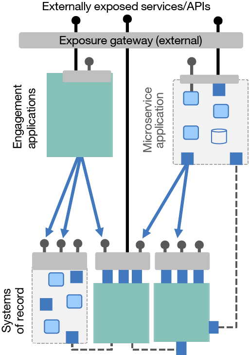

# 转变为轻量级、敏捷集成
一种容器化的、去中心化的云就绪连接方法

**标签:** API 管理,云计算,容器,微服务

[原文链接](https://developer.ibm.com/zh/articles/cl-lightweight-integration-2/)

Kim Clark

更新: 2018-05-08 \| 发布: 2018-03-28

* * *

在这个包含两部分的系列中，将探索现代集成架构采用何种方法来确保它们能够像相互连接的应用程序一样敏捷。中心化企业服务总线 (ESB) 的模式有其自己的用途，而且在市场上仍有一席之地，但许多企业正在探索更加容器化和去中心化的集成架构方法。这种方法被称为 **敏捷集成架构**，但请注意，过去 _轻量级集成_ 一词也曾被使用。

[第 1 部分](https://www.ibm.com/developerworks/cn/cloud/library/cl-lightweight-integration-1/index.html) 探讨了 ESB 的命运。其中不仅分析了中心化 ESB 模式如何和为什么在面向服务架构 (SOA) 时代出现，还分析了它带来的挑战。我们还考虑了在这种情况下能够在何处应用 API，以及所有这一切与微服务架构之间可能存在的关系。现在，这一历史背景使我们能够充满信心地声明如何在未来做得更好。

第 2 部分将介绍敏捷集成架构，分析集成架构如何从微服务背后的技术和原则中获益，从而确保新应用程序能以现代创新的速度和规模来执行它们所需的集成。您还将了解集成如何从根本上变得更加去中心化，以便为各种业务提供更高的自主性和生产力。我们首先会探讨微服务原则在集成架构中的优势。

## 在集成中使用微服务原则

如果以更精细的方式构建应用程序是有意义的，为什么不将这一概念也应用到集成中呢？我们可以将企业级的中心化 ESB 组件分解为更小、更容易管理、更专用的组件。甚至精细到我们公开的每个接口都有一个集成运行时，但在多数情况下，为每个组件捆绑少数集成就足够了。

##### 将中心化的 ESB 分解为可独立维护的、可扩展的部分

高度中心化的 ESB 模式可以按这种方式进行分解，旧的中心辐射型模型也可以这样做。这使得每个集成更容易独立更改，并提高了敏捷性、扩展能力和灾备能力。

此方法使您在对一个集成执行更改时，保证您不会向运行其他集成的环境中引入任何不稳定性。可以选择使用集成运行时的一个不同版本来利用新特性，而不对其他所有集成强制执行存在风险的升级。可以完全独立于其他集成来扩展一个集成，非常高效地使用基础架构，尤其是在使用基于云的模型时。

**免费试用 IBM Cloud**

通过 [IBM Cloud Lite](https://cloud.ibm.com/?cm_sp=ibmdev-_-developer-articles-_-cloudreg) 快速轻松地构建您的下一个应用程序。您的免费帐户永不过期，而且您会获得 256 MB 的 Cloud Foundry 运行时内存，以及包含 Kubernetes 集群的 2 GB 存储空间。

当然，此方法有一些考虑因素需要解决，比如更多活动部分所带来的更高复杂性。另外，尽管可以使用虚拟机获得上述结果，但在使用诸如 Docker 之类的容器和诸如 Kubernetes 之类的编排机制时，长期收益可能更高。向集成团队引入新技术可能增加学习曲线。但是，如果企业在其他领域探索过微服务架构，它们可能已经历过同样的挑战，所以组织内可能已有这方面的专家经验。

上面描述的细颗粒度集成部署只是我们更广泛地描述为 **敏捷集成架构** 的一个方面。我们使用这个术语来区分它与更纯粹的微服务应用程序体系结构。我们还想标记它与“ESB”术语的区别，这个术语与更繁琐的集中式集成架构密切相关。值得注意的是，这个概念曾使用了“轻量级集成”这个术语，但“敏捷集成架构”现在被认为更符合行业。

本文将继续总结敏捷集成架构的其他方面。 越来越多关于此主题的更详细的内容也可以通过 [另外的博客文章](https://developer.ibm.com/integration/blog/2017/09/18/lightweight-integration-useful-links/) 获得。

## 现代集成运行时是什么样的？

显然，敏捷集成架构需要以完全不同的方式来部署集成拓扑结构。它的一个关键方面是，一个能在基于容器的环境中运行且非常适合云原生部署技术的现代集成运行时。现代集成运行时与其过去的类似概念几乎无法区分。它们没有依赖关系，所以不再需要数据库或消息队列。安装它们很简单，只需将它们放在文件系统上并启动 — 这非常适合 Docker 映像的分层文件系统。所有配置都在属性文件和命令行接口中，所以它们可以轻松地合并到构建管道中。它们是非常轻量级的集成，以至于只需几秒即可启动和停止，而且可以通过诸如 Kubernetes 之类的编排框架进行轻松管理。

IBM App Connect Enterprise（以前称为 IBM 集成总线）是这样一个运行时的良好示例， [这篇博客文章](https://developer.ibm.com/integration/blog/2017/03/31/lightweight-integration-iib/) 中更详细地介绍了它。像其他集成服务器一样，IBM App Connect Enterprise 不是 ESB；ESB 只是使用它的模式之一。它也用在各种各样其他架构模式中，而且在敏捷集成架构模式中的使用也不断增加。

## 去中心化集成

我们可以更进一步。将集成分解为不同部分后，您可以选择从所有权和管理角度上采用不同方式来分发这些部分。请注意，不仅大部分集成运行时变得更加轻量化，它们也变得更易于使用。要使用一个优秀的现代集成运行时，您不再需要成为深度集成专家。

从技术上讲，这与前面的图没什么不同。改变的只是集成组件的所有者。您能否让应用程序团队自己执行集成？他们能否负责创建和维护属于其应用程序的集成？您会注意到，我们还展示了公开网关的去中心化，以表明公开 API 方面的管理工作也转交给了应用程序团队。

##### 将集成去中心化给应用程序团队

这种去中心化的集成方法有许多潜在优势：

- 独立 SOA 团队的一种常见挑战是，他们不理解自己要公开的应用程序。应用程序团队比任何人都更了解他们自己的应用程序的数据结构。
- 更少的团队将参与到解决方案的端到端实现中，这显著减少了跨团队沟通、延迟，以及这些情况下通常无法避免的瀑布式开发。

再次重申，去中心化的集成是一种组织变革，而不是技术变革。

当然，此方法并不适用于所有情形。它可能适合于一些组织，或者适合于一些组织的某些部分，但不适合其他部分。旧应用程序的应用程序团队可能没有执行集成工作的合适技能集。可能需要向他们的团队引入集成专家。这个工具可能为变更和扩展实现更高的敏捷性，但在应用程序大部分已经冻结了一段时间的时候，该怎么办？到最后，一些组织会发现保留更加中心化的集成团队会更容易管理。该方法应该应用到最需要这些优势的地方。话虽如此，这种风格的去中心化集成是许多组织和应用程序团队始终想要做的，但他们可能需要先克服一些技术障碍。

请注意，这种对集成和公开所有权的去中心化的发展不一定意味着提供一个去中心化的基础架构。尽管每个应用程序团队显然都可以拥有自己的公开网关和容器编排平台，但这不是理所当然的。重要的是他们可以自主地工作。API 管理通常采用以下方式实现：采用一个共享基础架构（一个网关 HA 对和一个 API 管理组件安装），但每个应用程序团队都直接管理自己的 API，就像他们拥有自己的单独基础架构一样。例如，IBM API Connect 在以多租户方式共享API基础架构的方法中实现了这种灵活性，但它仍为团队提供了对其公开的 API 的完全自主权。也可以对集成运行时这么做，方法是提供一个可以部署集成运行时的中心化的容器编排平台，但为应用程序团队提供独立于其他团队部署自己容器的能力。

如果说此方法存在一个缺点，那可能是如何管理每个应用程序团队可能使用该技术的多种不同方式 — 如何鼓励采用标准的使用模式和最佳实践。自主可能导致分歧。如果每个应用程序团队都按自己的风格和约定创建 API，希望重用这些 API 的用户可能很难理解它们。对于 SOA，试图为 SOAP 协议如何使用的每个方面创建严格的标准，这不可避免地会使 SOA 更难理解并导致采用率降低。对于 RESTful API，在约定而不是硬性标准上实现统一更常见一些。无论如何，需求都是显而易见的：即使在去中心化的环境中，也需要找到一些途径来确保整个企业中有适当的共性水平。当然，如果您已在企业的其他地方探索过基于微服务的方法，那么您应该很熟悉将面临的关于自主性的挑战。

值得注意的是，在迁移到云时，这种去中心化方法特别强大。集成已通过一种云友好方式得到实现，而且与记录系统保持一致。与应用程序相关的集成已与其他不相关的集成分离，所以可以更干净地将它们与应用程序一起迁移。此外，如果使用云就绪原则和基础架构即代码方法来进行设计的话，基于容器的基础架构会更容易移植到云，还能更有效地使用基于云的扩展和成本模型。对于应用程序团队也拥有的集成，实际上可以将其打包为应用程序本身的一部分。简言之，去中心化的集成显著改善了云就绪性。

我们现在已偏离中心化的 ESB 模式很远 — 诚然，这个术语对这种完全去中心化的模式没有任何意义 — 但我们仍将实现相同的目标，那就是让应用程序数据和功能可供企业内外的其他应用程序重用。

## “应用程序”与“集成”之间有何区别？

应用程序开发小组开始执行集成后，仍有一个大问题需要解决：他们在何处执行 _集成_，而不是 _应用程序_ 开发？

“应用程序”与“集成”之间的这种平衡行为不断困扰着 SOA，因为它加深了应用程序与集成部门之间的分歧，而且团队之间最终的层叠瀑布式需求减慢了项目进度。集成团队经常被告知，他们只应执行集成逻辑而不是应用程序逻辑，这样做通常是为了避免将业务逻辑扩散到整个企业中的不同团队和组件。

但如果没有单独的团队呢？如果像上一小节中介绍的那样，它是一个单独的团队，并且有许多不同的专用工具，该怎么办？例如，一个人可能专注于用户界面，另一个人可能更加专注于解决方案的特定需求，比如规则引擎或机器学习。当然，同样始终需要执行一些集成。

在微服务应用程序中，各个微服务组件相对较小且比较专业。人们往往发现一些人的职责适合某个集成引擎。例如，如果一个微服务组件执行的所有操作只是为了提供一个 API 对其他系统执行调用、核对和合并结果，并响应调用方，结果会怎样？这听起来很像一种 _集成_。在未来，一个简单的图形流 — 其中展示了您正在调用哪些系统，允许您轻松地发现在哪里合并了数据项，并提供这种映射的一种可视表示 — 比数百行代码容易维护得多。

那么这有何实际意义？就像在前面几个小节中看到的，集成运行时现在是一个真正轻量级的组件，可以在云原生风格下运行。微服务架构的一个关键优势是，您不再局限于一种语言或运行时，这意味着您可以拥有一种 **多语言运行时** — 一个包含不同运行时的集合，其中每个运行时都适合不同的用途。所以，不会由于技术原因，导致您无法引入集成作为您的微服务应用程序的另一个运行时选项。

##### 使用轻量级集成运行时作为微服务组件

让我们看看另一个示例。得益于事件源应用程序等模式的流行和对最终一致性技术的使用，在微服务领域，人们再次对消息传递产生了兴趣。您或许会发现大量微服务组件，它们仅接收来自某个队列或主题的消息，执行一些转换，然后将结果推送到一个数据存储中。但是，他们可能需要数量惊人的代码来执行这些操作。集成引擎可以通过能轻松配置的连接器和图形数据映射来执行该工作，所以您不需要太深入地理解消息传递和数据存储连接的微妙细节。这也可以提供一个容易维护的流程图和数据模型映射，以便未来更容易维护。

在讨论到此方法时，一个不可避免的问题是， _我在微服务应用程序中使用的是 ESB 吗？_ 正面解决这个问题非常重要。您可能还能回想起之前的定义，集成运行时 _不是_ ESB。ESB 只是可以包含集成运行时的架构模式之一。根据 [第 1 部分](http://www.ibm.com/developerworks/cn/cloud/library/cl-lightweight-integration-1/index.html) 中的讨论，ESB 是高度中心化的、企业级的架构模式。使用一种现代轻量级集成运行时来实现应用程序的集成相关方面，将每个集成单独部署到不同组件中，这确实与中心化的 ESB 模式非常不同。所以答案是 _否_，通过使用轻量级集成引擎来对离散的集成执行容器化，您几乎肯定 _不会_ 在微服务应用程序中重新创建 ESB 模式。

相较于集成运行时最初想要做的事，这是对它的用途的一种完全不同的解释。在传统上，集成运行时主要用于不同应用程序 _之间_ 的集成（而且他们肯定会继续扮演这一角色），但是，我们在这里将它作为应用程序 _中_ 的一个组件来讨论它的用途。

在过去，这很难做到，因为集成运行时不被视为应用程序开发人员工具箱的一部分。应用程序从一开始就被编写为单语言孤岛应用程序，比如 JEE 应用服务器上的 Java，而且开发团队没有创建或运行集成的技能。在那时，集成运行时由一个完全不同的团队所有和实现，这个团队在集成产品和集成模式上拥有精深的技能。

随着集成运行时和工具变得更简单，将不再需要一个单独的专门团队来实现和运营它们。集成的创建和维护要容易得多。可以使用用于其他微服务组件的相同工具和技术对它们进行监视、管理、扩展和诊断 — 从容器编排到路由框架、源代码存储库、构建管道、测试工具等。

微服务架构的一个关键优势是，它使您能够自由地为手头的任务选择最佳运行时。从上述信息可以明显看出，因为基于微服务的应用程序拥有一些组件来执行类似集成的工作，所以一定能够使用轻量级集成运行时。

## 您应该采用何种路线？

目前为止，您已经了解了中心化 ESB 模式在某些情况下如何被以下新方法所取代：

- **细粒度的集成部署** 使用容器化来实现更高的敏捷性、可扩展性和灾备能力的集成运行时用法。
- **去中心化集成** 将集成的所有权交付给应用程序团队，从而减少创建和运行端到端解决方案所涉及的团队和接触点的数量。
- **云原生集成基础架构** 利用微服务架构的多语言性质，使用轻量级集成运行时来更富有成效地实现专注于集成的微服务组件。

每种方法都是一个独立的架构决策，目前而言，该决策可能适合您的组织，也可能不适合。此外，尽管本文介绍了引入这些方法的一种可能顺序，其他顺序也完全有效。

例如，如果某个组织打算让每个应用程序团队实现他们自己的单独 ESB 模式，去中心化可能位于向完全细粒度的集成部署迁移之前。如果我们比较较真，这实际上是一种 _应用程序服务总线_ 或 _域服务总线_。这当然是 _去中心化的_ 集成（应用程序团队拥有他们自己的集成），但不是 _细粒度的集成部署_，因为他们仍然拥有一种包含其应用程序的所有集成的大型安装。

事实是，您可能看到使用多种方法的混合集成架构。例如，一个组织可能已为现在相对稳定的集成构建了一个中心化的 ESB，而且没有通过重构来立即获得业务收益。与此同时，他们可能开始探索如何对有望在近期发生巨大变化的新集成采用容器化的轻量级集成。

## 最后的思考：我们是否已返回到点对点集成上？

比较 [第 1 部分](http://www.ibm.com/developerworks/cn/cloud/library/cl-lightweight-integration-1/index.html) 中原始的点对点图与第 2 部分这里最终提供的完全去中心化的图（图 3），很容易认为我们兜了个圈，正返回到点对点集成。需要数据的应用程序现在似乎能够直接与提供者应用程序进行通信。我们是否回到了起点？

为了解决这个难题，您需要去考虑最初察觉到的点对点集成问题：接口协议多种多样，而且应用程序平台没有开箱即用地提供必要的技术集成功能。对于两个应用程序之间的每种集成，您需要在服务用户和服务提供者中都编写新的、复杂的、以集成为中心的代码。

现在将此情形与现代的去中心化集成模式相比较。使用的接口协议已被简化和合理化，所以现在有许多提供者应用程序都提供了 RESTful API（或者至少提供了 Web 服务），而且大部分用户都能很好地执行基于这些标准的请求。

在应用程序无法通过这些协议提供接口时， _应用程序团队_ 可以使用强大的集成工具，使他们能主要通过简单配置和最少的自定义代码来快速公开 API/服务。除了用于旧数据源、新数据源和平台的广泛的连接功能，这些集成工具还满足了常见的集成需求，比如数据映射、解析/序列化、动态路由、灾备模式、加密/解密、流量管理、安全模型切换、身份传播等等 — 所有这些同样主要通过简单配置来完成，这进一步减少了对复杂自定义代码的需求。

锦上添花的是，得益于 API 管理工具的成熟，您现在不仅能向用户公开这些接口，还能：

- 让它们很容易被潜在用户发现
- 对新用户执行安全、自行管理的入职培训
- 提供分析结果来了解使用情况和依赖关系
- 推动它们对外公开，以便能够供外部各方使用
- 甚至可能从 API 中获利，将它们视为您的企业提供的产品，而不只是一个技术接口

因此，在这种更加基于标准、API 主导的集成中，在消费者应用程序希望使用另一个提供者应用程序所公开的 API 时，双方都没有什么负担。

## 结束语

因此，让我们简要回顾一下基于技术进步时，可以使用敏捷集成架构的不同方式的一些示例：

- 安装一个现代集成运行时最多只需几分钟。诚然，如果使用预先构建的 Docker 映像，启动一个 Docker 容器只需几秒。
- 管理一个集成运行时集群不再需要专门的知识，因为他们会在诸如 Kubernetes 或 Docker Swarm 之类的标准容器编排平台中运行。
- 与您的其他所有应用程序组件一样，扩展和精简，以及灾备策略、路由策略和安全通信渠道的设置都将通过标准化方式来完成。
- 我们提供了命令行接口和模板脚本，实现了可用于对构建管道执行自动化的标准持续交付工具。这进一步减少了实现接口所需的知识，加快了交付速度。
- 集成工具得到了改进，使得大部分接口都可以单独通过配置来构建，通常由没有集成背景的个人执行。通过为常见集成模式添加模板，集成最佳实践被融合到工具中，这进一步简化了各项任务。需要深度集成专家的时候更少了，而且一些集成可以由应用程序团队执行。

所以，我们显然已距离点对点的旧时代很遥远了。可以赋予应用程序团队与角色相符的集成能力，使他们能够以正确的方式实现敏捷，可扩展，有灾备能力和可维护的方式在企业内外展示和使用数据。

## 致谢

感谢以下人员为本文的材料提供建议和评审：Andy Garratt、Nick Glowacki、Rob Nicholson、Brian Petrini 和 Claudio Tagliabue。

本文翻译自： [Moving to a lightweight, agile integration architecture](https://developer.ibm.com/articles/cl-lightweight-integration-2/)（2018-05-01）