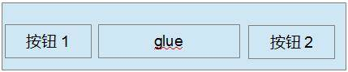
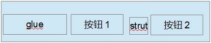
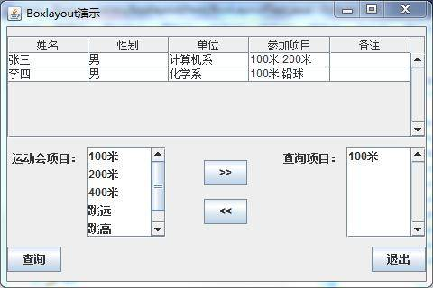

# 运用 BoxLayout 进行 Swing 控件布局
BoxLayout 初学者入门

**标签:** Java

[原文链接](https://developer.ibm.com/zh/articles/j-lo-boxlayout/)

陈怡平

发布: 2012-12-03

* * *

## 引言

在用户使用 Java Swing 进行用户界面开发过程中，会碰到如何对 Java Swing 的控件进行布局的问题。Swing 的控件放置在容器 (Container) 中，容器就是能够容纳控件或者其它容器的类，容器的具体例子有 Frame、Panel 等等。容器需要定义一个布局管理器来对控件进行布局管理，Swing 当中提供的主要的布局管理器有 FlowLayout、BorderLayout、BoxLayout、GridLayout 和 GridBaglayout, 它们的主要特点如表 1 所示：

##### 表 1\. Swing 中的一些主要布局管理器的比较

**布局管理器****特点**FlowLayout把控件按照顺序一个接一个由左向右的水平放置在容器中，一行放不下，就放到下一行BorderLayout将整个容器划分成东南西北中五个方位来放置控件，放置控件时需要指定控件放置的方位BoxLayout可以指定在容器中是否对控件进行水平或者垂直放置，比 FlowLayout 要更为灵活GridLayout将整个容器划分成一定的行和一定的列，可以指定控件放在某行某列上GridBagLayout是 Swing 当中最灵活也是最复杂的布局管理器，可对控件在容器中的位置进行比较灵活的调整

本文主要关注在 BoxLayout 布局管理器的使用上。我们首先对 BoxLayout 作一下介绍。

## BoxLayout 介绍

如前所述，BoxLayout 可以把控件依次进行水平或者垂直排列布局，这是通过参数 X\_AXIS、Y\_AXIS 来决定的。X\_AXIS 表示水平排列，而 Y\_AXIS 表示垂直排列。BoxLayout 的构造函数有两个参数，一个参数定义使用该 BoxLayout 的容器，另一个参数是指定 BoxLayout 是采用水平还是垂直排列。下面是一个创建 BoxLayout 实例的例子：

```
JPanel panel=new JPanel();
BoxLayout layout=new BoxLayout(panel, BoxLayout.X_AXIS);
panel.setLayout(layoout);

```

Show moreShow more icon

在这个例子中，一个 BoxLayout 布局管理器的实例 layout 被创建，这个实例被设置为 panel 的布局管理器，该布局管理器采用了水平排列来排列控件。

当 BoxLayout 进行布局时，它将所有控件依次按照控件的优先尺寸按照顺序的进行水平或者垂直放置，假如布局的整个水平或者垂直空间的尺寸不能放下所有控件，那么 BoxLayout 会试图调整各个控件的大小来填充整个布局的水平或者垂直空间。

BoxLayout 往往和 Box 这个容器结合在一起使用，这么做的理由是，BoxLayout 是把控件以水平或者垂直的方向一个接一个的放置，如果要调整这些控件之间的空间，就会需要使用 Box 容器提供的透明的组件作为填充来填充控件之间的空间，从而达到调整控件之间的间隔空间的目的。Box 容器提供了 4 种透明的组件，分别是 rigid area、strut、glue、filler。Box 容器分别提供了不同的方法来创建这些组件。这四个组件的特点如下：

- Rigid area 是一种用户可以定义水平和垂直尺寸的透明组件；
- strut 与 rigid area 类似，但是用户只能定义一个方向的尺寸，即水平方向或者垂直方向，不能同时定义水平和垂直尺寸；
- 当用户将 glue 放在两个控件之间时，它会尽可能的占据两个控件之间的多余空间，从而将两个控件挤到两边；
- Filler 是 Box 的内部类，它与 rigid area 相似，都可以指定水平或者垂直的尺寸，但是它可以设置最小，最大和优先尺寸。

## 用 BoxLayout 进行布局

在了解了 BoxLayout 和 Box 容器的基本特点后，我们来看一下 BoxLayout 的优点，首先 BoxLayout 可以进行对控件进行垂直或者水平布局，同时 BoxLayout 使用起来较为简单，然而把它和 Box 容器相结合，就可以进行较为复杂的布局，达到同使用 GridBagLayout 的一样的效果，但是使用起来要简单方便多了。我们用按钮的布局作为例子来看怎样运用 BoxLayout 和 Box 容器进行布局：

##### 图 1\. 应用 BoxLayout 进行按钮布局例子 1



我们在布局中经常会碰到如图 1 所示要把按钮放在容器的两端，那么我们就可以给容器定义一个 BoxLayout 来布局按钮，我们在按钮 1 和按钮 2 之间放置一个不可见的 glue，如前面所提到的那样，glue 就会尽量挤占掉两个按钮之间的空间，从而将两个按钮放在两端。

##### 图 2\. 应用 BoxLayout 进行按钮布局例子 2



再来看图 2 的例子，我们经常会遇到要将两个按钮放在容器的右边，我们就可以给容器定义一个 BoxLayout, 先放一个不可见的 glue，这个 glue 会挤占左边的空间，从而将两个按钮推到右边，

在两个按钮之间再放一个 strut，它也是不可见的，它会把两个按钮分隔开。

## BoxLayout 布局实例

在基于前面讨论的基础上，我们现在来看一个具体的运用例子，假设图 3 是我们需要完成的用户界面：

##### 图 3\. BoxLayout 演示



这个演示是一个虚拟的用户对话框，只用于演示如何使用 BoxLayout, 例子代码中没有实现控件的动作。我们假定通过它用户可以选择要查询的运动会项目，然后查询，对话框中的表格显示了查询到的运动会项目的报名情况。为了完成这个布局，我们从上到下分别定义了 3 个 Panel, 分别叫做 topPanel，middlePanel，bottomPanel，这 3 个 Panel 都使用 BoxLayout。我们先看最上边的 topPanel，也就是包含表格的 Panel，topPanel 布局的基本思路是该 Panel 采用 BoxLayout 的垂直排列布局，先放置一个不可见的 Strut, `使` topPanel 相 `对顶部留出一定的空间，` 再放置包含表格的滚动窗格， `再加入一个不可见的` Strut `，从而使` topPanel `和` middlePanel `之间留出一定的空间。` TopPanel 的代码如清单 1 所示：

##### 清单 1\. topPanel 示例代码清单

```
static void createTopPanel() {
topPanel = new JPanel();
String[] columnName = { "姓名", "性别", "单位", "参加项目", "备注" };
String[][] rowData = { { "张三", "男", "计算机系", "100 米 ,200 米", "" },
{ "李四", "男", "化学系", "100 米，铅球", "" },
};
            // 创建表格
JTable table = new JTable(new DefaultTableModel(rowData, columnName));
            // 创建包含表格的滚动窗格
JScrollPane scrollPane = new JScrollPane(table);
scrollPane.setVerticalScrollBarPolicy(JScrollPane.VERTICAL_SCROLLBAR_ALWAYS);
            // 定义 topPanel 的布局为 BoxLayout，BoxLayout 为垂直排列
topPanel.setLayout(new BoxLayout(topPanel, BoxLayout.Y_AXIS));
            // 先加入一个不可见的 Strut，从而使 topPanel 对顶部留出一定的空间
topPanel.add(Box.createVerticalStrut(10));
            // 加入包含表格的滚动窗格
topPanel.add(scrollPane);
            // 再加入一个不可见的 Strut，从而使 topPanel 和 middlePanel 之间留出一定的空间
topPanel.add(Box.createVerticalStrut(10));
}

```

Show moreShow more icon

位于中间的 middlePanel 比较复杂些，它的左边包括标签运动会项目和运动会项目列表，中间是两个按钮，我们假定点击 >> 按钮将会把用户在运动会项目列表中选中的项目移到右边的查询项目列表，点击 << 按钮则将右边查询项目列表中选中的项目移回到左边的运动会项目列表。它的布局的基本思路是定义了三个子 Panel，这三个子 Panel 分别对应最左边的标签和运动会项目列表，中间的两个按钮，和最右边的标签和查询项目列表，最左边的 Panel 采用 BoxLayout 的水平排列布局，中间的 Panel 采用 BoxLayout 的垂直排列布局，两个按钮之间加入一个不可见的 rigidArea，调整两个按钮之间的垂直距离，最右边的 Panel 采用 BoxLayout 的水平排列布局放置标签和查询项目列表。然后采用水平排列布局的 middlePanel 将三个 Panel 依次水平的加入。 MiddlePanel 的代码如清单 2 所示。

##### 清单 2\. middlePanel 示例代码清单

```
static void createMiddlePanel() {
// 创建 middlePanel
middlePanel = new JPanel();
// 采用水平布局
middlePanel .setLayout(new BoxLayout(middlePanel，BoxLayout.X_AXIS ));
// 创建标签运动会项目
         JLabel sourceLabel = new JLabel("运动会项目：");
sourceLabel.setAlignmentY(Component.TOP_ALIGNMENT );
sourceLabel.setBorder(BorderFactory.createEmptyBorder (4, 5, 0, 5));
// 创建列表运动会项目
DefaultListModel listModel = new DefaultListModel();
listModel.addElement("100 米");
listModel.addElement("200 米");
listModel.addElement("400 米");
listModel.addElement("跳远");
listModel.addElement("跳高");
listModel.addElement("铅球");
JList sourceList = new JList(listModel);
sourceList.setSelectionMode(ListSelectionModel.MULTIPLE_INTERVAL_SELECTION );
sourceList.setVisibleRowCount(5);
JScrollPane sourceListScroller = new JScrollPane(sourceList);
sourceListScroller.setPreferredSize(new Dimension(120, 80));
sourceListScroller
.setVerticalScrollBarPolicy(JScrollPane.VERTICAL_SCROLLBAR_ALWAYS );
sourceListScroller.setAlignmentY(Component.TOP_ALIGNMENT );
// 创建最左边的 Panel
JPanel sourceListPanel = new JPanel();
// 最左边的 Panel 采用水平布局
sourceListPanel.setLayout(new BoxLayout(sourceListPanel,
BoxLayout.X_AXIS ));
// 加入标签到最左边的 Panel
sourceListPanel.add(sourceLabel);
// 加入列表运动会项目到最左边的 Panel
sourceListPanel.add(sourceListScroller);
sourceListPanel.setAlignmentY(Component.TOP_ALIGNMENT );
sourceListPanel.setBorder(BorderFactory.createEmptyBorder (0, 0, 0, 30));
// 将最左边的 Panel 加入到 middlePanel
middlePanel .add(sourceListPanel);
// 定义中间的两个按钮
JButton toTargetButton = new JButton(">>");
JButton toSourceButton = new JButton("<<");
// 定义中间的 Panel
JPanel buttonPanel = new JPanel();
// 中间的 Panel 采用水平布局
buttonPanel.setLayout(new BoxLayout(buttonPanel, BoxLayout.Y_AXIS ));
// 将按钮 >> 加入到中间的 Panel
buttonPanel.add(toTargetButton);

//两个按钮之间加入一个不可见的 rigidArea
buttonPanel.add(Box.createRigidArea (new Dimension(15, 15)));
// 将按钮 << 加入到中间的 Panel
buttonPanel.add(toSourceButton);
buttonPanel.setAlignmentY(Component.TOP_ALIGNMENT );
buttonPanel.setBorder(BorderFactory.createEmptyBorder (15, 5, 15, 5));
// 将中间的 Panel 加入到 middlePanel
middlePanel .add(buttonPanel);
// 创建标签查询项目
JLabel targetLabel = new JLabel("查询项目：");
targetLabel.setAlignmentY(Component.TOP_ALIGNMENT );
targetLabel.setBorder(BorderFactory.createEmptyBorder (4, 5, 0, 5));

// 创建列表查询项目
DefaultListModel targetListModel = new DefaultListModel();
targetListModel.addElement("100 米");
JList targetList = new JList(targetListModel);
targetList
.setSelectionMode(ListSelectionModel.MULTIPLE_INTERVAL_SELECTION );
targetList.setVisibleRowCount(5);
JScrollPane targetListScroller = new JScrollPane(targetList);
targetListScroller.setPreferredSize(new Dimension(120, 80));
targetListScroller
.setVerticalScrollBarPolicy(JScrollPane.VERTICAL_SCROLLBAR_ALWAYS );
targetListScroller.setAlignmentY(Component.TOP_ALIGNMENT );
// 创建最右边的 Panel
JPanel targetListPanel = new JPanel();
// 设置最右边的 Panel 为水平布局
targetListPanel.setLayout(new BoxLayout(targetListPanel,
BoxLayout.X_AXIS ));
// 将标签查询项目加到最右边的 Panel
targetListPanel.add(targetLabel);
// 将列表查询项目加到最右边的 Panel
targetListPanel.add(targetListScroller);
targetListPanel.setAlignmentY(Component.TOP_ALIGNMENT );
targetListPanel.setBorder(BorderFactory.createEmptyBorder (0, 30, 0, 0));
// 最后将最右边的 Panel 加入到 middlePanel
middlePanel .add(targetListPanel);
     }

```

Show moreShow more icon

我们最后来看一下 bottomPanel 如何布局，bottomPanel 包括分布在两边的两个按钮，其实 bottomPanel 的布局和章节用 BoxLayout 进行布局中的图 1 是一致的，我们在两个按钮之间加入一个 glue, 这个 glue 会挤占两个按钮之间的空间，从而将两个按钮布局到两边，在 bottemPanel 中用一个 buttonPanel 来放置这两个按钮。BottomPanel 采用 BoxLayout, 首先放入一个 strut, 从而使 bottomPanel 和 middlePanel 之间留出距离，再放入 buttonPanel，再放入一个 strut， 从而使 bottomPanel 和底部之间留出距离，BottomPanel 的代码如清单 3 所示。

##### 清单 3\. bottomPanel 示例代码清单

```
static void createBottomPanel() {
            // 创建查询按钮
    JButton actionButton = new JButton("查询");
         // 创建退出按钮
    JButton closeButton = new JButton("退出");
         // 创建 bottomPanel
    bottomPanel = new JPanel();
            // 设置 bottomPanel 为垂直布局
    bottomPanel .setLayout(new BoxLayout(bottomPanel，BoxLayout.Y_AXIS ));
            // 创建包含两个按钮的 buttonPanel
    JPanel buttonPanel = new JPanel();
         // 设置 bottomPanel 为水平布局
    buttonPanel.setLayout(new BoxLayout(buttonPanel, BoxLayout.X_AXIS ));
            // 将查询按钮加入到 buttonPanel
    buttonPanel.add(actionButton);

//加入一个 glue, glue 会挤占两个按钮之间的空间
buttonPanel.add(Box.createHorizontalGlue ());
            // 将退出按钮加入到 buttonPanel
buttonPanel.add(closeButton);
            // 加入一个 Strut，从而使 bottomPanel 和 middlePanel 上下之间留出距离
bottomPanel .add(Box.createVerticalStrut (10));
            // 加入 buttonPanel
bottomPanel .add(buttonPanel);
            // 加入一个 Strut，从而使 bottomPanel 和底部之间留出距离
bottomPanel .add(Box.createVerticalStrut (10));
     }

```

Show moreShow more icon

我们用一个 Panel 来从上到下放置 topPanel、middlePanel 和 bottomPanel，这个 Panel 采用了 GridBagLayout, 最后我们将这个 Panel 加到一个窗体中去，请参考清单 4。

##### 清单 4\. 创建窗体示例代码清单

```
public static void main(String[] args) {
            // 创建 topPanel
createTopPanel ();
         // 创建 middlePanel
createMiddlePanel ();
         // 创建 bottomPanel
createBottomPanel ();
         // 创建包含 topPanel，middlePanel 和 bottomPanel 的 panelContainer
JPanel panelContainer = new Jpanel();
         //panelContainer 的布局为 GridBagLayout
panelContainer.setLayout(new GridBagLayout());

GridBagConstraints c1 = new GridBagConstraints();
c1.gridx = 0;
c1.gridy = 0;
c1.weightx = 1.0;
c1.weighty = 1.0;
c1.fill = GridBagConstraints.BOTH ;
         // 加入 topPanel
panelContainer.add(topPanel，c1);

GridBagConstraints c2 = new GridBagConstraints();
c2.gridx = 0;
c2.gridy = 1;
c2.weightx = 1.0;
c2.weighty = 0;
c2.fill = GridBagConstraints.HORIZONTAL ;
         // 加入 middlePanel
panelContainer.add(middlePanel，c2);

GridBagConstraints c3 = new GridBagConstraints();
c3.gridx = 0;
c3.gridy = 2;
c3.weightx = 1.0;
c3.weighty = 0;
c3.fill = GridBagConstraints.HORIZONTAL ;
         // 加入 bottomPanel
panelContainer.add(bottomPanel，c3);

         // 创建窗体
JFrame frame = new JFrame("Boxlayout 演示");
frame.setDefaultCloseOperation(JFrame.EXIT_ON_CLOSE );
panelContainer.setOpaque(true);
frame.setSize(new Dimension(480, 320));
frame.setContentPane(panelContainer);
frame.setVisible(true);
}

```

Show moreShow more icon

本文的例子是在文件 BoxLayoutDemo.zip 中，您将其展开，导入到 Eclipse 中去，就可运行例子。

## 结束语

您通过本文的介绍，可以对 BoxLayout 这个布局管理器如何进行布局能够有一定的了解，也可以在自己的实践过程中进一步总结出自己的方法。

## Download

[BoxLayoutDemo.zip](http://www.ibm.com/developerworks/cn/java/j-lo-boxlayout/BoxLayoutDemo.zip): 示例代码

## 相关主题

- [Layout Managers 使用参考](http://docs.oracle.com/javase/tutorial/uiswing/layout/using.html)
- [BorderLayout 使用参考](http://docs.oracle.com/javase/tutorial/uiswing/layout/border.html)
- [FlowLayout 使用参考](http://docs.oracle.com/javase/tutorial/uiswing/layout/flow.html)
- [GridLayout 使用参考](http://docs.oracle.com/javase/tutorial/uiswing/layout/grid.html)
- [GridBagLayout 使用参考](http://docs.oracle.com/javase/tutorial/uiswing/layout/gridbag.html)
- [Box 使用参考](http://docs.oracle.com/javase/7/docs/api/javax/swing/Box.html)