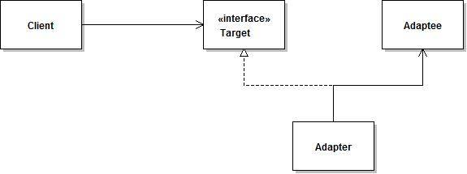

# 适配器模式原理及实例介绍
通过一个实例让您从代码的角度快速了解适配器模式的运行方式

**标签:** Java

[原文链接](https://developer.ibm.com/zh/articles/j-lo-adapter-pattern/)

周 明耀

发布: 2015-06-10

* * *

## 适配器模式基本介绍

著名的设计模式“四人帮”这样评价适配器模式：

将一个类的接口转换成客户希望的另外一个接口。Adapter 模式使得原本由于接口不兼容而不能一起工作的那些类可以一起工作。——Gang of Four

适配器模式将一个类的接口适配成用户所期待的。一个适配器通常允许因为接口不兼容而不能一起工作的类能够在一起工作，做法是将类自己的接口包裹在一个已存在的类中。

Adapter 设计模式主要目的组合两个不相干类，常用有两种方法，第一种解决方案是修改各自类的接口。但是如果没有源码，或者不愿意为了一个应用而修改各自的接口，则需要使用 Adapter 适配器，在两种接口之间创建一个混合接口。

##### 图 1\. 适配器模式类图



图 1 所示是适配器模式的类图。Adapter 适配器设计模式中有 3 个重要角色：被适配者 Adaptee，适配器 Adapter 和目标对象 Target。其中两个现存的想要组合到一起的类分别是被适配者 Adaptee 和目标对象 Target 角色，按照类图所示，我们需要创建一个适配器 Adapter 将其组合在一起。

具体实现代码请见清单 1-4。

##### 清单 1\. 客户端使用的接口

```
/*
* 定义客户端使用的接口，与业务相关
*/
public interface Target {
/*
* 客户端请求处理的方法
*/
public void request();
}

```

Show moreShow more icon

##### 清单 2\. 被适配的对象

```
/*
* 已经存在的接口，这个接口需要配置
*/
public class Adaptee {
/*
* 原本存在的方法
*/
public void specificRequest(){
//业务代码
}
}

```

Show moreShow more icon

##### 清单 3\. 适配器实现

```
/*
* 适配器类
*/
public class Adapter implements Target{
/*
* 持有需要被适配的接口对象
*/
private Adaptee adaptee;
/*
* 构造方法，传入需要被适配的对象
* @param adaptee 需要被适配的对象
*/
public Adapter(Adaptee adaptee){
this.adaptee = adaptee;
}
@Override
public void request() {
// TODO Auto-generated method stub
adaptee.specificRequest();
}

}

```

Show moreShow more icon

##### 清单 4\. 客户端代码

```
/*
* 使用适配器的客户端
*/
public class Client {
public static void main(String[] args){
//创建需要被适配的对象
Adaptee adaptee = new Adaptee();
//创建客户端需要调用的接口对象
Target target = new Adapter(adaptee);
//请求处理
target.request();
}
}

```

Show moreShow more icon

以下情况比较适合使用 Adapter 模式：

1. 当你想使用一个已经存在的类，而它的接口不符合你的需求；
2. 你想创建一个可以复用的类，该类可以与其他不相关的类或不可预见的类协同工作；
3. 你想使用一些已经存在的子类，但是不可能对每一个都进行子类化以匹配它们的接口，对象适配器可以适配它的父亲接口。

### 适配器模式使用示例代码

考虑一个记录日志的应用，用户可能会提出要求采用文件的方式存储日志，也可能会提出存储日志到数据库的需求，这样我们可以采用适配器模式对旧的日志类进行改造，提供新的支持方式。

首先我们需要一个简单的日志对象类，如清单 5 所示。

##### 清单 5\. 日志对象类

```
/*
* 日志数据对象
*/
public class LogBean {
private String logId;//日志编号
private String opeUserId;//操作人员

public String getLogId(){
return logId;
}
public void setLogId(String logId){
this.logId = logId;
}

public String getOpeUserId(){
return opeUserId;
}
public void setOpeUserId(String opeUserId){
this.opeUserId = opeUserId;
}
public String toString(){
return "logId="+logId+",opeUserId="+opeUserId;
}
}

```

Show moreShow more icon

接下来定义一个操作日志文件的接口，代码如清单 6 所示。

##### 清单 6\. 操作日志接口

```
import java.util.List;

/*
* 读取日志文件，从文件里面获取存储的日志列表对象
* @return 存储的日志列表对象
*/
public interface LogFileOperateApi {
public List<LogBean> readLogFile();
/**
* 写日志文件，把日志列表写出到日志文件中去
* @param list 要写到日志文件的日志列表
*/
public void writeLogFile(List<LogBean> list);
}

```

Show moreShow more icon

然后实现日志文件的存储和获取，这里忽略业务代码，代码如清单 7 所示。

##### 清单 7\. 实现对日志文件的获取

```
import java.io.File;
import java.io.ObjectInputStream;
import java.io.ObjectOutputStream;
import java.util.List;

/*
* 实现对日志文件的操作
*/
public class LogFileOperate implements LogFileOperateApi{
/*
* 设置日志文件的路径和文件名称
*/
private String logFileName = "file.log";
/*
* 构造方法，传入文件的路径和名称
*/
public LogFileOperate(String logFilename){
if(logFilename!=null){
this.logFileName = logFilename;
}
}

@Override
public List<LogBean> readLogFile() {
// TODO Auto-generated method stub
List<LogBean> list = null;
ObjectInputStream oin =null;
//业务代码
return list;
}

@Override
public void writeLogFile(List<LogBean> list) {
// TODO Auto-generated method stub
File file = new File(logFileName);
ObjectOutputStream oout = null;
//业务代码
}

}

```

Show moreShow more icon

如果这时候需要引入数据库方式，引入适配器之前，我们需要定义日志管理的操作接口，代码如清单 8 所示。

##### 清单 8\. 定义数据库操作接口

```
public interface LogDbOpeApi {
/*
* 新增日志
* @param 需要新增的日志对象
*/
public void createLog(LogBean logbean);
}

```

Show moreShow more icon

接下来就要实现适配器了，LogDbOpeApi 接口就相当于 Target 接口，LogFileOperate 就相当于 Adaptee 类。Adapter 类代码如清单 9 所示。

##### 清单 9\. Adapter 类实现

```
import java.util.List;

/*
* 适配器对象，将记录日志到文件的功能适配成数据库功能
*/
public class LogAdapter implements LogDbOpeApi{
private LogFileOperateApi adaptee;
public LogAdapter(LogFileOperateApi adaptee){
this.adaptee = adaptee;
}
@Override
public void createLog(LogBean logbean) {
// TODO Auto-generated method stub
List<LogBean> list = adaptee.readLogFile();
list.add(logbean);
adaptee.writeLogFile(list);
}
}

```

Show moreShow more icon

最后是客户端代码的实现，如清单 10 所示。

##### 清单 10\. 客户端类实现

```
import java.util.ArrayList;
import java.util.List;

public class LogClient {
public static void main(String[] args){
LogBean logbean = new LogBean();
logbean.setLogId("1");
logbean.setOpeUserId("michael");
List<LogBean> list = new ArrayList<LogBean>();
LogFileOperateApi logFileApi = new LogFileOperate("");
//创建操作日志的接口对象
LogDbOpeApi api = new LogAdapter(logFileApi);
api.createLog(logbean);
}
}

```

Show moreShow more icon

## 适配器模式在开源项目中的应用

JDK 中有大量使用适配器模式的案例，清单 11 大致列举了一些类。

##### 清单 11\. 使用适配器模式的类

```
java.util.Arrays#asList()
javax.swing.JTable(TableModel)
java.io.InputStreamReader(InputStream)
java.io.OutputStreamWriter(OutputStream)
javax.xml.bind.annotation.adapters.XmlAdapter#marshal()
javax.xml.bind.annotation.adapters.XmlAdapter#unmarshal()

```

Show moreShow more icon

JDK1.1 之前提供的容器有 Arrays,Vector,Stack,Hashtable,Properties,BitSet，其中定义了一种访问群集内各元素的标准方式，称为 Enumeration（列举器）接口，用法如清单 12 所示。

##### 清单 12.Enumeration 接口实现方式

```
Vector v=new Vector();
for (Enumeration enum =v.elements(); enum.hasMoreElements();) {
Object o = enum.nextElement();
processObject(o);
}

```

Show moreShow more icon

JDK1.2 版本中引入了 Iterator 接口，新版本的集合对象（HashSet,HashMap,WeakHeahMap,ArrayList,TreeSet,TreeMap, LinkedList）是通过 Iterator 接口访问集合元素的，用法如清单 13 所示。

##### 清单 13\. Iterator 接口实现方式

```
List list=new ArrayList();
for(Iterator it=list.iterator();it.hasNext();)
{
System.out.println(it.next());
}

```

Show moreShow more icon

这样，如果将老版本的程序运行在新的 Java 编译器上就会出错。因为 List 接口中已经没有 elements()，而只有 iterator() 了。那么如何将老版本的程序运行在新的 Java 编译器上呢? 如果不加修改，是肯定不行的，但是修改要遵循“开－闭”原则。我们可以用 Java 设计模式中的适配器模式解决这个问题。清单 14 所示是解决方法代码。

##### 清单 14\. 采用适配器模式

```
import java.util.ArrayList;
import java.util.Enumeration;
import java.util.Iterator;
import java.util.List;

public class NewEnumeration implements Enumeration
{

Iterator it;
public NewEnumeration(Iterator it)
{
this.it=it;
// TODO Auto-generated constructor stub
}

public boolean hasMoreElements()
{
// TODO Auto-generated method stub
return it.hasNext();
}

public Object nextElement()
{
// TODO Auto-generated method stub
return it.next();
}
public static void main(String[] args)
{
List list=new ArrayList();
list.add("a");
list.add("b");
list.add("C");
for(Enumeration e=new NewEnumeration(list.iterator());e.hasMoreElements();)
{
System.out.println(e.nextElement());
}
}
}

```

Show moreShow more icon

清单 14 所示的 NewEnumeration 是一个适配器类，通过它实现了从 Iterator 接口到 Enumeration 接口的适配，这样我们就可以使用老版本的代码来使用新的集合对象了。

Java I/O 库大量使用了适配器模式，例如 ByteArrayInputStream 是一个适配器类，它继承了 InputStream 的接口，并且封装了一个 byte 数组。换言之，它将一个 byte 数组的接口适配成 InputStream 流处理器的接口。

我们知道 Java 语言支持四种类型：Java 接口，Java 类，Java 数组，原始类型（即 int,float 等）。前三种是引用类型，类和数组的实例是对象，原始类型的值不是对象。也即，Java 语言的数组是像所有的其他对象一样的对象，而不管数组中所存储的元素类型是什么。这样一来的话，ByteArrayInputStream 就符合适配器模式的描述，是一个对象形式的适配器类。FileInputStream 是一个适配器类。在 FileInputStream 继承了 InputStrem 类型，同时持有一个对 FileDiscriptor 的引用。这是将一个 FileDiscriptor 对象适配成 InputStrem 类型的对象形式的适配器模式。查看 JDK1.4 的源代码我们可以看到清单 15 所示的 FileInputStream 类的源代码。

##### 清单 15\. FileInputStream 类

```
Public class FileInputStream extends InputStream｛
/* File Descriptor - handle to the open file */
private FileDescriptor fd;
public FileInputStream(FileDescriptor fdObj) {
SecurityManager security = System.getSecurityManager();
if (fdObj == null) {
throw new NullPointerException();
}
if (security != null) {
security.checkRead(fdObj);}fd = fdObj;
}
public FileInputStream(File file) throws FileNotFoundException {
String name = file.getPath();
SecurityManager security = System.getSecurityManager();
if (security != null) {
security.checkRead(name);
}
fd = new FileDescriptor();
open(name);
}
//其它代码
｝
}

```

Show moreShow more icon

同样地，在 OutputStream 类型中，所有的原始流处理器都是适配器类。ByteArrayOutputStream 继承了 OutputStream 类型，同时持有一个对 byte 数组的引用。它一个 byte 数组的接口适配成 OutputString 类型的接口，因此也是一个对象形式的适配器模式的应用。

FileOutputStream 继承了 OutputStream 类型，同时持有一个对 FileDiscriptor 对象的引用。这是一个将 FileDiscriptor 接口适配成 OutputStream 接口形式的对象型适配器模式。

Reader 类型的原始流处理器都是适配器模式的应用。StringReader 是一个适配器类，StringReader 类继承了 Reader 类型，持有一个对 String 对象的引用。它将 String 的接口适配成 Reader 类型的接口。

### Spring 中使用适配器模式的典型应用

在 Spring 的 AOP 里通过使用的 Advice（通知）来增强被代理类的功能。Spring 实现这一 AOP 功能的原理就使用代理模式（1、JDK 动态代理。2、CGLib 字节码生成技术代理。）对类进行方法级别的切面增强，即，生成被代理类的代理类，并在代理类的方法前，设置拦截器，通过执行拦截器中的内容增强了代理方法的功能，实现的面向切面编程。

Advice（通知）的类型有：BeforeAdvice、AfterReturningAdvice、ThrowSadvice 等。每个类型 Advice（通知）都有对应的拦截器，MethodBeforeAdviceInterceptor、AfterReturningAdviceInterceptor、ThrowsAdviceInterceptor。Spring 需要将每个 Advice（通知）都封装成对应的拦截器类型，返回给容器，所以需要使用适配器模式对 Advice 进行转换。具体代码如清单 16-19 所示。

##### 清单 16\. MethodBeforeAdvice 类

```
public interface MethodBeforeAdvice extends BeforeAdvice {

void before(Method method, Object[] args, Object target) throws Throwable;

}
public interface MethodBeforeAdvice extends BeforeAdvice {

void before(Method method, Object[] args, Object target) throws Throwable;

}

```

Show moreShow more icon

##### 清单 17\. Adapter 类接口

```
public interface AdvisorAdapter {

boolean supportsAdvice(Advice advice);

MethodInterceptor getInterceptor(Advisor advisor);

}
public interface AdvisorAdapter {

boolean supportsAdvice(Advice advice);

MethodInterceptor getInterceptor(Advisor advisor);

}

```

Show moreShow more icon

##### 清单 18\. MethodBeforeAdviceAdapter 类

```
class MethodBeforeAdviceAdapter implements AdvisorAdapter, Serializable {

public boolean supportsAdvice(Advice advice) {
return (advice instanceof MethodBeforeAdvice);
}

public MethodInterceptor getInterceptor(Advisor advisor) {
MethodBeforeAdvice advice = (MethodBeforeAdvice) advisor.getAdvice();
return new MethodBeforeAdviceInterceptor(advice);
}

}
class MethodBeforeAdviceAdapter implements AdvisorAdapter, Serializable {

public boolean supportsAdvice(Advice advice) {
return (advice instanceof MethodBeforeAdvice);
}

public MethodInterceptor getInterceptor(Advisor advisor) {
MethodBeforeAdvice advice = (MethodBeforeAdvice) advisor.getAdvice();
return new MethodBeforeAdviceInterceptor(advice);
}

}

```

Show moreShow more icon

##### 清单 19\. DefaultAdvisorAdapterRegistry 类

```
public class DefaultAdvisorAdapterRegistry implements AdvisorAdapterRegistry, Serializable {

private final List<AdvisorAdapter> adapters = new ArrayList<AdvisorAdapter>(3);

/**
* Create a new DefaultAdvisorAdapterRegistry, registering well-known adapters.
*/
public DefaultAdvisorAdapterRegistry() {//这里注册了适配器
registerAdvisorAdapter(new MethodBeforeAdviceAdapter());
registerAdvisorAdapter(new AfterReturningAdviceAdapter());
registerAdvisorAdapter(new ThrowsAdviceAdapter());
}

public Advisor wrap(Object adviceObject) throws UnknownAdviceTypeException {
if (adviceObject instanceof Advisor) {
return (Advisor) adviceObject;
}
if (!(adviceObject instanceof Advice)) {
throw new UnknownAdviceTypeException(adviceObject);
}
Advice advice = (Advice) adviceObject;
if (advice instanceof MethodInterceptor) {
// So well-known it doesn't even need an adapter.
return new DefaultPointcutAdvisor(advice);
}
for (AdvisorAdapter adapter : this.adapters) {
// Check that it is supported.
if (adapter.supportsAdvice(advice)) {//这里调用了适配器的方法
return new DefaultPointcutAdvisor(advice);
}
}
throw new UnknownAdviceTypeException(advice);
}

public MethodInterceptor[] getInterceptors(Advisor advisor) throws UnknownAdviceTypeException {
List<MethodInterceptor> interceptors = new ArrayList<MethodInterceptor>(3);
Advice advice = advisor.getAdvice();
if (advice instanceof MethodInterceptor) {
interceptors.add((MethodInterceptor) advice);
}
for (AdvisorAdapter adapter : this.adapters) {
if (adapter.supportsAdvice(advice)) {//这里调用了适配器的方法
interceptors.add(adapter.getInterceptor(advisor));
}
}
if (interceptors.isEmpty()) {
throw new UnknownAdviceTypeException(advisor.getAdvice());
}
return interceptors.toArray(new MethodInterceptor[interceptors.size()]);
}

public void registerAdvisorAdapter(AdvisorAdapter adapter) {
this.adapters.add(adapter);
}

}

```

Show moreShow more icon

### 双向适配器

适配器也可以实现双向的适配，前面所讲的都是把 Adaptee 适配成为 Target，其实也可以把 Target 适配成为 Adaptee。也就是说这个适配器可以同时当作 Target 和 Adaptee 来使用。

##### 清单 20\. TwiceAdapter 类

```
import java.util.List;

/*
* 双向适配器对象案例
*/
public class TwiceAdapter implements LogDbOpeApi,LogFileOperateApi {

/*
* 持有需要被适配的文件存储日志的接口对象
*/
private LogFileOperateApi fileLog;
/*
* 持有需要被适配的 DB 存储日志的接口对象
*/
private LogDbOpeApi dbLog;

public TwiceAdapter(LogFileOperateApi fileLog,LogDbOpeApi dbLog){
this.fileLog = fileLog;
this.dbLog = dbLog;
}
@Override
public List<LogBean> readLogFile() {
// TODO Auto-generated method stub
return null;
}

@Override
public void writeLogFile(List<LogBean> list) {
// TODO Auto-generated method stub

}

@Override
public void createLog(LogBean logbean) {
// TODO Auto-generated method stub
List<LogBean> list = fileLog.readLogFile();
list.add(logbean);
fileLog.writeLogFile(list);
}

}

```

Show moreShow more icon

双向适配器同时实现了 Target 和 Adaptee 的接口，使得双向适配器可以在 Target 或 Adaptee 被使用的地方使用，以提供对所有客户的透明性。尤其在两个不同的客户需要用不同的地方查看同一个对象时，适合使用双向适配器。

对象适配器和类适配器

在标准的适配器模式里面，根据适配器的实现方式，把适配器分成对象适配器和类适配器。

对象适配器

依赖于对象的组合，都是采用对象组合的方式，也就是对象适配器实现的方式。

类适配器

采用多重继承对一个接口与另一个接口进行匹配。由于 Java 不支持多重继承，所以到目前为止还没有涉及。但可以通过让适配器去实现 Target 接口的方式来实现。

##### 清单 21\. ClassAdapter 类

```
import java.util.List;

/*
* 类适配器对象案例
*/
public class ClassAdapter extends LogFileOperate implements LogDbOpeApi{

public ClassAdapter(String logFilename) {
super(logFilename);
// TODO Auto-generated constructor stub
}

@Override
public void createLog(LogBean logbean) {
// TODO Auto-generated method stub
List<LogBean> list = this.readLogFile();
list.add(logbean);
this.writeLogFile(list);
}

}

```

Show moreShow more icon

在实现中，主要是适配器的实现与以前不一样，与对象适配器实现同样的功能相比，类适配器在实现上有所改变：

1. 需要继承 LogFileOperate 的实现，然后再实现 LogDbOpeApi 接口；
2. 需要按照继承 LogFileOperate 的要求，提供传入文件路径和名称的构造方法；
3. 不再需要持有 LogFileOperate 的对象，因为适配器本身就是 LogFileOperate 对象的子类；
4. 以前调用被适配对象的方法的地方，全部修改成调用自己的方法。

类适配器和对象适配器的选择

1. 从实现上：类适配器使用对象继承的方式，属于静态的定义方式。对象适配器使用对象组合的方式，属于动态组合的方式；
2. 从工作模式上：类适配器直接继承了 Adaptee，使得适配器不能和 Adaptee 的子类一起工作。对象适配器允许一个 Adapter 和多个 Adaptee，包括 Adaptee 和它所有的子类一起工作；
3. 从定义角度：类适配器可以重定义 Adaptee 的部分行为，相当于子类覆盖父类的部分实现方法。对象适配器要重定义 Adaptee 很困难；
4. 从开发角度：类适配器仅仅引入了一个对象，并不需要额外的引用来间接得到 Adaptee。对象适配器需要额外的引用来间接得到 Adaptee。

总的来说，建议使用对象适配器方式。

## 适配器模式使用注意事项

1. 充当适配器角色的类就是：实现已有接口的抽象类；
2. 为什么要用抽象类？此类是不要被实例化的。而只充当适配器的角色，也就为其子类提供了一个共同的接口，但其子类又可以将精力只集中在其感兴趣的地方。
3. 适配器模式中被适配的接口 Adaptee 和适配成为的接口 Target 是没有关联的，Adaptee 和 Target 中的方法既可以是相同的，也可以是不同的。
4. 适配器在适配的时候，可以适配多个 Apaptee，也就是说实现某个新的 Target 的功能的时候，需要调用多个模块的功能，适配多个模块的功能才能满足新接口的要求。
5. 适配器有一个潜在的问题，就是被适配的对象不再兼容 Adaptee 的接口，因为适配器只是实现了 Target 的接口。这导致并不是所有 Adaptee 对象可以被使用的地方都能是使用适配器，双向适配器解决了这个问题。

优点

适配器模式也是一种包装模式，它与装饰模式同样具有包装的功能，此外，对象适配器模式还具有委托的意思。总的来说，适配器模式属于补偿模式，专用来在系统后期扩展、修改时使用。

缺点

过多的使用适配器，会让系统非常零乱，不易整体进行把握。比如，明明看到调用的是 A 接口，其实内部被适配成了 B 接口的实现，一个系统如果太多出现这种情况，无异于一场灾难。因此如果不是很有必要，可以不使用适配器，而是直接对系统进行重构。

适配器模式应用场景

在软件开发中，也就是系统的数据和行为都正确，但接口不相符时，我们应该考虑用适配器，目的是使控制范围之外的一个原有对象与某个接口匹配。适配器模式主要应用于希望复用一些现存的类，但是接口又与复用环境要求不一致的情况。比如在需要对早期代码复用一些功能等应用上很有实际价值。适用场景大致包含三类：

1、已经存在的类的接口不符合我们的需求；

2、创建一个可以复用的类，使得该类可以与其他不相关的类或不可预见的类（即那些接口可能不一定兼容的类）协同工作；

3、在不对每一个都进行子类化以匹配它们的接口的情况下，使用一些已经存在的子类。

## 结束语

本文对适配器模式做了一些介绍，希望能够帮助读者对适配器模式有进一步的了解。适配器模式也是一种包装模式，它与装饰模式同样具有包装的功能，此外，对象适配器模式还具有委托的意思。总的来说，适配器模式属于补偿模式，专门用来在系统后期扩展、修改时使用，但要注意不要过度使用适配器模式。