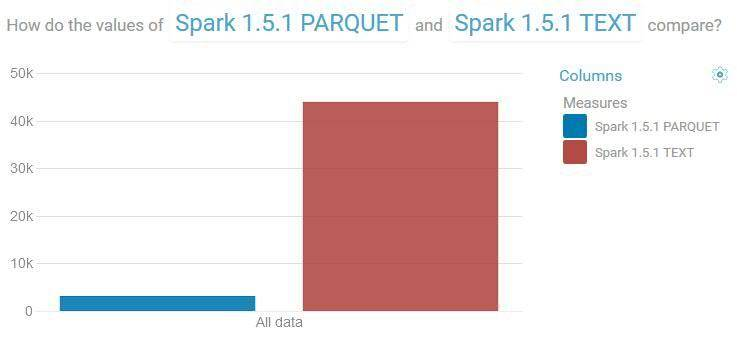
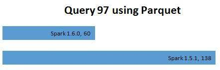
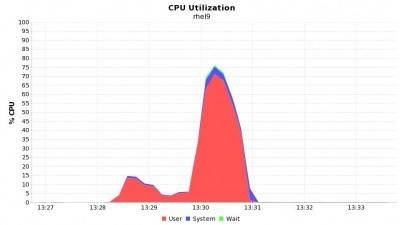
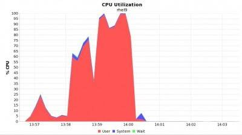
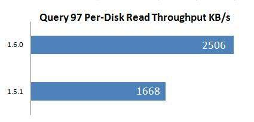
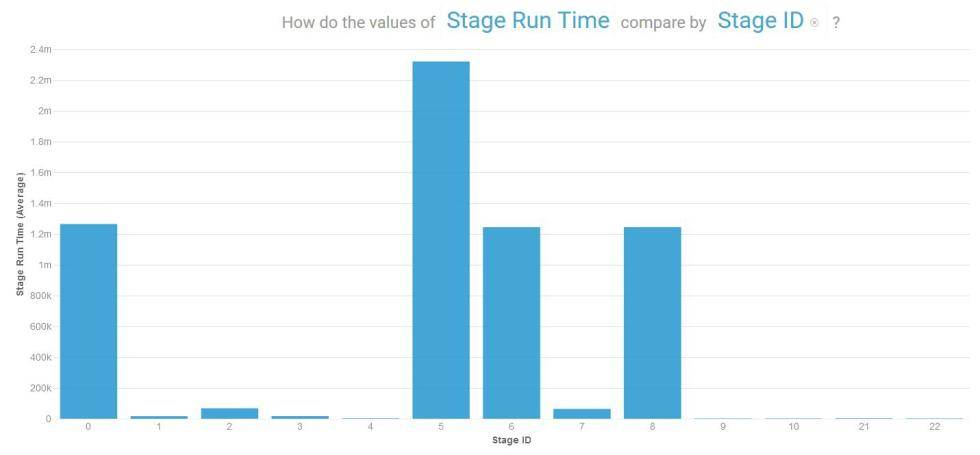
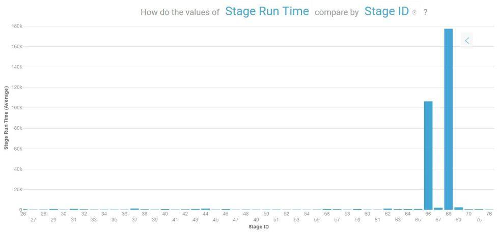

# 选择 Parquet for Spark SQL 的 5 大原因
深入了解 Parquet for Spark SQL

**标签:** 分析

[原文链接](https://developer.ibm.com/zh/articles/5-reasons-to-choose-parquet-for-spark-sql/)

developerWorks 中国网站编辑组

发布: 2016-03-01

* * *

为了了解 Parquet 有多么强大，我们从 spark-perf-sql 中挑选了 24 个从 TPC-DS 中衍生的查询来完成比较（总共有 99 个查询，一些查询在 1TB 的缩放比例下无法用于平面的 CSV 数据文件。更多内容参见下文）。这些查询代表了 TPC-DS 中的所有类别：报告、即席报告、迭代和数据挖掘。我们还要确保包含了短查询（查询12 和 91）和长时间运行的查询（查询 24a 和 25），以及会使用 100％ CPU 的众所周知的查询（查询 97）。

我们使用了一个 6 节点的预置型 Cisco UCS 集群，每个 Cisco 验证了的设计都有类似的配置。我们调优了底层硬件，以防在所有测试中遇到网络或磁盘 IO 瓶颈。本文的重点是了解在 Spark 1.5.1 和刚发布的 Spark 1.6.0 中只对文本和 Parquet 存储格式运行这些查询会有怎样的性能差异。总的 Spark 工作存储为 500GB。TPC-DS 缩放比例为 1TB。

## 1\. Spark SQL 在用于 Parquet 时更快一些！

下图比较了在 Spark 1.5.1 中运行 24 个查询的所有执行时间的总和。在使用平面的 CVS 文件时，查询花费了大约 12 个小时才完成，而在使用 Parquet 时，查询用了不到 1 个小时的时间就完成了，性能提高了 11 倍。

##### 比较在文本和 Parquet 中花费的总查询时间（以秒为单位），越小越好。



## 2\. Spark SQL 在使用较大缩放比例时的表现要优于 Parquet

存储格式的选择不当往往会导致难以诊断和难以修复。例如，在采用 1TB 的缩放比例时，如果使用平面 CSV 文件，在所有可运行的查询中，至少有 1/3 的查询无法完成，但在使用 Parquet 时，这些查询都完成了。

一些错误和异常非常神秘。这里有 3 个示例：

错误示例 1：

```
WARN scheduler.TaskSetManager: Lost task 145.0 in stage 4.0 (TID 4988, rhel8.cisco.com): FetchFailed(BlockManagerId(2, rhel4.cisco.com, 49209), shuffleId=13, mapId=47, reduceId=145, message=
org.apache.spark.shuffle.FetchFailedException: java.io.FileNotFoundException: /data6/hadoop/yarn/local/usercache/spark/appcache/application_1447965002296_0142/blockmgr-44627d4c-4a2b-4f53-a471-32085a252cb0/15/shuffle_13_119_0.index (No such file or directory)
at java.io.FileInputStream.open0(Native Method)
at java.io.FileInputStream.open(FileInputStream.java:195)

```

Show moreShow more icon

错误示例 2：

```
WARN scheduler.TaskSetManager: Lost task 1.0 in stage 13.1 (TID 13621, rhel7.cisco.com): FetchFailed(null, shuffleId=9, mapId=-1, reduceId=148, message=
org.apache.spark.shuffle.MetadataFetchFailedException: Missing an output location for shuffle 9
at org.apache.spark.MapOutputTracker$$anonfun$org$apache$spark$MapOutputTracker$$convertMapStatuses$2.apply(MapOutputTracker.scala:460)
at org.apache.spark.MapOutputTracker$$anonfun$org$apache$spark$MapOutputTracker$$convertMapStatuses$2.apply(MapOutputTracker.scala:456)
at scala.collection.TraversableLike$WithFilter$$anonfun$foreach$1.apply(TraversableLike.scala:772)
at scala.collection.IndexedSeqOptimized$class.foreach(IndexedSeqOptimized.scala:33)
at scala.collection.mutable.ArrayOps$ofRef.foreach(ArrayOps.scala:108)

```

Show moreShow more icon

错误示例 3：

```
ERROR cluster.YarnScheduler: Lost executor 59 on rhel4.cisco.com: remote Rpc client disassociated

```

Show moreShow more icon

大多数查询的失败迫使 Spark 通过重新排队任务（甚至是重新启动某个阶段）来进行再次尝试。事情从那时起变得更糟；最终，该应用程序失败了，像是永远不会完成。

通过切换到 Parquet，无需更改其他任何 Spark 配置，这些问题就得到了解决。压缩减小了文件的大小，列式格式允许只读取选择的记录，减少的输入数据直接影响了 Spark DAG 调度程序关于执行图的决策（更多的细节参见下文）。Parquet 的所有这些优势都对查询的快速完成至关重要。

## 3\. 更少的磁盘 IO

采用了压缩功能的 Parquet 能够让数据存储平均减少 75％，也就是说，1TB 压缩比例的数据文件在磁盘上只会占用大约 250 GB 的磁盘空间。这显著减少了 Spark SQL 应用程序所需的输入数据。而且在 Spark 1.6.0 中，Parquet 读取器使用了下推过滤器来进一步减少磁盘 IO。下推式过滤器允许在将数据读入 Spark 之前就制定数据选择决策。例如，对查询 97 中的 between 子句的处理如下所示：

```
select cs_bill_customer_sk customer_sk, cs_item_sk item_sk
from catalog_sales,date_dim
where cs_sold_date_sk = d_date_sk
and d_month_seq between 1200 and 1200 + 11

```

Show moreShow more icon

Spark SQL 展示了查询的物理计划中的以下 scan 语句：

```
+- Scan ParquetRelation[d_date_sk#141,d_month_seq#144L] InputPaths: hdfs://rhel10.cisco.com/user/spark/hadoopds1tbparquet/date_dim/_SUCCESS, hdfs://rhel10.cisco.com/user/spark/hadoopds1tbparquet/date_dim/_common_metadata, hdfs://rhel10.cisco.com/user/spark/hadoopds1tbparquet/date_dim/_metadata, hdfs://rhel10.cisco.com/user/spark/hadoopds1tbparquet/date_dim/part-r-00000-4d205b7e-b21d-4e8b-81ac-d2a1f3dd3246.gz.parquet, hdfs://rhel10.cisco.com/user/spark/hadoopds1tbparquet/date_dim/part-r-00001-4d205b7e-b21d-4e8b-81ac-d2a1f3dd3246.gz.parquet, PushedFilters: [GreaterThanOrEqual(d_month_seq,1200), LessThanOrEqual(d_month_seq,1211)]]

```

Show moreShow more icon

其中，PushedFilters 只返回 d\_mont\_seq 列中范围 1200 到 1211 的记录，或者只返回几个记录。与平面文件相比较，在使用平面文件时，会读取整个表（每一列和每一行），如物理计划中所示：

```
[                  Scan CsvRelation(hdfs://rhel10.cisco.com/user/spark/hadoopds1000g/date_dim/*,false,|,",null,PERMISSIVE,COMMONS,false,false,StructType(StructField(d_date_sk,IntegerType,false), StructField(d_date_id,StringType,false), StructField(d_date,StringType,true), StructField(d_month_seq,LongType,true), StructField(d_week_seq,LongType,true), StructField(d_quarter_seq,LongType,true), StructField(d_year,LongType,true), StructField(d_dow,LongType,true), StructField(d_moy,LongType,true), StructField(d_dom,LongType,true), StructField(d_qoy,LongType,true), StructField(d_fy_year,LongType,true), StructField(d_fy_quarter_seq,LongType,true), StructField(d_fy_week_seq,LongType,true), StructField(d_day_name,StringType,true), StructField(d_quarter_name,StringType,true), StructField(d_holiday,StringType,true), StructField(d_weekend,StringType,true), StructField(d_following_holiday,StringType,true), StructField(d_first_dom,LongType,true), StructField(d_last_dom,LongType,true), StructField(d_same_day_ly,LongType,true), StructField(d_same_day_lq,LongType,true), StructField(d_current_day,StringType,true), StructField(d_current_week,StringType,true), StructField(d_current_month,StringType,true), StructField(d_current_quarter,StringType,true), StructField(d_current_year,StringType,true)))[d_date_sk#141,d_date_id#142,d_date#143,d_month_seq#144L,d_week_seq#145L,d_quarter_seq#146L,d_year#147L,d_dow#148L,d_moy#149L,d_dom#150L,d_qoy#151L,d_fy_year#152L,d_fy_quarter_seq#153L,d_fy_week_seq#154L,d_day_name#155,d_quarter_name#156,d_holiday#157,d_weekend#158,d_following_holiday#159,d_first_dom#160L,d_last_dom#161L,d_same_day_ly#162L,d_same_day_lq#163L,d_current_day#164,d_current_week#165,d_current_month#166,d_current_quarter#167,d_current_year#168]]

```

Show moreShow more icon

## 4\. Spark 1.6.0 提供了更高的扫描吞吐量

Databricks 的 Spark 1.6.0 发布博客中曾经提到过显著的平面扫描吞吐量，因为该博客使用到了 “更优化的代码路径” 一词。为了在现实世界中说明这一点，我们在 Spark 1.5.1 和 1.6.0 中运行了查询 97，并捕获了 nmon 数据。改进非常明显。

首先，查询响应时间减少了一半：查询 97 在 Spark 1.5.1 中用了 138 秒时间，而在 Spark 1.6.0 中只用了 60 秒。

##### 使用 Parquet 时查询 97 所用的时间（以秒为单位）



其次，在 Spark 1.6.0 中，工作节点上的 CPU 使用率更低一些，这主要归功于 SPARK-11787：

##### Spark 1.6.0 中的查询 97 的 CPU 使用率，最高时为 70%



##### Spark 1.5.1 中的查询 97 的 CPU 使用率，最高时为 100%



与上述数据相关，在 Spark 1.6.0 中，磁盘读取吞吐量要高出 50%：

##### Spark 1.5.1 和 1.6.0 中的磁盘读取吞吐量



## 5\. 高效的 Spark 执行图

除了更智能的读取器（比如 Parquet）之外，数据格式也会直接影响 Spark 执行图，因为调度程序的一个主要输入是 RDD 计数。在我们的示例中，我们使用文本和 Parquet 在 Spark 1.5.1 上运行了相同的查询 97，我们获得了各个阶段的以下执行模式。

使用文本 – 有许多长时间运行的阶段（请注意，y 轴上使用的单位是毫秒）

##### 使用文本的执行阶段



在使用 Parquet 时，虽然有更多的阶段，但工作的执行速度很快，而且只创建了两个长时间运行的阶段就接近了工作尾声。这表明 “父-子” 阶段的边界变得更明确，因此需要保存到磁盘和/或通过网络节点的中间数据变得更少，这加快了端到端执行的速度。

##### 使用 Parquet 的执行阶段



## 结束语

Parquet 用于 Spark SQL 时表现非常出色。它不仅提供了更高的压缩率，还允许通过已选定的列和低级别的读取器过滤器来只读取感兴趣的记录。因此，如果需要多次传递数据，那么花费一些时间编码现有的平面文件可能是值得的。

免责声明：spark-sql-perf 工作负载源自 TPC DS 基准，它与已公布的 DS TPC 基准测试结果没有可比性。

本文翻译自： [5 Reasons to Choose Parquet for Spark SQL](https://developer.ibm.com/hadoop/2016/01/14/5-reasons-to-choose-parquet-for-spark-sql/)（2016-03-01）