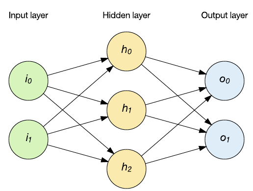
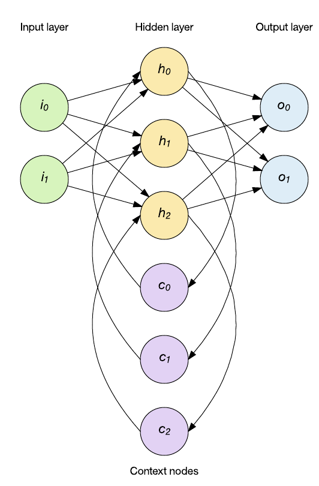
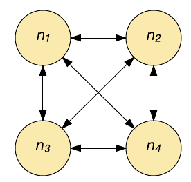
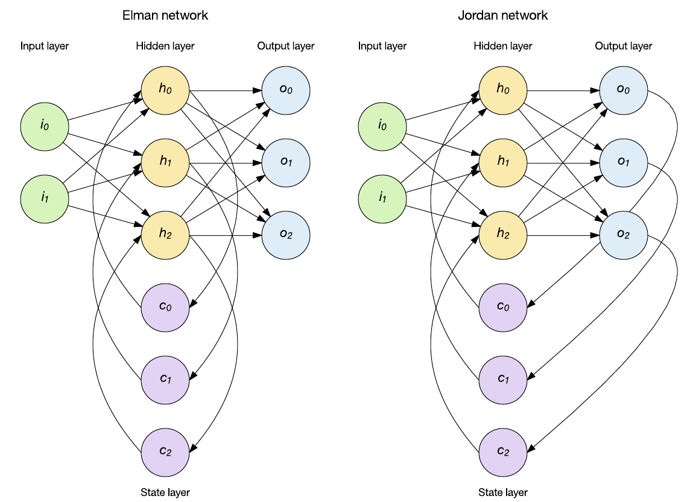
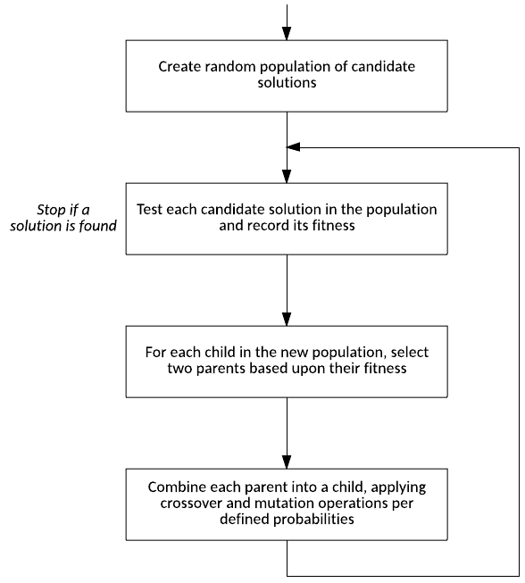
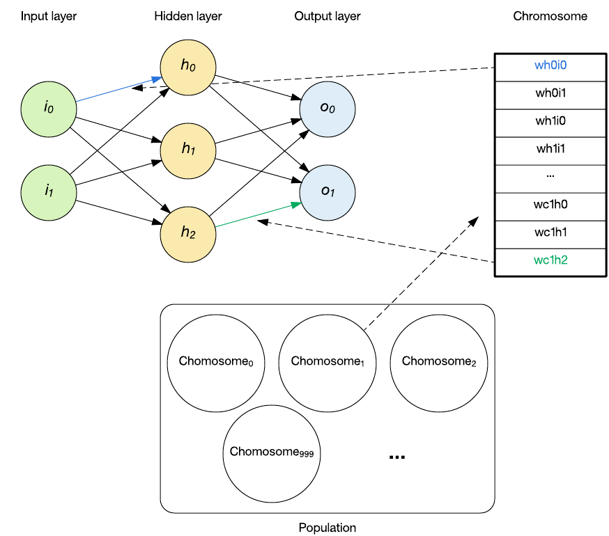
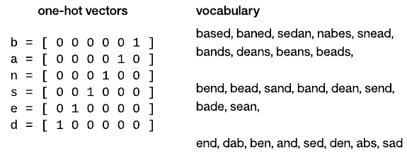
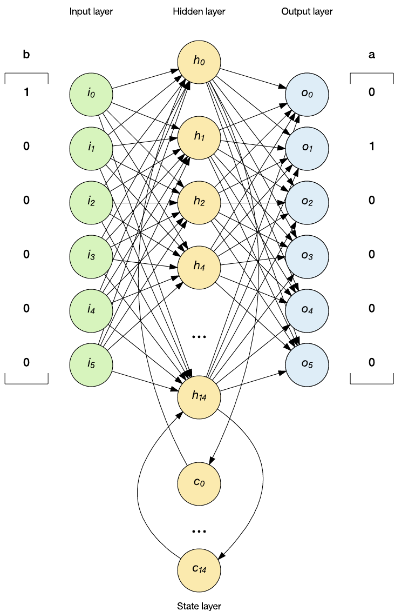
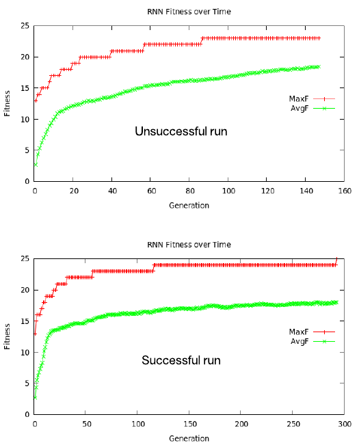

# 递归神经网络深入剖析
构建自己的 RNN

**标签:** 人工智能

[原文链接](https://developer.ibm.com/zh/articles/cc-cognitive-recurrent-neural-networks/)

M. Tim Jones

发布: 2017-11-28

* * *

递归神经网络（RNN）是一类神经网络，包括一层内的加权连接（与传统前馈网络相比，连接仅馈送到后续层）。因为 RNN 包含循环，所以它们可以在处理新输入的同时存储信息。这种记忆使它们非常适合处理必须考虑事先输入的任务（比如时序数据）。由于这个原因，目前的深度学习网络均以 RNN 为基础。本教程将探索 RNN 背后的思想，并从头实现一个 RNN 来执行序列数据预测。

神经网络是基于高度连接的处理元件（神经元）的网络将输入映射到输出的计算结构。要快速了解神经网络，请阅读我的另一篇教程“ [神经网络深入剖析](https://www.ibm.com/developerworks/cn/cognitive/library/cc-cognitive-neural-networks-deep-dive/index.html)”，其中分析了感知器（神经网络的构建块）以及具有反向传播学习能力的多层感知器。

在 [前面的教程](https://www.ibm.com/developerworks/cn/cognitive/library/cc-cognitive-neural-networks-deep-dive/index.html) 中，我探讨了前馈网络拓扑结构。在此拓扑结构中（如下图所示），可以通过隐藏层将输入矢量馈送到网络中，并最终获得一个输出。在这个网络中，输入以确定性的方式映射到输出（每次输入被应用）



但是，我们假设您在处理时序数据。孤立的单一数据点并不是完全有用的，因为它缺乏重要的属性（例如，数据序列是否在发生变化？是增大？还是缩小？）。考虑一个自然语言处理应用程序，其中的字母或单词表示网络输入。当您考虑理解单词时，字母在上下文中很重要。孤立状态下的这些输入没有什么用，只有将它们放入之前发生的事件的上下文中才有用。

时间序列数据的应用需要一种可以考虑输入历史的新型拓扑结构。这时就可以应用 RNN。RNN 能够通过反馈来维护内部记忆，所以它支持时间行为。在下面的示例中，会将隐藏层输出应用回隐藏层。网络保持前馈方式（先将输入应用于隐藏层，然后再应用于输出层），但 RNN 通过上下文节点保持内部状态（这会影响后续输入上的隐藏层）。



RNN 不是一类网络，而是一个包含解决不同问题的拓扑结构的集合。递归网络的一个重要方面在于，借助足够的层和节点，它们是图灵完备的，这意味着它们可以实现任何可计算函数。

## RNN 的架构

RNN 是在 20 世纪 80 年代引入的，它们保持对过去输入记忆的能力为神经网络开启了新的问题领域。让我们看看您可以使用的一些架构。

### Hopfield

Hopfield 网络是一种联想记忆。给定一种输入模式，它将获取与该输入最相似的模式。这种联想（输入与输出之间的联系）类似于人脑的工作方式。给定一段记忆的一部分，人类能完全回想起该记忆，Hopfield 网络的工作原理与此类似。

Hopfield 网络实质上是二进制的，各个神经元要么打开（激活），要么关闭（未激活）。每个神经元都通过一个加权连接与其他每个神经元相连（参见下图）。每个神经元同时用作输入和输出。在初始化时，会在网络中载入一个部分模式，然后更新每个神经元，直到该网络收敛（它一定会收敛）。输出是在收敛（神经元的状态）时提供的。



Hopfield 网络能够学习（通过 Hebbian 学习）多种模式，并且在输入中存在噪声的情况下收敛以回忆最接近的模式。Hopfield 网络不适合用来解决时域问题，而是经常性的。

### 简单递归网络

简单递归网络是一类流行的递归网络，其中包括将状态引入网络的状态层。状态层影响下一阶段的输入，所以可应用于随时间变化的数据模式。

你可以用不同的方式应用状态，其中两种流行方法是 Elman 和 Jordan 网络（参见下图）。在 Elman 网络中，隐藏层对保留了过去输入记忆的上下文节点状态层进行馈送。如下图所示，存在一组上下文节点来保持之前的隐藏层结果的记忆。另一种流行的拓扑结构是 Jordan 网络。Jordan 网络有所不同，因为它们将输出层存储到状态层中，而不是保留隐藏层的历史记录。



Elman 和 Jordan 网络可通过标准的反向传播来训练，每种网络都已应用到序列识别和自然语言处理中。请注意，这里仅引入了一个状态层，但很容易看出，您可以添加更多状态层，在这些状态层中，状态层输出可充当后续状态层的输入。本教程将在 Elman 网络部分中探讨此概念。

### 其他网络

递归式网络的研究并没有停止，如今，递归架构正在设立处理时序数据的标准。深度学习中的长短期记忆 (LSTM) 方法已经在卷积网络中得到应用，以便通过生成的语言来描述图像和视频的内容。LSTM 包含一个遗忘门，让您能对各个神经元进行“训练”，使其了解哪些信息是重要的，以及这保持重要性信息的时间。LSTM 可以处理重要事件间隔时间较长的数据。

另一种最新的架构称为门控递归单元 (GRU)。GRU 是对 LSTM 的一种优化，需要的参数和资源更少。

## RNN 训练算法

由于 RNN 具有将历史信息按时序或序列进行合并的性质，所以它们拥有独特的训练算法。梯度下降算法已成功应用到 RNN 权重优化上（通过与权重的误差导数呈一定比例地调节权重来最小化误差）。一种流行的技术是时间反向传播 (BPTT)，它应用了权重更新，它通过累加序列中每个元素的累积误差的权重更新来应用权重更新，，最后更新权重。对于大型的输入序列，此行为可能导致权重消失或爆炸（称为消失或爆炸梯度问题）。要解决此问题，通常会使用混合方法，并结合使用 BPTT 与实时递归学习等其他算法。

其他训练方法也能成功应用于不断进化的 RNN。可应用进化算法（比如遗传算法或模拟退火法）来进化候选 RNN 群体，然后将它们重新组合为它们的适合度（即它们解决给定问题的能力）的函数。尽管不保证能收敛于一个解决方案，但可以成功地将收敛应用于一系列问题，包括 RNN 进化。

RNN 的一个有用的应用是预测序列。在下一个示例中，我将构建一个 RNN，用它根据一个小词汇表来预测某个单词的最后一个字母。我将单词馈送入 RNN 中，一次加载一个字母，网络的输出将表示预测的下一个字母。

### 遗传算法流

查看 RNN 示例之前，让我们看看遗传算法背后的流程。遗传算法是一种受自然选择过程启发的优化技术。如下图所示，该算法创建了一个随机的候选解决方案（称为染色体）群体，这些解决方案对将要寻找的解决方案的参数进行编码。创建它们后，针对相应问题对该群体的每个成员进行测试，并分配一个适合度值。然后从群体中识别父染色体（首选具有更高适合度的染色体），并为下一代创建一个子染色体。在子染色体这一代中，应用遗传运算符（比如从每个父染色体获取元素[称为杂交]并向子染色体引入随机变化[称为突变]。然后使用新群体再次开始此过程，直到找到合适的候选解决方案。



### 用染色体组表示神经网络

一个染色体被定义为群体的一个成员，包含要解决的特定问题的编码。在进化 RNN 的上下文中，染色体由 RNN 的权重组成，如下图所示。



每个染色体包含每个权重的 16 位值。将该值（介于 0 – 65535 之间）转换为权重，方法是减去该范围的一半，然后乘以 0.001。这意味着该编码可以表示 -32.767 到 32.768 之间增量为 0.001 的值。

对于从群体中获取染色体并生成 RNN 的过程，只需将其定义为使用从染色体转换而来的权重来初始化网络的权重。在本例中，这表示 233 个权重。

### 使用 RNN 预测字母

现在，我们来探讨字母在神经网络中的应用。神经网络处理的是数字值，所以需要采用某种表示形式来将字母馈送入网络中。在本例中，我使用了独热编码。独热编码将一个字母转换为一个矢量，而且矢量中仅设置一个元素。这种编码创造了一种可在数学上使用的独特特征 — 例如，表示的每个字母都会在网络中应用自己的权重。尽管在此实现中，我通过独热编码来表示字母；但自然语言处理应用程序也以相同方式表示单词。下图演示了这个示例中使用的独热矢量和用于测试的词汇表。



所以，现在我有一种使我的 RNN 能够处理字母的编码。现在，让我们看看如何在 RNN 的上下文中处理字母。下图演示了字母预测上下文中的 Elman 式 RNN（馈送表示字母 _b_ 的独热矢量）。对于测试单词中的每个字母，我将该字母编码为独热码，然后将它作为输入馈送给网络。然后，以前馈方式执行该网络，并以胜者全得的方式解析输出，以确定定义独热矢量的获胜元素（在本例中为字母 _a_ ）。在此实现中，仅检查了单词的最后一个字母，验证中忽略了其他字母，也没有对它们执行适合度计算。



### 简单的 Elman 式 RNN 实现

让我们来看一个通过遗传算法训练的 Elman 式 RNN 的样本实现。可以在 GitHub 上找到此实现的 Linux [源代码](https://github.com/mtimjones/recurrent)。该实现由 3 个文件组成：

- main.c 提供主循环、一个用于测试的函数，以及一个用于获得群体适合度的函数
- ga.c 实现了遗传算法函数
- rnn.c 实现了实际的 RNN

我将重点介绍两个核心函数：遗传算法流程和 RNN 评估函数

RNN 的核心内容可以在 `RNN_feed_forward` 函数中找到，该函数实现了 RNN 网络的执行（参见以下代码）。该函数被拆分为 3 个阶段，类似于上图中显示的网络。在第一阶段，计算隐藏层的输出，隐藏层合并了输入层和上下文层（每层都有自己的一组权重）。上下文节点已在测试给定单词之前初始化为 0。在第二阶段，我将计算输出层的输出。这一步合并了每个隐藏层神经元与它们自己的独特权重。最后，在第三阶段，我将第一个上下文层神经元传播到第二个上下文层神经元，将隐藏层输出传播到第一个上下文节点。这一步在网络中实现了两个记忆层。

请注意，在隐藏层中，我使用 `tan` 函数作为激活函数，并使用 `sigmoid` 函数作为输出层中的激活函数。 `tan` 函数在隐藏层中很有用，因为它的范围是 -1 到 1（它还允许使用来自隐藏层的正输出和负输出）。在输出层中，我感兴趣的是激活独热矢量的最大值，我使用了 `sigmoid` ，因为它的范围是 0 到 1。

```
void RNN_feed_forward( void )
{
int i, j, k;

// Stage 1: Calculate hidden layer outputs
for ( i = 0 ; i < HIDDEN_NEURONS ; i++ )
{
      hidden[ i ] = 0.0;

      // Incorporate the input.
      for ( j = 0 ; j < INPUT_NEURONS+1 ; j++ )
      {
         hidden[ i ] += w_h_i[ i ][ j ] * inputs[ j ];
      }

      // Incorporate the recurrent hidden.
      hidden[ i ] += w_h_c1[ i ] * context1[ i ];
      hidden[ i ] += w_h_c2[ i ] * context2[ i ];

      // apply tanh activation function.
      hidden[ i ] = tanh( hidden[ i ] );
}

// Stage 2: Calculate output layer outputs
for ( i = 0 ; i < OUTPUT_NEURONS ; i++ )
{
      outputs[ i ] = 0.0;

      for ( j = 0 ; j < HIDDEN_NEURONS+1 ; j++ )
      {
         outputs[ i ] += ( w_o_h[ i ][ j ] * hidden[ j ] );
      }

      // apply sigmoid activation function.
      outputs[ i ] = sigmoid( outputs[ i ] );
}

// Stage 3: Save the context hidden value
for ( k = 0 ; k < HIDDEN_NEURONS+1 ; k++ )
{
      context2[ k ] = context1[ k ];
      context1[ k ] = hidden[ k ];
}

return;
}

```

Show moreShow more icon

我在下面的代码示例中实现了遗传算法。可以分 3 部分查看此代码。第一部分计算群体的总适合度（在选择过程中使用），以及群体中最适合的染色体。第二部分中使用最适合的染色体，仅将此染色体复制到下一个群体。这是一种精英选择形式，我将维护最适合的染色体，一直到将其复制到下一个群体中。该群体包含 2,000 个染色体。

在遗传算法的最后一部分中，我从群体中随机选择两个父染色体，利用它们为下一个群体创建一个子染色体。选择算法基于所谓的轮盘抽奖选择方法，染色体是随机选择的，但选中更符合的父染色体的几率更高一些。选择两个父染色体后，将它们重新组合成下一个群体的子染色体。此过程蕴含杂交（选择一位父亲的基因来传播）和突变（可以随机重新定义一个权重）的可能性。发生杂交和突变的概率很低（每次重新组合对应一次突变，而杂交次数则更少）。

```
void GA_process_population( unsigned int pop )
{
double sum = 0.0;
double max = 0.0;
int best;
int i, child;

best = 0;
sum = max = population[ pop ][ best ].fitness;

// Calculate the total population fitness
for ( i = 1 ; i < POP_SIZE ; i++ )
{
      sum += population[ pop ][ i ].fitness;
      if ( population[ pop ][ i ].fitness > max )
      {
         best = i;
         max = population[ pop ][ i ].fitness;
      }
}

// Elitist -- keep the best performing chromosome.
recombine( pop, best, best, 0, 0.0, 0.0 );

// Generate the next generation.
for ( child = 1 ; child < POP_SIZE ; child++ )
{
      unsigned int parent1 = select_parent( pop, sum );
      unsigned int parent2 = select_parent( pop, sum );

      recombine( pop, parent1, parent2, child, MUTATE_PROB, CROSS_PROB );
}

return;
}

```

Show moreShow more icon

### 样本执行

可以在 Linux 中构建 GitHub 上的样本源代码，只需键入 `make` 并使用 `./rnn` 来执行。执行时，会随机创建群体，然后对一些代进行自然选择，直到找到准确预测了整个测试词汇表的最后一个字符的解决方案，或者直到模拟未能正确地收敛于一个解决方案上。成败与否由平均适合度来决定；如果平均适合度达到最大适合度的 80%，那么该群体缺乏足够的多样性来找到解决方案，并将退出。

如果找到一个解决方案，代码将发布整个测试词汇表并显示每个单词的预测结果。请注意，染色体适合度仅基于单词的最后一个字母，所以没有预测内部字母。下面的代码提供了一个成功输出的样本。

```
$ ./rnn
Solution found.

Testing based
    Fed b, got s
    Fed a, got b
    Fed s, got e
    Fed e, got d

Testing baned
    Fed b, got s
    Fed a, got b
    Fed n, got d
    Fed e, got d

Testing sedan
    Fed s, got s
    Fed e, got d
    Fed d, got s
    Fed a, got n

...

Testing den
    Fed d, got d
    Fed e, got n

Testing abs
    Fed a, got d
    Fed b, got s

Testing sad
    Fed s, got s
    Fed a, got d

```

Show moreShow more icon

下图展示了平均和最大适合度的曲线图。请注意，每个曲线图都从约为 13 的适合度级别开始。12 个单词以 _d_ 结尾，所以为任何字母序列发布 _d_ 的网络都拥有这一成功级别。 但是，必须进化这些权重，以便考虑前面的字母，针对给定词汇表进行准确预测。如图所示，在成功运行时，超过一半的世代需要预测成功运行的最后一个测试用例。



有趣的是，每个曲线图都演示了进化生物学中的一种称为间断平衡的理论，该现象的特征是，一次爆发性的进化变异打断了长期的静态平衡（总体稳定性）。在一种情况下，这种爆发性的进化会导致停滞在局部最小值上；在另一种情况下，进化会成功（停滞在局部最大值上）。

## 结束语

传统神经网络能以确定性方式将输入矢量映射到输出矢量。对于许多问题，这是理想选择，但在必须考虑序列和时序数据时，向网络引入内部记忆使其能够在制定输出决策时考虑以前的数据。RNN 在传统前馈网络中引入了反馈，使它们能包含一个或多个记忆级别。RNN 代表着一种未来的基础架构，可以在大多数先进的深度学习技术（比如 LSTM 和 GRU）中找到它。

本文翻译自： [Recurrent neural networks deep dive](https://developer.ibm.com/articles/cc-cognitive-recurrent-neural-networks/)（2017-08-17）