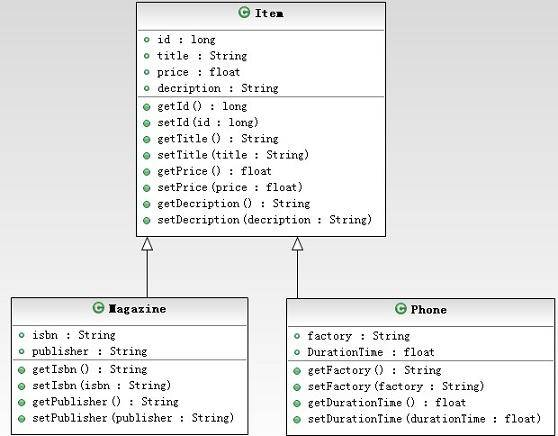
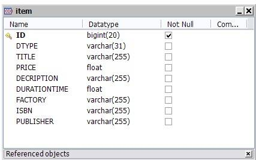
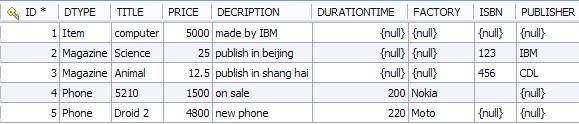
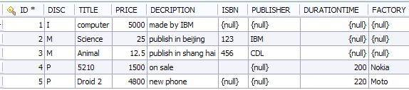
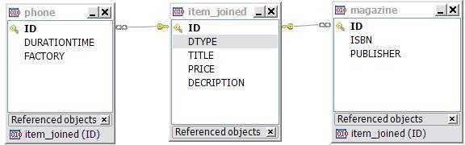
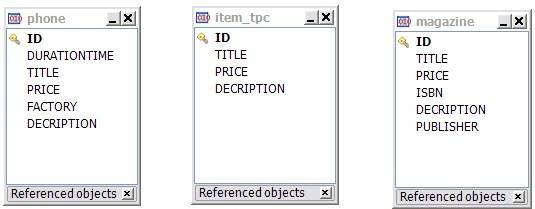
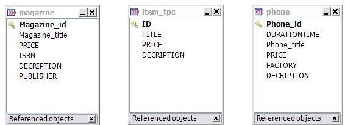

# 通过 Hibernate 实现 JPA 对象关系模型之继承映射策略
三种不同的策略来实现继承与关系之间的映射

**标签:** Java

[原文链接](https://developer.ibm.com/zh/articles/j-lo-hibernatejpa/)

王汉敏

发布: 2012-05-28

* * *

## 前言

**Single-table** 策略：这是继承映射中的缺省策略，在不特别指明的情况下，系统默认就是采用这种映射策略进行映射的。这个策略的映射原则就是父类包括子类中新添加的属性全部映射到一张数据库表中，数据库表中有一个自动生成的字段用来存储区分不同的子类的信息。

**Joined-subclass** 策略：这种映射策略中，继承关系中的每一个实体类，无论是具体类 (concrete entity) 或者抽象类 (abstract entity)，数据库中都有一个单独的表与他对应。子实体对应的表中不含有从根实体继承而来的属性，它们之间通过共享主键的方式进行关联。

**Table-per-concrete-class** 策略：这个策略就是将继承关系中的每一个实体映射到数据库中的一个单独的表中，与”Joined”策略不同的是，子实体对应的表中含有从根实体继承而来的属性。这种策略在 JPA2.0 中仍然是自由选取得，也就是说实现 JPA2.0 规范的持久化引擎，如 Toplink，Hibernate 等 , 仍然可以自由选取是否实现这种策略。

得益于注解 (annotation) 方式的使用，JPA 2.0 中实现继承关系的映射非常简单。当实体 (entity) 之间有继承关系的时候，一定有一个根实体 (root entity)，JPA2.0 中只需要在这个根实体 (root entity) 上标注 @Inheritance 注解并且指明想要采用的映射策略就可以了。如果是不用 @Inheritance 注解，或者使用了 @Inheritance 注解但是没有指明所要采用的映射策略的时候，默认就是采用单表策略 (Single-table strategy)。下面用图 1 这个继承关系分别说明这三种映射策略的使用。

##### 图 1.Item、Magazine、Phone 继承关系的 UML 类图



Item 类中定义了 Title、Price 和 Description 属性，其中 Magazine 类和 Phone 类继承了 Item 类，并且给自添加了自己独有的属性，Magazine 中添加了 ISBN 和 Publisher 属性，Phone 中添加了 Factory 和 DurationTime 属性。

## Single Table 映射策略

单表（Single-Table）映射是继承映射中的缺省映射策略，在不加说明的情况下，也就是不在根实体 (root entity) 中指定映射策略的时候默认就是使用的这种映射策略。在本例中根实体 (root entity) 指的是实体 Item 类。

##### 清单 1.定义成单表映射的 Item 实体

```
@Entity
public class Item implements Serializable {

    private static final long serialVersionUID = 1L;
    @Id
    @GeneratedValue(strategy = GenerationType.AUTO)
    private Long id;
    private String title;
    private Float price;
    private String decription;

// Getters and Setters
}

```

Show moreShow more icon

Item 实体类没有用 @Inheritance 这个注解 (annotation) 进行注释，说明在这个继承关系中使用的是单表映射策略。同时 Item 实体类是 Phone 实体类和 Magazine 实体类的根实体 (root entity)，它们继承了 Item 的属性并且拥有自己的独有的属性。

##### 清单 2.Phone 实体继承自 Item 实体

```
@Entity
public class Phone extends Item {

    private String factory;
    private Float DurationTime;

     // Getters and Setters

}

```

Show moreShow more icon

##### 清单 3.Magazine 实体继承自 Item 实体

```
@Entity
public class Magazine extends Item {

    private String isbn;
    private String publisher;

     // Getters and Setters

}

```

Show moreShow more icon

因为采用的是单表映射策略，数据库中只有一张表与之对应，父类和子类中的属性集中在同一个数据库表中显示，默认的数据库表的名字是根实体 (root entity) 类的类名。

图 2 就是对应的数据库表的 ER 图。

从图 2 可以看出来，单表映射中除了将所有子类中的属性和父类集中在同一个表中之外，还多添加了一个 DTYPE 的列，这个列主要是为了区别子类的，他的缺省属性是 String 类型，缺省值就是子实体 (entity) 类的类名。如图 3，数据库中记录的一个片断，DTYPE 列的值默认就是类的名字，它是用来区分本行的记录属于继承关系的中的哪个类的。DTYPE 的值是 Item 的行，就是由根实体持久化而来的，以此类推。

##### 图 2.Item 表的 ER 图



##### 图 3.Item 表的数据片断



当然这个用来区分子类的字段也是可根据需要而修改的．

##### 清单 4.重新定义区分字段的名字和类型

```
@Entity
@DiscriminatorColumn(name="DISC",discriminatorType=DiscriminatorType.CHAR)
@DiscriminatorValue("I")
public class Item implements Serializable {

    private static final long serialVersionUID = 1L;
    @Id
    @GeneratedValue(strategy = GenerationType.AUTO)
    private Long id;
    private String title;
    private Float price;
    private String decription;

     // Getters and Setters

}

```

Show moreShow more icon

清单 4 中重新定义了用来区分不同实体的列的列名和属性，将 String 类型修改成了 Char 类型。并且指明了当这个字段中的内容为字符”I”时，那么本行的地记录属于根实体自己。

##### 清单 5.定义 Magazine 实体类区分字段得值

```
@Entity
@DiscriminatorValue("M")
public class Magazine extends Item {

    private String isbn;
    private String publisher;

    // Getters and Setters

}

```

Show moreShow more icon

##### 清单 6.定义 Phone 实体类区分字段得值

```
@Entity
@DiscriminatorValue("P")
public class Phone extends Item {

    private String factory;
    private Float DurationTime;

     // Getters and Setters

}

```

Show moreShow more icon

清单 5 和清单 6 中分别对 Magazine 和 Phone 实体在区分子段中的要现实的值进行了修改，修改为字符”M”和字符”P”，当然也可以是其他的字符。图 4 就是修改后的继承关系在数据库中对应的表的数据记录片断。可以看出区分子段已经发生了相应的改变。

##### 图 4\. 重新定义后的 Item 表



单表映射策略是缺省的映射策略，这种策略对实体之间的多种关联关系能提供很好的支持，同时在查询方面也有很好的效率。但是这种映射策略在数据库表中会有很多的空字段的存在，如图 3 和图 4 所示。这样势必会造成数据库资源的大量浪费，同时这个映射策略也要求子类中的所有属性也必须是可空 (null able) 的。

## Joined 映射策略

在这种映射策略里面，继承结构中的每一个实体 (entity) 类都会映射到数据库中一个单独的表中，也就是说每个实体 (entity) 都会被映射到数据库中，一个实体 (entity) 类对应数据库中的一个表。其中根实体 (root entity) 对应的表中定义了主键 (primary key)，所有的子类对应的数据库表都要共同使用这个主键，同时这个表中和单表映射策略一样还定义了区分列 (DTYPE)。

##### 清单 7.连接映射策略中的根实体 (root entity)

```
@Entity
@Inheritance(strategy=InheritanceType.JOINED)
@Table(name="Item_Joined")
public class Item implements Serializable {

    private static final long serialVersionUID = 1L;
    @Id
    @GeneratedValue(strategy = GenerationType.AUTO)
    private Long id;
    private String title;
    private Float price;
    private String decription;

     // Getters and Setters

}

```

Show moreShow more icon

##### 清单 8.连接映射策略中的 Magazine 子实体 (subclass)

```
@Entity
public class Magazine extends Item {

    private String isbn;
    private String publisher;

     // Getters and Setters

}

```

Show moreShow more icon

##### 清单 9.连接映射策略中的 Phone 子实体 (subclass)

```
@Entity
public class Phone extends Item {

    private String factory;
    private Float DurationTime;

     // Getters and Setters

}

```

Show moreShow more icon

从清单 7，清单 8，清单 9 中可以看出，这种映射策略和缺省的单表映射策略唯一的区别就是在根实体中使用 @Inheritance 注解 (annotation) 并指定使用 Joined 映射策略。图 5 　是这种策略在在数据库中的 ER 图，从该图中可以看出来子类对应的表和父类对应的表除了共享主键外，与单表映射不同的是，他们各自拥有自己的属性。同时根实体 (root entity) 对应的表中的 DTYPE 属性说明，您仍旧可以使用 @DiscriminatorColumn 和 @DiscriminatorValue 在其中定义用来区分子类的字段和值。

##### 图 5\. 连接映射的 ER 图



这种映射策略，在继承比较多时，查寻起来效率就会差一些，因为在查询的过程中需要多表的连接，连接的表数越多，查询效率越低下。

## Table-per-class 映射策略

这种映射策略和连接映射策略很类似，不同的是子类对应的表中要继承根实体 (root entity) 中的属性，根实体 (root entity) 对应的表中也不需要区分子类的列，表之间没有共享的表，也没有共享的列。

##### 清单 10.根实体 (root entity)

```
@Entity
@Inheritance(strategy=InheritanceType.TABLE_PER_CLASS)
@Table(name="Item_TPC")
public class Item implements Serializable {

    private static final long serialVersionUID = 1L;
    @Id
    @GeneratedValue(strategy = GenerationType.AUTO)
    private Long id;
    private String title;
    private Float price;
    private String decription;

     // Getters and Setters

}

```

Show moreShow more icon

Item 根实体在 @Inheritance 注解中指定使用 TABLE\_PER\_CLASS 映射策略。

##### 清单 11.Magazine 实体 (entity)

```
@Entity
public class Magazine extends Item {

    private String isbn;
    private String publisher;

     // Getters and Setters

}

```

Show moreShow more icon

##### 清单 12.Phone 实体 ( entity)

```
@Entity
public class Phone extends Item {

    private String factory;
    private Float DurationTime;

     // Getters and Setters

}

```

Show moreShow more icon

Magazine 和 Phone 子实体没有任何变化。图 6 是对应的 ER 图，从图中可以看出，不同的子实体对应的表中，不仅有自己的属性，还包含了从根实体继承而来的属性，这点与 Joined 映射策略不同，Joined 映射策略中，子实体对应的表中不包含根实体的属性。

##### 图 6\. 映射的 ER 图



**重写根实体的属性**

因为每个子实体对应的表中都继承了根实体中的属性，为了区分可以使用 @AttributeOverride 注解来修改根实体中的属性在不同的子实体中的对应的列名。

##### 清单 13.Magazine 实体 (entity)

```
@Entity
@AttributeOverrides({
    @AttributeOverride(name="id",
                      column=@Column(name="Magazine_id")),
    @AttributeOverride(name="title",
                      column=@Column(name="Magazine_title")),
    @AttributeOverride(name="description",
                      column=@Column(name="Magazine_desc")),
})
public class Magazine extends Item {

    private String isbn;
    private String publisher;

    // Getters and Setters

}

```

Show moreShow more icon

Magazine 实体将从 Item 根实体中继承而来的 id、title、description 属性分别重写为 Magazine\_id、Magazine\_title 和 Magazine\_desc。

##### 清单 14.Phone 实体 ( entity)

```
@Entity
@AttributeOverrides({
    @AttributeOverride(name="id",
                      column=@Column(name="Phone_id")),
    @AttributeOverride(name="title",
                      column=@Column(name="Phone_title")),
    @AttributeOverride(name="description",
                      column=@Column(name="Phone_desc")),
})
public class Phone extends Item {

    private String factory;
    private Float DurationTime;

     // Getters and Setters

}

```

Show moreShow more icon

Phone 实体将从 Item 根实体中继承而来的 id、title、description 属性分别重写为 Phone \_id、Phone \_title 和 Phone\_desc。

从图 7 就可以看出，根实体中的属性，在子实体中的列名已经被相应地修改了。

##### 图 7\. 映射的 ER 图



## 继承映射中的其他类型 :

上面的例子中的所使用的根实体类都是具体 (concrete) 实体类，下面将介绍一下当根实体是其他类型类的情况下的映射规则。

**抽象实体类 (Abstract entity)** ：

上面的例子中所使用的 Item 是个具体类 (concrete class)，并且使用 @Entity 注解 (annotation) 进行了注释。那么当 Item 类不是具体类 (concrete class)，而是一个抽象类 (abstract class) 的时候，也就是当 Item 类的声明中使用了 abstract 关键字的时候，是如何影射的呢？事实上根实体是否是抽象实体类，在数据库中映射成的表没有任何区别。也就是说上面的例子中如果根实体类 Item 是个抽象实体类，使用了 abstract 关键字的话，在数据库中生成的表和上面的例子是相同的。唯一的区别就是，如果根实体是抽象实体类的话，就不能使用 new 关键字来生成这个实体类的对象了。他们的区别只是在 Java 语言语法上的区别，在持久化上没有任何区别。

**非实体类 (Nonentity):**

非实体类 (Nonentity) 也叫瞬态类 (transient class)，就是普通的 POJO 类，没有使用 @Entity 注解 (annotation) 注释，这种类在持久化的时候不会被映射到数据库中，因为根据之前介绍过的持久化的原则，一个类如果想被持久化到数据库中，必须使用 @Entity 注解。那么当一个实体类继承了一个这样的非实体类的情况下，该如何影射呢。

##### 清单 15.Item 类是一个没有使用 @Entity 普通的 POJO 的 Java 类

```
public class Item{
    private String title;
    private Float price;
    private String decription;

     // Getters and Setters

}

```

Show moreShow more icon

清单 16 中的 Magazine 实体类继承了 Item 非实体类，根据 Java 的语法规则，Magazine 实体类的对象将可以访问 Item 类中的属性。并且根据上面介绍过，Item 类可以是具体类 (concrete class) 也可以是抽象类 (abstract class)，这对持久化后的结果没有影响。

##### 清单 16.Magazine 实体继承了 Item 非实体类

```
@Entity
public class Magazine extends Item {
@Id
@GeneratedValue(strategy = GenerationType.AUTO)
private Long id;
    private String isbn;
    private String publisher;

     // Getters and Setters
}

```

Show moreShow more icon

Magazine 实体类继承了 Item 类，但是在持久化的时候，只有 Magazine 类中的属性才能持久化到数据库中去。从 Item 类中继承下来的属性不会持久化数据库中。清单 17 就是将 Magazine 实体类持久化到数据库中的表的结构，从中可以看出并没有 Item 中的属性。

##### 清单 17.Magazine 实体继承了 Item 非实体类

```
CREATE TABLE `magazine` (
`ID` bigint(20) NOT NULL,
`ISBN` varchar(255) default NULL,
`PUBLISHER` varchar(255) default NULL,
PRIMARY KEY  (`ID`)
) ENGINE=InnoDB DEFAULT CHARSET=latin1;

```

Show moreShow more icon

**Mapped SupperClass：**

JPA 有一种特殊的类叫做 Mapped Supper class，这种类不是实体类，他与实体类的区别就是用 @MappedSuperclass 注解来替代 @Entity 注解，其他方面没有变化。如清单 18 中的例子所示，Employee 类被注解成了一个 Mapped Superclass，并且使用了继承映射中的 Joined 映射策略。

##### 清单 18.Employee 是一个 Mapped superclass

```
@MappedSuperclass
@Inheritance(strategy=InheritanceType.JOINED)
public class Employee {
    @Id
    @GeneratedValue
    private Long id;
    private String name;
    private String depart;

    // Getters and Setters

}

```

Show moreShow more icon

这种类不能被映射到数据库中，持久化后数据库中没有与之对应的表，因此就不能使用 @Table 注解，也就不能对他进行查询等操作。但是任何继承他的子类可以将继承而来的属性持久化到数据库中。

##### 清单 19.Manager 继承了 Employee

```
@Entity
public class Manager extends Employee {
private String office;
     private String car;

// Getters and Setters
}

```

Show moreShow more icon

清单 19 中的 Manager 类继承了 Employee 类，清单 20 就是 Manager 类映射到数据库中后对应的表结构。从表结构中可以看出，Manager 从 Employee 继承而来的属性也被映射到了数据库中。

##### 清单 20.Manager 表的结构

```
CREATE TABLE `manager` (
`ID` bigint(20) NOT NULL,
`OFFICE` varchar(255) default NULL,
`CAR` varchar(255) default NULL,
`DEPART` varchar(255) default NULL,
`NAME` varchar(255) default NULL,
PRIMARY KEY  (`ID`)
) ENGINE=InnoDB DEFAULT CHARSET=latin1;

```

Show moreShow more icon

## 结束语

综上所述，虽然面向对象的 Java 语言中，类之间的继承关系在关系型数据库中的表并没有对应的关联方式。但是我们可以使用上述的方法将两者轻松地实现对象 – 关系的映射，即使类之间的继承关系很复杂，实现对象 – 关系映射的方法无外乎上面所述几种情况，稍加分析我们就可以以不变应万变。