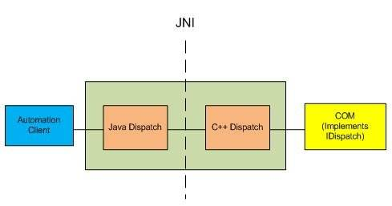
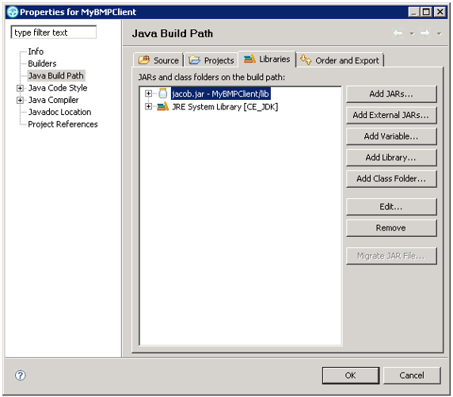
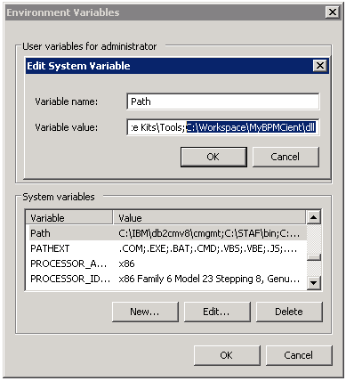

# 通过 JACOB 实现 Java 与 COM 组件的互操作
结合一个实例来介绍 JACOB 项目的使用和优点

**标签:** Java

[原文链接](https://developer.ibm.com/zh/articles/j-lo-jacob/)

杨晓峰, 仇璐

发布: 2009-12-08

* * *

我们在实现复杂软件或者进行集成环境的测试时，往往要与各种应用程序打交道。理想情况下，如果能用一种编程语言实现所有功能是很令人憧憬的，但由于遗留代码、语言的能力和厂商的互操作性的策略不同，这往往是一个不现实的目标。比如您可以使用 C#，C++ 或 VB 等语言方便的操作 Outlook 邮箱，但是如果您是一个 Java 程序员，事情就不那么简单了。如果我们可以在 Java 中调用 COM 组件，就可以充分利用您的 Java 技能和现有的成熟 COM 工具包，大大简化应用开发的过程。

COM 组件提供了一种与其他语言的互操作方式，叫做自动化（Automation）。现有的 Java COM 互操作的解决方案有很多种，由于设计目的的不同，在性能、易用性等方面都有很大的区别。本文介绍的 JACOB 开源项目，致力于简化 Java 操作 COM 组件，提供了一个虚拟机独立的自动化服务器实现，由于其通用性设计，您可以非常简单地完成对现有应用的集成。

## JACOB 项目的由来

首先，我们将了解 JACOB 项目的基本情况，探讨在什么样的情况下选择它来完成您的任务

有关自动化的更多细节，您可以参考相关文档和书籍，我们仅做简单介绍。调用 COM 中暴露出来的方法，主要有两种机制：早期绑定和晚期绑定。

早期绑定显式的声明对象、数据类型等，编译器获取了足够的信息在编译期进行链接和优化，这样通常可以获得更好的性能，通过这种机制实现 Bridge 调用可以参考 IBM 的 RJCB 项目，它提供了一套高性能的解决方案。当然您需要了解更多 COM 组件的细节，虽然框架为您完成了大部分的生成 Bridge 代码的工作，但是总体来说，编码工作量还是偏大，编码难度也比较高，而且 RJCB 仅支持那些提供早期绑定的 vtable 接口的 COM API。

而晚期绑定方式是通过 [IDispatch](https://en.wikipedia.org/wiki/IDispatch) 接口来实现，类似 Java 的反射机制，您可以按照名称或者 ID 进行方法调用，这种设计主要目的是支持脚本语言操作 COM，因为脚本是解释执行的，通常都不支持指针也就没有 C++ 中的 vtable 机制，无法实现早期绑定。这种方式的缺点是在一定程度上性能较差，由于是在运行时按照名字或者 ID 进行对象的调用，只有运行时才确切知道调用的是哪个对象，哪个方法，这样必然带来一定的开销和延迟。但是这种方式的优点也是非常明显的，简单、灵活，您可以不必关注动态链接库的细节，可以非常快地完成代码开发工作。

JACOB 开源项目提供的是一个 JVM 独立的自动化服务器实现，其核心是基于 JNI 技术实现的 Variant, Dispatch 等接口，设计参考了 Microsoft VJ++ 内置的通用自动化服务器，但是 Microsoft 的实现仅仅支持自身的 JVM。通过 JACOB，您可以方便地在 Java 语言中进行晚期绑定方式的调用。

下图是一个对 JACOB 结构的简单说明

##### 图 1\. JACOB 基本结构



您可以综合考虑时间、技术难度、性能要求等各方面来选择适合您的解决方案，下面结合在实际的订单处理系统的部分功能的开发，向您展示使用 JACOB 技术进行开发的成本优势。

## 一个实际案例的演示

首先，了解一下用户场景：

某开发团队要利用一个订单处理的工作流系统，对现有的业务方式进行集成、优化。原有的业务处理方式是基于邮件系统的半人工方式，业务人员将订单以邮件方式发送到特定邮箱，然后后续人员处理订单。

现在设计的集成方式是，处理引擎定期轮询订单邮箱，以特定命名规则区分订单，获取存储在邮件正文和命名属性中的订单信息，将订单放入处理队列进行进一步处理，最后将源邮件标记状态并移出订单目录。

开发工作中遇到的难点是，应用的核心部分是基于 Java 实现的工作流应用，而客户使用 Outlook/Exchange 邮件系统，开发团队并没有足够的人力和时间去为其开发纯 Java 实现的客户端，Java 程序也难以操作邮件命名属性的信息。

下面我们就尝试利用 JACOB 和一些成熟的 COM 组件来解决这个问题。

### 配置您的开发和运行环境

我们的例子是一个基于 Eclipse 的 Java 工程。首先，使用 JACOB 来”搭桥”，您需要下载最新的 JACOB 相关类库，包括 Jacob.jar 和 Jacob.dll，将 jar 文件添加到您的 Eclipse 工程的构建路径。

##### 图 2\. 修改工程的构建路径



由于我们要通过 JNI 调用 DLL 文件，所以您需要把 DLL 文件添加到系统的 PATH 环境变量中，或者您也可以在程序中设置运行时的 PATH 变量。

##### 图 3\. 将 DLL 文件添加到 PATH 变量中



一个简单的”桥”已经搭起来了，您就可以轻松的调用您熟悉的 COM 类库了，我们这里以 Redemption 工具包为例来完成 Outlook 相关操作，它提供了对 Outlook 对象的比较完整的操作，可以方便的绕过 Outlook 对象模型所隐藏的一些细节部分。同时，Redemption 提供了对任何 IDispatch 友好的语言的支持。

您需要在操作系统中注册 COM 组件，可以使用 Redemption 工具包本身提供的安装程序，也可以采用 Windows 系统自带的 REGSVR32 工具来注册 DLL 文件。

### 实现业务逻辑

完成上面的准备工作后，就开始实现具体的业务逻辑了。

首先，要获取邮件您需要登录到指定邮箱，Outlook profile 中存储了您的邮箱的基本信息，下面的例子是如何登录特定 profile：

```
public void logon(String profile, String password) {
    // 登录到指定 Profile，并获取一个会话
    ActiveXComponent session = new ActiveXComponent("Redemption.RDOSession");
    Dispatch.call(session, "Logon", profile, password, false, true);
}

```

Show moreShow more icon

现在已经能够访问用户邮箱，我们要做的是获取收件箱中的标题以”ORDER NO:”开始的邮件，把信息存储到订单管理系统之中

```
Dispatch items = Dispatch.call(folder, "Items").toDispatch();
int count = Dispatch.call(items, "Count").getInt();
// 轮询所有邮件，并检查符合标准的邮件
for (int x = 1; x <= count; x++) {
    Dispatch item = Dispatch.call(items, "_Item", new Integer(x)).toDispatch();
    ActiveXComponent sMail = new ActiveXComponent("Redemption.SafeMailItem");
    sMail.setProperty("Item", item);
    Variant vSubj = Dispatch.get(sMail, "Subject");
    String subj = vSubj.getString();
    if (subj.startWith("ORDER NO”)){
        // 将获取的定单信息存储到订单处理队列之中
        OrderMail mail = new OrderMail(item);
        mail.persistToOrderQueue();
    }
}

```

Show moreShow more icon

获取订单之后，将订单标记为已处理，这里我们通过操作命名属性的方式来标记状态，然后移动邮件到放置已处理邮件的目录：

```
// 获取命名属性的 ID
ActiveXComponent utils = new ActiveXComponent("Redemption.MAPIUtils");
Variant namedPropID = Dispatch.call(utils, "GetIDsFromNames", orderMail,
    GUID_OF_USERPROP, ORDER_STATE_DONE, true );
// 将邮件标记处理状态
ActiveXComponent utils = new ActiveXComponent("Redemption.MAPIUtils");
Dispatch.call(utils, "HrSetOneProp", orderMail, namedPropID, "Done", true );
// 将处理过的邮件移出现在的目录
Dispatch.call(orderMail, "Move",  folderForProcessedMsg);

```

Show moreShow more icon

您可以看到，无需关注太多类库的细节，只需要知道要使用的对象名称、方法和输入变量，就可以轻松的调用 COM 组件。JACOB 的准备工作非常简单，并且只需要非常有限的编码，就完成了现有业务系统和新应用的无缝集成。

## 结束语

简单、实用是开发人员永远的追求目标，您总是希望把有限的资源尽量应用在业务需求上，JACOB 开源项目实现了一种简单、灵活的 Java 与 COM 通信方式，为您充分利用现有应用提供了可能。