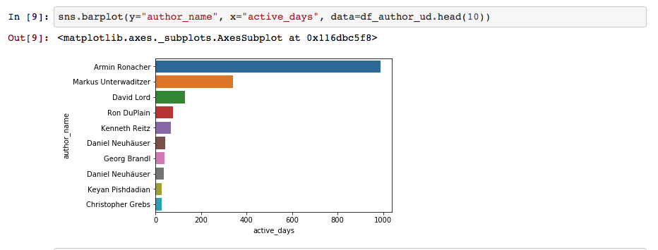
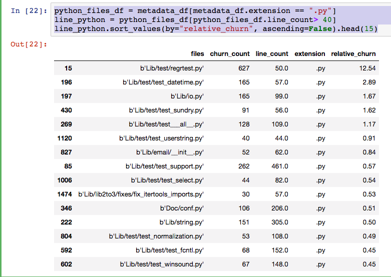
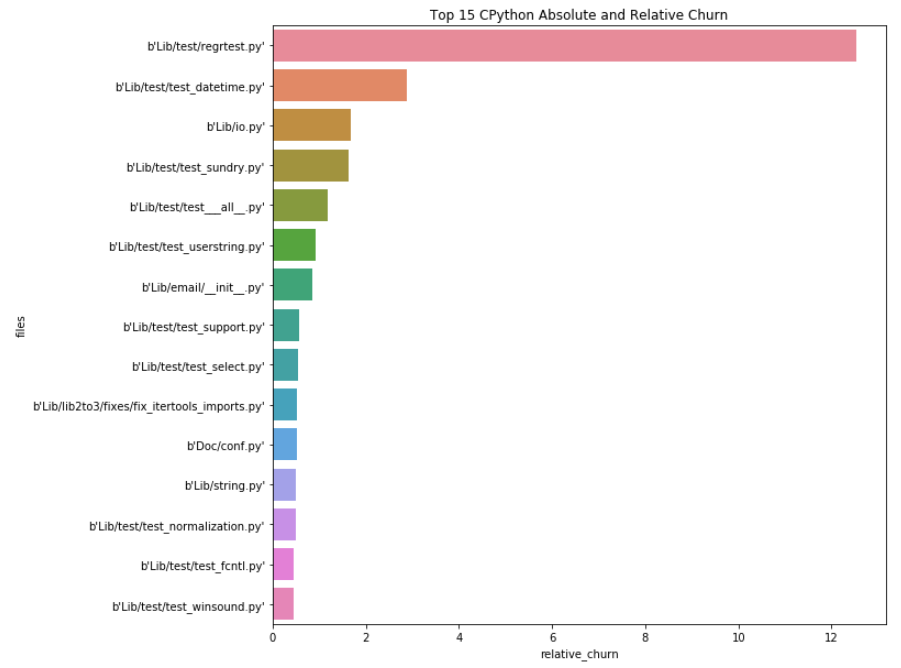
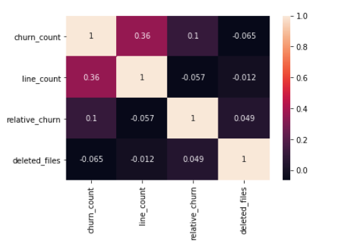
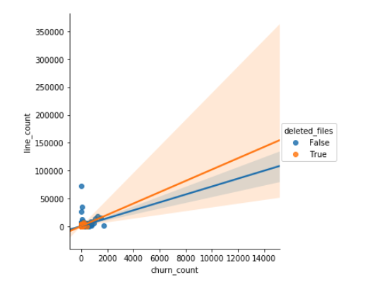

# 通过 Jupyter Notebook 探索您的项目并将它部署到 Python Package Index
使用 Jupyter Notebook 探索软件项目的许多方面，并学习如何将项目部署到 Python 包索引中

**标签:** Python,分析

[原文链接](https://developer.ibm.com/zh/articles/ba-github-analytics-2/)

Noah Gift

发布: 2017-12-13

* * *

在本系列 [第 1 部分](https://www.ibm.com/developerworks/cn/opensource/ba-github-analytics-1/index.html) 中，您创建了一个数据科学项目的基本结构，并通过编程从 GitHub 下载数据，转换数据，以便能够使用 pandas 对数据进行统计分析。在第 2 部分中，您将使用 Jupyter Notebook 探索软件项目的许多方面，学习如何将项目作为库和命令行工具部署到 Python Package Index。

## 使用 Jupyter Notebook 探索一个 GitHub 组织

在接下来的几节中，我将解释如何使用 Jupyter Notebook 分析并评估一个 GitHub 组织的开发团队。

### Pallets 项目分析

我在 [第 1 部分](https://www.ibm.com/developerworks/cn/analytics/library/ba-github-analytics-1/index.html) 中已经指出，分析单个存储库的一个问题是，该存储库只是数据的 _一部分_ 。第 1 部分中创建的代码使您能够克隆整个组织（及其所有存储库）并分析它。

GitHub 组织的一个示例就是著名的 Pallets 项目，该项目包含多个项目，比如 Click 和 Flask。以下步骤将详细介绍如何在 Pallets 项目上执行 Jupyter [Notebook 分析](https://github.com/noahgift/devml/blob/master/notebooks/github_data_exploration.ipynb) 。

1. 要从命令行启动 Jupyter，请输入 `jupyter notebook` 。然后，导入您要使用的库：


    ```
        In [3]: import sys;sys.path.append("..")
           ...: import pandas as pd
           ...: from pandas import DataFrame
           ...: import seaborn as sns
           ...: import matplotlib.pyplot as plt
           ...: from sklearn.cluster import KMeans
           ...: %matplotlib inline
           ...: from IPython.core.display import display, HTML
           ...: display(HTML("<style>.container { width:100% !important; }</style>"))

    ```


    Show moreShow more icon

2. 接下来，运行以下代码来下载该组织：


    ```
        In [4]: from devml import (mkdata, stats, state, fetch_repo, ts)
        In [5]: dest, token, org = state.get_project_metadata("../project/config.json")
        In [6]: fetch_repo.clone_org_repos(token, org,
           ...:         dest, branch="master")
        Out[6]:
        [<git.Repo "/tmp/checkout/flask/.git">,
         <git.Repo "/tmp/checkout/pallets-sphinx-themes/.git">,
         <git.Repo "/tmp/checkout/markupsafe/.git">,
         <git.Repo "/tmp/checkout/jinja/.git">,
         <git.Repo "/tmp/checkout/werkzeug/.git">,
         <git.Repo "/tmp/checkout/itsdangerous/.git">,
         <git.Repo "/tmp/checkout/flask-website/.git">,
         <git.Repo "/tmp/checkout/click/.git">,
         <git.Repo "/tmp/checkout/flask-snippets/.git">,
         <git.Repo "/tmp/checkout/flask-docs/.git">,
         <git.Repo "/tmp/checkout/flask-ext-migrate/.git">,
         <git.Repo "/tmp/checkout/pocoo-sphinx-themes/.git">,
         <git.Repo "/tmp/checkout/website/.git">,
         <git.Repo "/tmp/checkout/meta/.git">]

    ```


    Show moreShow more icon

3. 代码位于磁盘上后，将它转换为 pandas DataFrame：


    ```
        In [7]: df = mkdata.create_org_df(path="/tmp/checkout")
        In [9]: df.describe()
        Out[9]:
               commits
        count   8315.0
        mean       1.0
        std        0.0
        min        1.0
        25%        1.0
        50%        1.0
        75%        1.0
        max        1.0

    ```


    Show moreShow more icon

4. 计算活跃天数：


    ```
        In [10]: df_author_ud = stats.author_unique_active_days(df)
            ...:
        In [11]: df_author_ud.head(10)
        Out[11]:
                      author_name  active_days active_duration  active_ratio
        86         Armin Ronacher          941       3817 days          0.25
        499  Markus Unterwaditzer          238       1767 days          0.13
        216            David Lord           94        710 days          0.13
        663           Ron DuPlain           56        854 days          0.07
        297          Georg Brandl           41       1337 days          0.03
        196     Daniel Neuhäuser           36        435 days          0.08
        169     Christopher Grebs           27       1515 days          0.02
        665    Ronny Pfannschmidt           23       2913 days          0.01
        448      Keyan Pishdadian           21        882 days          0.02
        712           Simon Sapin           21        793 days          0.03

    ```


    Show moreShow more icon

5. 使用 `sns.barplot` 创建一个 seaborn 图，以便按照贡献者在项目中活跃的天数（即实际签入代码的天数）来标绘出组织的 10 大贡献者。毫不奇怪，许多项目的主要作者的活跃时间接近其他任何贡献者的 3 倍。


    ##### 图 1.Seaborn 活跃天数图


    


可以为公司中所有存储库内的闭源项目推断出类似的观察结果。“活跃天数”是一个显示参与情况的有用指标，它是众多用来衡量团队和项目效益的指标之一。

> 来自此查询的一个观察结果是，测试存在着不少改动，这些改动可能值得进一步探索。这是否意味着测试本身也包含错误？

### CPython 项目分析

接下来，让我们来看一个 [Jupyter Notebook](https://github.com/noahgift/devml/blob/master/notebooks/repo_file_exploration.ipynb) ，它展示了对 [CPython 项目](https://github.com/python/cpython) （用于开发 Python 语言的存储库）的元数据的探索。

#### 相对改动

生成的一个指标称为”相对改动”。（请参阅”相关主题”，查看来自 Microsoft Research 的一篇有关此指标的文章。）基本上讲，相对改动原则表明，相对代码改动的增加会导致系统缺陷密度增加。换句话说，在文件中执行太多更改会导致缺陷。

1. 与之前一样，导入剩余探索工作所需的模块：


    ```
        In [1]: import sys;sys.path.append("..")
           ...: import pandas as pd
           ...: from pandas import DataFrame
           ...: import seaborn as sns
           ...: import matplotlib.pyplot as plt
           ...: from sklearn.cluster import KMeans
           ...: %matplotlib inline
           ...: from IPython.core.display import display, HTML
           ...: display(HTML("<style>.container { width:100% !important; }</style>"))

    ```


    Show moreShow more icon

2. 生成改动指标：


    ```
          In [2]: from devml.post_processing import (git_churn_df, file_len, git_populate_file_metatdata)
          In [3]: df = git_churn_df(path="/Users/noahgift/src/cpython")
          2017-10-23 06:51:00,256 - devml.post_processing - INFO - Running churn cmd: [git log --name-only --pretty=format:] at path [/Users/noahgift/src/cpython]
          In [4]: df.head()
          Out[4]:
                                                         files  churn_count
          0                         b'Lib/test/test_struct.py'          178
          1                      b'Lib/test/test_zipimport.py'           78
          2                           b'Misc/NEWS.d/next/Core'          351
          3                                             b'and'          351
          4  b'Builtins/2017-10-13-20-01-47.bpo-31781.cXE9S...            1

    ```


    Show moreShow more icon

3. 然后可以使用 pandas 中的一些过滤器来确定相对改动最多的具有 Python 扩展名的文件。参见 [图 2.相对改动最多的 CPython.py 文件](#图-2-相对改动最多的-cpython-py-文件) 中的输出。


    ```
        In [14]: metadata_df = git_populate_file_metatdata(df)
        In [15]: python_files_df = metadata_df[metadata_df.extension == ".py"]
            ...: line_python = python_files_df[python_files_df.line_count> 40]
            ...: line_python.sort_values(by="relative_churn", ascending=False).head(15)
            ...:

    ```


    Show moreShow more icon


    ##### 图 2.相对改动最多的 CPython.py 文件


    

    来自此查询的一个观察结果是，测试存在着不少改动，这些改动可能值得进一步探索。这是否意味着测试本身也包含错误？这可能需要更具体的探索。另外，有两个 Python 模块具有非常多的相对改动，比如 string.py 模块。查看该文件的 [源代码](https://github.com/python/cpython/blob/master/Lib/string.py) ，它从大小上看非常复杂，而且包含元类。可能这一复杂性导致它容易出错。这看起来像一个值得进一步执行数据科学探索的模块。

4. 接下来，可以运行一些描述性统计来查找整个项目的中间值。这些统计数据表明，在该项目运行 20 年来的 100,000 多次提交中，一个中间文件约为 146 行，更改次数为 5 次，它的相对改动率为 10%。从该统计数据中得出的结论是，这是要创建的文件的理想类型：非常小巧，而且多年来更改较少。


    ```
        In [16]: metadata_df.median()
        Out[16]:
        churn_count         5.0
        line_count        146.0
        relative_churn      0.1
        dtype: float64

    ```


    Show moreShow more icon

5. 为相对改动生成一个 seaborn 图，让模式更加清晰：


    ```
        In [18]: import matplotlib.pyplot as plt
            ...: plt.figure(figsize=(10,10))
            ...: python_files_df = metadata_df[metadata_df.extension == ".py"]
            ...: line_python = python_files_df[python_files_df.line_count> 40]
            ...: line_python_sorted = line_python.sort_values(by="relative_churn", ascending=False).head(15)
            ...: sns.barplot(y="files", x="relative_churn",data=line_python_sorted)
            ...: plt.title('Top 15 CPython Absolute and Relative Churn')
            ...: plt.show()

    ```


    Show moreShow more icon

    在 [图 3.相对改动最多的 CPython .py 文件](#图-3-相对改动最多的-cpython-py-文件) 中， [regrtest.py](https://github.com/python/cpython/blob/master/Lib/test/regrtest.py) 模块非常醒目，是改动最多的文件。同样地，有必要弄清楚为什么对它的改动如此之多。尽管它是个小文件，但回归测试通常非常复杂。这也可能是代码中的一个需要分析的热点。


##### 图 3.相对改动最多的 CPython .py 文件



#### 删除的文件

另一个探索区域是在项目的整个历史中删除的文件。可以从该探索中得出许多研究方向，比如预测某个文件以后是否会被删除（例如，如果相对改动太多）。

1. 要查看删除的文件，可以在 [post\_processing 目录](https://github.com/noahgift/devml/blob/master/devml/post_processing.py) 中创建另一个函数：


    ```
        FILES_DELETED_CMD=\
            'git log --diff-filter=D --summary | grep delete'
        def files_deleted_match(output):
            """Retrieves files from output from subprocess
            i.e:
            wcase/templates/hello.html\n delete mode 100644
            Throws away everything but path to file
            """
            files = []
            integers_match_pattern = '^[-+]?[0-9]+$'
            for line in output.split():
                if line == b"delete":
                    continue
                elif line == b"mode":
                    continue
                elif re.match(integers_match_pattern, line.decode("utf-8")):
                    continue
                else:
                    files.append(line)
            return files

    ```


    Show moreShow more icon

     此函数在 git 日志中查找删除消息，执行某种模式匹配，将这些文件提取到一个列表中，以便创建一个 pandas DataFrame。

2. 接下来，在一个 Jupyter Notebook 中使用该函数：


    ```
        In [19]: from devml.post_processing import git_deleted_files
            ...: deletion_counts =
        git_deleted_files("/Users/noahgift/src/cpython")

    ```


    Show moreShow more icon

    要检查一些已删除的文件，可以查看最后几条记录：


    ```
    In [21]: deletion_counts.tail()
    Out[21]:
                               files     ext
    8812  b'Mac/mwerks/mwerksglue.c'      .c
    8813        b'Modules/version.c'      .c
    8814      b'Modules/Setup.irix5'  .irix5
    8815      b'Modules/Setup.guido'  .guido
    8816      b'Modules/Setup.minix'  .minix

    ```


    Show moreShow more icon

3. 观察在删除的文件与保留的文件之间是否出现了某种模式。为此，连接删除的文件的 DataFrame：


    ```
        In [22]: all_files = metadata_df['files']
            ...: deleted_files = deletion_counts['files']
            ...: membership = all_files.isin(deleted_files)
            ...:
        In [23]: metadata_df["deleted_files"] = membership
        In [24]: metadata_df.loc[metadata_df["deleted_files"] == True].median()
        Out[24]:
        churn_count        4.000
        line_count        91.500
        relative_churn     0.145
        deleted_files      1.000
        dtype: float64

        In [25]: metadata_df.loc[metadata_df["deleted_files"] == False].median()
        Out[25]:
        churn_count         9.0
        line_count        149.0
        relative_churn      0.1
        deleted_files       0.0
        dtype: float64

    ```


    Show moreShow more icon

    通过查看删除的文件与仍在存储库中的文件相比较的中间值，您会发现存在一些差异。大体上讲，删除的文件的相对改动次数更多。或许删除的是存在问题的文件？这一点在进一步调查后才能知道。

4. 接下来，在这个 DataFrame 上的 seaborn 中创建一个相关性热力图：


    ```
        In [26]: sns.heatmap(metadata_df.corr(), annot=True)

    ```


    Show moreShow more icon

    图 4 表明相对改动与删除的文件之间存在一种非常微小的正相关关系。可以在机器学习模型中包含此信号来预测删除一个文件的可能性。


    ##### 图 4.删除的文件的相关性热力图


    

5. 接下来，一个最终的散点图显示了删除的文件与留在存储库中的文件之间的一些差异：


    ```
        In [27]: sns.lmplot(x="churn_count", y="line_count", hue="deleted_files", data=metadata_df)

    ```


    Show moreShow more icon

    图 5 显示了 3 个维度：文件的行数、改动次数和 deleted\_file 的 True/False 类别。


    ##### 图 5.包含行数和改动次数的散点图


    


## 将项目部署到 Python Package Index

执行了创建库和命令行工具的所有艰苦工作后，可以通过将项目提交到 Python Package Index 与他人分享。只需几步就能完成此任务：

1. 在 [https://pypi.python.org/pypi](https://pypi.python.org/pypi) 上创建一个帐户。
2. 安装 twine：

    `pip install twine`

3. 创建一个 [setup.py 文件](https://github.com/noahgift/devml/blob/master/setup.py) 。

    最重要的两部分是 `packages` 部分和 `scripts` 部分，前者确保库已安装。 `scripts` 部分包含我们在全文中使用的 dml 脚本。


    ```
        import sys
        if sys.version_info < (3,6):
            sys.exit('Sorry, Python < 3.6 is not supported')
        import os
        from setuptools import setup
        from devml import __version__
        if os.path.exists('README.rst'):
            LONG = open('README.rst').read()
        setup(
            name='devml',
            version=__version__,
            url='https://github.com/noahgift/devml',
            license='MIT',
            author='Noah Gift',
            author_email='consulting@noahgift.com',
            description="""Machine Learning, Statistics and Utilities around Developer Productivity,
                Company Productivity and Project Productivity""",
            long_description=LONG,
            packages=['devml'],
            include_package_data=True,
            zip_safe=False,
            platforms='any',
            install_requires=[
                'pandas',
                'click',
                'PyGithub',
                'gitpython',
                'sensible',
                'scipy',
                'numpy',
            ],
            classifiers=[
                'Development Status :: 4 - Beta',
                'Intended Audience :: Developers',
                'License :: OSI Approved :: MIT License',
                'Programming Language :: Python',
                'Programming Language :: Python :: 3.6',
                'Topic :: Software Development :: Libraries :: Python Modules'
            ],
            scripts=["dml"],
        )

    ```


    Show moreShow more icon

    然后， `scripts` 指令将 dml 工具安装到所有通过 `pip` 安装该模块的用户的路径中。

4. 向 [Makefile](https://github.com/noahgift/devml/blob/master/Makefile) 添加一个 `deploy` 步骤：


    ```
        deploy-pypi:
            pandoc --from=markdown --to=rst README.md -o README.rst
            python setup.py check --restructuredtext --strict --metadata
            rm -rf dist
            python setup.py sdist
            twine upload dist/*
            rm -f README.rst

    ```


    Show moreShow more icon

5. 最后，执行部署：


    ```
        (.devml) ➜  devml git:(master) ✗ make deploy-pypi
        pandoc --from=markdown --to=rst README.md -o README.rst
        python setup.py check --restructuredtext --strict --metadata
        running check
        rm -rf dist
        python setup.py sdist
        running sdist
        running egg_info
        writing devml.egg-info/PKG-INFO
        writing dependency_links to devml.egg-info/dependency_links.txt
        ....
        running check
        creating devml-0.5.1
        creating devml-0.5.1/devml
        creating devml-0.5.1/devml.egg-info
        copying files to devml-0.5.1...
        ....
        Writing devml-0.5.1/setup.cfg
        creating dist
        Creating tar archive
        removing 'devml-0.5.1' (and everything under it)
        twine upload dist/*
        Uploading distributions to https://upload.pypi.org/legacy/
        Enter your username:

    ```


    Show moreShow more icon


## 结束语

本系列的 [第 1 部分](https://www.ibm.com/developerworks/cn/analytics/library/ba-github-analytics-1/index.html) 展示了如何创建一个基本的数据科学框架并介绍了它的各个部分。第 2 部分使用 Jupyter Notebook 和第 1 部分中构建的代码进行了深入的数据探索。 您还学习了如何将项目部署到 Python Package Index。

对于其他数据科学开发人员而言，在构建作为 Python 库和命令行工具交付的解决方案时，本文应是一个值得他们学习的良好基础部分。

本文翻译自： [Explore your project with Jupyter Notebooks and deploy it to the Python Package index](https://developer.ibm.com/articles/ba-github-analytics-2/)（2017-12-13）