# 通过 Kubernetes 和容器实现 DevOps
打通开发运维的壁垒，实现开发运维一体化

**标签:** 云计算

[原文链接](https://developer.ibm.com/zh/articles/cl-lo-devops-via-kubernetes-and-containers/)

魏 新宇

发布: 2018-12-12

* * *

近两年，随着容器、Kubernetes 等技术的兴起，DevOps 这个概念被广泛提及并被大量使用。 本文将会从以下几个方面着手，结合实验展现的方式，让读者真正理解 DevOps 的含义。

- DevOps 产生的背景
- DevOps 与容器、Kubernetes 之间的关系
- DevOps 的技术实现方式

## DevOps 是什么

DevOps 中的 Dev 指的 Development，Ops 指的是的 Operations，用一句话来说 DevOps 就是打通开发运维的壁垒，实现开发运维一体化。

### 从瀑布式开发到敏捷开发

谈到 DevOps 的发展史，我们需要先谈一下敏捷开发。

首先，敏捷开发是面向软件的，而软件依赖于计算硬件。我们知道，世界上第一台计算机是在 1946 年出现的。因此，软件开发相对于人类历史而言，时间并不长。相对于软件开发方法论的掌握，人们更擅长于工程学，如盖楼、造桥等。为了推动软件开发，1968 年，人们将工程学的方法应用到软件领域，由此产生了软件工程。

软件工程的方式有其优点，但带来了不少问题。最关键一点是：软件不同于工程。通过工程学建造的大桥、高楼在竣工后，人们通常不会对大桥高楼的主体有大量使用需求的变更；但软件却不同。对于面向最终用户的软件，人们对于软件功能的需求是会不断变化的。在瀑布式开发的模式下，当客户对应用有变化的需求时，软件厂商得重新开发软件。这将会使企业的竞争力大幅下降。

传统的软件开发流程是：产品经理收集一线业务部门和客户的需求，这些需求可能是新功能需求，也可能是对产品现有功能做变更的需求。然后进行评估、分析，将这些需求制定为产品的路线图，并且分配相应的资源进行相关工作。接下来，产品经理将需求输出给开发部门，开发工程师写代码。写好以后，就由不同的部门的人员进行后续的代码构建、质量检验、集成测试、用户验收测试，最后给生产部门。这样带来的问题是，开发周期比较长，并且如果有任何变更，都要重新走一遍开发流程，在商场如战场的今天，软件一个版本推迟发布，可能到发布时这个版本在市场上就已经过时了；而竞争对手很可能由于在新软件发布上快了一步，而迅速抢占了客户和市场。

正是由于商业环境的压力，软件厂商需要改进开发方式。

2001 年初，在美国滑雪胜地 snowbird，17 位专家聚集在一起，概括了一些可以让软件开发团队更具有快速工作、相应变化的能力的价值观原则。他们称自己为”敏捷联盟”。

敏捷开发的主要价值观如下：

##### 表 1\. 敏捷开发的核心价值观

个体和互动高于流程和文档工作的软件高于详尽的文档客户合作高于合同谈判相应变化高于遵循计划

有了敏捷联盟，有了敏捷开发价值观，必然会产生开发的流派。主要的敏捷开发流派有：极限编程（XP）、Scrum、水晶方法等。

至此，敏捷开发有理念、有方法、有实践。随着云计算概念的兴起，云计算的不断落地，敏捷开发不仅实现了工具化，也得到了升华。

### 从敏捷开发到 DevOps

谈到了敏捷开发，那么敏捷开发和 DevOps 有什么关系呢？

敏捷开发是开发域里的概念，在敏捷开发基础之上，有如下阶段：

**敏捷开发->持续集成->持续交付->持续部署->DevOps**

从敏捷开发到 DevOps，前一个阶段都是后一个阶段的基础；随着阶段的推进，每个阶段概念覆盖的流程越来越多；最终 DevOps 涵盖了整个开发和运维阶段。正式由于每个阶段涉及的范围不同，因此所以每个概念所提供的工具也是不一样的。具体内容我们参照下图：

##### 图 1\. 从敏捷开发到 DevOps 的进阶

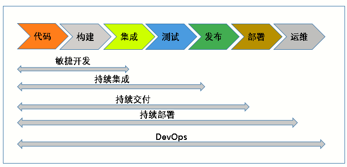

**持续集成（Continuous Integration）** 指的是：代码集成到主干之前，必须全部通过自动化测试；只要有一个测试用例失败，就不能集成。持续集成的要实现的目标是：在保持高质量的基础上，让产品可以快速迭代。

**持续交付（Continuous Delivery）** 指的是：开发人员频繁地将软件的新版本，交付给质量团队或者用户，以供评审。如果评审通过，代码就被发布。如果评审不通过，那么需要开发进行变更后再提交。

**持续部署（Continuous Deployment）** 指的是：代码通过评审并发布后，自动部署，以交付使用。

**DevOps** 是一组完整的实践，可以自动化软件开发和 IT 团队之间的流程，以便他们可以更快、更可靠地构建、测试和发布软件。

##### 图 2\. DevOps 示意图


## DevOps 的技术实现

DevOps 的技术实现，需要三个方面：标准交付物、容器调度平台、DevOps 工具链。接下来，我们详细看一下这个三个方面的内容。

### DevOps 的技术实现 1：标准交付物

DevOps 的目的在于让开发和运维一体化、让开发和运维相互之间的沟通更加顺畅、迅捷，从而使企业更能适应市场的变化。

当然，真正实现开发运维一体化，并非只是让开发和运维的人坐在一起那么简单。从技术角度，DevOps 首先需要有一个包含了”操作系统+Runtime+应用”的标准交付物。除此之外，还需要通过整个 DevOps 流程来打通。

在 IT 早期，厂商硬件和系统平台的差异化过大，在不同硬件和系统平台进行应用的无缝迁移几乎是不可想象的。随着 X86 服务器以及 vSphere 等虚拟化技术的普及，操作系统（包括操作系统上的应用）可以在不同 X86 服务器厂商的硬件平台上在线无缝迁移。硬件差异化不断缩小甚至消失，软件的重要性不断提升，IT 界真正进入软件定义一切的时代。在这个背景下，业务提出了更高的要求，如何将应用在不同操作系统之间实现无缝迁移，将开发和生产统一，做到”构建一次，到处运行”。

容器技术的概念最初出现在 2000 年，当时称为 FreeBSD jail，这种技术可将 FreeBSD 系统分区为多个子系统。

但直到 Docker 的出现（2008 年），容器才真正具备了较好的可操作性和实用性。因为 Docker 提供了容器的镜像构建、打包等技术，使容器具备了一次打包，到处运行的能力。

对于客户而言，Docker 只能在一个 Linux 上运行，是”单机版”，很难符合企业对高可用的需求。此外，docker 也缺乏和持久存储、虚拟网络相关的功能。

### DevOps 的技术实现 2：容器调度平台

2014 年 Kubernetes 的出现，奠定了今天容器调度平台的事实标准的基础。

因为通过 Kubernetes，我们不仅实现了容器在多个计算节点上的统一调度，还可以将容器对接持久存储、对接虚拟网络等。换句话说，Kubernetes 使容器具备企业级的功能。

##### 图 3\. Kubernetes 架构

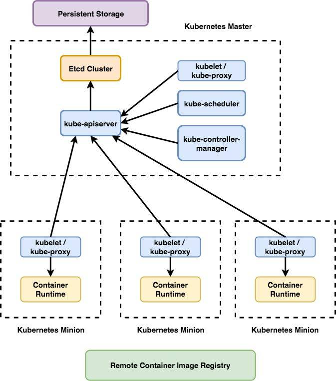

### DevOps 的技术实现 3：DevOps 工具链

在有了容器和 Kubernetes 以后，我们还需要相关的 DevOps 工具链。

目前在 IT 界，DevOps 相关的工具很多，其中大多数是开源的工具，如下图。

##### 图 4\. DevOps 工具链

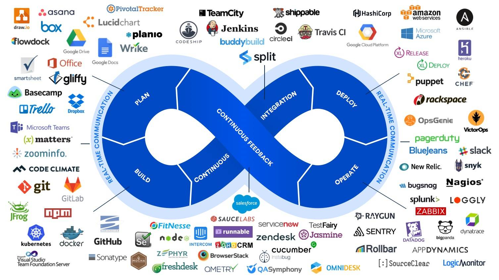

在后面的文章中，我们会选择几种常用的 DevOps 工具，然后进行试验展现。

### 总结：DevOps 与容器和 Kubernetes 的关系

PaaS、DevOps 的概念，在容器和 Kubernetes 普及之前就存在了。广义上的 PaaS、DevOps 的建设，会包含：人、流程、工具等多方面内容。IT 厂商提供的 PaaS、DevOps 以指工具层面的落地为主、以流程咨询为辅。

在 Kubernetes 和容器普及之前，我们通过虚拟机也可以实现 PaaS、CI/CD，只是相对速度较慢，因此普及性不高（想象一下通过 X86 虚拟化来实现中间件集群弹性伸缩的效率）。而正是容器的出现，为 PaaS、DevOps 工具层面的落地提供非常好的承载平台，使得这两年容器云风生水起。这就好比 4G（2014 年出现）和微信（2011 年出现）之间的关系：在手机网速 3G 时代，流量按照兆收费的时候，（即使有）大家对于微信语音聊天、微信视频也不会太感兴趣。

所以说， Docker 使容器具备了较好的可操作性、可移植性，Kubernetes 使容器具备企业级使用的条件。而 IT 界众多基于 Kubernetes 和 Docker 企业级的容器平台，又成为了 Devops 工具落地的新一代基础架构。

## DevOps 工作流展示

### 常用 DevOps 工具介绍

- Kubernetes 集群：包含 Docker 和 Kubernetes。
- Gogs: 通过 Go 编写的本地代码仓库，功能与 github 类似。
- Jenkins/Jenkins Slave Pods：持续集成工具。
- Nexus :工件管理器，能够解决本地缓存构建依赖项。
- SonarQube：开源代码分析工具，它可以分析常见编程错误的源代码。

以上的 DevOps 工具，都可以以容器方式部署到 Kubernetes 集群中。在实验环境中，有一个两个节点的 Kubernetes 集群，用于进行实验展现。

##### 图 5\. Kubernetes 集群


在 Kubernetes 集群中创建三个 Namespace：cicd、dev、stage。其中 cicd Namespace 存放的是 DevOps 相关工具链。dev、stage 是模拟开发和生产两个环境。

##### 图 6\. Kubernetes 集群的 Namespaces

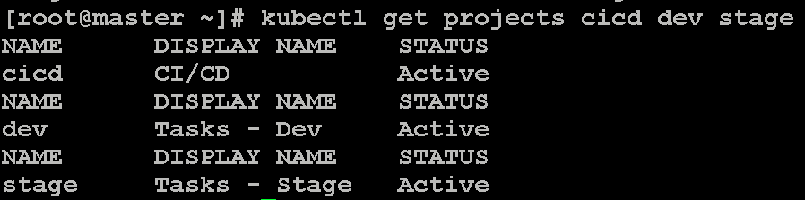

接下来，我们看一下在 cicd Namespace 中部署的 DevOps 工具链：

##### 图 7\. Kubernetes 集群中部署的 DevOps 工具

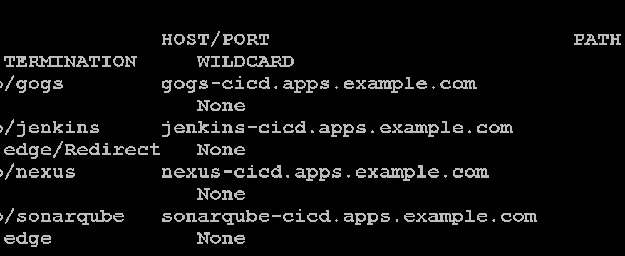

在工具链部署成功以后，我们分别登录工具的 UI 界面进行查看。

我们首先查看代码仓库 Gogs 中的源代码：

##### 图 8\. Gogs 中的源码

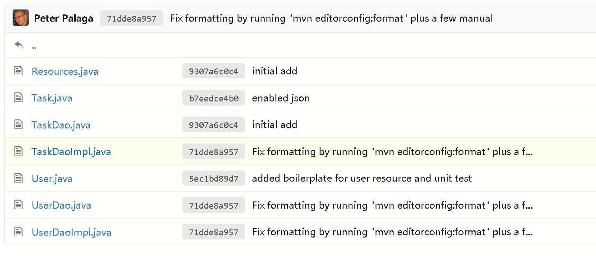

接下来，我们登录 Jenkins（后续的主要操作将会基于 Jenkins）：

##### 图 9\. Jenkins 界面

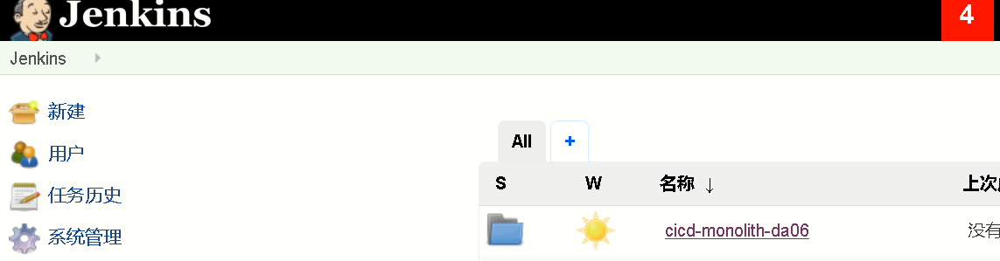

Nexus 用于存放构建成功、并经过 Code Review 的 war 包，我们查看 Nexus 的界面：

##### 图 10\. Nexus 界面

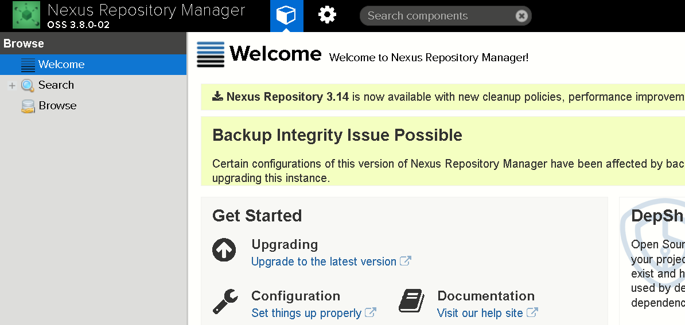

SonarQube 负责 Code review：

##### 图 11\. SonarQube 界面

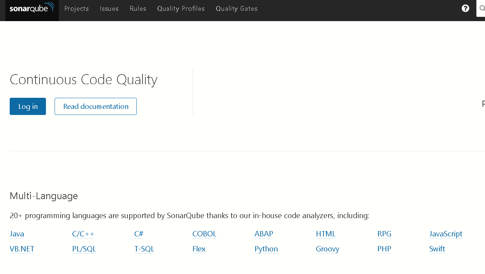

### Jenkins Pipeline 工作流分析

整个 Devops 的流程，通过 Jenkins 的 Pipeline 串接起来。在 Jenkins 中，我们可以通过编写 Jenkins File，或者通过 Jenkins 浏览器页面的操作来完成 Pipeline 的定制。两者的实现效果是一样的，本文以书写 Jenkins File 方式展现。通过一个 Jenkins File，打通整个 DevOps 流程。

我们查看 Jenkins File 的内容并进行解释。

第一步，从 Gogs 拉取源代码，然后调用 maven 进行代码编译：

##### 清单 1\. Pipeline 第一阶段

```
pipeline {
agent {
    label 'maven'
}
stages {
    stage('Build App') {
      steps {
        git branch: 'eap-7', url: 'http://gogs:3000/gogs/openshift-tasks.git'
        script {
            def pom = readMavenPom file: 'pom.xml'
            version = pom.version
        }
        sh "${mvnCmd} install -DskipTests=true"
      }
    }
}
}

```

Show moreShow more icon

第二步，构建成功以后，调用 mvn 进行测试。

##### 清单 2\. Pipeline 第二阶段

```
stage('Test') {
steps {
    sh "${mvnCmd} test"
    step([$class: 'JUnitResultArchiver', testResults: '**/target/surefire-reports/TEST-*.xml'])
}
}

```

Show moreShow more icon

第三步，调用 SonarQube 进行代码 review。

##### 清单 3\. Pipeline 第三阶段

```
stage('Code Analysis') {
steps {
    script {
      sh "${mvnCmd} sonar:sonar -Dsonar.host.url=http://sonarqube:9000 -DskipTests=true"
    }
}
}

```

Show moreShow more icon

第四步，将测试成功的代码存档到 Nexus:

##### 清单 4\. Pipeline 第四阶段

```
stage('Archive App') {
steps {
    sh "${mvnCmd} deploy -DskipTests=true -P nexus3"
}
}

```

Show moreShow more icon

第五步，Pipeline 会将构建成功的 war 包，以二进制的方式注入到 JBoss EAP 的 docker image 中。

##### 清单 5\. Pipeline 第五阶段

```
stage('Build Image') {
    steps {
      sh "rm -rf oc-build && mkdir -p oc-build/deployments"
      sh "cp target/tasks.war oc-build/deployments/ROOT.war"
    }
}

```

Show moreShow more icon

接下来，Pileline 先将这个 docker image 部署到 dev 环境，然后引入审批工作流，批准后部署到生产。

##### 清单 6\. Pipeline 中的审批流

```
stage('Promote to STAGE?') {
      steps {
        timeout(time:15, unit:'MINUTES') {
            input message: "Promote to STAGE?", ok: "Promote"
        }
      }
}

```

Show moreShow more icon

### DevOps 工具链演示

首先，登录到 Jenkins 上，查看已经创建好的 Pipeline。

##### 图 12\. Jenkins 的 Pipeline

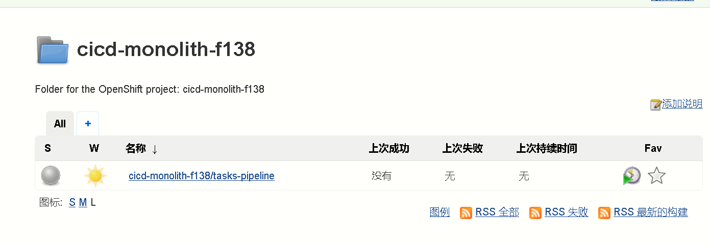

点击”开始构建”，触发工作流（工作流也可以通过提交代码自动触发）：

##### 图 13\. 触发工作流

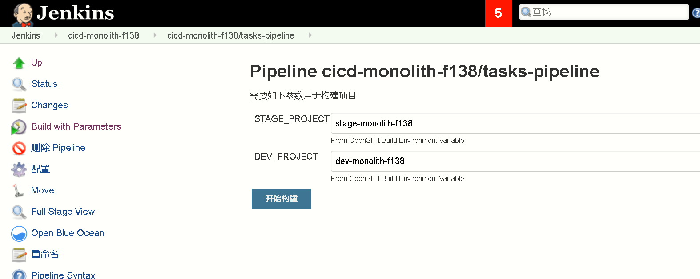

Pipeline 的第一个阶段是 Build App。

##### 图 14\. 工作流第一个阶段

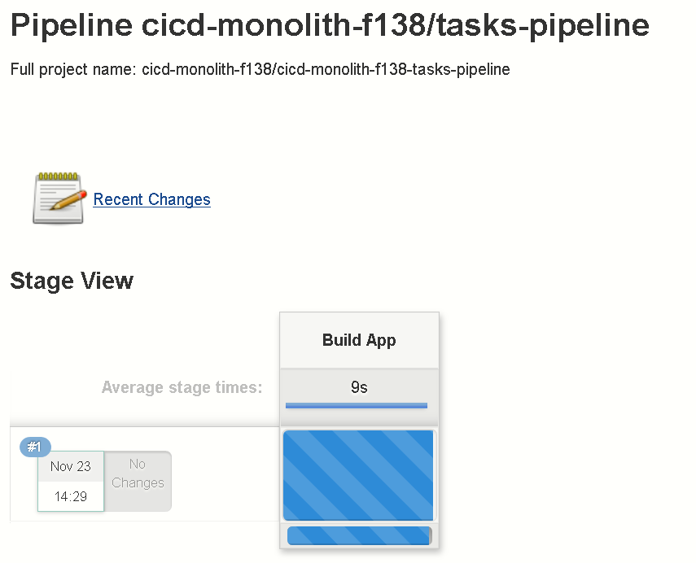

Build App 成功的 logs 如下，我们可以看到生成了 war 包：

##### 清单 7\. 构建应用成功的日志

```
[INFO] Installing /tmp/workspace/cicd-monolith-f138/cicd-monolith-f138-tasks-pipeline/target/tasks.war to /home/jenkins/.m2/repository/org/jboss/quickstarts/eap/jboss-tasks-rs/7.0.0-SNAPSHOT/jboss-tasks-rs-7.0.0-SNAPSHOT.war
[INFO] Installing /tmp/workspace/cicd-monolith-f138/cicd-monolith-f138-tasks-pipeline/pom.xml to /home/jenkins/.m2/repository/org/jboss/quickstarts/eap/jboss-tasks-rs/7.0.0-SNAPSHOT/jboss-tasks-rs-7.0.0-SNAPSHOT.pom

```

Show moreShow more icon

Pipeline 继续执行，在 Test 成功以后，开始进行 Code Analysis：

##### 图 15\. 工作流阶段 2-3

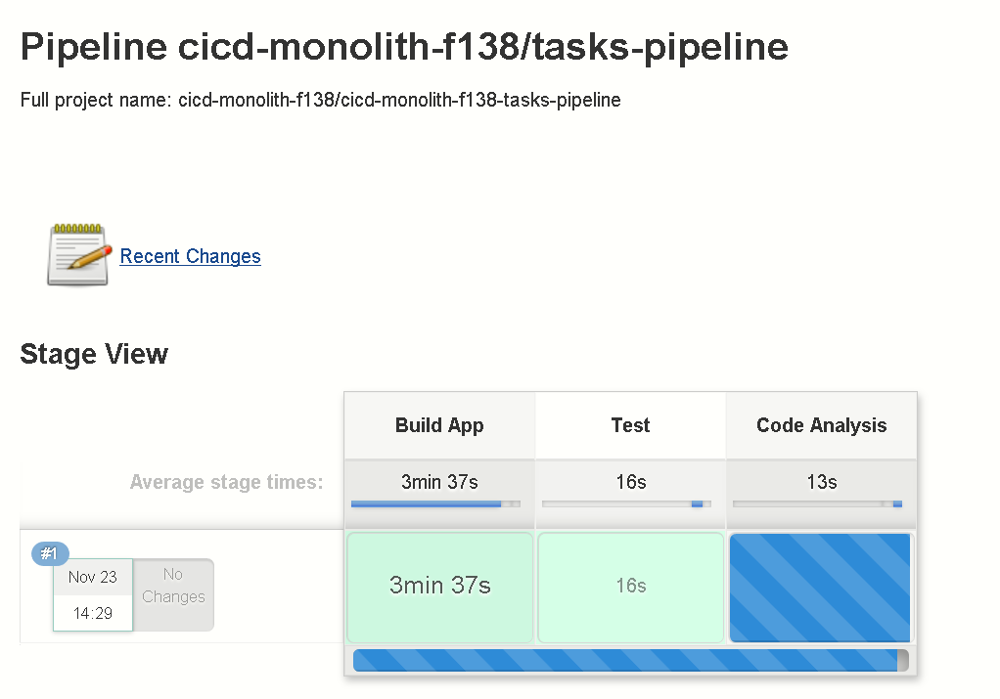

Test 阶段执行成功的 log：

##### 清单 8\. 测试成功的日志

```
-------------------------------------------------------
T E S T S
-------------------------------------------------------
Running org.jboss.as.quickstarts.tasksrs.service.UserResourceTest
Tests run: 1, Failures: 0, Errors: 0, Skipped: 1, Time elapsed: 1.798 sec - in org.jboss.as.quickstarts.tasksrs.service.UserResourceTest
Running org.jboss.as.quickstarts.tasksrs.service.TaskResourceTest
Tests run: 3, Failures: 0, Errors: 0, Skipped: 0, Time elapsed: 0.604 sec - in org.jboss.as.quickstarts.tasksrs.service.TaskResourceTest

Results :

Tests run: 4, Failures: 0, Errors: 0, Skipped: 1

```

Show moreShow more icon

Code Analysis 阶段执行成功的日志，我们看到日志显示代码分析成功，并建议通过浏览器访问 SonarQube：

##### 清单 9\. 代码分析成功的日志

```
[INFO] ANALYSIS SUCCESSFUL, you can browse http://sonarqube:9000/dashboard/index/org.jboss.quickstarts.eap:jboss-tasks-rs
[INFO] Note that you will be able to access the updated dashboard once the server has processed the submitted analysis report
[INFO] More about the report processing at http://sonarqube:9000/api/ce/task?id=AWc_R_EGIPI_jn5vc3mt
[INFO] Task total time: 18.918 s

```

Show moreShow more icon

我们登录 SonarQube，查看结果：

##### 图 16\. SonarQube 执行结果

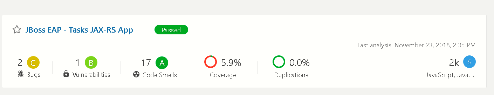

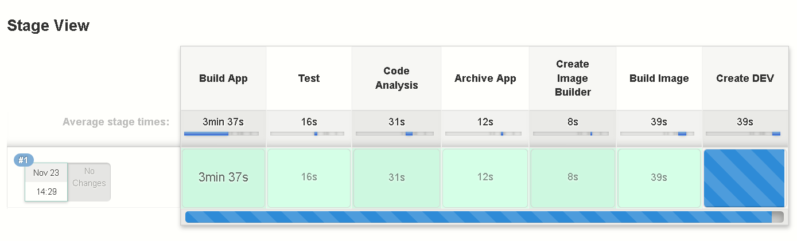

接下来，Pilepine 进入到 Create Image Builder 阶段，其关键的步骤是将构建成功的 war 包以二进制的方式注入到 docker image 中：

##### 清单 10\. 构建镜像的日志

```
[cicd-monolith-f138-tasks-pipeline] Running shell script
+ rm -rf oc-build
+ mkdir -p oc-build/deployments
[Pipeline] sh
[cicd-monolith-f138-tasks-pipeline] Running shell script
+ cp target/tasks.war oc-build/deployments/ROOT.war

```

Show moreShow more icon

Create Image Builder 执行成功以后，会生成包含应用的 docker image。接下来是 Create Dev 和 Deploy Dev，即在 dev 环境部署包含应用的 docker image。当 Deploy Dev 成功以后，会引入工作流，提示是否批准将应用部署到 Stage，如下图：

##### 图 17\. 工作流审批流程

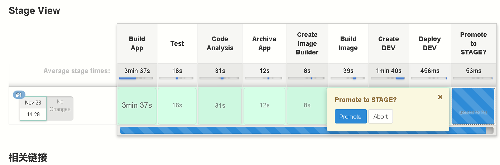

选择 Promote，应用会部署到 Stage，Pipeline 流程走完。

##### 图 18\. 工作流执行完毕

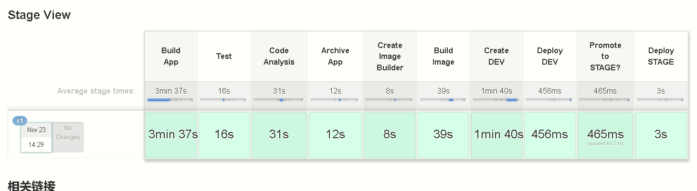

最后，通过浏览器访问成功部署到 Dev/Stage Namespace 中的应用：

##### 图 19\. 应用 UI 访问

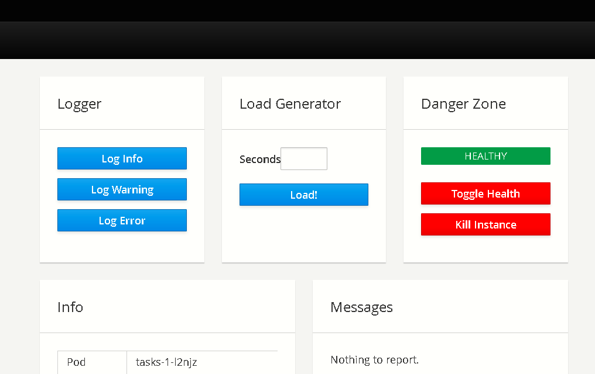

至此，您可以看到应用访问结果，说明 DevOps 全流程已经打通。

## 结束语

通过本文，相信读者对 DevOps 的概念和工具链已经有了大致的了解。也对通过 Kubernetes 集群和容器实现 DevOps 有了一定的理解。