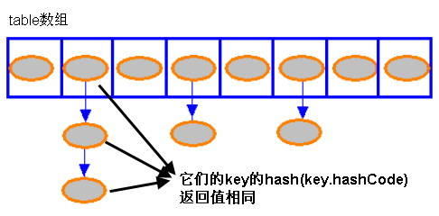

# 通过分析 JDK 源代码研究 Hash 存储机制
通过 HashMap、HashSet 的源代码分析其 Hash 存储机制

**标签:** Java

[原文链接](https://developer.ibm.com/zh/articles/j-lo-hash/)

李刚

发布: 2009-11-26

* * *

## 通过 HashMap、HashSet 的源代码分析其 Hash 存储机制

##### 集合和引用

就像引用类型的数组一样，当我们把 Java 对象放入数组之时，并不是真正的把 Java 对象放入数组中，只是把对象的引用放入数组中，每个数组元素都是一个引用变量。

实际上，HashSet 和 HashMap 之间有很多相似之处，对于 HashSet 而言，系统采用 Hash 算法决定集合元素的存储位置，这样可以保证能快速存、取集合元素；对于 HashMap 而言，系统 key-value 当成一个整体进行处理，系统总是根据 Hash 算法来计算 key-value 的存储位置，这样可以保证能快速存、取 Map 的 key-value 对。

在介绍集合存储之前需要指出一点：虽然集合号称存储的是 Java 对象，但实际上并不会真正将 Java 对象放入 Set 集合中，只是在 Set 集合中保留这些对象的引用而言。也就是说：Java 集合实际上是多个引用变量所组成的集合，这些引用变量指向实际的 Java 对象。

## HashMap 的存储实现

当程序试图将多个 key-value 放入 HashMap 中时，以如下代码片段为例：

```
HashMap<String , Double> map = new HashMap<String , Double>();
map.put("语文" , 80.0);
map.put("数学" , 89.0);
map.put("英语" , 78.2);

```

Show moreShow more icon

HashMap 采用一种所谓的”Hash 算法”来决定每个元素的存储位置。

当程序执行 map.put(“语文” , 80.0); 时，系统将调用”语文”的 hashCode() 方法得到其 hashCode 值——每个 Java 对象都有 hashCode() 方法，都可通过该方法获得它的 hashCode 值。得到这个对象的 hashCode 值之后，系统会根据该 hashCode 值来决定该元素的存储位置。

我们可以看 HashMap 类的 put(K key , V value) 方法的源代码：

```
public V put(K key, V value)
{
     // 如果 key 为 null，调用 putForNullKey 方法进行处理
     if (key == null)
         return putForNullKey(value);
     // 根据 key 的 keyCode 计算 Hash 值
     int hash = hash(key.hashCode());
     // 搜索指定 hash 值在对应 table 中的索引
      int i = indexFor(hash, table.length);
     // 如果 i 索引处的 Entry 不为 null，通过循环不断遍历 e 元素的下一个元素
     for (Entry<K,V> e = table[i]; e != null; e = e.next)
     {
         Object k;
         // 找到指定 key 与需要放入的 key 相等（hash 值相同
         // 通过 equals 比较放回 true）
         if (e.hash == hash && ((k = e.key) == key
             || key.equals(k)))
         {
             V oldValue = e.value;
             e.value = value;
             e.recordAccess(this);
             return oldValue;
         }
     }
     // 如果 i 索引处的 Entry 为 null，表明此处还没有 Entry
     modCount++;
     // 将 key、value 添加到 i 索引处
     addEntry(hash, key, value, i);
     return null;
}

```

Show moreShow more icon

##### JDK 源码

在 JDK 安装目录下可以找到一个 src.zip 压缩文件，包含了 Java 基础类库的所有源文件。您随时可以打开这份压缩文件来阅读 Java 类库的源代码，这对提高读者的编程能力是非常有帮助的。需要指出的是：src.zip 中包含的源代码并没有包含像上文中的中文注释，这些注释是笔者自己添加进去的。

上面程序中用到了一个重要的内部接口：Map.Entry，每个 Map.Entry 其实就是一个 key-value 对。从上面程序中可以看出：当系统决定存储 HashMap 中的 key-value 对时，完全没有考虑 Entry 中的 value，仅仅只是根据 key 来计算并决定每个 Entry 的存储位置。这也说明了前面的结论：我们完全可以把 Map 集合中的 value 当成 key 的附属，当系统决定了 key 的存储位置之后，value 随之保存在那里即可。

上面方法提供了一个根据 hashCode() 返回值来计算 Hash 码的方法：hash()，这个方法是一个纯粹的数学计算，其方法如下：

```
static int hash(int h)
{
    h ^= (h >>> 20) ^ (h >>> 12);
    return h ^ (h >>> 7) ^ (h >>> 4);
}

```

Show moreShow more icon

对于任意给定的对象，只要它的 hashCode() 返回值相同，那么程序调用 hash(int h) 方法所计算得到的 Hash 码值总是相同的。接下来程序会调用 indexFor(int h, int length) 方法来计算该对象应该保存在 table 数组的哪个索引处。indexFor(int h, int length) 方法的代码如下：

```
static int indexFor(int h, int length)
{
    return h & (length-1);
}

```

Show moreShow more icon

这个方法非常巧妙，它总是通过 h `&` (table.length -1) 来得到该对象的保存位置——而 HashMap 底层数组的长度总是 2 的 n 次方，这一点可参看后面关于 HashMap 构造器的介绍。

当 length 总是 2 的倍数时，h `& (length-1) 将是一个非常巧妙的设计：假设 h=5,length=16, 那么 h & length - 1 将得到 5；如果 h=6,length=16, 那么 h & length - 1 将得到 6......如果 h=15,length=16, 那么 h & length - 1 将得到 15；但是当 h=16 时 , length=16 时，那么 h & length - 1 将得到 0 了；当 h=17 时 , length=16 时，那么 h & length - 1 将得到 1 了......这样保证计算得到的索引值总是位于 table 数组的索引之内。`

根据上面 put 方法的源代码可以看出，当程序试图将一个 key-value 对放入 HashMap 中时，程序首先根据该 key 的 hashCode() 返回值决定该 Entry 的存储位置：如果两个 Entry 的 key 的 hashCode() 返回值相同，那它们的存储位置相同。如果这两个 Entry 的 key 通过 equals 比较返回 true，新添加 Entry 的 value 将覆盖集合中原有 Entry 的 value，但 key 不会覆盖。如果这两个 Entry 的 key 通过 equals 比较返回 false，新添加的 Entry 将与集合中原有 Entry 形成 Entry 链，而且新添加的 Entry 位于 Entry 链的头部——具体说明继续看 addEntry() 方法的说明。

当向 HashMap 中添加 key-value 对，由其 key 的 hashCode() 返回值决定该 key-value 对（就是 Entry 对象）的存储位置。当两个 Entry 对象的 key 的 hashCode() 返回值相同时，将由 key 通过 eqauls() 比较值决定是采用覆盖行为（返回 true），还是产生 Entry 链（返回 false）。

上面程序中还调用了 addEntry(hash, key, value, i); 代码，其中 addEntry 是 HashMap 提供的一个包访问权限的方法，该方法仅用于添加一个 key-value 对。下面是该方法的代码：

```
void addEntry(int hash, K key, V value, int bucketIndex)
{
    // 获取指定 bucketIndex 索引处的 Entry
    Entry<K,V> e = table[bucketIndex];      // ①
    // 将新创建的 Entry 放入 bucketIndex 索引处，并让新的 Entry 指向原来的 Entry
    table[bucketIndex] = new Entry<K,V>(hash, key, value, e);
    // 如果 Map 中的 key-value 对的数量超过了极限
    if (size++ >= threshold)
        // 把 table 对象的长度扩充到 2 倍。
        resize(2 * table.length);      // ②
}

```

Show moreShow more icon

上面方法的代码很简单，但其中包含了一个非常优雅的设计：系统总是将新添加的 Entry 对象放入 table 数组的 bucketIndex 索引处——如果 bucketIndex 索引处已经有了一个 Entry 对象，那新添加的 Entry 对象指向原有的 Entry 对象（产生一个 Entry 链），如果 bucketIndex 索引处没有 Entry 对象，也就是上面程序①号代码的 e 变量是 null，也就是新放入的 Entry 对象指向 null，也就是没有产生 Entry 链。

## Hash 算法的性能选项

根据上面代码可以看出，在同一个 bucket 存储 Entry 链的情况下，新放入的 Entry 总是位于 bucket 中，而最早放入该 bucket 中的 Entry 则位于这个 Entry 链的最末端。

上面程序中还有这样两个变量：

- size：该变量保存了该 HashMap 中所包含的 key-value 对的数量。
- threshold：该变量包含了 HashMap 能容纳的 key-value 对的极限，它的值等于 HashMap 的容量乘以负载因子（load factor）。

从上面程序中②号代码可以看出，当 size++ >= threshold 时，HashMap 会自动调用 resize 方法扩充 HashMap 的容量。每扩充一次，HashMap 的容量就增大一倍。

上面程序中使用的 table 其实就是一个普通数组，每个数组都有一个固定的长度，这个数组的长度就是 HashMap 的容量。HashMap 包含如下几个构造器：

- HashMap()：构建一个初始容量为 16，负载因子为 0.75 的 HashMap。
- HashMap(int initialCapacity)：构建一个初始容量为 initialCapacity，负载因子为 0.75 的 HashMap。
- HashMap(int initialCapacity, float loadFactor)：以指定初始容量、指定的负载因子创建一个 HashMap。

当创建一个 HashMap 时，系统会自动创建一个 table 数组来保存 HashMap 中的 Entry，下面是 HashMap 中一个构造器的代码：

```
// 以指定初始化容量、负载因子创建 HashMap
public HashMap(int initialCapacity, float loadFactor)
{
     // 初始容量不能为负数
     if (initialCapacity < 0)
         throw new IllegalArgumentException(
        "Illegal initial capacity: " +
             initialCapacity);
     // 如果初始容量大于最大容量，让出示容量
     if (initialCapacity > MAXIMUM_CAPACITY)
         initialCapacity = MAXIMUM_CAPACITY;
     // 负载因子必须大于 0 的数值
     if (loadFactor <= 0 || Float.isNaN(loadFactor))
         throw new IllegalArgumentException(
         loadFactor);
     // 计算出大于 initialCapacity 的最小的 2 的 n 次方值。
     int capacity = 1;
     while (capacity < initialCapacity)
         capacity <<= 1;
     this.loadFactor = loadFactor;
     // 设置容量极限等于容量 * 负载因子
     threshold = (int)(capacity * loadFactor);
     // 初始化 table 数组
     table = new Entry[capacity];              // ①
     init();
}

```

Show moreShow more icon

上面代码中粗体字代码包含了一个简洁的代码实现：找出大于 initialCapacity 的、最小的 2 的 n 次方值，并将其作为 HashMap 的实际容量（由 capacity 变量保存）。例如给定 initialCapacity 为 10，那么该 HashMap 的实际容量就是 16。

##### initialCapacity 与 HashTable 的容量

创建 HashMap 时指定的 initialCapacity 并不等于 HashMap 的实际容量，通常来说，HashMap 的实际容量总比 initialCapacity 大一些，除非我们指定的 initialCapacity 参数值恰好是 2 的 n 次方。当然，掌握了 HashMap 容量分配的知识之后，应该在创建 HashMap 时将 initialCapacity 参数值指定为 2 的 n 次方，这样可以减少系统的计算开销。

程序①号代码处可以看到：table 的实质就是一个数组，一个长度为 capacity 的数组。

对于 HashMap 及其子类而言，它们采用 Hash 算法来决定集合中元素的存储位置。当系统开始初始化 HashMap 时，系统会创建一个长度为 capacity 的 Entry 数组，这个数组里可以存储元素的位置被称为”桶（bucket）”，每个 bucket 都有其指定索引，系统可以根据其索引快速访问该 bucket 里存储的元素。

无论何时，HashMap 的每个”桶”只存储一个元素（也就是一个 Entry），由于 Entry 对象可以包含一个引用变量（就是 Entry 构造器的的最后一个参数）用于指向下一个 Entry，因此可能出现的情况是：HashMap 的 bucket 中只有一个 Entry，但这个 Entry 指向另一个 Entry ——这就形成了一个 Entry 链。如图 1 所示：

##### 图 1\. HashMap 的存储示意



## HashMap 的读取实现

当 HashMap 的每个 bucket 里存储的 Entry 只是单个 Entry ——也就是没有通过指针产生 Entry 链时，此时的 HashMap 具有最好的性能：当程序通过 key 取出对应 value 时，系统只要先计算出该 key 的 hashCode() 返回值，在根据该 hashCode 返回值找出该 key 在 table 数组中的索引，然后取出该索引处的 Entry，最后返回该 key 对应的 value 即可。看 HashMap 类的 get(K key) 方法代码：

```
public V get(Object key)
{
     // 如果 key 是 null，调用 getForNullKey 取出对应的 value
     if (key == null)
         return getForNullKey();
     // 根据该 key 的 hashCode 值计算它的 hash 码
     int hash = hash(key.hashCode());
     // 直接取出 table 数组中指定索引处的值，
     for (Entry<K,V> e = table[indexFor(hash, table.length)];
         e != null;
         // 搜索该 Entry 链的下一个 Entr
         e = e.next)          // ①
     {
         Object k;
         // 如果该 Entry 的 key 与被搜索 key 相同
         if (e.hash == hash && ((k = e.key) == key
             || key.equals(k)))
             return e.value;
     }
     return null;
}

```

Show moreShow more icon

从上面代码中可以看出，如果 HashMap 的每个 bucket 里只有一个 Entry 时，HashMap 可以根据索引、快速地取出该 bucket 里的 Entry；在发生”Hash 冲突”的情况下，单个 bucket 里存储的不是一个 Entry，而是一个 Entry 链，系统只能必须按顺序遍历每个 Entry，直到找到想搜索的 Entry 为止——如果恰好要搜索的 Entry 位于该 Entry 链的最末端（该 Entry 是最早放入该 bucket 中），那系统必须循环到最后才能找到该元素。

归纳起来简单地说，HashMap 在底层将 key-value 当成一个整体进行处理，这个整体就是一个 Entry 对象。HashMap 底层采用一个 Entry[] 数组来保存所有的 key-value 对，当需要存储一个 Entry 对象时，会根据 Hash 算法来决定其存储位置；当需要取出一个 Entry 时，也会根据 Hash 算法找到其存储位置，直接取出该 Entry。由此可见：HashMap 之所以能快速存、取它所包含的 Entry，完全类似于现实生活中母亲从小教我们的：不同的东西要放在不同的位置，需要时才能快速找到它。

当创建 HashMap 时，有一个默认的负载因子（load factor），其默认值为 0.75，这是时间和空间成本上一种折衷：增大负载因子可以减少 Hash 表（就是那个 Entry 数组）所占用的内存空间，但会增加查询数据的时间开销，而查询是最频繁的的操作（HashMap 的 get() 与 put() 方法都要用到查询）；减小负载因子会提高数据查询的性能，但会增加 Hash 表所占用的内存空间。

掌握了上面知识之后，我们可以在创建 HashMap 时根据实际需要适当地调整 load factor 的值；如果程序比较关心空间开销、内存比较紧张，可以适当地增加负载因子；如果程序比较关心时间开销，内存比较宽裕则可以适当的减少负载因子。通常情况下，程序员无需改变负载因子的值。

如果开始就知道 HashMap 会保存多个 key-value 对，可以在创建时就使用较大的初始化容量，如果 HashMap 中 Entry 的数量一直不会超过极限容量（capacity \* load factor），HashMap 就无需调用 resize() 方法重新分配 table 数组，从而保证较好的性能。当然，开始就将初始容量设置太高可能会浪费空间（系统需要创建一个长度为 capacity 的 Entry 数组），因此创建 HashMap 时初始化容量设置也需要小心对待。

## HashSet 的实现

对于 HashSet 而言，它是基于 HashMap 实现的，HashSet 底层采用 HashMap 来保存所有元素，因此 HashSet 的实现比较简单，查看 HashSet 的源代码，可以看到如下代码：

```
public class HashSet<E>
     extends AbstractSet<E>
     implements Set<E>, Cloneable, java.io.Serializable
{
     // 使用 HashMap 的 key 保存 HashSet 中所有元素
     private transient HashMap<E,Object> map;
     // 定义一个虚拟的 Object 对象作为 HashMap 的 value
     private static final Object PRESENT = new Object();
     ...
     // 初始化 HashSet，底层会初始化一个 HashMap
     public HashSet()
     {
         map = new HashMap<E,Object>();
     }
     // 以指定的 initialCapacity、loadFactor 创建 HashSet
     // 其实就是以相应的参数创建 HashMap
     public HashSet(int initialCapacity, float loadFactor)
     {
         map = new HashMap<E,Object>(initialCapacity, loadFactor);
     }
     public HashSet(int initialCapacity)
     {
         map = new HashMap<E,Object>(initialCapacity);
     }
     HashSet(int initialCapacity, float loadFactor, boolean dummy)
     {
         map = new LinkedHashMap<E,Object>(initialCapacity
             , loadFactor);
     }
     // 调用 map 的 keySet 来返回所有的 key
     public Iterator<E> iterator()
     {
         return map.keySet().iterator();
     }
     // 调用 HashMap 的 size() 方法返回 Entry 的数量，就得到该 Set 里元素的个数
     public int size()
     {
         return map.size();
     }
     // 调用 HashMap 的 isEmpty() 判断该 HashSet 是否为空，
     // 当 HashMap 为空时，对应的 HashSet 也为空
     public boolean isEmpty()
     {
         return map.isEmpty();
     }
     // 调用 HashMap 的 containsKey 判断是否包含指定 key
     //HashSet 的所有元素就是通过 HashMap 的 key 来保存的
     public boolean contains(Object o)
     {
         return map.containsKey(o);
     }
     // 将指定元素放入 HashSet 中，也就是将该元素作为 key 放入 HashMap
     public boolean add(E e)
     {
         return map.put(e, PRESENT) == null;
     }
     // 调用 HashMap 的 remove 方法删除指定 Entry，也就删除了 HashSet 中对应的元素
     public boolean remove(Object o)
     {
         return map.remove(o)==PRESENT;
     }
     // 调用 Map 的 clear 方法清空所有 Entry，也就清空了 HashSet 中所有元素
     public void clear()
     {
         map.clear();
     }
     ...
}

```

Show moreShow more icon

由上面源程序可以看出，HashSet 的实现其实非常简单，它只是封装了一个 HashMap 对象来存储所有的集合元素，所有放入 HashSet 中的集合元素实际上由 HashMap 的 key 来保存，而 HashMap 的 value 则存储了一个 PRESENT，它是一个静态的 Object 对象。

HashSet 的绝大部分方法都是通过调用 HashMap 的方法来实现的，因此 HashSet 和 HashMap 两个集合在实现本质上是相同的。

HashMap 的 put 与 HashSet 的 add：由于 HashSet 的 add() 方法添加集合元素时实际上转变为调用 HashMap 的 put() 方法来添加 key-value 对，当新放入 HashMap 的 Entry 中 key 与集合中原有 Entry 的 key 相同（hashCode() 返回值相等，通过 equals 比较也返回 true），新添加的 Entry 的 value 将覆盖原来 Entry 的 value，但 key 不会有任何改变，因此如果向 HashSet 中添加一个已经存在的元素，新添加的集合元素（底层由 HashMap 的 key 保存）不会覆盖已有的集合元素。

掌握上面理论知识之后，接下来看一个示例程序，测试一下自己是否真正掌握了 HashMap 和 HashSet 集合的功能。

```
class Name
{
    private String first;
    private String last;

    public Name(String first, String last)
    {
        this.first = first;
        this.last = last;
    }

    public boolean equals(Object o)
    {
        if (this == o)
        {
            return true;
        }

    if (o.getClass() == Name.class)
        {
            Name n = (Name)o;
            return n.first.equals(first)
                && n.last.equals(last);
        }
        return false;
    }
}

public class HashSetTest
{
    public static void main(String[] args)
    {
        Set<Name> s = new HashSet<Name>();
        s.add(new Name("abc", "123"));
        System.out.println(
            s.contains(new Name("abc", "123")));
    }
}

```

Show moreShow more icon

上面程序中向 HashSet 里添加了一个 new Name(“abc”, “123”) 对象之后，立即通过程序判断该 HashSet 是否包含一个 new Name(“abc”, “123”) 对象。粗看上去，很容易以为该程序会输出 true。

实际运行上面程序将看到程序输出 false，这是因为 HashSet 判断两个对象相等的标准除了要求通过 equals() 方法比较返回 true 之外，还要求两个对象的 hashCode() 返回值相等。而上面程序没有重写 Name 类的 hashCode() 方法，两个 Name 对象的 hashCode() 返回值并不相同，因此 HashSet 会把它们当成 2 个对象处理，因此程序返回 false。

由此可见，当我们试图把某个类的对象当成 HashMap 的 key，或试图将这个类的对象放入 HashSet 中保存时，重写该类的 equals(Object obj) 方法和 hashCode() 方法很重要，而且这两个方法的返回值必须保持一致：当该类的两个的 hashCode() 返回值相同时，它们通过 equals() 方法比较也应该返回 true。通常来说，所有参与计算 hashCode() 返回值的关键属性，都应该用于作为 equals() 比较的标准。

hashCode() 和 equals()：关于如何正确地重写某个类的 hashCode() 方法和 equals() 方法，请参考疯狂 Java 体系的《疯狂 Java 讲义》一书中相关内容。

如下程序就正确重写了 Name 类的 hashCode() 和 equals() 方法，程序如下：

```
class Name
{
    private String first;
    private String last;
    public Name(String first, String last)
    {
        this.first = first;
        this.last = last;
    }
    // 根据 first 判断两个 Name 是否相等
    public boolean equals(Object o)
    {
        if (this == o)
        {
            return true;
        }
        if (o.getClass() == Name.class)
        {
            Name n = (Name)o;
            return n.first.equals(first);
        }
        return false;
    }

    // 根据 first 计算 Name 对象的 hashCode() 返回值
    public int hashCode()
    {
        return first.hashCode();
    }

    public String toString()
    {
        return "Name[first=" + first + ", last=" + last + "]";
    }
}

public class HashSetTest2
{
    public static void main(String[] args)
    {
        HashSet<Name> set = new HashSet<Name>();
        set.add(new Name("abc" , "123"));
        set.add(new Name("abc" , "456"));
        System.out.println(set);
    }
}

```

Show moreShow more icon

上面程序中提供了一个 Name 类，该 Name 类重写了 equals() 和 toString() 两个方法，这两个方法都是根据 Name 类的 first 实例变量来判断的，当两个 Name 对象的 first 实例变量相等时，这两个 Name 对象的 hashCode() 返回值也相同，通过 equals() 比较也会返回 true。

程序主方法先将第一个 Name 对象添加到 HashSet 中，该 Name 对象的 first 实例变量值为”abc”，接着程序再次试图将一个 first 为”abc”的 Name 对象添加到 HashSet 中，很明显，此时没法将新的 Name 对象添加到该 HashSet 中，因为此处试图添加的 Name 对象的 first 也是” abc”，HashSet 会判断此处新增的 Name 对象与原有的 Name 对象相同，因此无法添加进入，程序在①号代码处输出 set 集合时将看到该集合里只包含一个 Name 对象，就是第一个、last 为”123″的 Name 对象。