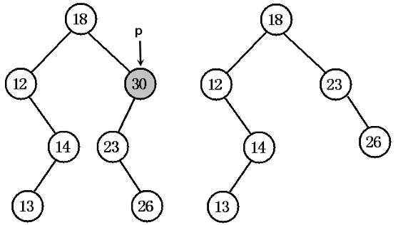
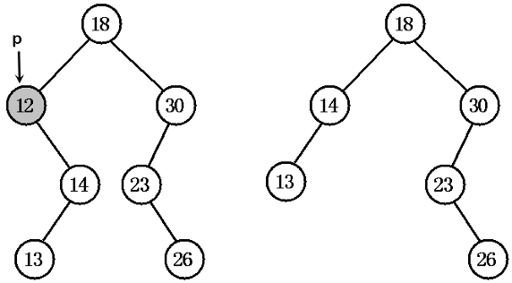
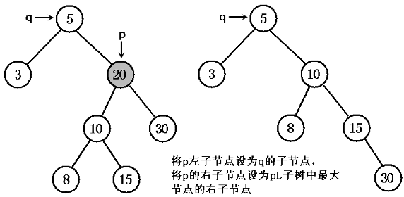
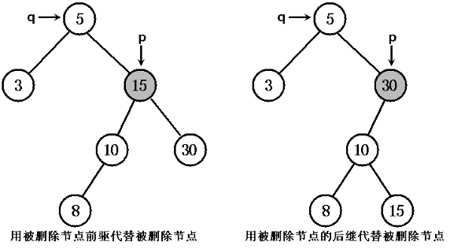
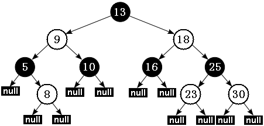
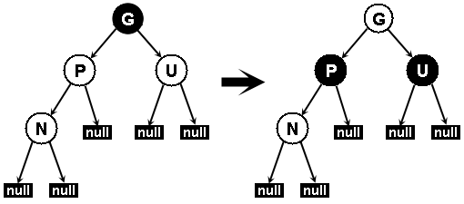
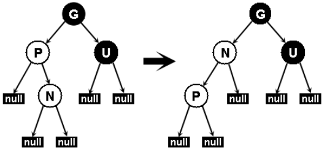
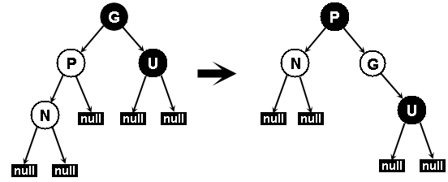

# 通过分析 JDK 源代码研究 TreeMap 红黑树算法实现
了解 TreeMap 和 TreeSet 以及二者之间的关系

**标签:** Java

[原文链接](https://developer.ibm.com/zh/articles/j-lo-tree/)

李刚

发布: 2010-05-25

* * *

TreeMap 的实现就是红黑树数据结构，也就说是一棵自平衡的排序二叉树，这样就可以保证当需要快速检索指定节点。

## TreeSet 和 TreeMap 的关系

为了让大家了解 TreeMap 和 TreeSet 之间的关系，下面先看 TreeSet 类的部分源代码：

```
public class TreeSet<E> extends AbstractSet<E>
    implements NavigableSet<E>, Cloneable, java.io.Serializable
{
    // 使用 NavigableMap 的 key 来保存 Set 集合的元素
    private transient NavigableMap<E,Object> m;
    // 使用一个 PRESENT 作为 Map 集合的所有 value。
    private static final Object PRESENT = new Object();
    // 包访问权限的构造器，以指定的 NavigableMap 对象创建 Set 集合
    TreeSet(NavigableMap<E,Object> m)
    {
        this.m = m;
    }
    public TreeSet()                                      // ①
    {
        // 以自然排序方式创建一个新的 TreeMap，
        // 根据该 TreeSet 创建一个 TreeSet，
        // 使用该 TreeMap 的 key 来保存 Set 集合的元素
        this(new TreeMap<E,Object>());
    }
    public TreeSet(Comparator<? super E> comparator)     // ②
    {
        // 以定制排序方式创建一个新的 TreeMap，
        // 根据该 TreeSet 创建一个 TreeSet，
        // 使用该 TreeMap 的 key 来保存 Set 集合的元素
        this(new TreeMap<E,Object>(comparator));
    }
    public TreeSet(Collection<? extends E> c)
    {
        // 调用①号构造器创建一个 TreeSet，底层以 TreeMap 保存集合元素
        this();
        // 向 TreeSet 中添加 Collection 集合 c 里的所有元素
        addAll(c);
    }
    public TreeSet(SortedSet<E> s)
    {
        // 调用②号构造器创建一个 TreeSet，底层以 TreeMap 保存集合元素
        this(s.comparator());
        // 向 TreeSet 中添加 SortedSet 集合 s 里的所有元素
        addAll(s);
    }
    //TreeSet 的其他方法都只是直接调用 TreeMap 的方法来提供实现
    ...
    public boolean addAll(Collection<? extends E> c)
    {
        if (m.size() == 0 && c.size() > 0 &&
            c instanceof SortedSet &&
            m instanceof TreeMap)
        {
            // 把 c 集合强制转换为 SortedSet 集合
            SortedSet<? extends E> set = (SortedSet<? extends E>) c;
            // 把 m 集合强制转换为 TreeMap 集合
            TreeMap<E,Object> map = (TreeMap<E, Object>) m;
            Comparator<? super E> cc = (Comparator<? super E>) set.comparator();
            Comparator<? super E> mc = map.comparator();
            // 如果 cc 和 mc 两个 Comparator 相等
            if (cc == mc || (cc != null && cc.equals(mc)))
            {
                // 把 Collection 中所有元素添加成 TreeMap 集合的 key
                map.addAllForTreeSet(set, PRESENT);
                return true;
            }
        }
        // 直接调用父类的 addAll() 方法来实现
        return super.addAll(c);
    }
    ...
}

```

Show moreShow more icon

从上面代码可以看出，TreeSet 的 ① 号、② 号构造器的都是新建一个 TreeMap 作为实际存储 Set 元素的容器，而另外 2 个构造器则分别依赖于 ① 号和 ② 号构造器，由此可见，TreeSet 底层实际使用的存储容器就是 TreeMap。

与 HashSet 完全类似的是，TreeSet 里绝大部分方法都是直接调用 TreeMap 的方法来实现的，这一点读者可以自行参阅 TreeSet 的源代码，此处就不再给出了。

对于 TreeMap 而言，它采用一种被称为”红黑树”的排序二叉树来保存 Map 中每个 Entry —— 每个 Entry 都被当成”红黑树”的一个节点对待。例如对于如下程序而言：

```
public class TreeMapTest
{
    public static void main(String[] args)
    {
        TreeMap<String , Double> map =
            new TreeMap<String , Double>();
        map.put("ccc" , 89.0);
        map.put("aaa" , 80.0);
        map.put("zzz" , 80.0);
        map.put("bbb" , 89.0);
        System.out.println(map);
    }
}

```

Show moreShow more icon

当程序执行 map.put(“ccc” , 89.0); 时，系统将直接把 “ccc”-89.0 这个 Entry 放入 Map 中，这个 Entry 就是该”红黑树”的根节点。接着程序执行 map.put(“aaa” , 80.0); 时，程序会将 “aaa”-80.0 作为新节点添加到已有的红黑树中。

以后每向 TreeMap 中放入一个 key-value 对，系统都需要将该 Entry 当成一个新节点，添加成已有红黑树中，通过这种方式就可保证 TreeMap 中所有 key 总是由小到大地排列。例如我们输出上面程序，将看到如下结果（所有 key 由小到大地排列）：

```
{aaa=80.0, bbb=89.0, ccc=89.0, zzz=80.0}

```

Show moreShow more icon

## TreeMap 的添加节点

##### 红黑树

红黑树是一种自平衡排序二叉树，树中每个节点的值，都大于或等于在它的左子树中的所有节点的值，并且小于或等于在它的右子树中的所有节点的值，这确保红黑树运行时可以快速地在树中查找和定位的所需节点。

对于 TreeMap 而言，由于它底层采用一棵”红黑树”来保存集合中的 Entry，这意味这 TreeMap 添加元素、取出元素的性能都比 HashMap 低：当 TreeMap 添加元素时，需要通过循环找到新增 Entry 的插入位置，因此比较耗性能；当从 TreeMap 中取出元素时，需要通过循环才能找到合适的 Entry，也比较耗性能。但 TreeMap、TreeSet 比 HashMap、HashSet 的优势在于：TreeMap 中的所有 Entry 总是按 key 根据指定排序规则保持有序状态，TreeSet 中所有元素总是根据指定排序规则保持有序状态。

为了理解 TreeMap 的底层实现，必须先介绍排序二叉树和红黑树这两种数据结构。其中红黑树又是一种特殊的排序二叉树。

排序二叉树是一种特殊结构的二叉树，可以非常方便地对树中所有节点进行排序和检索。

排序二叉树要么是一棵空二叉树，要么是具有下列性质的二叉树：

- 若它的左子树不空，则左子树上所有节点的值均小于它的根节点的值；
- 若它的右子树不空，则右子树上所有节点的值均大于它的根节点的值；
- 它的左、右子树也分别为排序二叉树。

图 1 显示了一棵排序二叉树：

##### 图 1\. 排序二叉树


对排序二叉树，若按中序遍历就可以得到由小到大的有序序列。如图 1 所示二叉树，中序遍历得：

```
{2，3，4，8，9，9，10，13，15，18}

```

Show moreShow more icon

创建排序二叉树的步骤，也就是不断地向排序二叉树添加节点的过程，向排序二叉树添加节点的步骤如下：

1. 以根节点当前节点开始搜索。
2. 拿新节点的值和当前节点的值比较。
3. 如果新节点的值更大，则以当前节点的右子节点作为新的当前节点；如果新节点的值更小，则以当前节点的左子节点作为新的当前节点。
4. 重复 2、3 两个步骤，直到搜索到合适的叶子节点为止。
5. 将新节点添加为第 4 步找到的叶子节点的子节点；如果新节点更大，则添加为右子节点；否则添加为左子节点。

掌握上面理论之后，下面我们来分析 TreeMap 添加节点（TreeMap 中使用 Entry 内部类代表节点）的实现，TreeMap 集合的 put(K key, V value) 方法实现了将 Entry 放入排序二叉树中，下面是该方法的源代码：

```
public V put(K key, V value)
{
    // 先以 t 保存链表的 root 节点
    Entry<K,V> t = root;
    // 如果 t==null，表明是一个空链表，即该 TreeMap 里没有任何 Entry
    if (t == null)
    {
        // 将新的 key-value 创建一个 Entry，并将该 Entry 作为 root
        root = new Entry<K,V>(key, value, null);
        // 设置该 Map 集合的 size 为 1，代表包含一个 Entry
        size = 1;
        // 记录修改次数为 1
        modCount++;
        return null;
    }
    int cmp;
    Entry<K,V> parent;
    Comparator<? super K> cpr = comparator;
    // 如果比较器 cpr 不为 null，即表明采用定制排序
    if (cpr != null)
    {
        do {
            // 使用 parent 上次循环后的 t 所引用的 Entry
            parent = t;
            // 拿新插入 key 和 t 的 key 进行比较
            cmp = cpr.compare(key, t.key);
            // 如果新插入的 key 小于 t 的 key，t 等于 t 的左边节点
            if (cmp < 0)
                t = t.left;
            // 如果新插入的 key 大于 t 的 key，t 等于 t 的右边节点
            else if (cmp > 0)
                t = t.right;
            // 如果两个 key 相等，新的 value 覆盖原有的 value，
            // 并返回原有的 value
            else
                return t.setValue(value);
        } while (t != null);
    }
    else
    {
        if (key == null)
            throw new NullPointerException();
        Comparable<? super K> k = (Comparable<? super K>) key;
        do {
            // 使用 parent 上次循环后的 t 所引用的 Entry
            parent = t;
            // 拿新插入 key 和 t 的 key 进行比较
            cmp = k.compareTo(t.key);
            // 如果新插入的 key 小于 t 的 key，t 等于 t 的左边节点
            if (cmp < 0)
                t = t.left;
            // 如果新插入的 key 大于 t 的 key，t 等于 t 的右边节点
            else if (cmp > 0)
                t = t.right;
            // 如果两个 key 相等，新的 value 覆盖原有的 value，
            // 并返回原有的 value
            else
                return t.setValue(value);
        } while (t != null);
    }
    // 将新插入的节点作为 parent 节点的子节点
    Entry<K,V> e = new Entry<K,V>(key, value, parent);
    // 如果新插入 key 小于 parent 的 key，则 e 作为 parent 的左子节点
    if (cmp < 0)
        parent.left = e;
    // 如果新插入 key 小于 parent 的 key，则 e 作为 parent 的右子节点
    else
        parent.right = e;
    // 修复红黑树
    fixAfterInsertion(e);                               // ①
    size++;
    modCount++;
    return null;
}

```

Show moreShow more icon

上面程序中粗体字代码就是实现”排序二叉树”的关键算法，每当程序希望添加新节点时：系统总是从树的根节点开始比较 —— 即将根节点当成当前节点，如果新增节点大于当前节点、并且当前节点的右子节点存在，则以右子节点作为当前节点；如果新增节点小于当前节点、并且当前节点的左子节点存在，则以左子节点作为当前节点；如果新增节点等于当前节点，则用新增节点覆盖当前节点，并结束循环 —— 直到找到某个节点的左、右子节点不存在，将新节点添加该节点的子节点 —— 如果新节点比该节点大，则添加为右子节点；如果新节点比该节点小，则添加为左子节点。

## TreeMap 的删除节点

当程序从排序二叉树中删除一个节点之后，为了让它依然保持为排序二叉树，程序必须对该排序二叉树进行维护。维护可分为如下几种情况：

（1）被删除的节点是叶子节点，则只需将它从其父节点中删除即可。

（2）被删除节点 p 只有左子树，将 p 的左子树 pL 添加成 p 的父节点的左子树即可；被删除节点 p 只有右子树，将 p 的右子树 pR 添加成 p 的父节点的右子树即可。

（3）若被删除节点 p 的左、右子树均非空，有两种做法：

- 将 pL 设为 p 的父节点 q 的左或右子节点（取决于 p 是其父节点 q 的左、右子节点），将 pR 设为 p 节点的中序前趋节点 s 的右子节点（s 是 pL 最右下的节点，也就是 pL 子树中最大的节点）。
- 以 p 节点的中序前趋或后继替代 p 所指节点，然后再从原排序二叉树中删去中序前趋或后继节点即可。（也就是用大于 p 的最小节点或小于 p 的最大节点代替 p 节点即可）。

图 2 显示了被删除节点只有左子树的示意图：

##### 图 2\. 被删除节点只有左子树



图 3 显示了被删除节点只有右子树的示意图：

##### 图 3\. 被删除节点只有右子树



图 4 显示了被删除节点既有左子节点，又有右子节点的情形，此时我们采用到是第一种方式进行维护：

##### 图 4\. 被删除节点既有左子树，又有右子树



图 5 显示了被删除节点既有左子树，又有右子树的情形，此时我们采用到是第二种方式进行维护：

##### 图 5\. 被删除节点既有左子树，又有右子树



TreeMap 删除节点采用图 5 所示右边的情形进行维护——也就是用被删除节点的右子树中最小节点与被删节点交换的方式进行维护。

TreeMap 删除节点的方法由如下方法实现：

```
private void deleteEntry(Entry<K,V> p)
{
    modCount++;
    size--;
    // 如果被删除节点的左子树、右子树都不为空
    if (p.left != null && p.right != null)
    {
        // 用 p 节点的中序后继节点代替 p 节点
        Entry<K,V> s = successor (p);
        p.key = s.key;
        p.value = s.value;
        p = s;
    }
    // 如果 p 节点的左节点存在，replacement 代表左节点；否则代表右节点。
    Entry<K,V> replacement = (p.left != null ? p.left : p.right);
    if (replacement != null)
    {
        replacement.parent = p.parent;
        // 如果 p 没有父节点，则 replacemment 变成父节点
        if (p.parent == null)
            root = replacement;
        // 如果 p 节点是其父节点的左子节点
        else if (p == p.parent.left)
            p.parent.left  = replacement;
        // 如果 p 节点是其父节点的右子节点
        else
            p.parent.right = replacement;
        p.left = p.right = p.parent = null;
        // 修复红黑树
        if (p.color == BLACK)
            fixAfterDeletion(replacement);       // ①
    }
    // 如果 p 节点没有父节点
    else if (p.parent == null)
    {
        root = null;
    }
    else
    {
        if (p.color == BLACK)
            // 修复红黑树
            fixAfterDeletion(p);                 // ②
        if (p.parent != null)
        {
            // 如果 p 是其父节点的左子节点
            if (p == p.parent.left)
                p.parent.left = null;
            // 如果 p 是其父节点的右子节点
            else if (p == p.parent.right)
                p.parent.right = null;
            p.parent = null;
        }
    }
}

```

Show moreShow more icon

## 红黑树

排序二叉树虽然可以快速检索，但在最坏的情况下：如果插入的节点集本身就是有序的，要么是由小到大排列，要么是由大到小排列，那么最后得到的排序二叉树将变成链表：所有节点只有左节点（如果插入节点集本身是大到小排列）；或所有节点只有右节点（如果插入节点集本身是小到大排列）。在这种情况下，排序二叉树就变成了普通链表，其检索效率就会很差。

为了改变排序二叉树存在的不足，Rudolf Bayer 与 1972 年发明了另一种改进后的排序二叉树：红黑树，他将这种排序二叉树称为”对称二叉 B 树”，而红黑树这个名字则由 Leo J. Guibas 和 Robert Sedgewick 于 1978 年首次提出。

红黑树是一个更高效的检索二叉树，因此常常用来实现关联数组。典型地，JDK 提供的集合类 TreeMap 本身就是一个红黑树的实现。

红黑树在原有的排序二叉树增加了如下几个要求：

##### Java 实现的红黑树

上面的性质 3 中指定红黑树的每个叶子节点都是空节点，而且并叶子节点都是黑色。但 Java 实现的红黑树将使用 null 来代表空节点，因此遍历红黑树时将看不到黑色的叶子节点，反而看到每个叶子节点都是红色的。

- 性质 1：每个节点要么是红色，要么是黑色。
- 性质 2：根节点永远是黑色的。
- 性质 3：所有的叶节点都是空节点（即 null），并且是黑色的。
- 性质 4：每个红色节点的两个子节点都是黑色。（从每个叶子到根的路径上不会有两个连续的红色节点）
- 性质 5：从任一节点到其子树中每个叶子节点的路径都包含相同数量的黑色节点。

Java 中实现的红黑树可能有如图 6 所示结构：

##### 图 6\. Java 红黑树的示意



备注：本文中所有关于红黑树中的示意图采用白色代表红色。黑色节点还是采用了黑色表示。

根据性质 5：红黑树从根节点到每个叶子节点的路径都包含相同数量的黑色节点，因此从根节点到叶子节点的路径中包含的黑色节点数被称为树的”黑色高度（black-height）”。

性质 4 则保证了从根节点到叶子节点的最长路径的长度不会超过任何其他路径的两倍。假如有一棵黑色高度为 3 的红黑树：从根节点到叶节点的最短路径长度是 2，该路径上全是黑色节点（黑节点 – 黑节点 – 黑节点）。最长路径也只可能为 4，在每个黑色节点之间插入一个红色节点（黑节点 – 红节点 – 黑节点 – 红节点 – 黑节点），性质 4 保证绝不可能插入更多的红色节点。由此可见，红黑树中最长路径就是一条红黑交替的路径。

##### 红黑树和平衡二叉树

红黑树并不是真正的平衡二叉树，但在实际应用中，红黑树的统计性能要高于平衡二叉树，但极端性能略差。

由此我们可以得出结论：对于给定的黑色高度为 N 的红黑树，从根到叶子节点的最短路径长度为 N-1，最长路径长度为 2 \* (N-1)。

提示：排序二叉树的深度直接影响了检索的性能，正如前面指出，当插入节点本身就是由小到大排列时，排序二叉树将变成一个链表，这种排序二叉树的检索性能最低：N 个节点的二叉树深度就是 N-1。

红黑树通过上面这种限制来保证它大致是平衡的——因为红黑树的高度不会无限增高，这样保证红黑树在最坏情况下都是高效的，不会出现普通排序二叉树的情况。

由于红黑树只是一个特殊的排序二叉树，因此对红黑树上的只读操作与普通排序二叉树上的只读操作完全相同，只是红黑树保持了大致平衡，因此检索性能比排序二叉树要好很多。

但在红黑树上进行插入操作和删除操作会导致树不再符合红黑树的特征，因此插入操作和删除操作都需要进行一定的维护，以保证插入节点、删除节点后的树依然是红黑树。

## 添加节点后的修复

上面 `put(K key, V value) 方法中① 号代码处使用 fixAfterInsertion(e) 方法来修复红黑树——因此每次插入节点后必须进行简单修复，使该排序二叉树满足红黑树的要求。`

插入操作按如下步骤进行：

1. 以排序二叉树的方法插入新节点，并将它设为红色。
2. 进行颜色调换和树旋转。

##### 插入后的修复

在插入操作中，红黑树的性质 1 和性质 3 两个永远不会发生改变，因此无需考虑红黑树的这两个特性。

这种颜色调用和树旋转就比较复杂了，下面将分情况进行介绍。在介绍中，我们把新插入的节点定义为 N 节点，N 节点的父节点定义为 P 节点，P 节点的兄弟节点定义为 U 节点，P 节点父节点定义为 G 节点。

下面分成不同情形来分析插入操作

**情形 1：新节点 N 是树的根节点，没有父节点**

在这种情形下，直接将它设置为黑色以满足性质 2。

**情形 2：新节点的父节点 P 是黑色**

在这种情况下，新插入的节点是红色的，因此依然满足性质 4。而且因为新节点 N 有两个黑色叶子节点；但是由于新节点 N 是红色，通过它的每个子节点的路径依然保持相同的黑色节点数，因此依然满足性质 5。

**情形 3：如果父节点 P 和父节点的兄弟节点 U 都是红色**

在这种情况下，程序应该将 P 节点、U 节点都设置为黑色，并将 P 节点的父节点设为红色（用来保持性质 5）。现在新节点 N 有了一个黑色的父节点 P。由于从 P 节点、U 节点到根节点的任何路径都必须通过 G 节点，在这些路径上的黑节点数目没有改变（原来有叶子和 G 节点两个黑色节点，现在有叶子和 P 两个黑色节点）。

经过上面处理后，红色的 G 节点的父节点也有可能是红色的，这就违反了性质 4，因此还需要对 G 节点递归地进行整个过程（把 G 当成是新插入的节点进行处理即可）。

图 7 显示了这种处理过程：

##### 图 7\. 插入节点后进行颜色调换



备注：虽然图 11.28 绘制的是新节点 N 作为父节点 P 左子节点的情形，其实新节点 N 作为父节点 P 右子节点的情况与图 11.28 完全相同。

**情形 4：父节点 P 是红色、而其兄弟节点 U 是黑色或缺少；且新节点 N 是父节点 P 的右子节点，而父节点 P 又是其父节点 G 的左子节点。**

在这种情形下，我们进行一次左旋转对新节点和其父节点进行，接着按情形 5 处理以前的父节点 P（也就是把 P 当成新插入的节点即可）。这导致某些路径通过它们以前不通过的新节点 N 或父节点 P 的其中之一，但是这两个节点都是红色的，因此不会影响性质 5。

图 8 显示了对情形 4 的处理：

##### 图 8\. 插入节点后的树旋转



备注：图 11.29 中 P 节点是 G 节点的左子节点，如果 P 节点是其父节点 G 节点的右子节点，那么上 **面的处理情况应该左、右对调一下。**

**情形 5：父节点 P 是红色、而其兄弟节点 U 是黑色或缺少；且新节点 N 是其父节点的左子节点，而父节点 P 又是其父节点 G 的左子节点。**

在这种情形下，需要对节点 G 的一次右旋转，在旋转产生的树中，以前的父节点 P 现在是新节点 N 和节点 G 的父节点。由于以前的节点 G 是黑色，否则父节点 P 就不可能是红色，我们切换以前的父节点 P 和节点 G 的颜色，使之满足性质 4，性质 5 也仍然保持满足，因为通过这三个节点中任何一个的所有路径以前都通过节点 G，现在它们都通过以前的父节点 P。在各自的情形下，这都是三个节点中唯一的黑色节点。

图 9 显示了情形 5 的处理过程：

##### 图 9\. 插入节点后的颜色调整、树旋转



备注：图 11.30 中 P 节点是 G 节点的左子节点，如果 P 节点是其父节点 G 节点的右子节点，那么上面的处理情况应该左、右对调一下。

TreeMap 为插入节点后的修复操作由 fixAfterInsertion(Entry<k,v> x) 方法提供，该方法的源代码如下：

```
// 插入节点后修复红黑树
private void fixAfterInsertion(Entry<K,V> x)
{
    x.color = RED;
    // 直到 x 节点的父节点不是根，且 x 的父节点不是红色
    while (x != null && x != root
        && x.parent.color == RED)
    {
        // 如果 x 的父节点是其父节点的左子节点
        if (parentOf(x) == leftOf(parentOf(parentOf(x))))
        {
            // 获取 x 的父节点的兄弟节点
            Entry<K,V> y = rightOf(parentOf(parentOf(x)));
            // 如果 x 的父节点的兄弟节点是红色
            if (colorOf(y) == RED)
            {
                // 将 x 的父节点设为黑色
                setColor(parentOf(x), BLACK);
                // 将 x 的父节点的兄弟节点设为黑色
                setColor(y, BLACK);
                // 将 x 的父节点的父节点设为红色
                setColor(parentOf(parentOf(x)), RED);
                x = parentOf(parentOf(x));
            }
            // 如果 x 的父节点的兄弟节点是黑色
            else
            {
                // 如果 x 是其父节点的右子节点
                if (x == rightOf(parentOf(x)))
                {
                    // 将 x 的父节点设为 x
                    x = parentOf(x);
                    rotateLeft(x);
                }
                // 把 x 的父节点设为黑色
                setColor(parentOf(x), BLACK);
                // 把 x 的父节点的父节点设为红色
                setColor(parentOf(parentOf(x)), RED);
                rotateRight(parentOf(parentOf(x)));
            }
        }
        // 如果 x 的父节点是其父节点的右子节点
        else
        {
            // 获取 x 的父节点的兄弟节点
            Entry<K,V> y = leftOf(parentOf(parentOf(x)));
            // 如果 x 的父节点的兄弟节点是红色
            if (colorOf(y) == RED)
            {
                // 将 x 的父节点设为黑色。
                setColor(parentOf(x), BLACK);
                // 将 x 的父节点的兄弟节点设为黑色
                setColor(y, BLACK);
                // 将 x 的父节点的父节点设为红色
                setColor(parentOf(parentOf(x)), RED);
                // 将 x 设为 x 的父节点的节点
                x = parentOf(parentOf(x));
            }
            // 如果 x 的父节点的兄弟节点是黑色
            else
            {
                // 如果 x 是其父节点的左子节点
                if (x == leftOf(parentOf(x)))
                {
                    // 将 x 的父节点设为 x
                    x = parentOf(x);
                    rotateRight(x);
                }
                // 把 x 的父节点设为黑色
                setColor(parentOf(x), BLACK);
                // 把 x 的父节点的父节点设为红色
                setColor(parentOf(parentOf(x)), RED);
                rotateLeft(parentOf(parentOf(x)));
            }
        }
    }
    // 将根节点设为黑色
    root.color = BLACK;
}

```

Show moreShow more icon

## 删除节点后的修复

与添加节点之后的修复类似的是，TreeMap 删除节点之后也需要进行类似的修复操作，通过这种修复来保证该排序二叉树依然满足红黑树特征。大家可以参考插入节点之后的修复来分析删除之后的修复。TreeMap 在删除之后的修复操作由 fixAfterDeletion(Entry<k,v> x) 方法提供，该方法源代码如下：

```
// 删除节点后修复红黑树
private void fixAfterDeletion(Entry<K,V> x)
{
    // 直到 x 不是根节点，且 x 的颜色是黑色
    while (x != root && colorOf(x) == BLACK)
    {
        // 如果 x 是其父节点的左子节点
        if (x == leftOf(parentOf(x)))
        {
            // 获取 x 节点的兄弟节点
            Entry<K,V> sib = rightOf(parentOf(x));
            // 如果 sib 节点是红色
            if (colorOf(sib) == RED)
            {
                // 将 sib 节点设为黑色
                setColor(sib, BLACK);
                // 将 x 的父节点设为红色
                setColor(parentOf(x), RED);
                rotateLeft(parentOf(x));
                // 再次将 sib 设为 x 的父节点的右子节点
                sib = rightOf(parentOf(x));
            }
            // 如果 sib 的两个子节点都是黑色
            if (colorOf(leftOf(sib)) == BLACK
                && colorOf(rightOf(sib)) == BLACK)
            {
                // 将 sib 设为红色
                setColor(sib, RED);
                // 让 x 等于 x 的父节点
                x = parentOf(x);
            }
            else
            {
                // 如果 sib 的只有右子节点是黑色
                if (colorOf(rightOf(sib)) == BLACK)
                {
                    // 将 sib 的左子节点也设为黑色
                    setColor(leftOf(sib), BLACK);
                    // 将 sib 设为红色
                    setColor(sib, RED);
                    rotateRight(sib);
                    sib = rightOf(parentOf(x));
                }
                // 设置 sib 的颜色与 x 的父节点的颜色相同
                setColor(sib, colorOf(parentOf(x)));
                // 将 x 的父节点设为黑色
                setColor(parentOf(x), BLACK);
                // 将 sib 的右子节点设为黑色
                setColor(rightOf(sib), BLACK);
                rotateLeft(parentOf(x));
                x = root;
            }
        }
        // 如果 x 是其父节点的右子节点
        else
        {
            // 获取 x 节点的兄弟节点
            Entry<K,V> sib = leftOf(parentOf(x));
            // 如果 sib 的颜色是红色
            if (colorOf(sib) == RED)
            {
                // 将 sib 的颜色设为黑色
                setColor(sib, BLACK);
                // 将 sib 的父节点设为红色
                setColor(parentOf(x), RED);
                rotateRight(parentOf(x));
                sib = leftOf(parentOf(x));
            }
            // 如果 sib 的两个子节点都是黑色
            if (colorOf(rightOf(sib)) == BLACK
                && colorOf(leftOf(sib)) == BLACK)
            {
                // 将 sib 设为红色
                setColor(sib, RED);
                // 让 x 等于 x 的父节点
                x = parentOf(x);
            }
            else
            {
                // 如果 sib 只有左子节点是黑色
                if (colorOf(leftOf(sib)) == BLACK)
                {
                    // 将 sib 的右子节点也设为黑色
                    setColor(rightOf(sib), BLACK);
                    // 将 sib 设为红色
                    setColor(sib, RED);
                    rotateLeft(sib);
                    sib = leftOf(parentOf(x));
                }
                // 将 sib 的颜色设为与 x 的父节点颜色相同
                setColor(sib, colorOf(parentOf(x)));
                // 将 x 的父节点设为黑色
                setColor(parentOf(x), BLACK);
                // 将 sib 的左子节点设为黑色
                setColor(leftOf(sib), BLACK);
                rotateRight(parentOf(x));
                x = root;
            }
        }
    }
    setColor(x, BLACK);
}

```

Show moreShow more icon

## 检索节点

当 TreeMap 根据 key 来取出 value 时，TreeMap 对应的方法如下：

```
public V get(Object key)
{
    // 根据指定 key 取出对应的 Entry
    Entry>K,V< p = getEntry(key);
    // 返回该 Entry 所包含的 value
    return (p==null ? null : p.value);
}

```

Show moreShow more icon

从上面程序的粗体字代码可以看出，get(Object key) 方法实质是由于 getEntry() 方法实现的，这个 getEntry() 方法的代码如下：

```
final Entry<K,V> getEntry(Object key)
{
    // 如果 comparator 不为 null，表明程序采用定制排序
    if (comparator != null)
        // 调用 getEntryUsingComparator 方法来取出对应的 key
        return getEntryUsingComparator(key);
    // 如果 key 形参的值为 null，抛出 NullPointerException 异常
    if (key == null)
        throw new NullPointerException();
    // 将 key 强制类型转换为 Comparable 实例
    Comparable<? super K> k = (Comparable<? super K>) key;
    // 从树的根节点开始
    Entry<K,V> p = root;
    while (p != null)
    {
        // 拿 key 与当前节点的 key 进行比较
        int cmp = k.compareTo(p.key);
        // 如果 key 小于当前节点的 key，向"左子树”搜索
        if (cmp < 0)
            p = p.left;
        // 如果 key 大于当前节点的 key，向"右子树”搜索
        else if (cmp > 0)
            p = p.right;
        // 不大于、不小于，就是找到了目标 Entry
        else
            return p;
    }
    return null;
}

```

Show moreShow more icon

上面的 getEntry(Object obj) 方法也是充分利用排序二叉树的特征来搜索目标 Entry，程序依然从二叉树的根节点开始，如果被搜索节点大于当前节点，程序向”右子树”搜索；如果被搜索节点小于当前节点，程序向”左子树”搜索；如果相等，那就是找到了指定节点。

当 TreeMap 里的 comparator != null 即表明该 TreeMap 采用了定制排序，在采用定制排序的方式下，TreeMap 采用 getEntryUsingComparator(key) 方法来根据 key 获取 Entry。下面是该方法的代码：

```
final Entry<K,V> getEntryUsingComparator(Object key)
{
    K k = (K) key;
    // 获取该 TreeMap 的 comparator
    Comparator<? super K> cpr = comparator;
    if (cpr != null)
    {
        // 从根节点开始
        Entry<K,V> p = root;
        while (p != null)
        {
            // 拿 key 与当前节点的 key 进行比较
            int cmp = cpr.compare(k, p.key);
            // 如果 key 小于当前节点的 key，向"左子树”搜索
            if (cmp < 0)
                p = p.left;
            // 如果 key 大于当前节点的 key，向"右子树”搜索
            else if (cmp > 0)
                p = p.right;
            // 不大于、不小于，就是找到了目标 Entry
            else
                return p;
        }
    }
    return null;
}

```

Show moreShow more icon

其实 getEntry、getEntryUsingComparator 两个方法的实现思路完全类似，只是前者对自然排序的 TreeMap 获取有效，后者对定制排序的 TreeMap 有效。

通过上面源代码的分析不难看出，TreeMap 这个工具类的实现其实很简单。或者说：从内部结构来看，TreeMap 本质上就是一棵”红黑树”，而 TreeMap 的每个 Entry 就是该红黑树的一个节点。