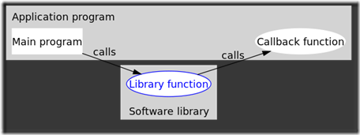

# 通过实例理解 JDK8 的 CompletableFuture
理解 CompletableFuture

**标签:** Java

[原文链接](https://developer.ibm.com/zh/articles/j-cf-of-jdk8/)

周明耀

发布: 2018-03-27

* * *

## 前言

Java 5 并发库主要关注于异步任务的处理，它采用了这样一种模式，producer 线程创建任务并且利用阻塞队列将其传递给任务的 consumer。这种模型在 Java 7 和 8 中进一步发展，并且开始支持另外一种风格的任务执行，那就是将任务的数据集分解为子集，每个子集都可以由独立且同质的子任务来负责处理。

这种风格的基础库也就是 fork/join 框架，它允许程序员规定数据集该如何进行分割，并且支持将子任务提交到默认的标准线程池中，也就是”通用的”ForkJoinPool。Java 8 中，fork/join 并行功能借助并行流的机制变得更加具有可用性。但是，不是所有的问题都适合这种风格的并行处理：所处理的元素必须是独立的，数据集要足够大，并且在并行加速方面，每个元素的处理成本要足够高，这样才能补偿建立 fork/join 框架所消耗的成本。CompletableFuture 类则是 Java 8 在并行流方面的创新。

## 准备知识

### 异步计算

所谓异步调用其实就是实现一个可无需等待被调用函数的返回值而让操作继续运行的方法。在 Java 语言中，简单的讲就是另启一个线程来完成调用中的部分计算，使调用继续运行或返回，而不需要等待计算结果。但调用者仍需要取线程的计算结果。

### 回调函数

回调函数比较通用的解释是，它是一个通过函数指针调用的函数。如果你把函数的指针（地址）作为参数传递给另一个函数，当这个指针被用为调用它所指向的函数时，我们就说这是回调函数。回调函数不是由该函数的实现方直接调用，而是在特定的事件或条件发生时由另外一方调用的，用于对该事件或条件进行响应。

回调函数的机制：

1. 定义一个回调函数；
2. 提供函数实现的一方在初始化时候，将回调函数的函数指针注册给调用者；
3. 当特定的事件或条件发生的时候，调用者使用函数指针调用回调函数对事件进行处理。

回调函数通常与原始调用者处于同一层次，如图 1 所示：

##### 图 1\. 回调函数示例图



### Future 接口介绍

JDK5 新增了 Future 接口，用于描述一个异步计算的结果。虽然 Future 以及相关使用方法提供了异步执行任务的能力，但是对于结果的获取却是很不方便，只能通过阻塞或者轮询的方式得到任务的结果。阻塞的方式显然和我们的异步编程的初衷相违背，轮询的方式又会耗费无谓的 CPU 资源，而且也不能及时地得到计算结果，为什么不能用观察者设计模式呢？即当计算结果完成及时通知监听者。

有一些开源框架实现了我们的设想，例如 Netty 的 ChannelFuture 类扩展了 Future 接口，通过提供 addListener 方法实现支持回调方式的异步编程。Netty 中所有的 I/O 操作都是异步的,这意味着任何的 I/O 调用都将立即返回，而不保证这些被请求的 I/O 操作在调用结束的时候已经完成。取而代之地，你会得到一个返回的 ChannelFuture 实例，这个实例将给你一些关于 I/O 操作结果或者状态的信息。当一个 I/O 操作开始的时候，一个新的 Future 对象就会被创建。在开始的时候，新的 Future 是未完成的状态－－它既非成功、失败，也非被取消，因为 I/O 操作还没有结束。如果 I/O 操作以成功、失败或者被取消中的任何一种状态结束了，那么这个 Future 将会被标记为已完成，并包含更多详细的信息（例如：失败的原因）。请注意，即使是失败和被取消的状态，也是属于已完成的状态。阻塞方式的示例代码如清单 1 所示。

##### 清单 1\. 阻塞方式示例代码

```
// Start the connection attempt.
ChannelFuture Future = bootstrap.connect(new InetSocketAddress(host, port));
// Wait until the connection is closed or the connection attempt fails.
Future.getChannel().getCloseFuture().awaitUninterruptibly();
// Shut down thread pools to exit.
bootstrap.releaseExternalResources();

```

Show moreShow more icon

上面代码使用的是 awaitUninterruptibly 方法，源代码如清单 2 所示。

##### 清单 2\. awaitUninterruptibly 源代码

```
publicChannelFutureawaitUninterruptibly() {
    boolean interrupted = false;
    synchronized (this) {
        //循环等待到完成
        while (!done) {
            checkDeadLock();
            waiters++;
        try {
            wait();
        } catch (InterruptedException e) {
            //不允许中断
            interrupted = true;
        } finally {
            waiters--;
        }
    }
}
    if (interrupted) {
    Thread.currentThread().interrupt();
}
return this;
}

```

Show moreShow more icon

##### 清单 3\. 异步非阻塞方式示例代码

```
// Start the connection attempt.
ChannelFuture Future = bootstrap.connect(new InetSocketAddress(host, port));
Future.addListener(new ChannelFutureListener(){
    public void operationComplete(final ChannelFuture Future)
        throws Exception
        {
    }
});
// Shut down thread pools to exit.
bootstrap.releaseExternalResources();

```

Show moreShow more icon

可以明显的看出，在异步模式下，上面这段代码没有阻塞，在执行 connect 操作后直接执行到 printTime(“异步时间： “)，随后 connect 完成，Future 的监听函数输出 connect 操作完成。

非阻塞则是添加监听类 ChannelFutureListener，通过覆盖 ChannelFutureListener 的 operationComplete 执行业务逻辑。

##### 清单 4\. 异步非阻塞方式示例代码

```
public void addListener(final ChannelFutureListener listener) {
    if (listener == null) {
    throw new NullPointerException("listener");
}
    booleannotifyNow = false;
    synchronized (this) {
        if (done) {
        notifyNow = true;
    } else {
        if (firstListener == null) {
        //listener 链表头
        firstListener = listener;
    } else {
        if (otherListeners == null) {
        otherListeners = new ArrayList<ChannelFutureListener>(1);
        }
        //添加到 listener 链表中，以便操作完成后遍历操作
        otherListeners.add(listener);
    }
    ......
    if (notifyNow) {
        //通知 listener 进行处理
        notifyListener(listener);
        }
}

```

Show moreShow more icon

这部分代码的逻辑很简单，就是注册回调函数，当操作完成后自动调用回调函数，就达到了异步的效果。

### CompletableFuture 类介绍

Java 8 中, 新增加了一个包含 50 个方法左右的类–CompletableFuture，它提供了非常强大的 Future 的扩展功能，可以帮助我们简化异步编程的复杂性，并且提供了函数式编程的能力，可以通过回调的方式处理计算结果，也提供了转换和组合 CompletableFuture 的方法。

对于阻塞或者轮询方式，依然可以通过 CompletableFuture 类的 CompletionStage 和 Future 接口方式支持。

CompletableFuture 类声明了 CompletionStage 接口，CompletionStage 接口实际上提供了同步或异步运行计算的舞台，所以我们可以通过实现多个 CompletionStage 命令，并且将这些命令串联在一起的方式实现多个命令之间的触发。

我们可以通过 CompletableFuture.supplyAsync(this::sendMsg); 这么一行代码创建一个简单的异步计算。在这行代码中，supplyAsync 支持异步地执行我们指定的方法，这个例子中的异步执行方法是 sendMsg。当然，我们也可以使用 Executor 执行异步程序，默认是 ForkJoinPool.commonPool()。

我们也可以在异步计算结束之后指定回调函数，例如 CompletableFuture.supplyAsync(this::sendMsg) .thenAccept(this::notify);这行代码中的 thenAccept 被用于增加回调函数，在我们的示例中 notify 就成了异步计算的消费者，它会处理计算结果。

## CompletableFuture 类使用示例

接下来我们通过 20 个示例看看 CompletableFuture 类具体怎么用。

### 创建完整的 CompletableFuture

##### 清单 5\. 示例代码

```
static void completedFutureExample() {
    CompletableFuture<String>cf = CompletableFuture.completedFuture("message");
    assertTrue(cf.isDone());
    assertEquals("message", cf.getNow(null));
}

```

Show moreShow more icon

以上代码一般来说被用于启动异步计算，getNow(null)返回计算结果或者 null。

### 运行简单的异步场景

##### 清单 6\. 示例代码

```
static void runAsyncExample() {
    CompletableFuture<Void>cf = CompletableFuture.runAsync(() -> {
    assertTrue(Thread.currentThread().isDaemon());
    randomSleep();
});
    assertFalse(cf.isDone());
    sleepEnough();
    assertTrue(cf.isDone());
}

```

Show moreShow more icon

以上代码的关键点有两点：

1. CompletableFuture 是异步执行方式；
2. 使用 ForkJoinPool 实现异步执行，这种方式使用了 daemon 线程执行 Runnable 任务。

### 同步执行动作示例

##### 清单 7\. 示例代码

```
static void thenApplyExample() {
    CompletableFuture<String>cf = CompletableFuture.completedFuture("message").thenApply(s -> {
    assertFalse(Thread.currentThread().isDaemon());
    returns.toUpperCase();
    });
    assertEquals("MESSAGE", cf.getNow(null));
}

```

Show moreShow more icon

以上代码在异步计算正常完成的前提下将执行动作（此处为转换成大写字母）。

### 异步执行动作示例

相较前一个示例的同步方式，以下代码实现了异步方式，仅仅是在上面的代码里的多个方法增加”Async”这样的关键字。

##### 清单 8\. 示例代码

```
static void thenApplyAsyncExample() {
    CompletableFuture<String>cf = CompletableFuture.completedFuture("message").thenApplyAsync(s -> {
    assertTrue(Thread.currentThread().isDaemon());
    randomSleep();
    returns.toUpperCase();
    });
    assertNull(cf.getNow(null));
    assertEquals("MESSAGE", cf.join());
}

```

Show moreShow more icon

### 使用固定的线程池完成异步执行动作示例

我们可以通过使用线程池方式来管理异步动作申请，以下代码基于固定的线程池，也是做一个大写字母转换动作，代码如清单 9 所示。

##### 清单 9\. 示例代码

```
staticExecutorService executor = Executors.newFixedThreadPool(3, new ThreadFactory() {
    int count = 1;
    @Override
    public Thread newThread(Runnable runnable) {
        return new Thread(runnable, "custom-executor-" + count++);
    }
    });
        static void thenApplyAsyncWithExecutorExample() {
            CompletableFuture<String>cf = CompletableFuture.completedFuture("message").thenApplyAsync(s -> {
            assertTrue(Thread.currentThread().getName().startsWith("custom-executor-"));
            assertFalse(Thread.currentThread().isDaemon());
            randomSleep();
            returns.toUpperCase();
        }, executor);
        assertNull(cf.getNow(null));
        assertEquals("MESSAGE", cf.join());
}

```

Show moreShow more icon

### 作为消费者消费计算结果示例

假设我们本次计算只需要前一次的计算结果，而不需要返回本次计算结果，那就有点类似于生产者（前一次计算）-消费者（本次计算）模式了，示例代码如清单 10 所示。

##### 清单 10\. 示例代码

```
static void thenAcceptExample() {
    StringBuilder result = new StringBuilder();
    CompletableFuture.completedFuture("thenAccept message")
    .thenAccept(s ->result.append(s));
    assertTrue("Result was empty", result.length() > 0);
}

```

Show moreShow more icon

消费者是同步执行的，所以不需要在 CompletableFuture 里对结果进行合并。

### 异步消费示例

相较于前一个示例的同步方式，我们也对应有异步方式，代码如清单 11 所示。

##### 清单 11\. 示例代码

```
static void thenAcceptAsyncExample() {
    StringBuilder result = new StringBuilder();
    CompletableFuture<Void>cf = CompletableFuture.completedFuture("thenAcceptAsync message")
    .thenAcceptAsync(s ->result.append(s));
    cf.join();
    assertTrue("Result was empty", result.length() > 0);
}

```

Show moreShow more icon

### 计算过程中的异常示例

接下来介绍异步操作过程中的异常情况处理。下面这个示例中我们会在字符转换异步请求中刻意延迟 1 秒钟，然后才会提交到 ForkJoinPool 里面去执行。

##### 清单 12\. 示例代码

```
static void completeExceptionallyExample() {
        CompletableFuture<String>cf = CompletableFuture.completedFuture("message").thenApplyAsync(String::toUpperCase,
        CompletableFuture.delayedExecutor(1, TimeUnit.SECONDS));
        CompletableFuture<String>exceptionHandler = cf.handle((s, th) -> { return (th != null) ? "message upon cancel" : ""; });
        cf.completeExceptionally(new RuntimeException("completed exceptionally"));
        assertTrue("Was not completed exceptionally", cf.isCompletedExceptionally());
    try {
        cf.join();
        fail("Should have thrown an exception");
        } catch(CompletionException ex) { // just for testing
            assertEquals("completed exceptionally", ex.getCause().getMessage());
    }
     assertEquals("message upon cancel", exceptionHandler.join());
}

```

Show moreShow more icon

示例代码中，首先我们创建一个 CompletableFuture（计算完毕），然后调用 thenApplyAsync 返回一个新的 CompletableFuture，接着通过使用 delayedExecutor(timeout, timeUnit)方法延迟 1 秒钟执行。然后我们创建一个 handler（exceptionHandler），它会处理异常，返回另一个字符串”message upon cancel”。接下来进入 join()方法，执行大写转换操作，并且抛出 CompletionException 异常。

### 取消计算任务

与前面一个异常处理的示例类似，我们可以通过调用 cancel(boolean mayInterruptIfRunning)方法取消计算任务。此外，cancel()方法与 completeExceptionally(new CancellationException())等价。

##### 清单 13\. 示例代码

```
static void cancelExample() {
    CompletableFuture cf = CompletableFuture.completedFuture("message").thenApplyAsync(String::toUpperCase,
    CompletableFuture.delayedExecutor(1, TimeUnit.SECONDS));
    CompletableFuture cf2 = cf.exceptionally(throwable -> "canceled message");
    assertTrue("Was not canceled", cf.cancel(true));
    assertTrue("Was not completed exceptionally", cf.isCompletedExceptionally());
    assertEquals("canceled message", cf2.join());
}

```

Show moreShow more icon

### 一个 CompletableFuture VS 两个异步计算

我们可以创建一个 CompletableFuture 接收两个异步计算的结果，下面代码首先创建了一个 String 对象，接下来分别创建了两个 CompletableFuture 对象 cf1 和 cf2，cf2 通过调用 applyToEither 方法实现我们的需求。

##### 清单 14\. 示例代码

```
static void applyToEitherExample() {
    String original = "Message";
    CompletableFuture cf1 = CompletableFuture.completedFuture(original)
    .thenApplyAsync(s -> delayedUpperCase(s));
    CompletableFuture cf2 = cf1.applyToEither(
    CompletableFuture.completedFuture(original).thenApplyAsync(s -> delayedLowerCase(s)),
    s -> s + " from applyToEither");
    assertTrue(cf2.join().endsWith(" from applyToEither"));
}

```

Show moreShow more icon

如果我们想要使用消费者替换清单 14 的方法方式用于处理异步计算结果，代码如清单 15 所示。

##### 清单 15\. 示例代码

```
static void acceptEitherExample() {
    String original = "Message";
    StringBuilder result = new StringBuilder();
    CompletableFuture cf = CompletableFuture.completedFuture(original)
    .thenApplyAsync(s -> delayedUpperCase(s))
    .acceptEither(CompletableFuture.completedFuture(original).thenApplyAsync(s -> delayedLowerCase(s)),
    s -> result.append(s).append("acceptEither"));
    cf.join();
    assertTrue("Result was empty", result.toString().endsWith("acceptEither"));
}

```

Show moreShow more icon

### 运行两个阶段后执行

下面这个示例程序两个阶段执行完毕后返回结果，首先将字符转为大写，然后将字符转为小写，在两个计算阶段都结束之后触发 CompletableFuture。

##### 清单 16\. 示例代码

```
static void runAfterBothExample() {
    String original = "Message";
    StringBuilder result = new StringBuilder();
    CompletableFuture.completedFuture(original).thenApply(String::toUpperCase).runAfterBoth(
    CompletableFuture.completedFuture(original).thenApply(String::toLowerCase),
    () -> result.append("done"));
    assertTrue("Result was empty", result.length() > 0);
}

```

Show moreShow more icon

也可以通过以下方式处理异步计算结果，

##### 清单 17\. 示例代码

```
static void thenAcceptBothExample() {
    String original = "Message";
    StringBuilder result = new StringBuilder();
    CompletableFuture.completedFuture(original).thenApply(String::toUpperCase).thenAcceptBoth(
    CompletableFuture.completedFuture(original).thenApply(String::toLowerCase),
    (s1, s2) -> result.append(s1 + s2));
    assertEquals("MESSAGEmessage", result.toString());
}

```

Show moreShow more icon

### 整合两个计算结果

我们可以通过 thenCombine()方法整合两个异步计算的结果，注意，以下代码的整个程序过程是同步的，getNow()方法最终会输出整合后的结果，也就是说大写字符和小写字符的串联值。

##### 清单 18\. 示例代码

```
static void thenCombineExample() {
    String original = "Message";
    CompletableFuture cf = CompletableFuture.completedFuture(original).thenApply(s -> delayedUpperCase(s))
    .thenCombine(CompletableFuture.completedFuture(original).thenApply(s -> delayedLowerCase(s)),
    (s1, s2) -> s1 + s2);
    assertEquals("MESSAGEmessage", cf.getNow(null));
}

```

Show moreShow more icon

上面这个示例是按照同步方式执行两个方法后再合成字符串，以下代码采用异步方式同步执行两个方法，由于异步方式情况下不能够确定哪一个方法最终执行完毕，所以我们需要调用 join()方法等待后一个方法结束后再合成字符串，这一点和线程的 join()方法是一致的，主线程生成并起动了子线程，如果子线程里要进行大量的耗时的运算，主线程往往将于子线程之前结束，但是如果主线程处理完其他的事务后，需要用到子线程的处理结果，也就是主线程需要等待子线程执行完成之后再结束，这个时候就要用到 join()方法了，即 join()的作用是：”等待该线程终止”。

##### 清单 19\. 示例代码

```
static void thenCombineAsyncExample() {
    String original = "Message";
    CompletableFuture cf = CompletableFuture.completedFuture(original)
            .thenApplyAsync(s -> delayedUpperCase(s))
            .thenCombine(CompletableFuture.completedFuture(original).thenApplyAsync(s -> delayedLowerCase(s)),
                    (s1, s2) -> s1 + s2);
    assertEquals("MESSAGEmessage", cf.join());
}

```

Show moreShow more icon

除了 thenCombine()方法以外，还有另外一种方法-thenCompose()，这个方法也会实现两个方法执行后的返回结果的连接。

##### 清单 20\. 示例代码

```
static void thenComposeExample() {
    String original = "Message";
    CompletableFuture cf = CompletableFuture.completedFuture(original).thenApply(s -> delayedUpperCase(s))
    .thenCompose(upper -> CompletableFuture.completedFuture(original).thenApply(s -> delayedLowerCase(s))
    .thenApply(s -> upper + s));
    assertEquals("MESSAGEmessage", cf.join());
}

```

Show moreShow more icon

### anyOf()方法

以下代码模拟了如何在几个计算过程中任意一个完成后创建 CompletableFuture，在这个例子中，我们创建了几个计算过程，然后转换字符串到大写字符。由于这些 CompletableFuture 是同步执行的（下面这个例子使用的是 thenApply()方法，而不是 thenApplyAsync()方法），使用 anyOf()方法后返回的任何一个值都会立即触发 CompletableFuture。然后我们使用 whenComplete(BiConsumer<? super Object, ? super Throwable> action)方法处理结果。

##### 清单 21\. 示例代码

```
static void anyOfExample() {
    StringBuilder result = new StringBuilder();
    List messages = Arrays.asList("a", "b", "c");
    List<CompletableFuture> futures = messages.stream()
    .map(msg -> CompletableFuture.completedFuture(msg).thenApply(s -> delayedUpperCase(s)))
    .collect(Collectors.toList());
    CompletableFuture.anyOf(futures.toArray(new CompletableFuture[futures.size()])).whenComplete((res, th) -> {
        if(th == null) {
        assertTrue(isUpperCase((String) res));
        result.append(res);
    }
});
    assertTrue("Result was empty", result.length() > 0);
}

```

Show moreShow more icon

### 当所有的 CompletableFuture 完成后创建 CompletableFuture

清单 22 所示我们会以同步方式执行多个异步计算过程，在所有计算过程都完成后，创建一个 CompletableFuture。

##### 清单 22\. 示例代码

```
static void allOfExample() {
    StringBuilder result = new StringBuilder();
    List messages = Arrays.asList("a", "b", "c");
    List<CompletableFuture> futures = messages.stream()
    .map(msg -> CompletableFuture.completedFuture(msg).thenApply(s -> delayedUpperCase(s)))
    .collect(Collectors.toList());
    CompletableFuture.allOf(futures.toArray(new CompletableFuture[futures.size()])).whenComplete((v, th) -> {
        futures.forEach(cf -> assertTrue(isUpperCase(cf.getNow(null))));
        result.append("done");
});
    assertTrue("Result was empty", result.length() > 0);
}

```

Show moreShow more icon

相较于前一个同步示例，我们也可以异步执行，如清单 23 所示。

##### 清单 23\. 示例代码

```
static void allOfAsyncExample() {
    StringBuilder result = new StringBuilder();
    List messages = Arrays.asList("a", "b", "c");
    List<CompletableFuture> futures = messages.stream()
    .map(msg -> CompletableFuture.completedFuture(msg).thenApplyAsync(s -> delayedUpperCase(s)))
    .collect(Collectors.toList());
    CompletableFuture allOf = CompletableFuture.allOf(futures.toArray(new CompletableFuture[futures.size()]))
.whenComplete((v, th) -> {
    futures.forEach(cf -> assertTrue(isUpperCase(cf.getNow(null))));
    result.append("done");
});
    allOf.join();
    assertTrue("Result was empty", result.length() > 0);
}

```

Show moreShow more icon

### 实际案例

以下代码完成的操作包括：

1. 首先异步地通过调用 cars()方法获取 Car 对象，返回一个 CompletionStage实例。Cars()方法可以在内部使用调用远端服务器上的 REST 服务等类似场景。
2. 然后和其他的 CompletionStage组合，通过调用 rating(manufacturerId)方法异步地返回 CompletionStage 实例。
3. 当所有的 Car 对象都被填充了 rating 后，调用 allOf()方法获取最终值。
4. 调用 whenComplete()方法打印最终的评分（rating）。

##### 清单 24\. 示例代码

```
cars().thenCompose(cars -> {
    List<CompletionStage> updatedCars = cars.stream()
    .map(car -> rating(car.manufacturerId).thenApply(r -> {
    car.setRating(r);
    return car;
     })).collect(Collectors.toList());
    CompletableFuture done = CompletableFuture
    .allOf(updatedCars.toArray(new CompletableFuture[updatedCars.size()]));
    return done.thenApply(v -> updatedCars.stream().map(CompletionStage::toCompletableFuture)
    .map(CompletableFuture::join).collect(Collectors.toList()));
    }).whenComplete((cars, th) -> {
    if (th == null) {
    cars.forEach(System.out::println);
    } else {
    throw new RuntimeException(th);
    }
}).toCompletableFuture().join();

```

Show moreShow more icon

## 结束语

Completable 类为我们提供了丰富的异步计算调用方式，我们可以通过上述基本操作描述及 20 个示例程序进一步了解如果使用 CompletableFuture 类实现我们的需求，期待 JDK10 会有持续更新。