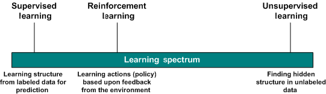
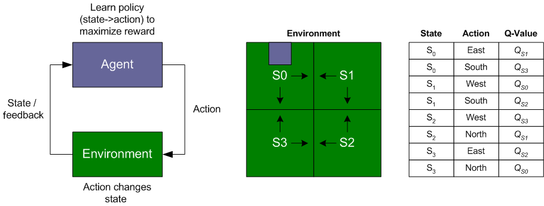
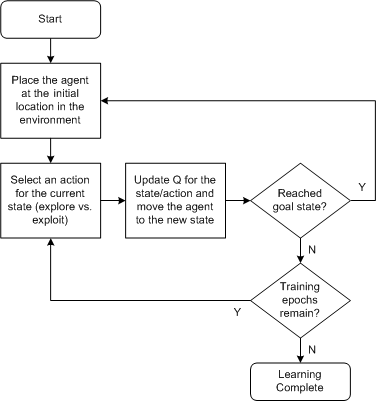

# 通过强化学习训练软件代理执行合理行为
使用此机器学习技术来识别环境中状态的操作

**标签:** 人工智能

[原文链接](https://developer.ibm.com/zh/articles/cc-reinforcement-learning-train-software-agent/)

M. Tim Jones

发布: 2017-12-27

* * *

_强化学习_ 是机器学习的一个子领域，您可以使用强化学习训练软件代理在环境中执行合理行为。基于代理在环境中执行的操作，给代理提供奖励。一个学习示例来自 1992 年，当时 IBM 的 Gerry Tesauro 使用强化学习构建了一个西洋双陆棋自学程序。本文将探讨强化学习，您可以用它解决的一些问题领域，还将使用一个简单模拟来演示该技术。

许多机器学习算法都属于以下两种类别中的一种：无监督学习或监督学习。在无监督学习中，算法基于未标记数据的基础结构对数据进行分组，使数据更容易理解。无监督学习的一个示例是 k-means 聚类算法，该算法将具有最接近均值的数据划分到一个集群中。另外一种学习类型是监督学习。在监督学习中，会通过一个映射函数将一组输入变量映射到一组预定义的输出变量（旨在粗略估计用于预测的新输入数据）。将此过程分类为监督学习是因为，一个算法使用输入数据和输出数据来训练映射函数。神经网络是监督学习的一个示例。

强化学习不同于这些学习方法，但更接近于监督学习。在强化学习中，通过对操作的累积奖励或惩罚来学习状态与操作的映射。映射是在线发生的，通过平衡探索（尝试给定状态的新操作）与利用（使用状态/操作映射的现有知识）来实现。希望得到的结果是一个最佳的状态操作映射策略，该策略最大化了某方面的整体奖励，如下图所示。



首先快速回顾一下强化学习的发展历史。然后，我将展示一个强化学习的样本实现 – 具体来讲，将展示 Q-learning 技术。

## 强化学习的发展历史

强化学习起源于动物心理学：通过试错进行学习。早期的人工智能 (AI) 研究人员认为，此机制可以在机器中实现，并用于学习如何将状态（环境）映射到操作。Marvin Minsky 在 1951 年构建了强化学习的最早示例，模仿老鼠学习如何走出迷宫（通过代表模拟鼠脑的 40 个神经元的电子管来实现）。在机器鼠走出迷宫时，就会基于它的逃离能力来强化这些突触。

40 年后，强化学习取得了一定的成功。1992 年，IBM 研究人员 Gerald Tesauro 使用强化学习开发了一个名为 _TD-Gammon_ 的西洋双陆棋下棋程序。Tesauro 使用了时间差分学习（称为 _TD lambda_）来训练一个由 80 个隐藏单元组成的神经网络。 _TD-Gammon_ 在不具备比赛知识的情况下学会了西洋双陆棋，通过自己下棋积累专业技能。 _TD-Gammon_ 的棋艺达到了顶级人类棋手的水平，而且发现了新的下棋策略。

IBM 将强化学习应用到了 IBM Watson® 中，后者是一个能理解自然语言并使用自然语言进行应答的问答系统。具体来讲，IBM 将强化学习应用到了 IBM Watson 参加 Jeopardy! 比赛的策略上，比如是否尝试回答一个问题（基于它构想出的答案和确定性），在棋盘上选择哪个方格，以及如何在比赛中下注（尤其是在两场连赌比赛中）。IBM Watson 在 2011 年击败了前 Jeopardy! 冠军。

2016 年，Google 应用强化学习构建了一个 _围棋_ 程序。由于可能的棋着非常多（在 19×19 的棋盘上使用两种棋子）， _围棋_ 程序被公认很难开发。国际象棋中的开局方式有 20 种可能选择，但 _围棋_ 有 361 种可能的开局方式。Google 的 _AlphaGo_ 的学习方法是，分析专业棋手的棋着，然后自己下棋来提升专业技能（虽然它现在完全靠自己下棋进行训练）。通过使用深度强化学习， _AlphaGo_ 击败了韩国 _围棋_ 大师。

## Q-learning

现在让我们看看一种称为 _Q-learning_ 的强化学习，然后构建一个简单模拟应用程序来演示它。

考虑二维世界中的一个代理。这个世界由代理可以占用的单元格（状态）组成。每个状态中包含代理可以执行的操作 — 也就是说，朝 4 个方向中的一个方向移动到新单元格。在该代理移动时，它可以获得奖励（或者在未来基于这次初始移动而获得奖励）。根据此奖励，它可以为一个状态分配该操作的优先级，以便在未来优先考虑该状态（因为代理的目标是获得最大的奖励）。然后，学习过程会确认每个状态的最佳操作（提供最高奖励的操作）。确定给定状态的操作策略就是学习过程。

在 Q-learning 中，会为每一个状态操作对分配一个 _Q_ 值，该值表示一个 _Q_ 值函数计算的强化的总和。代理在探索环境时会执行此工作。当某个特定操作在给定状态下执行时，就会收到奖励，而且它会更新 _Q_ 值来让状态操作对记住此结果。随着代理不断移动，状态操作对的 _Q_ 值得以改进，以便以后（在学习后）代理可以对给定状态应用最佳操作（根据它的 _Q_ 值）。请注意，在学习期间，代理可能依据概率为给定状态选择某个操作（作为每个操作的 _Q_ 值与 _Q_ 值总和之间的一个函数）。此过程允许代理为给定状态首选一个操作（以应用它学到的知识），但有时会选择一个非最佳操作来进行探索，如下图所示。



_Q_ 值函数包含可用来调整其操作的两个因素。第一个是 _学习速率_ (alpha)，它定义了一个新 _Q_ 值将在多大程度上覆盖旧值。值 0 表示代理不会学习任何知识（旧信息至关重要），值 1 表示新发现的信息是唯一重要的信息。另一个因素称为 _折扣系数_ (gamma)，它定义了未来奖励的重要性。值 0 表示仅考虑短期奖励，值 1 表示更加重视长期奖励。选择一次移动（一个给定状态的操作）后，会使用当前的 _Q_ 值和来自目标状态的 _奖励_ 和 _最大 Q_ 值来更新该操作的 _Q_ 值，如下图所示。


状态操作对策略是分多个片段进行创建的。当代理达到最终状态时，该片段结束并可以开始一个新片段。训练也可以按阶段进行限定（代理在环境中的步数）。请注意，未进入的状态和未尝试的操作不会记录在状态操作表中。如果一个代理未探索状态空间的某个部分，它不会知道那里会有怎样的奖励（或惩罚）在等着它。在包含大型状态空间的问题中，可能无需探索完整个状态空间就能找到解决方案。下图中的简单流程演示了 Q-learning 中的学习过程。



从该流程图，我们可以看到一个简单的 Q-learning 实现，其中一个代理学习在一个充满障碍物的环境进行导航，以便找到奖励。

## 样本实现

此样本实现可在 GitHub 上找到。在这个简单实现中，我创建了一个有 20×20 个单元格的环境。每个单元格可能包含一个障碍物（比如一堵墙或无法穿过的物体）、空地（奖励值为 0）和目标单元格（奖励值为 1）。代理从左上角的单元格开始前进，然后使用 Q-learning 找到通往目标的最佳路径，该路径会在学习过程结束时显示出来。

让我们首先看看我对此 Q-learning 实现使用的重要结构。第一个是状态操作结构，它包含给定状态的操作的 _Q_ 值。 `MAX_ACTIONS` 符号表示一个代理可在任何给定状态下执行的 4 个操作（0 = 北、1 = 东、2 = 南、3 = 西）。 `QVal` 表示 4 个操作中每个操作的 _Q_ 值， `QMax` 是最大的 _Q_ 值（用于在代理使用其所学知识时确定最佳路径）。此结构已针对环境中的每个单元格进行了实例化。我们还创建了一个环境，用各种字符来表示它（ `|` 、 `+` 、 `-` 、 `#` 表示障碍物； `' '` 表示空地； `$` 表示目标状态）：

```
typedef struct {
double QVal[ MAX_ACTIONS ];  // Q-value for each action.
double QMax;                 // Maximum Q-value.
} stateAction_t;
stateAction_t stateSpace[ Y_MAX ][ X_MAX ];
char environment [ Y_MAX ][ X_MAX ]={};

```

Show moreShow more icon

首先看看顶部的 `main` 函数。该函数实现了 Q-learning 循环，在该循环中，代理随机尝试操作；更新 _Q_ 值；在一定的步数后显示找到的通往目标的最佳路径：

```
int main()
{
pos_t agent = start;

srand( time( NULL ) );

// Init the state/action Q data
initStateSpace( );

// Iterate a maximum number of steps.
for ( int epochs = 0 ; epochs < MAX_EPOCHS ; epochs++ )
{
      // Select an action for the agent based on the desired policy.
      int action = ChooseAgentAction( &agent, EXPLORE );

      // Update the agent based upon the action.
      UpdateAgent( &agent, action );
}

// Show the agent's path
ExecuteAgent( );

return 0;
}

```

Show moreShow more icon

接下来， `ChooseAgentAction` 函数根据想要的策略（探索与利用）为代理选择下一个操作。对于利用策略，该函数将会确认具有最大 _Q_ 值的操作并返回该操作。此选择代表了该状态的最佳操作，并模仿代理利用其知识快速移动到目标。对于探索策略，我获取一个随机操作，如果该操作是一个合法操作（将代理移向目标或空地，而不是将它移向障碍物），则返回它。另一种探索方法是按照 `QVal` 的函数根据概率来选择操作（使用 `QVal` 作为状态的 _Q_ 值总和的概率）：

```
int ChooseAgentAction( pos_t *agent, int actionSelection )
{
int action;

// Choose the best action (largest Q-value)
if ( actionSelection == EXPLOIT )
{
      for ( action = 0 ; action < MAX_ACTIONS ; action++ )
      {
         if ( stateSpace[ agent->y ][ agent->x ].QVal[ action] ==
              stateSpace[ agent->y ][ agent->x ].QMax )
         {
            break;
         }
      }
}
// Choose a random action.
else if ( actionSelection == EXPLORE )
{
      do
      {
        action = getRand( MAX_ACTIONS );
      } while ( !legalMove( agent->y, agent->x, action ) );
}

return action;
}

```

Show moreShow more icon

在此模拟中，我要介绍的最后一个函数称为 `UpdateAgent` ，它实现了 Q-learning 算法的核心部分。请注意，我们为此函数提供了想要的操作（一个移动方向），我使用该操作来确定要进入的下一个状态。从环境中提取来自此状态的奖励，然后用它来计算来自当前状态的更新 _Q_ 值（并缓存 `QMax` 值，以防它发生更改）。如果进入的新状态是目标状态，则将代理恢复为初始状态来重新启动学习过程：

```
void UpdateAgent( pos_t *agent, int action )
{
int newy = agent->y + dir[ action ].y;
int newx = agent->x + dir[ action ].x;
double reward = (double)getReward( environment[ newy ][ newx ] );

// Evaluate Q value
stateSpace[ agent->y ][ agent->x ].QVal[ action ] +=
     LEARNING_RATE *
      ( reward + ( DISCOUNT_RATE * stateSpace[ newy ][ newx ].QMax) -
                 stateSpace[ agent->y ][ agent->x ].QVal[ action ] );

CalculateMaxQ( agent->y, agent->x );

// Update the agent's position
agent->x += dir[ action ].x;
agent->y += dir[ action ].y;

// If agent has reached the goal, move it back to the initial state
if ( ( agent->x == goal.x ) && ( agent->y == goal.y ) )
{
      agent->x = start.x; agent->y = start.y;
}

return;
}

```

Show moreShow more icon

这一小段代码（以及可以在 GitHub 上查看的其他一些代码）为此演示实现了 Q-learning 技术。可以使用 `make` 编译该代码，然后使用程序名 `qlearn` 运行它。下图展示了该代码的输出和表示为 `.` 字符的选中路径。我在 `ExecuteAgent` 函数（未显示）的上下文中执行了此代码，该函数采用利用策略来选择最佳路径：

```
$ ./qlearn

+ - - - - - - - - - - - - - - - - - - +
| ..             # # #   # # # # #   |
|   .   # # #     # # #   # # # # #   |
| # .     # # #           #   # #     |
| # .       # # # # # # # #           |
| # .       # # # # # # # #   # #     |
|   .   # # #         # #     # # #   |
|   .# # # # #       # #     # # #   |
|   .# #                       # #   |
|   ........   # # #   # # #   |
|   #       # # # .   # # #   # # # # |
| # # #     # # # ...# #   # $ ..|
| # # #   # # # #     ....# # # .|
| # # #     # # #   # # # # .# # # .|
| # # #       # #   # # #   ..# # .|
| # #           #   #       # .# # .|
| #       # #           # # # .# # .|
|       # # # #         # # # ....|
|       # # # # #                     |
+ - - - - - - - - - - - - - - - - - - +

$

```

Show moreShow more icon

## 结束语

强化学习的灵感来源于行为心理学，是一种有用的机器学习技术，您可以用它来确定针对环境中的各种状态的操作。该方法允许代理学习如何在环境中进行交互，以获得一定的累积奖励。本文探讨了 Q-learning，在该学习方法中，算法不需要模型即可理解环境并构建一个操作选择策略。可以使用此方法解决大量问题。

另一种强化学习方法是“状态-操作-奖励-状态-操作”，该方法与 Q-learning 非常相似。二者都类似于学习分类器系统，都会为复杂的解决方案空间构建依赖于上下文的规则。

时间差分学习是强化学习中的一种预测方法，它也基于可从环境中的观察值学到预测结果的概念。但是，时间差分学习的各种变体可以更新以前的状态操作 _Q_ 值，而不只是当前值。

时间差分学习源自 Arthur Samuel 的工作（他因在 IBM® 701 平台上为一个下棋程序开发了 AI 而闻名），并因 IBM 的 Gerald Tesauro 在 1992 年开发了 _TD-Gammon_ 而继续在游戏领域得到发展。Google 通过 DeepMind 延续了这一趋势，后者使用了深度强化学习学会了 49 种 Atari 2600 游戏，并在 23 种游戏中击败了人类棋手（比如 Atari _Breakout_）。在此模型中，棋手看到的视频游戏图像被应用于机器学习算法，该算法向游戏发出下一步的指令（比如移动玩家）。

本文翻译自： [Train a software agent to behave rationally with reinforcement learning](https://developer.ibm.com/articles/cc-reinforcement-learning-train-software-agent/)（2017-11-11）