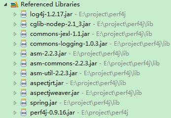
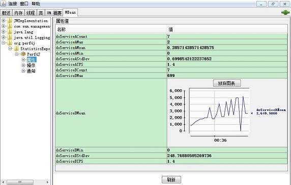

# 通过日志监控并收集 Java 应用程序性能数据
如何集成 Perf4j 到 Java 应用程序中并生成性能数据

**标签:** Java

[原文链接](https://developer.ibm.com/zh/articles/j-lo-logforperf/)

商涛, 姚黎

发布: 2012-11-26

* * *

## 引言

系统日志是应用程序问题诊断及运行维护的重要工具。Logback、Log4j 是常用于 Java 平台的日志记录 API. 目前大部分产品只是将系统重要参数、状态的变化及异常信息通过日志输出。本文将要介绍的 Perf4j 是一款专门用于 Java 服务器端代码计时、记录日志和监控结果的开源工具包。Perf4j 对常用日志工具包进行了扩展，能够将得到的原始性能数据进行统计并发布到可定制的输出源，如控制台、日志文件、JMX 等。Perf4j 提供了多种方式与 Java 代码集成，开发和系统维人员能够灵活地将 Perf4j 的 API 嵌入到各种不同架构的应用程序中。

Perf4j 目前依托于开源项目协作平台 Codehaus 进行文档及代码管理，下一步该项目计划迁移到 Github 平台，以便更多的社区及开发人员可以参与到开发及维护中来。Perf4j 欢迎使用者提出新的功能需求并且鼓励将定制或扩展的代码贡献到 Perf4j 源码中。本文中示例代码使用的 Perf4j 版本是 0.9.16，读者需在下载类包或配置 Maven 时留意。

阅读文章之前，您要对 Java 注解、JMX、面向方面编程有一些了解。特别是 JConsole 的使用及 Spring AOP 的配置方式要较为熟悉。

文章首先阐明在何种应用场景下应优先考虑使用 Perf4j。然后是具体讲解 Pef4j 与应用程序的集成方式。最后会介绍如何将收集的数据生成便于分析的可视化图表。

## 应用场景

在 Java 平台上遇到性能问题时，如 CPU 占用过高、系统响应缓慢，通常的分析方法是使用 JVM 剖析工具在系统瓶颈临界点前一段时间抓取 CPU 占用分布，再对 CPU 占用率最高的几个方法排查。Perf4j 的优势在于能够持续跟踪统计所关注功能代码的执行效率，对于前后两个版本出现较大差异的方法进行深入分析，可以在开发周期中尽早发现问题。Perf4j 还可以用在产品环境中，从运营的早期开始，将其统计的数据做为系统的性能和健康指标长期监测。

首选 Perf4j 的应用场景：

- Java 本地代码调用（JNI）
- 分布式系统、集群部署
- 面向服务体系结构（SOA）
- 远程方法调用（RMI）

开发人员必须将本地方法、远程方法及 Web services 的性能问题隔离出来，以防干扰对 Java 应用程序本身的分析。通过日志记录则是最简单的方式；采用分布式架构或集群部署的系统相对复杂，不同的网络环境、基础硬件和操作系统的差异、虚拟主机中资源与配置的差异等造成很难采用统一的工具来监测代码级别的性能指标。而日志记录则可以轻松加入到各种程序中，且是资源与时间成本最低的方式。Perf4j 提供了 CSV 格式的转换工具，开发人员可以借助第三方工具方便地将统计结果汇总分析。

## 集成到应用程序

下面将分两种方式具体讲述如何利用 Per4j 提供的 API。在实际的项目中，应根据现有的程序框架及监测目的灵活选择。另外，针对 WebSphere 应用服务器的自有日志系统，还必须采取额外的措施来确保 Perf4j 的正常工作。

### 对代码段计时

Perf4j 中 org.perf4j.StopWatch 是整个 API 中的基础工具。这是一个封装良好的计时器。可以把 StopWatch 嵌入到代码中任何地方。这种方式往往使得复杂的方法得到分解，从而有利于精确定位问题的根源。以下通过清单 1 和清单 2 来介绍其具体用法。

##### 清单 1.StopWacth 基本用法

```
public static void basicStopWatch() throws InterruptedException{
    // 创建 StopWacth 时开始计时，之后也可以用 stopWatch.start() 重新设定计时开始时间点
    StopWatch stopWatch = new StopWatch("TransactionA");
    // 执行需要计时的代码
    Thread.sleep(2 * 1000L);
    String result = stopWatch.stop();
    System.out.print(result);
}

```

Show moreShow more icon

清单 1 中最后输出的结果示例：start[1340442785756] time[1995] tag[TransactionA]。在构造函数中设定 tag[TransactionA] 用来区分不同的业务逻辑，可以把它看成是性能分析中的事务（Transaction）。

如果需要将多段代码分开统计，可采用 LoggingStopWatch 类的 lap() 方法定义多个事务。

##### 清单 2.LoggingStopWatch 用法

```
public static void loggingStopWacth() throws InterruptedException{
    LoggingStopWatch stopWatch = new LoggingStopWatch();
    // 设定阈值，小于此阈值的结果将不会被记录下来
    stopWatch.setTimeThreshold(1*1000L);
    Thread.sleep(2 * 1000L);
    // 停止当前计时，开始新的起始时间点
    stopWatch.lap("TransactionB");
    Thread.sleep(500L);
    stopWatch.stop("TransactionC");
}

```

Show moreShow more icon

清单 2 中使用了 LoggingStopWatch 类，其 stop() 方法只是将执行时间数据通过 System.err.println() 输出。若与 Log4j 框架集成，则需要使用 LoggingStopWatch 的子类 Log4JStopWatch, 目前 Perf4j 还支持 Apache Commons Logging、java.util.logginLogback，对应使用 CommonsLogStopWatch、 JavaLogStopWatch、Slf4JStopWatch。

以 Log4j 为例，在 Log4j.xml 中要为 Log4JStopWatch 加入异步输出源 AsyncCoalescingStatisticsAppender。尽量使专用于 Perf4JAppender 的 fileAppender，从而保证记录的性能数据输出到独立的日志文件中。

##### 清单 3.Log4j 配置文件

```
<appender name="Perf4jAppender"
     class="org.perf4j.log4j.AsyncCoalescingStatisticsAppender">
     <!--  TimeSlice 用来设置聚集分组输出的时间间隔，默认是 30000 ms,
     在产品环境中可以适当增大以供减少写文件的次数 -->
<param name="TimeSlice" value="10000" />
     <appender-ref ref="fileAppender" />
</appender>

<appender name="fileAppender" class="org.apache.log4j.FileAppender">
     <param name="File" value="perfermanceData.log" />
     <layout class="org.apache.log4j.PatternLayout">
         <param name="ConversionPattern" value="%m%n" />
     </layout>
</appender>
<!--  Perf4j 默认用名称为 org.perf4j.TimingLogger 的 Logger -->
<logger name="org.perf4j.TimingLogger" additivity="false">
     <level value="INFO" />
     <appender-ref ref="Perf4jAppender" />
</logger>

```

Show moreShow more icon

清单 3 中设置了 TimeSlice 为 10 秒， Perf4jAppender 则以 10 秒为采样间隔，统计后按时间分组输出。清单 4 中是一个采样单位的数据。

##### 清单 4\. 日志输出数据示例

```
Performance Statistics   2012-07-02 21:45:30 - 2012-07-02 21:45:40
Tag                   Avg(ms)     Min        Max        Std Dev      Count
LogicalBlock1      1997.0         1997          1997         0.0                 1
LogicalBlock2 499.0    499     499        0.0                 1

```

Show moreShow more icon

### 对方法计时

若要避免 Perf4j 与系统的紧耦合，不在程序中加入额外的第三方代码，还可以借助面向方面编程（AOP），通过简单的配置在运行中动态地对指定的方法计时。Perf4j 对常用的 AOP 工具如 AspectJ 及 Spring AOP 均提供了良好支持 . 在此主要介绍下 Per4j 与后者集成的配置方式。

首先确保工程中已有如图 1 中的 Jar 包：

##### 图 1\. 必需引入的 Lib



其次在 Spring 的配置文件（一般是 applicationContext.xml 或 spring-config.xml）中加入  及申明 org.perf4j.log4j.aop.TimingAspect 做为 。具体配置参考清单 5：

##### 清单 5.Spring AOP 申明

```
<aop:config>
    <aop:aspect id="timing" ref="timingAspect">
    <aop:pointcut id="timingcut"
    expression="execution(* cn.test.perf4j.example..*.*(..)) and @annotation(profiled)"/>
    <aop:around pointcut-ref="timingcut" method="doPerfLogging"/>
    </aop:aspect>
</aop:config>
<bean id="timingAspect" class="org.perf4j.log4j.aop.TimingAspect"/>
<!-- 用户自定义任意的业务处理类 -->
<bean id="processService" class="cn.test.perf4j.example.ProcessService" />

```

Show moreShow more icon

其中切入点  的表达式（expression）中包的作用域可以按实际需求进行修；@annotation(profiled) 会把 @org.perf4j.aop.Profiled 做为参数传给 TimingAspect，在此则不能删除此条件。当然还可以采用  替换  复杂的配置，在 org.perf4j.log4j.aop.TimingAspect 的父类 ProfiledTimingAspect 中已用注解定义过全局的切入点。 具有更大的灵活性，可以任意设置监测的范围，建议产品环境使用。

运行时如果遇到如下异常：

“ _The matching wildcard is strict, but no declaration can be found for element ‘aop:config’_ ”

说明之前没有设置过 AOP 的命名空间，在 xsi:schemaLocation 最后加相对应版本的 URI 即可。

##### 清单 6\. 加入 spring-aop-x.x.xsd 的 URI

```
<beans xmlns="http://www.springframework.org/schema/beans"
        xmlns:xsi="http://www.w3.org/2001/XMLSchema-instance"
        xmlns:context="http://www.springframework.org/schema/context"
        xmlns:aop="http://www.springframework.org/schema/aop"
        xsi:schemaLocation="http://www.springframework.org/schema/beans
        http://www.springframework.org/schema/beans/spring-beans-2.5.xsd
        http://www.springframework.org/schema/context
        http://www.springframework.org/schema/context/spring-context-2.5.xsd
        http://www.springframework.org/schema/aop
     http://www.springframework.org/schema/aop/spring-aop-2.5.xsd">

```

Show moreShow more icon

现在如果要记录包 cn.test.perf4j.example 下某些方法的执行时间，只需在方法签名加上注解 @Profiled。org.perf4j.aop.Profiled 也提供了细颗粒度的定制。具体属性设置方法如下 :

##### 清单 7\. 注解 Profiled 设置

```
/** 1. 默认以方法名做标记 tag 的名称 */
@Profiled
public void doService(){...}

/** 2.  自定义标记 tag 的名称并设定阈值 */
@Profiled(tag=”doTimedService”,timeThreshold =500L )
public void doService(){...}

```

Show moreShow more icon

其它支持的属性还有：

boolean el : tag 和 message 的设置是否支持 Java EL 表达式语法；

String level : 设定日志级别；

boolean logFailuresSeparately : 若为真，正常和异常抛出的执行时间数据将分开统计；

Sring logger : log4.xml 中设置的 logger 名称。如果是默认值，则此属性可省去。

在产品环境中，不方便重新编译代码，建议使用 ScopedTimingAspect，完全通过配置文件控制监测的范围，不用在方法上加 Profiled 注解。具体用法可以参考 AspectJ 的用法。另外如果系统已采用 EJB3，可以把 org.perf4j.log4j.aop.EjbTimingAspect 做为拦截器加入。具体可以参考有关 EJB3@Interceptors 的用法。

### 在 WebSphere 应用服务器中使用 Perf4j

WebSphere 应用服务器默认使用基于 JDK 中 java.util.logging 的日志 API 并且集中管理了整个系统的日志输出。Perf4j 必须单独生成自己的数据文件，以便于分析。如果应用程序要部署到 WebSphere 应用服务器中，如下方法能够帮助我们将 Perf4j 记录的日志独立出来。

1. 指定 LogFactory 实现类：

在 /META-INF/services 目录中创建名为 org.apache.commons.logging.LogFactory 的文件，在文件中分别设定相对 Log4j 的配置，内容为 org.apache.commons.logging.impl.Log4j；还有一种方式是在 classpath 下创建 commons-logging.properties 文件，文件内容为：

```
priority=1

org.apache.commons.logging.LogFactory=org.apache.commons.logging.impl.LogFactoryImpl

org.apache.commons.logging.Log=org.apache.commons.logging.impl.Log4JLogger

```

Show moreShow more icon

1. 在 Admin 控制台中，选择 Applications > Enterprise Applications > ”app name” ，设定 ClassLoader 的模式为 PARENT\_LAST。

2. 将之前配置的 log4j.xml 同样放在 classpath 下。在 log4j.xml 中只须设定 Perf4jAppender。程序其它调用 java.util.logging 的日志仍由 WebSphere 统一控制。


## 生成可视化数据

目前我们已经可以得到 Perf4j 生成的原始数据，不过为了易于分析这些数据，方便直观地将统计结果展现出来才是我们最终需要的。这里介绍的两种方式均是利用 Perf4j 提供的特定 Appender 来发布数据到相应可视化工具。

### 通过 Java 管理扩展接口发布

Java 管理扩展接口（JMX）常用来监控 JVM 的运行状态以及动态管理配置系统。

通过 JmxAttributeStatisticsAppender 能将数据封装成标准的 JMX 管理构件的 MBean。配置见清单 8。

##### 清单 8\. 添加 JMX Appender

```
<appender name="Perf4jAppender"
     class="org.perf4j.log4j. AsyncCoalescingStatisticsAppender">
     <appender-ref ref="fileAppender" />
     <appender-ref ref="perf4jJmxAppender"/>
</appender>
<appender name="perf4jJmxAppender"
class="org.perf4j.log4j.JmxAttributeStatisticsAppender">
    <!-- 设定要发布的事务   -->
    <param name="TagNamesToExpose" value="doServiceA,doServiceB"/>
    <!--  设定阈值 此处为 doServiceA 的最小值超过 200ms 才发布出去。
    若设定范围可用区间表示，如 (200-500) -->
    <param name="NotificationThresholds" value="doServiceAMin(>200)"/>
</appender>

```

Show moreShow more icon

JConsole 是 Oracle JDK 自带的的 JMX 监控工具，当然也有很多第三方 JMX 工具可供选择。图 2 是 JConsole 界面的截图，显示了 Perf4j MBean 具体内容及图表。

##### 图 2.JConsole 实时显示 Perf4j MBean



### 通过 GraphingServlet 生成统计图

这种方式需要用到 AsyncCoalescingStatisticsAppender，通过其记录的是每个时间片各事务的执行时间统计信息，在此还要加上 GraphingStatisticsAppender，将指定的监测指标数据单独抽出，再由 Perf4j 的 GraphingServlet 展现在页面上。一般可做为子页面加入到系统管理界面中。清单 9 中只是加入了一个用于生成平均执行时间图示的 Appender 做为示例，当然 Perf4j 也允许加入多个 GraphingStatisticsAppender 以同时显示不同指标的数据。

##### 清单 9\. 加入生成可视化数据的 Appender

```
<appender name="Perf4jAppender"
     class="org.perf4j.log4j. AsyncCoalescingStatisticsAppender">
     <appender-ref ref="fileAppender" />
     <appender-ref ref="meanExecutionTime"/>
</appender>
<appender name="meanExecutionTime"
          class="org.perf4j.log4j.GraphingStatisticsAppender">
    <param name="GraphType" value="Mean"/>
    <param name="TagNamesToGraph" value="doServiceA,doServiceB"/>
    <appender-ref ref="meanTimeFileAppender"/>
</appender>

```

Show moreShow more icon

在 GraphType 中可以设定的性能指标有平均执行时间（Mean）、最长执行时间（Max）、最短执行时间（Min）、执行时间标准差（StdDev）、执行次数（Count）和 每秒事务处理量（TPS）。TagNamesToGraph 是可选项，用来指定需要输出的事务，如果不设定则会输出全部事务。

同时在 web.xml 中还要加入 GraphingServlet 的映射。如清单 10。

##### 清单 10\. 在 web.xml 中配置 GraphingServlet

```
<servlet>
    <servlet-name>perf4jMonitor</servlet-name>
    <servlet-class>org.perf4j.log4j.servlet.GraphingServlet</servlet-class>
    <init-param>
        <param-name>graphNames</param-name>
      <!-- 此处设置清单 9 中配置的 Appender 名称 -->
        <param-value>meanExecutionTime,executionTPS</param-value>
    </init-param>
</servlet>
<servlet-mapping>
    <servlet-name>perf4jMonitor</servlet-name>
    <url-pattern>/perf4jMonitor</url-pattern>
</servlet-mapping>

```

Show moreShow more icon

至此在系统的运行过程中，访问 /perf4jMonitor 就可以实时的观测指定事务的性能数据图示。

## 结束语

本文介绍了配置与使用 Perf4j 的诸多细节。在实际项目中，我们还应该设计一个易扩展的体系结构，使第三方 API 能轻易加入。如果只是用 Perf4j 协助发现性能问题的源头，开发人员可采用临时代码中嵌入 StopWatch 类的方式。若是计划长期对系统性能跟踪，应设计一个完善的日志框架集成方案，能够轻易地将 Perf4j 无缝的加入和脱离尤为重要。

尽管 Perf4j 中使用的是异步的输出源，在大量用户并发的性能测试和产品环境下，额外的 CPU 内存占用也是不容忽视的。因此务必确保 Perf4j 只用于对性能跟踪及瓶颈分析，而不要用于对系统负载能力的评估。