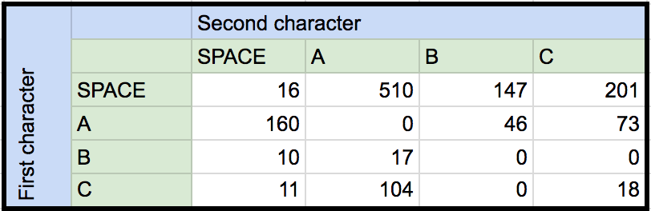

# 针对 AI 的字母关联和简单语言统计
对自然语言特征进行建模来支持生成式人工智能的技术

**标签:** 人工智能

[原文链接](https://developer.ibm.com/zh/articles/cc-patterns-artificial-intelligence-part1/)

Uche Ogbuji

发布: 2018-05-08

* * *

近年来，随着人工智能和认知计算的发展，人们对各种分类器系统的关注越来越多。分类器系统在寻找模式来确定某个事物属于某一类型的给定概率。然后，可以基于这个分类来运行简单的规则和操作。例如，如果某种信用卡交易模式被划分为“可疑”的概率超过 80%，就会发出欺诈警报。或者，如果自动驾驶汽车摄像头中的某种形状和运动模式看起来像是一个路障，就会按刹车。

这些技术非常重要，但 AI 的能力远不止这些。事实上，作为 AI 的标志性里程碑，图灵测试不仅要求机器识别模式，还要求机器像人类一样生成自己的活动模式。

这不仅仅是一个理论上的问题。一些最新的 AI 应用（比如聊天机器人）在实践中遇到了困难，因为它们与人的交互太呆板了。人们对生成式 AI 技术越来越感兴趣，该技术从一种已学到的模式模型开始，并使用这些模型来尝试生成对模式的模仿。这不仅使 AI 应用程序更灵活、对客户更友好，而且更加高效。生成式 AI 技术通常很快将注意力集中到描绘真实世界的部分模式特征上，并允许对数据集进行优化。

要理解生成式技术如何将 AI 提升到新的高度，理解它们的基础知识很重要。经典的关注领域仍是最有趣的领域之一：自然语言。

## 打字机上的猴子

20 世纪 20 年代，Sir Arthur Eddington 在剑桥大学的演讲中表达了一个古老而有趣的想法。他的想法是，如果让一群猴子在打字机上连续敲击，并等待足够长的时间，那么它们有一定的概率创作出莎士比亚的所有作品。换言之，在任意足够长的随机生成的字母序列中，您最终会找到熟悉的语言。当然，在猴子使用打字机的情况下等待足够长的时间，可能意味着等待数万亿年的时间。生成熟悉语言的真正随机字母串的概率太小了。

但是，如果猴子不是使用普通的打字机，而是使用受到操纵的打字机，敲击某个键的概率取决于这个字母在熟悉的语言中出现的频率，那会怎么样呢？E 是英语中最常见的字母，其他常见字母包括 T、A、N 和 I。如果猴子敲击这些键的可能性比敲击其他键更高一些，可能会提高生成熟悉语言的概率。

在这种情况下，每个猴子的打字机都可以充当您希望这群猴子模仿的熟悉语言的一种模型。但是，要构造这些模型，您需要观察熟悉语言样本中的模式。该模型就像神经网络或其他学习系统的训练模型一样。在了解如何利用这些模型生成语言之前，必须先学习如何构造它们。

## 基本字母频率

下面的代码清单是一个 Python 程序（为 Python 3 而编写），它接受一个文本文件，并计算每个字母在该文件中出现的频率。

##### charcounter1.py

```
import sys
import pprint

def count_chars(input_fp, frequencies, buffer_size=1024):
    '''Read the text content of a file and keep a running count of how often
    each character appears.

    Arguments:
        input_fp -- file pointer with input text
        frequencies -- mapping from each character to its counted frequency
        buffer_size -- incremental quantity of text to be read at a time,
            in bytes (1024 if not otherwise specified)

    Returns:
        nothing
    '''
    #Read the first chunk of text
    text = input_fp.read(buffer_size)
    #Loop over the file while there is text to read
    while text:
        for c in text:
            #Accommodate the character if seen for the first time
            frequencies.setdefault(c, 0)
            #Increment the count for the present character
            frequencies[c] += 1
        #Read the next chunk of text
        text = input_fp.read(buffer_size)

    return

if __name__ == '__main__':
    #Initialize the mapping
    frequencies = {}
    #Pull the input data from the console
    count_chars(sys.stdin, frequencies)
    #Display the resulting frequencies in readable format
    pprint.pprint(frequencies)

```

Show moreShow more icon

我为它提供了“ [聪明的数据，第 1 部分](https://www.ibm.com/developerworks/cn/cognitive/library/cc-cognitive-big-brained-data-pt1/index.html)”的文本，这是我在 2017 年发表的一篇 developerWorks 教程。在 Linux 上，我按以下方式运行它。

```
python charcounter1.py < bigbraineddata1.txt

```

Show moreShow more icon

这是输出中的一些片段。

```
{'\n': 109,
' ': 3740,
'"': 22,
"'": 32,
'(': 11,
')': 11,
',': 189,
'-': 26,
'.': 146,
'0': 9,
'1': 8,
'2': 11,
...
'9': 2,
':': 2,
'?': 4,
'A': 63,
'B': 6,
'C': 11,
'D': 7,
'E': 6,
'F': 10,
'G': 7,
'H': 14,
'I': 69,
...
'W': 3,
'Y': 13,
'a': 1618,
'b': 255,
'c': 646,
'd': 613,
'e': 2152,
'f': 421,
'g': 372,
'h': 782,
'i': 1388,
...
'y': 291,
'z': 14,
'é': 1,
'—': 2}

```

Show moreShow more icon

一些东西立刻引起了我的注意。问题陈述听起来很简单，但自然语言总是带来一系列复杂问题。出现频率最高的不是一个字母，而是空格字符。空格字符和字母频率一样，也是语言模型的一个重要组成部分。机器模仿语言也必须模仿单词间距的用法。它或许还应该模仿其他标点符号的用法，您在输出中也可以看到这些标点符号。

如果聊天机器人的所有回复都只有一行，那么它的模型可能不需要包含换行符。在某些操作系统上，可能需要对表示新行的不同回车/换行字符约定进行规范化。

在实际应用程序中，可能还需要考虑来自 Unicode 的重音字符和其他字符。

### 大写化

您还需要决定您的模型是否需要区分大小写字母。假设您想要从该模型生成具有正常的大小写约定的语言，为此，您可能需要单独使用大写和小写统计数据。您还可以对语言生成进行编码，在句点后、在特殊情况下（比如一个单独的字母“i”），以及使用一组典型的专有名词时，将字母转换为大写字母。随着统计数据变得更加复杂，结合使用大小写可以为模型节省大量存储空间。从现在开始，在本教程系列中，我将在所有语言模型中将大写字母转换为小写。

可以在上面的频率中看到大写在语言中的一些意义。在小写字母中，“e”是目前最常见的字母。对于大写字母，最常见的前 3 个字母依次是“I”、“A”和“T”。当然，“I”来自第一人称代词。“E”可能是英语中最常见的字母，但它在单词的开头并不常见，这意味着它不太可能出现在句首的大写中。相反，有大量的“A”和“T”来自不定冠词和定冠词。

[charcounter2.py](#charcounter2-py) 是 [charcounter1.py](#charcounter1-py) 的一个根据上述观察稍微进行了调整的版本。

##### charcounter2.py

```
import sys
import pprint
import string

ALLOWLIST_CHARACTERS = string.ascii_lowercase + ' '

def count_chars(input_fp, frequencies, allowlist=ALLOWLIST_CHARACTERS,
                    buffer_size=1024):
    '''Read the text content of a file and keep a running count of how often
    each character appears.

    Arguments:
        input_fp -- file pointer with input text
        frequencies -- mapping from each character to its counted frequency
        allowlist -- string containing all characters to be included in the stats
            defaults to all lowercase letters and space
        buffer_size -- incremental quantity of text to be read at a time,
            in bytes (1024 if not otherwise specified)

    Returns:
        nothing
    '''
    #Read the first chunk of text, and set all letters to lowercase
    text = input_fp.read(buffer_size).lower()
    #Loop over the file while there is text to read
    while text:
        for c in text:
            if c in ALLOWLIST_CHARACTERS:
                #Accommodate the character if seen for the first time
                frequencies.setdefault(c, 0)
                #Increment the count for the present character
                frequencies[c] += 1
        #Read the next chunk of text, and set all letters to lowercase
        text = input_fp.read(buffer_size).lower()

    return

if __name__ == '__main__':
    #Initialize the mapping
    frequencies = {}
    #Pull the input data from the console
    count_chars(sys.stdin, frequencies)
    #Display the resulting frequencies in readable format
    pprint.pprint(frequencies)

```

Show moreShow more icon

这是完整输出：

```
{' ': 3740,
'a': 1681,
'b': 261,
'c': 657,
'd': 620,
'e': 2158,
'f': 431,
'g': 379,
'h': 796,
'i': 1457,
'j': 14,
'k': 99,
'l': 739,
'm': 511,
'n': 1267,
'o': 1419,
'p': 408,
'q': 37,
'r': 1110,
's': 1294,
't': 1762,
'u': 556,
'v': 183,
'w': 256,
'x': 57,
'y': 304,
'z': 14}

```

Show moreShow more icon

## 字母序列

在本系列第三篇教程中，我将演示如何基于这样一种简单的频率映射，从一个模型生成语言的各种结果。但是，您可能会想，要获得一个可以生成类似熟悉语言的模型，需要做更多的工作。

下一步不仅要考虑某个给定字母或字符出现的频率，还要考虑一个给定字母后面出现另一个字母的频率。例如，字母”e”后面常常跟随着字母”d”，因为这种组合在英语的过去式中很常见。您经常会在字母”t”后发现字母”h”，因为这两个字母是定冠词的开头两个字母。这些频率给出了一个字母与可能出现在它后面的字母之间的关联。

可以在一个二维矩阵中以数学方式来记录字母关联频率。 [矩阵子集](#矩阵子集) 是一个演示了这个矩阵的子集的表格，其中包含“聪明的数据”教程中涉及空格、a、b 和 c 的序列出现的频率。

##### 矩阵子集



[矩阵子集](#矩阵子集) 表明，“a”作为单词开头的有 160 次（空格后跟“a”），作为单词结尾的有 510 次。序列“ca”很常见，出现了 104 次，而序列“aa”、“bc”和“bb”从未出现过。显然，我在该教程中没有提及冒泡排序算法。

当然，将这样一个矩阵表示为数据结构的方法有许多。您可以使用多维数组，分配一个内存空位来存储表中每个单元中的频率。整个数组需要 27\*27 即 729 个内存空位。每个字母和每侧的空格占一个空位。您还可以创建从每个字母序列到其频率的映射，省略频率为 0 的关联。在有多个空白单元时，这可能更高效，这类排列称为稀疏矩阵。

请注意，用于记录各个字母频率的映射也是一种矩阵表示，该矩阵是一维的，而不是二维的。

## 计算双字母组频率

包含一起处理的两个字母的这种序列有一个技术名称。它们称为 _双字母组_。 [矩阵子集](#矩阵子集) 中的矩阵显示了双字母组的频率，比如“ab”和“ba”的频率分别为 46 和 17。

在编写代码来计算这些序列时，我没有使用 [charcounter1.py](#charcounter1-py) 和 [charcounter2.py](#charcounter2-py) 中的低级别 Python 代码，而是使用了一个流行的 Python 库 – 自然语言工具包 (NLTK)。它有一些处理双字母组的有用例程。

##### count\_bigrams.py

```
import sys
from collections import Counter
import pprint

from nltk.util import bigrams
from nltk.tokenize import RegexpTokenizer

#Set up a tokenizer which only captures lowercase letters and spaces
#This requires that input has been preprocessed to lowercase all letters
TOKENIZER = RegexpTokenizer("[a-z ]")

def count_bigrams(input_fp, frequencies, buffer_size=1024):
    '''Read the text content of a file and keep a running count of how often
    each bigram (sequence of two) characters appears.

    Arguments:
        input_fp -- file pointer with input text
        frequencies -- mapping from each bigram to its counted frequency
        buffer_size -- incremental quantity of text to be read at a time,
            in bytes (1024 if not otherwise specified)

    Returns:
        nothing
    '''
    #Read the first chunk of text, and set all letters to lowercase
    text = input_fp.read(buffer_size).lower()
    #Loop over the file while there is text to read
    while text:
        #This step is needed to collapse runs of space characters into one
        text = ' '.join(text.split())
        spans = TOKENIZER.span_tokenize(text)
        tokens = (text[begin : end] for (begin, end) in spans)
        for bigram in bigrams(tokens):
            #Increment the count for the bigram.Automatically handles any
            #bigram not seen before.The join expression turns 2 separate
            #single-character strings into one 2-character string
            frequencies[''.join(bigram)] += 1
        #Read the next chunk of text, and set all letters to lowercase
        text = input_fp.read(buffer_size).lower()

    return

if __name__ == '__main__':
    #Initialize the mapping
    frequencies = Counter()
    #Pull the input data from the console
    count_bigrams(sys.stdin, frequencies)
    #Uncomment the following line to display all the resulting frequencies
    #in readable format
    #pprint.pprint(frequencies)
    #Print just the 20 most common bigrams and their frequencies
    #in readable format
    pprint.pprint(frequencies.most_common(20))

```

Show moreShow more icon

要在 Python 3 上运行此代码，必须安装 NLTK。要安装本教程系列中的代码的所有预备工具，可以通过以下命令使用 GitHub 存储库中的 requirements.txt 文件：

```
pip install -r requirements.txt

```

Show moreShow more icon

我还使用了来自标准库的 Python 类 `collections.Counter`。输出仅包含 20 个最常见的双字母组，如下所示。

```
[('e ', 656),
('s ', 591),
(' t', 581),
(' a', 510),
('th', 458),
('in', 376),
('t ', 351),
('d ', 330),
(' i', 326),
('he', 308),
('at', 302),
('n ', 298),
('er', 287),
(' o', 283),
('an', 273),
('re', 256),
(' s', 245),
('on', 235),
('or', 233),
('ti', 210)]

```

Show moreShow more icon

例如，“e”是在单词末尾最常见到的字母，“t”是单词开头最常见的字母。统计数据开始反映出，英语的模式比各个字母的计数更重要一些。

## 添加维度

如果记录双字母序列的频率提供了比单字母序列更有用的洞察，那么分析三字母序列或许会得到更多的洞察。知道“the”、“and”、“ing”和“ed”很常见，这很有用。这些称为三字母组。

单字母序列需要一个一维矩阵，也称为一阶矩阵。如果完整地存储它，而不采用稀疏矩阵技术，则需要 27 个存储单元，用于存储 26 个字母加上空格的频率。双字母组是二维的或二阶的。它需要 729 个单元才能完整存储。一个包含三字母序列的矩阵是三阶的，具有三个维度。完整存储它需要 27 _27_ 27 即 19,683 个单元。您可以开始看到利弊了。更高阶的矩阵提供了更多的统计洞察，但代价是需要的存储空间要多得多。

由 N 个字母组成的一般序列称为 N 字母组，需要一个 N 维或 N 阶矩阵。如果完整地存储，则需要 27^N 个单元，所需单元呈指数级增长。4 阶矩阵需要 531,441 个单元才能实现完整存储。如果每个单元 32 位，允许计数高达约 40 亿，那么需要的总存储空间约为 2 MB。当然，可以通过使用稀疏矩阵技术来显著减少存储需求，本教程中的所有代码都是这样做的。

为了趣味和完整性，甚至还有一个 0 阶矩阵的概念。这就是输入文本中所有字母的总数。

### 计算 N 字母组

下面是一个用于计算任何任意阶的 N 字母组的程序。

##### count\_ngrams.py

```
import sys
from collections import Counter
import pprint

from nltk.util import ngrams
from nltk.tokenize import RegexpTokenizer

#Set up a tokenizer which only captures lowercase letters and spaces
#This requires that input has been preprocessed to lowercase all letters
TOKENIZER = RegexpTokenizer("[a-z ]")

def count_ngrams(input_fp, frequencies, order, buffer_size=1024):
    '''Read the text content of a file and keep a running count of how often
    each bigram (sequence of two) characters appears.
    Arguments:
        input_fp -- file pointer with input text
        frequencies -- mapping from each bigram to its counted frequency
        buffer_size -- incremental quantity of text to be read at a time,
            in bytes (1024 if not otherwise specified)
    Returns:
        nothing
    '''
    #Read the first chunk of text, and set all letters to lowercase
    text = input_fp.read(buffer_size).lower()
    #Loop over the file while there is text to read
    while text:
        #This step is needed to collapse runs of space characters into one
        text = ' '.join(text.split())
        spans = TOKENIZER.span_tokenize(text)
        tokens = (text[begin : end] for (begin, end) in spans)
        for bigram in ngrams(tokens, order):
            #Increment the count for the bigram.Automatically handles any
            #bigram not seen before.The join expression turns 2 separate
            #single-character strings into one 2-character string
            frequencies[''.join(bigram)] += 1
        #Read the next chunk of text, and set all letters to lowercase
        text = input_fp.read(buffer_size).lower()

    return

if __name__ == '__main__':
    #Initialize the mapping
    frequencies = Counter()
    #The order of the ngrams is the first command line argument
    ngram_order = int(sys.argv[1])
    #Pull the input data from the console
    count_ngrams(sys.stdin, frequencies, ngram_order)
    #Uncomment the following line to display all the resulting frequencies
    #in readable format
    #pprint.pprint(frequencies)
    #Print just the 20 most common N-grams and their frequencies
    #in readable format
pprint.pprint(frequencies.most_common(20))

```

Show moreShow more icon

可以在命令行上传入阶数。例如，要获得 5 阶 N 字母组的频率，可以运行以下代码：

```
python count_ngrams.py 5 < bigbraineddata1.txt

```

Show moreShow more icon

输出仅包含 20 个最常见的 5 字母组，如下所示：

```
[(' the ', 184),
(' and ', 102),
(' that', 64),
('that ', 63),
(' you ', 54),
(' data', 50),
('s of ', 49),
('data ', 49),
('tion ', 47),
(' for ', 45),
(' of t', 43),
('ation', 42),
('ning ', 39),
(' are ', 38),
('of th', 36),
('f the', 35),
('this ', 34),
('e of ', 33),
(' this', 32),
('n the', 30)]

```

Show moreShow more icon

我们发现一些重要的模式，比如“data”、冠词、常用单词前缀和后缀等词汇的共性。统计数据现在开始捕获输入文本的特征词汇和风格。

### 对阶数有用性的限制

现在观察将阶数提高到 7 阶时会发生什么。

```
$ python count_ngrams.py 7 < bigbraineddata1.txt
[(' of the', 32),
('of the ', 27),
(' algori', 21),
('algorit', 21),
('lgorith', 21),
('gorithm', 21),
('aining ', 20),
('s that ', 20),
(' learni', 19),
('learnin', 19),
('earning', 19),
(' traini', 19),
('trainin', 19),
('raining', 19),
(' machin', 17),
('machine', 17),
('arning ', 17),
('in the ', 17),
('achine ', 16),
('e learn', 16)]

```

Show moreShow more icon

乍一看，这看起来非常棒。本教程的词汇模式通过统计数据开始真正显现出来。显然，有大量词汇在谈论如何对机器和算法进行训练，从而学习一些东西。但这里存在一个微妙的问题。即使是最常见的 N 字母组也变得越来越少。最常见的双字母组出现了 656 次。最常见的 5 字母组出现了 184 次。最常见的 7 字母组出现了 32 次。

如果仅考虑最高阶的 N 字母组，它们与输入文本的属性之间的关联可能变得特别脆弱。事实证明，当尝试拼凑语言来生成熟悉的文字时，统计的价值会被稀释。这实际上是 AI 中的一个普遍问题，我们目前存储和分析越来越复杂模型的能力是一把双刃剑。人们越来越难以通过这种从如此多的杂草中寻找幼苗的模式，生成对各种情形都很有用的响应。

对这些情形有所帮助的一件事依赖于现代社会的另一个优势。利用更大、更多样化的自然语言语料库创建模型，往往能够消除一些统计数据扭曲解读，同时提供足够丰富的内容来支持生成式 AI 技术。同样地，其他 AI 领域也不例外，在这些领域中，访问更高质量的训练数据至关重要。要获取关于我的教程中的数据的更多信息，请参阅“ [聪明的数据，第 1 部分：关注数据，以便最充分地利用人工智能、机器学习和认知计算](https://www.ibm.com/developerworks/cn/cognitive/library/cc-cognitive-big-brained-data-pt1/index.html)”。

## 结束语

您已经了解了如何从源文本收集统计数据，这是让机器生成使源文本读者感到熟悉的文字的第一步。因为让打字机上的猴子生成与熟悉文本类似的内容所花的时间可能比宇宙的年龄还要长，所以我们创建了一个模型来操纵打字机，让猴子敲击一个键的几率不是完全随机的，而是基于训练文本中的字母序列模型。我们已准备好让猴子坐在受到操纵的打字机上。

我们终将走到这一步，但在此之前，在下一篇教程中，我将深入研究 N 字母组和 N 字母组统计的迷人世界。现在我们已经拥有了这个重要工具，我们可以研究一系列重要应用，包括认知计算方面。

本教程中的代码使用了 Python。如果想要更加熟悉这种容易学习的编程语言，请参阅“ [Python 初学者指南](https://www.ibm.com/developerworks/cn/opensource/os-beginners-guide-python/index.html)”。

本文翻译自： [Letter correlation and simple language statistics for AI](https://developer.ibm.com/articles/cc-patterns-artificial-intelligence-part1/)（2018-03-20）