# 银行行销预测应用分析
IBM SPSS Modeler 决策树

**标签:** IBM SPSS Modeler,分析,金融

[原文链接](https://developer.ibm.com/zh/articles/ba-1412spssmodelerbank/)

林俞均, 賴秉宏, 袁璞

发布: 2014-12-08

* * *

## 引言

随着资讯科技的演进，如何通过方法有效的分析海量数据，并从其中找到有利的规格或资讯已经成为一种趋势。而决策树演算法是目前在进行数据分析时很常用的分类方法，本文将使用 IBM SPSS Modeler 进行实作，介绍决策树 (Decision tree) 演算法于银行行销领域的应用实例。IBM SPSS Modeler 包含多种决策树模型，包括 C5.0、C&R Tree、Quest、CHAID。首先，本文将会简介决策树演算法的基本原理，接着会针对案例数据 (网路公开电销数据) 进行初步的数据分析，并套入决策树模型中，分析、解释并讨论最后的结果。通过本文，您将会了解各种决策树演算法及其不同之处，针对不同数据特征选择适当决策树模型。

## 决策树演算法 (Decision Tree) 简介

### 决策树演算法的原理

决策树演算法是在进行数据挖掘时经常使用的分类和预测方法。

一个决策树的架构，是由三个部分所组成：叶节点 (Leaf Node)、决策节点 (Decision nodes) 以及分支 。决策树演算法的基本原理为：通过演算法中所规定的分类条件对于整体数据进行分类，产生一个决策节点，并持续依照演算法规则分类，直到数据无法再分类为止。

### 决策树演算法的比较

决策树演算法依据其演算原理以及可适用分析数据类型的不同延伸出多种决策树演算法。在 IBM SPSS Modeler 中，主要提供了四种常用的决策树演算法供使用者选择，分别为：C5.0、CHAID、QUEST 以及 C&R Tree 四种。使用者可依据数据类型以及分析需求的不同，选择适当的决策树演算法进行分析。虽然不同的决策树演算法有各自适用的数据类型以及演算架构等差异，但概括来说，决策树的主要原理均为通过演算法所定义的规则，对数据进行分类，以建立决策树。鉴于篇幅所限，以下部分将会针对这四类决策树演算法进行简单的介绍和比较，而详细演算法原理将不会在本文中详述。

**1\. C5.0**

由 C4.5 演化而来。此演算法的分类原理主要是利用资讯衡量标准 (Information Measure) 来构建决策树，并对每一个节点产生不同数目的分支来分割数据，直到数据无法分割为止。C5.0 的目标字段 (Target) 测量级别，不适用于连续类型 (Continuous) 的测量级别。而输入字段的数据型态则适用连续类型 (Continuous) 的测量级别。

**2\. CHAID (Chi-Square Automatic Interaction Detector)**

此演算法和前述的 C5.0 概念很像，均可以在每一个节点产生不同数目的分支来分割数据，用来建立决策树。但是在背后分类的原理则利用卡方分析检定 (Chi-square F test) 来进行分支，通过卡方检定来计算节点中的 P-value，来决定数据是否仍须进行分支。另外，CHAID 的目标字段 (Target) 的测量级别可适用于连续类型 (Continuous) 的测量级别，但在输入字段则只适用分类类型 (Categorical) 的测量级别。

**3\. QUEST (Quick Unbiased Efficient Statistical Tree)**

此演算法是利用统计方法分割数据，即以判定决策树是否仍需进行分支，以建立二元的决策树。QUEST 在变数的数据型态限制上，跟 C5.0 一样，目标字段 (Target) 测量级别，不适用于连续类型 (Continuous) 的测量级别。但在输入字段的测量级别则适用连续类型 (Continuous) 的测量级别。

**4\. C&R Tree (Classification and Regression Tree)**

又称为 CART，构建决策树的原理是使用 Gini Ratio 作为判定决策树是否仍须进行分支的依据，并建立二元的决策树。此演算法不管是在目标变数 (Target) 以及输入字段的测量级别均适用连续类型 (Continuous) 的测量级别做分析。

### 决策树演算法的选择

在使用决策树演算法进行分析之前，首要工作就是选择适当的演算法。一般来说，会根据所要分析数据的特性以及数据型态等选择初步的演算法。接下来再通过比较初步筛选的决策树分析出来的结果，选择最适合的决策树演算法。

## 银行电话行销数据栏位和特征分析

这次分析使用的数据是识别化的葡萄牙银行电销数据。电销的产品是银行的定存。电销的数据包括：

- 客户的基本数据：年龄、工作、教育等
- 客户的业务相关数据：是否破产、余额、房贷、个人信贷等
- 电销数据：连络方式、连络日期、次数、谈话时间，以及关键的电销结果

一般来说，业务相关数据及电销数据对我们预测相当重要，而客户的基本数据有时候并不重要，例如性别。但在此，年龄、工作、教育对一个人的收入等级连带的定存意愿可能有关联，所以进一步的分析是必要的。(请看图 1)

##### 图 1\. 银行电销数据概观 1

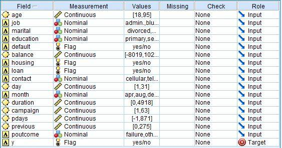

在模型建置前，首先要了解数据的组成。通过 Data Audit Node 中简单的图表及统计数据 (如图 2 所示)，我们可以察觉数据的异常、极端值。以年龄栏位为例，我们可以通过最大、最小及平均值，来观察有无异常分布。年龄 18~95 岁及平均 40 岁属于正常分布，所以不需要做特殊处理。其它栏位可以通过同样方式检视，以增加对客户数据的了解。

##### 图 2\. 银行电销数据概观 2 – Data Audit Node

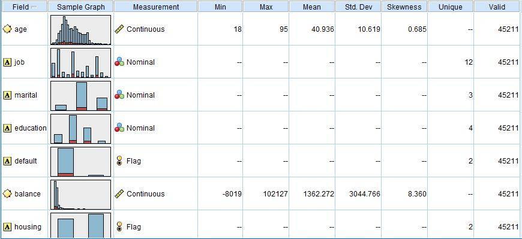

接下来我们选择几个代表性的栏位来分析电销结果在数据栏位间的分布。以客户职业为例，由图 3 可发现，学生、退休人员，及公司主管对定存产品的接受度较高。同时，我们也意外发现，失业者的定存接受度也相当高。而这些发现仍需再进一步的研究，才可解释其原因。但在此，将不多作探讨。

##### 图 3\. 银行客户职业与定存产品接受度之图表

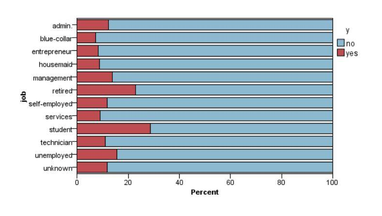

以年龄的分布来说，超过 60 岁的客户普遍对定存产品的接受度较高 (图 4)，因此，可以做为打电话的参考依据。然而，以单一面相来决定结果并非最理想，我们仍需要找寻跟其它栏位的关联性。

##### 图 4\. 银行客户年龄与定存产品接受度之图表

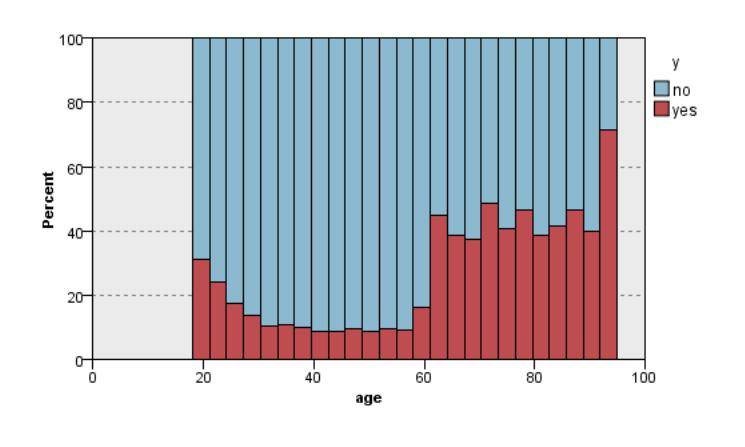

### 其它栏位的分析

此小节我们将简单的对其它栏位作分析。在业务数据上，许多栏位是连续类型的测量级别（Continuous），通过直方图，我们可以发现， **打电话的时间** 、 **月份** 、 **客户接电话的次数** 都会影响结果。这些栏位都是建立预测模型的重要参考依据。Modeler 也提供了网状图让我们了解栏位间的关联。例如由 **打电话的月份** 这个栏位，我们可以通过网状图评估月份对成功率的影响。

##### 图 5\. 银行最后一次致电客户的时间 (秒) 对定存产品接受度之图表

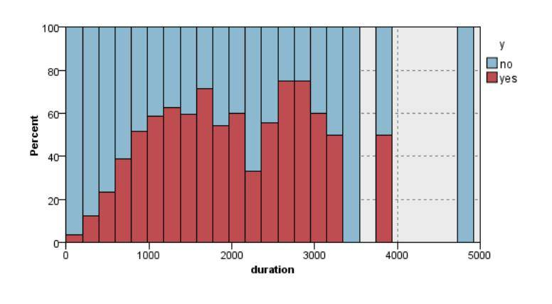

##### 图 6\. 与银行客户通话次数对定存产品接受度之图表

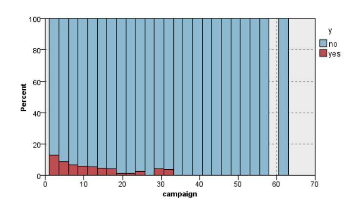

## 建立决策树模型串流

### 读取数据

SPSS Modeler 中需要根据数据档案格式，来选择不同的源节点读取数据。本篇文章中我们使用的数据档案格式为 .csv 档，因此我们将使用可变文件节点。在节点设定方面，文件标签下我们先读入数据”bank-full.csv”，接着勾选”读取文件中的字段名”和使用分号 (;) 做为字段定界符。此外，在多次反覆训练模型后，根据变量重要性的排序，我们在最后的模型选择移除相对较不重要的栏位，将会据此筛选出建模所需要的数据栏位：过滤标签下选取是否破产 (default) 、有无贷款 (loan) 等较无法预测结果的栏位。

##### 图 7\. 使用可变文件节点读取数据

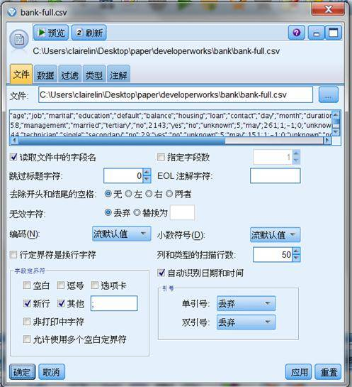

### 数据类型定义

为了产生决策树模型，我们需要在数据建模前就定义好各栏位的角色，也就是加入字段选项下的「类型」节点。将类型节点拉入串流后，我们会先点选读取值按钮，接着设定角色。在本案例中，栏位 y 是我们最后预测的目标，因此先将其角色设定为”目标”，余下的栏位则是要设定为”输入”。

### 数据分区

为了在训练出模型后能够分析模型准确度，在此我们将加入字段选项下的「分区」节点，将数据分为 50%训练数据以及 50%测试数据。在分区节点的编辑页中，点选预览可发现每笔数据已经多出了一个栏位「分区」，栏位中的值被随机归类为「1 _训练」及「2_ 测试」，让决策树节点可判别是否要使用此资料做为训练数据。在完成资料分区后，我们已经完成数据准备 (请见图 8)，可以套用决策树模型节点了。

##### 图 8\. 数据准备

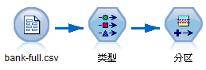

### 决策树节点设定

如我们第一章节所述，SPSS Modeler 共提供四种决策树节点建模，包括 C5.0、C&R 树、Quest 和 CHAID。考量到数据特性以及我们希望提供的决策树具有多元分类法，因此我们将建立 C5.0 和 CHAID 两种分类模型。

**C5.0 节点设定**

将 C5.0 节点与分区节点连结后，我们将于此节点编辑页面中的模型标签下设定相关的变数。以下为各变数的详细介绍，此定义来自 [SPSS Modeler 15 Modeling Nodes 文件](ftp://public.dhe.ibm.com/software/analytics/spss/documentation/modeler/15.0/zh_CN/ModelingNodes.pdf) 。

- 使用分区数据：如果定义了分区字段，则此选项可确保仅训练分区的数据用于构建模型。
- 为每个分割构建模型：给指定为分割字段的输入字段的每个可能值构建一个单独模型。
- 输出类型：在此指定希望结果模型块是决策树还是规则集。
- 组符号：如果选中此选项，C5.0 将试图组合输出字段中具有相似样式的符号值。如果未选中此选项，C5.0 将为用于分割父节点的符号字段的每个值创建一个子节点。
- 使用 boosting：C5.0 算法有一个特殊的方法用于提高其准确率，称为 boosting。它的工作原理是在序列中构建多个模型。第一个模型按常规方式进行构建。构建第二个模型时，将焦点集中于由第一个模型误分类的记录。构建第三个模型时，将焦点集中于第二个模型的错误，依此类推。最后，通过将整个模型集应用到观测值，并使用加权投票过程将单独的预测组合为一个总预测来分类观测值。推进可以显着提高 C5.0 模型的准确性，但也需要更长的训练时间。通过试验次数选项可以控制在推进模型过程中使用的模型数目。
- 交互验证：如果选中此选项，C5.0 将使用一组模型（根据训练数据的子集构建）来估计某个模型（根据全部数据集构建）的准确性。
- 专家模式\- 修剪严重性: 确定对决策树或规则集的修剪程度。增加该值可获得一个更简洁的小型树。减小该值可获得一个更精确的树。
- 专家模式\- 每个子分支的最小记录数：可使用子组的大小限制树的任何分支中的分割数。仅当两个或多个生成的子分支中至少包含从训练集合得到的这一最小记录数时，才可分割树的分支。默认值为 2。

根据我们的分析需求，此节点的设定如下：勾选使用分区数据、选择决策树输出类型、专家模式下的修剪严重性设定为 80、每个子分支的最小记录数 15。此设定考量到我们资料量较大，避免过度配适的情形发生。

**CHAID 节点设定**

将 CHAID 节点与分区节点连结后，我们将于此节点编辑页面中的模型标签下设定相关的变数。由于 CHAID 节点设定较多，以下将挑选我们有修改预设值的变数进行详细介绍。此定义来自 “SPSS Modeler 15 Modeling Nodes 文件”。

- 最大树深度：指定根节点以下的最大级数（递归分割样本的次数）。
- 修剪树以防止过拟合：修剪包括删除对于树的精确性没有显着贡献的底层分割。修剪有助于简化树，使树更容易被理解，在某些情况下还可提高广义性。
- 停止规则：设置最小分支大小可阻止通过分割创建非常小的子组。如果节点（父）中要分割的记录数小于指定值，则父分支中的最小记录数 将阻止进行分割。如果由分割创建的任意分支（子）中的记录数小于指定值，则 子分支中的最小记录数 将阻止进行分割。

根据我们的分析需求，此节点的设定如下：最大树深度选择自定义 8、勾选修剪树以防止过度拟合选项、停止规则选择使用绝对值、父分枝的中的最小记录数 50、父分枝的中的最小记录数 15。

### 生成决策树模型

决策树节点设定完成后，点击主工具列的运行当前流前即可看到两个决策树模型的产生。双击决策树模型则可看到模型结果，而我们最主要要观察的是模型标签及查看器标签下的内容。模型标签内容如图 9 所示，左栏位使用文字树状展开，表现每一阶层的分类状况及目标变数的模式；右栏位则是整体模型预测变量的重要性比较。我们也将会根据变量重要性调整模型设定、变数选择，持续的训练出较佳的模型。查看器标签则是将一样的决策树结果用树状图的方式展现。

##### 图 9\. 决策树模型结果

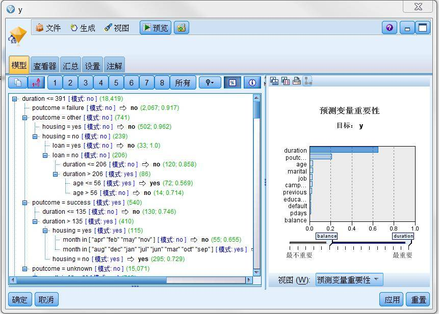

### 分析结果

在前面的串流产生中，我们加入了分区节点将数据分成训练数据与测试数据，因此在决策树模型产生后，可加入分析节点，完成的决策树串流如图 10 所示。分析节点中我们勾选重合矩阵选项，因此除了分析节点原本就提供的正确错误率比较，可进一步了解实际值与预测值的比较矩阵，如图 11。分析结果将于下一小节详述。

##### 图 10\. 决策树串流

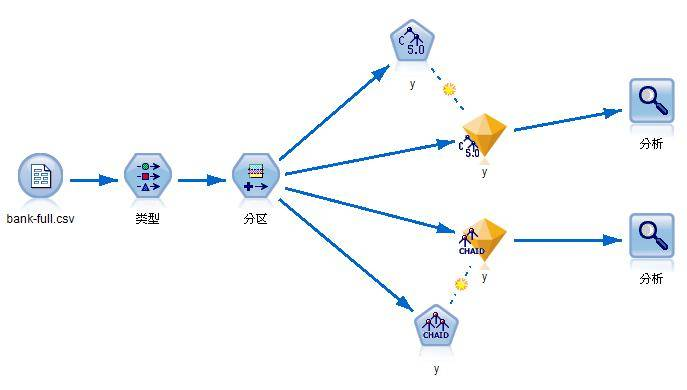

##### 图 11\. C5.0 决策树分析结果

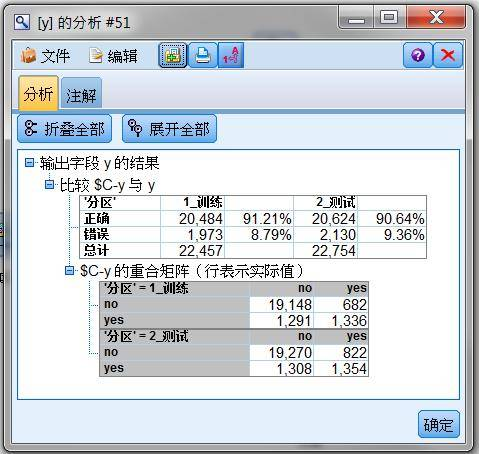

## 评估结果

### 比较决策树模型分析结果

**正确率**

由于各决策树的演算法不同，最后的分枝结果以及预测的准确性亦不同，本文使用 C5.0 及 CHAID 两种决策树节点，其预测正确率如图 11 和图 12 所示。从结果来看，不论是训练以及测试数据，C5.0 的正确率都高于 CHAID，因此接下来我们会使用 C5.0 结果为主。进一步观察实际值与预测值的重合矩阵，可发现模型预测不购买定存商品的准确性远高于预测将会购买的准确性，以 C5.0 测试数据来看，no 的预测准确性为 95.9%，远大于 yes 的 49.1%。

##### 图 12\. CHAID 决策树分析结果

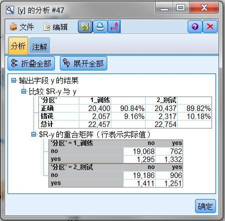

**变量重要性**

C5.0 与 CHAID 模型的变量重要性如图 13 所示。比较左边与右边的图可发现，尽管变量重要性的排序两个模型相差很大，但是最重要的两个分析变量「duration」和「poutcome」相同，且都比其他变量相对重要许多。

##### 图 13\. 变量重要性

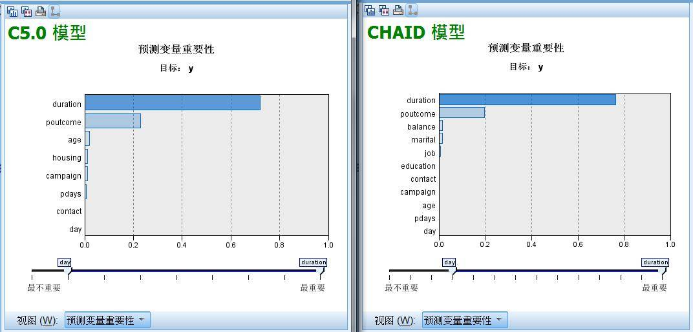

### 解读预测结果

**预测规则**

C5.0 决策树模型产生许多预测规则，而大部分的预测结果如同实际数据一样，都是不会购买定存产品。为了提高电销的成功率，银行人员可由这些规则来筛选目标。SPSS Modeler 提供的决策树结果，包括了分类结果、实例数字和置信度，当分类的实例置信度较高，则可导出预测规则。以图 14 为例，橘色底色的规则为「当 duration<=391，poutcome in [“failure””other”]，其预测结果是 no」，实例数字为 2808 笔数据符合，其中 91%被正确预测。

##### 图 14\. 模型结果

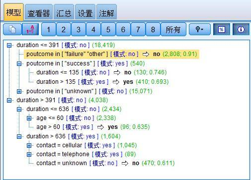

以下条列预测结果 (图 15，图 16) 为 yes 的规则及其实例数字和置信度（以 50%最低置性，及 100 最小实例数）：

##### 图 15\. 生成规则集

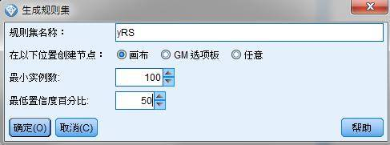

##### 图 16\. 规则集

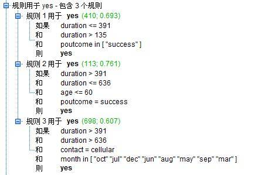

**利用图形节点了解重要预测值**

duration 和 poutcome 是刚刚得出的重要预测值。由直方图 (图 17) 来看，duration（与客户对谈时间）越长，成功率能大幅提升。超过 1000 秒的对谈时间，成功率能超过五成。以分布图 (图 18) 来观察 poutcome（上次行销结果），上次跟客户的成功交易，会大幅影响这次的结果。

##### 图 17\. duration 与客户接受银行商品意愿的关系图

##### 图 18\. poutcome 与客户接受银行商品意愿的关系图

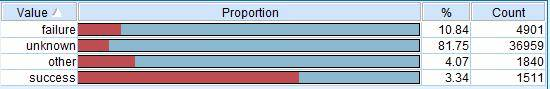

## 结束语

由本次分析的结果看来，电销中有适当的与客户的谈话时间 (>1000 秒)，及上次电销的成功率将会影响到本次电销的结果。由 Repeat customer 来着手，成功率会最明显提升。电销的谈话时间需要进一步的检视与客户对谈的实际内容，以设计吸引客户的话题。从 campaign(打电话) 次数来看，打给客户推销的次数越多，销售的效果越差。

公司在进行电销行动前也可以事先筛选客户，例如大于 60 岁或从事某一些职业 (学生、退休、主管等) 的客户设定为优先考虑。再来筛选财务状况。将基本的条件筛选完毕后，电销结果就会跟谈话的质量有关系。

## 相关主题

- 参考 [资料探勘原理与技术](https://books.google.com.tw/books?id=_WsOJoF6eMcC&pg=PT10&dq=%E8%B5%84%E6%96%99%E6%8E%A2%E5%8B%98%E5%8E%9F%E7%90%86%E4%B8%8E%E6%8A%80%E6%9C%AF&hl=zh-TW&sa=X&ei=McLtU7aICc2VyASUloBg#v=onepage&q=%E8%B5%84%E6%96%99%E6%8E%A2%E5%8B%98%E5%8E%9F%E7%90%86%E4%B8%8E%E6%8A%80%E6%9C%AF&f=false)：详细介绍资料探勘的基本原理和技术。
- 参考 [数据来源](http://archive.ics.uci.edu/ml/datasets/Bank+Marketing)：本文分析的数据来源，以及基本的资料探勘流程、模型的介绍。
- 参考 [SPSS Modeler 15 Modeling Nodes 文件](ftp://public.dhe.ibm.com/software/analytics/spss/documentation/modeler/15.0/zh_CN/ModelingNodes.pdf)：详细的介绍关于 SPSS Modeler 中，所有资料探勘模型的信息。
- 访问 developer [Information Management 技术主题](https://www.ibm.com/developerworks/cn/data/)，了解关于信息管理的更多信息，获取技术文档、how-to 文章、培训、下载、产品信息以及其他资源。