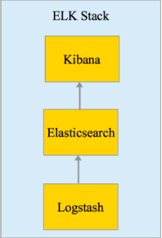
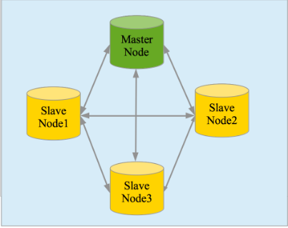
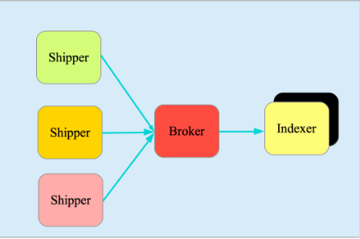
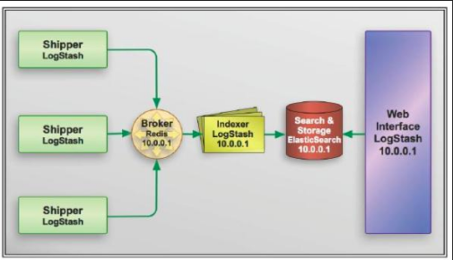
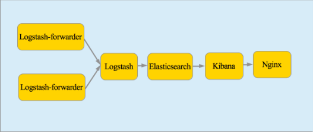
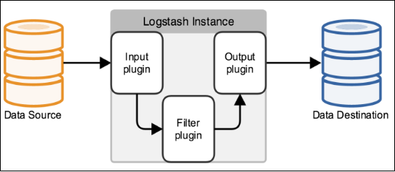
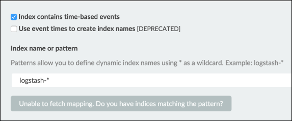
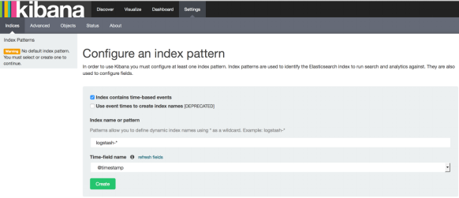
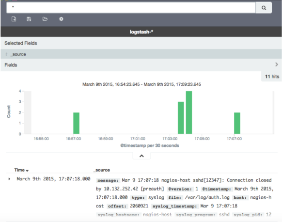

# 集中式日志系统 ELK 协议栈详解
协助你从日志中获得洞察

**标签:** 分析

[原文链接](https://developer.ibm.com/zh/articles/os-cn-elk/)

徐刚

发布: 2016-03-29

* * *

## 简介

在我们日常生活中，我们经常需要回顾以前发生的一些事情；或者，当出现了一些问题的时候，可以从某些地方去查找原因，寻找发生问题的痕迹。无可避免需要用到文字的、图像的等等不同形式的记录。用计算机的术语表达，就是 LOG，或日志。

日志，对于任何系统来说都是及其重要的组成部分。在计算机系统里面，更是如此。但是由于现在的计算机系统大多比较复杂，很多系统都不是在一个地方，甚至都是跨国界的；即使是在一个地方的系统，也有不同的来源，比如，操作系统，应用服务，业务逻辑等等。他们都在不停产生各种各样的日志数据。根据不完全统计，我们全球每天大约要产生 2EB（1018）的数据。

面对如此海量的数据，又是分布在各个不同地方，如果我们需要去查找一些重要的信息，难道还是使用传统的方法，去登陆到一台台机器上查看？看来传统的工具和方法已经显得非常笨拙和低效了。于是，一些聪明人就提出了建立一套集中式的方法，把不同来源的数据集中整合到一个地方。

一个完整的集中式日志系统，是离不开以下几个主要特点的。

- 收集－能够采集多种来源的日志数据
- 传输－能够稳定的把日志数据传输到中央系统
- 存储－如何存储日志数据
- 分析－可以支持 UI 分析
- 警告－能够提供错误报告，监控机制

## 市场上的产品

基于上述思路，于是许多产品或方案就应运而生了。比如，简单的 Rsyslog，Syslog-ng；商业化的 Splunk ；开源的有 FaceBook 公司的 Scribe，Apache 的 Chukwa，Linkedin 的 Kafak，Cloudera 的 Fluentd，ELK 等等。

在上述产品中，Splunk 是一款非常优秀的产品，但是它是商业产品，价格昂贵，让许多人望而却步。

直到 ELK 的出现，让大家又多了一种选择。相对于其他几款开源软件来说，本文重点介绍 ELK。

## ELK 协议栈介绍及体系结构

ELK 其实并不是一款软件，而是一整套解决方案，是三个软件产品的首字母缩写，Elasticsearch，Logstash 和 Kibana。这三款软件都是开源软件，通常是配合使用，而且又先后归于 Elastic.co 公司名下，故被简称为 ELK 协议栈，见图 1。

##### 图 1\. ELK 协议栈



### Elasticsearch

Elasticsearch 是一个实时的分布式搜索和分析引擎，它可以用于全文搜索，结构化搜索以及分析。它是一个建立在全文搜索引擎 Apache Lucene 基础上的搜索引擎，使用 Java 语言编写。目前，最新的版本是 2.1.0。

主要特点

- 实时分析
- 分布式实时文件存储，并将 **每一个字段** 都编入索引
- 文档导向，所有的对象全部是文档
- 高可用性，易扩展，支持集群（Cluster）、分片和复制（Shards 和 Replicas）。见图 2 和图 3
- 接口友好，支持 JSON

##### 图 2\. 集群



##### 图 3\. 分片和复制


### Logstash

Logstash 是一个具有实时渠道能力的数据收集引擎。使用 JRuby 语言编写。其作者是世界著名的运维工程师乔丹西塞 (JordanSissel)。目前最新的版本是 2.1.1。

主要特点

- 几乎可以访问任何数据
- 可以和多种外部应用结合
- 支持弹性扩展

它由三个主要部分组成，见图 4：

- Shipper－发送日志数据
- Broker－收集数据，缺省内置 Redis
- Indexer－数据写入

##### 图 4\. Logstash 基本组成



### Kibana

Kibana 是一款基于 Apache 开源协议，使用 JavaScript 语言编写，为 Elasticsearch 提供分析和可视化的 Web 平台。它可以在 Elasticsearch 的索引中查找，交互数据，并生成各种维度的表图。目前最新的版本是 4.3，简称 Kibana 4。

### ELK 协议栈体系结构

完整的 ELK 协议栈体系结构见图 5。基本流程是 Shipper 负责从各种数据源里采集数据，然后发送到 Broker，Indexer 将存放在 Broker 中的数据再写入 Elasticsearch，Elasticsearch 对这些数据创建索引，然后由 Kibana 对其进行各种分析并以图表的形式展示。

##### 图 5\. ELK 协议栈体系结构



ELK 三款软件之间互相配合使用，完美衔接，高效的满足了很多场合的应用，并且被很多用户所采纳，诸如路透社，脸书（Facebook），StackOverFlow 等等。

## ELK 的安装及配置

这一部分，我将描述一下如何安装配置 ELK 协议栈。

选取的实验平台为

- Ubuntu 14.04
- Centos 7.1

其中用到的软件如下

- Elasticsearch 使用的是 2.1.0
- Logstash 使用的是 2.1.1
- Kibana 使用的是 4.3.0
- 除此之外，还需要用到以下软件，Nginx，Logstash-forwarder 以及 JDK。

实验系统架构见图 6。

##### 图 6\. 实验系统架构



值得注意的是，在我们的实验中，使用了 Nginx 的反向代理，使得用户可以从外部访问到 Kibana，并且它本身具有负载均衡的作用，也能够提高性能。

特别还提到一下 Logstash-forwarder，这是一款使用 Go 语言编写的日志传输工具。由于 Logstash 是使用 Java 来运行，为了提升网络传输效率，我们并不在客户系统上面使用 Logstash 来传输数据。这款软件就是原来的 Lumberjack，今后慢慢将被 Elastic.co 公司的另外一款产品 Beat 吸收合并到 Filebeat 中，这个超出本文叙述的范畴，就不在这里详细讨论了。

### 具体安装过程如下

- 步骤 1\. 安装 JDK
- 步骤 2\. 安装 Elasticsearch
- 步骤 3\. 安装 Kibana
- 步骤 4\. 安装 Nginx
- 步骤 5\. 安装 Logstash
- 步骤 6\. 配置 Logstash
- 步骤 7\. 安装 Logstash-forwarder
- 步骤 8\. 最终验证

### 安装前的准备

1. 两台 64 位虚拟机，操作系统是 Ubuntu 14.04，2 CPU，4G 内存，30G 硬盘
2. 两台 64 位虚拟机，操作系统是 CentOS 7.1，2 CPU，4G 内存，30G 硬盘
3. 创建用户 elk 和组 elk，以下所有的安装均由这个用户操作，并授予 sudo 权限
4. 如果是 CentOS，还需要配置官方 YUM 源，可以访问 CentOS 软件包

**注意：** 以下所有操作都是在两个平台上完成。

### 步骤 1\. 安装 JDK

Elasticsearch 要求至少 Java 7。一般推荐使用 Oracle JDK 1.8 或者 OpenJDK 1.8。我们这里使用 OpenJDK 1.8。

**Ubuntu 14.04**

加入 Java 软件源（Repository）

```
$ sudo add-apt-repository ppa:openjdk-r/ppa

```

Show moreShow more icon

更新系统并安装 JDK

```
$ sudo apt-get update
$ sudo apt-get install openjdk-8-jdk

```

Show moreShow more icon

验证 Java

```
$ java -version
openjdk version "1.8.0_45-internal"
OpenJDK Runtime Environment (build 1.8.0_45-internal-b14)
OpenJDK 64-Bit Server VM (build 25.45-b02, mixed mode)

```

Show moreShow more icon

**CentOS 7.1**

**配置 YUM 源**

```
$ cd /etc/yum.repos.d
$ sudo vi centos.repo

```

Show moreShow more icon

**加入以下内容**

```
[base]
name=CentOS-$releasever - Base
mirrorlist=http://mirrorlist.centos.org/?release=$releasever&arch=$basearch&repo=os&infra=$infra
#baseurl=http://mirror.centos.org/centos/$releasever/os/$basearch/
gpgcheck=1
gpgkey=file:///etc/pki/rpm-gpg/RPM-GPG-KEY-CentOS-7
#released updates
[updates]
name=CentOS-$releasever - Updates
mirrorlist=http://mirrorlist.centos.org/?release=$releasever&arch=$basearch&repo=updates&infra=$infra
#baseurl=http://mirror.centos.org/centos/$releasever/updates/$basearch/
gpgcheck=1
gpgkey=file:///etc/pki/rpm-gpg/RPM-GPG-KEY-CentOS-7

```

Show moreShow more icon

**安装 JDK**

```
$ sudo yum install java-1.8.0-openjdk

```

Show moreShow more icon

**验证 Java**

```
$ java -version
openjdk version "1.8.0_65"
OpenJDK Runtime Environment (build 1.8.0_65-b17)
OpenJDK 64-Bit Server VM (build 25.65-b01, mixed mode)

```

Show moreShow more icon

### 步骤 2\. 安装 Elasticsearch

**Ubuntu 14.04**

**下载 Elasticsearch 软件**

```
$ wget https://download.elasticsearch.org/elasticsearch/release/org/elasticsearch/distribution/tar/elasticsearch/2.1.0/elasticsearch-2.1.0.tar.gz

```

Show moreShow more icon

**解压**

```
$ tar xzvf elasticsearch-2.1.0.tar.gz

```

Show moreShow more icon

文件目录结构如下：

```
$ pwd
/home/elk/elasticsearch-2.1.0
$ ls
bin config lib LICENSE.txt NOTICE.txt README.textile

```

Show moreShow more icon

**修改配置文件**

```
$ cd config
$ vi elasticsearch.yml

```

Show moreShow more icon

找到 # network.host 一行，修改成以下：

```
network.host: localhost

```

Show moreShow more icon

**启动 elasticsearch**

```
$ cd ../bin
$ ./elasticsearch

```

Show moreShow more icon

**验证 elasticsearch**

```
$ curl 'localhost:9200/'
{
"name" : "Surge",
"cluster_name" : "elasticsearch",
"version" : {
"number" : "2.1.0",
"build_hash" : "72cd1f1a3eee09505e036106146dc1949dc5dc87",
"build_timestamp" : "2015-11-18T22:40:03Z",
"build_snapshot" : false,
"lucene_version" : "5.3.1"
},
"tagline" : "You Know, for Search"
}

```

Show moreShow more icon

**CentOS 7.1**

步骤和上述 Ubuntu 14.04 安装完全一致

### 步骤 3\. 安装 Kibana

**Ubuntu 14.04**

**下载 Kibana 安装软件**

```
$ wget https://download.elastic.co/kibana/kibana/kibana-4.3.0-linux-x64.tar.gz

```

Show moreShow more icon

**解压**

```
$ tar xzvf kibana-4.3.0-linux-x64.tar.gz

```

Show moreShow more icon

文件目录结构如下：

```
$ pwd
/home/elk/kibana-4.3.0-linux-x64
$ ls
bin config installedPlugins LICENSE.txt node node_modules optimize
                               package.json README.txt src webpackShims

```

Show moreShow more icon

**修改配置文件**

```
$ cd config
$ vi kibana.yml

```

Show moreShow more icon

找到 # server.host，修改成以下：

```
server.host:"localhost”

```

Show moreShow more icon

**启动 Kibana**

```
$ cd ../bin
$ ./kibana
[...]
log [07:50:29.926] [info][listening] Server running at http://localhost:5601
[...]

```

Show moreShow more icon

**验证 Kibana**

由于我们是配置在 localhost，所以是无法直接访问 Web 页面的。

可以使用 netstat 来检查缺省端口 5601，或者使用 curl：

```
$ curl localhost:5601
<script>var hashRoute = '/app/kibana';
var defaultRoute = '/app/kibana';

var hash = window.location.hash;
if (hash.length) {
window.location = hashRoute + hash;
} else {
window.location = defaultRoute;
}</script>

```

Show moreShow more icon

**CentOS 7.1**

步骤和上述 Ubuntu 14.04 安装完全一致。

### 步骤 4\. 安装 Nginx

Nginx 提供了反向代理服务，可以使外面的请求被发送到内部的应用上。

**Ubuntu 14.04**

**安装软件**

```
$ sudo apt-get install nginx apache2-utils

```

Show moreShow more icon

**修改 Nginx 配置文件**

```
$ sudo vi /etc/nginx/sites-available/default

```

Show moreShow more icon

找到 server\_name，修改成正确的值。或者使用 IP，或者使用 FQDN。

然后在加入下面一段内容：

```
server {
listen 80;
server_name example.com;
location / {
proxy_pass http://localhost:5601;
proxy_http_version 1.1;
proxy_set_header Upgrade $http_upgrade;
proxy_set_header Connection 'upgrade';
proxy_set_header Host $host;
proxy_cache_bypass $http_upgrade;
｝
}

```

Show moreShow more icon

**注意** ：建议使用 IP。

**重启 Nginx 服务**

```
$ sudo service nginx restart

```

Show moreShow more icon

**验证访问**

`http://FQDN` 或者 `http://IP`

**CentOS 7.1**

**配置 Nginx 官方 yum 源**

```
$ sudo vi /etc/yum.repos.d/nginx.repo
[nginx]
name=nginx repo
baseurl=http://nginx.org/packages/centos/7/$basearch/
gpgcheck=0
enabled=1

```

Show moreShow more icon

**安装软件**

```
$ sudo yum install nginx httpd-tools

```

Show moreShow more icon

**修改 Nginx 配置文件**

```
$ sudo vi /etc/nginx/nginx.conf

```

Show moreShow more icon

检查是否 http 块（http{…}）含有下面这一行：

```
include /etc/nginx/conf.d/*conf

```

Show moreShow more icon

**为 Kibana 创建一个配置文件**

```
$ sudo vi /etc/nginx/conf.d/kibana.conf

```

Show moreShow more icon

加入以下这一段内容：

```
server {
listen 80;

server_name example.com;

location / {
proxy_pass http://localhost:5601;
proxy_http_version 1.1;
proxy_set_header Upgrade $http_upgrade;
proxy_set_header Connection 'upgrade';
proxy_set_header Host $host;
proxy_cache_bypass $http_upgrade;
}
｝

```

Show moreShow more icon

**注意** ：建议使用 IP。

**启动 Nginx 服务**

```
$ sudo systemctl enable nginx
$ sudo systemctl start nginx

```

Show moreShow more icon

**验证访问**

`http://FQDN` 或者 `http://IP`

### 步骤 5\. 安装 Logstash

**Ubuntu 14.04**

**下载 Logstash 安装软件**

```
$ wget https://download.elastic.co/logstash/logstash/logstash-2.1.1.tar.gz

```

Show moreShow more icon

**解压**

```
$ tar xzvf logstash-2.1.1.tar.gz

```

Show moreShow more icon

文件目录结构如下：

```
$ pwd
/home/elk/logstash-2.1.1

$ ls
bin CHANGELOG.md CONTRIBUTORS Gemfile Gemfile.jruby-1.9.lock lib LICENSE NOTICE.TXT vendor

```

Show moreShow more icon

**验证 Logstash**

```
$ cd bin
$ ./logstash -e 'input { stdin { } } output { stdout {} }'
Settings: Default filter workers: 1
Logstash startup completed

```

Show moreShow more icon

显示如下：

```
hello elk stack
2015-12-14T01:17:24.104Z 0.0.0.0 hello elk stack

```

Show moreShow more icon

说明 Logstash 已经可以正常工作了。按 **CTRL-D** 退出

**CentOS 7.1**

步骤和上述 Ubuntu 14.04 安装完全一致。

### 步骤 6\. 配置 Logstash

我们需要配置 Logstash 以指明从哪里读取数据，向哪里输出数据。这个过程我们称之为定义 Logstash 管道（Logstash Pipeline）。

通常一个管道需要包括必须的输入（input），输出（output），和一个可选项目 Filter。见图 7。

##### 图 7\. Logstash 管道结构示意



标准的管道配置文件格式如下：

```
# The # character at the beginning of a line indicates a comment. Use
# comments to describe your configuration.
input {
}
# The filter part of this file is commented out to indicate that it is
# optional.
#filter {
#}
output {
}

```

Show moreShow more icon

每一个输入/输出块里面都可以包含多个源。Filter 是定义如何按照用户指定的格式写数据。

由于我们这次是使用 logstash-forwarder 从客户机向服务器来传输数据，作为输入数据源。所以，我们首先需要配置 SSL 证书（Certification）。用来在客户机和服务器之间验证身份。

**Ubuntu 14.04**

**配置 SSL**

```
$ sudo mkdir -p /etc/pki/tls/certs etc/pki/tls/private
$ sudo vi /etc/ssl/openssl.cnf

```

Show moreShow more icon

找到 [v3\_ca] 段，添加下面一行，保存退出。

```
subjectAltName = IP: logstash_server_ip

```

Show moreShow more icon

执行下面命令：

```
$ cd /etc/pki/tls
$ sudo openssl req -config /etc/ssl/openssl.cnf -x509 -days 3650 -batch -nodes -newkey rsa:2048 -keyout
         private/logstash-forwarder.key -out certs/logstash-forwarder.crt

```

Show moreShow more icon

这里产生的 logstash-forwarder.crt 文件会在下一节安装配置 Logstash-forwarder 的时候使用到。

**配置 Logstash 管道文件**

```
$ cd /home/elk/logstash-2.1.1
$ mkdir conf
$ vi simple.conf

```

Show moreShow more icon

添加以下内容：

```
input {
lumberjack {
port => 5043
type => "logs"
ssl_certificate => "/etc/pki/tls/certs/logstash-forwarder.crt"
ssl_key => "/etc/pki/tls/private/logstash-forwarder.key"
}
}
filter {
grok {
match => { "message" => "%{COMBINEDAPACHELOG}" }
}
date {
match => [ "timestamp" , "dd/MMM/yyyy:HH:mm:ss Z" ]
}
}
output {
elasticsearch { hosts => ["localhost:9200"] }
stdout { codec => rubydebug }
}

```

Show moreShow more icon

**启动 Logstsh**

```
$ cd /home/elk/logstash-2.1.1/bin
$ ./logstash -f ../conf/simple.conf

```

Show moreShow more icon

**CentOS 7.1**

在 CentOS 7.1 上配置 Logstash，只有一步配置 SSL 是稍微有点不同，其他全部一样。

```
$ sudo vi /etc/pki/tls/openssl.cnf

```

Show moreShow more icon

找到 [v3\_ca] 段，添加下面一行，保存退出。

```
subjectAltName = IP: logstash_server_ip

$ cd /etc/pki/tls
$ sudo openssl req -config /etc/pki/tls/openssl.cnf -x509 -days 3650 -batch -nodes -newkey
         rsa:2048 -keyout private/logstash-forwarder.key -out certs/logstash-forwarder.crt

```

Show moreShow more icon

这里产生的 logstash-forwarder.crt 文件会在下一节安装配置 Logstash-forwarder 的时候使用到。

### 步骤 7\. 安装 Logstash-forwarder

**注意** ：Logstash-forwarder 也是一个开源项目，最早是由 lumberjack 改名而来。在作者写这篇文章的时候，被吸收合并到了 Elastic.co 公司的另外一个产品 Beat 中的 FileBeat。如果是用 FileBeat，配置稍微有些不一样，具体需要去参考官网。

**Ubuntu14.04**

**安装 Logstash-forwarder 软件**

**注意：** Logstash-forwarder 是安装在另外一台机器上。用来模拟客户机传输数据到 Logstash 服务器。

**配置 Logstash-forwarder 安装源**

执行以下命令：

```
$ echo 'deb http://packages.elastic.co/logstashforwarder/debian
                  stable main' | sudo tee /etc/apt/sources.list.d/logstashforwarder.list
$ wget -qO - https://packages.elastic.co/GPG-KEY-elasticsearch | sudo apt-key add -

```

Show moreShow more icon

**安装软件包**

```
$ sudo apt-get update
$ sudo apt-get install Logstash-forwarder

```

Show moreShow more icon

**配置 SSL**

```
$ sudo mkdir -p /etc/pki/tls/certs

```

Show moreShow more icon

把在步骤六中在 Logstash 服务器上产生的 ssl 证书文件拷贝到刚刚创建出来的目录下：

```
$ sudo scp user@logstash_server:/etc/pki/tls/certs/logstash_forwarder.crt /etc/pki/tls/certs/

```

Show moreShow more icon

**配置 Logstash-forwarder**

```
$ sudo vi /etc/logstash-forwarder.conf

```

Show moreShow more icon

在 network 段（”network”: {），修改如下：

```
"servers": [ "logstash_server_private_address:5043" ],
"ssl ca": "/etc/pki/tls/certs/logstash-forwarder.crt",
"timeout": 15

```

Show moreShow more icon

在 files 段（”files”: [），修改如下：

```
{
"paths": [
"/var/log/syslog",
"/var/log/auth.log"
],
"fields": { "type": "syslog" }
}

```

Show moreShow more icon

**启动 Logstash-forwarder**

```
$ sudo service logstash-forwarder start

```

Show moreShow more icon

**验证 Logstash-forwarder**

```
$ sudo service logstash-forwarder status
logstash-forwarder is running

```

Show moreShow more icon

如果有错误，则需要去/var/log/logstash-forwarder 目录下面检查。

**CentOS 7.1**

**配置 Logstash-forwarder 安装源**

执行以下命令：

```
$ sudo rpm --import http://packages.elastic.co/GPG-KEY-elasticsearch

$ sudo vi /etc/yum.repos.d/logstash-forwarder.repo

```

Show moreShow more icon

加入以下内容：

```
[logstash-forwarder]
name=logstash-forwarder repository
baseurl=http://packages.elastic.co/logstashforwarder/centos
gpgcheck=1
gpgkey=http://packages.elasticsearch.org/GPG-KEY-elasticsearch
enabled=1

```

Show moreShow more icon

存盘退出。

**安装软件包**

```
$ sudo yum -y install logstash-forwarder

```

Show moreShow more icon

剩余步骤和上述在 Ubuntu 14.04 上面的做法完全一样。

### 步骤 8\. 最后验证

在前面安装 Kibana 的时候，曾经有过验证。不过，当时没有数据，打开 Web 页面的时候，将如下所示：

##### 图 8\. 无数据初始页面



现在，由于 logstash-forwarder 已经开始传输数据了，再次打开 Web 页面，将如下所示：

##### 图 9\. 配置索引页面



点击创建按钮（Create），在选择 Discover，可以看到如下画面：

##### 图 10\. 数据展示页面



至此，所有部件的工作都可以正常使用了。关于如何具体使用 Kibana 就不在本文中加以描述了，有兴趣的同学可以参考官网。

## 结束语

限于篇幅，本文只是用一个相对简单的例子来阐述 ELK 协议栈在集中式日志的作用。在实际的工作中，其实他们都是可以相对自由组合，这些就不在本文介绍了。

另外，ELK 协议栈可以很方便的在大型生产系统中扩充集群以提高性能，比如，使用多个实例来增加 Logstash 的写入能力；如果单个节点的 Elasticsearch 满足不了读取，还可以采用 AMQP 技术来缓冲，等等。诸如此类的话题，希望有机会在以后的文章中讨论。

ELK 是一个不停发展的产品，希望能够通过本文帮助大家了解它们，并在今后的工作中深入理解。谢谢！