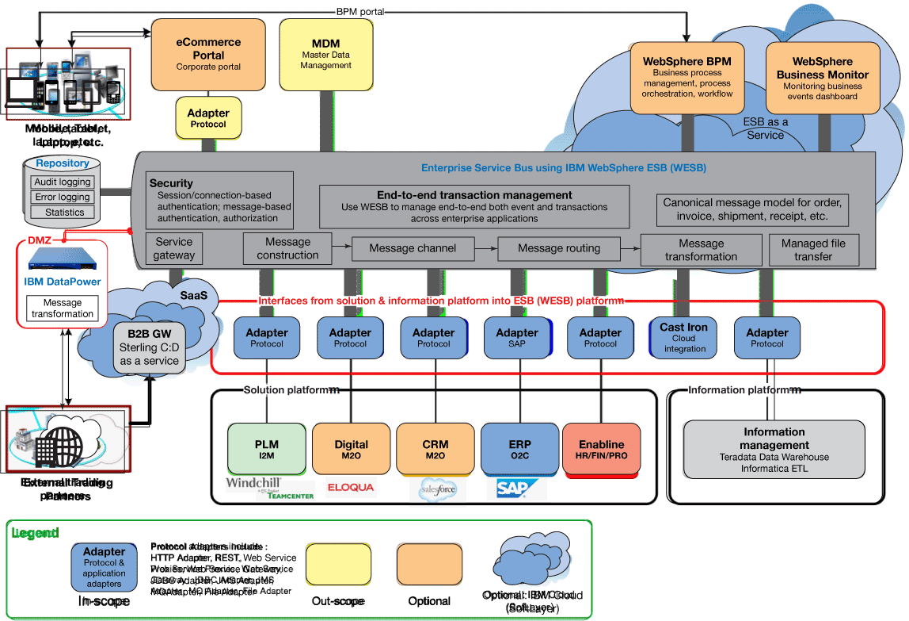

# 集成平台即服务：下一代 ESB，第 1 部分
一种新的企业集成服务交付方法

**标签:** 云计算,平台即服务

[原文链接](https://developer.ibm.com/zh/articles/cl-ipaas-next-generation-of-esb1/)

Lawrence Liu, Tony Hays, Weixin Xu, Neal Dunnigan

发布: 2015-08-10

* * *

经济挑战不断推动组织降低成本和提高企业集成服务质量，同时更有效地管理风险，比如服务级别协议、高可用性、安全性和法规遵从性。

这一关键需求促使业务和 IT 管理人员重新思考他们将如何提供企业集成服务，并确定是在内部还是通过外部云服务提供商交付那些服务。

传统的企业服务总线 (ESB) 或业务流程管理 (BPM) 实现方法是，根据特定集成需求来定制要安装在内部数据中心的软件堆栈。这样做非常耗时，且成本高昂。如果容量因为合并、收购、剥离、业务模式变化或季节性因素而增加或减少，那么维护集成平台的工作可能成为 IT 组织的一项重要任务。这些工作消耗了宝贵的资源，将人们的注意力转离了企业的核心功能，从而催生了一种新的企业集成方法，这种方法使用了基于云的集成平台即服务 (IPaaS)。

## 使用云计算实现 IPaaS 解决方案的全局观

云计算实现了集成平台转型，可让业务和 IT 更精简、更耗资少、更敏捷且更有能力。但如要恰当地实现一个 IPaaS 解决方案，则必须进行一些额外的考量。下图是一个 IPaaS 参考架构示例：

##### IPaaS 架构模型

该 IPaaS 架构模型包含多个组件，分为三个主要的层：

1. **外部（External）**：针对贸易伙伴，包括电子商务、物联网 (IoT)、移动设备等（例如互动参与体系）
2. **集成（Integration）**：包括 ESB、BPM、IBM® WebSphere® Cast Iron、IBM WebSphere Application Server、业务活动监控 (BAM)、IBM Sterling Commerce® 和预测性数据分析功能（例如交互体系）
3. **内部业务应用（Internal business application）**：包括产品生命周期管理、数字操作、客户关系管理、企业资源规划和数据仓库（例如记录系统）

IPaaS 通常将 SoftLayer 用作其基于云的解决方案，然而 IPaaS 模型同样适用于私有云、公有云或混合云解决方案。IPaaS 设置和标准操作的成本是通过使用一个基于使用量的灵活模型计算每月的费用而得出的。该模型将减少任何不必要的使用，是一个更精简的模型，这意味着您只需为实际使用量付费（按需付费）。稍后我们将详细介绍成本模型，并探讨如何使用一个服务目录计算使用量，实现成本节约。

ROI 是 IPaaS 方法的一个显著优势。最初的软硬件购置成本，连同与平台和应用程序支持相关的运行成本，被分摊到 IPaaS 消费模型中。IPaaS 方法在 8 到 10 个月就能实现一个收支平衡点，在一年内就带来实际的节省。

## IPaaS 是满足端到端企业集成需求的一个云解决方案

分析一下上面所示的 IPaaS 架构模型示例。该例中的企业集成功能超出了 ESB 的传统 SOA 概念范围。这里 IPaaS 的“集成平台”方面变得很重要。IPaaS 允许在集成解决方案中包含 ESB 以外的更多功能。IPaaS 的“即服务”方面表示，可以很轻松地使用云技术部署这些功能。这些额外的 IPaaS 功能已经可以彼此互操作，而且可快速、经济高效地逐渐让它们上线。

在这个 IPaaS 架构模型示例中，多个集成组件共同构成 IPaaS 服务。本例中的主要组件是：

- 企业服务总线 (ESB)
- 业务流程管理 (BPM)
- 业务活动监控 (BAM)
- 托管文件传输 (MFT)
- 云基础架构即服务（IaaS 和 PaaS）

特定 IPaaS 实现可使用不同种类的企业集成组件，具体的组件取决于特定要求是什么。例如，除了上面列出的组件以外，还可以添加 API Management、Electronic Data Interchange (EDI) 和实时业务分析来提供更多 IPaaS 功能。

对于本 IPaaS 示例，我们将深入探索每个主要组件及其企业集成功能。

### ESB

[ESB](https://www.ibm.com/cloud/learn/esb?mhsrc=ibmsearch_a&mhq=ESB) 是一种软件架构模型，用于设计和实现一个面向对象架构 (SOA) 中相互交互的应用程序之间的通信。ESB 帮助使应用程序之间的通信更加敏捷和灵活。

[IBM Cloud Virtual Servers](https://www.ibm.com/cloud/virtual-servers) (以前的 Integration Bus Advanced) 是基于 ESB 技术的一个可靠且灵活的集成基础。它在异构 IT 环境中提供连接和通用数据转换。它使任何规模的企业都能消除点对点连接和批量处理，不管平台、协议和数据格式是什么。

关键功能：

- 利用满足不同集成需求的强大功能来满足任何规模的项目的需求
- 帮助您的整个组织在数据流经业务应用程序和系统时提供对数据的快速访问、可见性和控制，进而制定更智慧的业务决策
- 连通大量异构应用程序和 Web 服务，消除对复杂点对点连接的需要
- 为 Microsoft® 应用程序和服务提供了广泛支持，充分利用您现有的 Microsoft.NET 技能和软件投资
- 提供一个标准化、简化和灵活的集成基础，帮助您更轻松更快捷地支持业务需求，并随业务增长扩展

Integration Bus Advanced 旨在通过提供一个平台中立的 ESB 满足这一需求，该 ESB 专为异构 IT 环境中的通用连接和转换而建。通过让您从协议和传输细节中抽象出数据，ESB 允许您分离信息分发和治理该分发的实际业务逻辑。这一功能转而在 ESB 内集中提供数据，而且可以开发可使用您的关键数据的新增值服务。

Integration Bus Advanced 提供以下多元化管理功能：

- 支持不同数据格式
- 支持单向消息传递以及请求-响应、聚合和发布-订阅模式
- 支持使用请求-回复或客户端-服务器模式的点对点应用程序
- 支持持久性和非持久性消息
- 支持全局事务（一个消息流要么全部完成，要么全部不完成）
- 基于内容的路由

此外，Integration Bus Advanced 提供了一组基于 Java™ Connector Architecture (JCA) 的集成的 IBM WebSphere 适配器（PeopleSoft、SAP 和 Siebel）。这些适配器可充当内置节点，提供：

- 应用程序适配器：SAP、Oracle EBS、JDE、Siebel、PeopleSoft
- 技术适配器：JDBC、平面文件、FTP、ECM、IBM i、IBM Domino® 和电子邮件

您还可以创建自定义适配器。

### BPM

[BPM](http://www.ibm.com/developerworks/bpm/) 被称为根据客户的需求调整组织的业务流程的一种全面管理方法。BPM 使用一种系统的方法持续提高业务效益和效率，同时追求技术创新、灵活性和集成。因此可将其描述为一个流程优化流程。

[IBM Business Automation Workflow](https://www.ibm.com/products/business-automation-workflow) (以前的 IBM Business Process Manager) 是一个全面的、可供使用的业务流程管理平台，增强了对业务流程的可见性和管理。它包括用于流程设计、执行、监控和优化的工具和运行时。它专门设计用来让流程所有者和业务用户易于直接参与其业务流程的改进。主要组件如下：

- **Process Center**：为将流程和服务部署到生产运行时提供了集中管理控制。这个可扩展的存储库和控制中心有助于组织和管理作为 BPM 项目的一部分创建的所有流程工件、应用程序和服务，并提供对所有环境的部署可见性和控制。其包含所有流程资产的共享库有利于拖放式重用，以及协作和社交实现。
- **Process Server**：容许单一 BPM 运行时支持一整套业务流程、服务编排和集成。它一致、可靠、安全地执行流程，并能保持事务的完整性。它旨在实现高可扩展性和可用性，扩展支持大容量流程自动化和优质服务。它还具有丰富的修复和可恢复性功能，比如自动重试、手动修复、补偿、存储和转发。在高级版中，它还托管集成设计器流，而且有企业服务总线功能。
    \*

IBM Business Process Manager 可帮助企业大大改善运营，强化业务用户能力，让他们直接控制组织流程，使每个新流程和 BPM 项目能反复取得成功。通过利用 IBM Business Process Manager，客户可大大提高其更改、创新和改进组织决策制定的能力，不管其身处哪一行业。

IBM Business Process Manager 完全兼容业务流程监控符号，包括事件的构造。基于 Web 的表单内置一个 WYSIWYG coach designer（建模的表单定义在内部表示为 XML）。

### BAM

BAM 是指组织内涉及客户和合作伙伴的活动的相关实时信息的聚合、分析和展示。一个业务活动可以是 BPM 编排的业务流程，也可以是包含一系列跨多个系统和应用程序的活动的业务流程。

关键 BAM 功能：

- 包含关键绩效指标的仪表板
- 对活动和性能的可见性
- 业务事件关联
- 连接到现有监控环境的能力

### MFT

[IBM Connect:Direct®](https://www.ibm.com/us-en/marketplace/high-volume-secure-file-transfer) 提供高度安全的点对点文件传输，可消除对不可靠的文件传输协议 (FTP) 传输的依赖。它专为企业内和企业间大容量可靠文件传输而优化。Sterling Connect:Direct 可为您的文件提供：

- 通过自动调度、检查点重启和自动恢复实现的可预测的可靠文件传输
- 高度安全的传输，帮助保护客户个人信息并辅助合规性措施
- 高性能，可处理要求最苛刻的工作负载，从大量小文件到几个 GB 的文件

该 MFT 服务由 IBM Sterling 作为云中一个基于使用量的服务提供。IPaaS 提供安全可靠地连接到该服务所需的功能。

### ESB 网关

[IBM App Connect](https://www.ibm.com/cloud/app-connect) (原先的 IBM WebSphere Cast Iron Cloud integration) 产品支持您在数天内集成云和内部部署应用程序，降低集成成本，以及优化软件即服务和云模型中的资源和生产力。它们提供了一种图形化配置方法（而非自定义编码、随选工具或传统中间件）来帮助您快速简单地集成应用程序。它们使用基于常见集成场景的预配置模板来加速集成。

WebSphere Cast Iron Cloud integration 产品提供了一些近实时集成功能：数据清理和迁移，数据同步和互连，使您能够编排多个应用程序间集成流程的工作流和转换。混聚功能支持您集成不同来源的信息，并使用云应用程序的原生用户界面显示此信息。WebSphere Cast Iron Cloud integration 产品还通过利用来自企业其他部分的数据和流程来支持移动应用程序。

### 云 IaaS 和 PaaS

IBM 的 IPaaS 云解决方案结合了 SoftLayer 中五个核心集成组件（ESB、BPM、BAM、MFT 和 ESB 网关）的功能，从而提供了最全面的 IPaaS 平台的简单性、可见性、管理方法和强大功能，而不牺牲资本和资源预算。通过此服务，一家公司会立即开始认识到 IBM IPaaS 提供的好处，对前期成本和资源的需求最低。此外，专家 IBM 资源会处理基础架构的可扩展性和安全性。

## 结束语

目前为止，我们探讨了推动 IPaaS 出现的技术和业务因素，以及 IPaaS 企业集成方法特有的功能和组件。在第 2 部分中，您将看到 IPaaS 作为一种服务所特有的关键属性，并了解为何这些特征让一种企业集成服务方法如此宝贵。

本文翻译自： [Integration platform as a service: The next generation of ESB, Part 1](https://developer.ibm.com/articles/cl-ipaas-next-generation-of-esb1/)（2015-07-20）