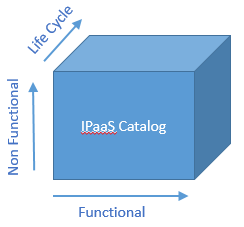
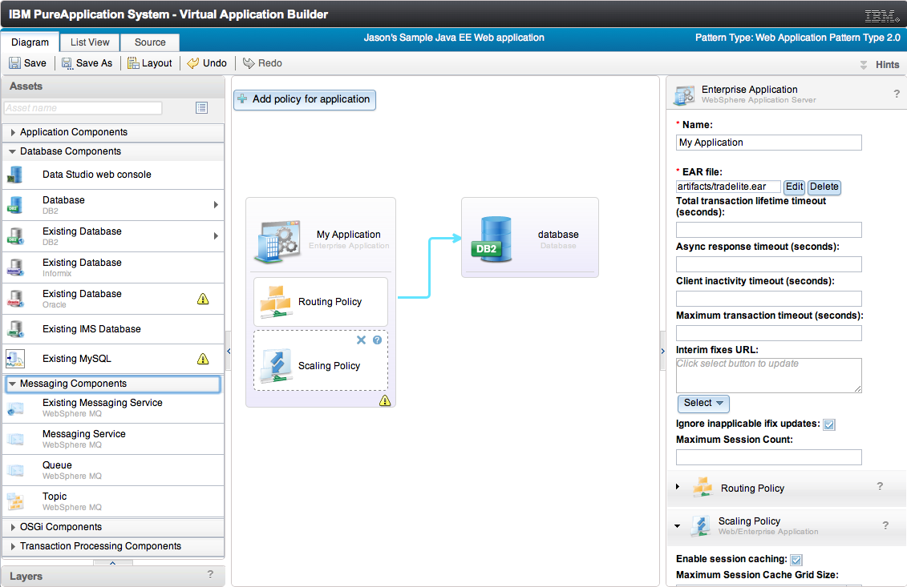
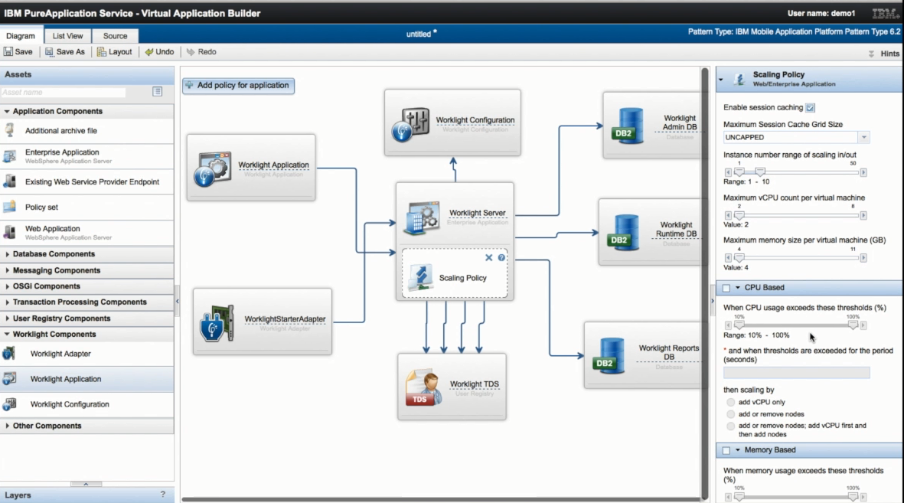
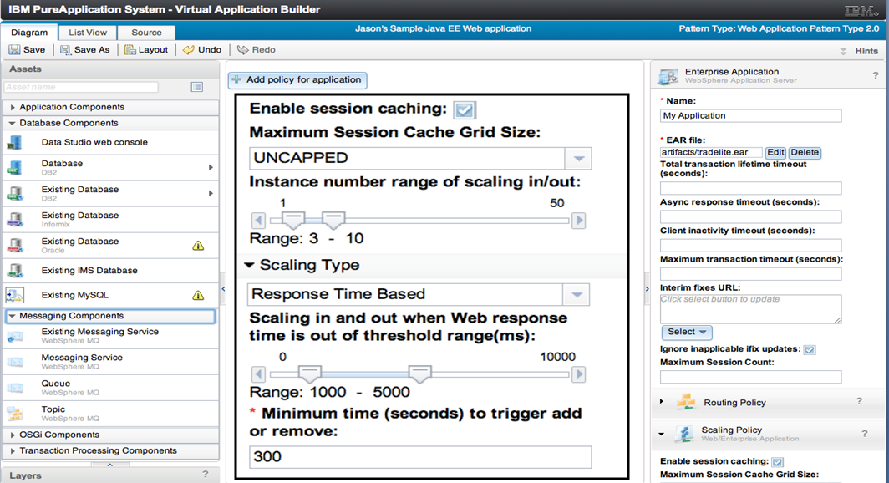
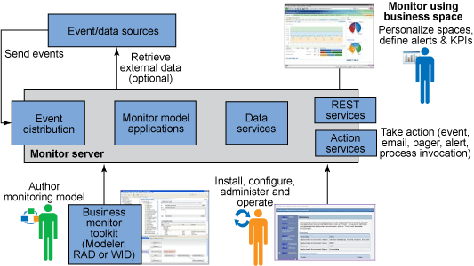
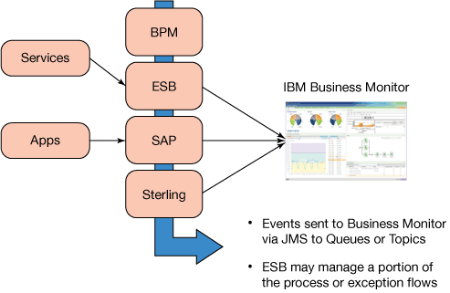
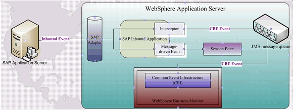

# 集成平台即服务：下一代 ESB，第 2 部分
让企业集成更上一层楼

**标签:** 云计算,平台即服务

[原文链接](https://developer.ibm.com/zh/articles/cl-ipaas-next-generation-of-esb2/)

Lawrence Liu, Tony Hays, Weixin Xu, Neal Dunnigan

发布: 2015-08-24

* * *

## IPaaS 特征

IPaaS 是采用了云计算技术的一种新的集成解决方案模型。它具有一定的弹性，可以扩展，而且使用一种基于消费的模型来实现显著的成本节约。通过选择这个解决方案，而不是使用公司已拥有的数据中心，企业可以实现显著的投资回报。这种基于消费的模型是在实际使用的基础上来计算费用的，因此它会在 CPU、内存、存储、软件和集成服务空闲时实现进一步的节省。

### 基于消费的模型

IPaaS 中的这种基于消费的模型的本质是，服务平台总是知道谁在使用哪些服务、持续使用了多久，以及何时在使用服务。IPaaS 消费模型的主要外部指标是 IPaaS 服务的使用。由于 IPaaS 产品被预先设计为在所有硬件变量上提供平稳的价格，它还提供了针对运营管理和应用管理支持的考虑事项，所有与 IPaaS 相关的成本都被汇总到了 IPaaS 服务水平中，与这些服务的使用有关。

可以构建 IPaaS 解决方案，使其在所有单租户或多租户环境中发挥作用。当某个客户正在寻找能够向其客户提供基于多租户 SaaS 的解决方案的方法时，在这种情况下，底层 IPaaS 集成架构必须为此提供支持。这与企业间的 API 设计非常相似。即使该解决方案是单租户的，IPaaS 服务通常仍然是企业级的，而且必须支持各种企业和他们的贸易伙伴。因此，IPaaS 支持多个视图，以便报告服务使用情况。

记录和报告 IPaaS 服务使用情况有两个主要目的：

- 监视营业期内的综合能力的使用情况，从而允许提供适当的预测能力
- 根据 IPaaS 服务的使用情况，提供获得折扣的能力或其他成本回收计划

为了支持这种基于消费的模型，IPaaS 提供了一些技术能力，以便对业务事件应用报告分析，将多个 IPaaS 组成部分的业务事件的参与情况相关联，并确定围绕每个业务事件的完整的业务上下文。

### 快速弹性

需求可能因多种原因而各不相同。 例如：

- 季节性或特定于事件的业务模式可能促进生产使用中的尖峰和低谷的产生
- 测试使用取决于后端变化，增强记录的主要系统需要一套完整的端到端验收和性能测试，包括 IPaaS

IPaaS 专门设计用于快速扩展和收缩，以适应需求中的变化。这是可以实现的，因为 IPaaS 环境构建于 IaaS 和 PaaS 云产品的特性和功能的基础上，所以没有为 IPaaS 重新发明这些底层服务。针对更多容量的 IPaaS 服务请求将在底层 IaaS 和 PaaS 云设置服务上自动调用。此外，IPaaS 目录被预先设计为专为 IPaaS 功能服务提供请求。这与云架构和开源计划（比如 Cloud Foundry、Docker 和 OpenStack）的整体理念是一致的。这个 IPaaS 前期工程提供了跨硬件变量的平稳价格，还提供了针对运营管理和应用管理支持的考虑事项。

### 服务目录

服务目录是理解 IPaaS 交付模型的丰富性的关键。在过去，某个 ESB 的能力被定义为一组已实现的事务/消息模式。现在，借助 IPaaS，我们有了一个更有效的方法。IPaaS 被定义为一组标准化的、可选择的业务功能（即服务）。这有助于将这些服务设想为以下三个等级：

- **功能性**：这些服务定义了可由 IPaaS 提供的业务能力领域；例如，企业服务总线 (ESB)、业务流程管理 (BPM)、API 管理、托管文件传输 (MFT) 和电子数据交换 (EDI)。
- **非功能性**：这些服务启用了 IPaaS 功能性服务的服务质量 (QOS) 属性。例如，客户可以从目录中选择一个 ESB 服务，但在生产实例中，可能有不同的 QOS 特征，这些特征与用于测试的实例中的特征不同。非功能性服务允许客户选择服务水平来满足其特定的 QOS 需求（比如高可用性、持续可用性、响应时间和吞吐率）。
- **生命周期**：有一些必需的底层创建/读取/更新/删除 (CRUD) 服务，用于在 IPaaS 中提供按需可扩展性。例如，可以在 IPaaS 功能性服务下添加额外的节点，然后移除它们，或者将它们重新定位到另一个服务中心。

从这个角度来看，可以将 IPaaS 服务目录视为一个三维产品模型。

##### IPaaS 服务目录中的服务类

关于 IPaaS 服务目录的另一个重要考虑事项是：必要的硬件、软件、配置、拓扑和支持是标准化和预定义的。这意味着无需执行新的开发工作来支持 IPaaS 服务目录中的服务。这还意味着，IPaaS 服务目录中的服务之间不存在可能导致在运行时发现 IPaaS 服务不匹配的兼容性问题。

### PureApplication System 和 IPaaS

在 IPaaS 平台上，轻松部署和移动基础架构平台（比如 BPM 和 ESB）和企业应用程序的关键是使用模式。通过将许多平台环境配置和部署步骤捕获到某个定义好的模式中，IPaaS 可以自动将复杂的平台架构和部署模型转变为一种易于部署的形式。这种基于预建模式的克隆方法减少了因为采用人工任务和错误的方程式而产生的时间、成本和风险。一旦创建了模式，就可以在外部和本地云环境中使用它，不必针对每个环境重新调整它，就可以提供无缝的可移植性。基于模式的方法使得服务可以添加到 IPaaS 中的服务目录中，并确保与 IPaaS 中的其他组件相兼容。

尽管这些模式简化了跨混合云选项的应用程序配置和可移植性，仍然需要一个预先集成的、自动化的应用环境来简化和缩短应用程序的生命周期。借助 [IBM® PureApplication®](http://www.ibm.com/ibm/puresystems/us/en/pf_pureapplication.html) 解决方案，就可以根据该模式中包含的各项政策和服务水平需求来自动化已部署模式的监控和生命周期管理。应用程序的底层基础架构和平台需求会得到动态调整，以满足这些服务水平。

尤其值得一提的是， [IBM Business Process Manager Pattern V8.5.5](http://www-01.ibm.com/support/knowledgecenter/SSRQ5X_8.5.5/com.ibm.wbpm.cloud.vap.doc/kc-homepage-priclo.html) 提供了 BPM 和 ESB 的一个模式配置，该配置已经过优化，可用于 [IBM PureApplication Service on SoftLayer](http://www.ibm.com/ibm/puresystems/us/en/hybrid-cloud/) 。IBM Business Process Manager Pattern（以前公布为 IBM Business Process Manager Application Pattern）已进行了优化，可通过以下方式帮助加快复杂的、高度可用的业务流程环境的建立和管理：

- 引入了弹性伸缩策略，自动检测何时应该增加配置能力，以满足流程解决方案中不断增长的需求
- 促进复杂的、高度可用的 IPaaS 配置的流线化设置和管理，这些配置已针对开发、测试或生产用途进行了优化
- 启用了关键资源，将更多资源放在增值活动上，并在安装、配置和管理上投放了更少的资源
- 帮助加快整个企业中从一个项目到一个计划的业务流程管理的扩展

[IBM SoftLayer](http://www.softlayer.com/) 为动态的混合环境中的其他部分提供了 IBM 的场外云基础架构服务。 [PureApplication Service on SoftLayer](http://www.ibm.com/ibm/puresystems/us/en/hybrid-cloud/) 允许客户自动化和管理外部的 SoftLayer 基础架构服务，以便轻松容易地将它们用于客户端企业应用程序。PureApplication Service on SoftLayer 运行在 SoftLayer 内的单独的基础架构环境中（计算、存储和网络），以保持 IPaaS 工作负载的安全。

因此，PureApplication Service on SoftLayer 已被引入 IPaaS 框架，具有拓展业务空间的能力。云可以是各种思想的孵化器，帮助组织采用比以往任何时候都更加灵活的方式，不断地测试、调整和部署新的创新。

IBM PureApplication Service on SoftLayer 提供了一些工具和脚本来轻松管理 IPaaS 模式，并实现持续交付（配置、部署、版本控制和集成底层应用程序）。下面三幅图说明了 PureApplication Service on SoftLayer 的功能。

##### 易于部署、基于模式的应用程序

##### 弹性伸缩服务：基于模式的工作负载控制

##### 弹性伸缩：设置动态自动缩放

此 IPaaS 架构中的所有 IBM 产品（ESB、BPM 和连接器）都被设计为支持应用服务器和数据库服务器的集群，以提高可伸缩性和可用性。随着交易额和用户人口的增长，更多的服务器实例可以动态添加到 IPaaS，以便支持增加的负载。

构建 IPaaS 解决方案是为了通过扩展来支持世界上最大的部署，提供跨所有行业的企业集成解决方案。IBM 的客户成功实现了企业整合，基于此专业知识，为数以万计的用户和数百个流程提供了 BPM 解决方案。IBM 开发了一个 [BPM 采用情况路线图](http://www.redbooks.ibm.com/redbooks/pdfs/sg247973.pdf)，从一个速赢试点项目开始着手，推广到企业范围内使用。此外，可以在各个级别上维护所有流程、流程工件、治理和部署的管理与控制，促进实现内部或外部需求或任务。

## 挑战和业务考虑事项

解决实现 IPaaS 的难题需要获得来自高层管理人员的坚定承诺，还需要做一些工作来迁移平台和新的服务模型。但采用这种新的 IPaaS 模型作为其集成解决方案的企业也获得了许多好处，比如成本节约、灵活性、弹性、规范化、服务质量提高。

业务考虑事项可能是安全性和法规遵从：SOX、FDA、HIPPA，ICS410，以及需要内部实现或者作为一个私有/公共云解决方案来实现的其他考虑事项。不过，基于云计算的解决方案需要更仔细地进行审核和认证，以确保满足所有业务需求。

### 安全性和网络

在进行任何云部署时，安全性和网络可能是重点关注的问题。IPaaS 构建于底层 IaaS 框架之上，该框架提供了针对拒绝服务和渗透攻击的基本保护。有一种看法认为，私有云提供了更高的安全性 — 事实并非如此。商业云提供商对关键任务的安全性倍加关注，往往将更多的资源投入到使用最新的安全标准上，而不是投入到内部实现上。云安全性并不难驾驭，而且有许多与云安全性相关的国际标准，其中包括：

- ISO 27000 系列的安全性和隐私标准
- ISO 27001 与 ISO 27002 – IT 安全云计算在安全性和隐私方面的影响的基础
- ISO 27017 – 云服务的安全性
- ISO 27018 – 云服务的数据保护（即隐私保护）

IPaaS 实现通常涉及混合云和记录系统，它们通常位于客户端位置或私有云中，而参与系统和互动系统被分布在一些混合公共云和私有云上。这些组件之间的 VPN 型连接提供了优于网络传输所提供的物理安全性的安全水平。

从企业集成角度来看，重要的是确保返回到托管在组织中的某个应用程序的连接数据也是受保护的。SSL 通信（特别是使用证书实现的双向 SSL 通信，甚至是通过 VPN 实现的 SSL 通信）为 IPaaS 组件中和 IPaaS 组件之间的应用程序通信添加了另一层保护。使用的证书不能有太长的寿命（最多几个月到一年）。应该使用自签名证书和自定义信任存储来限制妥协证书的影响，并确保证书颁发机构不是在云上。

此外，基于标准的消息级安全性被内置于 IPaaS 组件中。这些都基于 [Web 服务互操作性 (WS-I) 标准](http://www-01.ibm.com/support/knowledgecenter/SS4JCV_7.5.5/org.eclipse.jst.ws.doc.user/concepts/cwsiover.html)。与消息级安全性和完整性相关的更多重要标准是：

- WS-Policy
- WS-Security
- WS-Secure Conversation
- WS-Trust
- WS-ReliableMessaging
- WS-Reliability

这些标准共同提供了具有三个安全级别（基础架构、组件和消息）的 IPaaS 解决方案，这些解决方案都是基于标准的，被设计成 IPaaS 组件和基础架构的结构。

### 监控和审计

IBM Business Monitor 为您的业务流程提供了实时业务活动监控，无论在何处执行这些流程。在 IPaaS 解决方案中，业务活动监控 (BAM) 能够可视化 BPM 应用程序、ESB 服务和企业应用程序（比如 SAP 或 Oracle）生成的整体业务性能。监控仪表板可同时在单个实例级别和总体级别上显示数据，并提供先进的多维分析。这种监控数据还可以用于审计事件，追踪谁正在请求服务以及请求服务的时间。

实质上，IBM Business Monitor 将会处理表示业务事件的 XML，提取业务相关性的测量数据，并将这些数据存储到数据库中。仪表盘会查询数据库，显示与某个业务用户相关的信息。不管应用程序是如何实现的（无论是用 Java® 、C ++、COBOL，还是用其他语言），不管应用程序在何处运行（无论是移动设备、个人计算机，还是一台主机上），只要它向 IBM Business Monitor 提供了这样的 XML，应用程序就可以享受业务活动监控带来的好处。

##### IBM Business Monitor in IPaaS

启用下面的 IPaaS 组件来实现自动事件发射 (automatic event emission)；开发人员可以只检查一个盒子，事件将会流动，无需任何编码：

- IBM 业务流程管理
- IBM 集成总线
- IBM 应用程序适配器（SAP、Oracle、JDBC、MQ，等等）
- IBM Sterling Integrator

##### IPaaS 集成式业务事件报告

例如，现在，可以直接通过 IBM Business Monitor 监视来自 SAP 在线目录订单应用程序的事件（这些应用程序将会处理客户所下的订单），无需生成或实现中介模块。SAP 软件的适配器将会侦听 SAP 应用程序中的下单活动，并将事件和有效负载转发给 IBM Business Monitor。所有与客户下单相关的业务活动都发生在 IPaaS 中，由 IBM Business Monitor 监控。以下是一些您可以跟踪的关键性能指标，以便让您的应用程序在 IPaaS 中正常运行：

- 已处理订单的总数
- 所有已下订单的总价
- 所有已下订单的平均价格
- 平均订单处理时间

##### 将业务应用程序事件集成到 IPaaS 中

此外，IBM 控制中心（前身是 Sterling 控制中心）可以将事件发送到 IBM Business Monitor，描述许多 Sterling 品牌产品中出现的文件传输活动。这使您的企业用户能够获得这类活动的可见性，并管理与这类活动相关的服务水平协议 (SLA)。

### 性能和 SLA

IPaaS 被设想为企业集成的一个交钥匙方法。IPaaS 提供一些预先设计的模式和配置。还可以根据需要从 IPaaS 服务目录中调用特定的功能。因此，IPaaS 用户期望能够保证整体性能和 SLA。

IPaaS 实质上能够处理高事务量，并具有最小的延迟。在幕后，IPaaS 拥有多个可以针对不同类型的处理进行专门优化的组件。例如，EDI 转换和基于内容的消息路由可通过单独的部件进行处理，每个组件都针对其目标进行了优化。

在结构上，IPaaS 使得针对可用性冗余和工作负载分布的集群得到广泛使用。底层 IPaaS 是 IaaS 和 SaaS 的云技术，它们当然还支持可用性冗余和工作负载分布。

最终结果是，服务目录中列出的 IPaaS 服务是经过精心设计的，以便以目录中列出 SLA 的概率或更高的概率执行它。

## 潜在市场：Watson、预测分析和 IPaaS

在 IPaaS 模型中，参与系统通过交互系统将事务发送给记录系统。IPaaS 本身是交互系统的一个组件。在较早的计算模型中，记录系统会处理数据，但它们的用例很少包含事务分析模式。这项功能留给了业务分析（即洞察系统），而且经常通过某种形式的数据仓库在后处理模式下执行。

随着物联网的兴起，动态交通模式关系变得更加重要。它们必须是实时相关的，而且业务数据可能跨越多个记录系统的域。IPaaS 在这里提供了增值，可用作整合业务事件的实时来源。与早期的企业集成模型不同，IPaaS 非常清楚围绕业务事件的背景，可充当预测分析的来源。欺诈检测是一个快速增长的领域，正迅速从多个来源扩展其实时业务数据的使用。但是，有许多可能的实时预测分析的应用。例如，根据对 IPaaS 交通模式的观察来实时关联和重新定位社交媒体活动，这是一个包含许多用例的领域。

当然，IPaaS 所做的事情之一就是让企业使用和提供 API 服务。在这种情况下，IPaaS 本身可以是 API 服务的一名用户；例如，调用 Watson API 来分析其自身交通模式下的元数据。

## 结束语

本文探讨了以下主题：IPaaS 如何超越 ESB 的原始的面向服务的架构理念，以便提供全面的企业集成功能。本文讨论了市场中技术导致的变化（例如云、物联网 和 API 经济）如何推动针对这些额外的企业集成功能的需求。最重要的是，本文讨论了以下情形：通过利用基本云技术和采取一个服务方法来实现 IPaaS 交付，现在，从成本、实现和持续支持的角度更容易实现增强的企业集成功能。

本文翻译自： [Integration platform as a service: The next generation of ESB, Part 2](https://developer.ibm.com/articles/cl-ipaas-next-generation-of-esb2/)（2015-07-31）