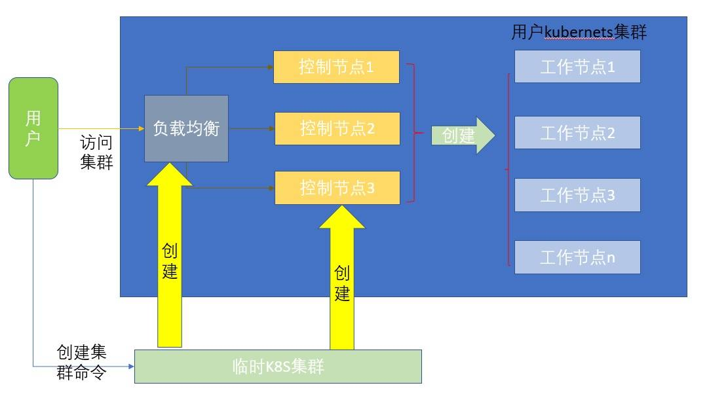

# 集群 API (Cluster API) 进阶
CoreOS 以及集群扩展在 OpenStack 上的实现

**标签:** API 管理,云计算,基础架构,容器

[原文链接](https://developer.ibm.com/zh/articles/cl-lo-cluster-api-advanced/)

纪 晨

发布: 2019-10-30

* * *

## 概览

随着 Kubernetes 逐步成为容器 orchestrator 领域的事实标准，在 Kubernetes 生态领域周边有例如 Cluster API、Cloud Provider 等很多项目。本文介绍了 Cluster API 这个项目在 OpenStack 上的实现；同时，本文也介绍了 CoreOS 这个容器化操作系统如何在 Cluster API 上使用。

## Cluster API 以及 cluster-api-provider-openstack 简介

Cluster API 是一个 Kubernetes 之上的可选项目，它使用 Kuberentes 原生方式来创建、配置和管理集群（Cluster）。本文假设读者已经对 Cluster API 有一定了解，关于 Cluster API 使用、范围等内容可以参考 [此处](https://github.com/kubernetes-sigs/cluster-api/blob/master/docs/scope-and-objectives.md)；关于 Cluster API 的基本概念和操作可以参考 [这篇文章](https://www.ibm.com/developerworks/cn/cloud/library/cluster-api-manage-your-kubernetes-cluster-in-a-kubernetes-way/index.html)。

Cluster API 作为通用的 Kubernetes 集群管理框架，许多不同种类的云提供商都以 Cluster API 为基础，您可从 [这里](https://github.com/kubernetes-sigs/cluster-api) 获取云提供商的完整列表。其中基于 OpenStack 的实现为 cluster-api-provider-openstack，为了简单起见，本文使用缩写 CAPO 代表 cluster-api-provider-openstack。

## CoreOS 简介

**_CoreOS_** 是一个基于 Linux 内核的轻量级操作系统，面向云和集群为主，其主要的优势是一致、安全、可靠。关于 CoreOS 具体可以参考 [官方文档](https://coreos.com/)。

CoreOS 作为云原生操作系统，ignition 是其很有特色以及和普通 Linux 不一样的地方。下面这个 ignition 实例的主要目的就是将生成的公钥注入到部署的虚拟机里，这样当 CoreOS 启动之后，可以通过公钥对应的私钥 ssh 登录。

```
{
"ignition": {
"config": {},
"timeouts": {},
"version": "3.0.0"
},
"networkd": {},
"passwd": {
"users": [
{
"name": "core",
"sshAuthorizedKeys": [
"ssh-rsa ABCD..."
]
}
]
},
"storage": {},
"systemd": {
}

```

Show moreShow more icon

OpenStack 的 ingition 可以参考该 [文档](https://coreos.com/os/docs/latest/booting-on-openstack.html)。CAPO 使用了 ignition 来初始化 CoreOS。

## CoreOS 在 CAPO 中的使用

在 CAPO 中默认主要通过如下几个配置文件：cluster.yaml 中主要定义集群，例如集群的网络、master IP 地址等；machines.yaml 定义所有的机器，例如规格、网络、安全组等；provider-components.yaml 定义 role、secret 等，其中最重要的就是 worker-user-data 和 master-user-data 两个 secret。

```
apiVersion: "cluster.k8s.io/v1alpha1"
kind: Cluster
metadata:
name: test1
spec:
clusterNetwork:
services:
cidrBlocks: ["10.96.0.0/12"]
pods:
cidrBlocks: ["192.168.0.0/16"]
serviceDomain: "cluster.local"
providerSpec:
value:
apiVersion: "openstackproviderconfig/v1alpha1"
kind: "OpenstackProviderSpec"
clusterConfiguration:
controlPlaneEndpoint: 9.20.206.208:6443
kubernetesVersion: 1.15.0

```

Show moreShow more icon

CAPO 逻辑上可以拆分成为 infra（也就是虚拟机和其他诸如存储、负载均衡等相关资源）和 Kubernetes 控制和计算节点创建； 当前 Kubernetes 的创建是通过注入启动脚本来实现的，CAPO 现在支持 Ubuntu、CentOS、CoreOS，Ubuntu 和 CentOS 使用的是 cloud-init，CoreOS 使用的是 ignition。而 cloud-init 或者 ignition 的内容就是通过上述 worker-user-data 和 master-user-data 来完成的。

如下是针对 CoreOS 和非 CoreOS 创建的区别：

```
if [[ "$PROVIDER_OS" == "coreos" ]]; then
cat $COREOS_COMMON_SECTION \
| sed -e "s#\$OPENSTACK_CLOUD_PROVIDER_CONF#$OPENSTACK_CLOUD_PROVIDER_CONF#" \
| sed -e "s#\$OPENSTACK_CLOUD_CACERT_CONFIG#$OPENSTACK_CLOUD_CACERT_CONFIG#" \
| yq m -a - $COREOS_MASTER_SECTION  \
> $COREOS_MASTER_USER_DATA
cat $COREOS_COMMON_SECTION \
| sed -e "s#\$OPENSTACK_CLOUD_PROVIDER_CONF#$OPENSTACK_CLOUD_PROVIDER_CONF#" \
| sed -e "s#\$OPENSTACK_CLOUD_CACERT_CONFIG#$OPENSTACK_CLOUD_CACERT_CONFIG#" \
| yq m -a - $COREOS_WORKER_SECTION  \
> $COREOS_WORKER_USER_DATA
else
cat "$MASTER_USER_DATA" \
| sed -e "s#\$OPENSTACK_CLOUD_PROVIDER_CONF#$OPENSTACK_CLOUD_PROVIDER_CONF#" \
| sed -e "s#\$OPENSTACK_CLOUD_CACERT_CONFIG#$OPENSTACK_CLOUD_CACERT_CONFIG#" \
> $USERDATA/$PROVIDER_OS/master-user-data.sh
cat "$WORKER_USER_DATA" \
| sed -e "s#\$OPENSTACK_CLOUD_PROVIDER_CONF#$OPENSTACK_CLOUD_PROVIDER_CONF#" \
| sed -e "s#\$OPENSTACK_CLOUD_CACERT_CONFIG#$OPENSTACK_CLOUD_CACERT_CONFIG#" \
> $USERDATA/$PROVIDER_OS/worker-user-data.sh
Fi

```

Show moreShow more icon

通过如下命令，可以通过预先定义的模板生成最终的 ignition 文件:

```
./generate-yaml.sh clouds.yaml openstack coreos output

```

Show moreShow more icon

当控制节点启动的时候，ignition 会由 systemd 触发执行，从而会完成一系列初始化动作，例如创建临时目录，创建需要的配置文件，然后执行其中最核心的 kubeadm 启动脚本完成 Kubernetes 集群的创建。

当控制节点完成 Kubernetes 集群的创建之后，所有的之前在临时集群的 Kubernetes 的对象都会被转移到新创建的控制集群里，之后开始创建工作节点，同控制节点一样，工作节点也会执行 ingition，工作节点的 ignition 和控制节点的不同，主要是通过 kubeadm join 来加入控制节点。

创建 CNI 和 CRICTL：

```
systemd:
      units:
     ...
      - contents: |
      [Unit]
      Description=Unpack CNI and CRICTL into the right places.
      Before=kubelet.service

      [Service]
      Type=oneshot
      ExecStartPre=/usr/bin/tar -C /opt/bin -xzf /opt/kubetmp/crictl.tar.gz
      ExecStart=/usr/bin/tar -C /opt/cni/bin -xzf /opt/kubetmp/cni-plugins.tar.gz
      ExecStartPost=/usr/bin/systemctl disable unpack.service

      [Install]
      WantedBy=multi-user.target
      enabled: true
      name: unpack.service

      创建 Kubernetes 控制面：
      systemd:
      units:
     ....
      - contents: |-
      [Unit]
      Description=Initialise Kubernetes control plane node.
      After=kubelet.service
      Requires=coreos-metadata.service

      [Service]
      Type=oneshot
      Environment="PATH=/usr/bin:/usr/sbin:/opt/bin:/opt/cni/bin:/bin/sbin"
      ExecStartPre=/opt/bin/prepare.sh
      ExecStart=/opt/bin/kubeadm init --config /etc/kubernetes/kubeadm_config.yaml
      ExecStartPost=/opt/bin/kubectl --kubeconfig /etc/kubernetes/kubelet.conf annotate --overwrite node %H machine={{ .Machine.ObjectMeta.Namespace }}/{{ .Machine.ObjectMeta.Name }}
      ExecStartPost=/opt/bin/kubectl --kubeconfig /etc/kubernetes/admin.conf apply -f https://docs.projectcalico.org/v3.6/getting-started/kubernetes/installation/hosted/kubernetes-datastore/calico-networking/1.7/calico.yaml
      ExecStartPost=/usr/bin/systemctl disable kubeadm.service

      [Install]
      WantedBy=multi-user.target
      enabled: true
      name: kubeadm.service

```

Show moreShow more icon

生成 ignition 模板可以参考 [这里](https://github.com/kubernetes-sigs/cluster-api-provider-openstack/tree/release-0.1/cmd/clusterctl/examples/openstack/provider-component/user-data/coreos/templates)。

## 多控制节点在 CAPO 中的使用

Kubernetes 通过多个控制节点来支持高可用，kubeadm 这个项目已经支持了高可用的设置，CAPO 利用了 kubeadm 的这个功能，在控制节点启动时候决定是创建还是加入 Kubernetes 控制节点。

Opentsack 通过 octavia 项目支持负载均衡，octavia 是 OpenStack 的一个子项目，CAPO 通过 gophercloud 这个项目的 golang 接口来创建和管理负载均衡器。Octavia 的具体使用办法可以参考 [这里](https://docs.openstack.org/octavia/latest/reference/introduction.html)。

##### 图 1\. 带负载均衡器的 Kubernetes 集群



CAPO 通过大致如下步骤来完成多控制节点集群创建，具体的细节本文篇幅有限，不能详细介绍。

1. clusterctl 使用 kind 或者 minikube 创建一个临时集群，创建临时集群的目的是创建一个 Kubernetes 环境，可以把 Kubernetes 定义的对象从 yaml 定义加入到 etcd 中，这个临时集群最终会被删除或保留。
2. 临时集群 CAPO 的容器的集群控制器（Cluster Controller）观察到需要创建负载均衡器，会通过调用 octavia 创建一个负载均衡器，这个负载均衡器会创建监听对象等。
3. clusterctl 根据 machines 的定义创建多个虚拟机共同组成控制面，如前所示，如果采用 CoreOS，会使用 CoreOS 的镜像以及执行 CoreOS 的启动脚本 (ignition)。
4. 第一个虚拟机通过 kubeadm 创建集群控制面，当完成之后 CAPO 容器的机器控制器 (machine Controller) 会把该虚拟机加入之前创建的负载均衡器成为它的第一个成员。
5. 此后，其他创建的虚拟机加入之前的控制面并加入负载均衡器成为其成员。
6. 控制权从临时集群交给创建的集群，主要的工作是把所有在临时集群的定义通过 pivot 这个方法在新集群的 etcd 里加入 machines、cluster 等定义。
7. 根据用户的 Machines 定义创建工作节点，并作为 node 加入之前创建的新集群。
8. 根据用户的选择（默认是删除）删除临时集群。
9. 从此用户可以通过负载均衡器的 ip 和端口来访问新的集群。

CAPO 加入负载均衡器的配置如下：

managedAPIServerLoadBalancer 代表创建负载均衡器与否，只有选择 true 才会创建，否则就会创建一个单机的没有高可用的 Kubernetes 控制面。

useOctavia 代表使用 Octavia 与否，openstack neutron lbaas 也支持负载均衡器，但 Octavia 提供更强大的功能，并且很快 neutron lbaas 也会被删除，所以推荐使用 Octavia。

APIServerLoadBalancerFloatingIP 代表负载均衡器的 IP 地址。

```
apiVersion: "cluster.k8s.io/v1alpha1"
kind: Cluster
metadata:
name: test1
spec:
......
    providerSpec:
      value:
......
        managedAPIServerLoadBalancer: true
        useOctavia: true
        APIServerLoadBalancerFloatingIP: 1.2.3.4
        clusterConfiguration:
          controlPlaneEndpoint: 1.2.3.4:6443
          kubernetesVersion: 1.15.0

```

Show moreShow more icon

## Cluster API 的演进和开发

Cluster API 的第一版 v1alpha1 有一些技术性的问题， [这篇文档](https://github.com/kubernetes-sigs/cluster-api/blob/master/docs/proposals/20190610-machine-states-preboot-bootstrapping.md) 有很详细的介绍，总结如下：

1. 单个 provider 提供基础架构也提供 Kubernetes 会带来很多限制，v1alpha1 中如果在一个提供商上增加新的 Kubernetes 的支持类如 Rancher、Openshift 等需要提供商提供支持。
2. 每一个 Provider 都提供自己的配置和状态，这个是通过 RAW 形式存在的因此没有办法验证参数的有效性。
3. 在同一个 Cluster 中不能支持不同的 provider，不能支持异构云。

通过 v1alpha2 的演进能够做到：

1. 通过 Kubernetes 控制器管理（虚拟）机
2. Bootstrap 实现可以在 provider 之间共享
3. 支持 cloud-init、ignition 等不同的启动引擎
4. 在同一个 provider 上支持不同的 Kubernetes 发行版，例如原生 Kubernetes、openshift 等
5. 尽早的验证 provider 特定的内容符合 API 格式

CAPO 的 [master 分支](https://github.com/kubernetes-sigs/cluster-api-provider-openstack/tree/release-0.1/cmd/clusterctl/examples/openstack/provider-component/user-data/coreos/templates) 正在快速跟进 Cluster API 的 v1alpha2 开发中。

## 结束语

本文介绍了 CoreOS 和 CAPO 的基本概念以及在 CAPO 中使用 CoreOS 的方法，以及如何在 CAPO 中使用负载均衡器创建和管理多个控制节点，最后介绍了 Cluster-API 从 v1alpha1 到 v1alpha2 的演进。